Slingshot UMAP clustering with macrophage differentiation
================

By Slingshot package, re-define the given umap cluster and draw global
lineage structure of multiple clusters by various types of standards.

Data of this analysis is based on the following paper: Kwon, M., An, M.,
Klempner, S. J., Lee, H., Kim, K. M., Sa, J. K., … & Lee, J. (2021).
Determinants of response and intrinsic resistance to PD-1 blockade in
microsatellite instability–high gastric cancer. Cancer discovery, 11(9),
2168-2185.
<https://aacrjournals.org/cancerdiscovery/article/11/9/2168/666225/Determinants-of-Response-and-Intrinsic-Resistance>

``` r
library(Seurat)
```

# Data Preparation

## Load Data

``` r
# Load Mac_cytof.rda from the working directory
load("Mac_cytof.rda")
```

``` r
# Check the structure of the loaded Seurat object
# str(Mac)
```

``` r
# Show UMAP
DimPlot(Mac, reduction = "umap", group.by = "seurat_clusters", label = TRUE)
```

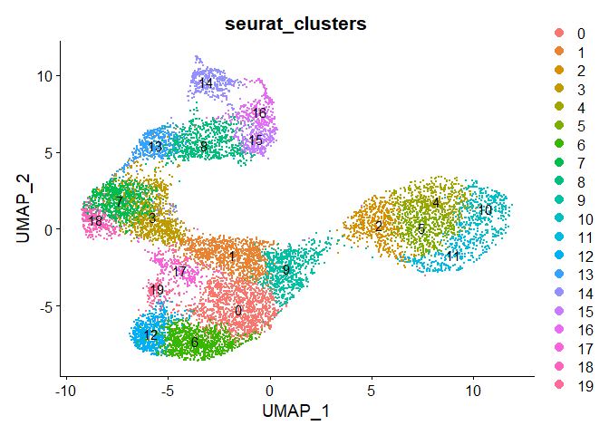<!-- -->

``` r
# Show UMAP
DimPlot(Mac, reduction = "umap", group.by = "annot_3rd", label = TRUE)
```

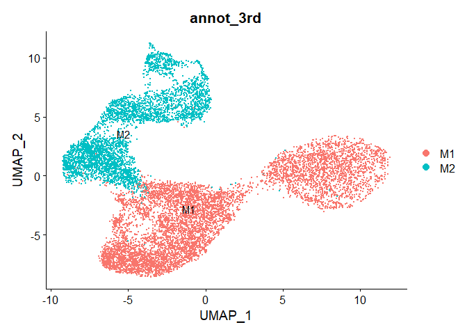<!-- -->

``` r
DimPlot(Mac, reduction = "umap", group.by = "annot_4th", label = TRUE)
```

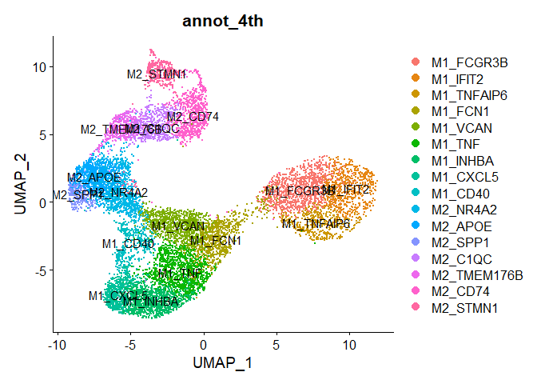<!-- -->

``` r
table(Mac$Time)
```

    ## 
    ##    B   F1 
    ## 5414 6290

``` r
DimPlot(Mac, reduction = "umap", group.by = "Time", label = TRUE)
```

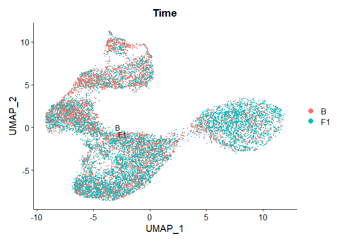<!-- -->
It seems timepoints are not well separated in the UMAP space, but this
will be applied as a background information for the lineage structure.

## Re-labelling Clusters

Types of the Macrophage differentiation for analysis are given as
below: - Monocyte-like macrophage - Pro-inflammatory macrophage -
Anti-inflammatory macrophage - Resident macrophage

``` r
# Define a dictionary for re-labeling clusters
new_labels <- c(
  "2" = "Monocyte-like macrophage",
  "4" = "Monocyte-like macrophage",
  "5" = "Monocyte-like macrophage",
  "9" = "Monocyte-like macrophage",
  "10" = "Monocyte-like macrophage",
  "11" = "Monocyte-like macrophage",
  
  "0" = "Pro-inflammatory macrophage",
  "1" = "Pro-inflammatory macrophage",
  "6" = "Pro-inflammatory macrophage",
  "12" = "Pro-inflammatory macrophage",
  "17" = "Pro-inflammatory macrophage",
  "19" = "Pro-inflammatory macrophage",
  
  "3" = "Anti-inflammatory macrophage",
  "7" = "Anti-inflammatory macrophage",
  "13" = "Anti-inflammatory macrophage",
  "18" = "Anti-inflammatory macrophage",
  
  "8" = "Resident macrophage",
  "14" = "Resident macrophage",
  "15" = "Resident macrophage",
  "16" = "Resident macrophage"
)

# Add a new column to Seurat meta.data
Mac$macrophage_differentiation <- as.character(new_labels[as.character(Mac$seurat_clusters)])
```

``` r
library(ggplot2)
DimPlot(Mac, reduction = "umap", group.by = "macrophage_differentiation", label = FALSE, repel = TRUE) +
  ggtitle("Macrophage differentiation (re-labeled from clusters)") +
  theme_minimal()
```

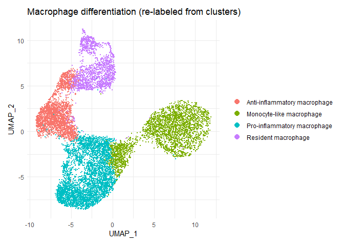<!-- -->
\# Identify Global Lineage Structure by Slingshot

``` r
library(SingleCellExperiment)
library(slingshot)
library(SummarizedExperiment)
library(RColorBrewer)
```

``` r
# Get UMAP coordinates and clusters from existing Seurat object
umap_coords <- Embeddings(Mac, "umap")

# Create SingleCellExperiment object from the Seurat object
sce_macrophage <- SingleCellExperiment(
  assays = list(logcounts = as.matrix(GetAssayData(Mac, layer = "data"))),
  reducedDims = SimpleList(UMAP = umap_coords),
  colData = DataFrame(macrophage_differentiation = Mac$macrophage_differentiation)
)
```

    ## Warning in asMethod(object): sparse->dense coercion: allocating vector of size
    ## 3.2 GiB

``` r
sce_original <- SingleCellExperiment(
  assays = list(logcounts = as.matrix(GetAssayData(Mac, layer = "data"))),
  reducedDims = SimpleList(UMAP = umap_coords),
  colData = DataFrame(seurat_clusters = Mac$seurat_clusters)
)
```

    ## Warning in asMethod(object): sparse->dense coercion: allocating vector of size
    ## 3.2 GiB

``` r
sce_annot_4th <- SingleCellExperiment(
  assays = list(logcounts = as.matrix(GetAssayData(Mac, layer = "data"))),
  reducedDims = SimpleList(UMAP = umap_coords),
  colData = DataFrame(annot_4th = Mac$annot_4th)
)
```

    ## Warning in asMethod(object): sparse->dense coercion: allocating vector of size
    ## 3.2 GiB

``` r
sce_timepoint <- SingleCellExperiment(
  assays = list(logcounts = as.matrix(GetAssayData(Mac, layer = "data"))),
  reducedDims = SimpleList(UMAP = umap_coords),
  colData = DataFrame(Time = Mac$Time)
)
```

    ## Warning in asMethod(object): sparse->dense coercion: allocating vector of size
    ## 3.2 GiB

## Slingshot Analysis

Initialize different cluster for Slingshot analysis using the original
cluster labels from the Seurat object. \### Monocyte-like macrophage Set
‘Monocyte-like macrophage’ as the initial cluster for Slingshot
analysis.

``` r
# Run Slingshot with `Monocyte-like macrophage` as the initial cluster
sce_macrophage <- slingshot(
  sce_macrophage,
  clusterLabels = "macrophage_differentiation",
  reducedDim = "UMAP",
  start.clus = "Monocyte-like macrophage"
)
```

``` r
curves <- slingCurves(sce_macrophage)

lineage_points <- lapply(curves, function(curve) {
  clust_names <- curve$clusterLabels
  clust_levels <- unique(clust_names)
  
  # Calculate center of each cluster
  centers <- sapply(clust_levels, function(cl) {
    cells <- which(clust_names == cl)
    colMeans(curve$s[cells, , drop = FALSE])
  })
  
  centers <- do.call(rbind, centers)
  rownames(centers) <- clust_levels
  return(centers)
})

# Calculate the center of each lineage cluster in UMAP
lineage_centers <- lapply(unique(sce_macrophage$macrophage_differentiation), function(cl) {
  cells <- which(sce_macrophage$macrophage_differentiation == cl)
  colMeans(reducedDims(sce_macrophage)$UMAP[cells, , drop = FALSE])
})
lineage_centers <- do.call(rbind, lineage_centers)
rownames(lineage_centers) <- unique(sce_macrophage$macrophage_differentiation)
```

``` r
original_clusters <- as.character(sce_macrophage$macrophage_differentiation)  # factor → character
n_clusters <- length(unique(original_clusters))
colors <- colorRampPalette(brewer.pal(4, "Set1"))(n_clusters)
plotcol <- colors[as.numeric(as.factor(original_clusters))]

# Visualize Global lineage structure with lineage centers
plot(reducedDims(sce_macrophage)$UMAP, col = plotcol, pch = 16, asp = 1,
                  bty = 'n', # No border around the legend
                  cex = 0.8) # Adjust text size
lines(SlingshotDataSet(sce_macrophage), lwd = 2, col = 'black')

# Add points for each lineage center
points(lineage_centers, pch = 21, bg = "black", cex = 1.5, lwd = 1.2)

# Add text labels for each lineage center
text(lineage_centers, labels = rownames(lineage_centers), pos = 3, cex = 0.7)
```

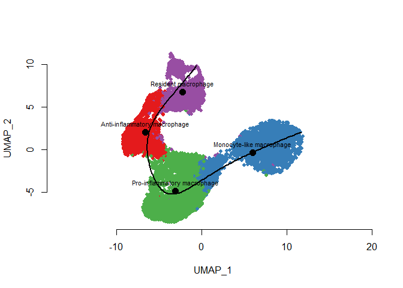<!-- -->
\### 1 (VCAN) Set `1 (VCAN)` as the initial cluster for Slingshot
analysis.

``` r
# Run Slingshot with `1` as the initial cluster
sce_1_original <- slingshot(
  sce_original,
  clusterLabels = "seurat_clusters",
  reducedDim = "UMAP",
  start.clus = "1"
)
```

``` r
# Visualize Global lineage structure
original_clusters <- as.character(sce_1_original$seurat_clusters)  # factor → character
n_clusters <- length(unique(original_clusters))
colors <- colorRampPalette(brewer.pal(9, "Set1"))(n_clusters)
plotcol <- colors[as.numeric(as.factor(original_clusters))]

plot(reducedDims(sce_1_original)$UMAP, col = plotcol, pch = 16, asp = 1)
lines(SlingshotDataSet(sce_1_original), lwd = 2, col = 'black')
legend("topleft", legend = levels(as.factor(original_clusters)), col = colors, pch = 16, 
       bty = 'n', # No border around the legend
       cex = 0.8) # Adjust text size
```

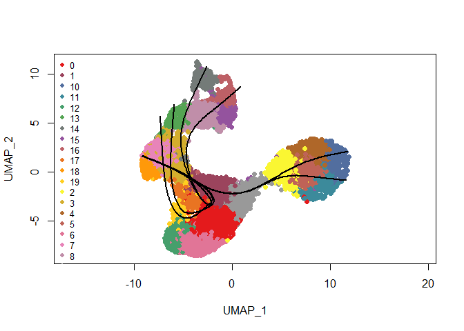<!-- -->

### 4 (FCN1)

Set `4 (FCN1)` as the initial cluster for Slingshot analysis.

``` r
# Run Slingshot with `4` as the initial cluster
sce_4_original <- slingshot(
  sce_original,
  clusterLabels = "seurat_clusters",
  reducedDim = "UMAP",
  start.clus = "4"
)
```

``` r
# Visualize Global lineage structure
original_clusters <- as.character(sce_4_original$seurat_clusters)  # factor → character
n_clusters <- length(unique(original_clusters))
colors <- colorRampPalette(brewer.pal(9, "Set1"))(n_clusters)
plotcol <- colors[as.numeric(as.factor(original_clusters))]

plot(reducedDims(sce_4_original)$UMAP, col = plotcol, pch = 16, asp = 1)
lines(SlingshotDataSet(sce_4_original), lwd = 2, col = 'black')
legend("topleft", legend = levels(as.factor(original_clusters)), col = colors, pch = 16, 
       bty = 'n', # No border around the legend
       cex = 0.8) # Adjust text size
```

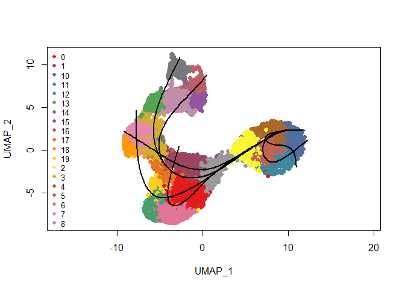<!-- -->

### 9 (FCN1)

Set `9 (FCN1)` as the initial cluster for Slingshot analysis.

``` r
# Run Slingshot with `9` as the initial cluster
sce_9_original <- slingshot(
  sce_original,
  clusterLabels = "seurat_clusters",
  reducedDim = "UMAP",
  start.clus = "9"
)
```

``` r
# Visualize Global lineage structure
original_clusters <- as.character(sce_9_original$seurat_clusters)  # factor → character
n_clusters <- length(unique(original_clusters))
colors <- colorRampPalette(brewer.pal(9, "Set1"))(n_clusters)
plotcol <- colors[as.numeric(as.factor(original_clusters))]

plot(reducedDims(sce_9_original)$UMAP, col = plotcol, pch = 16, asp = 1)
lines(SlingshotDataSet(sce_9_original), lwd = 2, col = 'black')
legend("topleft", legend = levels(as.factor(original_clusters)), col = colors, pch = 16, 
       bty = 'n', # No border around the legend
       cex = 0.8) # Adjust text size
```

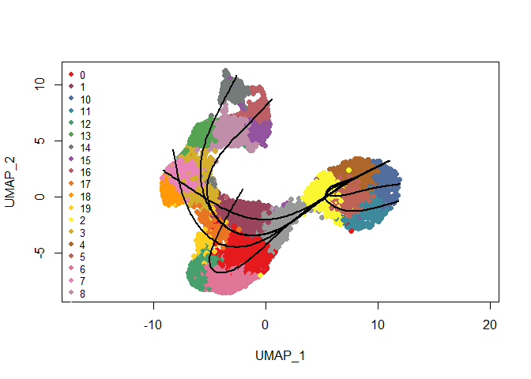<!-- -->

### M1_FCN1

``` r
# Run Slingshot with `M1_FCN1` as the initial cluster
sce_M1_FCN1_original <- slingshot(
  sce_annot_4th,
  clusterLabels = "annot_4th",
  reducedDim = "UMAP",
  start.clus = "M1_FCN1"
)
```

``` r
# Visualize Global lineage structure
annot_4th_clusters <- as.character(sce_M1_FCN1_original$annot_4th)  # factor → character
n_clusters <- length(unique(annot_4th_clusters))
colors <- colorRampPalette(brewer.pal(9, "Set1"))(n_clusters)
plotcol <- colors[as.numeric(as.factor(annot_4th_clusters))]

plot(reducedDims(sce_M1_FCN1_original)$UMAP, col = plotcol, pch = 16, asp = 1)
lines(SlingshotDataSet(sce_M1_FCN1_original), lwd = 2, col = 'black')
legend("topleft", legend = levels(as.factor(annot_4th_clusters)), col = colors, pch = 16, 
       bty = 'n', # No border around the legend
       cex = 0.8) # Adjust text size
```

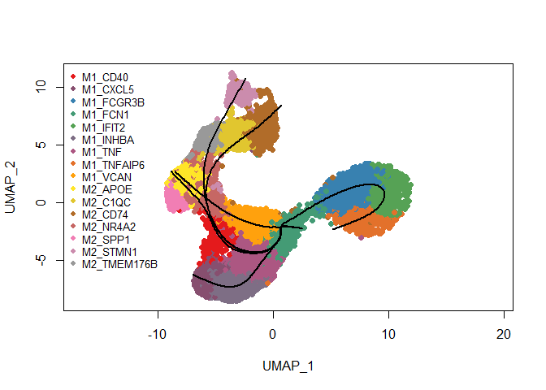<!-- -->
\### M1_FCN1 with dots

``` r
curves <- slingCurves(sce_M1_FCN1_original)

lineage_points <- lapply(curves, function(curve) {
  clust_names <- curve$clusterLabels
  clust_levels <- unique(clust_names)
  
  # Calculate center of each cluster
  centers <- sapply(clust_levels, function(cl) {
    cells <- which(clust_names == cl)
    colMeans(curve$s[cells, , drop = FALSE])
  })
  
  centers <- do.call(rbind, centers)
  rownames(centers) <- clust_levels
  return(centers)
})

# Calculate the center of each lineage cluster in UMAP
lineage_centers <- lapply(unique(sce_M1_FCN1_original$annot_4th), function(cl) {
  cells <- which(sce_M1_FCN1_original$annot_4th == cl)
  colMeans(reducedDims(sce_M1_FCN1_original)$UMAP[cells, , drop = FALSE])
})
lineage_centers <- do.call(rbind, lineage_centers)
rownames(lineage_centers) <- unique(sce_M1_FCN1_original$annot_4th)

# Visualize Global lineage structure with lineage centers
plot(reducedDims(sce_M1_FCN1_original)$UMAP, col = plotcol, pch = 16, asp = 1,
                  bty = 'n', # No border around the legend
                  cex = 0.8) # Adjust text size
lines(SlingshotDataSet(sce_M1_FCN1_original), lwd = 2, col = 'black')

# Add points for each lineage center
points(lineage_centers, pch = 21, bg = "black", cex = 1.5, lwd = 1.2)

# Add text labels for each lineage center
text(lineage_centers, labels = rownames(lineage_centers), pos = 3, cex = 0.7)
```

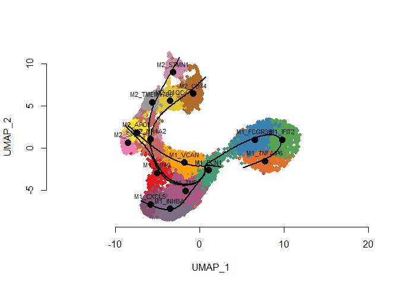<!-- -->
\### M1_FCN1: previous paper style Color the clusters based on the
previous paper’s style, where `M2_CD74` is renamed to `M2_HLA-DQB1` like
the paper.(Kwon, M., et al. 2024)

``` r
# 1. Rename 'M2_CD74' to 'M2_HLA-DQB1'
sce_M1_FCN1_original$annot_4th <- as.character(sce_M1_FCN1_original$annot_4th)
sce_M1_FCN1_original$annot_4th[sce_M1_FCN1_original$annot_4th == "M2_CD74"] <- "M2_HLA-DQB1"
sce_M1_FCN1_original$annot_4th <- factor(sce_M1_FCN1_original$annot_4th)

# 2. Define cluster color mapping
cluster_colors <- c(
  "M1_FCGR3B" = "#f9c28f",
  "M1_IFIT2" = "#fcd074",
  "M1_TNFAIP6" = "#fed070",
  "M1_FCN1" = "#f288b8",
  "M1_VCAN" = "#f2875b",
  "M1_TNF" = "#f3838e",
  "M1_INHBA" = "#ee4d89",
  "M1_CXCL5" = "#be198e",
  "M1_CD40" = "#852055",
  "M2_NR4A2" = "#8286c5",
  "M2_APOE" = "#1f88bf",
  "M2_SPP1" = "#2e57a4",
  "M2_C1QC" = "#115052",
  "M2_HLA-DQB1" = "#5ec081",
  "M2_STMN1" = "#578a89"
)

# 3. Color vector for plotting
plotcol <- cluster_colors[as.character(sce_M1_FCN1_original$annot_4th)]

# 4. Calculate Slingshot curves
curves <- slingCurves(sce_M1_FCN1_original)

# 5. Calculate lineage centers
lineage_centers <- lapply(unique(sce_M1_FCN1_original$annot_4th), function(cl) {
  cells <- which(sce_M1_FCN1_original$annot_4th == cl)
  colMeans(reducedDims(sce_M1_FCN1_original)$UMAP[cells, , drop = FALSE])
})
lineage_centers <- do.call(rbind, lineage_centers)
rownames(lineage_centers) <- unique(sce_M1_FCN1_original$annot_4th)
```

``` r
# Visualize Global lineage structure with lineage centers
plot(reducedDims(sce_M1_FCN1_original)$UMAP, col = plotcol, pch = 16, asp = 1,
     bty = 'n', cex = 0.8)
lines(SlingshotDataSet(sce_M1_FCN1_original), lwd = 2, col = 'black')

points(lineage_centers, pch = 21, bg = "black", cex = 1.5, lwd = 1.2)
text_pos <- ifelse(rownames(lineage_centers) == "M2_TMEM176B" | rownames(lineage_centers) == "M1_FCGR3B", 1, 3) # 1: below, 3: above
text(lineage_centers, labels = rownames(lineage_centers), pos = text_pos, cex = 0.7, font = 2)
```

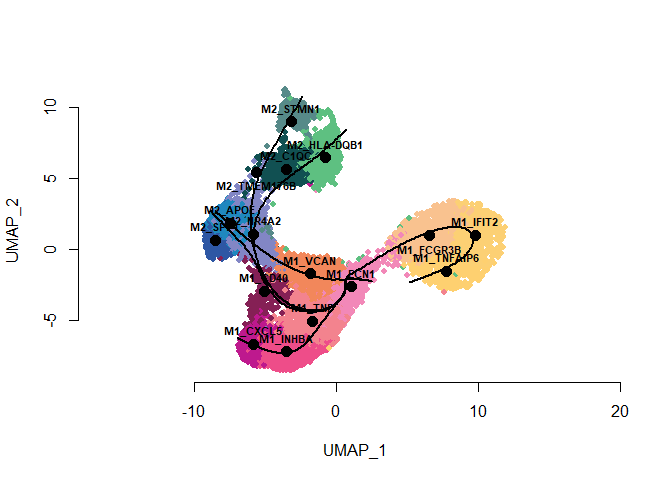<!-- -->
\### M1_FCN1 with Timepoint UMAP

``` r
# Run Slingshot by Timepoint
slingshot_timepoint <- slingshot(
  sce_timepoint,
  clusterLabels = "Time",
  reducedDim = "UMAP"
)
```

``` r
# Visualize Global lineage structure with Timepoint
cluster_colors_timepoint <- c(
  'B' = '#f8766d',
  'F1' = '#00bfc4'
)

plotcol <- cluster_colors_timepoint[as.numeric(as.factor(sce_timepoint$Time))]
```

``` r
plot(reducedDims(sce_timepoint)$UMAP, col = plotcol, pch = 16, asp = 1,
  bty = 'n', cex = 0.8)
legend(x = 4, y = 10, legend = names(cluster_colors_timepoint), 
  col = cluster_colors_timepoint, pch = 16, 
  title = "Timepoint", cex = 1.6, bty = 0)

# Visualize Global lineage structure with lineage centers
lines(SlingshotDataSet(sce_M1_FCN1_original), lwd = 2, col = 'black')

points(lineage_centers, pch = 21, bg = "black", cex = 1.5, lwd = 1.2)
text_pos <- ifelse(rownames(lineage_centers) == "M2_TMEM176B" | rownames(lineage_centers) == "M1_FCGR3B", 1, 3) # 1: below, 3: above
text(lineage_centers, labels = rownames(lineage_centers), pos = text_pos, cex = 0.7, font = 2)
```

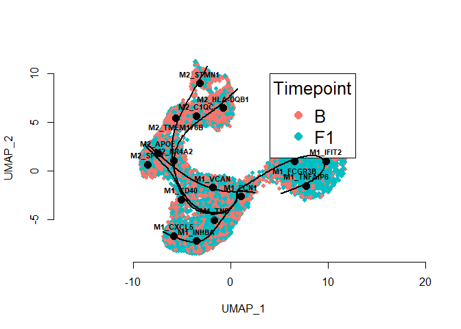<!-- -->
