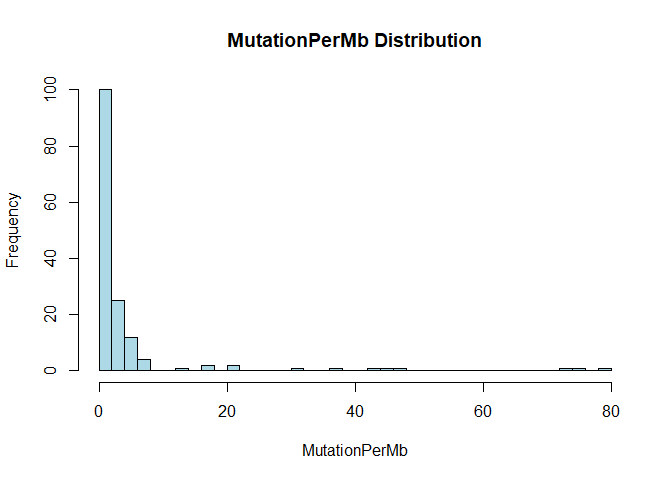
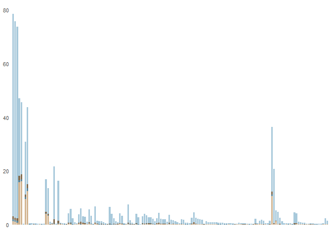
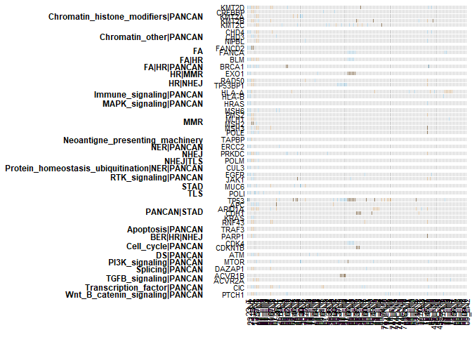
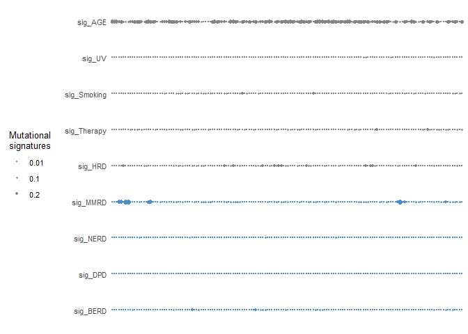
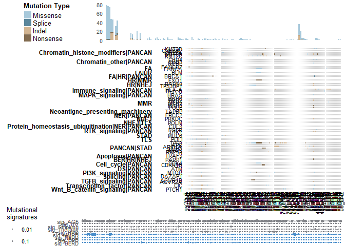

Visualization of Somatic Mutation
================

The purpose of this code is drawing an heatmap, stacked barplot, and
dotplot for gastric cancer data, specifically focusing on lymph nodes
(LN) and whole exome sequencing (WES) data. The code processes mutation
data, mutational signatures, and TMB (Tumor Mutational Burden) data to
visualize the relationships between mutations and signatures across
different samples.

The mutation data is created from aggregating outcomes of Mutect2 and
Strelka2, which are tools for detecting somatic mutations in cancer
genomes. The mutational signatures are derived from the mutation data,
and TMB is calculated to quantify the number of mutations per megabase
of DNA.

    ## Warning: package 'ComplexHeatmap' was built under R version 4.5.1

# Preprocessing

## Load data

Load both oncoplot.xlsx and tpm.txt

### intTABLE data

- intTABLE.txt: intTABLE of all genes Each One character of integer has
  following meaning
- 0: No mutation
- 2: Missense
- 3: Nonsense
- 4: Splice
- 5: Indel We’ll exploit those 5 characters only to draw the oncoplot.

<!-- -->

    ## $V1
    ##  [1] "KMT2D"   "HLA-A"   "BLM"     "TP53"    "KMT2B"   "BRCA1"   "APC"    
    ##  [8] "TP53BP1" "POLM"    "RAD50"   "KMT2A"   "FANCD2"  "MSH6"    "CHD4"   
    ## [15] "PTCH1"   "MUC6"    "HRAS"    "ERCC2"   "CUL3"    "ARID1A"  "KMT2C"  
    ## [22] "PMS2"    "PARP1"   "DAZAP1"  "CIC"     "FANCA"   "PRKDC"   "NIPBL"  
    ## [29] "ACVR2A"  "EXO1"    "CHD3"    "JAK1"    "HLA-B"   "RNF43"   "MSH3"   
    ## [36] "MTOR"    "POLE"    "ATM"     "MLH1"    "CDH1"    "ACVR1B"  "POLI"   
    ## [43] "MSH2"    "TAPBP"   "TRAF3"   "CDK4"    "CDKN1B"  "CREBBP"  "EGFR"   
    ## [50] "KRAS"

    ## [1] 207 158

    ##                                         pathway symbol GC_23_T GC_23_LN1
    ## 1 Protein_homeostasis_ubiquitination|NER|PANCAN   CUL3      12        12
    ## 2                              Apoptosis|PANCAN  TRAF3       0         0
    ## 3                             Cell_cycle|PANCAN  CCND1       0         0
    ## 4                             Cell_cycle|PANCAN  CDK12       0         0
    ## 5                             Cell_cycle|PANCAN   CDK4       0         0
    ## 6                             Cell_cycle|PANCAN CDKN1A       0         0
    ##   GC_23_LN2 GC_13_T GC_13_LN1 GC_13_LN2 GC_57_T GC_57_LN2 GC_57_LN9 GC_57_LN5
    ## 1        12       0         0         0       0         2         0         0
    ## 2         0       5         5         0       0         0         0         0
    ## 3         0       0         0         0       0         0         0         0
    ## 4         0       0         0         0       0         0         0         0
    ## 5         0       0         0         0       0         0         0         0
    ## 6         0       3         3         0       0         0         0         0
    ##   GC_57_LN8 GC_57_LN4 GC_57_LN6 GC_57_LN3 GC_57_LN7 GC_57_LN1 GC_67_T GC_67_LN3
    ## 1         0         0         0         0         0         0       0         0
    ## 2         0         0         0         0         0         0       0         0
    ## 3         0         0         0         0         0         0       0         0
    ## 4         0         0         0         0         0         0       0         0
    ## 5         0         0         0         0         0         0       0         0
    ## 6         0         0         0         0         0         0       0         0
    ##   GC_67_LN1 GC_67_LN2 GC_26_T GC_26_LN1 GC_69_T GC_69_LN4 GC_69_LN1 GC_69_LN2
    ## 1         0         0       0         0       0         0         0         0
    ## 2         0         0       0         0       0         0         0         0
    ## 3         0         0       0         0       0         0         0         0
    ## 4         0         0       0         0       0         0         0         0
    ## 5         0         0       0         0       0         0         0         0
    ## 6         0         0       0         0       0         0         0         0
    ##   GC_69_LN3 GC_62_T GC_62_LN3 GC_62_LN2 GC_62_LN1 GC_62_LN4 GC_46_T GC_46_LN4
    ## 1         0       0         0         0         0         0       0         0
    ## 2         0       0         0         0         0         0       0         0
    ## 3         0       0         0         0         0         0       0         0
    ## 4         0       0         0         0         0         0       0         0
    ## 5         0       0         0         0         0         0       0         0
    ## 6         0       0         0         0         0         0       0         0
    ##   GC_46_LN2 GC_46_LN3 GC_46_LN1 GC_30_T GC_30_LN1 GC_30_LN2 GC_72_T GC_72_LN6
    ## 1         0         0         0       0         0         0       0         0
    ## 2         0         0         0       0         0         0       0         0
    ## 3         2         0         0       0         0         0       0         0
    ## 4         0         0         0       0         0         0       0         0
    ## 5         0         0         0       0         0         0       0         0
    ## 6         0         0         0       0         0         0       0         0
    ##   GC_72_LN3 GC_72_LN2 GC_72_LN1 GC_72_LN4 GC_72_LN5 GC_64_T GC_64_LN3 GC_64_LN4
    ## 1         0         0         0         0         0       0         0         0
    ## 2         0         0         0         0         0       0         0         0
    ## 3         0         0         0         0         0       0         0         0
    ## 4         0         0         0         0         0       0         0         0
    ## 5         0         0         0         0         0       0         0         0
    ## 6         0         0         0         0         0       0         0         0
    ##   GC_64_LN5 GC_64_LN1 GC_61_T GC_61_LN1 GC_61_LN2 GC_61_LN3 GC_38_T GC_38_LN4
    ## 1         0         0       0         0         0         0       0         0
    ## 2         0         0       0         0         0         0       0         0
    ## 3         0         0       0         0         0         0       0         0
    ## 4         0         0       0         0         0         0       0         0
    ## 5         0         0       0         0         0         0       0         0
    ## 6         0         0       0         0         0         0       0         0
    ##   GC_38_LN3 GC_38_LN2 GC_68_T GC_68_LN1 GC_68_LN2 GC_37_T GC_37_LN2 GC_37_LN6
    ## 1         0         0       0         0         0       0         0         0
    ## 2         0         0       0         0         0       0         0         0
    ## 3         0         0       0         0         0       0         0         0
    ## 4         0         0       0         2         0       0         0         0
    ## 5         0         0       0         0         0       0         0         0
    ## 6         0         0       0         0         0       0         0         0
    ##   GC_37_LN5 GC_37_LN3 GC_37_LN4 GC_37_LN1 GC_66_T GC_66_LN4 GC_66_LN1 GC_66_LN3
    ## 1         0         0         0         0       0         0         0         0
    ## 2         0         0         0         0       0         0         0         0
    ## 3         0         0         0         0       0         0         0         0
    ## 4         0         0         0         0       0         0         0         0
    ## 5         0         0         0         0       2         2         2         2
    ## 6         0         0         0         0       0         0         0         0
    ##   GC_66_LN2 GC_66_LN5 GC_35_T GC_35_LN4 GC_35_LN2 GC_35_LN3 GC_35_LN5 GC_35_LN1
    ## 1         0         0       0         0         0         0         0         0
    ## 2         0         0       0         0         0         0         0         0
    ## 3         0         0       0         0         0         0         0         0
    ## 4         0         0       0         0         0         0         0         0
    ## 5         2         0       0         0         0         0         0         0
    ## 6         0         0       0         0         0         0         0         0
    ##   GC_60_T GC_60_LN1 GC_60_LN4 GC_60_LN2 GC_60_LN3 GC_43_T GC_43_LN5 GC_43_LN3
    ## 1       0         0         0         0         0       0         0         0
    ## 2       0         0         0         0         0       0         0         0
    ## 3       0         0         0         0         0       0         0         0
    ## 4       0         0         0         0         0       0         0         0
    ## 5       0         0         0         0         0       0         0         0
    ## 6       0         0         0         0         0       0         0         0
    ##   GC_43_LN6 GC_43_LN2 GC_43_LN4 GC_43_LN1 GC_74_T GC_74_LN2 GC_74_LN10
    ## 1         0         0         0         0       0         0          0
    ## 2         0         0         0         0       0         0          0
    ## 3         0         0         0         0       0         0          0
    ## 4         0         0         0         0       0         0          0
    ## 5         0         0         0         0       0         0          0
    ## 6         0         0         0         0       0         0          0
    ##   GC_74_LN7 GC_74_LN4 GC_74_LN15 GC_74_LN11 GC_74_LN8 GC_74_LN12 GC_74_LN5
    ## 1         0         0          0          0         0          0         0
    ## 2         0         0          0          0         0          0         0
    ## 3         0         0          0          0         0          0         0
    ## 4         0         0          0          0         0          0         0
    ## 5         0         0          0          0         0          0         0
    ## 6         0         0          0          0         0          0         0
    ##   GC_74_LN16 GC_74_LN14 GC_74_LN1 GC_74_LN6 GC_74_LN3 GC_74_LN9 GC_74_LN13
    ## 1          0          0         0         0         0         0          0
    ## 2          0          0         0         0         0         0          0
    ## 3          0          0         0         0         0         0          0
    ## 4          0          0         0         0         0         0          0
    ## 5          0          0         0         0         0         0          0
    ## 6          0          0         0         0         0         0          0
    ##   GC_53_T GC_53_LN1 GC_53_LN7 GC_53_LN6 GC_53_LN3 GC_53_LN4 GC_53_LN2 GC_53_LN5
    ## 1       0         0         0         0         0         0         0         0
    ## 2       0         0         0         0         0         0         0         0
    ## 3       0         0         0         0         0         0         0         0
    ## 4       0         0         0         0         0         0         0         0
    ## 5       0         0         0         0         0         0         0         0
    ## 6       0         0         0         0         0         0         0         0
    ##   GC_17_T GC_17_LN1 GC_70_T GC_70_LN4 GC_70_LN3 GC_70_LN1 GC_70_LN2 GC_45_T
    ## 1       0         0       0         0         0         0         0       0
    ## 2       0         0       0         0         0         0         0       0
    ## 3       0         0       0         0         0         0         0       0
    ## 4       0         0       0         0         0         0         0       0
    ## 5       0         0       0         0         0         0         0       0
    ## 6       0         0       0         0         0         0         0       0
    ##   GC_45_LN9 GC_45_LN5 GC_45_LN8 GC_45_LN2 GC_45_LN10 GC_45_LN7 GC_45_LN1
    ## 1         0         0         0         0          0         0         0
    ## 2         0         0         0         0          0         0         0
    ## 3         0         0         0         0          0         0         0
    ## 4         0         0         0         0          0         0         0
    ## 5         0         0         0         0          0         0         0
    ## 6         0         0         0         0          0         0         0
    ##   GC_45_LN4 GC_45_LN11 GC_45_LN3 GC_45_LN6 GC_73_T GC_73_LN6 GC_73_LN3
    ## 1         0          0         0         0       0         0         0
    ## 2         0          0         0         0       0         0         0
    ## 3         0          0         0         0       0         0         0
    ## 4         0          0         0         0       0         0         0
    ## 5         0          0         0         0       0         0         0
    ## 6         0          0         0         0       0         0         0
    ##   GC_73_LN5 GC_73_LN7 GC_73_LN2 GC_73_LN4 GC_73_LN1 GC_56_T GC_56_LN1 GC_56_LN2
    ## 1         0         0         0         0         0       0         0         0
    ## 2         0         0         0         0         0       0         0         0
    ## 3         0         0         0         0         0       0         0         0
    ## 4         0         0         0         0         0       0         0         0
    ## 5         0         0         0         0         0       0         0         0
    ## 6         0         0         0         0         0       0         0         0
    ##   GC_56_LN5 GC_56_LN3 GC_56_LN6 GC_56_LN4 GC_09_T GC_09_LN1 GC_09_LN2
    ## 1         0         0         0         0       0         0         0
    ## 2         0         0         0         0       0         0         0
    ## 3         0         0         0         0       0         0         0
    ## 4         0         0         0         0       0         0         0
    ## 5         0         0         0         0       0         0         0
    ## 6         0         0         0         0       0         0         0

    ## [1]  50 158

### TMB data

    ##            GC_23_T GC_23_LN1 GC_23_LN2 GC_13_T GC_13_LN1 GC_13_LN2 GC_57_T
    ## synony        3714      3681      3630     728       706        15     494
    ## missense      3836      3714      3625    1461      1370        11     998
    ## nonsense        55        47        47      90        92         0      48
    ## indel           64        50        39     803       821         2     488
    ## splice          38        36        36      34        36         0      30
    ## non_synony    3993      3847      3747    2388      2319        13    1564
    ##            GC_57_LN2 GC_57_LN9 GC_57_LN5 GC_57_LN8 GC_57_LN4 GC_57_LN6
    ## synony           673        10        13        18         9        13
    ## missense        1461        19        25        23        17        16
    ## nonsense          70         0         0         2         0         0
    ## indel            633         2         1         0         3         0
    ## splice            59         0         1         1         0         1
    ## non_synony      2223        21        27        26        20        17
    ##            GC_57_LN3 GC_57_LN7 GC_57_LN1 GC_67_T GC_67_LN3 GC_67_LN1 GC_67_LN2
    ## synony            10         7        13     322       249        28        17
    ## missense          24        18        15     612       492        54        24
    ## nonsense           1         0         1      29        25         2         9
    ## indel              1         2         2     202       164         2         3
    ## splice             2         2         2      11        11         0         1
    ## non_synony        28        22        20     854       692        58        37
    ##            GC_26_T GC_26_LN1 GC_69_T GC_69_LN4 GC_69_LN1 GC_69_LN2 GC_69_LN3
    ## synony         512        13     393        19         9         6        13
    ## missense       998        19     762        23        14        15        10
    ## nonsense        87         1      46         8         2         2         6
    ## indel            8         0      14         4         4         1         2
    ## splice           5         1      10         5         2         1         4
    ## non_synony    1098        21     832        40        22        19        22
    ##            GC_62_T GC_62_LN3 GC_62_LN2 GC_62_LN1 GC_62_LN4 GC_46_T GC_46_LN4
    ## synony          81       147        63        13        11      79        43
    ## missense       185       257       109        33        15     167       124
    ## nonsense        12        18         6         6         2      12        14
    ## indel           16        18         2         3         7      14        16
    ## splice           4         4         2         2         0       6         2
    ## non_synony     217       297       119        44        24     199       156
    ##            GC_46_LN2 GC_46_LN3 GC_46_LN1 GC_30_T GC_30_LN1 GC_30_LN2 GC_72_T
    ## synony           167        59        17     102        63        10     175
    ## missense         259       118        41     244       146        12     302
    ## nonsense          47        17         7      19         7         1      20
    ## indel              1         8         3      13         7         2      13
    ## splice             2         3         1       9         6         1       6
    ## non_synony       309       146        52     285       166        16     341
    ##            GC_72_LN6 GC_72_LN3 GC_72_LN2 GC_72_LN1 GC_72_LN4 GC_72_LN5 GC_64_T
    ## synony            35        37        11        16        23        11     175
    ## missense          57        57        35        15        47        18     321
    ## nonsense           6         5         7         3        10         1       7
    ## indel              3         1         1         0         2         2       1
    ## splice             4         3         0         2         2         1       5
    ## non_synony        70        66        43        20        61        22     334
    ##            GC_64_LN3 GC_64_LN4 GC_64_LN5 GC_64_LN1 GC_61_T GC_61_LN1 GC_61_LN2
    ## synony            90        44        27        14      82        66         5
    ## missense         197        95        32        63     187       143        13
    ## nonsense           3        17        11         2       8         8         3
    ## indel              1         0         1         1      14         8         3
    ## splice             3         4         1         0       6         4         0
    ## non_synony       204       116        45        66     215       163        19
    ##            GC_61_LN3 GC_38_T GC_38_LN4 GC_38_LN3 GC_38_LN2 GC_68_T GC_68_LN1
    ## synony             8     153        52        20         8      80        84
    ## missense          25     348        71        30        12     178       126
    ## nonsense           2      20        13         3         1      12         3
    ## indel              2       5         2         0         1      12         2
    ## splice             1       8         1         1         1       5         4
    ## non_synony        30     381        87        34        15     207       135
    ##            GC_68_LN2 GC_37_T GC_37_LN2 GC_37_LN6 GC_37_LN5 GC_37_LN3 GC_37_LN4
    ## synony             9      65        57        51        42       102        34
    ## missense          11     136       145       114       118       181        93
    ## nonsense           0       9        16        10        11        12         7
    ## indel              1      10         6        10         8         4         9
    ## splice             0       4         7         3         3         4         4
    ## non_synony        12     159       174       137       140       201       113
    ##            GC_37_LN1 GC_66_T GC_66_LN4 GC_66_LN1 GC_66_LN3 GC_66_LN2 GC_66_LN5
    ## synony            23      51       100        44        36        49        21
    ## missense          57      87       182        88        93        87        41
    ## nonsense           4      20        28         6         7         7         5
    ## indel              2       6         3         5         6         5         3
    ## splice             2       3         5         4         4         3         4
    ## non_synony        65     116       218       103       110       102        53
    ##            GC_35_T GC_35_LN4 GC_35_LN2 GC_35_LN3 GC_35_LN5 GC_35_LN1 GC_60_T
    ## synony          78        31        28        28        17        12      36
    ## missense       153        66        52        81        21        37      80
    ## nonsense        15         5         3         5         1         1       3
    ## indel           11         6         5         6         3         4      12
    ## splice           5         2         1         1         1         2       3
    ## non_synony     184        79        61        93        26        44      98
    ##            GC_60_LN1 GC_60_LN4 GC_60_LN2 GC_60_LN3 GC_43_T GC_43_LN5 GC_43_LN3
    ## synony            32        12         6        20      41       107        46
    ## missense          81        27        20        30     111       191       111
    ## nonsense           4         5         1         0       9        35         7
    ## indel              3         2         0         2       4         5         7
    ## splice             1         1         1         2       5         3         4
    ## non_synony        89        35        22        34     129       234       129
    ##            GC_43_LN6 GC_43_LN2 GC_43_LN4 GC_43_LN1 GC_74_T GC_74_LN2 GC_74_LN10
    ## synony            35        42        34         7      12        12         18
    ## missense          86        98        88        14      50        21         35
    ## nonsense           4         3         2         2       4         1          1
    ## indel              4         7         4         1       6         1          5
    ## splice             3         2         2         0       0         3          3
    ## non_synony        97       110        96        17      60        26         44
    ##            GC_74_LN7 GC_74_LN4 GC_74_LN15 GC_74_LN11 GC_74_LN8 GC_74_LN12
    ## synony            14         7          9          9        14         19
    ## missense          32        32         22         30        20         37
    ## nonsense           1         2          1          1         0          0
    ## indel              3         1          1          1         2          5
    ## splice             5         3          0          4         1          1
    ## non_synony        41        38         24         36        23         43
    ##            GC_74_LN5 GC_74_LN16 GC_74_LN14 GC_74_LN1 GC_74_LN6 GC_74_LN3
    ## synony             7         11         11        16        18         9
    ## missense          32         20         33        24        31        17
    ## nonsense           0          0          1         2         1         2
    ## indel              6          4          0         4         6         2
    ## splice             3          1          0         1         3         0
    ## non_synony        41         25         34        31        41        21
    ##            GC_74_LN9 GC_74_LN13 GC_53_T GC_53_LN1 GC_53_LN7 GC_53_LN6 GC_53_LN3
    ## synony            12         15      12        12        17         8         8
    ## missense          25         13      23        17        19        14        14
    ## nonsense           0          1       4         2         1         2         2
    ## indel              2          3       6         4         2         3         2
    ## splice             3          4       2         1         0         0         1
    ## non_synony        30         21      35        24        22        19        19
    ##            GC_53_LN4 GC_53_LN2 GC_53_LN5 GC_17_T GC_17_LN1 GC_70_T GC_70_LN4
    ## synony             8         9        13      42        12      37        48
    ## missense          18        15        12      93        20      56        64
    ## nonsense           2         1         2       3         4       4         5
    ## indel              0         0         1       7         3      14         2
    ## splice             2         0         0       5         1       2         0
    ## non_synony        22        16        15     108        28      76        71
    ##            GC_70_LN3 GC_70_LN1 GC_70_LN2 GC_45_T GC_45_LN9 GC_45_LN5 GC_45_LN8
    ## synony            50        12        11      35       574       541       101
    ## missense          83        23        20      63      1220      1027       199
    ## nonsense           6         0         5       5        59        14         6
    ## indel              5         1         4       0       537         3        62
    ## splice             1         1         0       1        32         7         6
    ## non_synony        95        25        29      69      1848      1051       273
    ##            GC_45_LN2 GC_45_LN10 GC_45_LN7 GC_45_LN1 GC_45_LN4 GC_45_LN11
    ## synony           123         64        74        14        15         19
    ## missense         230        116        59        31        26         19
    ## nonsense           5         13         1         2         0          2
    ## indel              5          1         0         1         1          2
    ## splice             1          0         0         1         1          1
    ## non_synony       241        130        60        35        28         24
    ##            GC_45_LN3 GC_45_LN6 GC_73_T GC_73_LN6 GC_73_LN3 GC_73_LN5 GC_73_LN7
    ## synony            12         7       6        71       165        20        11
    ## missense          19        15      10       192       210        48        16
    ## nonsense           1         4       0         8        21         5         0
    ## indel              3         3       2        13         2         3         3
    ## splice             3         1       3         3         2         2         0
    ## non_synony        26        23      15       216       235        58        19
    ##            GC_73_LN2 GC_73_LN4 GC_73_LN1 GC_56_T GC_56_LN1 GC_56_LN2 GC_56_LN5
    ## synony            27        13        10      12        10        12         6
    ## missense          28        31        30      18        12        20        16
    ## nonsense           3         6         3       0         1         2         1
    ## indel              5         3         1       3         0         1         1
    ## splice             2         1         0       0         1         0         2
    ## non_synony        38        41        34      21        14        23        20
    ##            GC_56_LN3 GC_56_LN6 GC_56_LN4 GC_09_T GC_09_LN1 GC_09_LN2
    ## synony            10        12        15       9        60        37
    ## missense          12        12        20      16       109        67
    ## nonsense           0         0         2       0         5         7
    ## indel              0         2         1       5         3         3
    ## splice             2         3         1       2         1         0
    ## non_synony        14        17        24      23       118        77

### Sig data

Mutation Signiture

    ##              sig_AGE      sig_UV sig_Smoking sig_Therapy    sig_HRD
    ## GC_23_T   0.46428419 0.002685411  0.00000000 0.035604391 0.00000000
    ## GC_23_LN1 0.44985032 0.002397422  0.00000000 0.033089390 0.00000000
    ## GC_23_LN2 0.44823452 0.001850288  0.00000000 0.031413967 0.00000000
    ## GC_13_T   0.12774609 0.000000000  0.00000000 0.023938904 0.00000000
    ## GC_13_LN1 0.24748653 0.008645735  0.01363572 0.006383827 0.00000000
    ## GC_13_LN2 0.11005368 0.022684598  0.00000000 0.038216814 0.14423105
    ## GC_57_T   0.09337844 0.000000000  0.00000000 0.030163070 0.00000000
    ## GC_57_LN2 0.07327937 0.010195660  0.00000000 0.028637823 0.02371581
    ## GC_57_LN9 0.29781258 0.036764105  0.00000000 0.000000000 0.00000000
    ## GC_57_LN5 0.12754576 0.000000000  0.00000000 0.000000000 0.00000000

    ## [1] "sig_AGE"     "sig_UV"      "sig_Smoking" "sig_Therapy" "sig_HRD"    
    ## [6] "sig_MMRD"    "sig_NERD"    "sig_DPD"     "sig_BERD"

    ## [1] "GC_23_T"   "GC_23_LN1" "GC_23_LN2" "GC_13_T"   "GC_13_LN1" "GC_13_LN2"

    ## character(0)

    ## [1] "GC_74_LN1" "GC_45_LN1"

    ##  [1] 14.00000000 31.00000000  2.00000000  1.00000000  1.00000000 35.00000000
    ##  [7] 49.00000000  0.60934451  0.03931255  0.01965627  0.01965627  0.68796961
    ## [13]  0.96315746

    ##  [1] 16.00000000 24.00000000  2.00000000  4.00000000  1.00000000 31.00000000
    ##  [7] 47.00000000  0.47175059  0.03931255  0.07862510  0.01965627  0.60934451
    ## [13]  0.92384491

Among columns in setdiff(colnames(tmb), colnames(mutsig)), drop columns
that don’t have reasonable values in the `tmb`.

    ## [1]  13 154

    ## [1]   9 154

    ## [1]  50 156

    ## [1] "pathway"   "symbol"    "GC_23_T"   "GC_23_LN1" "GC_23_LN2" "GC_13_T"

## Preprocess

Preprocess both data like the final output, which means oncoplot like
the one in

`Lim기타, “Determinants of Response to Sequential Pembrolizumab with Trastuzumab plus Platinum/5-FU in HER2-Positive Gastric Cancer”`

    ## [1] 28

    ## [1] 50

    ## [1] "GC_23_T"   "GC_23_LN1" "GC_23_LN2" "GC_13_T"   "GC_13_LN1" "GC_13_LN2"

    ## [1] "GC_56_LN3" "GC_56_LN6" "GC_56_LN4" "GC_09_T"   "GC_09_LN1" "GC_09_LN2"

    ## [1] 154

    ## [1] 154

    ## character(0)

    ##                         GC_23_T    GC_23_LN1    GC_23_LN2      GC_13_T
    ## synony             3714.0000000 3681.0000000 3630.0000000  728.0000000
    ## missense           3836.0000000 3714.0000000 3625.0000000 1461.0000000
    ## nonsense             55.0000000   47.0000000   47.0000000   90.0000000
    ## indel                64.0000000   50.0000000   39.0000000  803.0000000
    ## splice               38.0000000   36.0000000   36.0000000   34.0000000
    ## non_synony         3993.0000000 3847.0000000 3747.0000000 2388.0000000
    ## total              7707.0000000 7528.0000000 7377.0000000 3116.0000000
    ## missensePerMb        75.4014696   73.0034041   71.2539956   28.7178173
    ## nonsensePerMb         1.0810951    0.9238449    0.9238449    1.7690647
    ## indelPerMb            1.2580016    0.9828137    0.7665947   15.7839885
    ## splicePerMb           0.7469384    0.7076259    0.7076259    0.6683133
    ## MutationPerMb        78.4875047   75.6176886   73.6520611   46.9391839
    ## TotalMutationperMb  151.4909088  147.9724356  145.0043381   61.2489518
    ##                       GC_13_LN1
    ## synony              706.0000000
    ## missense           1370.0000000
    ## nonsense             92.0000000
    ## indel               821.0000000
    ## splice               36.0000000
    ## non_synony         2319.0000000
    ## total              3025.0000000
    ## missensePerMb        26.9290963
    ## nonsensePerMb         1.8083773
    ## indelPerMb           16.1378015
    ## splicePerMb           0.7076259
    ## MutationPerMb        45.5829009
    ## TotalMutationperMb   59.4602308

    ##               GC_23_T GC_23_LN1 GC_23_LN2  GC_13_T GC_13_LN1
    ## MutationPerMb 78.4875  75.61769  73.65206 46.93918   45.5829

‘MutationPerMb’ is the key of sorting rows of the oncoplot.

    ## [1] "list"

    ##               GC_23_T GC_23_LN1 GC_23_LN2  GC_13_T GC_13_LN1 GC_13_LN2  GC_57_T
    ## MutationPerMb 78.4875  75.61769  73.65206 46.93918   45.5829 0.2555316 30.74241
    ##               GC_57_LN2 GC_57_LN9 GC_57_LN5 GC_57_LN8 GC_57_LN4 GC_57_LN6
    ## MutationPerMb   43.6959 0.4127818 0.5307194 0.5110631 0.3931255 0.3341567
    ##               GC_57_LN3 GC_57_LN7 GC_57_LN1  GC_67_T GC_67_LN3 GC_67_LN1
    ## MutationPerMb 0.5503757  0.432438 0.3931255 16.78646  13.60214  1.140064
    ##               GC_67_LN2  GC_26_T GC_26_LN1  GC_69_T GC_69_LN4 GC_69_LN1
    ## MutationPerMb 0.7272822 21.58259 0.4127818 16.35402  0.786251  0.432438
    ##               GC_69_LN2 GC_69_LN3  GC_62_T GC_62_LN3 GC_62_LN2 GC_62_LN1
    ## MutationPerMb 0.3734692  0.432438 4.265412  5.837914  2.339097 0.8648761
    ##               GC_62_LN4  GC_46_T GC_46_LN4 GC_46_LN2 GC_46_LN3 GC_46_LN1
    ## MutationPerMb 0.4717506 3.911599  3.066379  6.073789  2.869816  1.022126
    ##                GC_30_T GC_30_LN1 GC_30_LN2 GC_72_T GC_72_LN6 GC_72_LN3
    ## MutationPerMb 5.602038  3.262942 0.3145004 6.70279  1.375939  1.297314
    ##               GC_72_LN2 GC_72_LN1 GC_72_LN4 GC_72_LN5  GC_64_T GC_64_LN3
    ## MutationPerMb 0.8452198 0.3931255  1.199033  0.432438 6.565196   4.00988
    ##               GC_64_LN4 GC_64_LN5 GC_64_LN1  GC_61_T GC_61_LN1 GC_61_LN2
    ## MutationPerMb  2.280128 0.8845324  1.297314 4.226099  3.203973 0.3734692
    ##               GC_61_LN3  GC_38_T GC_38_LN4 GC_38_LN3 GC_38_LN2  GC_68_T
    ## MutationPerMb 0.5896882 7.489041  1.710096 0.6683133 0.2948441 4.068849
    ##               GC_68_LN1 GC_68_LN2  GC_37_T GC_37_LN2 GC_37_LN6 GC_37_LN5
    ## MutationPerMb  2.653597 0.2358753 3.125348  3.420192   2.69291  2.751878
    ##               GC_37_LN3 GC_37_LN4 GC_37_LN1  GC_66_T GC_66_LN4 GC_66_LN1
    ## MutationPerMb  3.950911  2.221159  1.277658 2.280128  4.285068  2.024596
    ##               GC_66_LN3 GC_66_LN2 GC_66_LN5  GC_35_T GC_35_LN4 GC_35_LN2
    ## MutationPerMb   2.16219   2.00494  1.041783 3.616755  1.552846  1.199033
    ##               GC_35_LN3 GC_35_LN5 GC_35_LN1  GC_60_T GC_60_LN1 GC_60_LN4
    ## MutationPerMb  1.828034 0.5110631 0.8648761 1.926315  1.749408 0.6879696
    ##               GC_60_LN2 GC_60_LN3  GC_43_T GC_43_LN5 GC_43_LN3 GC_43_LN6
    ## MutationPerMb  0.432438 0.6683133 2.535659  4.599568  2.535659  1.906659
    ##               GC_43_LN2 GC_43_LN4 GC_43_LN1  GC_74_T GC_74_LN2 GC_74_LN10
    ## MutationPerMb   2.16219  1.887002 0.3341567 1.179376 0.5110631  0.8648761
    ##               GC_74_LN7 GC_74_LN4 GC_74_LN15 GC_74_LN11 GC_74_LN8 GC_74_LN12
    ## MutationPerMb 0.8059073 0.7469384  0.4717506  0.7076259 0.4520943  0.8452198
    ##               GC_74_LN5 GC_74_LN16 GC_74_LN14 GC_74_LN6 GC_74_LN3 GC_74_LN9
    ## MutationPerMb 0.8059073  0.4914069  0.6683133 0.8059073 0.4127818 0.5896882
    ##               GC_74_LN13   GC_53_T GC_53_LN1 GC_53_LN7 GC_53_LN6 GC_53_LN3
    ## MutationPerMb  0.4127818 0.6879696 0.4717506  0.432438 0.3734692 0.3734692
    ##               GC_53_LN4 GC_53_LN2 GC_53_LN5  GC_17_T GC_17_LN1  GC_70_T
    ## MutationPerMb  0.432438 0.3145004 0.2948441 2.122878 0.5503757 1.493877
    ##               GC_70_LN4 GC_70_LN3 GC_70_LN1 GC_70_LN2  GC_45_T GC_45_LN9
    ## MutationPerMb  1.395596  1.867346 0.4914069  0.570032 1.356283   36.3248
    ##               GC_45_LN5 GC_45_LN8 GC_45_LN2 GC_45_LN10 GC_45_LN7 GC_45_LN4
    ## MutationPerMb  20.65874  5.366163  4.737162   2.555316  1.179376 0.5503757
    ##               GC_45_LN11 GC_45_LN3 GC_45_LN6   GC_73_T GC_73_LN6 GC_73_LN3
    ## MutationPerMb  0.4717506 0.5110631 0.4520943 0.2948441  4.245755  4.619225
    ##               GC_73_LN5 GC_73_LN7 GC_73_LN2 GC_73_LN4 GC_73_LN1   GC_56_T
    ## MutationPerMb  1.140064 0.3734692 0.7469384 0.8059073 0.6683133 0.4127818
    ##               GC_56_LN1 GC_56_LN2 GC_56_LN5 GC_56_LN3 GC_56_LN6 GC_56_LN4
    ## MutationPerMb 0.2751878 0.4520943 0.3931255 0.2751878 0.3341567 0.4717506
    ##                 GC_09_T GC_09_LN1 GC_09_LN2
    ## MutationPerMb 0.4520943   2.31944  1.513533

    ##   [1] "GC_23_T"    "GC_23_LN1"  "GC_23_LN2"  "GC_13_T"    "GC_13_LN1" 
    ##   [6] "GC_13_LN2"  "GC_57_T"    "GC_57_LN2"  "GC_57_LN3"  "GC_57_LN5" 
    ##  [11] "GC_57_LN8"  "GC_57_LN7"  "GC_57_LN9"  "GC_57_LN4"  "GC_57_LN1" 
    ##  [16] "GC_57_LN6"  "GC_67_T"    "GC_67_LN3"  "GC_67_LN1"  "GC_67_LN2" 
    ##  [21] "GC_26_T"    "GC_26_LN1"  "GC_69_T"    "GC_69_LN4"  "GC_69_LN1" 
    ##  [26] "GC_69_LN3"  "GC_69_LN2"  "GC_62_T"    "GC_62_LN3"  "GC_62_LN2" 
    ##  [31] "GC_62_LN1"  "GC_62_LN4"  "GC_46_T"    "GC_46_LN2"  "GC_46_LN4" 
    ##  [36] "GC_46_LN3"  "GC_46_LN1"  "GC_30_T"    "GC_30_LN1"  "GC_30_LN2" 
    ##  [41] "GC_72_T"    "GC_72_LN6"  "GC_72_LN3"  "GC_72_LN4"  "GC_72_LN2" 
    ##  [46] "GC_72_LN5"  "GC_72_LN1"  "GC_64_T"    "GC_64_LN3"  "GC_64_LN4" 
    ##  [51] "GC_64_LN1"  "GC_64_LN5"  "GC_61_T"    "GC_61_LN1"  "GC_61_LN3" 
    ##  [56] "GC_61_LN2"  "GC_38_T"    "GC_38_LN4"  "GC_38_LN3"  "GC_38_LN2" 
    ##  [61] "GC_68_T"    "GC_68_LN1"  "GC_68_LN2"  "GC_37_T"    "GC_37_LN3" 
    ##  [66] "GC_37_LN2"  "GC_37_LN5"  "GC_37_LN6"  "GC_37_LN4"  "GC_37_LN1" 
    ##  [71] "GC_66_T"    "GC_66_LN4"  "GC_66_LN3"  "GC_66_LN1"  "GC_66_LN2" 
    ##  [76] "GC_66_LN5"  "GC_35_T"    "GC_35_LN3"  "GC_35_LN4"  "GC_35_LN2" 
    ##  [81] "GC_35_LN1"  "GC_35_LN5"  "GC_60_T"    "GC_60_LN1"  "GC_60_LN4" 
    ##  [86] "GC_60_LN3"  "GC_60_LN2"  "GC_43_T"    "GC_43_LN5"  "GC_43_LN3" 
    ##  [91] "GC_43_LN2"  "GC_43_LN6"  "GC_43_LN4"  "GC_43_LN1"  "GC_74_T"   
    ##  [96] "GC_74_LN10" "GC_74_LN12" "GC_74_LN7"  "GC_74_LN5"  "GC_74_LN6" 
    ## [101] "GC_74_LN4"  "GC_74_LN11" "GC_74_LN14" "GC_74_LN9"  "GC_74_LN2" 
    ## [106] "GC_74_LN16" "GC_74_LN15" "GC_74_LN8"  "GC_74_LN3"  "GC_74_LN13"
    ## [111] "GC_53_T"    "GC_53_LN1"  "GC_53_LN7"  "GC_53_LN4"  "GC_53_LN6" 
    ## [116] "GC_53_LN3"  "GC_53_LN2"  "GC_53_LN5"  "GC_17_T"    "GC_17_LN1" 
    ## [121] "GC_70_T"    "GC_70_LN3"  "GC_70_LN4"  "GC_70_LN2"  "GC_70_LN1" 
    ## [126] "GC_45_T"    "GC_45_LN9"  "GC_45_LN5"  "GC_45_LN8"  "GC_45_LN2" 
    ## [131] "GC_45_LN10" "GC_45_LN7"  "GC_45_LN4"  "GC_45_LN3"  "GC_45_LN11"
    ## [136] "GC_45_LN6"  "GC_73_T"    "GC_73_LN3"  "GC_73_LN6"  "GC_73_LN5" 
    ## [141] "GC_73_LN4"  "GC_73_LN2"  "GC_73_LN1"  "GC_73_LN7"  "GC_56_T"   
    ## [146] "GC_56_LN4"  "GC_56_LN2"  "GC_56_LN5"  "GC_56_LN6"  "GC_56_LN1" 
    ## [151] "GC_56_LN3"  "GC_09_T"    "GC_09_LN1"  "GC_09_LN2"

    ##               GC_23_T GC_23_LN1 GC_23_LN2  GC_13_T GC_13_LN1 GC_13_LN2  GC_57_T
    ## MutationPerMb 78.4875  75.61769  73.65206 46.93918   45.5829 0.2555316 30.74241
    ##               GC_57_LN2 GC_57_LN3 GC_57_LN5
    ## MutationPerMb   43.6959 0.5503757 0.5307194

<!-- --> The
`MutationPerMb` is the key to sort the rows of the oncoplot. The
`MutationPerMb` is not the only column in the `tmb`, but it is the most
important one for sorting.

`T` Cell doesn’t always have the highest `MutationPerMb`, as shown
above.

    ##                                          pathway symbol GC_23_T GC_23_LN1
    ## 1  Protein_homeostasis_ubiquitination|NER|PANCAN   CUL3      12        12
    ## 2                               Apoptosis|PANCAN  TRAF3       0         0
    ## 5                              Cell_cycle|PANCAN   CDK4       0         0
    ## 7                              Cell_cycle|PANCAN CDKN1B       0         0
    ## 9             Chromatin_histone_modifiers|PANCAN CREBBP       0         0
    ## 13            Chromatin_histone_modifiers|PANCAN  KMT2A       0         0
    ##    GC_23_LN2 GC_13_T GC_13_LN1 GC_13_LN2 GC_57_T GC_57_LN2
    ## 1         12       0         0         0       0         2
    ## 2          0       5         5         0       0         0
    ## 5          0       0         0         0       0         0
    ## 7          0       0         0         0       0         0
    ## 9          0       5         5         0       0         0
    ## 13         0       0         0         0       5        25

    ##                GC_23_T GC_23_LN1 GC_23_LN2  GC_13_T GC_13_LN1
    ## missensePerMb 75.40147   73.0034    71.254 28.71782   26.9291

    ##                GC_23_T GC_23_LN1 GC_23_LN2  GC_13_T GC_13_LN1
    ## nonsensePerMb 1.081095 0.9238449 0.9238449 1.769065  1.808377

    ##               GC_23_T GC_23_LN1 GC_23_LN2   GC_13_T GC_13_LN1
    ## splicePerMb 0.7469384 0.7076259 0.7076259 0.6683133 0.7076259

    ##             GC_23_T GC_23_LN1 GC_23_LN2  GC_13_T GC_13_LN1
    ## indelPerMb 1.258002 0.9828137 0.7665947 15.78399   16.1378

    ## [1] "synony"     "missense"   "nonsense"   "indel"      "splice"    
    ## [6] "non_synony"

    ##        GC_23_T GC_23_LN1 GC_23_LN2 GC_13_T GC_13_LN1 GC_13_LN2 GC_57_T
    ## CUL3         0         0         0       0         0         0       0
    ## TRAF3        0         0         0       0         0         0       0
    ## CDK4         0         0         0       0         0         0       0
    ## CDKN1B       0         0         0       0         0         0       0
    ## CREBBP       0         0         0       0         0         0       0
    ## KMT2A        0         0         0       0         0         0       0
    ##        GC_57_LN2 GC_57_LN3 GC_57_LN5 GC_57_LN8 GC_57_LN7 GC_57_LN9 GC_57_LN4
    ## CUL3           0         0         0         0         0         0         0
    ## TRAF3          0         0         0         0         0         0         0
    ## CDK4           0         0         0         0         0         0         0
    ## CDKN1B         0         0         0         0         0         0         0
    ## CREBBP         0         0         0         0         0         0         0
    ## KMT2A          0         0         0         0         0         0         0
    ##        GC_57_LN1 GC_57_LN6 GC_67_T GC_67_LN3 GC_67_LN1 GC_67_LN2 GC_26_T
    ## CUL3           0         0       0         0         0         0       0
    ## TRAF3          0         0       0         0         0         0       0
    ## CDK4           0         0       0         0         0         0       0
    ## CDKN1B         0         0       0         0         0         0       0
    ## CREBBP         0         0       0         0         0         0       0
    ## KMT2A          0         0       0         0         0         0       0
    ##        GC_26_LN1 GC_69_T GC_69_LN4 GC_69_LN1 GC_69_LN3 GC_69_LN2 GC_62_T
    ## CUL3           0       0         0         0         0         0       0
    ## TRAF3          0       0         0         0         0         0       0
    ## CDK4           0       0         0         0         0         0       0
    ## CDKN1B         0       0         0         0         0         0       0
    ## CREBBP         0       0         0         0         0         0       0
    ## KMT2A          0       0         0         0         0         0       0
    ##        GC_62_LN3 GC_62_LN2 GC_62_LN1 GC_62_LN4 GC_46_T GC_46_LN2 GC_46_LN4
    ## CUL3           0         0         0         0       0         0         0
    ## TRAF3          0         0         0         0       0         0         0
    ## CDK4           0         0         0         0       0         0         0
    ## CDKN1B         0         0         0         0       0         0         0
    ## CREBBP         0         0         0         0       0         0         0
    ## KMT2A          0         0         0         0       0         0         0
    ##        GC_46_LN3 GC_46_LN1 GC_30_T GC_30_LN1 GC_30_LN2 GC_72_T GC_72_LN6
    ## CUL3           0         0       0         0         0       0         0
    ## TRAF3          0         0       0         0         0       0         0
    ## CDK4           0         0       0         0         0       0         0
    ## CDKN1B         0         0       0         0         0       0         0
    ## CREBBP         0         0       0         0         0       0         0
    ## KMT2A          0         0       0         0         0       0         0
    ##        GC_72_LN3 GC_72_LN4 GC_72_LN2 GC_72_LN5 GC_72_LN1 GC_64_T GC_64_LN3
    ## CUL3           0         0         0         0         0       0         0
    ## TRAF3          0         0         0         0         0       0         0
    ## CDK4           0         0         0         0         0       0         0
    ## CDKN1B         0         0         0         0         0       0         0
    ## CREBBP         0         0         0         0         0       0         0
    ## KMT2A          0         0         0         0         0       0         0
    ##        GC_64_LN4 GC_64_LN1 GC_64_LN5 GC_61_T GC_61_LN1 GC_61_LN3 GC_61_LN2
    ## CUL3           0         0         0       0         0         0         0
    ## TRAF3          0         0         0       0         0         0         0
    ## CDK4           0         0         0       0         0         0         0
    ## CDKN1B         0         0         0       0         0         0         0
    ## CREBBP         0         0         0       0         0         0         0
    ## KMT2A          0         0         0       0         0         0         0
    ##        GC_38_T GC_38_LN4 GC_38_LN3 GC_38_LN2 GC_68_T GC_68_LN1 GC_68_LN2
    ## CUL3         0         0         0         0       0         0         0
    ## TRAF3        0         0         0         0       0         0         0
    ## CDK4         0         0         0         0       0         0         0
    ## CDKN1B       0         0         0         0       0         0         0
    ## CREBBP       0         0         0         0       0         0         0
    ## KMT2A        0         0         0         0       0         0         0
    ##        GC_37_T GC_37_LN3 GC_37_LN2 GC_37_LN5 GC_37_LN6 GC_37_LN4 GC_37_LN1
    ## CUL3         0         0         0         0         0         0         0
    ## TRAF3        0         0         0         0         0         0         0
    ## CDK4         0         0         0         0         0         0         0
    ## CDKN1B       0         0         0         0         0         0         0
    ## CREBBP       0         0         0         0         0         0         0
    ## KMT2A        0         0         0         0         0         0         0
    ##        GC_66_T GC_66_LN4 GC_66_LN3 GC_66_LN1 GC_66_LN2 GC_66_LN5 GC_35_T
    ## CUL3         0         0         0         0         0         0       0
    ## TRAF3        0         0         0         0         0         0       0
    ## CDK4         0         0         0         0         0         0       0
    ## CDKN1B       0         0         0         0         0         0       0
    ## CREBBP       0         0         0         0         0         0       0
    ## KMT2A        0         0         0         0         0         0       0
    ##        GC_35_LN3 GC_35_LN4 GC_35_LN2 GC_35_LN1 GC_35_LN5 GC_60_T GC_60_LN1
    ## CUL3           0         0         0         0         0       0         0
    ## TRAF3          0         0         0         0         0       0         0
    ## CDK4           0         0         0         0         0       0         0
    ## CDKN1B         0         0         0         0         0       0         0
    ## CREBBP         0         0         0         0         0       0         0
    ## KMT2A          0         0         0         0         0       0         0
    ##        GC_60_LN4 GC_60_LN3 GC_60_LN2 GC_43_T GC_43_LN5 GC_43_LN3 GC_43_LN2
    ## CUL3           0         0         0       0         0         0         0
    ## TRAF3          0         0         0       0         0         0         0
    ## CDK4           0         0         0       0         0         0         0
    ## CDKN1B         0         0         0       0         0         0         0
    ## CREBBP         0         0         0       0         0         0         0
    ## KMT2A          0         0         0       0         0         0         0
    ##        GC_43_LN6 GC_43_LN4 GC_43_LN1 GC_74_T GC_74_LN10 GC_74_LN12 GC_74_LN7
    ## CUL3           0         0         0       0          0          0         0
    ## TRAF3          0         0         0       0          0          0         0
    ## CDK4           0         0         0       0          0          0         0
    ## CDKN1B         0         0         0       0          0          0         0
    ## CREBBP         0         0         0       0          0          0         0
    ## KMT2A          0         0         0       0          0          0         0
    ##        GC_74_LN5 GC_74_LN6 GC_74_LN4 GC_74_LN11 GC_74_LN14 GC_74_LN9 GC_74_LN2
    ## CUL3           0         0         0          0          0         0         0
    ## TRAF3          0         0         0          0          0         0         0
    ## CDK4           0         0         0          0          0         0         0
    ## CDKN1B         0         0         0          0          0         0         0
    ## CREBBP         0         0         0          0          0         0         0
    ## KMT2A          0         0         0          0          0         0         0
    ##        GC_74_LN16 GC_74_LN15 GC_74_LN8 GC_74_LN3 GC_74_LN13 GC_53_T GC_53_LN1
    ## CUL3            0          0         0         0          0       0         0
    ## TRAF3           0          0         0         0          0       0         0
    ## CDK4            0          0         0         0          0       0         0
    ## CDKN1B          0          0         0         0          0       0         0
    ## CREBBP          0          0         0         0          0       0         0
    ## KMT2A           0          0         0         0          0       0         0
    ##        GC_53_LN7 GC_53_LN4 GC_53_LN6 GC_53_LN3 GC_53_LN2 GC_53_LN5 GC_17_T
    ## CUL3           0         0         0         0         0         0       0
    ## TRAF3          0         0         0         0         0         0       0
    ## CDK4           0         0         0         0         0         0       0
    ## CDKN1B         0         0         0         0         0         0       0
    ## CREBBP         0         0         0         0         0         0       0
    ## KMT2A          0         0         0         0         0         0       0
    ##        GC_17_LN1 GC_70_T GC_70_LN3 GC_70_LN4 GC_70_LN2 GC_70_LN1 GC_45_T
    ## CUL3           0       0         0         0         0         0       0
    ## TRAF3          0       0         0         0         0         0       0
    ## CDK4           0       0         0         0         0         0       0
    ## CDKN1B         0       0         0         0         0         0       0
    ## CREBBP         0       0         0         0         0         0       0
    ## KMT2A          0       0         0         0         0         0       0
    ##        GC_45_LN9 GC_45_LN5 GC_45_LN8 GC_45_LN2 GC_45_LN10 GC_45_LN7 GC_45_LN4
    ## CUL3           0         0         0         0          0         0         0
    ## TRAF3          0         0         0         0          0         0         0
    ## CDK4           0         0         0         0          0         0         0
    ## CDKN1B         0         0         0         0          0         0         0
    ## CREBBP         0         0         0         0          0         0         0
    ## KMT2A          0         0         0         0          0         0         0
    ##        GC_45_LN3 GC_45_LN11 GC_45_LN6 GC_73_T GC_73_LN3 GC_73_LN6 GC_73_LN5
    ## CUL3           0          0         0       0         0         0         0
    ## TRAF3          0          0         0       0         0         0         0
    ## CDK4           0          0         0       0         0         0         0
    ## CDKN1B         0          0         0       0         0         0         0
    ## CREBBP         0          0         0       0         0         0         0
    ## KMT2A          0          0         0       0         0         0         0
    ##        GC_73_LN4 GC_73_LN2 GC_73_LN1 GC_73_LN7 GC_56_T GC_56_LN4 GC_56_LN2
    ## CUL3           0         0         0         0       0         0         0
    ## TRAF3          0         0         0         0       0         0         0
    ## CDK4           0         0         0         0       0         0         0
    ## CDKN1B         0         0         0         0       0         0         0
    ## CREBBP         0         0         0         0       0         0         0
    ## KMT2A          0         0         0         0       0         0         0
    ##        GC_56_LN5 GC_56_LN6 GC_56_LN1 GC_56_LN3 GC_09_T GC_09_LN1 GC_09_LN2
    ## CUL3           0         0         0         0       0         0         0
    ## TRAF3          0         0         0         0       0         0         0
    ## CDK4           0         0         0         0       0         0         0
    ## CDKN1B         0         0         0         0       0         0         0
    ## CREBBP         0         0         0         0       0         0         0
    ## KMT2A          0         0         0         0       0         0         0

    ##                                          pathway symbol GC_23_T GC_23_LN1
    ## 1  Protein_homeostasis_ubiquitination|NER|PANCAN   CUL3       0         0
    ## 2                               Apoptosis|PANCAN  TRAF3       0         0
    ## 5                              Cell_cycle|PANCAN   CDK4       0         0
    ## 7                              Cell_cycle|PANCAN CDKN1B       0         0
    ## 9             Chromatin_histone_modifiers|PANCAN CREBBP       0         0
    ## 13            Chromatin_histone_modifiers|PANCAN  KMT2A       0         0
    ##    GC_23_LN2 GC_13_T GC_13_LN1 GC_13_LN2 GC_57_T GC_57_LN2 GC_57_LN3 GC_57_LN5
    ## 1          0       0         0         0       0         0         0         0
    ## 2          0       0         0         0       0         0         0         0
    ## 5          0       0         0         0       0         0         0         0
    ## 7          0       0         0         0       0         0         0         0
    ## 9          0       0         0         0       0         0         0         0
    ## 13         0       0         0         0       0         0         0         0
    ##    GC_57_LN8 GC_57_LN7 GC_57_LN9 GC_57_LN4 GC_57_LN1 GC_57_LN6 GC_67_T
    ## 1          0         0         0         0         0         0       0
    ## 2          0         0         0         0         0         0       0
    ## 5          0         0         0         0         0         0       0
    ## 7          0         0         0         0         0         0       0
    ## 9          0         0         0         0         0         0       0
    ## 13         0         0         0         0         0         0       0
    ##    GC_67_LN3 GC_67_LN1 GC_67_LN2 GC_26_T GC_26_LN1 GC_69_T GC_69_LN4 GC_69_LN1
    ## 1          0         0         0       0         0       0         0         0
    ## 2          0         0         0       0         0       0         0         0
    ## 5          0         0         0       0         0       0         0         0
    ## 7          0         0         0       0         0       0         0         0
    ## 9          0         0         0       0         0       0         0         0
    ## 13         0         0         0       0         0       0         0         0
    ##    GC_69_LN3 GC_69_LN2 GC_62_T GC_62_LN3 GC_62_LN2 GC_62_LN1 GC_62_LN4 GC_46_T
    ## 1          0         0       0         0         0         0         0       0
    ## 2          0         0       0         0         0         0         0       0
    ## 5          0         0       0         0         0         0         0       0
    ## 7          0         0       0         0         0         0         0       0
    ## 9          0         0       0         0         0         0         0       0
    ## 13         0         0       0         0         0         0         0       0
    ##    GC_46_LN2 GC_46_LN4 GC_46_LN3 GC_46_LN1 GC_30_T GC_30_LN1 GC_30_LN2 GC_72_T
    ## 1          0         0         0         0       0         0         0       0
    ## 2          0         0         0         0       0         0         0       0
    ## 5          0         0         0         0       0         0         0       0
    ## 7          0         0         0         0       0         0         0       0
    ## 9          0         0         0         0       0         0         0       0
    ## 13         0         0         0         0       0         0         0       0
    ##    GC_72_LN6 GC_72_LN3 GC_72_LN4 GC_72_LN2 GC_72_LN5 GC_72_LN1 GC_64_T
    ## 1          0         0         0         0         0         0       0
    ## 2          0         0         0         0         0         0       0
    ## 5          0         0         0         0         0         0       0
    ## 7          0         0         0         0         0         0       0
    ## 9          0         0         0         0         0         0       0
    ## 13         0         0         0         0         0         0       0
    ##    GC_64_LN3 GC_64_LN4 GC_64_LN1 GC_64_LN5 GC_61_T GC_61_LN1 GC_61_LN3
    ## 1          0         0         0         0       0         0         0
    ## 2          0         0         0         0       0         0         0
    ## 5          0         0         0         0       0         0         0
    ## 7          0         0         0         0       0         0         0
    ## 9          0         0         0         0       0         0         0
    ## 13         0         0         0         0       0         0         0
    ##    GC_61_LN2 GC_38_T GC_38_LN4 GC_38_LN3 GC_38_LN2 GC_68_T GC_68_LN1 GC_68_LN2
    ## 1          0       0         0         0         0       0         0         0
    ## 2          0       0         0         0         0       0         0         0
    ## 5          0       0         0         0         0       0         0         0
    ## 7          0       0         0         0         0       0         0         0
    ## 9          0       0         0         0         0       0         0         0
    ## 13         0       0         0         0         0       0         0         0
    ##    GC_37_T GC_37_LN3 GC_37_LN2 GC_37_LN5 GC_37_LN6 GC_37_LN4 GC_37_LN1 GC_66_T
    ## 1        0         0         0         0         0         0         0       0
    ## 2        0         0         0         0         0         0         0       0
    ## 5        0         0         0         0         0         0         0       0
    ## 7        0         0         0         0         0         0         0       0
    ## 9        0         0         0         0         0         0         0       0
    ## 13       0         0         0         0         0         0         0       0
    ##    GC_66_LN4 GC_66_LN3 GC_66_LN1 GC_66_LN2 GC_66_LN5 GC_35_T GC_35_LN3
    ## 1          0         0         0         0         0       0         0
    ## 2          0         0         0         0         0       0         0
    ## 5          0         0         0         0         0       0         0
    ## 7          0         0         0         0         0       0         0
    ## 9          0         0         0         0         0       0         0
    ## 13         0         0         0         0         0       0         0
    ##    GC_35_LN4 GC_35_LN2 GC_35_LN1 GC_35_LN5 GC_60_T GC_60_LN1 GC_60_LN4
    ## 1          0         0         0         0       0         0         0
    ## 2          0         0         0         0       0         0         0
    ## 5          0         0         0         0       0         0         0
    ## 7          0         0         0         0       0         0         0
    ## 9          0         0         0         0       0         0         0
    ## 13         0         0         0         0       0         0         0
    ##    GC_60_LN3 GC_60_LN2 GC_43_T GC_43_LN5 GC_43_LN3 GC_43_LN2 GC_43_LN6
    ## 1          0         0       0         0         0         0         0
    ## 2          0         0       0         0         0         0         0
    ## 5          0         0       0         0         0         0         0
    ## 7          0         0       0         0         0         0         0
    ## 9          0         0       0         0         0         0         0
    ## 13         0         0       0         0         0         0         0
    ##    GC_43_LN4 GC_43_LN1 GC_74_T GC_74_LN10 GC_74_LN12 GC_74_LN7 GC_74_LN5
    ## 1          0         0       0          0          0         0         0
    ## 2          0         0       0          0          0         0         0
    ## 5          0         0       0          0          0         0         0
    ## 7          0         0       0          0          0         0         0
    ## 9          0         0       0          0          0         0         0
    ## 13         0         0       0          0          0         0         0
    ##    GC_74_LN6 GC_74_LN4 GC_74_LN11 GC_74_LN14 GC_74_LN9 GC_74_LN2 GC_74_LN16
    ## 1          0         0          0          0         0         0          0
    ## 2          0         0          0          0         0         0          0
    ## 5          0         0          0          0         0         0          0
    ## 7          0         0          0          0         0         0          0
    ## 9          0         0          0          0         0         0          0
    ## 13         0         0          0          0         0         0          0
    ##    GC_74_LN15 GC_74_LN8 GC_74_LN3 GC_74_LN13 GC_53_T GC_53_LN1 GC_53_LN7
    ## 1           0         0         0          0       0         0         0
    ## 2           0         0         0          0       0         0         0
    ## 5           0         0         0          0       0         0         0
    ## 7           0         0         0          0       0         0         0
    ## 9           0         0         0          0       0         0         0
    ## 13          0         0         0          0       0         0         0
    ##    GC_53_LN4 GC_53_LN6 GC_53_LN3 GC_53_LN2 GC_53_LN5 GC_17_T GC_17_LN1 GC_70_T
    ## 1          0         0         0         0         0       0         0       0
    ## 2          0         0         0         0         0       0         0       0
    ## 5          0         0         0         0         0       0         0       0
    ## 7          0         0         0         0         0       0         0       0
    ## 9          0         0         0         0         0       0         0       0
    ## 13         0         0         0         0         0       0         0       0
    ##    GC_70_LN3 GC_70_LN4 GC_70_LN2 GC_70_LN1 GC_45_T GC_45_LN9 GC_45_LN5
    ## 1          0         0         0         0       0         0         0
    ## 2          0         0         0         0       0         0         0
    ## 5          0         0         0         0       0         0         0
    ## 7          0         0         0         0       0         0         0
    ## 9          0         0         0         0       0         0         0
    ## 13         0         0         0         0       0         0         0
    ##    GC_45_LN8 GC_45_LN2 GC_45_LN10 GC_45_LN7 GC_45_LN4 GC_45_LN3 GC_45_LN11
    ## 1          0         0          0         0         0         0          0
    ## 2          0         0          0         0         0         0          0
    ## 5          0         0          0         0         0         0          0
    ## 7          0         0          0         0         0         0          0
    ## 9          0         0          0         0         0         0          0
    ## 13         0         0          0         0         0         0          0
    ##    GC_45_LN6 GC_73_T GC_73_LN3 GC_73_LN6 GC_73_LN5 GC_73_LN4 GC_73_LN2
    ## 1          0       0         0         0         0         0         0
    ## 2          0       0         0         0         0         0         0
    ## 5          0       0         0         0         0         0         0
    ## 7          0       0         0         0         0         0         0
    ## 9          0       0         0         0         0         0         0
    ## 13         0       0         0         0         0         0         0
    ##    GC_73_LN1 GC_73_LN7 GC_56_T GC_56_LN4 GC_56_LN2 GC_56_LN5 GC_56_LN6
    ## 1          0         0       0         0         0         0         0
    ## 2          0         0       0         0         0         0         0
    ## 5          0         0       0         0         0         0         0
    ## 7          0         0       0         0         0         0         0
    ## 9          0         0       0         0         0         0         0
    ## 13         0         0       0         0         0         0         0
    ##    GC_56_LN1 GC_56_LN3 GC_09_T GC_09_LN1 GC_09_LN2
    ## 1          0         0       0         0         0
    ## 2          0         0       0         0         0
    ## 5          0         0       0         0         0
    ## 7          0         0       0         0         0
    ## 9          0         0       0         0         0
    ## 13         0         0       0         0         0

Import only 2, 3, 4, 5 from df_mut_int to df_mut_int_focus.

    ##                                          pathway symbol GC_23_T GC_23_LN1
    ## 1  Protein_homeostasis_ubiquitination|NER|PANCAN   CUL3       2         2
    ## 2                               Apoptosis|PANCAN  TRAF3       0         0
    ## 5                              Cell_cycle|PANCAN   CDK4       0         0
    ## 7                              Cell_cycle|PANCAN CDKN1B       0         0
    ## 9             Chromatin_histone_modifiers|PANCAN CREBBP       0         0
    ## 13            Chromatin_histone_modifiers|PANCAN  KMT2A       0         0
    ##    GC_23_LN2 GC_13_T GC_13_LN1 GC_13_LN2 GC_57_T GC_57_LN2
    ## 1          2       0         0         0       0         2
    ## 2          0       5         5         0       0         0
    ## 5          0       0         0         0       0         0
    ## 7          0       0         0         0       0         0
    ## 9          0       5         5         0       0         0
    ## 13         0       0         0         0       5        25

    ## Found 18 entries with more than 1 mutation types:
    ## 
    ## Gene: KMT2A, Sample: GC_57_LN2, Value: 25
    ## Gene: KMT2B, Sample: GC_13_T, Value: 25
    ## Gene: KMT2B, Sample: GC_13_LN1, Value: 25
    ## Gene: KMT2B, Sample: GC_67_T, Value: 25
    ## Gene: KMT2D, Sample: GC_13_T, Value: 35
    ## Gene: KMT2D, Sample: GC_13_LN1, Value: 35
    ## Gene: KMT2D, Sample: GC_67_T, Value: 25
    ## Gene: CHD4, Sample: GC_57_LN2, Value: 25
    ## Gene: HLA-A, Sample: GC_73_LN5, Value: 25
    ## Gene: DAZAP1, Sample: GC_13_T, Value: 25
    ## Gene: PTCH1, Sample: GC_13_LN1, Value: 25
    ## Gene: BLM, Sample: GC_57_LN2, Value: 25
    ## Gene: RAD50, Sample: GC_13_T, Value: 25
    ## Gene: TP53BP1, Sample: GC_45_LN9, Value: 25
    ## Gene: PARP1, Sample: GC_13_T, Value: 25
    ## Gene: MUC6, Sample: GC_72_T, Value: 25
    ## Gene: APC, Sample: GC_26_T, Value: 23
    ## Gene: TP53, Sample: GC_26_T, Value: 25

Sort the `df_mut_int_focus$pathway` by the custom order defined in
`sort_order`.

    ## [1] "GC_23_T"

    ##                               pathway symbol GC_23_T GC_23_LN1 GC_23_LN2
    ## 16 Chromatin_histone_modifiers|PANCAN  KMT2D       2         2         2
    ## 9  Chromatin_histone_modifiers|PANCAN CREBBP       0         0         0
    ## 13 Chromatin_histone_modifiers|PANCAN  KMT2A       0         0         0
    ## 14 Chromatin_histone_modifiers|PANCAN  KMT2B       0         0         0
    ## 15 Chromatin_histone_modifiers|PANCAN  KMT2C       0         0         0
    ## 25             Chromatin_other|PANCAN   CHD4       2         2         2
    ##    GC_13_T
    ## 16      35
    ## 9        5
    ## 13       0
    ## 14      25
    ## 15       0
    ## 25       0

# plot

## Skim data

    ##  [1] "synony"             "missense"           "nonsense"          
    ##  [4] "indel"              "splice"             "non_synony"        
    ##  [7] "total"              "missensePerMb"      "nonsensePerMb"     
    ## [10] "indelPerMb"         "splicePerMb"        "MutationPerMb"     
    ## [13] "TotalMutationperMb"

    ##                     GC_23_T GC_23_LN1 GC_23_LN2  GC_13_T GC_13_LN1
    ## MutationPerMb       78.4875  75.61769  73.65206 46.93918  45.58290
    ## TotalMutationperMb 151.4909 147.97244 145.00434 61.24895  59.46023

    ##                  GC_23_T  GC_23_LN1  GC_23_LN2    GC_13_T  GC_13_LN1
    ## missensePerMb 75.4014696 73.0034041 71.2539956 28.7178173 26.9290963
    ## nonsensePerMb  1.0810951  0.9238449  0.9238449  1.7690647  1.8083773
    ## splicePerMb    0.7469384  0.7076259  0.7076259  0.6683133  0.7076259
    ## indelPerMb     1.2580016  0.9828137  0.7665947 15.7839885 16.1378015

    ##  [1] "GC_23_T"   "GC_23_LN1" "GC_23_LN2" "GC_13_T"   "GC_13_LN1" "GC_13_LN2"
    ##  [7] "GC_57_T"   "GC_57_LN2" "GC_57_LN9" "GC_57_LN5"

    ## character(0)

For checking numeric values of four subcategories of MutationPerMb

    ##                count
    ## GC_23_T   78.4875047
    ## GC_23_LN1 75.6176886
    ## GC_23_LN2 73.6520611
    ## GC_13_T   46.9391839
    ## GC_13_LN1 45.5829009
    ## GC_13_LN2  0.2555316

    ##    Min. 1st Qu.  Median    Mean 3rd Qu.    Max. 
    ##  0.2359  0.4718  1.0320  4.8357  2.7371 78.4875

## Draw

### Stacked Barplot

<!-- -->

### Oncoplot

    ## Warning: You defined `cell_fun` for a heatmap with more than 100 rows or
    ## columns, which might be very slow to draw. Consider to use the
    ## vectorized version `layer_fun`.

<!-- -->

### Dotplot

<!-- -->

### Aggregation

<!-- -->
