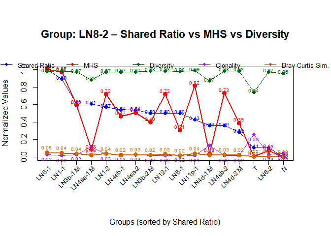

Gastric Cancer & lymph nodes
================

Run this after gc_ln_TCR and gc_ln_BCR.

# 0. Initial Settings

``` r
# Load the required libraries
library(ggplot2)
library(readr)
library(dplyr)
```

    ## 
    ## Attaching package: 'dplyr'

    ## The following objects are masked from 'package:stats':
    ## 
    ##     filter, lag

    ## The following objects are masked from 'package:base':
    ## 
    ##     intersect, setdiff, setequal, union

``` r
library(circlize)
```

    ## ========================================
    ## circlize version 0.4.16
    ## CRAN page: https://cran.r-project.org/package=circlize
    ## Github page: https://github.com/jokergoo/circlize
    ## Documentation: https://jokergoo.github.io/circlize_book/book/
    ## 
    ## If you use it in published research, please cite:
    ## Gu, Z. circlize implements and enhances circular visualization
    ##   in R. Bioinformatics 2014.
    ## 
    ## This message can be suppressed by:
    ##   suppressPackageStartupMessages(library(circlize))
    ## ========================================

``` r
library(openxlsx)
library(glmnet)
```

    ## Loading required package: Matrix

    ## Loaded glmnet 4.1-9

``` r
library(tidyr)
```

    ## 
    ## Attaching package: 'tidyr'

    ## The following objects are masked from 'package:Matrix':
    ## 
    ##     expand, pack, unpack

``` r
library(ggdendro)
library(tibble)
library(patchwork)
library(kableExtra)
```

    ## 
    ## Attaching package: 'kableExtra'

    ## The following object is masked from 'package:dplyr':
    ## 
    ##     group_rows

``` r
library(tidyverse)
```

    ## ── Attaching core tidyverse packages ──────────────────────── tidyverse 2.0.0 ──
    ## ✔ forcats   1.0.0     ✔ purrr     1.0.4
    ## ✔ lubridate 1.9.4     ✔ stringr   1.5.1

    ## ── Conflicts ────────────────────────────────────────── tidyverse_conflicts() ──
    ## ✖ tidyr::expand()          masks Matrix::expand()
    ## ✖ dplyr::filter()          masks stats::filter()
    ## ✖ kableExtra::group_rows() masks dplyr::group_rows()
    ## ✖ dplyr::lag()             masks stats::lag()
    ## ✖ tidyr::pack()            masks Matrix::pack()
    ## ✖ tidyr::unpack()          masks Matrix::unpack()
    ## ℹ Use the conflicted package (<http://conflicted.r-lib.org/>) to force all conflicts to become errors

``` r
library(ggpubr)

# Set seed for reproducibility
set.seed(42)
# Use the normal numerical representation
options(scipen = 999)
```

# TCR

# 1. Load Data

    ## Loaded: IS74LN1.1_filtered_contig_annotations

    ## Loaded: IS74LN1.2_filtered_contig_annotations

    ## Loaded: IS74LN11p_filtered_contig_annotations

    ## Loaded: IS74LN12_filtered_contig_annotations

    ## Loaded: IS74LN3b.1.M_filtered_contig_annotations

    ## Loaded: IS74LN3b.2.M_filtered_contig_annotations

    ## Loaded: IS74LN4d.1.M_filtered_contig_annotations

    ## Loaded: IS74LN4d.2.M_filtered_contig_annotations

    ## Loaded: IS74LN4sa.1.M_filtered_contig_annotations

    ## Loaded: IS74LN4sa.2_filtered_contig_annotations

    ## Loaded: IS74LN4sb.1_filtered_contig_annotations

    ## Loaded: IS74LN4sb.2_filtered_contig_annotations

    ## Loaded: IS74LN6.1_filtered_contig_annotations

    ## Loaded: IS74LN6.2_filtered_contig_annotations

    ## Loaded: IS74LN8.1_filtered_contig_annotations

    ## Loaded: IS74LN8.2_filtered_contig_annotations

    ## Loaded: IS74N_filtered_contig_annotations

    ## Loaded: IS74T_filtered_contig_annotations

``` r
# Clean up the dataframe names by removing "_filtered_contig_annotations" from names
names(data_list) <- gsub("_filtered_contig_annotations", "", names(data_list))
# Display the names of the data frames
print(names(data_list))
```

    ##  [1] "IS74LN1.1"     "IS74LN1.2"     "IS74LN11p"     "IS74LN12"     
    ##  [5] "IS74LN3b.1.M"  "IS74LN3b.2.M"  "IS74LN4d.1.M"  "IS74LN4d.2.M" 
    ##  [9] "IS74LN4sa.1.M" "IS74LN4sa.2"   "IS74LN4sb.1"   "IS74LN4sb.2"  
    ## [13] "IS74LN6.1"     "IS74LN6.2"     "IS74LN8.1"     "IS74LN8.2"    
    ## [17] "IS74N"         "IS74T"

``` r
names(data_list) <- gsub("IS74", "", names(data_list))

# Display the updated names
print(names(data_list))
```

    ##  [1] "LN1.1"     "LN1.2"     "LN11p"     "LN12"      "LN3b.1.M"  "LN3b.2.M" 
    ##  [7] "LN4d.1.M"  "LN4d.2.M"  "LN4sa.1.M" "LN4sa.2"   "LN4sb.1"   "LN4sb.2"  
    ## [13] "LN6.1"     "LN6.2"     "LN8.1"     "LN8.2"     "N"         "T"

``` r
# Replace dots with hyphens in names except for 'M' (for 'M' it should remain as is)
names(data_list) <- sapply(names(data_list), function(name) {
  gsub("\\.(?!M)", "-", name, perl = TRUE)
})

# Display the updated names after replacing dots
print(names(data_list))
```

    ##  [1] "LN1-1"     "LN1-2"     "LN11p"     "LN12"      "LN3b-1.M"  "LN3b-2.M" 
    ##  [7] "LN4d-1.M"  "LN4d-2.M"  "LN4sa-1.M" "LN4sa-2"   "LN4sb-1"   "LN4sb-2"  
    ## [13] "LN6-1"     "LN6-2"     "LN8-1"     "LN8-2"     "N"         "T"

``` r
# Add 'group' column to each dataset with the dataset name
for(i in 1:length(data_list)) {
  dataset_name <- names(data_list)[i]
  data_list[[i]] <- data_list[[i]] |>
    mutate(group = dataset_name)
}

# Combine all datasets into a single dataframe
data <- bind_rows(data_list)

# Check the first few rows to confirm the group column was added correctly
# head(data$group); tail(data$group)

# Count the number of rows per group
print(data |>
      count(group) |>
      arrange(desc(n)))
```

    ## # A tibble: 18 × 2
    ##    group         n
    ##    <chr>     <int>
    ##  1 LN1-2      9798
    ##  2 LN1-1      8959
    ##  3 LN11p      8952
    ##  4 LN12       8801
    ##  5 LN8-2      8732
    ##  6 LN3b-1.M   8027
    ##  7 LN4sa-1.M  7843
    ##  8 LN4sb-1    7611
    ##  9 LN4sb-2    7203
    ## 10 LN3b-2.M   7195
    ## 11 LN4sa-2    7091
    ## 12 LN8-1      6959
    ## 13 LN6-1      6690
    ## 14 LN4d-2.M   5769
    ## 15 LN4d-1.M   4887
    ## 16 LN6-2      4451
    ## 17 T          2282
    ## 18 N           123

# 2. Data Preprocessing

``` r
# Remove the data_list from the environment
rm(data_list)
# Select 'barcode', 'chain', 'v_gene','d_gene','j_gene', 'cdr3' columns
# data <- data |>
#   select(barcode, chain, v_gene, d_gene, j_gene, cdr3)

# Filter 'TRB' in the 'Chain' column
data <- data |>
  filter(chain == "TRB")

# Drop the 'chain' column since it's utilized
data <- data |>
  select(-chain)

# Check the number of cdr3
length(data$cdr3)
```

    ## [1] 66232

``` r
# Delete the data in cdr3 which shows only 1 occurrence
data <- data |>
  group_by(cdr3) |>
  filter(n() > 1) |>
  ungroup()
# Check the number of cdr3
length(data$cdr3)
```

    ## [1] 15692

``` r
# Count the number of unique number of cdr3
length(unique(data$group))
```

    ## [1] 18

``` r
#  Filter out cdr3 sequences that appear in all groups
cat("Number of CDR3 sequences(unique) before filtering:", length(unique(data$cdr3)), "\n")
```

    ## Number of CDR3 sequences(unique) before filtering: 4581

``` r
cat("Number of CDR3 sequences(total) before filtering:", length(data$cdr3), "\n")
```

    ## Number of CDR3 sequences(total) before filtering: 15692

``` r
# Identify all unique groups
unique_groups <- unique(data$group)
num_groups <- length(unique_groups)

# Find CDR3 sequences that appear in all groups
data <- data |>
  group_by(cdr3) |>
  filter(n_distinct(group) < num_groups) |>
  ungroup()

# Report the filtering results
cat("Number of unique groups:", num_groups, "\n")
```

    ## Number of unique groups: 18

``` r
cat("Number of CDR3 sequences(unique) after filtering:", length(unique(data$cdr3)), "\n")
```

    ## Number of CDR3 sequences(unique) after filtering: 4578

``` r
cat("Number of CDR3 sequences(total) after filtering:", length(data$cdr3), "\n")
```

    ## Number of CDR3 sequences(total) after filtering: 15087

``` r
# Check the number of cdr3 sequences that appear in T and N groups only
cat("Number of CDR3 sequences(unique) in T and N groups only:", length(unique(data$cdr3[data$group %in% c("T", "N")])), "\n")
```

    ## Number of CDR3 sequences(unique) in T and N groups only: 336

``` r
cat("Number of CDR3 sequences(total) in T and N groups only:", length(data$cdr3[data$group %in% c("T", "N")]), "\n")
```

    ## Number of CDR3 sequences(total) in T and N groups only: 828

``` r
# 각 그룹의 cdr3 추출
cdr3_T <- unique(data$cdr3[data$group == "T"])
cdr3_N <- unique(data$cdr3[data$group == "N"])

# T와 N 모두에 존재하는 cdr3 추출
shared_cdr3_TN <- intersect(cdr3_T, cdr3_N)

# 개수 출력
length(shared_cdr3_TN)
```

    ## [1] 11

# (option1) Remove cdr3 that appear in both T and N groups

``` r
# T와 N 둘 다에 존재하는 cdr3를 전부 제거
shared_cdr3 <- intersect(
  unique(data$cdr3[data$group == "T"]),
  unique(data$cdr3[data$group == "N"])
)
data <- data |> filter(!cdr3 %in% shared_cdr3)

TCR_output_dir <- "TCR_outputs/outputs_TN_rmvd"
```

# (option2) Remove cdr3 that appear in both T and N groups ‘only’

``` r
# # Filter out cdr3 sequences that appear in T and N groups only
# data <- data |>
#   group_by(cdr3) |>
#   filter(!all(group %in% c("T", "N"))) |>
#   ungroup()

# TCR_output_dir <- "TCR_outputs/outputs_TN_only_rmvd"
```

``` r
# Count occurrences of each unique cdr3 value
cdr3_idxs <- data |>
  count(cdr3, name = "Count") |>
  arrange(desc(Count))

# Get Frequencies for all CDR3s
cdr3_idxs <- cdr3_idxs |>
  mutate(Frequency = Count / sum(Count))

# Check the first few rows of the cdr3_idxs dataframe
print(head(cdr3_idxs))
```

    ## # A tibble: 6 × 3
    ##   cdr3            Count Frequency
    ##   <chr>           <int>     <dbl>
    ## 1 CASSPFDRDGQPQHF   435   0.0292 
    ## 2 CASSSMRNEQFF      412   0.0277 
    ## 3 CASSTRRGNNEAFF    145   0.00974
    ## 4 CASEKLNTDTQYF     136   0.00913
    ## 5 CASSMGTPSGQYF     136   0.00913
    ## 6 CASSSTGTSGYEQYF   104   0.00698

``` r
# Shannon Entropy (Diversity index)
# The higher the value, the more diverse the cdr3 sequences are distributed
patient_shannon_entropy <- -sum(cdr3_idxs$Frequency * log(cdr3_idxs$Frequency, base=2))

# Shannon clonality
# Opposite meaning of Diversity index
# The higher the value, the more clonal the cdr3 sequences are distributed
richness <- nrow(cdr3_idxs) # Richness: Number of unique cdr3 sequences
patient_shannon_entropy_normalized <- patient_shannon_entropy / log(richness, base=2)
patient_shannon_clonality <- 1 - patient_shannon_entropy / log(richness, base=2)

cdr3_idxs <- cdr3_idxs |>
  mutate(Diversity = patient_shannon_entropy_normalized,
         Clonality = patient_shannon_clonality)

head(cdr3_idxs)
```

    ## # A tibble: 6 × 5
    ##   cdr3            Count Frequency Diversity Clonality
    ##   <chr>           <int>     <dbl>     <dbl>     <dbl>
    ## 1 CASSPFDRDGQPQHF   435   0.0292      0.926    0.0738
    ## 2 CASSSMRNEQFF      412   0.0277      0.926    0.0738
    ## 3 CASSTRRGNNEAFF    145   0.00974     0.926    0.0738
    ## 4 CASEKLNTDTQYF     136   0.00913     0.926    0.0738
    ## 5 CASSMGTPSGQYF     136   0.00913     0.926    0.0738
    ## 6 CASSSTGTSGYEQYF   104   0.00698     0.926    0.0738

``` r
# Write to CSV file
write.csv(cdr3_idxs, file.path(TCR_output_dir, "IS74_cdr3_idxs.csv"), row.names = FALSE)
```

# 2.1.1 MHS by group

``` r
df_tcr <- data

# Calculate Morisita-Horn Similarity (MHS) between all groups
# Initialize results matrix
all_groups <- unique(df_tcr$group)
n_groups <- length(all_groups)
tcr_mhs_matrix <- matrix(0, nrow = n_groups, ncol = n_groups)
rownames(tcr_mhs_matrix) <- all_groups
colnames(tcr_mhs_matrix) <- all_groups
```

``` r
# Calculate MHS for each pair of groups
for (i in 1:n_groups) {
  group_i <- all_groups[i]
  
  # Count cdr3 occurrences for group i
  counts_i <- df_tcr |>
    filter(group == group_i) |>
    count(cdr3) |>
    rename(count_i = n)
  
  for (j in 1:n_groups) {
    group_j <- all_groups[j]
    
    # For diagonal elements (same group), set MHS to 1
    if (i == j) {
      tcr_mhs_matrix[i, j] <- 1
      next
    }
    
    # Count cdr3 occurrences for group j
    counts_j <- df_tcr |>
      filter(group == group_j) |>
      count(cdr3) |>
      rename(count_j = n)
    
    # Join the two count dataframes
    joint_counts <- full_join(counts_i, counts_j, by = "cdr3") |>
      replace_na(list(count_i = 0, count_j = 0))
    
    # Calculate components of MHS formula
    X <- sum(joint_counts$count_i)
    Y <- sum(joint_counts$count_j)
    
    # Check for zero counts to avoid division by zero
    if(X == 0 || Y == 0) {
      mhs <- 0
    } else {
      sum_xy <- sum(joint_counts$count_i * joint_counts$count_j)
      sum_x2_X <- sum(joint_counts$count_i^2) / (X^2)
      sum_y2_Y <- sum(joint_counts$count_j^2) / (Y^2)
      
      numerator <- 2 * sum_xy
      denominator <- (sum_x2_X + sum_y2_Y) * X * Y
      
      mhs <- if(denominator == 0) 0 else numerator / denominator
    }
    
    tcr_mhs_matrix[i, j] <- mhs
  }
}

# Sort by similarity with T group if T exists
if ("T" %in% rownames(tcr_mhs_matrix)) {
  # Get the similarities with T
  t_similarities <- tcr_mhs_matrix["T", ]
  
  # Get the names of groups other than T
  other_groups <- setdiff(rownames(tcr_mhs_matrix), "T")
  
  # Sort the other groups by their similarity to T
  sorted_groups <- other_groups[order(t_similarities[other_groups], decreasing = TRUE)]
  
  # New order: T first, then others sorted by similarity to T
  new_order <- c("T", sorted_groups)
  
  # Reorder the matrix rows and columns
  tcr_mhs_matrix <- tcr_mhs_matrix[new_order, new_order]
}

# Round to 4 decimal places for display
tcr_mhs_matrix_rounded <- round(tcr_mhs_matrix, 4)

# Display the matrix with kable
knitr::kable(tcr_mhs_matrix_rounded, caption = "Morisita-Horn Similarity Matrix between all groups")
```

|  | T | LN6-1 | LN6-2 | LN1-1 | LN3b-2.M | LN4d-1.M | LN1-2 | LN4sa-1.M | LN4sa-2 | LN4sb-2 | LN4d-2.M | LN3b-1.M | LN8-1 | LN8-2 | LN12 | LN4sb-1 | LN11p | N |
|:---|---:|---:|---:|---:|---:|---:|---:|---:|---:|---:|---:|---:|---:|---:|---:|---:|---:|---:|
| T | 1.0000 | 0.2316 | 0.2091 | 0.2014 | 0.1908 | 0.1902 | 0.1834 | 0.1782 | 0.1656 | 0.1611 | 0.1576 | 0.1500 | 0.1482 | 0.1474 | 0.1341 | 0.1180 | 0.1063 | 0.0000 |
| LN6-1 | 0.2316 | 1.0000 | 0.6439 | 0.7134 | 0.6928 | 0.6289 | 0.6954 | 0.6787 | 0.6317 | 0.6273 | 0.5072 | 0.5491 | 0.5864 | 0.5905 | 0.5256 | 0.4318 | 0.3603 | 0.0014 |
| LN6-2 | 0.2091 | 0.6439 | 1.0000 | 0.6456 | 0.6476 | 0.5734 | 0.6231 | 0.6609 | 0.6267 | 0.5648 | 0.4987 | 0.5266 | 0.5112 | 0.5352 | 0.5564 | 0.4117 | 0.3350 | 0.0034 |
| LN1-1 | 0.2014 | 0.7134 | 0.6456 | 1.0000 | 0.7214 | 0.6697 | 0.7268 | 0.7120 | 0.6675 | 0.6507 | 0.5334 | 0.6029 | 0.6065 | 0.5949 | 0.5193 | 0.5061 | 0.2994 | 0.0018 |
| LN3b-2.M | 0.1908 | 0.6928 | 0.6476 | 0.7214 | 1.0000 | 0.6304 | 0.7098 | 0.6835 | 0.6455 | 0.6135 | 0.5450 | 0.5947 | 0.5945 | 0.5803 | 0.5243 | 0.4785 | 0.2789 | 0.0022 |
| LN4d-1.M | 0.1902 | 0.6289 | 0.5734 | 0.6697 | 0.6304 | 1.0000 | 0.6398 | 0.6280 | 0.6056 | 0.5767 | 0.5035 | 0.5318 | 0.5361 | 0.5417 | 0.4620 | 0.4714 | 0.2769 | 0.0067 |
| LN1-2 | 0.1834 | 0.6954 | 0.6231 | 0.7268 | 0.7098 | 0.6398 | 1.0000 | 0.6442 | 0.6068 | 0.6210 | 0.5359 | 0.5870 | 0.6036 | 0.6372 | 0.5499 | 0.5245 | 0.3912 | 0.0018 |
| LN4sa-1.M | 0.1782 | 0.6787 | 0.6609 | 0.7120 | 0.6835 | 0.6280 | 0.6442 | 1.0000 | 0.7924 | 0.6394 | 0.4808 | 0.5234 | 0.5600 | 0.5600 | 0.5842 | 0.4263 | 0.3399 | 0.0000 |
| LN4sa-2 | 0.1656 | 0.6317 | 0.6267 | 0.6675 | 0.6455 | 0.6056 | 0.6068 | 0.7924 | 1.0000 | 0.6305 | 0.4830 | 0.5275 | 0.5393 | 0.5451 | 0.5483 | 0.4050 | 0.2787 | 0.0000 |
| LN4sb-2 | 0.1611 | 0.6273 | 0.5648 | 0.6507 | 0.6135 | 0.5767 | 0.6210 | 0.6394 | 0.6305 | 1.0000 | 0.4643 | 0.5307 | 0.5153 | 0.5344 | 0.5558 | 0.4586 | 0.3441 | 0.0000 |
| LN4d-2.M | 0.1576 | 0.5072 | 0.4987 | 0.5334 | 0.5450 | 0.5035 | 0.5359 | 0.4808 | 0.4830 | 0.4643 | 1.0000 | 0.4624 | 0.4427 | 0.4505 | 0.3819 | 0.3831 | 0.2326 | 0.0017 |
| LN3b-1.M | 0.1500 | 0.5491 | 0.5266 | 0.6029 | 0.5947 | 0.5318 | 0.5870 | 0.5234 | 0.5275 | 0.5307 | 0.4624 | 1.0000 | 0.4965 | 0.5075 | 0.4351 | 0.4444 | 0.2551 | 0.0000 |
| LN8-1 | 0.1482 | 0.5864 | 0.5112 | 0.6065 | 0.5945 | 0.5361 | 0.6036 | 0.5600 | 0.5393 | 0.5153 | 0.4427 | 0.4965 | 1.0000 | 0.5230 | 0.4585 | 0.4216 | 0.2664 | 0.0019 |
| LN8-2 | 0.1474 | 0.5905 | 0.5352 | 0.5949 | 0.5803 | 0.5417 | 0.6372 | 0.5600 | 0.5451 | 0.5344 | 0.4505 | 0.5075 | 0.5230 | 1.0000 | 0.5342 | 0.4371 | 0.4345 | 0.0050 |
| LN12 | 0.1341 | 0.5256 | 0.5564 | 0.5193 | 0.5243 | 0.4620 | 0.5499 | 0.5842 | 0.5483 | 0.5558 | 0.3819 | 0.4351 | 0.4585 | 0.5342 | 1.0000 | 0.3984 | 0.5946 | 0.0000 |
| LN4sb-1 | 0.1180 | 0.4318 | 0.4117 | 0.5061 | 0.4785 | 0.4714 | 0.5245 | 0.4263 | 0.4050 | 0.4586 | 0.3831 | 0.4444 | 0.4216 | 0.4371 | 0.3984 | 1.0000 | 0.2716 | 0.0000 |
| LN11p | 0.1063 | 0.3603 | 0.3350 | 0.2994 | 0.2789 | 0.2769 | 0.3912 | 0.3399 | 0.2787 | 0.3441 | 0.2326 | 0.2551 | 0.2664 | 0.4345 | 0.5946 | 0.2716 | 1.0000 | 0.0073 |
| N | 0.0000 | 0.0014 | 0.0034 | 0.0018 | 0.0022 | 0.0067 | 0.0018 | 0.0000 | 0.0000 | 0.0000 | 0.0017 | 0.0000 | 0.0019 | 0.0050 | 0.0000 | 0.0000 | 0.0073 | 1.0000 |

Morisita-Horn Similarity Matrix between all groups

``` r
# Save the matrix to a CSV file
write.csv(format(tcr_mhs_matrix, scientific = FALSE), file.path(TCR_output_dir, "IS74_morisita_horn_similarity.csv"), row.names = TRUE)
```

# 2.1.2 MHS Boxplot + Dendrogram

``` r
# tcr_mhs_matrix: 행렬 객체로 이미 불러왔다고 가정
# 1. 행렬을 long format으로 변환
mhs_long <- as.data.frame(tcr_mhs_matrix) |>
  rownames_to_column(var = "Group1") |>
  pivot_longer(-Group1, names_to = "Group2", values_to = "MHS") |>
  filter(Group1 != Group2)  # 대각 제외 (MHS=1)

# 2. 각 Group별로 유사도값(Boxplot용) 추출
box_data <- mhs_long |>
  group_by(Group1) |>
  summarise(values = list(MHS)) |>
  column_to_rownames("Group1")

# 3. 그룹별 분포를 행으로 하는 데이터프레임 생성
box_matrix <- do.call(rbind, lapply(box_data$values, function(x) {
  length_out <- max(sapply(box_data$values, length))
  c(x, rep(NA, length_out - length(x)))  # 길이 맞추기
}))
rownames(box_matrix) <- rownames(box_data)

# 4. 거리 행렬 생성 (correlation 기반 distance)
cor_mat <- cor(t(box_matrix), use = "pairwise.complete.obs")
cor_mat[is.na(cor_mat)] <- 0  # NA 처리
dist_mat <- as.dist(1 - cor_mat)

# 5. 클러스터링
hc <- hclust(dist_mat, method = "average")

# 6. Dendrogram용 데이터
### 1. 클러스터링 순서에 따른 그룹 레벨 지정
# Get group order from hierarchical clustering
group_levels <- hc$labels[hc$order]

# Prepare data for boxplot with correctly ordered factor levels
mhs_long <- as.data.frame(tcr_mhs_matrix) |>
  rownames_to_column(var = "Group1") |>
  pivot_longer(-Group1, names_to = "Group2", values_to = "MHS") |>
  filter(Group1 != Group2)  # Remove diagonal elements

# Set factor levels based on dendrogram order
mhs_long$Group1 <- factor(mhs_long$Group1, levels = group_levels)
mhs_long$Group2 <- factor(mhs_long$Group2, levels = group_levels)

# Create dendrogram data
dend <- as.dendrogram(hc)
dendro_data <- dendro_data(dend, type = "rectangle")

# Horizontal dendrogram with root on left side - remove the labels
p_tree <- ggplot() +
  geom_segment(data = segment(dendro_data),
               aes(x = y, y = x, xend = yend, yend = xend)) +  # Flip x and y
  scale_y_continuous(breaks = seq_along(group_levels)) +  # Remove labels here
  scale_x_reverse() +  # Add this line to flip the x-axis direction
  theme_void() +
  theme(
    plot.margin = unit(c(0, 2, 0, 0), "mm"),
    axis.text.y = element_blank()  # Hide y-axis text
  )

# Boxplot following dendrogram order
p_box <- ggplot(mhs_long, aes(x = MHS, y = Group1)) +
  geom_boxplot(outlier.size = 1) +
  theme_minimal(base_size = 10) +
  labs(x = "Morisita-Horn Similarity", y = NULL) +
  theme(
    axis.text.y = element_blank(),
    axis.ticks.y = element_blank(),
    panel.grid.major.y = element_blank(),
    plot.margin = unit(c(0, 2, 0, 2), "mm")
  )

# Group labels
p_label <- ggplot(data.frame(Group = group_levels), aes(x = 1, y = Group, label = Group)) +
  geom_text(hjust = 0) +
  scale_y_discrete(limits = group_levels) +
  theme_void() +
  theme(
    plot.margin = unit(c(0, 0, 0, 2), "mm")
  )

# Combine plots with patchwork
p_tree + p_box + p_label + 
  plot_layout(widths = c(1.2, 2.5, 1)) +
  plot_annotation(
    title = "MHS Dendrogram + Boxplot of IS74",
    theme = theme(plot.title = element_text(hjust = 0.5))  # Center the title
  )  
```

<!-- --> \##
Calculate Boxplot’s statistics

``` r
# Calculate boxplot statistics by Group1
mhs_stats <- mhs_long |>
  group_by(Group1) |>
  summarize(
    Count = n(),
    Mean = mean(MHS),
    Median = median(MHS),
    Min = min(MHS),
    Q1 = quantile(MHS, 0.25),
    Q3 = quantile(MHS, 0.75),
    Max = max(MHS),
    IQR = Q3 - Q1,
    StdDev = sd(MHS)
  ) |>
  arrange(desc(Median))  # Sort by median MHS value

# Display the statistics
kable(mhs_stats, caption = "Morisita-Horn Similarity Statistics by Group", digits = 4)
```

| Group1    | Count |   Mean | Median |    Min |     Q1 |     Q3 |    Max |    IQR | StdDev |
|:----------|------:|-------:|-------:|-------:|-------:|-------:|-------:|-------:|-------:|
| LN1-2     |    17 | 0.5460 | 0.6068 | 0.0018 | 0.5359 | 0.6398 | 0.7268 | 0.1038 | 0.1906 |
| LN1-1     |    17 | 0.5513 | 0.6065 | 0.0018 | 0.5193 | 0.6697 | 0.7268 | 0.1504 | 0.2026 |
| LN3b-2.M  |    17 | 0.5373 | 0.5947 | 0.0022 | 0.5243 | 0.6476 | 0.7214 | 0.1233 | 0.1989 |
| LN6-1     |    17 | 0.5351 | 0.5905 | 0.0014 | 0.5072 | 0.6439 | 0.7134 | 0.1367 | 0.1881 |
| LN4sa-1.M |    17 | 0.5348 | 0.5842 | 0.0000 | 0.4808 | 0.6609 | 0.7924 | 0.1801 | 0.2028 |
| LN6-2     |    17 | 0.5043 | 0.5564 | 0.0034 | 0.4987 | 0.6267 | 0.6609 | 0.1280 | 0.1771 |
| LN4sb-2   |    17 | 0.4993 | 0.5558 | 0.0000 | 0.4643 | 0.6210 | 0.6507 | 0.1567 | 0.1786 |
| LN4sa-2   |    17 | 0.5117 | 0.5483 | 0.0000 | 0.4830 | 0.6305 | 0.7924 | 0.1475 | 0.1988 |
| LN4d-1.M  |    17 | 0.4984 | 0.5417 | 0.0067 | 0.4714 | 0.6280 | 0.6697 | 0.1566 | 0.1796 |
| LN8-2     |    17 | 0.4799 | 0.5344 | 0.0050 | 0.4505 | 0.5600 | 0.6372 | 0.1095 | 0.1634 |
| LN12      |    17 | 0.4566 | 0.5243 | 0.0000 | 0.4351 | 0.5499 | 0.5946 | 0.1148 | 0.1608 |
| LN3b-1.M  |    17 | 0.4544 | 0.5234 | 0.0000 | 0.4444 | 0.5318 | 0.6029 | 0.0874 | 0.1657 |
| LN8-1     |    17 | 0.4595 | 0.5153 | 0.0019 | 0.4427 | 0.5600 | 0.6065 | 0.1173 | 0.1687 |
| LN4d-2.M  |    17 | 0.4155 | 0.4643 | 0.0017 | 0.3831 | 0.5035 | 0.5450 | 0.1203 | 0.1494 |
| LN4sb-1   |    17 | 0.3875 | 0.4263 | 0.0000 | 0.3984 | 0.4586 | 0.5245 | 0.0603 | 0.1371 |
| LN11p     |    17 | 0.2984 | 0.2789 | 0.0073 | 0.2664 | 0.3441 | 0.5946 | 0.0777 | 0.1262 |
| T         |    17 | 0.1572 | 0.1611 | 0.0000 | 0.1474 | 0.1902 | 0.2316 | 0.0428 | 0.0520 |
| N         |    17 | 0.0020 | 0.0017 | 0.0000 | 0.0000 | 0.0022 | 0.0073 | 0.0022 | 0.0024 |

Morisita-Horn Similarity Statistics by Group

``` r
# Save to CSV file
write.csv(mhs_stats, file.path(TCR_output_dir, "IS74_mhs_statistics.csv"), row.names = FALSE)
```

# 2.2 Frequency, Shannon Entropy, Shannon Clonality by group

``` r
# Initialize a dataframe to store results
cdr3_idx_by_group <- data.frame(Group = character(), 
                Total_CDR3 = numeric(),
                Unique_CDR3 = numeric(),
                Entropy = numeric(), 
                Nor.d_Entropy = numeric(), 
                Clonality = numeric())

# For each unique group in the dataset
for (group_name in unique(df_tcr$group)) {
  # Filter data for current group
  group_data <- df_tcr |> filter(group == group_name)
  
  # Count occurrences of each cdr3 in this group
  cdr3_counts <- group_data |> 
  count(cdr3, name = "Count") |>
  arrange(desc(Count))
  
  # Add frequency column
  cdr3_counts <- cdr3_counts |>
  mutate(Frequency = Count / sum(Count))
  
  # Calculate the Shannon Entropy
  entropy <- -sum(cdr3_counts$Frequency * log(cdr3_counts$Frequency, base=2))
  
  # Calculate the normalized Shannon Entropy and Clonality
  richness <- nrow(cdr3_counts)  # Number of unique cdr3 values
  nor_entropy <- entropy / log(richness, base=2)
  clonality <- 1 - nor_entropy
  
  # Add results to the dataframe
  cdr3_idx_by_group <- rbind(cdr3_idx_by_group, 
               data.frame(Group = group_name,
                    Total_CDR3 = sum(cdr3_counts$Count),
                    Unique_CDR3 = richness,
                    Entropy = entropy,
                    Nor.d_Entropy = nor_entropy,
                    Clonality = clonality))
}

# Round the numeric values for better display
cdr3_idx_by_group <- cdr3_idx_by_group |>
  mutate(across(where(is.numeric), ~round(., 4)))

# Display the results with kable
knitr::kable(cdr3_idx_by_group, caption = "Shannon Entropy and Clonality by Group")
```

| Group     | Total_CDR3 | Unique_CDR3 | Entropy | Nor.d_Entropy | Clonality |
|:----------|-----------:|------------:|--------:|--------------:|----------:|
| LN1-1     |       1144 |         692 |  8.9132 |        0.9447 |    0.0553 |
| LN1-2     |       1146 |         768 |  9.1258 |        0.9521 |    0.0479 |
| LN11p     |        824 |         550 |  8.5599 |        0.9403 |    0.0597 |
| LN12      |        944 |         633 |  8.8584 |        0.9519 |    0.0481 |
| LN3b-1.M  |        900 |         662 |  9.0865 |        0.9697 |    0.0303 |
| LN3b-2.M  |        956 |         668 |  8.9785 |        0.9568 |    0.0432 |
| LN4d-1.M  |        619 |         459 |  8.5151 |        0.9630 |    0.0370 |
| LN4d-2.M  |        605 |         486 |  8.7206 |        0.9771 |    0.0229 |
| LN4sa-1.M |       1127 |         644 |  8.6402 |        0.9260 |    0.0740 |
| LN4sa-2   |        951 |         618 |  8.8019 |        0.9494 |    0.0506 |
| LN4sb-1   |        934 |         633 |  9.0217 |        0.9694 |    0.0306 |
| LN4sb-2   |        696 |         521 |  8.7208 |        0.9663 |    0.0337 |
| LN6-1     |        736 |         508 |  8.5507 |        0.9513 |    0.0487 |
| LN6-2     |        603 |         406 |  8.2891 |        0.9566 |    0.0434 |
| LN8-1     |       1120 |         660 |  9.0416 |        0.9653 |    0.0347 |
| LN8-2     |        853 |         589 |  8.9012 |        0.9673 |    0.0327 |
| N         |         22 |          16 |  3.8231 |        0.9558 |    0.0442 |
| T         |        712 |         309 |  7.6348 |        0.9230 |    0.0770 |

Shannon Entropy and Clonality by Group

``` r
# Save the results to a CSV file
write.csv(cdr3_idx_by_group, file.path(TCR_output_dir, "IS74_cdr3_idx_by_group.csv"), row.names = FALSE)
```

# 3. Frequency Analysis

## 3.1 Absolute frequency duplication of cdr3 by group

``` r
# Step 1: cdr3별 group에서의 등장 횟수 세기
cdr3_group_counts <- df_tcr |>
  group_by(cdr3, group) |>
  summarise(count = n(), .groups = "drop")

# Step 2: wide 포맷으로 변환 (cdr3 × group, 값은 count)
frequency_matrix <- cdr3_group_counts |>
  pivot_wider(
    id_cols = cdr3,
    names_from = group,
    values_from = count,
    values_fill = 0
  )

# Step 3: Convert to matrix for efficient operations
freq_mat <- as.matrix(frequency_matrix[, -1])
rownames(freq_mat) <- frequency_matrix$cdr3
group_names <- colnames(freq_mat)

# Step 4: 그룹 간 min(count) 누적해서 절대중복량 계산
n_group <- length(group_names)
duplication_matrix <- matrix(0, nrow = n_group, ncol = n_group)
rownames(duplication_matrix) <- group_names
colnames(duplication_matrix) <- group_names

for (i in 1:n_group) {
  for (j in i:n_group) {
    vec_i <- freq_mat[, i]
    vec_j <- freq_mat[, j]
    min_sum <- sum(pmin(vec_i, vec_j))  # cdr3별로 최소 등장 수
    duplication_matrix[i, j] <- min_sum
    duplication_matrix[j, i] <- min_sum  # 대칭 행렬
  }
}

# Step 5: T 기준 정렬
if ("T" %in% group_names) {
  t_overlap <- duplication_matrix["T", ]
  others <- setdiff(names(t_overlap), "T")
  sorted_others <- others[order(t_overlap[others], decreasing = TRUE)]
  new_order <- c("T", sorted_others)
  duplication_matrix <- duplication_matrix[new_order, new_order]
}

# Create a percentage matrix where each element is expressed as
# a percentage of the corresponding diagonal element
tcr_percentage_matrix <- duplication_matrix
for (i in 1:nrow(tcr_percentage_matrix)) {
  for (j in 1:ncol(tcr_percentage_matrix)) {
    if (i != j) {  # Non-diagonal elements
      # Calculate what percentage of group i's unique CDR3s are shared with group j
      tcr_percentage_matrix[i, j] <- (duplication_matrix[i, j] / duplication_matrix[i, i]) * 100
    } else {
      # Set diagonal elements to 100%
      tcr_percentage_matrix[i, j] <- 100
    }
  }
}

# Round to two decimal places for cleaner display
tcr_percentage_matrix <- round(tcr_percentage_matrix, 2)

# Step 6: 출력
knitr::kable(duplication_matrix, caption = "Absolute cdr3 overlap")
```

|  | T | LN4sa-1.M | LN4sa-2 | LN3b-1.M | LN3b-2.M | LN6-2 | LN6-1 | LN12 | LN1-1 | LN4d-1.M | LN1-2 | LN8-1 | LN4d-2.M | LN11p | LN4sb-2 | LN8-2 | LN4sb-1 | N |
|:---|---:|---:|---:|---:|---:|---:|---:|---:|---:|---:|---:|---:|---:|---:|---:|---:|---:|---:|
| T | 712 | 103 | 103 | 84 | 83 | 83 | 76 | 74 | 74 | 73 | 71 | 67 | 65 | 64 | 63 | 63 | 58 | 0 |
| LN4sa-1.M | 103 | 1127 | 309 | 213 | 255 | 209 | 218 | 225 | 294 | 160 | 272 | 220 | 133 | 183 | 175 | 184 | 179 | 0 |
| LN4sa-2 | 103 | 309 | 951 | 197 | 206 | 196 | 159 | 189 | 210 | 153 | 222 | 177 | 129 | 130 | 157 | 165 | 152 | 0 |
| LN3b-1.M | 84 | 213 | 197 | 900 | 206 | 150 | 162 | 168 | 214 | 143 | 211 | 159 | 126 | 143 | 158 | 166 | 180 | 0 |
| LN3b-2.M | 83 | 255 | 206 | 206 | 956 | 175 | 197 | 192 | 236 | 153 | 243 | 203 | 140 | 148 | 164 | 180 | 174 | 2 |
| LN6-2 | 83 | 209 | 196 | 150 | 175 | 603 | 142 | 154 | 170 | 135 | 170 | 141 | 115 | 134 | 125 | 145 | 122 | 2 |
| LN6-1 | 76 | 218 | 159 | 162 | 197 | 142 | 736 | 184 | 217 | 135 | 222 | 194 | 106 | 155 | 165 | 170 | 151 | 1 |
| LN12 | 74 | 225 | 189 | 168 | 192 | 154 | 184 | 944 | 196 | 126 | 218 | 184 | 119 | 221 | 162 | 186 | 146 | 0 |
| LN1-1 | 74 | 294 | 210 | 214 | 236 | 170 | 217 | 196 | 1144 | 163 | 294 | 222 | 126 | 161 | 197 | 191 | 195 | 2 |
| LN4d-1.M | 73 | 160 | 153 | 143 | 153 | 135 | 135 | 126 | 163 | 619 | 171 | 137 | 113 | 109 | 131 | 138 | 151 | 3 |
| LN1-2 | 71 | 272 | 222 | 211 | 243 | 170 | 222 | 218 | 294 | 171 | 1146 | 229 | 137 | 180 | 207 | 230 | 232 | 2 |
| LN8-1 | 67 | 220 | 177 | 159 | 203 | 141 | 194 | 184 | 222 | 137 | 229 | 1120 | 116 | 139 | 159 | 169 | 150 | 2 |
| LN4d-2.M | 65 | 133 | 129 | 126 | 140 | 115 | 106 | 119 | 126 | 113 | 137 | 116 | 605 | 98 | 99 | 113 | 112 | 1 |
| LN11p | 64 | 183 | 130 | 143 | 148 | 134 | 155 | 221 | 161 | 109 | 180 | 139 | 98 | 824 | 139 | 165 | 142 | 5 |
| LN4sb-2 | 63 | 175 | 157 | 158 | 164 | 125 | 165 | 162 | 197 | 131 | 207 | 159 | 99 | 139 | 696 | 154 | 170 | 0 |
| LN8-2 | 63 | 184 | 165 | 166 | 180 | 145 | 170 | 186 | 191 | 138 | 230 | 169 | 113 | 165 | 154 | 853 | 165 | 2 |
| LN4sb-1 | 58 | 179 | 152 | 180 | 174 | 122 | 151 | 146 | 195 | 151 | 232 | 150 | 112 | 142 | 170 | 165 | 934 | 0 |
| N | 0 | 0 | 0 | 0 | 2 | 2 | 1 | 0 | 2 | 3 | 2 | 2 | 1 | 5 | 0 | 2 | 0 | 22 |

Absolute cdr3 overlap

``` r
knitr::kable(tcr_percentage_matrix, caption = "Percentage of cdr3 overlap(Rowwise)")
```

|  | T | LN4sa-1.M | LN4sa-2 | LN3b-1.M | LN3b-2.M | LN6-2 | LN6-1 | LN12 | LN1-1 | LN4d-1.M | LN1-2 | LN8-1 | LN4d-2.M | LN11p | LN4sb-2 | LN8-2 | LN4sb-1 | N |
|:---|---:|---:|---:|---:|---:|---:|---:|---:|---:|---:|---:|---:|---:|---:|---:|---:|---:|---:|
| T | 100.00 | 14.47 | 14.47 | 11.80 | 11.66 | 11.66 | 10.67 | 10.39 | 10.39 | 10.25 | 9.97 | 9.41 | 9.13 | 8.99 | 8.85 | 8.85 | 8.15 | 0.00 |
| LN4sa-1.M | 9.14 | 100.00 | 27.42 | 18.90 | 22.63 | 18.54 | 19.34 | 19.96 | 26.09 | 14.20 | 24.13 | 19.52 | 11.80 | 16.24 | 15.53 | 16.33 | 15.88 | 0.00 |
| LN4sa-2 | 10.83 | 32.49 | 100.00 | 20.72 | 21.66 | 20.61 | 16.72 | 19.87 | 22.08 | 16.09 | 23.34 | 18.61 | 13.56 | 13.67 | 16.51 | 17.35 | 15.98 | 0.00 |
| LN3b-1.M | 9.33 | 23.67 | 21.89 | 100.00 | 22.89 | 16.67 | 18.00 | 18.67 | 23.78 | 15.89 | 23.44 | 17.67 | 14.00 | 15.89 | 17.56 | 18.44 | 20.00 | 0.00 |
| LN3b-2.M | 8.68 | 26.67 | 21.55 | 21.55 | 100.00 | 18.31 | 20.61 | 20.08 | 24.69 | 16.00 | 25.42 | 21.23 | 14.64 | 15.48 | 17.15 | 18.83 | 18.20 | 0.21 |
| LN6-2 | 13.76 | 34.66 | 32.50 | 24.88 | 29.02 | 100.00 | 23.55 | 25.54 | 28.19 | 22.39 | 28.19 | 23.38 | 19.07 | 22.22 | 20.73 | 24.05 | 20.23 | 0.33 |
| LN6-1 | 10.33 | 29.62 | 21.60 | 22.01 | 26.77 | 19.29 | 100.00 | 25.00 | 29.48 | 18.34 | 30.16 | 26.36 | 14.40 | 21.06 | 22.42 | 23.10 | 20.52 | 0.14 |
| LN12 | 7.84 | 23.83 | 20.02 | 17.80 | 20.34 | 16.31 | 19.49 | 100.00 | 20.76 | 13.35 | 23.09 | 19.49 | 12.61 | 23.41 | 17.16 | 19.70 | 15.47 | 0.00 |
| LN1-1 | 6.47 | 25.70 | 18.36 | 18.71 | 20.63 | 14.86 | 18.97 | 17.13 | 100.00 | 14.25 | 25.70 | 19.41 | 11.01 | 14.07 | 17.22 | 16.70 | 17.05 | 0.17 |
| LN4d-1.M | 11.79 | 25.85 | 24.72 | 23.10 | 24.72 | 21.81 | 21.81 | 20.36 | 26.33 | 100.00 | 27.63 | 22.13 | 18.26 | 17.61 | 21.16 | 22.29 | 24.39 | 0.48 |
| LN1-2 | 6.20 | 23.73 | 19.37 | 18.41 | 21.20 | 14.83 | 19.37 | 19.02 | 25.65 | 14.92 | 100.00 | 19.98 | 11.95 | 15.71 | 18.06 | 20.07 | 20.24 | 0.17 |
| LN8-1 | 5.98 | 19.64 | 15.80 | 14.20 | 18.12 | 12.59 | 17.32 | 16.43 | 19.82 | 12.23 | 20.45 | 100.00 | 10.36 | 12.41 | 14.20 | 15.09 | 13.39 | 0.18 |
| LN4d-2.M | 10.74 | 21.98 | 21.32 | 20.83 | 23.14 | 19.01 | 17.52 | 19.67 | 20.83 | 18.68 | 22.64 | 19.17 | 100.00 | 16.20 | 16.36 | 18.68 | 18.51 | 0.17 |
| LN11p | 7.77 | 22.21 | 15.78 | 17.35 | 17.96 | 16.26 | 18.81 | 26.82 | 19.54 | 13.23 | 21.84 | 16.87 | 11.89 | 100.00 | 16.87 | 20.02 | 17.23 | 0.61 |
| LN4sb-2 | 9.05 | 25.14 | 22.56 | 22.70 | 23.56 | 17.96 | 23.71 | 23.28 | 28.30 | 18.82 | 29.74 | 22.84 | 14.22 | 19.97 | 100.00 | 22.13 | 24.43 | 0.00 |
| LN8-2 | 7.39 | 21.57 | 19.34 | 19.46 | 21.10 | 17.00 | 19.93 | 21.81 | 22.39 | 16.18 | 26.96 | 19.81 | 13.25 | 19.34 | 18.05 | 100.00 | 19.34 | 0.23 |
| LN4sb-1 | 6.21 | 19.16 | 16.27 | 19.27 | 18.63 | 13.06 | 16.17 | 15.63 | 20.88 | 16.17 | 24.84 | 16.06 | 11.99 | 15.20 | 18.20 | 17.67 | 100.00 | 0.00 |
| N | 0.00 | 0.00 | 0.00 | 0.00 | 9.09 | 9.09 | 4.55 | 0.00 | 9.09 | 13.64 | 9.09 | 9.09 | 4.55 | 22.73 | 0.00 | 9.09 | 0.00 | 100.00 |

Percentage of cdr3 overlap(Rowwise)

``` r
# Step 7: Save the duplication matrix to a CSV file
write.csv(duplication_matrix, file.path(TCR_output_dir, "IS74_freq_cdr3_duplication_matrix.csv"), row.names = TRUE)
write.csv(tcr_percentage_matrix, file.path(TCR_output_dir, "IS74_freq_cdr3_duplication_matrix_rowwise_percent.csv"), row.names = TRUE)
```

## 3.2 cdr3 plot by frequency

``` r
# 1. Create link for cdr3 similarity
cdr3_groups <- df_tcr |>
  filter(!is.na(cdr3) & cdr3 != "") |>
  group_by(cdr3) |>
  summarise(group = list(group), .groups = 'drop') |>
  filter(lengths(group) > 1) # cdr3가 2개 이상 group에 속하는 경우만 플롯에 표시

make_pairs <- function(group) {
  if (length(group) < 2) return(NULL)
  combn(group, 2, simplify = FALSE)
}

link_list <- unlist(lapply(cdr3_groups$group, make_pairs), recursive = FALSE)

if (length(link_list) > 0) {
  link_df <- do.call(rbind, lapply(link_list, function(x) data.frame(from = x[1], to = x[2])))
} else {
  stop("No pairs found in the data.")
}

# For big-data handling
# 1. from-to 별 연결 개수 세기
link_df_count <- link_df |>
  filter(from != to) |>   # 자기 자신으로 돌아오는 Self loop 제거
  group_by(from, to) |>
  summarise(weight = n(), .groups = 'drop')


# 2. from-to를 wide format으로 변환
link_matrix_df <- link_df_count |>
  pivot_wider(names_from = to, values_from = weight, values_fill = 0)

# 3. rownames 수동 지정
link_matrix <- as.data.frame(link_matrix_df)
rownames(link_matrix) <- link_matrix$from
link_matrix$from <- NULL

# 4. matrix 변환
link_matrix <- as.matrix(link_matrix)

# grid.col 설정 (섹터 색깔)
all_group <- union(rownames(link_matrix), colnames(link_matrix))

grid_colors <- setNames(rep("gray", length(all_group)), all_group)
if ("T" %in% all_group) {
  grid_colors["T"] <- "red"
}

# T를 중심으로 시계방향 정렬
T_links <- link_df |>
  filter(from == "T" | to == "T") |>
  mutate(other = ifelse(from == "T", to, from))

T_link_counts <- T_links |>
  group_by(other) |>
  summarise(n_shared = n(), .groups = 'drop') |>
  arrange(desc(n_shared))

# duplication_matrix의 순서가 이미 정렬되어 있다고 가정
sector_order <- colnames(duplication_matrix)  # 또는 rownames


# gap 자동 계산
n_sectors <- length(all_group)
gap_per_sector <- 360 / (n_sectors * 10)

# Draw Circos Plot
circos.clear()
circos.par(start.degree = 90, gap.degree = gap_per_sector)

chordDiagram(
  link_matrix,
  grid.col = grid_colors,
  order = sector_order,
  transparency = 0.5,
  directional = 1,
  annotationTrack = "grid",
  preAllocateTracks = list(track.height = 0.1),
  link.sort = TRUE,
  link.decreasing = TRUE
)

circos.trackPlotRegion(track.index = 1, panel.fun = function(x, y) {
  sector.name <- get.cell.meta.data("sector.index")
  xlim <- get.cell.meta.data("xlim")
  ylim <- get.cell.meta.data("ylim")

  circos.text(
    x = mean(xlim), y = ylim[1] + .1,
    labels = sector.name,
    facing = "clockwise",
    niceFacing = TRUE,
    adj = c(0, 0.5),
    cex = .8
  )
}, bg.border = NA)

title("IS74 - Circos Plot based on CDR3 Similarity(Freq)")
```

<!-- -->

# 4. Unique Analysis

## 4.1 unique cdr3 duplication by group overview

``` r
# Create a table of cdr3 duplication by group
library(dplyr)
library(tidyr)

# Step 1: Create a dataset with unique cdr3-group combinations
cdr3_group_unique <- df_tcr |>
  select(cdr3, group) |>
  distinct()

# Step 2: Create a presence matrix (1 if cdr3 exists in group, 0 otherwise)
presence_matrix <- cdr3_group_unique |>
  mutate(present = 1) |>
  pivot_wider(
    id_cols = cdr3,
    names_from = group,
    values_from = present,
    values_fill = 0
  )

# Step 3: Convert to matrix for efficient operations
presence_matrix_only <- as.matrix(presence_matrix[, -1])  # Remove cdr3 column
rownames(presence_matrix_only) <- presence_matrix$cdr3

# Step 4: Calculate the duplication matrix
# For each group pair, we count how many cdr3s have both groups present
duplication_matrix <- t(presence_matrix_only) %*% presence_matrix_only


# Step 5: If 'T' exists, reorder the matrix
if("T" %in% colnames(duplication_matrix)) {
  # Get duplication counts with 'T'
  t_duplications <- duplication_matrix["T", ]
  
  # Sort other groups by their duplication count with 'T'
  other_groups <- colnames(duplication_matrix)[colnames(duplication_matrix) != "T"]
  other_groups_sorted <- other_groups[order(t_duplications[other_groups], decreasing = TRUE)]
  
  # New order: 'T' first, then others sorted
  new_order <- c("T", other_groups_sorted)
  
  # Reorder the matrix
  duplication_matrix <- duplication_matrix[new_order, new_order]
}


# Create a percentage matrix where each element is expressed as 
# a percentage of the corresponding diagonal element
tcr_percentage_matrix <- duplication_matrix
for (i in 1:nrow(tcr_percentage_matrix)) {
  for (j in 1:ncol(tcr_percentage_matrix)) {
    if (i != j) {  # Non-diagonal elements
      # Calculate what percentage of group i's unique CDR3s are shared with group j
      tcr_percentage_matrix[i, j] <- (duplication_matrix[i, j] / duplication_matrix[i, i]) * 100
    } else {
      # Set diagonal elements to 100%
      tcr_percentage_matrix[i, j] <- 100
    }
  }
}

# Round to two decimal places for cleaner display
tcr_percentage_matrix <- round(tcr_percentage_matrix, 2)

# Step 6: Display the table with kable
knitr::kable(duplication_matrix, caption = "Number of shared cdr3 sequences between groups")
```

|  | T | LN4sa-2 | LN4sa-1.M | LN3b-2.M | LN3b-1.M | LN6-2 | LN12 | LN4d-1.M | LN1-2 | LN1-1 | LN11p | LN4d-2.M | LN6-1 | LN4sb-2 | LN8-1 | LN8-2 | LN4sb-1 | N |
|:---|---:|---:|---:|---:|---:|---:|---:|---:|---:|---:|---:|---:|---:|---:|---:|---:|---:|---:|
| T | 309 | 71 | 62 | 55 | 54 | 50 | 48 | 46 | 43 | 42 | 40 | 40 | 40 | 36 | 36 | 33 | 31 | 0 |
| LN4sa-2 | 71 | 618 | 143 | 110 | 113 | 109 | 100 | 86 | 114 | 92 | 72 | 89 | 76 | 83 | 79 | 82 | 88 | 0 |
| LN4sa-1.M | 62 | 143 | 644 | 118 | 117 | 114 | 107 | 80 | 119 | 114 | 99 | 88 | 102 | 86 | 88 | 92 | 92 | 0 |
| LN3b-2.M | 55 | 110 | 118 | 668 | 123 | 96 | 102 | 84 | 115 | 106 | 93 | 93 | 99 | 89 | 103 | 106 | 102 | 2 |
| LN3b-1.M | 54 | 113 | 117 | 123 | 662 | 74 | 100 | 80 | 124 | 120 | 87 | 81 | 90 | 94 | 81 | 95 | 113 | 0 |
| LN6-2 | 50 | 109 | 114 | 96 | 74 | 406 | 81 | 77 | 89 | 82 | 74 | 69 | 70 | 65 | 67 | 74 | 67 | 2 |
| LN12 | 48 | 100 | 107 | 102 | 100 | 81 | 633 | 73 | 111 | 103 | 108 | 82 | 99 | 88 | 95 | 100 | 82 | 0 |
| LN4d-1.M | 46 | 86 | 80 | 84 | 80 | 77 | 73 | 459 | 91 | 83 | 68 | 70 | 76 | 75 | 66 | 73 | 83 | 3 |
| LN1-2 | 43 | 114 | 119 | 115 | 124 | 89 | 111 | 91 | 768 | 135 | 103 | 92 | 110 | 120 | 113 | 133 | 138 | 2 |
| LN1-1 | 42 | 92 | 114 | 106 | 120 | 82 | 103 | 83 | 135 | 692 | 96 | 79 | 103 | 109 | 104 | 102 | 107 | 2 |
| LN11p | 40 | 72 | 99 | 93 | 87 | 74 | 108 | 68 | 103 | 96 | 550 | 63 | 94 | 84 | 78 | 99 | 87 | 5 |
| LN4d-2.M | 40 | 89 | 88 | 93 | 81 | 69 | 82 | 70 | 92 | 79 | 63 | 486 | 66 | 62 | 75 | 74 | 69 | 1 |
| LN6-1 | 40 | 76 | 102 | 99 | 90 | 70 | 99 | 76 | 110 | 103 | 94 | 66 | 508 | 90 | 94 | 94 | 89 | 1 |
| LN4sb-2 | 36 | 83 | 86 | 89 | 94 | 65 | 88 | 75 | 120 | 109 | 84 | 62 | 90 | 521 | 87 | 91 | 107 | 0 |
| LN8-1 | 36 | 79 | 88 | 103 | 81 | 67 | 95 | 66 | 113 | 104 | 78 | 75 | 94 | 87 | 660 | 84 | 76 | 2 |
| LN8-2 | 33 | 82 | 92 | 106 | 95 | 74 | 100 | 73 | 133 | 102 | 99 | 74 | 94 | 91 | 84 | 589 | 100 | 2 |
| LN4sb-1 | 31 | 88 | 92 | 102 | 113 | 67 | 82 | 83 | 138 | 107 | 87 | 69 | 89 | 107 | 76 | 100 | 633 | 0 |
| N | 0 | 0 | 0 | 2 | 0 | 2 | 0 | 3 | 2 | 2 | 5 | 1 | 1 | 0 | 2 | 2 | 0 | 16 |

Number of shared cdr3 sequences between groups

``` r
knitr::kable(tcr_percentage_matrix, caption = "Percentage of shared cdr3 sequences between groups(Rowwise)")
```

|  | T | LN4sa-2 | LN4sa-1.M | LN3b-2.M | LN3b-1.M | LN6-2 | LN12 | LN4d-1.M | LN1-2 | LN1-1 | LN11p | LN4d-2.M | LN6-1 | LN4sb-2 | LN8-1 | LN8-2 | LN4sb-1 | N |
|:---|---:|---:|---:|---:|---:|---:|---:|---:|---:|---:|---:|---:|---:|---:|---:|---:|---:|---:|
| T | 100.00 | 22.98 | 20.06 | 17.80 | 17.48 | 16.18 | 15.53 | 14.89 | 13.92 | 13.59 | 12.94 | 12.94 | 12.94 | 11.65 | 11.65 | 10.68 | 10.03 | 0.00 |
| LN4sa-2 | 11.49 | 100.00 | 23.14 | 17.80 | 18.28 | 17.64 | 16.18 | 13.92 | 18.45 | 14.89 | 11.65 | 14.40 | 12.30 | 13.43 | 12.78 | 13.27 | 14.24 | 0.00 |
| LN4sa-1.M | 9.63 | 22.20 | 100.00 | 18.32 | 18.17 | 17.70 | 16.61 | 12.42 | 18.48 | 17.70 | 15.37 | 13.66 | 15.84 | 13.35 | 13.66 | 14.29 | 14.29 | 0.00 |
| LN3b-2.M | 8.23 | 16.47 | 17.66 | 100.00 | 18.41 | 14.37 | 15.27 | 12.57 | 17.22 | 15.87 | 13.92 | 13.92 | 14.82 | 13.32 | 15.42 | 15.87 | 15.27 | 0.30 |
| LN3b-1.M | 8.16 | 17.07 | 17.67 | 18.58 | 100.00 | 11.18 | 15.11 | 12.08 | 18.73 | 18.13 | 13.14 | 12.24 | 13.60 | 14.20 | 12.24 | 14.35 | 17.07 | 0.00 |
| LN6-2 | 12.32 | 26.85 | 28.08 | 23.65 | 18.23 | 100.00 | 19.95 | 18.97 | 21.92 | 20.20 | 18.23 | 17.00 | 17.24 | 16.01 | 16.50 | 18.23 | 16.50 | 0.49 |
| LN12 | 7.58 | 15.80 | 16.90 | 16.11 | 15.80 | 12.80 | 100.00 | 11.53 | 17.54 | 16.27 | 17.06 | 12.95 | 15.64 | 13.90 | 15.01 | 15.80 | 12.95 | 0.00 |
| LN4d-1.M | 10.02 | 18.74 | 17.43 | 18.30 | 17.43 | 16.78 | 15.90 | 100.00 | 19.83 | 18.08 | 14.81 | 15.25 | 16.56 | 16.34 | 14.38 | 15.90 | 18.08 | 0.65 |
| LN1-2 | 5.60 | 14.84 | 15.49 | 14.97 | 16.15 | 11.59 | 14.45 | 11.85 | 100.00 | 17.58 | 13.41 | 11.98 | 14.32 | 15.62 | 14.71 | 17.32 | 17.97 | 0.26 |
| LN1-1 | 6.07 | 13.29 | 16.47 | 15.32 | 17.34 | 11.85 | 14.88 | 11.99 | 19.51 | 100.00 | 13.87 | 11.42 | 14.88 | 15.75 | 15.03 | 14.74 | 15.46 | 0.29 |
| LN11p | 7.27 | 13.09 | 18.00 | 16.91 | 15.82 | 13.45 | 19.64 | 12.36 | 18.73 | 17.45 | 100.00 | 11.45 | 17.09 | 15.27 | 14.18 | 18.00 | 15.82 | 0.91 |
| LN4d-2.M | 8.23 | 18.31 | 18.11 | 19.14 | 16.67 | 14.20 | 16.87 | 14.40 | 18.93 | 16.26 | 12.96 | 100.00 | 13.58 | 12.76 | 15.43 | 15.23 | 14.20 | 0.21 |
| LN6-1 | 7.87 | 14.96 | 20.08 | 19.49 | 17.72 | 13.78 | 19.49 | 14.96 | 21.65 | 20.28 | 18.50 | 12.99 | 100.00 | 17.72 | 18.50 | 18.50 | 17.52 | 0.20 |
| LN4sb-2 | 6.91 | 15.93 | 16.51 | 17.08 | 18.04 | 12.48 | 16.89 | 14.40 | 23.03 | 20.92 | 16.12 | 11.90 | 17.27 | 100.00 | 16.70 | 17.47 | 20.54 | 0.00 |
| LN8-1 | 5.45 | 11.97 | 13.33 | 15.61 | 12.27 | 10.15 | 14.39 | 10.00 | 17.12 | 15.76 | 11.82 | 11.36 | 14.24 | 13.18 | 100.00 | 12.73 | 11.52 | 0.30 |
| LN8-2 | 5.60 | 13.92 | 15.62 | 18.00 | 16.13 | 12.56 | 16.98 | 12.39 | 22.58 | 17.32 | 16.81 | 12.56 | 15.96 | 15.45 | 14.26 | 100.00 | 16.98 | 0.34 |
| LN4sb-1 | 4.90 | 13.90 | 14.53 | 16.11 | 17.85 | 10.58 | 12.95 | 13.11 | 21.80 | 16.90 | 13.74 | 10.90 | 14.06 | 16.90 | 12.01 | 15.80 | 100.00 | 0.00 |
| N | 0.00 | 0.00 | 0.00 | 12.50 | 0.00 | 12.50 | 0.00 | 18.75 | 12.50 | 12.50 | 31.25 | 6.25 | 6.25 | 0.00 | 12.50 | 12.50 | 0.00 | 100.00 |

Percentage of shared cdr3 sequences between groups(Rowwise)

``` r
# Step 7: Save the duplication matrix to a CSV file
write.csv(duplication_matrix, file.path(TCR_output_dir, "IS74_unique_cdr3_duplication_matrix.csv"), row.names = TRUE)
write.csv(tcr_percentage_matrix, file.path(TCR_output_dir, "IS74_unique_cdr3_duplication_matrix_rowwise_percent.csv"), row.names = TRUE)
```

## 4.2 Unique cdr3 by group

``` r
# Identify CDR3 sequences that are unique to the T group
# First, get all unique CDR3 sequences in the T group
t_cdr3s <- df_tcr |>
  filter(group == "T") |>
  distinct(cdr3) |>
  pull(cdr3)

# Next, get all CDR3 sequences from other groups
other_cdr3s <- df_tcr |>
  filter(group != "T") |>
  distinct(cdr3) |>
  pull(cdr3)

# Find CDR3 sequences in T but not in other groups
t_unique_cdr3s <- setdiff(t_cdr3s, other_cdr3s)

# Count of unique CDR3s in T
total_t_unique_cdr3s <- length(t_cdr3s)

# Count of CDR3s unique to T group
count_t_only_cdr3s <- length(t_unique_cdr3s)

# Calculate percentage
percentage_t_only <- (count_t_only_cdr3s / total_t_unique_cdr3s) * 100

# Display results
cat("Number of unique CDR3 sequences in T group:", total_t_unique_cdr3s, "\n")
```

    ## Number of unique CDR3 sequences in T group: 309

``` r
cat("Number of CDR3 sequences unique to T group (not in other groups):", count_t_only_cdr3s, "\n")
```

    ## Number of CDR3 sequences unique to T group (not in other groups): 92

``` r
cat("Percentage of T's CDR3 sequences that are unique to T:", round(percentage_t_only, 2), "%\n")
```

    ## Percentage of T's CDR3 sequences that are unique to T: 29.77 %

``` r
# Create a summary table for all groups
group_unique_summary <- data.frame()

for (g in colnames(duplication_matrix)) {
  # Get CDR3s unique to this group
  group_cdr3s <- df_tcr |>
    filter(group == g) |>
    distinct(cdr3) |>
    pull(cdr3)
  
  other_cdr3s <- df_tcr |>
    filter(group != g) |>
    distinct(cdr3) |>
    pull(cdr3)
  
  unique_to_group <- setdiff(group_cdr3s, other_cdr3s)
  
  # Add to summary table
  group_unique_summary <- rbind(group_unique_summary, data.frame(
    Group = g,
    Total_CDR3s = length(group_cdr3s),
    Unique_to_Group_CDR3s = length(unique_to_group),
    Percentage = round((length(unique_to_group) / length(group_cdr3s)) * 100, 2)
  ))
}

# Display and save summary table
knitr::kable(group_unique_summary, caption = "Summary of CDR3 sequences unique to each group")
```

| Group     | Total_CDR3s | Unique_to_Group_CDR3s | Percentage |
|:----------|------------:|----------------------:|-----------:|
| T         |         309 |                    92 |      29.77 |
| LN4sa-2   |         618 |                    57 |       9.22 |
| LN4sa-1.M |         644 |                    60 |       9.32 |
| LN3b-2.M  |         668 |                    83 |      12.43 |
| LN3b-1.M  |         662 |                    60 |       9.06 |
| LN6-2     |         406 |                    38 |       9.36 |
| LN12      |         633 |                    81 |      12.80 |
| LN4d-1.M  |         459 |                    43 |       9.37 |
| LN1-2     |         768 |                    78 |      10.16 |
| LN1-1     |         692 |                   126 |      18.21 |
| LN11p     |         550 |                    55 |      10.00 |
| LN4d-2.M  |         486 |                    33 |       6.79 |
| LN6-1     |         508 |                    46 |       9.06 |
| LN4sb-2   |         521 |                    41 |       7.87 |
| LN8-1     |         660 |                   210 |      31.82 |
| LN8-2     |         589 |                    88 |      14.94 |
| LN4sb-1   |         633 |                    90 |      14.22 |
| N         |          16 |                     3 |      18.75 |

Summary of CDR3 sequences unique to each group

``` r
write.csv(group_unique_summary, file.path(TCR_output_dir, "IS74_unique_cdr3_by_group_summary.csv"), row.names = FALSE)
```

## 4.3 cdr3 plot by uniqueness

``` r
cdr3_groups <- df_tcr |>
  filter(!is.na(cdr3) & cdr3 != "") |>
  group_by(cdr3) |>
  summarise(group = list(unique(group)), .groups = 'drop') |>
  filter(lengths(group) > 1) # cdr3가 2개 이상 group에 속하는 경우만 플롯에 표시

# cdr3마다 연결될 group 페어를 만든다
make_pairs <- function(group) {
  if (length(group) < 2) return(NULL)
  combn(sort(group), 2, simplify = FALSE)
}

# 모든 cdr3에 대해 pair 리스트
link_list <- unlist(lapply(cdr3_groups$group, make_pairs), recursive = FALSE)

# "from - to" 조합을 하나의 데이터프레임으로
if (length(link_list) > 0) {
  link_df <- do.call(rbind, lapply(link_list, function(x) data.frame(from = x[1], to = x[2])))
} else {
  stop("No pairs found in the data.")
}

# 링크 개수 연결 시각화에 반영
link_df_count <- link_df |>
  filter(from != to) |>
  group_by(from, to) |>
  summarise(weight = n(), .groups = "drop")

link_df_unique <- link_df |>
  distinct(from, to)

all_group <- unique(c(link_df_unique$from, link_df_unique$to))

grid_colors <- setNames(rep("gray", length(all_group)), all_group)
if ("T" %in% all_group) {
  grid_colors["T"] <- "orange"
}

# 링크 색상도
link_df_unique$col <- ifelse(link_df_unique$from == "T" | link_df_unique$to == "T", "orange", "gray80")

n_sectors <- length(all_group)
gap_per_sector <- 360 / (n_sectors * 10)

# T와 함께 나온 group들 세기
T_link_counts <- link_df |>
  filter(from == "T" | to == "T") |>
  mutate(other = ifelse(from == "T", to, from)) |>
  count(other, name = "n_shared") |>
  arrange(desc(n_shared))

# 최종 정렬 순서
sector_order <- c("T", T_link_counts$other)
remaining <- setdiff(sort(all_group), sector_order)
sector_order <- c(sector_order, remaining)

# Save the plot to an image file
# png(file.path(TCR_output_dir, "IS74_cdr3_chord_diagram.png"), width = 1600, height = 1200, res = 150)
circos.clear()
circos.par(start.degree = 90, gap.degree = gap_per_sector)

chordDiagram(
  link_df_count,
  order = sector_order,
  grid.col = grid_colors,
  col = ifelse(link_df_count$from == "T" | link_df_count$to == "T", "orange", "gray80"),
  directional = 1,
  annotationTrack = "grid",
  preAllocateTracks = list(track.height = 0.1),
  transparency = 0.5,
  link.sort = TRUE,
  link.decreasing = TRUE
)

circos.trackPlotRegion(track.index = 1, panel.fun = function(x, y) {
  sector.name <- get.cell.meta.data("sector.index")
  xlim <- get.cell.meta.data("xlim")
  ylim <- get.cell.meta.data("ylim")
  
  circos.text(
    x = mean(xlim), y = ylim[1] + .1,
    labels = sector.name,
    facing = "clockwise",
    niceFacing = TRUE,
    adj = c(0, 0.5),
    cex = .8
  )
}, bg.border = NA)

title("TCR")
```

<!-- -->

``` r
# dev.off()
```

## 4.4 Unique cdr3 duplication rate v.s. MHS

``` r
# tcr_percentage_matrix : 공유도 행렬 (비대칭)
# tcr_mhs_matrix : MHS 행렬 (대칭)
# 두 행렬 모두 rownames와 colnames가 동일한 순서의 group명을 가지고 있어야 함

# PDF 저장 시작
# pdf(file.path(TCR_output_dir, "IS74_SharedRatio_MHS_with_Div_Clo_Plots.pdf"), width = 10, height = 6)

# 각 그룹마다 반복
for (i in seq_len(nrow(tcr_percentage_matrix))) {
  # 상단 마진 확보 (맨 위에 범례 넣기 위해)
  par(mar = c(8, 4, 4, 4), oma = c(0, 0, 3, 0), xpd = NA)  # 아래쪽 margin 더 확보
  group_name <- rownames(tcr_percentage_matrix)[i]

  # 자기 자신 제외한 공유도 벡터
  shared_vals <- tcr_percentage_matrix[i, ]
  if (group_name %in% names(shared_vals)) {
    shared_vals <- shared_vals[names(shared_vals) != group_name]
  }
  shared_groups <- names(shared_vals)

  # MHS 값 추출 및 정렬되지 않은 원본 형태 유지
  mhs_vals <- tcr_mhs_matrix[group_name, ]
  if (group_name %in% names(mhs_vals)) {
    mhs_vals <- mhs_vals[names(mhs_vals) != group_name]
  }
  mhs_named <- setNames(as.numeric(mhs_vals), names(mhs_vals))

  # 공유도 기준으로 정렬
  shared_numeric <- as.numeric(shared_vals)
  names(shared_numeric) <- shared_groups
  order_idx <- order(shared_numeric, decreasing = TRUE)
  sorted_labels <- shared_groups[order_idx]
  shared_sorted <- shared_numeric[order_idx]

  # 해당 순서에 맞춰 MHS 재배치
  mhs_reordered <- mhs_named[sorted_labels]

  # Calculate Shannon Entropy and Shannon Clonality for each group 
  # in sorted_labels
  norm_entropy_values <- numeric(length(sorted_labels))
  clonality_values <- numeric(length(sorted_labels))
  
  # Bray-Curtis Similarity
  bc_vals <- numeric(length(sorted_labels))
  group_cdr3 <- df_tcr |> 
    filter(group == group_name) |> 
    count(cdr3, name = "Count") |> 
    column_to_rownames("cdr3")
  
  for (j in seq_along(sorted_labels)) {
    group_to_analyze <- sorted_labels[j]
    
    # Extract cdr3 sequences for this group
    group_data <- df_tcr |> filter(group == group_to_analyze)
    
    # Count occurrences of each cdr3
    cdr3_counts <- group_data |>
      count(cdr3, name = "Count") |>
      mutate(Frequency = Count / sum(Count))
    
    # Calculate Shannon Entropy
    entropy <- -sum(cdr3_counts$Frequency * log(cdr3_counts$Frequency, base = 2))
    
    # Calculate normalized entropy and clonality
    richness <- nrow(cdr3_counts)  # Number of unique cdr3 sequences
    if (richness > 1) {
      norm_entropy <- entropy / log(richness, base = 2)
      clonality <- 1 - norm_entropy
    } else {
      norm_entropy <- 0
      clonality <- 1
    }
    
    norm_entropy_values[j] <- norm_entropy
    clonality_values[j] <- clonality
    
    # For Bray-Curtis Similarity
    comp_group <- sorted_labels[j]
    comp_cdr3 <- df_tcr |> filter(group == comp_group) |> count(cdr3, name = "Count") |> 
      column_to_rownames("cdr3")

    # 공통 cdr3를 기준으로 0 채워서 병합
    all_cdr3 <- union(rownames(group_cdr3), rownames(comp_cdr3))
    g1 <- group_cdr3[all_cdr3, , drop = FALSE]; g1[is.na(g1)] <- 0
    g2 <- comp_cdr3[all_cdr3, , drop = FALSE]; g2[is.na(g2)] <- 0

    # Bray-Curtis Similarity 계산
    bc_sim <- (2 * sum(pmin(g1$Count, g2$Count))) / (sum(g1$Count) + sum(g2$Count))
    bc_vals[j] <- bc_sim    
  }

  # 정규화 (Min-max normalization)
  shared_final <- (shared_sorted - min(shared_sorted)) / 
                   (max(shared_sorted) - min(shared_sorted))
  mhs_final <- (mhs_reordered - min(mhs_reordered)) / 
                (max(mhs_reordered) - min(mhs_reordered))
  
  entropy_final <- norm_entropy_values
  clonality_final <- clonality_values
  bc_final <- bc_vals

  # 플롯 본문
  plot(seq_along(shared_final), shared_final, 
       type = "o", pch = 16, col = "blue",
       xaxt = "n", xlab = "", ylab = "Normalized Values",
       main = "", ylim = c(0, 1))  # 제목은 따로

  # 제목 - 가장 위에 위치
  title(main = paste0("Group: ", group_name, 
                      " – Shared Ratio vs MHS vs Diversity"),
        line = 3, cex.main = 1.4)

  # Add lines and points - red dots and lines for MHS
  lines(seq_along(mhs_final), mhs_final, col = "red", lwd = 2)
  points(seq_along(mhs_final), mhs_final, col = "red", pch = 16, cex = 1.2)
  
  # Green dots and lines for entropy
  lines(seq_along(entropy_final), entropy_final, col = "darkgreen")
  points(seq_along(entropy_final), entropy_final, col = "darkgreen", pch = 16)
  
  # Purple dots and lines for clonality
  lines(seq_along(clonality_final), clonality_final, col = "purple")
  points(seq_along(clonality_final), clonality_final, col = "purple", pch = 16)
  
  # darkorange3 dots and lines for Bray-Curtis Similarity
  lines(seq_along(bc_final), bc_final, col = "darkorange3", lwd = 2)
  points(seq_along(bc_final), bc_final, col = "darkorange3", pch = 16, cex = 1.2)  

  # 텍스트 레이블 (소수 둘째자리로)
  for (j in seq_along(shared_final)) {
    # Blue text for shared_final
    text(j, shared_final[j] + 0.02, 
         sprintf("%.2f", shared_final[j]), 
         col = "blue", cex = 0.6)
    
    # Red text for mhs_final with slight offset
    text(j, mhs_final[j] + 0.04, 
         sprintf("%.2f", mhs_final[j]), 
         col = "red", cex = 0.6)
    
    # Green text for entropy
    text(j, entropy_final[j] + 0.02,
         sprintf("%.2f", entropy_final[j]), 
         col = "darkgreen", cex = 0.6)
    
    # Purple text for clonality
    text(j, clonality_final[j] - 0.05,
         sprintf("%.2f", clonality_final[j]), 
         col = "purple", cex = 0.6)
    
    # darkorange3 text for bc_final
    text(j, bc_final[j] + 0.06, 
         sprintf("%.2f", bc_final[j]), 
         col = "darkorange3", cex = 0.6)

  }
  
  # x축에 그룹 이름 추가
  axis(1, at = seq_along(sorted_labels), labels = FALSE)
  # 그룹 이름을 회전해서 추가
  text(x = seq_along(sorted_labels),
       y = par("usr")[3] - 0.05,
       labels = sorted_labels,
       srt = 45,
       adj = c(1, 1),
       xpd = TRUE,
       cex = 0.8)
  
  # x축 라벨 추가
  mtext("Groups (sorted by Shared Ratio)", side = 1, line = 6)

  # 범례 - 플롯 상단 내부, 제목 아래
  usr <- par("usr")
  legend(x = mean(usr[1:2]), y = usr[4] + 0.1,
         legend = c("Shared Ratio", "MHS", "Diversity", "Clonality", "Bray-Curtis Sim."),
         col = c("blue", "red", "darkgreen", "purple", "darkorange3"),
         pch = 16, lty = c(1, 1, 1, 1, 1), horiz = TRUE, bty = "n", cex = 0.8, xjust = 0.5)
}
```

<!-- --><!-- --><!-- --><!-- --><!-- --><!-- --><!-- --><!-- --><!-- --><!-- --><!-- --><!-- --><!-- --><!-- --><!-- --><!-- --><!-- --><!-- -->

``` r
# PDF 종료
# dev.off()
```

# BCR

# 1. Load Data

    ## Loaded: CA74_LN1-1

    ## Loaded: CA74_LN1-2

    ## Loaded: CA74_LN11p-1

    ## Loaded: CA74_LN12-1

    ## Loaded: CA74_LN3b-1.M

    ## Loaded: CA74_LN3b-2.M

    ## Loaded: CA74_LN4d-1.M

    ## Loaded: CA74_LN4d-2.M

    ## Loaded: CA74_LN4sa-1.M

    ## Loaded: CA74_LN4sa-2

    ## Loaded: CA74_LN4sb-1

    ## Loaded: CA74_LN4sb-2

    ## Loaded: CA74_LN6-1

    ## Loaded: CA74_LN6-2

    ## Loaded: CA74_LN8-1

    ## Loaded: CA74_LN8-2

    ## Loaded: CA74_N

    ## Loaded: CA74_T

``` r
# Check the name of data_list[[1]]
print(names(data_list))
```

    ##  [1] "CA74_LN1-1"     "CA74_LN1-2"     "CA74_LN11p-1"   "CA74_LN12-1"   
    ##  [5] "CA74_LN3b-1.M"  "CA74_LN3b-2.M"  "CA74_LN4d-1.M"  "CA74_LN4d-2.M" 
    ##  [9] "CA74_LN4sa-1.M" "CA74_LN4sa-2"   "CA74_LN4sb-1"   "CA74_LN4sb-2"  
    ## [13] "CA74_LN6-1"     "CA74_LN6-2"     "CA74_LN8-1"     "CA74_LN8-2"    
    ## [17] "CA74_N"         "CA74_T"

``` r
# Clean up names: for names with 'LN' (except 'N' and 'T'), remove numbers and dot after 'LN'
names(data_list) <- sapply(names(data_list), function(name) {
 name <- gsub("^.*_", "", name)
 return(name)
})
# Display the updated names after cleaning
print(names(data_list))
```

    ##  [1] "LN1-1"     "LN1-2"     "LN11p-1"   "LN12-1"    "LN3b-1.M"  "LN3b-2.M" 
    ##  [7] "LN4d-1.M"  "LN4d-2.M"  "LN4sa-1.M" "LN4sa-2"   "LN4sb-1"   "LN4sb-2"  
    ## [13] "LN6-1"     "LN6-2"     "LN8-1"     "LN8-2"     "N"         "T"

``` r
# Add 'group' column to each dataset with the dataset name
for(i in 1:length(data_list)) {
  dataset_name <- names(data_list)[i]
  data_list[[i]] <- data_list[[i]] |>
    mutate(group = dataset_name)
}

# Combine all datasets into a single dataframe
data <- bind_rows(data_list)

# Check the first few rows to confirm the group column was added correctly
# head(data$group); tail(data$group)

# Count the number of rows per group
print(data |>
      count(group) |>
      arrange(desc(n)))
```

    ## # A tibble: 18 × 2
    ##    group         n
    ##    <chr>     <int>
    ##  1 LN4sa-1.M 15384
    ##  2 LN3b-2.M  13858
    ##  3 LN6-1     12791
    ##  4 LN4sa-2   12048
    ##  5 LN8-1     11573
    ##  6 LN4sb-1   11262
    ##  7 LN3b-1.M  11185
    ##  8 LN4d-2.M  10884
    ##  9 LN1-1     10883
    ## 10 LN4d-1.M  10113
    ## 11 LN12-1     9573
    ## 12 LN1-2      9569
    ## 13 LN4sb-2    9053
    ## 14 LN6-2      7595
    ## 15 T          7236
    ## 16 LN8-2      6620
    ## 17 LN11p-1    5056
    ## 18 N          4009

# 2. Data Preprocessing

``` r
table(data$chain[data$group== "T"])
```

    ## 
    ##  IGH  IGK  IGL 
    ## 3216 2700 1320

``` r
length(unique(data$cdr3))
```

    ## [1] 102567

``` r
# Remove the data_list from the environment
# rm(data_list)
# Select 'barcode', 'chain', 'v_gene','d_gene','j_gene', 'cdr3' columns
# data <- data |>
#   select(barcode, chain, v_gene, d_gene, j_gene, cdr3)

# Filter 'IGH' in the 'Chain' column
data <- data |>
  filter(chain == "IGH")

# Drop the 'chain' column since it's utilized
data <- data |>
  select(-chain)

# Check the number of cdr3
length(data$cdr3)
```

    ## [1] 84827

``` r
# Delete the data in cdr3 which shows only 1 occurrence
data <- data |>
  group_by(cdr3) |>
  filter(n() > 1) |>
  ungroup()

#  Filter out cdr3 sequences that appear in all groups
cat("Number of CDR3 sequences(unique) after filtering:", length(unique(data$cdr3)), "\n")
```

    ## Number of CDR3 sequences(unique) after filtering: 5322

``` r
cat("Number of CDR3 sequences(total) after filtering:", length(data$cdr3), "\n")
```

    ## Number of CDR3 sequences(total) after filtering: 16152

``` r
# Identify all unique groups
unique_groups <- unique(data$group)
num_groups <- length(unique_groups)

# Find CDR3 sequences that appear in all groups
data <- data |>
  group_by(cdr3) |>
  filter(n_distinct(group) < num_groups) |>
  ungroup()

# Report the filtering results
cat("Number of unique groups:", num_groups, "\n")
```

    ## Number of unique groups: 18

``` r
cat("Number of CDR3 sequences(unique) after filtering:", length(unique(data$cdr3)), "\n")
```

    ## Number of CDR3 sequences(unique) after filtering: 5322

``` r
cat("Number of CDR3 sequences(total) after filtering:", length(data$cdr3), "\n")
```

    ## Number of CDR3 sequences(total) after filtering: 16152

``` r
# Check the number of cdr3 sequences that appear in T and N groups only
cat("Number of CDR3 sequences(unique) in T and N groups only:", length(unique(data$cdr3[data$group %in% c("T", "N")])), "\n")
```

    ## Number of CDR3 sequences(unique) in T and N groups only: 690

``` r
cat("Number of CDR3 sequences(total) in T and N groups only:", length(data$cdr3[data$group %in% c("T", "N")]), "\n")
```

    ## Number of CDR3 sequences(total) in T and N groups only: 3843

``` r
# 각 그룹의 cdr3 추출
cdr3_T <- unique(data$cdr3[data$group == "T"])
cdr3_N <- unique(data$cdr3[data$group == "N"])

# T와 N 모두에 존재하는 cdr3 추출
shared_cdr3_TN <- intersect(cdr3_T, cdr3_N)

# 개수 출력
length(shared_cdr3_TN)
```

    ## [1] 233

# (option1) Remove cdr3 that appear in both T and N groups

``` r
# T와 N 둘 다에 존재하는 cdr3를 전부 제거
shared_cdr3 <- intersect(
  unique(data$cdr3[data$group == "T"]),
  unique(data$cdr3[data$group == "N"])
)
data <- data |> filter(!cdr3 %in% shared_cdr3)

BCR_output_dir <- "BCR_outputs/outputs_TN_rmvd"
```

# (option2) Remove cdr3 that appear in both T and N groups ‘only’

``` r
# # Filter out cdr3 sequences that appear in T and N groups only
# data <- data |>
#   group_by(cdr3) |>
#   filter(!all(group %in% c("T", "N"))) |>
#   ungroup()

# BCR_output_dir <- "BCR_outputs/outputs_TN_only_rmvd"
```

``` r
# Count occurrences of each unique cdr3 value
cdr3_idxs <- data |>
  count(cdr3, name = "Count") |>
  arrange(desc(Count))

# Get Frequencies for all CDR3s
cdr3_idxs <- cdr3_idxs |>
  mutate(Frequency = Count / sum(Count))

# Check the first few rows of the cdr3_idxs dataframe
print(head(cdr3_idxs))
```

    ## # A tibble: 6 × 3
    ##   cdr3               Count Frequency
    ##   <chr>              <int>     <dbl>
    ## 1 CTVPACNTGDCYFDFW     284   0.0199 
    ## 2 CVRDPPQSGYNFDYW      166   0.0116 
    ## 3 CARGPLSRRAFDIW       146   0.0102 
    ## 4 CARAGGIWDYW          138   0.00965
    ## 5 CARHERSGGTCHPCEW     136   0.00951
    ## 6 CATRLYRPQYYFYYMDVW   107   0.00748

``` r
# Shannon Entropy (Diversity index)
# The higher the value, the more diverse the cdr3 sequences are distributed
patient_shannon_entropy <- -sum(cdr3_idxs$Frequency * log(cdr3_idxs$Frequency, base=2))

# Shannon clonality
# Opposite meaning of Diversity index
# The higher the value, the more clonal the cdr3 sequences are distributed
richness <- nrow(cdr3_idxs) # Richness: Number of unique cdr3 sequences
patient_shannon_entropy_normalized <- patient_shannon_entropy / log(richness, base=2)
patient_shannon_clonality <- 1 - patient_shannon_entropy / log(richness, base=2)

cdr3_idxs <- cdr3_idxs |>
  mutate(Diversity = patient_shannon_entropy_normalized,
         Clonality = patient_shannon_clonality)

head(cdr3_idxs)
```

    ## # A tibble: 6 × 5
    ##   cdr3               Count Frequency Diversity Clonality
    ##   <chr>              <int>     <dbl>     <dbl>     <dbl>
    ## 1 CTVPACNTGDCYFDFW     284   0.0199      0.959    0.0406
    ## 2 CVRDPPQSGYNFDYW      166   0.0116      0.959    0.0406
    ## 3 CARGPLSRRAFDIW       146   0.0102      0.959    0.0406
    ## 4 CARAGGIWDYW          138   0.00965     0.959    0.0406
    ## 5 CARHERSGGTCHPCEW     136   0.00951     0.959    0.0406
    ## 6 CATRLYRPQYYFYYMDVW   107   0.00748     0.959    0.0406

``` r
# Write to CSV file
write.csv(cdr3_idxs, file.path(BCR_output_dir, "CA74_cdr3_idxs.csv"), row.names = FALSE)
```

# 2.1.1 MHS by group

``` r
df_bcr <- data

# Calculate Morisita-Horn Similarity (MHS) between all groups
# Initialize results matrix
all_groups <- unique(df_bcr$group)
n_groups <- length(all_groups)
bcr_mhs_matrix <- matrix(0, nrow = n_groups, ncol = n_groups)
rownames(bcr_mhs_matrix) <- all_groups
colnames(bcr_mhs_matrix) <- all_groups

# Calculate MHS for each pair of groups
for (i in 1:n_groups) {
  group_i <- all_groups[i]
  
  # Count cdr3 occurrences for group i
  counts_i <- df_bcr |>
    filter(group == group_i) |>
    count(cdr3) |>
    rename(count_i = n)
  
  for (j in 1:n_groups) {
    group_j <- all_groups[j]
    
    # For diagonal elements (same group), set MHS to 1
    if (i == j) {
      bcr_mhs_matrix[i, j] <- 1
      next
    }
    
    # Count cdr3 occurrences for group j
    counts_j <- df_bcr |>
      filter(group == group_j) |>
      count(cdr3) |>
      rename(count_j = n)
    
    # Join the two count dataframes
    joint_counts <- full_join(counts_i, counts_j, by = "cdr3") |>
      replace_na(list(count_i = 0, count_j = 0))
    
    # Calculate components of MHS formula
    X <- sum(joint_counts$count_i)
    Y <- sum(joint_counts$count_j)
    
    # Check for zero counts to avoid division by zero
    if(X == 0 || Y == 0) {
      mhs <- 0
    } else {
      sum_xy <- sum(joint_counts$count_i * joint_counts$count_j)
      sum_x2_X <- sum(joint_counts$count_i^2) / (X^2)
      sum_y2_Y <- sum(joint_counts$count_j^2) / (Y^2)
      
      numerator <- 2 * sum_xy
      denominator <- (sum_x2_X + sum_y2_Y) * X * Y
      
      mhs <- if(denominator == 0) 0 else numerator / denominator
    }
    
    bcr_mhs_matrix[i, j] <- mhs
  }
}

# Sort by similarity with T group if T exists
if ("T" %in% rownames(bcr_mhs_matrix)) {
  # Get the similarities with T
  t_similarities <- bcr_mhs_matrix["T", ]
  
  # Get the names of groups other than T
  other_groups <- setdiff(rownames(bcr_mhs_matrix), "T")
  
  # Sort the other groups by their similarity to T
  sorted_groups <- other_groups[order(t_similarities[other_groups], decreasing = TRUE)]
  
  # New order: T first, then others sorted by similarity to T
  new_order <- c("T", sorted_groups)
  
  # Reorder the matrix rows and columns
  bcr_mhs_matrix <- bcr_mhs_matrix[new_order, new_order]
}

# Round to 4 decimal places for display
bcr_mhs_matrix_rounded <- round(bcr_mhs_matrix, 4)

# Display the matrix with kable
knitr::kable(bcr_mhs_matrix_rounded, caption = "Morisita-Horn Similarity Matrix between all groups")
```

|  | T | LN11p-1 | LN4d-1.M | LN6-2 | LN4sa-2 | LN4sb-2 | LN6-1 | LN3b-2.M | LN4d-2.M | LN1-2 | LN12-1 | LN8-1 | LN3b-1.M | LN8-2 | LN4sa-1.M | LN4sb-1 | LN1-1 | N |
|:---|---:|---:|---:|---:|---:|---:|---:|---:|---:|---:|---:|---:|---:|---:|---:|---:|---:|---:|
| T | 1.0000 | 0.0118 | 0.0031 | 0.0017 | 0.0015 | 0.0012 | 0.0012 | 0.0012 | 0.0010 | 0.0010 | 0.0010 | 0.0009 | 0.0008 | 0.0008 | 0.0008 | 0.0006 | 0.0000 | 0.0000 |
| LN11p-1 | 0.0118 | 1.0000 | 0.0031 | 0.0138 | 0.0115 | 0.0365 | 0.0467 | 0.0199 | 0.0180 | 0.0239 | 0.0733 | 0.0152 | 0.0184 | 0.0232 | 0.0058 | 0.0226 | 0.0216 | 0.0020 |
| LN4d-1.M | 0.0031 | 0.0031 | 1.0000 | 0.0016 | 0.0028 | 0.0058 | 0.0037 | 0.0040 | 0.0035 | 0.0043 | 0.0048 | 0.0017 | 0.0035 | 0.0018 | 0.0012 | 0.0035 | 0.0028 | 0.0020 |
| LN6-2 | 0.0017 | 0.0138 | 0.0016 | 1.0000 | 0.0164 | 0.0125 | 0.0206 | 0.0086 | 0.0153 | 0.0076 | 0.0175 | 0.0055 | 0.0189 | 0.0027 | 0.0034 | 0.0091 | 0.0149 | 0.0011 |
| LN4sa-2 | 0.0015 | 0.0115 | 0.0028 | 0.0164 | 1.0000 | 0.0133 | 0.0097 | 0.0200 | 0.0123 | 0.0171 | 0.0369 | 0.0048 | 0.0307 | 0.0147 | 0.0075 | 0.0197 | 0.0176 | 0.0026 |
| LN4sb-2 | 0.0012 | 0.0365 | 0.0058 | 0.0125 | 0.0133 | 1.0000 | 0.0417 | 0.0171 | 0.0290 | 0.0300 | 0.0336 | 0.0161 | 0.0093 | 0.0208 | 0.0051 | 0.0319 | 0.0275 | 0.0083 |
| LN6-1 | 0.0012 | 0.0467 | 0.0037 | 0.0206 | 0.0097 | 0.0417 | 1.0000 | 0.0256 | 0.0350 | 0.0292 | 0.0438 | 0.0215 | 0.0228 | 0.0283 | 0.0038 | 0.0293 | 0.0405 | 0.0047 |
| LN3b-2.M | 0.0012 | 0.0199 | 0.0040 | 0.0086 | 0.0200 | 0.0171 | 0.0256 | 1.0000 | 0.0280 | 0.0362 | 0.0252 | 0.0135 | 0.0287 | 0.0117 | 0.0060 | 0.0219 | 0.0206 | 0.0023 |
| LN4d-2.M | 0.0010 | 0.0180 | 0.0035 | 0.0153 | 0.0123 | 0.0290 | 0.0350 | 0.0280 | 1.0000 | 0.0304 | 0.0401 | 0.0122 | 0.0169 | 0.0115 | 0.0046 | 0.0215 | 0.0258 | 0.0021 |
| LN1-2 | 0.0010 | 0.0239 | 0.0043 | 0.0076 | 0.0171 | 0.0300 | 0.0292 | 0.0362 | 0.0304 | 1.0000 | 0.0325 | 0.0216 | 0.0241 | 0.0206 | 0.0041 | 0.0198 | 0.0224 | 0.0104 |
| LN12-1 | 0.0010 | 0.0733 | 0.0048 | 0.0175 | 0.0369 | 0.0336 | 0.0438 | 0.0252 | 0.0401 | 0.0325 | 1.0000 | 0.0188 | 0.0184 | 0.0206 | 0.0034 | 0.0275 | 0.0377 | 0.0036 |
| LN8-1 | 0.0009 | 0.0152 | 0.0017 | 0.0055 | 0.0048 | 0.0161 | 0.0215 | 0.0135 | 0.0122 | 0.0216 | 0.0188 | 1.0000 | 0.0151 | 0.0093 | 0.0021 | 0.0182 | 0.0161 | 0.0014 |
| LN3b-1.M | 0.0008 | 0.0184 | 0.0035 | 0.0189 | 0.0307 | 0.0093 | 0.0228 | 0.0287 | 0.0169 | 0.0241 | 0.0184 | 0.0151 | 1.0000 | 0.0171 | 0.0053 | 0.0177 | 0.0229 | 0.0058 |
| LN8-2 | 0.0008 | 0.0232 | 0.0018 | 0.0027 | 0.0147 | 0.0208 | 0.0283 | 0.0117 | 0.0115 | 0.0206 | 0.0206 | 0.0093 | 0.0171 | 1.0000 | 0.0031 | 0.0136 | 0.0275 | 0.0008 |
| LN4sa-1.M | 0.0008 | 0.0058 | 0.0012 | 0.0034 | 0.0075 | 0.0051 | 0.0038 | 0.0060 | 0.0046 | 0.0041 | 0.0034 | 0.0021 | 0.0053 | 0.0031 | 1.0000 | 0.0024 | 0.0028 | 0.0006 |
| LN4sb-1 | 0.0006 | 0.0226 | 0.0035 | 0.0091 | 0.0197 | 0.0319 | 0.0293 | 0.0219 | 0.0215 | 0.0198 | 0.0275 | 0.0182 | 0.0177 | 0.0136 | 0.0024 | 1.0000 | 0.0270 | 0.0028 |
| LN1-1 | 0.0000 | 0.0216 | 0.0028 | 0.0149 | 0.0176 | 0.0275 | 0.0405 | 0.0206 | 0.0258 | 0.0224 | 0.0377 | 0.0161 | 0.0229 | 0.0275 | 0.0028 | 0.0270 | 1.0000 | 0.0041 |
| N | 0.0000 | 0.0020 | 0.0020 | 0.0011 | 0.0026 | 0.0083 | 0.0047 | 0.0023 | 0.0021 | 0.0104 | 0.0036 | 0.0014 | 0.0058 | 0.0008 | 0.0006 | 0.0028 | 0.0041 | 1.0000 |

Morisita-Horn Similarity Matrix between all groups

``` r
# Save the matrix to a CSV file
write.csv(format(bcr_mhs_matrix, scientific = FALSE), file.path(BCR_output_dir, "CA74_morisita_horn_similarity.csv"), row.names = TRUE)
```

# 2.1.2 MHS Boxplot + Dendrogram

``` r
# bcr_mhs_matrix: 행렬 객체로 이미 불러왔다고 가정
# 1. 행렬을 long format으로 변환
mhs_long <- as.data.frame(bcr_mhs_matrix) |>
  rownames_to_column(var = "Group1") |>
  pivot_longer(-Group1, names_to = "Group2", values_to = "MHS") |>
  filter(Group1 != Group2)  # 대각 제외 (MHS=1)

# 2. 각 Group별로 유사도값(Boxplot용) 추출
box_data <- mhs_long |>
  group_by(Group1) |>
  summarise(values = list(MHS)) |>
  column_to_rownames("Group1")

# 3. 그룹별 분포를 행으로 하는 데이터프레임 생성
box_matrix <- do.call(rbind, lapply(box_data$values, function(x) {
  length_out <- max(sapply(box_data$values, length))
  c(x, rep(NA, length_out - length(x)))  # 길이 맞추기
}))
rownames(box_matrix) <- rownames(box_data)

# 4. 거리 행렬 생성 (correlation 기반 distance)
cor_mat <- cor(t(box_matrix), use = "pairwise.complete.obs")
cor_mat[is.na(cor_mat)] <- 0  # NA 처리
dist_mat <- as.dist(1 - cor_mat)

# 5. 클러스터링
hc <- hclust(dist_mat, method = "average")

# 6. Dendrogram용 데이터
### 1. 클러스터링 순서에 따른 그룹 레벨 지정
# Get group order from hierarchical clustering
group_levels <- hc$labels[hc$order]

# Prepare data for boxplot with correctly ordered factor levels
mhs_long <- as.data.frame(bcr_mhs_matrix) |>
  rownames_to_column(var = "Group1") |>
  pivot_longer(-Group1, names_to = "Group2", values_to = "MHS") |>
  filter(Group1 != Group2)  # Remove diagonal elements

# Set factor levels based on dendrogram order
mhs_long$Group1 <- factor(mhs_long$Group1, levels = group_levels)
mhs_long$Group2 <- factor(mhs_long$Group2, levels = group_levels)

# Create dendrogram data
dend <- as.dendrogram(hc)
dendro_data <- dendro_data(dend, type = "rectangle")

# Horizontal dendrogram with root on left side - remove the labels
p_tree <- ggplot() +
  geom_segment(data = segment(dendro_data),
               aes(x = y, y = x, xend = yend, yend = xend)) +  # Flip x and y
  scale_y_continuous(breaks = seq_along(group_levels)) +  # Remove labels here
  scale_x_reverse() +  # Add this line to flip the x-axis direction
  theme_void() +
  theme(
    plot.margin = unit(c(0, 2, 0, 0), "mm"),
    axis.text.y = element_blank()  # Hide y-axis text
  )

# Boxplot following dendrogram order
p_box <- ggplot(mhs_long, aes(x = MHS, y = Group1)) +
  geom_boxplot(outlier.size = 1) +
  theme_minimal(base_size = 10) +
  labs(x = "Morisita-Horn Similarity", y = NULL) +
  theme(
    axis.text.y = element_blank(),
    axis.ticks.y = element_blank(),
    panel.grid.major.y = element_blank(),
    plot.margin = unit(c(0, 2, 0, 2), "mm")
  )

# Group labels
p_label <- ggplot(data.frame(Group = group_levels), aes(x = 1, y = Group, label = Group)) +
  geom_text(hjust = 0) +
  scale_y_discrete(limits = group_levels) +
  theme_void() +
  theme(
    plot.margin = unit(c(0, 0, 0, 2), "mm")
  )

# Combine plots with patchwork
p_tree + p_box + p_label + 
  plot_layout(widths = c(1.2, 2.5, 1)) +
  plot_annotation(
    title = "MHS Dendrogram + Boxplot of CA74",
    theme = theme(plot.title = element_text(hjust = 0.5))  # Center the title
  )  
```

<!-- --> \##
Calculate Boxplot’s statistics

``` r
# Calculate boxplot statistics by Group1
mhs_stats <- mhs_long |>
  group_by(Group1) |>
  summarize(
    Count = n(),
    Mean = mean(MHS),
    Median = median(MHS),
    Min = min(MHS),
    Q1 = quantile(MHS, 0.25),
    Q3 = quantile(MHS, 0.75),
    Max = max(MHS),
    IQR = Q3 - Q1,
    StdDev = sd(MHS)
  ) |>
  arrange(desc(Median))  # Sort by median MHS value

# Display the statistics
kable(mhs_stats, caption = "Morisita-Horn Similarity Statistics by Group", digits = 4)
```

| Group1    | Count |   Mean | Median |    Min |     Q1 |     Q3 |    Max |    IQR | StdDev |
|:----------|------:|-------:|-------:|-------:|-------:|-------:|-------:|-------:|-------:|
| LN6-1     |    17 | 0.0240 | 0.0256 | 0.0012 | 0.0097 | 0.0350 | 0.0467 | 0.0253 | 0.0151 |
| LN12-1    |    17 | 0.0258 | 0.0252 | 0.0010 | 0.0175 | 0.0369 | 0.0733 | 0.0195 | 0.0184 |
| LN1-1     |    17 | 0.0195 | 0.0216 | 0.0000 | 0.0149 | 0.0270 | 0.0405 | 0.0122 | 0.0118 |
| LN1-2     |    17 | 0.0197 | 0.0216 | 0.0010 | 0.0104 | 0.0292 | 0.0362 | 0.0188 | 0.0108 |
| LN3b-2.M  |    17 | 0.0171 | 0.0199 | 0.0012 | 0.0086 | 0.0252 | 0.0362 | 0.0166 | 0.0103 |
| LN4sb-1   |    17 | 0.0170 | 0.0197 | 0.0006 | 0.0091 | 0.0226 | 0.0319 | 0.0135 | 0.0100 |
| LN11p-1   |    17 | 0.0216 | 0.0184 | 0.0020 | 0.0118 | 0.0232 | 0.0733 | 0.0114 | 0.0174 |
| LN3b-1.M  |    17 | 0.0163 | 0.0177 | 0.0008 | 0.0093 | 0.0228 | 0.0307 | 0.0135 | 0.0087 |
| LN4sb-2   |    17 | 0.0200 | 0.0171 | 0.0012 | 0.0093 | 0.0300 | 0.0417 | 0.0207 | 0.0124 |
| LN4d-2.M  |    17 | 0.0181 | 0.0169 | 0.0010 | 0.0115 | 0.0280 | 0.0401 | 0.0165 | 0.0119 |
| LN8-2     |    17 | 0.0134 | 0.0136 | 0.0008 | 0.0031 | 0.0206 | 0.0283 | 0.0175 | 0.0093 |
| LN8-1     |    17 | 0.0114 | 0.0135 | 0.0009 | 0.0048 | 0.0161 | 0.0216 | 0.0114 | 0.0073 |
| LN4sa-2   |    17 | 0.0141 | 0.0133 | 0.0015 | 0.0075 | 0.0176 | 0.0369 | 0.0102 | 0.0096 |
| LN6-2     |    17 | 0.0101 | 0.0091 | 0.0011 | 0.0034 | 0.0153 | 0.0206 | 0.0119 | 0.0066 |
| LN4sa-1.M |    17 | 0.0036 | 0.0034 | 0.0006 | 0.0024 | 0.0051 | 0.0075 | 0.0026 | 0.0019 |
| LN4d-1.M  |    17 | 0.0031 | 0.0031 | 0.0012 | 0.0020 | 0.0037 | 0.0058 | 0.0018 | 0.0012 |
| N         |    17 | 0.0032 | 0.0023 | 0.0000 | 0.0014 | 0.0041 | 0.0104 | 0.0027 | 0.0028 |
| T         |    17 | 0.0017 | 0.0010 | 0.0000 | 0.0008 | 0.0012 | 0.0118 | 0.0004 | 0.0027 |

Morisita-Horn Similarity Statistics by Group

``` r
# Save to CSV file
write.csv(mhs_stats, file.path(BCR_output_dir, "CA74_mhs_statistics.csv"), row.names = FALSE)
```

# 2.2 Frequency, Shannon Entropy, Shannon Clonality by group

``` r
# Initialize a dataframe to store results
cdr3_idx_by_group <- data.frame(Group = character(), 
                Total_CDR3 = numeric(),
                Unique_CDR3 = numeric(),
                Entropy = numeric(), 
                Nor.d_Entropy = numeric(), 
                Clonality = numeric())

# For each unique group in the dataset
for (group_name in unique(df_bcr$group)) {
  # Filter data for current group
  group_data <- df_bcr |> filter(group == group_name)
  
  # Count occurrences of each cdr3 in this group
  cdr3_counts <- group_data |> 
  count(cdr3, name = "Count") |>
  arrange(desc(Count))
  
  # Add frequency column
  cdr3_counts <- cdr3_counts |>
  mutate(Frequency = Count / sum(Count))
  
  # Calculate the Shannon Entropy
  entropy <- -sum(cdr3_counts$Frequency * log(cdr3_counts$Frequency, base=2))
  
  # Calculate the normalized Shannon Entropy and Clonality
  richness <- nrow(cdr3_counts)  # Number of unique cdr3 values
  nor_entropy <- entropy / log(richness, base=2)
  clonality <- 1 - nor_entropy
  
  # Add results to the dataframe
  cdr3_idx_by_group <- rbind(cdr3_idx_by_group, 
               data.frame(Group = group_name,
                    Total_CDR3 = sum(cdr3_counts$Count),
                    Unique_CDR3 = richness,
                    Entropy = entropy,
                    Nor.d_Entropy = nor_entropy,
                    Clonality = clonality))
}

# Round the numeric values for better display
cdr3_idx_by_group <- cdr3_idx_by_group |>
  mutate(across(where(is.numeric), ~round(., 4)))

# Display the results with kable
knitr::kable(cdr3_idx_by_group, caption = "Shannon Entropy and Clonality by Group")
```

| Group     | Total_CDR3 | Unique_CDR3 | Entropy | Nor.d_Entropy | Clonality |
|:----------|-----------:|------------:|--------:|--------------:|----------:|
| LN1-1     |        911 |         570 |  8.9965 |        0.9827 |    0.0173 |
| LN1-2     |        533 |         375 |  8.2913 |        0.9697 |    0.0303 |
| LN11p-1   |        290 |         231 |  7.7427 |        0.9861 |    0.0139 |
| LN12-1    |        572 |         417 |  8.5583 |        0.9833 |    0.0167 |
| LN3b-1.M  |        609 |         387 |  8.3424 |        0.9705 |    0.0295 |
| LN3b-2.M  |        953 |         581 |  9.0337 |        0.9838 |    0.0162 |
| LN4d-1.M  |        778 |         411 |  7.5451 |        0.8690 |    0.1310 |
| LN4d-2.M  |        478 |         331 |  8.2391 |        0.9843 |    0.0157 |
| LN4sa-1.M |       1359 |         578 |  8.1003 |        0.8829 |    0.1171 |
| LN4sa-2   |        757 |         417 |  8.4662 |        0.9727 |    0.0273 |
| LN4sb-1   |       1021 |         558 |  8.8712 |        0.9723 |    0.0277 |
| LN4sb-2   |        380 |         295 |  8.0743 |        0.9841 |    0.0159 |
| LN6-1     |        831 |         573 |  8.9401 |        0.9757 |    0.0243 |
| LN6-2     |        959 |         494 |  8.7187 |        0.9743 |    0.0257 |
| LN8-1     |       1406 |         696 |  9.2327 |        0.9777 |    0.0223 |
| LN8-2     |        393 |         266 |  7.9050 |        0.9813 |    0.0187 |
| N         |        467 |         181 |  7.1706 |        0.9561 |    0.0439 |
| T         |       1602 |         276 |  6.0124 |        0.7415 |    0.2585 |

Shannon Entropy and Clonality by Group

``` r
# Save the results to a CSV file
write.csv(cdr3_idx_by_group, file.path(BCR_output_dir, "CA74_cdr3_idx_by_group.csv"), row.names = FALSE)
```

# 3. Frequency Analysis

## 3.1 Absolute frequency duplication of cdr3 by group

``` r
# Step 1: cdr3별 group에서의 등장 횟수 세기
cdr3_group_counts <- df_bcr |>
  group_by(cdr3, group) |>
  summarise(count = n(), .groups = "drop")

# Step 2: wide 포맷으로 변환 (cdr3 × group, 값은 count)
frequency_matrix <- cdr3_group_counts |>
  pivot_wider(
    id_cols = cdr3,
    names_from = group,
    values_from = count,
    values_fill = 0
  )

# Step 3: Convert to matrix for efficient operations
freq_mat <- as.matrix(frequency_matrix[, -1])
rownames(freq_mat) <- frequency_matrix$cdr3
group_names <- colnames(freq_mat)

# Step 4: 그룹 간 min(count) 누적해서 절대중복량 계산
n_group <- length(group_names)
duplication_matrix <- matrix(0, nrow = n_group, ncol = n_group)
rownames(duplication_matrix) <- group_names
colnames(duplication_matrix) <- group_names

for (i in 1:n_group) {
  for (j in i:n_group) {
    vec_i <- freq_mat[, i]
    vec_j <- freq_mat[, j]
    min_sum <- sum(pmin(vec_i, vec_j))  # cdr3별로 최소 등장 수
    duplication_matrix[i, j] <- min_sum
    duplication_matrix[j, i] <- min_sum  # 대칭 행렬
  }
}

# Step 5: T 기준 정렬
if ("T" %in% group_names) {
  t_overlap <- duplication_matrix["T", ]
  others <- setdiff(names(t_overlap), "T")
  sorted_others <- others[order(t_overlap[others], decreasing = TRUE)]
  new_order <- c("T", sorted_others)
  duplication_matrix <- duplication_matrix[new_order, new_order]
}

# Create a percentage matrix where each element is expressed as
# a percentage of the corresponding diagonal element
bcr_percentage_matrix <- duplication_matrix
for (i in 1:nrow(bcr_percentage_matrix)) {
  for (j in 1:ncol(bcr_percentage_matrix)) {
    if (i != j) {  # Non-diagonal elements
      # Calculate what percentage of group i's unique CDR3s are shared with group j
      bcr_percentage_matrix[i, j] <- (duplication_matrix[i, j] / duplication_matrix[i, i]) * 100
    } else {
      # Set diagonal elements to 100%
      bcr_percentage_matrix[i, j] <- 100
    }
  }
}

# Round to two decimal places for cleaner display
bcr_percentage_matrix <- round(bcr_percentage_matrix, 2)

# Step 6: 출력
knitr::kable(duplication_matrix, caption = "Absolute cdr3 overlap")
```

|  | T | LN4sb-1 | LN6-1 | LN4sa-2 | LN3b-2.M | LN8-1 | LN1-2 | LN4sa-1.M | LN3b-1.M | LN4sb-2 | LN4d-1.M | LN4d-2.M | LN12-1 | LN6-2 | LN8-2 | LN11p-1 | LN1-1 | N |
|:---|---:|---:|---:|---:|---:|---:|---:|---:|---:|---:|---:|---:|---:|---:|---:|---:|---:|---:|
| T | 1602 | 20 | 19 | 18 | 17 | 14 | 13 | 13 | 12 | 12 | 12 | 12 | 10 | 7 | 4 | 3 | 2 | 0 |
| LN4sb-1 | 20 | 1021 | 51 | 21 | 37 | 41 | 30 | 28 | 28 | 31 | 40 | 29 | 28 | 16 | 16 | 20 | 42 | 6 |
| LN6-1 | 19 | 51 | 831 | 17 | 40 | 42 | 43 | 45 | 33 | 41 | 36 | 33 | 47 | 35 | 30 | 37 | 59 | 4 |
| LN4sa-2 | 18 | 21 | 17 | 757 | 33 | 11 | 24 | 28 | 29 | 15 | 20 | 14 | 28 | 17 | 16 | 11 | 25 | 4 |
| LN3b-2.M | 17 | 37 | 40 | 33 | 953 | 28 | 37 | 41 | 40 | 19 | 43 | 25 | 24 | 17 | 15 | 17 | 34 | 6 |
| LN8-1 | 14 | 41 | 42 | 11 | 28 | 1406 | 34 | 29 | 26 | 25 | 32 | 17 | 32 | 17 | 15 | 17 | 34 | 4 |
| LN1-2 | 13 | 30 | 43 | 24 | 37 | 34 | 533 | 26 | 29 | 24 | 31 | 30 | 35 | 15 | 17 | 15 | 30 | 12 |
| LN4sa-1.M | 13 | 28 | 45 | 28 | 41 | 29 | 26 | 1359 | 28 | 24 | 25 | 28 | 22 | 20 | 18 | 19 | 29 | 3 |
| LN3b-1.M | 12 | 28 | 33 | 29 | 40 | 26 | 29 | 28 | 609 | 8 | 29 | 18 | 21 | 15 | 18 | 12 | 32 | 10 |
| LN4sb-2 | 12 | 31 | 41 | 15 | 19 | 25 | 24 | 24 | 8 | 380 | 33 | 19 | 25 | 14 | 11 | 18 | 27 | 6 |
| LN4d-1.M | 12 | 40 | 36 | 20 | 43 | 32 | 31 | 25 | 29 | 33 | 778 | 21 | 31 | 19 | 11 | 12 | 34 | 6 |
| LN4d-2.M | 12 | 29 | 33 | 14 | 25 | 17 | 30 | 28 | 18 | 19 | 21 | 478 | 24 | 17 | 9 | 8 | 26 | 2 |
| LN12-1 | 10 | 28 | 47 | 28 | 24 | 32 | 35 | 22 | 21 | 25 | 31 | 24 | 572 | 23 | 15 | 42 | 44 | 4 |
| LN6-2 | 7 | 16 | 35 | 17 | 17 | 17 | 15 | 20 | 15 | 14 | 19 | 17 | 23 | 959 | 4 | 11 | 26 | 2 |
| LN8-2 | 4 | 16 | 30 | 16 | 15 | 15 | 17 | 18 | 18 | 11 | 11 | 9 | 15 | 4 | 393 | 13 | 28 | 1 |
| LN11p-1 | 3 | 20 | 37 | 11 | 17 | 17 | 15 | 19 | 12 | 18 | 12 | 8 | 42 | 11 | 13 | 290 | 19 | 2 |
| LN1-1 | 2 | 42 | 59 | 25 | 34 | 34 | 30 | 29 | 32 | 27 | 34 | 26 | 44 | 26 | 28 | 19 | 911 | 6 |
| N | 0 | 6 | 4 | 4 | 6 | 4 | 12 | 3 | 10 | 6 | 6 | 2 | 4 | 2 | 1 | 2 | 6 | 467 |

Absolute cdr3 overlap

``` r
knitr::kable(bcr_percentage_matrix, caption = "Percentage of cdr3 overlap(Rowwise)")
```

|  | T | LN4sb-1 | LN6-1 | LN4sa-2 | LN3b-2.M | LN8-1 | LN1-2 | LN4sa-1.M | LN3b-1.M | LN4sb-2 | LN4d-1.M | LN4d-2.M | LN12-1 | LN6-2 | LN8-2 | LN11p-1 | LN1-1 | N |
|:---|---:|---:|---:|---:|---:|---:|---:|---:|---:|---:|---:|---:|---:|---:|---:|---:|---:|---:|
| T | 100.00 | 1.25 | 1.19 | 1.12 | 1.06 | 0.87 | 0.81 | 0.81 | 0.75 | 0.75 | 0.75 | 0.75 | 0.62 | 0.44 | 0.25 | 0.19 | 0.12 | 0.00 |
| LN4sb-1 | 1.96 | 100.00 | 5.00 | 2.06 | 3.62 | 4.02 | 2.94 | 2.74 | 2.74 | 3.04 | 3.92 | 2.84 | 2.74 | 1.57 | 1.57 | 1.96 | 4.11 | 0.59 |
| LN6-1 | 2.29 | 6.14 | 100.00 | 2.05 | 4.81 | 5.05 | 5.17 | 5.42 | 3.97 | 4.93 | 4.33 | 3.97 | 5.66 | 4.21 | 3.61 | 4.45 | 7.10 | 0.48 |
| LN4sa-2 | 2.38 | 2.77 | 2.25 | 100.00 | 4.36 | 1.45 | 3.17 | 3.70 | 3.83 | 1.98 | 2.64 | 1.85 | 3.70 | 2.25 | 2.11 | 1.45 | 3.30 | 0.53 |
| LN3b-2.M | 1.78 | 3.88 | 4.20 | 3.46 | 100.00 | 2.94 | 3.88 | 4.30 | 4.20 | 1.99 | 4.51 | 2.62 | 2.52 | 1.78 | 1.57 | 1.78 | 3.57 | 0.63 |
| LN8-1 | 1.00 | 2.92 | 2.99 | 0.78 | 1.99 | 100.00 | 2.42 | 2.06 | 1.85 | 1.78 | 2.28 | 1.21 | 2.28 | 1.21 | 1.07 | 1.21 | 2.42 | 0.28 |
| LN1-2 | 2.44 | 5.63 | 8.07 | 4.50 | 6.94 | 6.38 | 100.00 | 4.88 | 5.44 | 4.50 | 5.82 | 5.63 | 6.57 | 2.81 | 3.19 | 2.81 | 5.63 | 2.25 |
| LN4sa-1.M | 0.96 | 2.06 | 3.31 | 2.06 | 3.02 | 2.13 | 1.91 | 100.00 | 2.06 | 1.77 | 1.84 | 2.06 | 1.62 | 1.47 | 1.32 | 1.40 | 2.13 | 0.22 |
| LN3b-1.M | 1.97 | 4.60 | 5.42 | 4.76 | 6.57 | 4.27 | 4.76 | 4.60 | 100.00 | 1.31 | 4.76 | 2.96 | 3.45 | 2.46 | 2.96 | 1.97 | 5.25 | 1.64 |
| LN4sb-2 | 3.16 | 8.16 | 10.79 | 3.95 | 5.00 | 6.58 | 6.32 | 6.32 | 2.11 | 100.00 | 8.68 | 5.00 | 6.58 | 3.68 | 2.89 | 4.74 | 7.11 | 1.58 |
| LN4d-1.M | 1.54 | 5.14 | 4.63 | 2.57 | 5.53 | 4.11 | 3.98 | 3.21 | 3.73 | 4.24 | 100.00 | 2.70 | 3.98 | 2.44 | 1.41 | 1.54 | 4.37 | 0.77 |
| LN4d-2.M | 2.51 | 6.07 | 6.90 | 2.93 | 5.23 | 3.56 | 6.28 | 5.86 | 3.77 | 3.97 | 4.39 | 100.00 | 5.02 | 3.56 | 1.88 | 1.67 | 5.44 | 0.42 |
| LN12-1 | 1.75 | 4.90 | 8.22 | 4.90 | 4.20 | 5.59 | 6.12 | 3.85 | 3.67 | 4.37 | 5.42 | 4.20 | 100.00 | 4.02 | 2.62 | 7.34 | 7.69 | 0.70 |
| LN6-2 | 0.73 | 1.67 | 3.65 | 1.77 | 1.77 | 1.77 | 1.56 | 2.09 | 1.56 | 1.46 | 1.98 | 1.77 | 2.40 | 100.00 | 0.42 | 1.15 | 2.71 | 0.21 |
| LN8-2 | 1.02 | 4.07 | 7.63 | 4.07 | 3.82 | 3.82 | 4.33 | 4.58 | 4.58 | 2.80 | 2.80 | 2.29 | 3.82 | 1.02 | 100.00 | 3.31 | 7.12 | 0.25 |
| LN11p-1 | 1.03 | 6.90 | 12.76 | 3.79 | 5.86 | 5.86 | 5.17 | 6.55 | 4.14 | 6.21 | 4.14 | 2.76 | 14.48 | 3.79 | 4.48 | 100.00 | 6.55 | 0.69 |
| LN1-1 | 0.22 | 4.61 | 6.48 | 2.74 | 3.73 | 3.73 | 3.29 | 3.18 | 3.51 | 2.96 | 3.73 | 2.85 | 4.83 | 2.85 | 3.07 | 2.09 | 100.00 | 0.66 |
| N | 0.00 | 1.28 | 0.86 | 0.86 | 1.28 | 0.86 | 2.57 | 0.64 | 2.14 | 1.28 | 1.28 | 0.43 | 0.86 | 0.43 | 0.21 | 0.43 | 1.28 | 100.00 |

Percentage of cdr3 overlap(Rowwise)

``` r
# Step 7: Save the duplication matrix to a CSV file
write.csv(duplication_matrix, file.path(BCR_output_dir, "CA74_freq_cdr3_duplication_matrix.csv"), row.names = TRUE)
write.csv(bcr_percentage_matrix, file.path(BCR_output_dir, "CA74_freq_cdr3_duplication_matrix_rowwise_percent.csv"), row.names = TRUE)
```

## 3.2 cdr3 plot by frequency

``` r
# 1. Create link for cdr3 similarity
cdr3_groups <- df_bcr |>
  filter(!is.na(cdr3) & cdr3 != "") |>
  group_by(cdr3) |>
  summarise(group = list(group), .groups = 'drop') |>
  filter(lengths(group) > 1) # cdr3가 2개 이상 group에 속하는 경우만 플롯에 표시

make_pairs <- function(group) {
  if (length(group) < 2) return(NULL)
  combn(group, 2, simplify = FALSE)
}

link_list <- unlist(lapply(cdr3_groups$group, make_pairs), recursive = FALSE)

if (length(link_list) > 0) {
  link_df <- do.call(rbind, lapply(link_list, function(x) data.frame(from = x[1], to = x[2])))
} else {
  stop("No pairs found in the data.")
}

# For big-data handling
# 1. from-to 별 연결 개수 세기
link_df_count <- link_df |>
  filter(from != to) |>   # 자기 자신으로 돌아오는 Self loop 제거
  group_by(from, to) |>
  summarise(weight = n(), .groups = 'drop')


# 2. from-to를 wide format으로 변환
link_matrix_df <- link_df_count |>
  pivot_wider(names_from = to, values_from = weight, values_fill = 0)

# 3. rownames 수동 지정
link_matrix <- as.data.frame(link_matrix_df)
rownames(link_matrix) <- link_matrix$from
link_matrix$from <- NULL

# 4. matrix 변환
link_matrix <- as.matrix(link_matrix)

# grid.col 설정 (섹터 색깔)
all_group <- union(rownames(link_matrix), colnames(link_matrix))

grid_colors <- setNames(rep("gray", length(all_group)), all_group)
if ("T" %in% all_group) {
  grid_colors["T"] <- "red"
}

# T를 중심으로 시계방향 정렬
T_links <- link_df |>
  filter(from == "T" | to == "T") |>
  mutate(other = ifelse(from == "T", to, from))

T_link_counts <- T_links |>
  group_by(other) |>
  summarise(n_shared = n(), .groups = 'drop') |>
  arrange(desc(n_shared))

# duplication_matrix의 순서가 이미 정렬되어 있다고 가정
sector_order <- colnames(duplication_matrix)  # 또는 rownames


# gap 자동 계산
n_sectors <- length(all_group)
gap_per_sector <- 360 / (n_sectors * 10)

# Draw Circos Plot
circos.clear()
circos.par(start.degree = 90, gap.degree = gap_per_sector)

chordDiagram(
  link_matrix,
  grid.col = grid_colors,
  order = sector_order,
  transparency = 0.5,
  directional = 1,
  annotationTrack = "grid",
  preAllocateTracks = list(track.height = 0.1),
  link.sort = TRUE,
  link.decreasing = TRUE
)

circos.trackPlotRegion(track.index = 1, panel.fun = function(x, y) {
  sector.name <- get.cell.meta.data("sector.index")
  xlim <- get.cell.meta.data("xlim")
  ylim <- get.cell.meta.data("ylim")

  circos.text(
    x = mean(xlim), y = ylim[1] + .1,
    labels = sector.name,
    facing = "clockwise",
    niceFacing = TRUE,
    adj = c(0, 0.5),
    cex = .8
  )
}, bg.border = NA)

title("CA74 - Circos Plot based on CDR3 Similarity(Freq)")
```

<!-- -->

# 4. Unique Analysis

## 4.1 unique cdr3 duplication by group overview

``` r
# Create a table of cdr3 duplication by group
library(dplyr)
library(tidyr)

# Step 1: Create a dataset with unique cdr3-group combinations
cdr3_group_unique <- df_bcr |>
  select(cdr3, group) |>
  distinct()

# Step 2: Create a presence matrix (1 if cdr3 exists in group, 0 otherwise)
presence_matrix <- cdr3_group_unique |>
  mutate(present = 1) |>
  pivot_wider(
    id_cols = cdr3,
    names_from = group,
    values_from = present,
    values_fill = 0
  )

# Step 3: Convert to matrix for efficient operations
presence_matrix_only <- as.matrix(presence_matrix[, -1])  # Remove cdr3 column
rownames(presence_matrix_only) <- presence_matrix$cdr3

# Step 4: Calculate the duplication matrix
# For each group pair, we count how many cdr3s have both groups present
duplication_matrix <- t(presence_matrix_only) %*% presence_matrix_only


# Step 5: If 'T' exists, reorder the matrix
if("T" %in% colnames(duplication_matrix)) {
  # Get duplication counts with 'T'
  t_duplications <- duplication_matrix["T", ]
  
  # Sort other groups by their duplication count with 'T'
  other_groups <- colnames(duplication_matrix)[colnames(duplication_matrix) != "T"]
  other_groups_sorted <- other_groups[order(t_duplications[other_groups], decreasing = TRUE)]
  
  # New order: 'T' first, then others sorted
  new_order <- c("T", other_groups_sorted)
  
  # Reorder the matrix
  duplication_matrix <- duplication_matrix[new_order, new_order]
}


# Create a percentage matrix where each element is expressed as 
# a percentage of the corresponding diagonal element
bcr_percentage_matrix <- duplication_matrix
for (i in 1:nrow(bcr_percentage_matrix)) {
  for (j in 1:ncol(bcr_percentage_matrix)) {
    if (i != j) {  # Non-diagonal elements
      # Calculate what percentage of group i's unique CDR3s are shared with group j
      bcr_percentage_matrix[i, j] <- (duplication_matrix[i, j] / duplication_matrix[i, i]) * 100
    } else {
      # Set diagonal elements to 100%
      bcr_percentage_matrix[i, j] <- 100
    }
  }
}

# Round to two decimal places for cleaner display
bcr_percentage_matrix <- round(bcr_percentage_matrix, 2)

# Step 6: Display the table with kable
knitr::kable(duplication_matrix, caption = "Number of shared cdr3 sequences between groups")
```

|  | T | LN4sb-1 | LN6-1 | LN3b-2.M | LN4sa-2 | LN1-2 | LN3b-1.M | LN4d-1.M | LN4sa-1.M | LN4sb-2 | LN12-1 | LN4d-2.M | LN8-1 | LN6-2 | LN8-2 | LN11p-1 | LN1-1 | N |
|:---|---:|---:|---:|---:|---:|---:|---:|---:|---:|---:|---:|---:|---:|---:|---:|---:|---:|---:|
| T | 276 | 20 | 19 | 17 | 14 | 12 | 12 | 12 | 12 | 12 | 10 | 10 | 10 | 6 | 4 | 3 | 2 | 0 |
| LN4sb-1 | 20 | 558 | 51 | 37 | 16 | 30 | 28 | 40 | 28 | 31 | 28 | 29 | 40 | 16 | 16 | 20 | 42 | 6 |
| LN6-1 | 19 | 51 | 573 | 40 | 17 | 43 | 33 | 35 | 45 | 40 | 46 | 33 | 42 | 34 | 29 | 37 | 58 | 4 |
| LN3b-2.M | 17 | 37 | 40 | 581 | 33 | 33 | 40 | 42 | 40 | 19 | 23 | 25 | 28 | 16 | 15 | 17 | 34 | 6 |
| LN4sa-2 | 14 | 16 | 17 | 33 | 417 | 24 | 27 | 20 | 26 | 15 | 27 | 13 | 11 | 16 | 16 | 11 | 25 | 4 |
| LN1-2 | 12 | 30 | 43 | 33 | 24 | 375 | 29 | 30 | 26 | 24 | 35 | 30 | 32 | 15 | 17 | 15 | 29 | 12 |
| LN3b-1.M | 12 | 28 | 33 | 40 | 27 | 29 | 387 | 29 | 27 | 8 | 21 | 18 | 26 | 15 | 18 | 12 | 31 | 10 |
| LN4d-1.M | 12 | 40 | 35 | 42 | 20 | 30 | 29 | 411 | 25 | 33 | 30 | 21 | 32 | 18 | 11 | 12 | 34 | 6 |
| LN4sa-1.M | 12 | 28 | 45 | 40 | 26 | 26 | 27 | 25 | 578 | 24 | 22 | 28 | 29 | 18 | 18 | 19 | 29 | 2 |
| LN4sb-2 | 12 | 31 | 40 | 19 | 15 | 24 | 8 | 33 | 24 | 295 | 24 | 19 | 25 | 14 | 11 | 18 | 27 | 6 |
| LN12-1 | 10 | 28 | 46 | 23 | 27 | 35 | 21 | 30 | 22 | 24 | 417 | 23 | 32 | 22 | 15 | 41 | 44 | 4 |
| LN4d-2.M | 10 | 29 | 33 | 25 | 13 | 30 | 18 | 21 | 28 | 19 | 23 | 331 | 17 | 16 | 9 | 8 | 26 | 2 |
| LN8-1 | 10 | 40 | 42 | 28 | 11 | 32 | 26 | 32 | 29 | 25 | 32 | 17 | 696 | 17 | 15 | 16 | 33 | 4 |
| LN6-2 | 6 | 16 | 34 | 16 | 16 | 15 | 15 | 18 | 18 | 14 | 22 | 16 | 17 | 494 | 4 | 10 | 25 | 2 |
| LN8-2 | 4 | 16 | 29 | 15 | 16 | 17 | 18 | 11 | 18 | 11 | 15 | 9 | 15 | 4 | 266 | 13 | 26 | 1 |
| LN11p-1 | 3 | 20 | 37 | 17 | 11 | 15 | 12 | 12 | 19 | 18 | 41 | 8 | 16 | 10 | 13 | 231 | 19 | 2 |
| LN1-1 | 2 | 42 | 58 | 34 | 25 | 29 | 31 | 34 | 29 | 27 | 44 | 26 | 33 | 25 | 26 | 19 | 570 | 6 |
| N | 0 | 6 | 4 | 6 | 4 | 12 | 10 | 6 | 2 | 6 | 4 | 2 | 4 | 2 | 1 | 2 | 6 | 181 |

Number of shared cdr3 sequences between groups

``` r
knitr::kable(bcr_percentage_matrix, caption = "Percentage of shared cdr3 sequences between groups(Rowwise)")
```

|  | T | LN4sb-1 | LN6-1 | LN3b-2.M | LN4sa-2 | LN1-2 | LN3b-1.M | LN4d-1.M | LN4sa-1.M | LN4sb-2 | LN12-1 | LN4d-2.M | LN8-1 | LN6-2 | LN8-2 | LN11p-1 | LN1-1 | N |
|:---|---:|---:|---:|---:|---:|---:|---:|---:|---:|---:|---:|---:|---:|---:|---:|---:|---:|---:|
| T | 100.00 | 7.25 | 6.88 | 6.16 | 5.07 | 4.35 | 4.35 | 4.35 | 4.35 | 4.35 | 3.62 | 3.62 | 3.62 | 2.17 | 1.45 | 1.09 | 0.72 | 0.00 |
| LN4sb-1 | 3.58 | 100.00 | 9.14 | 6.63 | 2.87 | 5.38 | 5.02 | 7.17 | 5.02 | 5.56 | 5.02 | 5.20 | 7.17 | 2.87 | 2.87 | 3.58 | 7.53 | 1.08 |
| LN6-1 | 3.32 | 8.90 | 100.00 | 6.98 | 2.97 | 7.50 | 5.76 | 6.11 | 7.85 | 6.98 | 8.03 | 5.76 | 7.33 | 5.93 | 5.06 | 6.46 | 10.12 | 0.70 |
| LN3b-2.M | 2.93 | 6.37 | 6.88 | 100.00 | 5.68 | 5.68 | 6.88 | 7.23 | 6.88 | 3.27 | 3.96 | 4.30 | 4.82 | 2.75 | 2.58 | 2.93 | 5.85 | 1.03 |
| LN4sa-2 | 3.36 | 3.84 | 4.08 | 7.91 | 100.00 | 5.76 | 6.47 | 4.80 | 6.24 | 3.60 | 6.47 | 3.12 | 2.64 | 3.84 | 3.84 | 2.64 | 6.00 | 0.96 |
| LN1-2 | 3.20 | 8.00 | 11.47 | 8.80 | 6.40 | 100.00 | 7.73 | 8.00 | 6.93 | 6.40 | 9.33 | 8.00 | 8.53 | 4.00 | 4.53 | 4.00 | 7.73 | 3.20 |
| LN3b-1.M | 3.10 | 7.24 | 8.53 | 10.34 | 6.98 | 7.49 | 100.00 | 7.49 | 6.98 | 2.07 | 5.43 | 4.65 | 6.72 | 3.88 | 4.65 | 3.10 | 8.01 | 2.58 |
| LN4d-1.M | 2.92 | 9.73 | 8.52 | 10.22 | 4.87 | 7.30 | 7.06 | 100.00 | 6.08 | 8.03 | 7.30 | 5.11 | 7.79 | 4.38 | 2.68 | 2.92 | 8.27 | 1.46 |
| LN4sa-1.M | 2.08 | 4.84 | 7.79 | 6.92 | 4.50 | 4.50 | 4.67 | 4.33 | 100.00 | 4.15 | 3.81 | 4.84 | 5.02 | 3.11 | 3.11 | 3.29 | 5.02 | 0.35 |
| LN4sb-2 | 4.07 | 10.51 | 13.56 | 6.44 | 5.08 | 8.14 | 2.71 | 11.19 | 8.14 | 100.00 | 8.14 | 6.44 | 8.47 | 4.75 | 3.73 | 6.10 | 9.15 | 2.03 |
| LN12-1 | 2.40 | 6.71 | 11.03 | 5.52 | 6.47 | 8.39 | 5.04 | 7.19 | 5.28 | 5.76 | 100.00 | 5.52 | 7.67 | 5.28 | 3.60 | 9.83 | 10.55 | 0.96 |
| LN4d-2.M | 3.02 | 8.76 | 9.97 | 7.55 | 3.93 | 9.06 | 5.44 | 6.34 | 8.46 | 5.74 | 6.95 | 100.00 | 5.14 | 4.83 | 2.72 | 2.42 | 7.85 | 0.60 |
| LN8-1 | 1.44 | 5.75 | 6.03 | 4.02 | 1.58 | 4.60 | 3.74 | 4.60 | 4.17 | 3.59 | 4.60 | 2.44 | 100.00 | 2.44 | 2.16 | 2.30 | 4.74 | 0.57 |
| LN6-2 | 1.21 | 3.24 | 6.88 | 3.24 | 3.24 | 3.04 | 3.04 | 3.64 | 3.64 | 2.83 | 4.45 | 3.24 | 3.44 | 100.00 | 0.81 | 2.02 | 5.06 | 0.40 |
| LN8-2 | 1.50 | 6.02 | 10.90 | 5.64 | 6.02 | 6.39 | 6.77 | 4.14 | 6.77 | 4.14 | 5.64 | 3.38 | 5.64 | 1.50 | 100.00 | 4.89 | 9.77 | 0.38 |
| LN11p-1 | 1.30 | 8.66 | 16.02 | 7.36 | 4.76 | 6.49 | 5.19 | 5.19 | 8.23 | 7.79 | 17.75 | 3.46 | 6.93 | 4.33 | 5.63 | 100.00 | 8.23 | 0.87 |
| LN1-1 | 0.35 | 7.37 | 10.18 | 5.96 | 4.39 | 5.09 | 5.44 | 5.96 | 5.09 | 4.74 | 7.72 | 4.56 | 5.79 | 4.39 | 4.56 | 3.33 | 100.00 | 1.05 |
| N | 0.00 | 3.31 | 2.21 | 3.31 | 2.21 | 6.63 | 5.52 | 3.31 | 1.10 | 3.31 | 2.21 | 1.10 | 2.21 | 1.10 | 0.55 | 1.10 | 3.31 | 100.00 |

Percentage of shared cdr3 sequences between groups(Rowwise)

``` r
# Step 7: Save the duplication matrix to a CSV file
write.csv(duplication_matrix, file.path(BCR_output_dir, "CA74_unique_cdr3_duplication_matrix.csv"), row.names = TRUE)
write.csv(bcr_percentage_matrix, file.path(BCR_output_dir, "CA74_unique_cdr3_duplication_matrix_rowwise_percent.csv"), row.names = TRUE)
```

## 4.2 Unique cdr3 by group

``` r
# Identify CDR3 sequences that are unique to the T group
# First, get all unique CDR3 sequences in the T group
t_cdr3s <- df_bcr |>
  filter(group == "T") |>
  distinct(cdr3) |>
  pull(cdr3)

# Next, get all CDR3 sequences from other groups
other_cdr3s <- df_bcr |>
  filter(group != "T") |>
  distinct(cdr3) |>
  pull(cdr3)

# Find CDR3 sequences in T but not in other groups
t_unique_cdr3s <- setdiff(t_cdr3s, other_cdr3s)

# Count of unique CDR3s in T
total_t_unique_cdr3s <- length(t_cdr3s)

# Count of CDR3s unique to T group
count_t_only_cdr3s <- length(t_unique_cdr3s)

# Calculate percentage
percentage_t_only <- (count_t_only_cdr3s / total_t_unique_cdr3s) * 100

# Display results
cat("Number of unique CDR3 sequences in T group:", total_t_unique_cdr3s, "\n")
```

    ## Number of unique CDR3 sequences in T group: 276

``` r
cat("Number of CDR3 sequences unique to T group (not in other groups):", count_t_only_cdr3s, "\n")
```

    ## Number of CDR3 sequences unique to T group (not in other groups): 151

``` r
cat("Percentage of T's CDR3 sequences that are unique to T:", round(percentage_t_only, 2), "%\n")
```

    ## Percentage of T's CDR3 sequences that are unique to T: 54.71 %

``` r
# Create a summary table for all groups
group_unique_summary <- data.frame()

for (g in colnames(duplication_matrix)) {
  # Get CDR3s unique to this group
  group_cdr3s <- df_bcr |>
    filter(group == g) |>
    distinct(cdr3) |>
    pull(cdr3)
  
  other_cdr3s <- df_bcr |>
    filter(group != g) |>
    distinct(cdr3) |>
    pull(cdr3)
  
  unique_to_group <- setdiff(group_cdr3s, other_cdr3s)
  
  # Add to summary table
  group_unique_summary <- rbind(group_unique_summary, data.frame(
    Group = g,
    Total_CDR3s = length(group_cdr3s),
    Unique_to_Group_CDR3s = length(unique_to_group),
    Percentage = round((length(unique_to_group) / length(group_cdr3s)) * 100, 2)
  ))
}

# Display and save summary table
knitr::kable(group_unique_summary, caption = "Summary of CDR3 sequences unique to each group")
```

| Group     | Total_CDR3s | Unique_to_Group_CDR3s | Percentage |
|:----------|------------:|----------------------:|-----------:|
| T         |         276 |                   151 |      54.71 |
| LN4sb-1   |         558 |                   242 |      43.37 |
| LN6-1     |         573 |                   148 |      25.83 |
| LN3b-2.M  |         581 |                   271 |      46.64 |
| LN4sa-2   |         417 |                   195 |      46.76 |
| LN1-2     |         375 |                    87 |      23.20 |
| LN3b-1.M  |         387 |                   128 |      33.07 |
| LN4d-1.M  |         411 |                   123 |      29.93 |
| LN4sa-1.M |         578 |                   282 |      48.79 |
| LN4sb-2   |         295 |                    65 |      22.03 |
| LN12-1    |         417 |                   107 |      25.66 |
| LN4d-2.M  |         331 |                   112 |      33.84 |
| LN8-1     |         696 |                   397 |      57.04 |
| LN6-2     |         494 |                   298 |      60.32 |
| LN8-2     |         266 |                    90 |      33.83 |
| LN11p-1   |         231 |                    39 |      16.88 |
| LN1-1     |         570 |                   220 |      38.60 |
| N         |         181 |                   118 |      65.19 |

Summary of CDR3 sequences unique to each group

``` r
write.csv(group_unique_summary, file.path(BCR_output_dir, "CA74_unique_cdr3_by_group_summary.csv"), row.names = FALSE)
```

## 4.3 cdr3 plot by uniqueness

``` r
cdr3_groups <- df_bcr |>
  filter(!is.na(cdr3) & cdr3 != "") |>
  group_by(cdr3) |>
  summarise(group = list(unique(group)), .groups = 'drop') |>
  filter(lengths(group) > 1) # cdr3가 2개 이상 group에 속하는 경우만 플롯에 표시

# cdr3마다 연결될 group 페어를 만든다
make_pairs <- function(group) {
  if (length(group) < 2) return(NULL)
  combn(sort(group), 2, simplify = FALSE)
}

# 모든 cdr3에 대해 pair 리스트
link_list <- unlist(lapply(cdr3_groups$group, make_pairs), recursive = FALSE)

# "from - to" 조합을 하나의 데이터프레임으로
if (length(link_list) > 0) {
  link_df <- do.call(rbind, lapply(link_list, function(x) data.frame(from = x[1], to = x[2])))
} else {
  stop("No pairs found in the data.")
}

# 링크 개수 연결 시각화에 반영
link_df_count <- link_df |>
  filter(from != to) |>
  group_by(from, to) |>
  summarise(weight = n(), .groups = "drop")

link_df_unique <- link_df |>
  distinct(from, to)

all_group <- unique(c(link_df_unique$from, link_df_unique$to))

grid_colors <- setNames(rep("gray", length(all_group)), all_group)
if ("T" %in% all_group) {
  grid_colors["T"] <- "orange"
}

# 링크 색상도
link_df_unique$col <- ifelse(link_df_unique$from == "T" | link_df_unique$to == "T", "orange", "gray80")

n_sectors <- length(all_group)
gap_per_sector <- 360 / (n_sectors * 10)

# T와 함께 나온 group들 세기
T_link_counts <- link_df |>
  filter(from == "T" | to == "T") |>
  mutate(other = ifelse(from == "T", to, from)) |>
  count(other, name = "n_shared") |>
  arrange(desc(n_shared))

# 최종 정렬 순서
sector_order <- c("T", T_link_counts$other)
remaining <- setdiff(sort(all_group), sector_order)
sector_order <- c(sector_order, remaining)
```

``` r
# Save the plot to an image file
# png(file.path(BCR_output_dir, "CA74_cdr3_chord_diagram.png"), width = 1600, height = 1200, res = 150)

circos.clear()
circos.par(start.degree = 90, gap.degree = gap_per_sector)

chordDiagram(
  link_df_count,
  order = sector_order,
  grid.col = grid_colors,
  col = ifelse(link_df_count$from == "T" | link_df_count$to == "T", "orange", "gray80"),
  directional = 1,
  annotationTrack = "grid",
  preAllocateTracks = list(track.height = 0.1),
  transparency = 0.5,
  link.sort = TRUE,
  link.decreasing = TRUE
)

circos.trackPlotRegion(track.index = 1, panel.fun = function(x, y) {
  sector.name <- get.cell.meta.data("sector.index")
  xlim <- get.cell.meta.data("xlim")
  ylim <- get.cell.meta.data("ylim")
  
  circos.text(
    x = mean(xlim), y = ylim[1] + .1,
    labels = sector.name,
    facing = "clockwise",
    niceFacing = TRUE,
    adj = c(0, 0.5),
    cex = .8
  )
}, bg.border = NA)

title("BCR")
```

<!-- -->

``` r
# dev.off()  # Close the device
```

## 4.4 Unique cdr3 duplication rate v.s. MHS

``` r
# bcr_percentage_matrix : 공유도 행렬 (비대칭)
# bcr_mhs_matrix : MHS 행렬 (대칭)
# 두 행렬 모두 rownames와 colnames가 동일한 순서의 group명을 가지고 있어야 함

# PDF 저장 시작
# pdf(file.path(BCR_output_dir, "CA74_SharedRatio_MHS_with_Div_Clo_Plots.pdf"), width = 10, height = 6)

# 각 그룹마다 반복
for (i in seq_len(nrow(bcr_percentage_matrix))) {
  # 상단 마진 확보 (맨 위에 범례 넣기 위해)
  par(mar = c(8, 4, 4, 4), oma = c(0, 0, 3, 0), xpd = NA)  # 아래쪽 margin 더 확보
  group_name <- rownames(bcr_percentage_matrix)[i]

  # 자기 자신 제외한 공유도 벡터
  shared_vals <- bcr_percentage_matrix[i, ]
  if (group_name %in% names(shared_vals)) {
    shared_vals <- shared_vals[names(shared_vals) != group_name]
  }
  shared_groups <- names(shared_vals)

  # MHS 값 추출 및 정렬되지 않은 원본 형태 유지
  mhs_vals <- bcr_mhs_matrix[group_name, ]
  if (group_name %in% names(mhs_vals)) {
    mhs_vals <- mhs_vals[names(mhs_vals) != group_name]
  }
  mhs_named <- setNames(as.numeric(mhs_vals), names(mhs_vals))

  # 공유도 기준으로 정렬
  shared_numeric <- as.numeric(shared_vals)
  names(shared_numeric) <- shared_groups
  order_idx <- order(shared_numeric, decreasing = TRUE)
  sorted_labels <- shared_groups[order_idx]
  shared_sorted <- shared_numeric[order_idx]

  # 해당 순서에 맞춰 MHS 재배치
  mhs_reordered <- mhs_named[sorted_labels]

  # Calculate Shannon Entropy and Shannon Clonality for each group 
  # in sorted_labels
  norm_entropy_values <- numeric(length(sorted_labels))
  clonality_values <- numeric(length(sorted_labels))
  
  # Bray-Curtis Similarity
  bc_vals <- numeric(length(sorted_labels))
  group_cdr3 <- df_bcr |> 
    filter(group == group_name) |> 
    count(cdr3, name = "Count") |> 
    column_to_rownames("cdr3")
  
  for (j in seq_along(sorted_labels)) {
    group_to_analyze <- sorted_labels[j]
    
    # Extract cdr3 sequences for this group
    group_data <- df_bcr |> filter(group == group_to_analyze)
    
    # Count occurrences of each cdr3
    cdr3_counts <- group_data |>
      count(cdr3, name = "Count") |>
      mutate(Frequency = Count / sum(Count))
    
    # Calculate Shannon Entropy
    entropy <- -sum(cdr3_counts$Frequency * log(cdr3_counts$Frequency, base = 2))
    
    # Calculate normalized entropy and clonality
    richness <- nrow(cdr3_counts)  # Number of unique cdr3 sequences
    if (richness > 1) {
      norm_entropy <- entropy / log(richness, base = 2)
      clonality <- 1 - norm_entropy
    } else {
      norm_entropy <- 0
      clonality <- 1
    }
    
    norm_entropy_values[j] <- norm_entropy
    clonality_values[j] <- clonality
    
    # For Bray-Curtis Similarity
    comp_group <- sorted_labels[j]
    comp_cdr3 <- df_bcr |> filter(group == comp_group) |> count(cdr3, name = "Count") |> 
      column_to_rownames("cdr3")

    # 공통 cdr3를 기준으로 0 채워서 병합
    all_cdr3 <- union(rownames(group_cdr3), rownames(comp_cdr3))
    g1 <- group_cdr3[all_cdr3, , drop = FALSE]; g1[is.na(g1)] <- 0
    g2 <- comp_cdr3[all_cdr3, , drop = FALSE]; g2[is.na(g2)] <- 0

    # Bray-Curtis Similarity 계산
    bc_sim <- (2 * sum(pmin(g1$Count, g2$Count))) / (sum(g1$Count) + sum(g2$Count))
    bc_vals[j] <- bc_sim    
  }

  # 정규화 (Min-max normalization)
  shared_final <- (shared_sorted - min(shared_sorted)) / 
                   (max(shared_sorted) - min(shared_sorted))
  mhs_final <- (mhs_reordered - min(mhs_reordered)) / 
                (max(mhs_reordered) - min(mhs_reordered))
  
  entropy_final <- norm_entropy_values
  clonality_final <- clonality_values
  bc_final <- bc_vals

  # 플롯 본문
  plot(seq_along(shared_final), shared_final, 
       type = "o", pch = 16, col = "blue",
       xaxt = "n", xlab = "", ylab = "Normalized Values",
       main = "", ylim = c(0, 1))  # 제목은 따로

  # 제목 - 가장 위에 위치
  title(main = paste0("Group: ", group_name, 
                      " – Shared Ratio vs MHS vs Diversity"),
        line = 3, cex.main = 1.4)

  # Add lines and points - red dots and lines for MHS
  lines(seq_along(mhs_final), mhs_final, col = "red", lwd = 2)
  points(seq_along(mhs_final), mhs_final, col = "red", pch = 16, cex = 1.2)
  
  # Green dots and lines for entropy
  lines(seq_along(entropy_final), entropy_final, col = "darkgreen")
  points(seq_along(entropy_final), entropy_final, col = "darkgreen", pch = 16)
  
  # Purple dots and lines for clonality
  lines(seq_along(clonality_final), clonality_final, col = "purple")
  points(seq_along(clonality_final), clonality_final, col = "purple", pch = 16)
  
  # darkorange3 dots and lines for Bray-Curtis Similarity
  lines(seq_along(bc_final), bc_final, col = "darkorange3", lwd = 2)
  points(seq_along(bc_final), bc_final, col = "darkorange3", pch = 16, cex = 1.2)  

  # 텍스트 레이블 (소수 둘째자리로)
  for (j in seq_along(shared_final)) {
    # Blue text for shared_final
    text(j, shared_final[j] + 0.02, 
         sprintf("%.2f", shared_final[j]), 
         col = "blue", cex = 0.6)
    
    # Red text for mhs_final with slight offset
    text(j, mhs_final[j] + 0.04, 
         sprintf("%.2f", mhs_final[j]), 
         col = "red", cex = 0.6)
    
    # Green text for entropy
    text(j, entropy_final[j] + 0.02,
         sprintf("%.2f", entropy_final[j]), 
         col = "darkgreen", cex = 0.6)
    
    # Purple text for clonality
    text(j, clonality_final[j] - 0.05,
         sprintf("%.2f", clonality_final[j]), 
         col = "purple", cex = 0.6)
    
    # darkorange3 text for bc_final
    text(j, bc_final[j] + 0.06, 
         sprintf("%.2f", bc_final[j]), 
         col = "darkorange3", cex = 0.6)

  }
  
  # x축에 그룹 이름 추가
  axis(1, at = seq_along(sorted_labels), labels = FALSE)
  # 그룹 이름을 회전해서 추가
  text(x = seq_along(sorted_labels),
       y = par("usr")[3] - 0.05,
       labels = sorted_labels,
       srt = 45,
       adj = c(1, 1),
       xpd = TRUE,
       cex = 0.8)
  
  # x축 라벨 추가
  mtext("Groups (sorted by Shared Ratio)", side = 1, line = 6)

  # 범례 - 플롯 상단 내부, 제목 아래
  usr <- par("usr")
  legend(x = mean(usr[1:2]), y = usr[4] + 0.1,
         legend = c("Shared Ratio", "MHS", "Diversity", "Clonality", "Bray-Curtis Sim."),
         col = c("blue", "red", "darkgreen", "purple", "darkorange3"),
         pch = 16, lty = c(1, 1, 1, 1, 1), horiz = TRUE, bty = "n", cex = 0.8, xjust = 0.5)
}
```

<!-- --><!-- --><!-- --><!-- --><!-- --><!-- --><!-- --><!-- --><!-- --><!-- --><!-- --><!-- --><!-- --><!-- --><!-- --><!-- --><!-- --><!-- -->

``` r
# PDF 종료
# dev.off()
```

# TCR + BCR

## 4.4 Unique cdr3 duplication rate v.s. MHS

``` r
# percentage_matrix : 공유도 행렬 (비대칭)
# mhs_matrix : MHS 행렬 (대칭)
# 두 행렬 모두 rownames와 colnames가 동일한 순서의 group명을 가지고 있어야 함

# Check missing samples
cat("Samples in BCR but not in TCR:", paste(setdiff(rownames(bcr_percentage_matrix), rownames(tcr_percentage_matrix)),
                                            collapse=", "), "\n")
```

    ## Samples in BCR but not in TCR: LN12-1, LN11p-1

``` r
cat("Samples in TCR but not in BCR:", paste(setdiff(rownames(bcr_percentage_matrix), rownames(bcr_percentage_matrix)),
    collapse=", "), "\n")
```

    ## Samples in TCR but not in BCR:

``` r
length(rownames(tcr_percentage_matrix)); length(rownames(bcr_percentage_matrix))
```

    ## [1] 18

    ## [1] 18

``` r
sort(rownames(bcr_percentage_matrix))
```

    ##  [1] "LN1-1"     "LN1-2"     "LN11p-1"   "LN12-1"    "LN3b-1.M"  "LN3b-2.M" 
    ##  [7] "LN4d-1.M"  "LN4d-2.M"  "LN4sa-1.M" "LN4sa-2"   "LN4sb-1"   "LN4sb-2"  
    ## [13] "LN6-1"     "LN6-2"     "LN8-1"     "LN8-2"     "N"         "T"

``` r
sort(rownames(tcr_percentage_matrix))
```

    ##  [1] "LN1-1"     "LN1-2"     "LN11p"     "LN12"      "LN3b-1.M"  "LN3b-2.M" 
    ##  [7] "LN4d-1.M"  "LN4d-2.M"  "LN4sa-1.M" "LN4sa-2"   "LN4sb-1"   "LN4sb-2"  
    ## [13] "LN6-1"     "LN6-2"     "LN8-1"     "LN8-2"     "N"         "T"

Manually adjust indices of one of the matrices to match the other.

``` r
tcr_per_mat_indices <- rownames(tcr_percentage_matrix)

tcr_per_mat_indices <- gsub("^LN12$",    "LN12-1",    tcr_per_mat_indices)
tcr_per_mat_indices <- gsub("^LN11p$",  "LN11p-1",  tcr_per_mat_indices)
# tcr_per_mat_indices <- gsub("^LN3b$",   "LN3b-1",   tcr_per_mat_indices)
# tcr_per_mat_indices <- gsub("^LN5$",    "LN5-1",    tcr_per_mat_indices)
# tcr_per_mat_indices <- gsub("^LN6$",    "LN6-1",    tcr_per_mat_indices)
# tcr_per_mat_indices <- gsub("^LN7$",    "LN7-1",    tcr_per_mat_indices)


sort(tcr_per_mat_indices)
```

    ##  [1] "LN1-1"     "LN1-2"     "LN11p-1"   "LN12-1"    "LN3b-1.M"  "LN3b-2.M" 
    ##  [7] "LN4d-1.M"  "LN4d-2.M"  "LN4sa-1.M" "LN4sa-2"   "LN4sb-1"   "LN4sb-2"  
    ## [13] "LN6-1"     "LN6-2"     "LN8-1"     "LN8-2"     "N"         "T"

``` r
# Check missing samples again
cat("Samples in BCR but not in TCR:", paste(setdiff(rownames(bcr_percentage_matrix), tcr_per_mat_indices), collapse=", "), "\n")
```

    ## Samples in BCR but not in TCR:

``` r
cat("Samples in TCR but not in BCR:", paste(setdiff(tcr_per_mat_indices, rownames(bcr_percentage_matrix)), collapse=", "), "\n")
```

    ## Samples in TCR but not in BCR:

``` r
rownames(tcr_percentage_matrix) <- tcr_per_mat_indices
colnames(tcr_percentage_matrix) <- tcr_per_mat_indices

rownames(tcr_mhs_matrix) <- tcr_per_mat_indices
colnames(tcr_mhs_matrix) <- tcr_per_mat_indices
```

``` r
missing_in_tcr <- setdiff(rownames(bcr_percentage_matrix), rownames(tcr_percentage_matrix))
# 정렬 기준 설정
if (length(missing_in_tcr) == 0) {
  sample_order <- rownames(tcr_percentage_matrix)
  cat("Ordering set by TCR shared ratio.\n")
} else {
  sample_order <- rownames(bcr_percentage_matrix)
  cat("Ordering set by BCR shared ratio.\n")
}
```

    ## Ordering set by TCR shared ratio.

# Sorting standard

## MHS

``` r
# pdf(file.path(output_dir, "IS76 -TCR_BCR_SharedRatio_MHS_Diversity_Plots_sortby_MHS_onlyT.pdf"), width = 14, height = 8)

for (sample in sample_order) {
  layout(matrix(c(1, 2, 3, 3), nrow = 2, byrow = TRUE), heights = c(6, 1))
  # 위: 왼쪽 플롯(1), 오른쪽 플롯(2), 아래 통합 영역(3)
  par(mar = c(8, 4, 4, 2), oma = c(0, 0, 3, 0), xpd = NA)


  for (mode in c("TCR", "BCR")) {
    if ((mode == "TCR" && sample %in% rownames(tcr_percentage_matrix)) ||
        (mode == "BCR" && sample %in% rownames(bcr_percentage_matrix))) {

      if (mode == "TCR") {
        percentage_matrix <- tcr_percentage_matrix
        mhs_matrix <- tcr_mhs_matrix
        df <- df_tcr
      } else {
        percentage_matrix <- bcr_percentage_matrix
        mhs_matrix <- bcr_mhs_matrix
        df <- df_bcr
      }

      group_name <- sample

      shared_vals <- percentage_matrix[group_name, ]
      if (group_name %in% names(shared_vals)) {
        shared_vals <- shared_vals[names(shared_vals) != group_name]
      }
      shared_groups <- names(shared_vals)

      mhs_vals <- mhs_matrix[group_name, ]
      if (group_name %in% names(mhs_vals)) {
        mhs_vals <- mhs_vals[names(mhs_vals) != group_name]
      }
      mhs_named <- setNames(as.numeric(mhs_vals), names(mhs_vals))

      # shared_numeric <- as.numeric(shared_vals)
      # names(shared_numeric) <- shared_groups
      # order_idx <- order(shared_numeric, decreasing = TRUE)
      # sorted_labels <- shared_groups[order_idx]
      # shared_sorted <- shared_numeric[order_idx]
      mhs_numeric <- as.numeric(mhs_named)
      names(mhs_numeric) <- names(mhs_named)
      order_idx <- order(mhs_numeric, decreasing = TRUE)
      sorted_labels <- names(mhs_numeric)[order_idx]
      mhs_reordered <- mhs_numeric[order_idx]

      # mhs_reordered <- mhs_named[sorted_labels]

      # shared 정렬도 MHS 기준에 맞춰서 재배열
      shared_numeric <- as.numeric(shared_vals)
      names(shared_numeric) <- shared_groups
      shared_sorted <- shared_numeric[sorted_labels]
      
      norm_entropy_values <- numeric(length(sorted_labels))
      clonality_values <- numeric(length(sorted_labels))
      bc_vals <- numeric(length(sorted_labels))

      group_cdr3 <- df |> 
        filter(group == group_name) |> 
        count(cdr3, name = "Count") |> 
        column_to_rownames("cdr3")

      for (j in seq_along(sorted_labels)) {
        group_to_analyze <- sorted_labels[j]
        group_data <- df |> filter(group == group_to_analyze)

        cdr3_counts <- group_data |>
          count(cdr3, name = "Count") |>
          mutate(Frequency = Count / sum(Count))

        entropy <- -sum(cdr3_counts$Frequency * log(cdr3_counts$Frequency, base = 2))

        richness <- nrow(cdr3_counts)
        if (richness > 1) {
          norm_entropy <- entropy / log(richness, base = 2)
          clonality <- 1 - norm_entropy
        } else {
          norm_entropy <- 0
          clonality <- 1
        }

        norm_entropy_values[j] <- norm_entropy
        clonality_values[j] <- clonality

        comp_group <- sorted_labels[j]
        comp_cdr3 <- df |> filter(group == comp_group) |> count(cdr3, name = "Count") |> 
          column_to_rownames("cdr3")

        all_cdr3 <- union(rownames(group_cdr3), rownames(comp_cdr3))
        g1 <- group_cdr3[all_cdr3, , drop = FALSE]; g1[is.na(g1)] <- 0
        g2 <- comp_cdr3[all_cdr3, , drop = FALSE]; g2[is.na(g2)] <- 0

        bc_sim <- (2 * sum(pmin(g1$Count, g2$Count))) / (sum(g1$Count) + sum(g2$Count))
        bc_vals[j] <- bc_sim    
      }

      shared_final <- (shared_sorted - min(shared_sorted)) / 
                       (max(shared_sorted) - min(shared_sorted))
      mhs_final <- (mhs_reordered - min(mhs_reordered)) / 
                    (max(mhs_reordered) - min(mhs_reordered))
      entropy_final <- norm_entropy_values
      clonality_final <- clonality_values
      bc_final <- bc_vals

      plot(seq_along(shared_final), shared_final, 
           type = "o", pch = 16, col = "blue",
           xaxt = "n", xlab = "", ylab = "Normalized Values",
           main = paste0("Group: ", group_name, " (", mode, ")"), ylim = c(0, 1))

      lines(seq_along(mhs_final), mhs_final, col = "red", lwd = 2)
      points(seq_along(mhs_final), mhs_final, col = "red", pch = 16, cex = 1.2)

      lines(seq_along(entropy_final), entropy_final, col = "darkgreen")
      points(seq_along(entropy_final), entropy_final, col = "darkgreen", pch = 16)

      lines(seq_along(clonality_final), clonality_final, col = "purple")
      points(seq_along(clonality_final), clonality_final, col = "purple", pch = 16)

      lines(seq_along(bc_final), bc_final, col = "darkorange3", lwd = 2)
      points(seq_along(bc_final), bc_final, col = "darkorange3", pch = 16, cex = 1.2)

      for (j in seq_along(shared_final)) {
        text(j, shared_final[j] + 0.02, sprintf("%.2f", shared_final[j]), col = "blue", cex = 0.6)
        text(j, mhs_final[j] + 0.04, sprintf("%.2f", mhs_final[j]), col = "red", cex = 0.6)
        text(j, entropy_final[j] + 0.02, sprintf("%.2f", entropy_final[j]), col = "darkgreen", cex = 0.6)
        text(j, clonality_final[j] - 0.05, sprintf("%.2f", clonality_final[j]), col = "purple", cex = 0.6)
        text(j, bc_final[j] + 0.06, sprintf("%.2f", bc_final[j]), col = "darkorange3", cex = 0.6)
      }

      axis(1, at = seq_along(sorted_labels), labels = FALSE)
      text(x = seq_along(sorted_labels), y = par("usr")[3] - 0.05,
           labels = sorted_labels, srt = 45, adj = c(1, 1), xpd = TRUE, cex = 0.8)
      # mtext("Groups (sorted by Shared Ratio)", side = 1, line = 6)
      # 
      # usr <- par("usr")
      # legend(x = mean(usr[1:2]), y = usr[4] + 0.1,
      #        legend = c("Shared Ratio", "MHS", "Diversity", "Clonality", "Bray-Curtis Sim."),
      #        col = c("blue", "red", "darkgreen", "purple", "darkorange3"),
      #        pch = 16, lty = c(1, 1, 1, 1, 1), horiz = TRUE, bty = "n", cex = 0.8, xjust = 0.5)

    } else {
      plot.new()
    }
  }
  # layout의 세 번째 영역 (번호 3)에 범례와 x축 제목 출력
  par(mar = c(0, 0, 0, 0))  # 아래쪽 plot 공간 여백 최소화
  plot.new()
  legend("center",
         legend = c("Shared Ratio", "MHS", "Diversity", "Clonality", "Bray-Curtis Sim."),
         col = c("blue", "red", "darkgreen", "purple", "darkorange3"),
         pch = 16, lty = 1, horiz = TRUE, bty = "n", cex = 0.9)
  
  mtext("Groups (sorted by MHS)", side = 1, line = -2, cex = 0.9)
}
```

<!-- --><!-- --><!-- --><!-- --><!-- --><!-- --><!-- --><!-- --><!-- --><!-- --><!-- --><!-- --><!-- --><!-- --><!-- --><!-- --><!-- --><!-- -->

``` r
# dev.off()
```

## Shared ratio

``` r
# pdf(file.path(output_dir, "IS76 - TCR_BCR_SharedRatio_MHS_Diversity_Plots_sortby_Shared_ratio.pdf"), width = 14, height = 6)

for (sample in sample_order) {
  layout(matrix(c(1, 2, 3, 3), nrow = 2, byrow = TRUE), heights = c(6, 1))
  # 위: 왼쪽 플롯(1), 오른쪽 플롯(2), 아래 통합 영역(3)
  par(mar = c(8, 4, 4, 2), oma = c(0, 0, 3, 0), xpd = NA)


  for (mode in c("TCR", "BCR")) {
    if ((mode == "TCR" && sample %in% rownames(tcr_percentage_matrix)) ||
        (mode == "BCR" && sample %in% rownames(bcr_percentage_matrix))) {

      if (mode == "TCR") {
        percentage_matrix <- tcr_percentage_matrix
        mhs_matrix <- tcr_mhs_matrix
        df <- df_tcr
      } else {
        percentage_matrix <- bcr_percentage_matrix
        mhs_matrix <- bcr_mhs_matrix
        df <- df_bcr
      }

      group_name <- sample

      shared_vals <- percentage_matrix[group_name, ]
      if (group_name %in% names(shared_vals)) {
        shared_vals <- shared_vals[names(shared_vals) != group_name]
      }
      shared_groups <- names(shared_vals)

      mhs_vals <- mhs_matrix[group_name, ]
      if (group_name %in% names(mhs_vals)) {
        mhs_vals <- mhs_vals[names(mhs_vals) != group_name]
      }
      mhs_named <- setNames(as.numeric(mhs_vals), names(mhs_vals))

      shared_numeric <- as.numeric(shared_vals)
      names(shared_numeric) <- shared_groups
      order_idx <- order(shared_numeric, decreasing = TRUE)
      sorted_labels <- shared_groups[order_idx]
      shared_sorted <- shared_numeric[order_idx]

      mhs_reordered <- mhs_named[sorted_labels]

      norm_entropy_values <- numeric(length(sorted_labels))
      clonality_values <- numeric(length(sorted_labels))
      bc_vals <- numeric(length(sorted_labels))

      group_cdr3 <- df |> 
        filter(group == group_name) |> 
        count(cdr3, name = "Count") |> 
        column_to_rownames("cdr3")

      for (j in seq_along(sorted_labels)) {
        group_to_analyze <- sorted_labels[j]
        group_data <- df |> filter(group == group_to_analyze)

        cdr3_counts <- group_data |>
          count(cdr3, name = "Count") |>
          mutate(Frequency = Count / sum(Count))

        entropy <- -sum(cdr3_counts$Frequency * log(cdr3_counts$Frequency, base = 2))

        richness <- nrow(cdr3_counts)
        if (richness > 1) {
          norm_entropy <- entropy / log(richness, base = 2)
          clonality <- 1 - norm_entropy
        } else {
          norm_entropy <- 0
          clonality <- 1
        }

        norm_entropy_values[j] <- norm_entropy
        clonality_values[j] <- clonality

        comp_group <- sorted_labels[j]
        comp_cdr3 <- df |> filter(group == comp_group) |> count(cdr3, name = "Count") |> 
          column_to_rownames("cdr3")

        all_cdr3 <- union(rownames(group_cdr3), rownames(comp_cdr3))
        g1 <- group_cdr3[all_cdr3, , drop = FALSE]; g1[is.na(g1)] <- 0
        g2 <- comp_cdr3[all_cdr3, , drop = FALSE]; g2[is.na(g2)] <- 0

        bc_sim <- (2 * sum(pmin(g1$Count, g2$Count))) / (sum(g1$Count) + sum(g2$Count))
        bc_vals[j] <- bc_sim    
      }

      shared_final <- (shared_sorted - min(shared_sorted)) / 
                       (max(shared_sorted) - min(shared_sorted))
      mhs_final <- (mhs_reordered - min(mhs_reordered)) / 
                    (max(mhs_reordered) - min(mhs_reordered))
      entropy_final <- norm_entropy_values
      clonality_final <- clonality_values
      bc_final <- bc_vals

      plot(seq_along(shared_final), shared_final, 
           type = "o", pch = 16, col = "blue",
           xaxt = "n", xlab = "", ylab = "Normalized Values",
           main = paste0("Group: ", group_name, " (", mode, ")"), ylim = c(0, 1))

      lines(seq_along(mhs_final), mhs_final, col = "red", lwd = 2)
      points(seq_along(mhs_final), mhs_final, col = "red", pch = 16, cex = 1.2)

      lines(seq_along(entropy_final), entropy_final, col = "darkgreen")
      points(seq_along(entropy_final), entropy_final, col = "darkgreen", pch = 16)

      lines(seq_along(clonality_final), clonality_final, col = "purple")
      points(seq_along(clonality_final), clonality_final, col = "purple", pch = 16)

      lines(seq_along(bc_final), bc_final, col = "darkorange3", lwd = 2)
      points(seq_along(bc_final), bc_final, col = "darkorange3", pch = 16, cex = 1.2)

      for (j in seq_along(shared_final)) {
        text(j, shared_final[j] + 0.02, sprintf("%.2f", shared_final[j]), col = "blue", cex = 0.6)
        text(j, mhs_final[j] + 0.04, sprintf("%.2f", mhs_final[j]), col = "red", cex = 0.6)
        text(j, entropy_final[j] + 0.02, sprintf("%.2f", entropy_final[j]), col = "darkgreen", cex = 0.6)
        text(j, clonality_final[j] - 0.05, sprintf("%.2f", clonality_final[j]), col = "purple", cex = 0.6)
        text(j, bc_final[j] + 0.06, sprintf("%.2f", bc_final[j]), col = "darkorange3", cex = 0.6)
      }

      axis(1, at = seq_along(sorted_labels), labels = FALSE)
      text(x = seq_along(sorted_labels), y = par("usr")[3] - 0.05,
           labels = sorted_labels, srt = 45, adj = c(1, 1), xpd = TRUE, cex = 0.8)
      # mtext("Groups (sorted by Shared Ratio)", side = 1, line = 6)
      # 
      # usr <- par("usr")
      # legend(x = mean(usr[1:2]), y = usr[4] + 0.1,
      #        legend = c("Shared Ratio", "MHS", "Diversity", "Clonality", "Bray-Curtis Sim."),
      #        col = c("blue", "red", "darkgreen", "purple", "darkorange3"),
      #        pch = 16, lty = c(1, 1, 1, 1, 1), horiz = TRUE, bty = "n", cex = 0.8, xjust = 0.5)

    } else {
      plot.new()
    }
  }
  # layout의 세 번째 영역 (번호 3)에 범례와 x축 제목 출력
  par(mar = c(0, 0, 0, 0))  # 아래쪽 plot 공간 여백 최소화
  plot.new()
  legend("center",
         legend = c("Shared Ratio", "MHS", "Diversity", "Clonality", "Bray-Curtis Sim."),
         col = c("blue", "red", "darkgreen", "purple", "darkorange3"),
         pch = 16, lty = 1, horiz = TRUE, bty = "n", cex = 0.9)
  
  mtext("Groups (sorted by MHS)", side = 1, line = -2, cex = 0.9)
}
```

<!-- --><!-- --><!-- --><!-- --><!-- --><!-- --><!-- --><!-- --><!-- --><!-- --><!-- --><!-- --><!-- --><!-- --><!-- --><!-- --><!-- --><!-- -->

``` r
# dev.off()
```
