Gastric Cancer & lymph nodes
================

!주의! 80번 환자 전처리할땐 \# Caution 내 코드 주석처리

# 0. Initial Settings

# 1. Load Data

``` r
# List all CSV files in the data folder with 'IS74' in their name
csv_files <- list.files(path = TCR_data_dir, pattern = "IS74.*\\.csv$", full.names = TRUE)

# Check if any files were found
# if(length(csv_files) == 0) {
#   stop("No CSV files with 'IS74' in their name found in the data folder")
# }

# Initialize an empty list to store the data frames
data_list <- list()

# Load each CSV file
for(file in csv_files) {
  # Extract the file name without extension to use as the data frame name
  file_name <- tools::file_path_sans_ext(basename(file))
  
  # Read the CSV file
  data_list[[file_name]] <- read_csv(file)
  
  # Inform about the loaded file
  cat("Loaded:", file_name, "\n")
}
```

    ## Rows: 8959 Columns: 31
    ## ── Column specification ────────────────────────────────────────────────────────
    ## Delimiter: ","
    ## chr (23): barcode, contig_id, chain, v_gene, d_gene, j_gene, c_gene, fwr1, f...
    ## dbl  (4): length, reads, umis, exact_subclonotype_id
    ## lgl  (4): is_cell, high_confidence, full_length, productive
    ## 
    ## ℹ Use `spec()` to retrieve the full column specification for this data.
    ## ℹ Specify the column types or set `show_col_types = FALSE` to quiet this message.

    ## Loaded: IS74LN1.1.1_filtered_contig_annotations

    ## Rows: 5769 Columns: 31
    ## ── Column specification ────────────────────────────────────────────────────────
    ## Delimiter: ","
    ## chr (23): barcode, contig_id, chain, v_gene, d_gene, j_gene, c_gene, fwr1, f...
    ## dbl  (4): length, reads, umis, exact_subclonotype_id
    ## lgl  (4): is_cell, high_confidence, full_length, productive
    ## 
    ## ℹ Use `spec()` to retrieve the full column specification for this data.
    ## ℹ Specify the column types or set `show_col_types = FALSE` to quiet this message.

    ## Loaded: IS74LN10.4d.M_filtered_contig_annotations

    ## Rows: 6690 Columns: 31
    ## ── Column specification ────────────────────────────────────────────────────────
    ## Delimiter: ","
    ## chr (23): barcode, contig_id, chain, v_gene, d_gene, j_gene, c_gene, fwr1, f...
    ## dbl  (4): length, reads, umis, exact_subclonotype_id
    ## lgl  (4): is_cell, high_confidence, full_length, productive
    ## 
    ## ℹ Use `spec()` to retrieve the full column specification for this data.
    ## ℹ Specify the column types or set `show_col_types = FALSE` to quiet this message.

    ## Loaded: IS74LN11.6.1_filtered_contig_annotations

    ## Rows: 4451 Columns: 31
    ## ── Column specification ────────────────────────────────────────────────────────
    ## Delimiter: ","
    ## chr (23): barcode, contig_id, chain, v_gene, d_gene, j_gene, c_gene, fwr1, f...
    ## dbl  (4): length, reads, umis, exact_subclonotype_id
    ## lgl  (4): is_cell, high_confidence, full_length, productive
    ## 
    ## ℹ Use `spec()` to retrieve the full column specification for this data.
    ## ℹ Specify the column types or set `show_col_types = FALSE` to quiet this message.

    ## Loaded: IS74LN12.6.2_filtered_contig_annotations

    ## Rows: 6959 Columns: 31
    ## ── Column specification ────────────────────────────────────────────────────────
    ## Delimiter: ","
    ## chr (23): barcode, contig_id, chain, v_gene, d_gene, j_gene, c_gene, fwr1, f...
    ## dbl  (4): length, reads, umis, exact_subclonotype_id
    ## lgl  (4): is_cell, high_confidence, full_length, productive
    ## 
    ## ℹ Use `spec()` to retrieve the full column specification for this data.
    ## ℹ Specify the column types or set `show_col_types = FALSE` to quiet this message.

    ## Loaded: IS74LN13.8.1_filtered_contig_annotations

    ## Rows: 8732 Columns: 31
    ## ── Column specification ────────────────────────────────────────────────────────
    ## Delimiter: ","
    ## chr (23): barcode, contig_id, chain, v_gene, d_gene, j_gene, c_gene, fwr1, f...
    ## dbl  (4): length, reads, umis, exact_subclonotype_id
    ## lgl  (4): is_cell, high_confidence, full_length, productive
    ## 
    ## ℹ Use `spec()` to retrieve the full column specification for this data.
    ## ℹ Specify the column types or set `show_col_types = FALSE` to quiet this message.

    ## Loaded: IS74LN14.8.2_filtered_contig_annotations

    ## Rows: 8952 Columns: 31
    ## ── Column specification ────────────────────────────────────────────────────────
    ## Delimiter: ","
    ## chr (23): barcode, contig_id, chain, v_gene, d_gene, j_gene, c_gene, fwr1, f...
    ## dbl  (4): length, reads, umis, exact_subclonotype_id
    ## lgl  (4): is_cell, high_confidence, full_length, productive
    ## 
    ## ℹ Use `spec()` to retrieve the full column specification for this data.
    ## ℹ Specify the column types or set `show_col_types = FALSE` to quiet this message.

    ## Loaded: IS74LN15.11p_filtered_contig_annotations

    ## Rows: 8801 Columns: 31
    ## ── Column specification ────────────────────────────────────────────────────────
    ## Delimiter: ","
    ## chr (23): barcode, contig_id, chain, v_gene, d_gene, j_gene, c_gene, fwr1, f...
    ## dbl  (4): length, reads, umis, exact_subclonotype_id
    ## lgl  (4): is_cell, high_confidence, full_length, productive
    ## 
    ## ℹ Use `spec()` to retrieve the full column specification for this data.
    ## ℹ Specify the column types or set `show_col_types = FALSE` to quiet this message.

    ## Loaded: IS74LN16.12_filtered_contig_annotations

    ## Rows: 9798 Columns: 31
    ## ── Column specification ────────────────────────────────────────────────────────
    ## Delimiter: ","
    ## chr (23): barcode, contig_id, chain, v_gene, d_gene, j_gene, c_gene, fwr1, f...
    ## dbl  (4): length, reads, umis, exact_subclonotype_id
    ## lgl  (4): is_cell, high_confidence, full_length, productive
    ## 
    ## ℹ Use `spec()` to retrieve the full column specification for this data.
    ## ℹ Specify the column types or set `show_col_types = FALSE` to quiet this message.

    ## Loaded: IS74LN2.1.2_filtered_contig_annotations

    ## Rows: 8027 Columns: 31
    ## ── Column specification ────────────────────────────────────────────────────────
    ## Delimiter: ","
    ## chr (23): barcode, contig_id, chain, v_gene, d_gene, j_gene, c_gene, fwr1, f...
    ## dbl  (4): length, reads, umis, exact_subclonotype_id
    ## lgl  (4): is_cell, high_confidence, full_length, productive
    ## 
    ## ℹ Use `spec()` to retrieve the full column specification for this data.
    ## ℹ Specify the column types or set `show_col_types = FALSE` to quiet this message.

    ## Loaded: IS74LN3.3b.1.M_filtered_contig_annotations

    ## Rows: 7195 Columns: 31
    ## ── Column specification ────────────────────────────────────────────────────────
    ## Delimiter: ","
    ## chr (23): barcode, contig_id, chain, v_gene, d_gene, j_gene, c_gene, fwr1, f...
    ## dbl  (4): length, reads, umis, exact_subclonotype_id
    ## lgl  (4): is_cell, high_confidence, full_length, productive
    ## 
    ## ℹ Use `spec()` to retrieve the full column specification for this data.
    ## ℹ Specify the column types or set `show_col_types = FALSE` to quiet this message.

    ## Loaded: IS74LN4.3b.2.M_filtered_contig_annotations

    ## Rows: 7843 Columns: 31
    ## ── Column specification ────────────────────────────────────────────────────────
    ## Delimiter: ","
    ## chr (23): barcode, contig_id, chain, v_gene, d_gene, j_gene, c_gene, fwr1, f...
    ## dbl  (4): length, reads, umis, exact_subclonotype_id
    ## lgl  (4): is_cell, high_confidence, full_length, productive
    ## 
    ## ℹ Use `spec()` to retrieve the full column specification for this data.
    ## ℹ Specify the column types or set `show_col_types = FALSE` to quiet this message.

    ## Loaded: IS74LN5.4sa.1.M_filtered_contig_annotations

    ## Rows: 7091 Columns: 31
    ## ── Column specification ────────────────────────────────────────────────────────
    ## Delimiter: ","
    ## chr (23): barcode, contig_id, chain, v_gene, d_gene, j_gene, c_gene, fwr1, f...
    ## dbl  (4): length, reads, umis, exact_subclonotype_id
    ## lgl  (4): is_cell, high_confidence, full_length, productive
    ## 
    ## ℹ Use `spec()` to retrieve the full column specification for this data.
    ## ℹ Specify the column types or set `show_col_types = FALSE` to quiet this message.

    ## Loaded: IS74LN6.4sa.2_filtered_contig_annotations

    ## Rows: 7611 Columns: 31
    ## ── Column specification ────────────────────────────────────────────────────────
    ## Delimiter: ","
    ## chr (23): barcode, contig_id, chain, v_gene, d_gene, j_gene, c_gene, fwr1, f...
    ## dbl  (4): length, reads, umis, exact_subclonotype_id
    ## lgl  (4): is_cell, high_confidence, full_length, productive
    ## 
    ## ℹ Use `spec()` to retrieve the full column specification for this data.
    ## ℹ Specify the column types or set `show_col_types = FALSE` to quiet this message.

    ## Loaded: IS74LN7.4sb.1_filtered_contig_annotations

    ## Rows: 7203 Columns: 31
    ## ── Column specification ────────────────────────────────────────────────────────
    ## Delimiter: ","
    ## chr (23): barcode, contig_id, chain, v_gene, d_gene, j_gene, c_gene, fwr1, f...
    ## dbl  (4): length, reads, umis, exact_subclonotype_id
    ## lgl  (4): is_cell, high_confidence, full_length, productive
    ## 
    ## ℹ Use `spec()` to retrieve the full column specification for this data.
    ## ℹ Specify the column types or set `show_col_types = FALSE` to quiet this message.

    ## Loaded: IS74LN8.4sb.2_filtered_contig_annotations

    ## Rows: 4887 Columns: 31
    ## ── Column specification ────────────────────────────────────────────────────────
    ## Delimiter: ","
    ## chr (23): barcode, contig_id, chain, v_gene, d_gene, j_gene, c_gene, fwr1, f...
    ## dbl  (4): length, reads, umis, exact_subclonotype_id
    ## lgl  (4): is_cell, high_confidence, full_length, productive
    ## 
    ## ℹ Use `spec()` to retrieve the full column specification for this data.
    ## ℹ Specify the column types or set `show_col_types = FALSE` to quiet this message.

    ## Loaded: IS74LN9.4d.M_filtered_contig_annotations

    ## Rows: 123 Columns: 31
    ## ── Column specification ────────────────────────────────────────────────────────
    ## Delimiter: ","
    ## chr (23): barcode, contig_id, chain, v_gene, d_gene, j_gene, c_gene, fwr1, f...
    ## dbl  (4): length, reads, umis, exact_subclonotype_id
    ## lgl  (4): is_cell, high_confidence, full_length, productive
    ## 
    ## ℹ Use `spec()` to retrieve the full column specification for this data.
    ## ℹ Specify the column types or set `show_col_types = FALSE` to quiet this message.

    ## Loaded: IS74N_filtered_contig_annotations

    ## Rows: 2282 Columns: 31
    ## ── Column specification ────────────────────────────────────────────────────────
    ## Delimiter: ","
    ## chr (23): barcode, contig_id, chain, v_gene, d_gene, j_gene, c_gene, fwr1, f...
    ## dbl  (4): length, reads, umis, exact_subclonotype_id
    ## lgl  (4): is_cell, high_confidence, full_length, productive
    ## 
    ## ℹ Use `spec()` to retrieve the full column specification for this data.
    ## ℹ Specify the column types or set `show_col_types = FALSE` to quiet this message.

    ## Loaded: IS74T_filtered_contig_annotations

``` r
# Check the name of data_list[[1]]
print(names(data_list))
```

    ##  [1] "IS74LN1.1.1_filtered_contig_annotations"    
    ##  [2] "IS74LN10.4d.M_filtered_contig_annotations"  
    ##  [3] "IS74LN11.6.1_filtered_contig_annotations"   
    ##  [4] "IS74LN12.6.2_filtered_contig_annotations"   
    ##  [5] "IS74LN13.8.1_filtered_contig_annotations"   
    ##  [6] "IS74LN14.8.2_filtered_contig_annotations"   
    ##  [7] "IS74LN15.11p_filtered_contig_annotations"   
    ##  [8] "IS74LN16.12_filtered_contig_annotations"    
    ##  [9] "IS74LN2.1.2_filtered_contig_annotations"    
    ## [10] "IS74LN3.3b.1.M_filtered_contig_annotations" 
    ## [11] "IS74LN4.3b.2.M_filtered_contig_annotations" 
    ## [12] "IS74LN5.4sa.1.M_filtered_contig_annotations"
    ## [13] "IS74LN6.4sa.2_filtered_contig_annotations"  
    ## [14] "IS74LN7.4sb.1_filtered_contig_annotations"  
    ## [15] "IS74LN8.4sb.2_filtered_contig_annotations"  
    ## [16] "IS74LN9.4d.M_filtered_contig_annotations"   
    ## [17] "IS74N_filtered_contig_annotations"          
    ## [18] "IS74T_filtered_contig_annotations"

``` r
# Check the structure of the first data frame
# skim(data_list[[1]])

# Clean up the dataframe names by removing "_filtered_contig_annotations" from names
names(data_list) <- gsub("_filtered_contig_annotations", "", names(data_list))
names(data_list) <- gsub("IS74", "", names(data_list))

# Display the updated names
print(names(data_list))
```

    ##  [1] "LN1.1.1"     "LN10.4d.M"   "LN11.6.1"    "LN12.6.2"    "LN13.8.1"   
    ##  [6] "LN14.8.2"    "LN15.11p"    "LN16.12"     "LN2.1.2"     "LN3.3b.1.M" 
    ## [11] "LN4.3b.2.M"  "LN5.4sa.1.M" "LN6.4sa.2"   "LN7.4sb.1"   "LN8.4sb.2"  
    ## [16] "LN9.4d.M"    "N"           "T"

# (Caution!)Except for 80th patient

``` r
# Clean up names: for names with 'LN' (except 'N' and 'T'), remove numbers and dot after 'LN'
names(data_list) <- sapply(names(data_list), function(name) {
 if(!name %in% c("N", "T") && grepl("LN", name)) {
   name <- gsub("LN\\d*\\.", "LN", name)
 }
 return(name)
})
# Display the updated names after cleaning
print(names(data_list))
```

    ##  [1] "LN1.1"     "LN4d.M"    "LN6.1"     "LN6.2"     "LN8.1"     "LN8.2"    
    ##  [7] "LN11p"     "LN12"      "LN1.2"     "LN3b.1.M"  "LN3b.2.M"  "LN4sa.1.M"
    ## [13] "LN4sa.2"   "LN4sb.1"   "LN4sb.2"   "LN4d.M"    "N"         "T"

``` r
# Add 'group' column to each dataset with the dataset name
for(i in 1:length(data_list)) {
  dataset_name <- names(data_list)[i]
  data_list[[i]] <- data_list[[i]] |>
    mutate(group = dataset_name)
}

# Combine all datasets into a single dataframe
data <- bind_rows(data_list)

# Check the first few rows to confirm the group column was added correctly
# head(data$group); tail(data$group)

# Count the number of rows per group
print(data |>
      count(group) |>
      arrange(desc(n)))
```

    ## # A tibble: 17 × 2
    ##    group         n
    ##    <chr>     <int>
    ##  1 LN4d.M    10656
    ##  2 LN1.2      9798
    ##  3 LN1.1      8959
    ##  4 LN11p      8952
    ##  5 LN12       8801
    ##  6 LN8.2      8732
    ##  7 LN3b.1.M   8027
    ##  8 LN4sa.1.M  7843
    ##  9 LN4sb.1    7611
    ## 10 LN4sb.2    7203
    ## 11 LN3b.2.M   7195
    ## 12 LN4sa.2    7091
    ## 13 LN8.1      6959
    ## 14 LN6.1      6690
    ## 15 LN6.2      4451
    ## 16 T          2282
    ## 17 N           123

# 2. Data Preprocessing

``` r
# Remove the data_list from the environment
rm(data_list)
# Select 'barcode', 'chain', 'v_gene','d_gene','j_gene', 'cdr3' columns
# data <- data |>
#   select(barcode, chain, v_gene, d_gene, j_gene, cdr3)

# Filter 'TRB' in the 'Chain' column
data <- data |>
  filter(chain == "TRB")

# Drop the 'chain' column since it's utilized
data <- data |>
  select(-chain)

# Check the number of cdr3
length(data$cdr3)
```

    ## [1] 66232

``` r
# Delete the data in cdr3 which shows only 1 occurrence
data <- data |>
  group_by(cdr3) |>
  filter(n() > 1) |>
  ungroup()
# Check the number of cdr3
length(data$cdr3)
```

    ## [1] 15692

``` r
# Count the number of unique number of cdr3
length(unique(data$group))
```

    ## [1] 17

``` r
#  Filter out cdr3 sequences that appear in all groups
cat("Number of CDR3 sequences(unique) before filtering:", length(unique(data$cdr3)), "\n")
```

    ## Number of CDR3 sequences(unique) before filtering: 4581

``` r
cat("Number of CDR3 sequences(total) before filtering:", length(data$cdr3), "\n")
```

    ## Number of CDR3 sequences(total) before filtering: 15692

``` r
# Identify all unique groups
unique_groups <- unique(data$group)
num_groups <- length(unique_groups)

# Find CDR3 sequences that appear in all groups
data <- data |>
  group_by(cdr3) |>
  filter(n_distinct(group) < num_groups) |>
  ungroup()

# Report the filtering results
cat("Number of unique groups:", num_groups, "\n")
```

    ## Number of unique groups: 17

``` r
cat("Number of CDR3 sequences(unique) after filtering:", length(unique(data$cdr3)), "\n")
```

    ## Number of CDR3 sequences(unique) after filtering: 4578

``` r
cat("Number of CDR3 sequences(total) after filtering:", length(data$cdr3), "\n")
```

    ## Number of CDR3 sequences(total) after filtering: 15087

``` r
# Check the number of cdr3 sequences that appear in T and N groups only
cat("Number of CDR3 sequences(unique) in T and N groups only:", length(unique(data$cdr3[data$group %in% c("T", "N")])), "\n")
```

    ## Number of CDR3 sequences(unique) in T and N groups only: 336

``` r
cat("Number of CDR3 sequences(total) in T and N groups only:", length(data$cdr3[data$group %in% c("T", "N")]), "\n")
```

    ## Number of CDR3 sequences(total) in T and N groups only: 828

``` r
# 각 그룹의 cdr3 추출
cdr3_T <- unique(data$cdr3[data$group == "T"])
cdr3_N <- unique(data$cdr3[data$group == "N"])

# T와 N 모두에 존재하는 cdr3 추출
shared_cdr3_TN <- intersect(cdr3_T, cdr3_N)

# 개수 출력
length(shared_cdr3_TN)
```

    ## [1] 11

# (option1) Remove cdr3 that appear in both T and N groups

``` r
# T와 N 둘 다에 존재하는 cdr3를 전부 제거
shared_cdr3 <- intersect(
  unique(data$cdr3[data$group == "T"]),
  unique(data$cdr3[data$group == "N"])
)
data <- data |> filter(!cdr3 %in% shared_cdr3)

output_dir <- "outputs_TN_rmvd"
```

# (option2) Remove cdr3 that appear in both T and N groups ‘only’

``` r
# # Filter out cdr3 sequences that appear in T and N groups only
# data <- data |>
#   group_by(cdr3) |>
#   filter(!all(group %in% c("T", "N"))) |>
#   ungroup()

# output_dir <- "outputs_TN_only_rmvd"
```

``` r
# Count occurrences of each unique cdr3 value
cdr3_idxs <- data |>
  count(cdr3, name = "Count") |>
  arrange(desc(Count))

# Get Frequencies for all CDR3s
cdr3_idxs <- cdr3_idxs |>
  mutate(Frequency = Count / sum(Count))

# Check the first few rows of the cdr3_idxs dataframe
print(head(cdr3_idxs))
```

    ## # A tibble: 6 × 3
    ##   cdr3            Count Frequency
    ##   <chr>           <int>     <dbl>
    ## 1 CASSPFDRDGQPQHF   435   0.0292 
    ## 2 CASSSMRNEQFF      412   0.0277 
    ## 3 CASSTRRGNNEAFF    145   0.00974
    ## 4 CASEKLNTDTQYF     136   0.00913
    ## 5 CASSMGTPSGQYF     136   0.00913
    ## 6 CASSSTGTSGYEQYF   104   0.00698

``` r
# Shannon Entropy (Diversity index)
# The higher the value, the more diverse the cdr3 sequences are distributed
patient_shannon_entropy <- -sum(cdr3_idxs$Frequency * log(cdr3_idxs$Frequency, base=2))

# Shannon clonality
# Opposite meaning of Diversity index
# The higher the value, the more clonal the cdr3 sequences are distributed
richness <- nrow(cdr3_idxs) # Richness: Number of unique cdr3 sequences
patient_shannon_entropy_normalized <- patient_shannon_entropy / log(richness, base=2)
patient_shannon_clonality <- 1 - patient_shannon_entropy / log(richness, base=2)

cdr3_idxs <- cdr3_idxs |>
  mutate(Diversity = patient_shannon_entropy_normalized,
         Clonality = patient_shannon_clonality)

head(cdr3_idxs)
```

    ## # A tibble: 6 × 5
    ##   cdr3            Count Frequency Diversity Clonality
    ##   <chr>           <int>     <dbl>     <dbl>     <dbl>
    ## 1 CASSPFDRDGQPQHF   435   0.0292      0.926    0.0738
    ## 2 CASSSMRNEQFF      412   0.0277      0.926    0.0738
    ## 3 CASSTRRGNNEAFF    145   0.00974     0.926    0.0738
    ## 4 CASEKLNTDTQYF     136   0.00913     0.926    0.0738
    ## 5 CASSMGTPSGQYF     136   0.00913     0.926    0.0738
    ## 6 CASSSTGTSGYEQYF   104   0.00698     0.926    0.0738

``` r
# Write to CSV file
write.csv(cdr3_idxs, file.path(output_dir, "IS74_cdr3_idxs.csv"), row.names = FALSE)
```

# 2.1.1 MHS by group

``` r
df <- data

# Calculate Morisita-Horn Similarity (MHS) between all groups
# Initialize results matrix
all_groups <- unique(df$group)
n_groups <- length(all_groups)
mhs_matrix <- matrix(0, nrow = n_groups, ncol = n_groups)
rownames(mhs_matrix) <- all_groups
colnames(mhs_matrix) <- all_groups
```

``` r
# Calculate MHS for each pair of groups
for (i in 1:n_groups) {
  group_i <- all_groups[i]
  
  # Count cdr3 occurrences for group i
  counts_i <- df |>
    filter(group == group_i) |>
    count(cdr3) |>
    rename(count_i = n)
  
  for (j in 1:n_groups) {
    group_j <- all_groups[j]
    
    # For diagonal elements (same group), set MHS to 1
    if (i == j) {
      mhs_matrix[i, j] <- 1
      next
    }
    
    # Count cdr3 occurrences for group j
    counts_j <- df |>
      filter(group == group_j) |>
      count(cdr3) |>
      rename(count_j = n)
    
    # Join the two count dataframes
    joint_counts <- full_join(counts_i, counts_j, by = "cdr3") |>
      replace_na(list(count_i = 0, count_j = 0))
    
    # Calculate components of MHS formula
    X <- sum(joint_counts$count_i)
    Y <- sum(joint_counts$count_j)
    
    # Check for zero counts to avoid division by zero
    if(X == 0 || Y == 0) {
      mhs <- 0
    } else {
      sum_xy <- sum(joint_counts$count_i * joint_counts$count_j)
      sum_x2_X <- sum(joint_counts$count_i^2) / (X^2)
      sum_y2_Y <- sum(joint_counts$count_j^2) / (Y^2)
      
      numerator <- 2 * sum_xy
      denominator <- (sum_x2_X + sum_y2_Y) * X * Y
      
      mhs <- if(denominator == 0) 0 else numerator / denominator
    }
    
    mhs_matrix[i, j] <- mhs
  }
}

# Sort by similarity with T group if T exists
if ("T" %in% rownames(mhs_matrix)) {
  # Get the similarities with T
  t_similarities <- mhs_matrix["T", ]
  
  # Get the names of groups other than T
  other_groups <- setdiff(rownames(mhs_matrix), "T")
  
  # Sort the other groups by their similarity to T
  sorted_groups <- other_groups[order(t_similarities[other_groups], decreasing = TRUE)]
  
  # New order: T first, then others sorted by similarity to T
  new_order <- c("T", sorted_groups)
  
  # Reorder the matrix rows and columns
  mhs_matrix <- mhs_matrix[new_order, new_order]
}

# Round to 4 decimal places for display
mhs_matrix_rounded <- round(mhs_matrix, 4)

# Display the matrix with kable
knitr::kable(mhs_matrix_rounded, caption = "Morisita-Horn Similarity Matrix between all groups")
```

|  | T | LN6.1 | LN6.2 | LN1.1 | LN3b.2.M | LN4d.M | LN1.2 | LN4sa.1.M | LN4sa.2 | LN4sb.2 | LN3b.1.M | LN8.1 | LN8.2 | LN12 | LN4sb.1 | LN11p | N |
|:---|---:|---:|---:|---:|---:|---:|---:|---:|---:|---:|---:|---:|---:|---:|---:|---:|---:|
| T | 1.0000 | 0.2316 | 0.2091 | 0.2014 | 0.1908 | 0.1878 | 0.1834 | 0.1782 | 0.1656 | 0.1611 | 0.1500 | 0.1482 | 0.1474 | 0.1341 | 0.1180 | 0.1063 | 0.0000 |
| LN6.1 | 0.2316 | 1.0000 | 0.6439 | 0.7134 | 0.6928 | 0.6377 | 0.6954 | 0.6787 | 0.6317 | 0.6273 | 0.5491 | 0.5864 | 0.5905 | 0.5256 | 0.4318 | 0.3603 | 0.0014 |
| LN6.2 | 0.2091 | 0.6439 | 1.0000 | 0.6456 | 0.6476 | 0.6032 | 0.6231 | 0.6609 | 0.6267 | 0.5648 | 0.5266 | 0.5112 | 0.5352 | 0.5564 | 0.4117 | 0.3350 | 0.0034 |
| LN1.1 | 0.2014 | 0.7134 | 0.6456 | 1.0000 | 0.7214 | 0.6854 | 0.7268 | 0.7120 | 0.6675 | 0.6507 | 0.6029 | 0.6065 | 0.5949 | 0.5193 | 0.5061 | 0.2994 | 0.0018 |
| LN3b.2.M | 0.1908 | 0.6928 | 0.6476 | 0.7214 | 1.0000 | 0.6746 | 0.7098 | 0.6835 | 0.6455 | 0.6135 | 0.5947 | 0.5945 | 0.5803 | 0.5243 | 0.4785 | 0.2789 | 0.0022 |
| LN4d.M | 0.1878 | 0.6377 | 0.6032 | 0.6854 | 0.6746 | 1.0000 | 0.6792 | 0.6138 | 0.6152 | 0.5997 | 0.5865 | 0.5759 | 0.5797 | 0.4839 | 0.5078 | 0.2807 | 0.0043 |
| LN1.2 | 0.1834 | 0.6954 | 0.6231 | 0.7268 | 0.7098 | 0.6792 | 1.0000 | 0.6442 | 0.6068 | 0.6210 | 0.5870 | 0.6036 | 0.6372 | 0.5499 | 0.5245 | 0.3912 | 0.0018 |
| LN4sa.1.M | 0.1782 | 0.6787 | 0.6609 | 0.7120 | 0.6835 | 0.6138 | 0.6442 | 1.0000 | 0.7924 | 0.6394 | 0.5234 | 0.5600 | 0.5600 | 0.5842 | 0.4263 | 0.3399 | 0.0000 |
| LN4sa.2 | 0.1656 | 0.6317 | 0.6267 | 0.6675 | 0.6455 | 0.6152 | 0.6068 | 0.7924 | 1.0000 | 0.6305 | 0.5275 | 0.5393 | 0.5451 | 0.5483 | 0.4050 | 0.2787 | 0.0000 |
| LN4sb.2 | 0.1611 | 0.6273 | 0.5648 | 0.6507 | 0.6135 | 0.5997 | 0.6210 | 0.6394 | 0.6305 | 1.0000 | 0.5307 | 0.5153 | 0.5344 | 0.5558 | 0.4586 | 0.3441 | 0.0000 |
| LN3b.1.M | 0.1500 | 0.5491 | 0.5266 | 0.6029 | 0.5947 | 0.5865 | 0.5870 | 0.5234 | 0.5275 | 0.5307 | 1.0000 | 0.4965 | 0.5075 | 0.4351 | 0.4444 | 0.2551 | 0.0000 |
| LN8.1 | 0.1482 | 0.5864 | 0.5112 | 0.6065 | 0.5945 | 0.5759 | 0.6036 | 0.5600 | 0.5393 | 0.5153 | 0.4965 | 1.0000 | 0.5230 | 0.4585 | 0.4216 | 0.2664 | 0.0019 |
| LN8.2 | 0.1474 | 0.5905 | 0.5352 | 0.5949 | 0.5803 | 0.5797 | 0.6372 | 0.5600 | 0.5451 | 0.5344 | 0.5075 | 0.5230 | 1.0000 | 0.5342 | 0.4371 | 0.4345 | 0.0050 |
| LN12 | 0.1341 | 0.5256 | 0.5564 | 0.5193 | 0.5243 | 0.4839 | 0.5499 | 0.5842 | 0.5483 | 0.5558 | 0.4351 | 0.4585 | 0.5342 | 1.0000 | 0.3984 | 0.5946 | 0.0000 |
| LN4sb.1 | 0.1180 | 0.4318 | 0.4117 | 0.5061 | 0.4785 | 0.5078 | 0.5245 | 0.4263 | 0.4050 | 0.4586 | 0.4444 | 0.4216 | 0.4371 | 0.3984 | 1.0000 | 0.2716 | 0.0000 |
| LN11p | 0.1063 | 0.3603 | 0.3350 | 0.2994 | 0.2789 | 0.2807 | 0.3912 | 0.3399 | 0.2787 | 0.3441 | 0.2551 | 0.2664 | 0.4345 | 0.5946 | 0.2716 | 1.0000 | 0.0073 |
| N | 0.0000 | 0.0014 | 0.0034 | 0.0018 | 0.0022 | 0.0043 | 0.0018 | 0.0000 | 0.0000 | 0.0000 | 0.0000 | 0.0019 | 0.0050 | 0.0000 | 0.0000 | 0.0073 | 1.0000 |

Morisita-Horn Similarity Matrix between all groups

``` r
# Save the matrix to a CSV file
write.csv(format(mhs_matrix, scientific = FALSE), file.path(output_dir, "IS74_morisita_horn_similarity.csv"), row.names = TRUE)
```

# 2.1.2 MHS Boxplot + Dendrogram

``` r
# mhs_matrix: 행렬 객체로 이미 불러왔다고 가정
# 1. 행렬을 long format으로 변환
mhs_long <- as.data.frame(mhs_matrix) |>
  rownames_to_column(var = "Group1") |>
  pivot_longer(-Group1, names_to = "Group2", values_to = "MHS") |>
  filter(Group1 != Group2)  # 대각 제외 (MHS=1)

# 2. 각 Group별로 유사도값(Boxplot용) 추출
box_data <- mhs_long |>
  group_by(Group1) |>
  summarise(values = list(MHS)) |>
  column_to_rownames("Group1")

# 3. 그룹별 분포를 행으로 하는 데이터프레임 생성
box_matrix <- do.call(rbind, lapply(box_data$values, function(x) {
  length_out <- max(sapply(box_data$values, length))
  c(x, rep(NA, length_out - length(x)))  # 길이 맞추기
}))
rownames(box_matrix) <- rownames(box_data)

# 4. 거리 행렬 생성 (correlation 기반 distance)
cor_mat <- cor(t(box_matrix), use = "pairwise.complete.obs")
cor_mat[is.na(cor_mat)] <- 0  # NA 처리
dist_mat <- as.dist(1 - cor_mat)

# 5. 클러스터링
hc <- hclust(dist_mat, method = "average")

# 6. Dendrogram용 데이터
### 1. 클러스터링 순서에 따른 그룹 레벨 지정
# Get group order from hierarchical clustering
group_levels <- hc$labels[hc$order]

# Prepare data for boxplot with correctly ordered factor levels
mhs_long <- as.data.frame(mhs_matrix) |>
  rownames_to_column(var = "Group1") |>
  pivot_longer(-Group1, names_to = "Group2", values_to = "MHS") |>
  filter(Group1 != Group2)  # Remove diagonal elements

# Set factor levels based on dendrogram order
mhs_long$Group1 <- factor(mhs_long$Group1, levels = group_levels)
mhs_long$Group2 <- factor(mhs_long$Group2, levels = group_levels)

# Create dendrogram data
dend <- as.dendrogram(hc)
dendro_data <- dendro_data(dend, type = "rectangle")

# Horizontal dendrogram with root on left side - remove the labels
p_tree <- ggplot() +
  geom_segment(data = segment(dendro_data),
               aes(x = y, y = x, xend = yend, yend = xend)) +  # Flip x and y
  scale_y_continuous(breaks = seq_along(group_levels)) +  # Remove labels here
  scale_x_reverse() +  # Add this line to flip the x-axis direction
  theme_void() +
  theme(
    plot.margin = unit(c(0, 2, 0, 0), "mm"),
    axis.text.y = element_blank()  # Hide y-axis text
  )

# Boxplot following dendrogram order
p_box <- ggplot(mhs_long, aes(x = MHS, y = Group1)) +
  geom_boxplot(outlier.size = 1) +
  theme_minimal(base_size = 10) +
  labs(x = "Morisita-Horn Similarity", y = NULL) +
  theme(
    axis.text.y = element_blank(),
    axis.ticks.y = element_blank(),
    panel.grid.major.y = element_blank(),
    plot.margin = unit(c(0, 2, 0, 2), "mm")
  )

# Group labels
p_label <- ggplot(data.frame(Group = group_levels), aes(x = 1, y = Group, label = Group)) +
  geom_text(hjust = 0) +
  scale_y_discrete(limits = group_levels) +
  theme_void() +
  theme(
    plot.margin = unit(c(0, 0, 0, 2), "mm")
  )

# Combine plots with patchwork
p_tree + p_box + p_label + 
  plot_layout(widths = c(1.2, 2.5, 1)) +
  plot_annotation(
    title = "MHS Dendrogram + Boxplot of IS74",
    theme = theme(plot.title = element_text(hjust = 0.5))  # Center the title
  )  
```

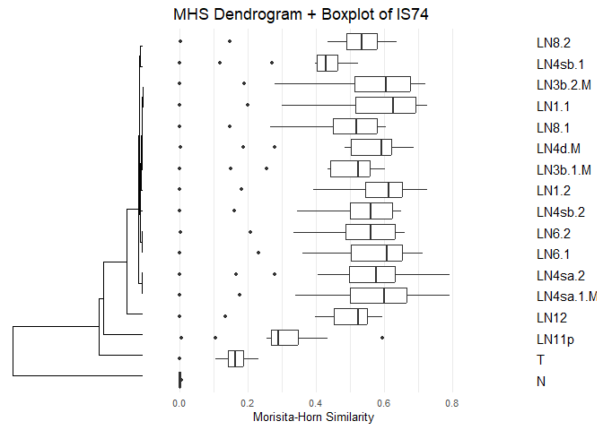<!-- --> \##
Calculate Boxplot’s statistics

``` r
# Calculate boxplot statistics by Group1
mhs_stats <- mhs_long |>
  group_by(Group1) |>
  summarize(
    Count = n(),
    Mean = mean(MHS),
    Median = median(MHS),
    Min = min(MHS),
    Q1 = quantile(MHS, 0.25),
    Q3 = quantile(MHS, 0.75),
    Max = max(MHS),
    IQR = Q3 - Q1,
    StdDev = sd(MHS)
  ) |>
  arrange(desc(Median))  # Sort by median MHS value

# Display the statistics
kable(mhs_stats, caption = "Morisita-Horn Similarity Statistics by Group", digits = 4)
```

| Group1    | Count |   Mean | Median |    Min |     Q1 |     Q3 |    Max |    IQR | StdDev |
|:----------|------:|-------:|-------:|-------:|-------:|-------:|-------:|-------:|-------:|
| LN1.1     |    16 | 0.5534 | 0.6261 | 0.0018 | 0.5160 | 0.6920 | 0.7268 | 0.1761 | 0.2098 |
| LN1.2     |    16 | 0.5491 | 0.6139 | 0.0018 | 0.5436 | 0.6530 | 0.7268 | 0.1094 | 0.1983 |
| LN6.1     |    16 | 0.5374 | 0.6089 | 0.0014 | 0.5022 | 0.6526 | 0.7134 | 0.1504 | 0.1945 |
| LN3b.2.M  |    16 | 0.5396 | 0.6041 | 0.0022 | 0.5129 | 0.6768 | 0.7214 | 0.1639 | 0.2070 |
| LN4sa.1.M |    16 | 0.5373 | 0.5990 | 0.0000 | 0.4992 | 0.6653 | 0.7924 | 0.1662 | 0.2085 |
| LN4d.M    |    16 | 0.5197 | 0.5931 | 0.0043 | 0.5018 | 0.6208 | 0.6854 | 0.1190 | 0.1945 |
| LN4sa.2   |    16 | 0.5141 | 0.5776 | 0.0000 | 0.4968 | 0.6308 | 0.7924 | 0.1339 | 0.2054 |
| LN6.2     |    16 | 0.5065 | 0.5606 | 0.0034 | 0.4863 | 0.6310 | 0.6609 | 0.1447 | 0.1838 |
| LN4sb.2   |    16 | 0.5029 | 0.5603 | 0.0000 | 0.5011 | 0.6226 | 0.6507 | 0.1214 | 0.1850 |
| LN8.2     |    16 | 0.4841 | 0.5348 | 0.0050 | 0.4899 | 0.5799 | 0.6372 | 0.0900 | 0.1698 |
| LN3b.1.M  |    16 | 0.4573 | 0.5250 | 0.0000 | 0.4421 | 0.5584 | 0.6029 | 0.1164 | 0.1733 |
| LN12      |    16 | 0.4627 | 0.5250 | 0.0000 | 0.4527 | 0.5514 | 0.5946 | 0.0987 | 0.1649 |
| LN8.1     |    16 | 0.4631 | 0.5192 | 0.0019 | 0.4493 | 0.5785 | 0.6065 | 0.1292 | 0.1756 |
| LN4sb.1   |    16 | 0.3901 | 0.4291 | 0.0000 | 0.4033 | 0.4636 | 0.5245 | 0.0602 | 0.1433 |
| LN11p     |    16 | 0.3027 | 0.2901 | 0.0073 | 0.2703 | 0.3482 | 0.5946 | 0.0779 | 0.1291 |
| T         |    16 | 0.1571 | 0.1634 | 0.0000 | 0.1441 | 0.1886 | 0.2316 | 0.0445 | 0.0536 |
| N         |    16 | 0.0018 | 0.0016 | 0.0000 | 0.0000 | 0.0025 | 0.0073 | 0.0025 | 0.0022 |

Morisita-Horn Similarity Statistics by Group

``` r
# Save to CSV file
write.csv(mhs_stats, file.path(output_dir, "IS74_mhs_statistics.csv"), row.names = FALSE)
```

# 2.2 Frequency, Shannon Entropy, Shannon Clonality by group

``` r
# Initialize a dataframe to store results
cdr3_idx_by_group <- data.frame(Group = character(), 
                Total_CDR3 = numeric(),
                Unique_CDR3 = numeric(),
                Entropy = numeric(), 
                Nor.d_Entropy = numeric(), 
                Clonality = numeric())

# For each unique group in the dataset
for (group_name in unique(df$group)) {
  # Filter data for current group
  group_data <- df |> filter(group == group_name)
  
  # Count occurrences of each cdr3 in this group
  cdr3_counts <- group_data |> 
  count(cdr3, name = "Count") |>
  arrange(desc(Count))
  
  # Add frequency column
  cdr3_counts <- cdr3_counts |>
  mutate(Frequency = Count / sum(Count))
  
  # Calculate the Shannon Entropy
  entropy <- -sum(cdr3_counts$Frequency * log(cdr3_counts$Frequency, base=2))
  
  # Calculate the normalized Shannon Entropy and Clonality
  richness <- nrow(cdr3_counts)  # Number of unique cdr3 values
  nor_entropy <- entropy / log(richness, base=2)
  clonality <- 1 - nor_entropy
  
  # Add results to the dataframe
  cdr3_idx_by_group <- rbind(cdr3_idx_by_group, 
               data.frame(Group = group_name,
                    Total_CDR3 = sum(cdr3_counts$Count),
                    Unique_CDR3 = richness,
                    Entropy = entropy,
                    Nor.d_Entropy = nor_entropy,
                    Clonality = clonality))
}

# Round the numeric values for better display
cdr3_idx_by_group <- cdr3_idx_by_group |>
  mutate(across(where(is.numeric), ~round(., 4)))

# Display the results with kable
knitr::kable(cdr3_idx_by_group, caption = "Shannon Entropy and Clonality by Group")
```

| Group     | Total_CDR3 | Unique_CDR3 | Entropy | Nor.d_Entropy | Clonality |
|:----------|-----------:|------------:|--------:|--------------:|----------:|
| LN1.1     |       1144 |         692 |  8.9132 |        0.9447 |    0.0553 |
| LN4d.M    |       1224 |         875 |  9.4013 |        0.9620 |    0.0380 |
| LN6.1     |        736 |         508 |  8.5507 |        0.9513 |    0.0487 |
| LN6.2     |        603 |         406 |  8.2891 |        0.9566 |    0.0434 |
| LN8.1     |       1120 |         660 |  9.0416 |        0.9653 |    0.0347 |
| LN8.2     |        853 |         589 |  8.9012 |        0.9673 |    0.0327 |
| LN11p     |        824 |         550 |  8.5599 |        0.9403 |    0.0597 |
| LN12      |        944 |         633 |  8.8584 |        0.9519 |    0.0481 |
| LN1.2     |       1146 |         768 |  9.1258 |        0.9521 |    0.0479 |
| LN3b.1.M  |        900 |         662 |  9.0865 |        0.9697 |    0.0303 |
| LN3b.2.M  |        956 |         668 |  8.9785 |        0.9568 |    0.0432 |
| LN4sa.1.M |       1127 |         644 |  8.6402 |        0.9260 |    0.0740 |
| LN4sa.2   |        951 |         618 |  8.8019 |        0.9494 |    0.0506 |
| LN4sb.1   |        934 |         633 |  9.0217 |        0.9694 |    0.0306 |
| LN4sb.2   |        696 |         521 |  8.7208 |        0.9663 |    0.0337 |
| N         |         22 |          16 |  3.8231 |        0.9558 |    0.0442 |
| T         |        712 |         309 |  7.6348 |        0.9230 |    0.0770 |

Shannon Entropy and Clonality by Group

``` r
# Save the results to a CSV file
write.csv(cdr3_idx_by_group, file.path(output_dir, "IS74_cdr3_idx_by_group.csv"), row.names = FALSE)
```

# 3. Frequency Analysis

## 3.1 Absolute frequency duplication of cdr3 by group

``` r
# Step 1: cdr3별 group에서의 등장 횟수 세기
cdr3_group_counts <- df |>
  group_by(cdr3, group) |>
  summarise(count = n(), .groups = "drop")

# Step 2: wide 포맷으로 변환 (cdr3 × group, 값은 count)
frequency_matrix <- cdr3_group_counts |>
  pivot_wider(
    id_cols = cdr3,
    names_from = group,
    values_from = count,
    values_fill = 0
  )

# Step 3: Convert to matrix for efficient operations
freq_mat <- as.matrix(frequency_matrix[, -1])
rownames(freq_mat) <- frequency_matrix$cdr3
group_names <- colnames(freq_mat)

# Step 4: 그룹 간 min(count) 누적해서 절대중복량 계산
n_group <- length(group_names)
duplication_matrix <- matrix(0, nrow = n_group, ncol = n_group)
rownames(duplication_matrix) <- group_names
colnames(duplication_matrix) <- group_names

for (i in 1:n_group) {
  for (j in i:n_group) {
    vec_i <- freq_mat[, i]
    vec_j <- freq_mat[, j]
    min_sum <- sum(pmin(vec_i, vec_j))  # cdr3별로 최소 등장 수
    duplication_matrix[i, j] <- min_sum
    duplication_matrix[j, i] <- min_sum  # 대칭 행렬
  }
}

# Step 5: T 기준 정렬
if ("T" %in% group_names) {
  t_overlap <- duplication_matrix["T", ]
  others <- setdiff(names(t_overlap), "T")
  sorted_others <- others[order(t_overlap[others], decreasing = TRUE)]
  new_order <- c("T", sorted_others)
  duplication_matrix <- duplication_matrix[new_order, new_order]
}

# Create a percentage matrix where each element is expressed as
# a percentage of the corresponding diagonal element
percentage_matrix <- duplication_matrix
for (i in 1:nrow(percentage_matrix)) {
  for (j in 1:ncol(percentage_matrix)) {
    if (i != j) {  # Non-diagonal elements
      # Calculate what percentage of group i's unique CDR3s are shared with group j
      percentage_matrix[i, j] <- (duplication_matrix[i, j] / duplication_matrix[i, i]) * 100
    } else {
      # Set diagonal elements to 100%
      percentage_matrix[i, j] <- 100
    }
  }
}

# Round to two decimal places for cleaner display
percentage_matrix <- round(percentage_matrix, 2)

# Step 6: 출력
knitr::kable(duplication_matrix, caption = "Absolute cdr3 overlap")
```

|  | T | LN4d.M | LN4sa.1.M | LN4sa.2 | LN3b.1.M | LN3b.2.M | LN6.2 | LN6.1 | LN12 | LN1.1 | LN1.2 | LN8.1 | LN11p | LN4sb.2 | LN8.2 | LN4sb.1 | N |
|:---|---:|---:|---:|---:|---:|---:|---:|---:|---:|---:|---:|---:|---:|---:|---:|---:|---:|
| T | 712 | 104 | 103 | 103 | 84 | 83 | 83 | 76 | 74 | 74 | 71 | 67 | 64 | 63 | 63 | 58 | 0 |
| LN4d.M | 104 | 1224 | 267 | 244 | 213 | 254 | 195 | 214 | 206 | 265 | 283 | 221 | 162 | 190 | 203 | 203 | 4 |
| LN4sa.1.M | 103 | 267 | 1127 | 309 | 213 | 255 | 209 | 218 | 225 | 294 | 272 | 220 | 183 | 175 | 184 | 179 | 0 |
| LN4sa.2 | 103 | 244 | 309 | 951 | 197 | 206 | 196 | 159 | 189 | 210 | 222 | 177 | 130 | 157 | 165 | 152 | 0 |
| LN3b.1.M | 84 | 213 | 213 | 197 | 900 | 206 | 150 | 162 | 168 | 214 | 211 | 159 | 143 | 158 | 166 | 180 | 0 |
| LN3b.2.M | 83 | 254 | 255 | 206 | 206 | 956 | 175 | 197 | 192 | 236 | 243 | 203 | 148 | 164 | 180 | 174 | 2 |
| LN6.2 | 83 | 195 | 209 | 196 | 150 | 175 | 603 | 142 | 154 | 170 | 170 | 141 | 134 | 125 | 145 | 122 | 2 |
| LN6.1 | 76 | 214 | 218 | 159 | 162 | 197 | 142 | 736 | 184 | 217 | 222 | 194 | 155 | 165 | 170 | 151 | 1 |
| LN12 | 74 | 206 | 225 | 189 | 168 | 192 | 154 | 184 | 944 | 196 | 218 | 184 | 221 | 162 | 186 | 146 | 0 |
| LN1.1 | 74 | 265 | 294 | 210 | 214 | 236 | 170 | 217 | 196 | 1144 | 294 | 222 | 161 | 197 | 191 | 195 | 2 |
| LN1.2 | 71 | 283 | 272 | 222 | 211 | 243 | 170 | 222 | 218 | 294 | 1146 | 229 | 180 | 207 | 230 | 232 | 2 |
| LN8.1 | 67 | 221 | 220 | 177 | 159 | 203 | 141 | 194 | 184 | 222 | 229 | 1120 | 139 | 159 | 169 | 150 | 2 |
| LN11p | 64 | 162 | 183 | 130 | 143 | 148 | 134 | 155 | 221 | 161 | 180 | 139 | 824 | 139 | 165 | 142 | 5 |
| LN4sb.2 | 63 | 190 | 175 | 157 | 158 | 164 | 125 | 165 | 162 | 197 | 207 | 159 | 139 | 696 | 154 | 170 | 0 |
| LN8.2 | 63 | 203 | 184 | 165 | 166 | 180 | 145 | 170 | 186 | 191 | 230 | 169 | 165 | 154 | 853 | 165 | 2 |
| LN4sb.1 | 58 | 203 | 179 | 152 | 180 | 174 | 122 | 151 | 146 | 195 | 232 | 150 | 142 | 170 | 165 | 934 | 0 |
| N | 0 | 4 | 0 | 0 | 0 | 2 | 2 | 1 | 0 | 2 | 2 | 2 | 5 | 0 | 2 | 0 | 22 |

Absolute cdr3 overlap

``` r
knitr::kable(percentage_matrix, caption = "Percentage of cdr3 overlap(Rowwise)")
```

|  | T | LN4d.M | LN4sa.1.M | LN4sa.2 | LN3b.1.M | LN3b.2.M | LN6.2 | LN6.1 | LN12 | LN1.1 | LN1.2 | LN8.1 | LN11p | LN4sb.2 | LN8.2 | LN4sb.1 | N |
|:---|---:|---:|---:|---:|---:|---:|---:|---:|---:|---:|---:|---:|---:|---:|---:|---:|---:|
| T | 100.00 | 14.61 | 14.47 | 14.47 | 11.80 | 11.66 | 11.66 | 10.67 | 10.39 | 10.39 | 9.97 | 9.41 | 8.99 | 8.85 | 8.85 | 8.15 | 0.00 |
| LN4d.M | 8.50 | 100.00 | 21.81 | 19.93 | 17.40 | 20.75 | 15.93 | 17.48 | 16.83 | 21.65 | 23.12 | 18.06 | 13.24 | 15.52 | 16.58 | 16.58 | 0.33 |
| LN4sa.1.M | 9.14 | 23.69 | 100.00 | 27.42 | 18.90 | 22.63 | 18.54 | 19.34 | 19.96 | 26.09 | 24.13 | 19.52 | 16.24 | 15.53 | 16.33 | 15.88 | 0.00 |
| LN4sa.2 | 10.83 | 25.66 | 32.49 | 100.00 | 20.72 | 21.66 | 20.61 | 16.72 | 19.87 | 22.08 | 23.34 | 18.61 | 13.67 | 16.51 | 17.35 | 15.98 | 0.00 |
| LN3b.1.M | 9.33 | 23.67 | 23.67 | 21.89 | 100.00 | 22.89 | 16.67 | 18.00 | 18.67 | 23.78 | 23.44 | 17.67 | 15.89 | 17.56 | 18.44 | 20.00 | 0.00 |
| LN3b.2.M | 8.68 | 26.57 | 26.67 | 21.55 | 21.55 | 100.00 | 18.31 | 20.61 | 20.08 | 24.69 | 25.42 | 21.23 | 15.48 | 17.15 | 18.83 | 18.20 | 0.21 |
| LN6.2 | 13.76 | 32.34 | 34.66 | 32.50 | 24.88 | 29.02 | 100.00 | 23.55 | 25.54 | 28.19 | 28.19 | 23.38 | 22.22 | 20.73 | 24.05 | 20.23 | 0.33 |
| LN6.1 | 10.33 | 29.08 | 29.62 | 21.60 | 22.01 | 26.77 | 19.29 | 100.00 | 25.00 | 29.48 | 30.16 | 26.36 | 21.06 | 22.42 | 23.10 | 20.52 | 0.14 |
| LN12 | 7.84 | 21.82 | 23.83 | 20.02 | 17.80 | 20.34 | 16.31 | 19.49 | 100.00 | 20.76 | 23.09 | 19.49 | 23.41 | 17.16 | 19.70 | 15.47 | 0.00 |
| LN1.1 | 6.47 | 23.16 | 25.70 | 18.36 | 18.71 | 20.63 | 14.86 | 18.97 | 17.13 | 100.00 | 25.70 | 19.41 | 14.07 | 17.22 | 16.70 | 17.05 | 0.17 |
| LN1.2 | 6.20 | 24.69 | 23.73 | 19.37 | 18.41 | 21.20 | 14.83 | 19.37 | 19.02 | 25.65 | 100.00 | 19.98 | 15.71 | 18.06 | 20.07 | 20.24 | 0.17 |
| LN8.1 | 5.98 | 19.73 | 19.64 | 15.80 | 14.20 | 18.12 | 12.59 | 17.32 | 16.43 | 19.82 | 20.45 | 100.00 | 12.41 | 14.20 | 15.09 | 13.39 | 0.18 |
| LN11p | 7.77 | 19.66 | 22.21 | 15.78 | 17.35 | 17.96 | 16.26 | 18.81 | 26.82 | 19.54 | 21.84 | 16.87 | 100.00 | 16.87 | 20.02 | 17.23 | 0.61 |
| LN4sb.2 | 9.05 | 27.30 | 25.14 | 22.56 | 22.70 | 23.56 | 17.96 | 23.71 | 23.28 | 28.30 | 29.74 | 22.84 | 19.97 | 100.00 | 22.13 | 24.43 | 0.00 |
| LN8.2 | 7.39 | 23.80 | 21.57 | 19.34 | 19.46 | 21.10 | 17.00 | 19.93 | 21.81 | 22.39 | 26.96 | 19.81 | 19.34 | 18.05 | 100.00 | 19.34 | 0.23 |
| LN4sb.1 | 6.21 | 21.73 | 19.16 | 16.27 | 19.27 | 18.63 | 13.06 | 16.17 | 15.63 | 20.88 | 24.84 | 16.06 | 15.20 | 18.20 | 17.67 | 100.00 | 0.00 |
| N | 0.00 | 18.18 | 0.00 | 0.00 | 0.00 | 9.09 | 9.09 | 4.55 | 0.00 | 9.09 | 9.09 | 9.09 | 22.73 | 0.00 | 9.09 | 0.00 | 100.00 |

Percentage of cdr3 overlap(Rowwise)

``` r
# Step 7: Save the duplication matrix to a CSV file
write.csv(duplication_matrix, file.path(output_dir, "IS74_freq_cdr3_duplication_matrix.csv"), row.names = TRUE)
write.csv(percentage_matrix, file.path(output_dir, "IS74_freq_cdr3_duplication_matrix_rowwise_percent.csv"), row.names = TRUE)
```

## 3.2 cdr3 plot by frequency

``` r
# 1. Create link for cdr3 similarity
cdr3_groups <- df |>
  filter(!is.na(cdr3) & cdr3 != "") |>
  group_by(cdr3) |>
  summarise(group = list(group), .groups = 'drop') |>
  filter(lengths(group) > 1) # cdr3가 2개 이상 group에 속하는 경우만 플롯에 표시

make_pairs <- function(group) {
  if (length(group) < 2) return(NULL)
  combn(group, 2, simplify = FALSE)
}

link_list <- unlist(lapply(cdr3_groups$group, make_pairs), recursive = FALSE)

if (length(link_list) > 0) {
  link_df <- do.call(rbind, lapply(link_list, function(x) data.frame(from = x[1], to = x[2])))
} else {
  stop("No pairs found in the data.")
}

# For big-data handling
# 1. from-to 별 연결 개수 세기
link_df_count <- link_df |>
  filter(from != to) |>   # 자기 자신으로 돌아오는 Self loop 제거
  group_by(from, to) |>
  summarise(weight = n(), .groups = 'drop')


# 2. from-to를 wide format으로 변환
link_matrix_df <- link_df_count |>
  pivot_wider(names_from = to, values_from = weight, values_fill = 0)

# 3. rownames 수동 지정
link_matrix <- as.data.frame(link_matrix_df)
rownames(link_matrix) <- link_matrix$from
link_matrix$from <- NULL

# 4. matrix 변환
link_matrix <- as.matrix(link_matrix)

# grid.col 설정 (섹터 색깔)
all_group <- union(rownames(link_matrix), colnames(link_matrix))

grid_colors <- setNames(rep("gray", length(all_group)), all_group)
if ("T" %in% all_group) {
  grid_colors["T"] <- "red"
}

# T를 중심으로 시계방향 정렬
T_links <- link_df |>
  filter(from == "T" | to == "T") |>
  mutate(other = ifelse(from == "T", to, from))

T_link_counts <- T_links |>
  group_by(other) |>
  summarise(n_shared = n(), .groups = 'drop') |>
  arrange(desc(n_shared))

# duplication_matrix의 순서가 이미 정렬되어 있다고 가정
sector_order <- colnames(duplication_matrix)  # 또는 rownames


# gap 자동 계산
n_sectors <- length(all_group)
gap_per_sector <- 360 / (n_sectors * 10)

# Draw Circos Plot
circos.clear()
circos.par(start.degree = 90, gap.degree = gap_per_sector)

chordDiagram(
  link_matrix,
  grid.col = grid_colors,
  order = sector_order,
  transparency = 0.5,
  directional = 1,
  annotationTrack = "grid",
  preAllocateTracks = list(track.height = 0.1),
  link.sort = TRUE,
  link.decreasing = TRUE
)

circos.trackPlotRegion(track.index = 1, panel.fun = function(x, y) {
  sector.name <- get.cell.meta.data("sector.index")
  xlim <- get.cell.meta.data("xlim")
  ylim <- get.cell.meta.data("ylim")
  
  circos.text(
    x = mean(xlim), y = ylim[1] + .1,
    labels = sector.name,
    facing = "clockwise",
    niceFacing = TRUE,
    adj = c(0, 0.5),
    cex = .8
  )
}, bg.border = NA)

title("IS74 - Circos Plot based on CDR3 Similarity(Freq)")
```

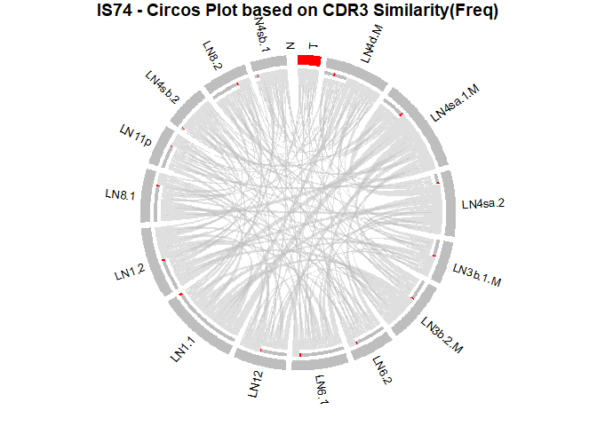<!-- -->

# 4. Unique Analysis

## 4.1 unique cdr3 duplication by group overview

``` r
# Create a table of cdr3 duplication by group
library(dplyr)
library(tidyr)

# Step 1: Create a dataset with unique cdr3-group combinations
cdr3_group_unique <- df |>
  select(cdr3, group) |>
  distinct()

# Step 2: Create a presence matrix (1 if cdr3 exists in group, 0 otherwise)
presence_matrix <- cdr3_group_unique |>
  mutate(present = 1) |>
  pivot_wider(
    id_cols = cdr3,
    names_from = group,
    values_from = present,
    values_fill = 0
  )

# Step 3: Convert to matrix for efficient operations
presence_matrix_only <- as.matrix(presence_matrix[, -1])  # Remove cdr3 column
rownames(presence_matrix_only) <- presence_matrix$cdr3

# Step 4: Calculate the duplication matrix
# For each group pair, we count how many cdr3s have both groups present
duplication_matrix <- t(presence_matrix_only) %*% presence_matrix_only


# Step 5: If 'T' exists, reorder the matrix
if("T" %in% colnames(duplication_matrix)) {
  # Get duplication counts with 'T'
  t_duplications <- duplication_matrix["T", ]
  
  # Sort other groups by their duplication count with 'T'
  other_groups <- colnames(duplication_matrix)[colnames(duplication_matrix) != "T"]
  other_groups_sorted <- other_groups[order(t_duplications[other_groups], decreasing = TRUE)]
  
  # New order: 'T' first, then others sorted
  new_order <- c("T", other_groups_sorted)
  
  # Reorder the matrix
  duplication_matrix <- duplication_matrix[new_order, new_order]
}


# Create a percentage matrix where each element is expressed as 
# a percentage of the corresponding diagonal element
percentage_matrix <- duplication_matrix
for (i in 1:nrow(percentage_matrix)) {
  for (j in 1:ncol(percentage_matrix)) {
    if (i != j) {  # Non-diagonal elements
      # Calculate what percentage of group i's unique CDR3s are shared with group j
      percentage_matrix[i, j] <- (duplication_matrix[i, j] / duplication_matrix[i, i]) * 100
    } else {
      # Set diagonal elements to 100%
      percentage_matrix[i, j] <- 100
    }
  }
}

# Round to two decimal places for cleaner display
percentage_matrix <- round(percentage_matrix, 2)

# Step 6: Display the table with kable
knitr::kable(duplication_matrix, caption = "Number of shared cdr3 sequences between groups")
```

|  | T | LN4sa.2 | LN4d.M | LN4sa.1.M | LN3b.2.M | LN3b.1.M | LN6.2 | LN12 | LN1.2 | LN1.1 | LN6.1 | LN11p | LN8.1 | LN4sb.2 | LN8.2 | LN4sb.1 | N |
|:---|---:|---:|---:|---:|---:|---:|---:|---:|---:|---:|---:|---:|---:|---:|---:|---:|---:|
| T | 309 | 71 | 70 | 62 | 55 | 54 | 50 | 48 | 43 | 42 | 40 | 40 | 36 | 36 | 33 | 31 | 0 |
| LN4sa.2 | 71 | 618 | 142 | 143 | 110 | 113 | 109 | 100 | 114 | 92 | 76 | 72 | 79 | 83 | 82 | 88 | 0 |
| LN4d.M | 70 | 142 | 875 | 138 | 143 | 130 | 114 | 127 | 152 | 132 | 111 | 107 | 114 | 114 | 120 | 122 | 4 |
| LN4sa.1.M | 62 | 143 | 138 | 644 | 118 | 117 | 114 | 107 | 119 | 114 | 102 | 99 | 88 | 86 | 92 | 92 | 0 |
| LN3b.2.M | 55 | 110 | 143 | 118 | 668 | 123 | 96 | 102 | 115 | 106 | 99 | 93 | 103 | 89 | 106 | 102 | 2 |
| LN3b.1.M | 54 | 113 | 130 | 117 | 123 | 662 | 74 | 100 | 124 | 120 | 90 | 87 | 81 | 94 | 95 | 113 | 0 |
| LN6.2 | 50 | 109 | 114 | 114 | 96 | 74 | 406 | 81 | 89 | 82 | 70 | 74 | 67 | 65 | 74 | 67 | 2 |
| LN12 | 48 | 100 | 127 | 107 | 102 | 100 | 81 | 633 | 111 | 103 | 99 | 108 | 95 | 88 | 100 | 82 | 0 |
| LN1.2 | 43 | 114 | 152 | 119 | 115 | 124 | 89 | 111 | 768 | 135 | 110 | 103 | 113 | 120 | 133 | 138 | 2 |
| LN1.1 | 42 | 92 | 132 | 114 | 106 | 120 | 82 | 103 | 135 | 692 | 103 | 96 | 104 | 109 | 102 | 107 | 2 |
| LN6.1 | 40 | 76 | 111 | 102 | 99 | 90 | 70 | 99 | 110 | 103 | 508 | 94 | 94 | 90 | 94 | 89 | 1 |
| LN11p | 40 | 72 | 107 | 99 | 93 | 87 | 74 | 108 | 103 | 96 | 94 | 550 | 78 | 84 | 99 | 87 | 5 |
| LN8.1 | 36 | 79 | 114 | 88 | 103 | 81 | 67 | 95 | 113 | 104 | 94 | 78 | 660 | 87 | 84 | 76 | 2 |
| LN4sb.2 | 36 | 83 | 114 | 86 | 89 | 94 | 65 | 88 | 120 | 109 | 90 | 84 | 87 | 521 | 91 | 107 | 0 |
| LN8.2 | 33 | 82 | 120 | 92 | 106 | 95 | 74 | 100 | 133 | 102 | 94 | 99 | 84 | 91 | 589 | 100 | 2 |
| LN4sb.1 | 31 | 88 | 122 | 92 | 102 | 113 | 67 | 82 | 138 | 107 | 89 | 87 | 76 | 107 | 100 | 633 | 0 |
| N | 0 | 0 | 4 | 0 | 2 | 0 | 2 | 0 | 2 | 2 | 1 | 5 | 2 | 0 | 2 | 0 | 16 |

Number of shared cdr3 sequences between groups

``` r
knitr::kable(percentage_matrix, caption = "Percentage of shared cdr3 sequences between groups(Rowwise)")
```

|  | T | LN4sa.2 | LN4d.M | LN4sa.1.M | LN3b.2.M | LN3b.1.M | LN6.2 | LN12 | LN1.2 | LN1.1 | LN6.1 | LN11p | LN8.1 | LN4sb.2 | LN8.2 | LN4sb.1 | N |
|:---|---:|---:|---:|---:|---:|---:|---:|---:|---:|---:|---:|---:|---:|---:|---:|---:|---:|
| T | 100.00 | 22.98 | 22.65 | 20.06 | 17.80 | 17.48 | 16.18 | 15.53 | 13.92 | 13.59 | 12.94 | 12.94 | 11.65 | 11.65 | 10.68 | 10.03 | 0.00 |
| LN4sa.2 | 11.49 | 100.00 | 22.98 | 23.14 | 17.80 | 18.28 | 17.64 | 16.18 | 18.45 | 14.89 | 12.30 | 11.65 | 12.78 | 13.43 | 13.27 | 14.24 | 0.00 |
| LN4d.M | 8.00 | 16.23 | 100.00 | 15.77 | 16.34 | 14.86 | 13.03 | 14.51 | 17.37 | 15.09 | 12.69 | 12.23 | 13.03 | 13.03 | 13.71 | 13.94 | 0.46 |
| LN4sa.1.M | 9.63 | 22.20 | 21.43 | 100.00 | 18.32 | 18.17 | 17.70 | 16.61 | 18.48 | 17.70 | 15.84 | 15.37 | 13.66 | 13.35 | 14.29 | 14.29 | 0.00 |
| LN3b.2.M | 8.23 | 16.47 | 21.41 | 17.66 | 100.00 | 18.41 | 14.37 | 15.27 | 17.22 | 15.87 | 14.82 | 13.92 | 15.42 | 13.32 | 15.87 | 15.27 | 0.30 |
| LN3b.1.M | 8.16 | 17.07 | 19.64 | 17.67 | 18.58 | 100.00 | 11.18 | 15.11 | 18.73 | 18.13 | 13.60 | 13.14 | 12.24 | 14.20 | 14.35 | 17.07 | 0.00 |
| LN6.2 | 12.32 | 26.85 | 28.08 | 28.08 | 23.65 | 18.23 | 100.00 | 19.95 | 21.92 | 20.20 | 17.24 | 18.23 | 16.50 | 16.01 | 18.23 | 16.50 | 0.49 |
| LN12 | 7.58 | 15.80 | 20.06 | 16.90 | 16.11 | 15.80 | 12.80 | 100.00 | 17.54 | 16.27 | 15.64 | 17.06 | 15.01 | 13.90 | 15.80 | 12.95 | 0.00 |
| LN1.2 | 5.60 | 14.84 | 19.79 | 15.49 | 14.97 | 16.15 | 11.59 | 14.45 | 100.00 | 17.58 | 14.32 | 13.41 | 14.71 | 15.62 | 17.32 | 17.97 | 0.26 |
| LN1.1 | 6.07 | 13.29 | 19.08 | 16.47 | 15.32 | 17.34 | 11.85 | 14.88 | 19.51 | 100.00 | 14.88 | 13.87 | 15.03 | 15.75 | 14.74 | 15.46 | 0.29 |
| LN6.1 | 7.87 | 14.96 | 21.85 | 20.08 | 19.49 | 17.72 | 13.78 | 19.49 | 21.65 | 20.28 | 100.00 | 18.50 | 18.50 | 17.72 | 18.50 | 17.52 | 0.20 |
| LN11p | 7.27 | 13.09 | 19.45 | 18.00 | 16.91 | 15.82 | 13.45 | 19.64 | 18.73 | 17.45 | 17.09 | 100.00 | 14.18 | 15.27 | 18.00 | 15.82 | 0.91 |
| LN8.1 | 5.45 | 11.97 | 17.27 | 13.33 | 15.61 | 12.27 | 10.15 | 14.39 | 17.12 | 15.76 | 14.24 | 11.82 | 100.00 | 13.18 | 12.73 | 11.52 | 0.30 |
| LN4sb.2 | 6.91 | 15.93 | 21.88 | 16.51 | 17.08 | 18.04 | 12.48 | 16.89 | 23.03 | 20.92 | 17.27 | 16.12 | 16.70 | 100.00 | 17.47 | 20.54 | 0.00 |
| LN8.2 | 5.60 | 13.92 | 20.37 | 15.62 | 18.00 | 16.13 | 12.56 | 16.98 | 22.58 | 17.32 | 15.96 | 16.81 | 14.26 | 15.45 | 100.00 | 16.98 | 0.34 |
| LN4sb.1 | 4.90 | 13.90 | 19.27 | 14.53 | 16.11 | 17.85 | 10.58 | 12.95 | 21.80 | 16.90 | 14.06 | 13.74 | 12.01 | 16.90 | 15.80 | 100.00 | 0.00 |
| N | 0.00 | 0.00 | 25.00 | 0.00 | 12.50 | 0.00 | 12.50 | 0.00 | 12.50 | 12.50 | 6.25 | 31.25 | 12.50 | 0.00 | 12.50 | 0.00 | 100.00 |

Percentage of shared cdr3 sequences between groups(Rowwise)

``` r
# Step 7: Save the duplication matrix to a CSV file
write.csv(duplication_matrix, file.path(output_dir, "IS74_unique_cdr3_duplication_matrix.csv"), row.names = TRUE)
write.csv(percentage_matrix, file.path(output_dir, "IS74_unique_cdr3_duplication_matrix_rowwise_percent.csv"), row.names = TRUE)
```

## 4.2 Unique cdr3 by group

``` r
# Identify CDR3 sequences that are unique to the T group
# First, get all unique CDR3 sequences in the T group
t_cdr3s <- df |>
  filter(group == "T") |>
  distinct(cdr3) |>
  pull(cdr3)

# Next, get all CDR3 sequences from other groups
other_cdr3s <- df |>
  filter(group != "T") |>
  distinct(cdr3) |>
  pull(cdr3)

# Find CDR3 sequences in T but not in other groups
t_unique_cdr3s <- setdiff(t_cdr3s, other_cdr3s)

# Count of unique CDR3s in T
total_t_unique_cdr3s <- length(t_cdr3s)

# Count of CDR3s unique to T group
count_t_only_cdr3s <- length(t_unique_cdr3s)

# Calculate percentage
percentage_t_only <- (count_t_only_cdr3s / total_t_unique_cdr3s) * 100

# Display results
cat("Number of unique CDR3 sequences in T group:", total_t_unique_cdr3s, "\n")
```

    ## Number of unique CDR3 sequences in T group: 309

``` r
cat("Number of CDR3 sequences unique to T group (not in other groups):", count_t_only_cdr3s, "\n")
```

    ## Number of CDR3 sequences unique to T group (not in other groups): 92

``` r
cat("Percentage of T's CDR3 sequences that are unique to T:", round(percentage_t_only, 2), "%\n")
```

    ## Percentage of T's CDR3 sequences that are unique to T: 29.77 %

``` r
# Create a summary table for all groups
group_unique_summary <- data.frame()

for (g in colnames(duplication_matrix)) {
  # Get CDR3s unique to this group
  group_cdr3s <- df |>
    filter(group == g) |>
    distinct(cdr3) |>
    pull(cdr3)
  
  other_cdr3s <- df |>
    filter(group != g) |>
    distinct(cdr3) |>
    pull(cdr3)
  
  unique_to_group <- setdiff(group_cdr3s, other_cdr3s)
  
  # Add to summary table
  group_unique_summary <- rbind(group_unique_summary, data.frame(
    Group = g,
    Total_CDR3s = length(group_cdr3s),
    Unique_to_Group_CDR3s = length(unique_to_group),
    Percentage = round((length(unique_to_group) / length(group_cdr3s)) * 100, 2)
  ))
}

# Display and save summary table
knitr::kable(group_unique_summary, caption = "Summary of CDR3 sequences unique to each group")
```

| Group     | Total_CDR3s | Unique_to_Group_CDR3s | Percentage |
|:----------|------------:|----------------------:|-----------:|
| T         |         309 |                    92 |      29.77 |
| LN4sa.2   |         618 |                    57 |       9.22 |
| LN4d.M    |         875 |                    93 |      10.63 |
| LN4sa.1.M |         644 |                    60 |       9.32 |
| LN3b.2.M  |         668 |                    83 |      12.43 |
| LN3b.1.M  |         662 |                    60 |       9.06 |
| LN6.2     |         406 |                    38 |       9.36 |
| LN12      |         633 |                    81 |      12.80 |
| LN1.2     |         768 |                    78 |      10.16 |
| LN1.1     |         692 |                   126 |      18.21 |
| LN6.1     |         508 |                    46 |       9.06 |
| LN11p     |         550 |                    55 |      10.00 |
| LN8.1     |         660 |                   210 |      31.82 |
| LN4sb.2   |         521 |                    41 |       7.87 |
| LN8.2     |         589 |                    88 |      14.94 |
| LN4sb.1   |         633 |                    90 |      14.22 |
| N         |          16 |                     3 |      18.75 |

Summary of CDR3 sequences unique to each group

``` r
write.csv(group_unique_summary, file.path(output_dir, "IS74_unique_cdr3_by_group_summary.csv"), row.names = FALSE)
```

## 4.3 cdr3 plot by uniqueness

``` r
cdr3_groups <- df |>
  filter(!is.na(cdr3) & cdr3 != "") |>
  group_by(cdr3) |>
  summarise(group = list(unique(group)), .groups = 'drop') |>
  filter(lengths(group) > 1) # cdr3가 2개 이상 group에 속하는 경우만 플롯에 표시

# cdr3마다 연결될 group 페어를 만든다
make_pairs <- function(group) {
  if (length(group) < 2) return(NULL)
  combn(sort(group), 2, simplify = FALSE)
}

# 모든 cdr3에 대해 pair 리스트
link_list <- unlist(lapply(cdr3_groups$group, make_pairs), recursive = FALSE)

# "from - to" 조합을 하나의 데이터프레임으로
if (length(link_list) > 0) {
  link_df <- do.call(rbind, lapply(link_list, function(x) data.frame(from = x[1], to = x[2])))
} else {
  stop("No pairs found in the data.")
}

# 링크 개수 연결 시각화에 반영
link_df_count <- link_df |>
  filter(from != to) |>
  group_by(from, to) |>
  summarise(weight = n(), .groups = "drop")

link_df_unique <- link_df |>
  distinct(from, to)

all_group <- unique(c(link_df_unique$from, link_df_unique$to))

grid_colors <- setNames(rep("gray", length(all_group)), all_group)
if ("T" %in% all_group) {
  grid_colors["T"] <- "orange"
}

# 링크 색상도
link_df_unique$col <- ifelse(link_df_unique$from == "T" | link_df_unique$to == "T", "orange", "gray80")

n_sectors <- length(all_group)
gap_per_sector <- 360 / (n_sectors * 10)

# T와 함께 나온 group들 세기
T_link_counts <- link_df |>
  filter(from == "T" | to == "T") |>
  mutate(other = ifelse(from == "T", to, from)) |>
  count(other, name = "n_shared") |>
  arrange(desc(n_shared))

# 최종 정렬 순서
sector_order <- c("T", T_link_counts$other)
remaining <- setdiff(sort(all_group), sector_order)
sector_order <- c(sector_order, remaining)

circos.clear()
circos.par(start.degree = 90, gap.degree = gap_per_sector)

chordDiagram(
  link_df_count,
  order = sector_order,
  grid.col = grid_colors,
  col = ifelse(link_df_count$from == "T" | link_df_count$to == "T", "orange", "gray80"),
  directional = 1,
  annotationTrack = "grid",
  preAllocateTracks = list(track.height = 0.1),
  transparency = 0.5,
  link.sort = TRUE,
  link.decreasing = TRUE
)

circos.trackPlotRegion(track.index = 1, panel.fun = function(x, y) {
  sector.name <- get.cell.meta.data("sector.index")
  xlim <- get.cell.meta.data("xlim")
  ylim <- get.cell.meta.data("ylim")
  
  circos.text(
    x = mean(xlim), y = ylim[1] + .1,
    labels = sector.name,
    facing = "clockwise",
    niceFacing = TRUE,
    adj = c(0, 0.5),
    cex = .8
  )
}, bg.border = NA)

title("IS74 - Circos Plot based on CDR3 Similarity(Unique)")
```

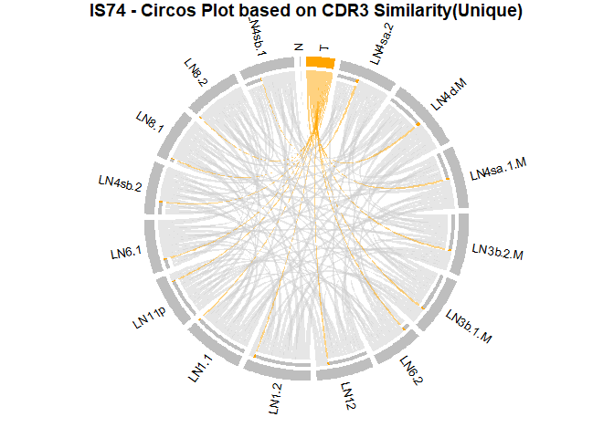<!-- -->

## 4.4 Unique cdr3 duplication rate v.s. MHS

``` r
# percentage_matrix : 공유도 행렬 (비대칭)
# mhs_matrix : MHS 행렬 (대칭)
# 두 행렬 모두 rownames와 colnames가 동일한 순서의 group명을 가지고 있어야 함

# PDF 저장 시작
# pdf(file.path(output_dir, "IS74_SharedRatio_MHS_with_Div_Clo_Plots.pdf"), width = 10, height = 6)

# 각 그룹마다 반복
for (i in seq_len(nrow(percentage_matrix))) {
  # 상단 마진 확보 (맨 위에 범례 넣기 위해)
  par(mar = c(8, 4, 4, 4), oma = c(0, 0, 3, 0), xpd = NA)  # 아래쪽 margin 더 확보
  group_name <- rownames(percentage_matrix)[i]

  # 자기 자신 제외한 공유도 벡터
  shared_vals <- percentage_matrix[i, ]
  if (group_name %in% names(shared_vals)) {
    shared_vals <- shared_vals[names(shared_vals) != group_name]
  }
  shared_groups <- names(shared_vals)

  # MHS 값 추출 및 정렬되지 않은 원본 형태 유지
  mhs_vals <- mhs_matrix[group_name, ]
  if (group_name %in% names(mhs_vals)) {
    mhs_vals <- mhs_vals[names(mhs_vals) != group_name]
  }
  mhs_named <- setNames(as.numeric(mhs_vals), names(mhs_vals))

  # 공유도 기준으로 정렬
  shared_numeric <- as.numeric(shared_vals)
  names(shared_numeric) <- shared_groups
  order_idx <- order(shared_numeric, decreasing = TRUE)
  sorted_labels <- shared_groups[order_idx]
  shared_sorted <- shared_numeric[order_idx]

  # 해당 순서에 맞춰 MHS 재배치
  mhs_reordered <- mhs_named[sorted_labels]

  # Calculate Shannon Entropy and Shannon Clonality for each group 
  # in sorted_labels
  norm_entropy_values <- numeric(length(sorted_labels))
  clonality_values <- numeric(length(sorted_labels))
  
  # Bray-Curtis Similarity
  bc_vals <- numeric(length(sorted_labels))
  group_cdr3 <- df |> 
    filter(group == group_name) |> 
    count(cdr3, name = "Count") |> 
    column_to_rownames("cdr3")
  
  for (j in seq_along(sorted_labels)) {
    group_to_analyze <- sorted_labels[j]
    
    # Extract cdr3 sequences for this group
    group_data <- df |> filter(group == group_to_analyze)
    
    # Count occurrences of each cdr3
    cdr3_counts <- group_data |>
      count(cdr3, name = "Count") |>
      mutate(Frequency = Count / sum(Count))
    
    # Calculate Shannon Entropy
    entropy <- -sum(cdr3_counts$Frequency * log(cdr3_counts$Frequency, base = 2))
    
    # Calculate normalized entropy and clonality
    richness <- nrow(cdr3_counts)  # Number of unique cdr3 sequences
    if (richness > 1) {
      norm_entropy <- entropy / log(richness, base = 2)
      clonality <- 1 - norm_entropy
    } else {
      norm_entropy <- 0
      clonality <- 1
    }
    
    norm_entropy_values[j] <- norm_entropy
    clonality_values[j] <- clonality
    
    # For Bray-Curtis Similarity
    comp_group <- sorted_labels[j]
    comp_cdr3 <- df |> filter(group == comp_group) |> count(cdr3, name = "Count") |> 
      column_to_rownames("cdr3")

    # 공통 cdr3를 기준으로 0 채워서 병합
    all_cdr3 <- union(rownames(group_cdr3), rownames(comp_cdr3))
    g1 <- group_cdr3[all_cdr3, , drop = FALSE]; g1[is.na(g1)] <- 0
    g2 <- comp_cdr3[all_cdr3, , drop = FALSE]; g2[is.na(g2)] <- 0

    # Bray-Curtis Similarity 계산
    bc_sim <- (2 * sum(pmin(g1$Count, g2$Count))) / (sum(g1$Count) + sum(g2$Count))
    bc_vals[j] <- bc_sim    
  }

  # 정규화 (Min-max normalization)
  shared_final <- (shared_sorted - min(shared_sorted)) / 
                   (max(shared_sorted) - min(shared_sorted))
  mhs_final <- (mhs_reordered - min(mhs_reordered)) / 
                (max(mhs_reordered) - min(mhs_reordered))
  
  entropy_final <- norm_entropy_values
  clonality_final <- clonality_values
  bc_final <- bc_vals

  # 플롯 본문
  plot(seq_along(shared_final), shared_final, 
       type = "o", pch = 16, col = "blue",
       xaxt = "n", xlab = "", ylab = "Normalized Values",
       main = "", ylim = c(0, 1))  # 제목은 따로

  # 제목 - 가장 위에 위치
  title(main = paste0("Group: ", group_name, 
                      " – Shared Ratio vs MHS vs Diversity"),
        line = 3, cex.main = 1.4)

  # Add lines and points - red dots and lines for MHS
  lines(seq_along(mhs_final), mhs_final, col = "red", lwd = 2)
  points(seq_along(mhs_final), mhs_final, col = "red", pch = 16, cex = 1.2)
  
  # Green dots and lines for entropy
  lines(seq_along(entropy_final), entropy_final, col = "darkgreen")
  points(seq_along(entropy_final), entropy_final, col = "darkgreen", pch = 16)
  
  # Purple dots and lines for clonality
  lines(seq_along(clonality_final), clonality_final, col = "purple")
  points(seq_along(clonality_final), clonality_final, col = "purple", pch = 16)
  
  # darkorange3 dots and lines for Bray-Curtis Similarity
  lines(seq_along(bc_final), bc_final, col = "darkorange3", lwd = 2)
  points(seq_along(bc_final), bc_final, col = "darkorange3", pch = 16, cex = 1.2)  

  # 텍스트 레이블 (소수 둘째자리로)
  for (j in seq_along(shared_final)) {
    # Blue text for shared_final
    text(j, shared_final[j] + 0.02, 
         sprintf("%.2f", shared_final[j]), 
         col = "blue", cex = 0.6)
    
    # Red text for mhs_final with slight offset
    text(j, mhs_final[j] + 0.04, 
         sprintf("%.2f", mhs_final[j]), 
         col = "red", cex = 0.6)
    
    # Green text for entropy
    text(j, entropy_final[j] + 0.02,
         sprintf("%.2f", entropy_final[j]), 
         col = "darkgreen", cex = 0.6)
    
    # Purple text for clonality
    text(j, clonality_final[j] - 0.05,
         sprintf("%.2f", clonality_final[j]), 
         col = "purple", cex = 0.6)
    
    # darkorange3 text for bc_final
    text(j, bc_final[j] + 0.06, 
         sprintf("%.2f", bc_final[j]), 
         col = "darkorange3", cex = 0.6)

  }
  
  # x축에 그룹 이름 추가
  axis(1, at = seq_along(sorted_labels), labels = FALSE)
  # 그룹 이름을 회전해서 추가
  text(x = seq_along(sorted_labels),
       y = par("usr")[3] - 0.05,
       labels = sorted_labels,
       srt = 45,
       adj = c(1, 1),
       xpd = TRUE,
       cex = 0.8)
  
  # x축 라벨 추가
  mtext("Groups (sorted by Shared Ratio)", side = 1, line = 6)

  # 범례 - 플롯 상단 내부, 제목 아래
  usr <- par("usr")
  legend(x = mean(usr[1:2]), y = usr[4] + 0.1,
         legend = c("Shared Ratio", "MHS", "Diversity", "Clonality", "Bray-Curtis Sim."),
         col = c("blue", "red", "darkgreen", "purple", "darkorange3"),
         pch = 16, lty = c(1, 1, 1, 1, 1), horiz = TRUE, bty = "n", cex = 0.8, xjust = 0.5)
}
```

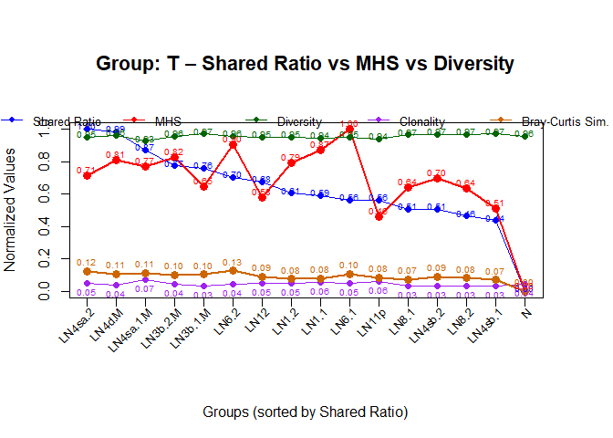<!-- -->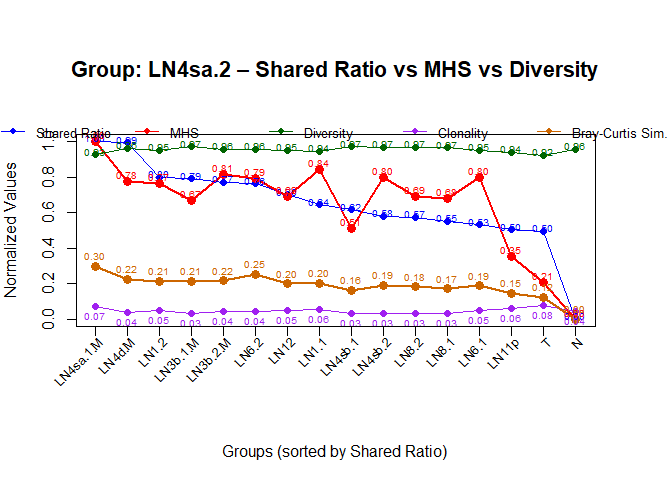<!-- -->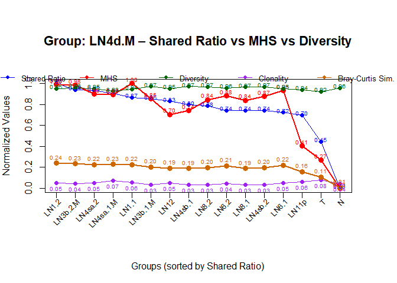<!-- -->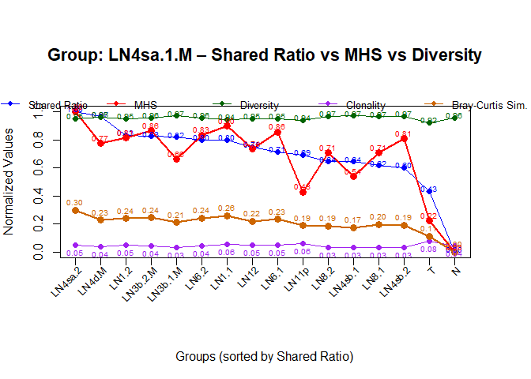<!-- -->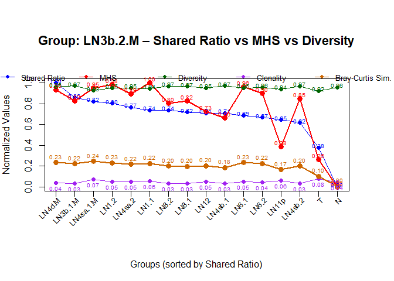<!-- -->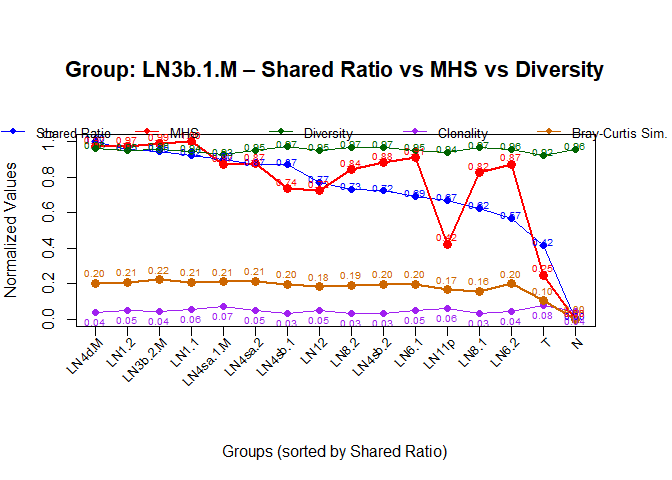<!-- -->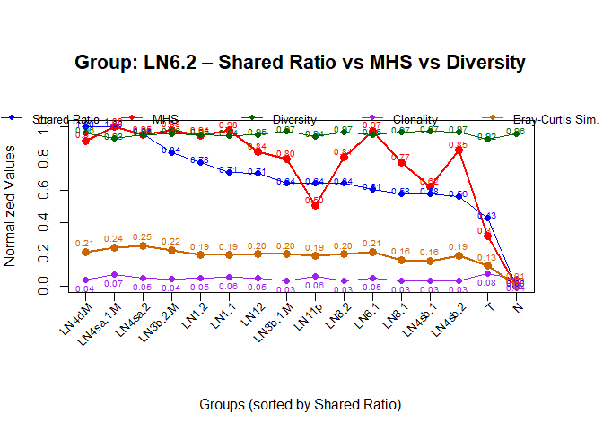<!-- -->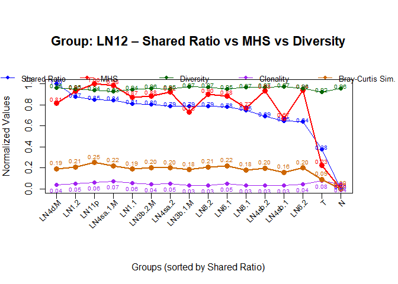<!-- -->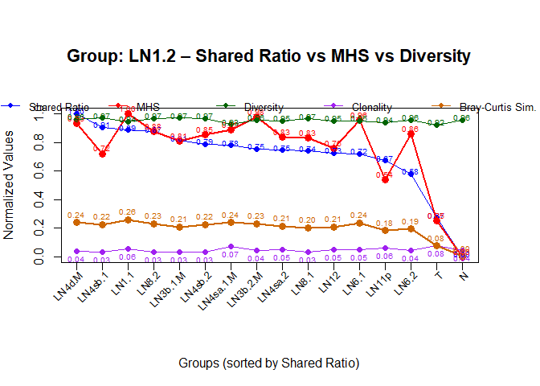<!-- -->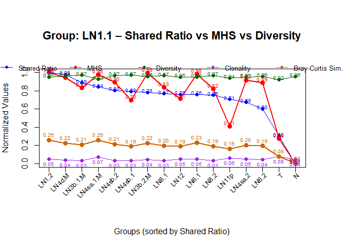<!-- -->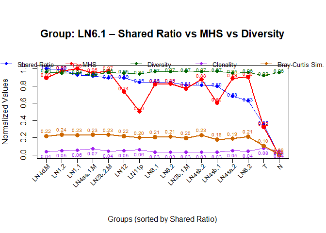<!-- -->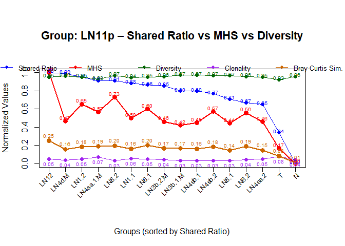<!-- -->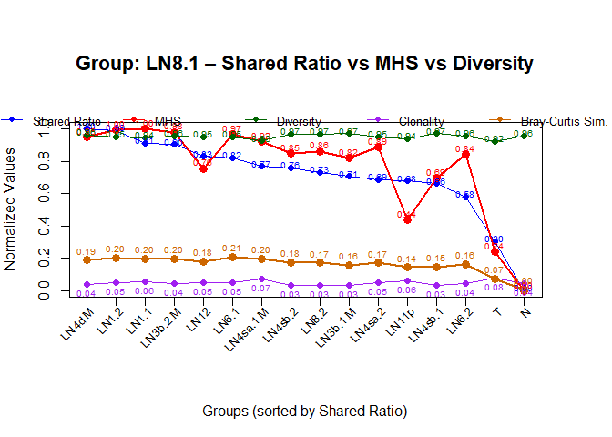<!-- -->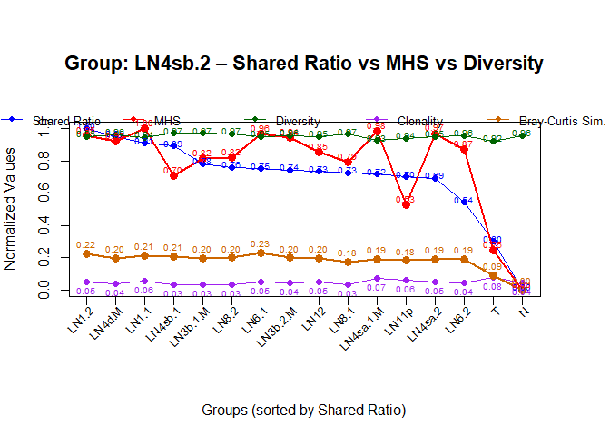<!-- -->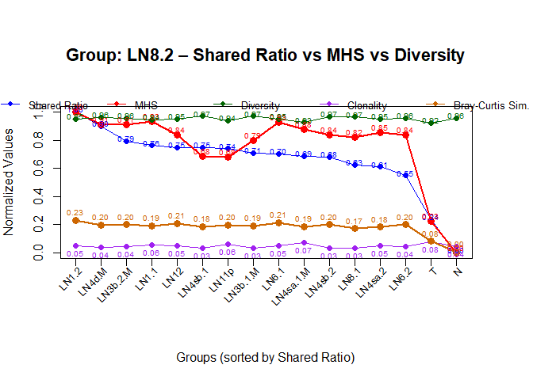<!-- -->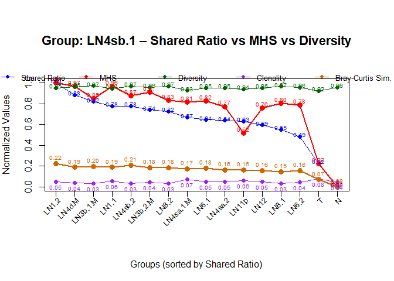<!-- -->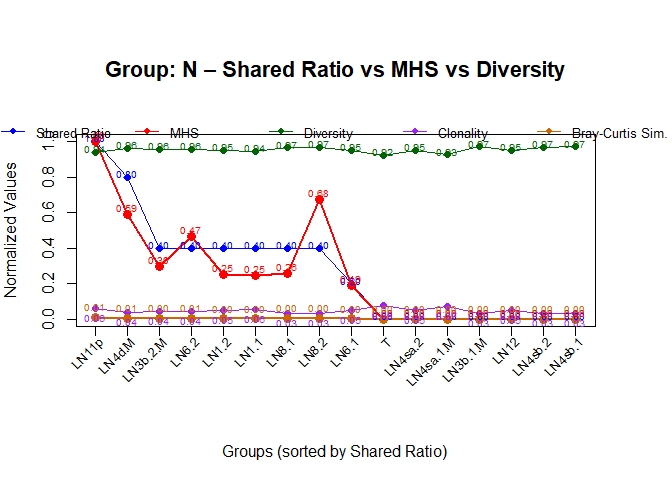<!-- -->

``` r
# PDF 종료
# dev.off()
```

## 4.5 cdr3 plot by uniqueness with T group’s self loop

``` r
library(tidyverse)
library(circlize)

# 1. cdr3 - group 정보 정리
cdr3_groups <- df |>
  filter(!is.na(cdr3) & cdr3 != "") |>
  group_by(cdr3) |>
  summarise(group = list(unique(group)), .groups = 'drop')

# 2. 공유된 cdr3와 단독 cdr3 분리
cdr3_shared <- cdr3_groups |> filter(lengths(group) > 1)
cdr3_unique <- cdr3_groups |> filter(lengths(group) == 1)

# 3. 공유된 cdr3로 group 간 pair 생성
make_pairs <- function(group) {
  if (length(group) < 2) return(NULL)
  combn(sort(group), 2, simplify = FALSE)
}
link_list_shared <- unlist(lapply(cdr3_shared$group, make_pairs), recursive = FALSE)

# 4. 단독 cdr3는 self-link로 표현
self_links <- lapply(cdr3_unique$group, function(g) list(c(g, g)))
link_list_self <- unlist(self_links, recursive = FALSE)

# 5. 모든 링크 통합
link_list <- c(link_list_shared, link_list_self)

# 6. 데이터프레임 생성
if (length(link_list) > 0) {
  link_df <- do.call(rbind, lapply(link_list, function(x) data.frame(from = x[1], to = x[2])))
} else {
  stop("No links found in the data.")
}

# 7. 링크 집계
link_df_count <- link_df |>
  group_by(from, to) |>
  summarise(weight = n(), .groups = "drop")

# 8. 색상 설정용 유니크 그룹 목록
link_df_unique <- link_df |>
  distinct(from, to)

all_group <- unique(c(link_df_unique$from, link_df_unique$to))

grid_colors <- setNames(rep("gray", length(all_group)), all_group)
if ("T" %in% all_group) {
  grid_colors["T"] <- "orange"
}

# 9. 링크 색상: T-T는 하늘색, T-others는 주황색, 나머지 self는 회색
link_df_count$col <- link_df_count |>
  mutate(col = case_when(
    from == "T" & to == "T" ~ "dodgerblue2",
    from == "T" | to == "T" ~ "orange",
    from == to ~ "gray90",
    TRUE ~ "gray80"
  )) |>
  pull(col)

# 10. sector 정렬 순서 설정
T_link_counts <- link_df |>
  filter(from == "T" | to == "T") |>
  mutate(other = ifelse(from == "T", to, from)) |>
  count(other, name = "n_shared") |>
  arrange(desc(n_shared))

sector_order <- c("T", T_link_counts$other)
remaining <- setdiff(sort(all_group), sector_order)
sector_order <- c(sector_order, remaining)

# 11. circos 플롯 그리기
circos.clear()
gap_per_sector <- 360 / (length(all_group) * 10)
circos.par(start.degree = 90, gap.degree = gap_per_sector)

chordDiagram(
  link_df_count,
  order = sector_order,
  grid.col = grid_colors,
  col = link_df_count$col,
  directional = 1,
  annotationTrack = "grid",
  preAllocateTracks = list(track.height = 0.1),
  transparency = 0.5,
  link.sort = TRUE,
  link.decreasing = TRUE
)

# 12. sector 라벨 그리기
circos.trackPlotRegion(track.index = 1, panel.fun = function(x, y) {
  sector.name <- get.cell.meta.data("sector.index")
  xlim <- get.cell.meta.data("xlim")
  ylim <- get.cell.meta.data("ylim")
  
  circos.text(
    x = mean(xlim), y = ylim[1] + .1,
    labels = sector.name,
    facing = "clockwise",
    niceFacing = TRUE,
    adj = c(0, 0.5),
    cex = .8
  )
}, bg.border = NA)

title("IS74 - Circos Plot based on CDR3 Similarity(Unique & T Self-loop)")
```

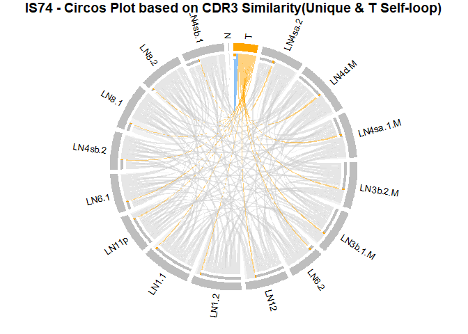<!-- -->

# (For M-containing Patients)Shared Ratio - MHS

``` r
# Initialize lists if they don't exist in the environment
if (!exists("M_M")) M_M <- list()
if (!exists("M_nonM")) M_nonM <- list()
if (!exists("nonM_M")) nonM_M <- list()
if (!exists("nonM_nonM")) nonM_nonM <- list()

# 각 그룹마다 반복
for (i in 1:nrow(percentage_matrix)) {
  # Check if the lists exist in the environment
  # if (!exists("M_M")) {
  #   M_M <- list()
  #   M_nonM <- list()
  #   nonM_M <- list()
  #   nonM_nonM <- list()
  # }
  group_name <- rownames(percentage_matrix)[i]

  # 자기 자신 제외한 공유도 벡터
  shared_vals <- percentage_matrix[i, ]
  if (group_name %in% names(shared_vals)) {
    shared_vals <- shared_vals[names(shared_vals) != group_name]
  }
  shared_groups <- names(shared_vals)

  # MHS 값 추출 및 정렬되지 않은 원본 형태 유지
  mhs_vals <- mhs_matrix[group_name, ]
  if (group_name %in% names(mhs_vals)) {
    mhs_vals <- mhs_vals[names(mhs_vals) != group_name]
  }
  mhs_named <- setNames(as.numeric(mhs_vals), names(mhs_vals))

  # 공유도 기준으로 정렬
  shared_numeric <- as.numeric(shared_vals)
  names(shared_numeric) <- shared_groups
  order_idx <- order(shared_numeric, decreasing = TRUE)
  sorted_labels <- shared_groups[order_idx]
  shared_sorted <- shared_numeric[order_idx]

  # 해당 순서에 맞춰 MHS 재배치
  mhs_reordered <- mhs_named[sorted_labels]

  # 표준화
  shared_scaled <- as.numeric(scale(shared_sorted))
  names(shared_scaled) <- names(shared_sorted)

  mhs_scaled <- as.numeric(scale(mhs_reordered))
  names(mhs_scaled) <- names(mhs_reordered)


  # 차이 계산
  diff_vals <- shared_scaled - mhs_scaled
  # 기준 그룹이 Metastasis인지 확인
  is_base_M <- grepl("M$", group_name)

  # 각 대상 그룹에 대해 리스트 분류 및 저장
  for (k in seq_along(sorted_labels)) {
    target_name <- sorted_labels[k]
    is_target_M <- grepl("M$", target_name)

    diff_val <- diff_vals[k]

    if (is_base_M && is_target_M) {
      M_M <- append(M_M, diff_val)
    } else if (is_base_M && !is_target_M) {
      M_nonM <- append(M_nonM, diff_val)
    } else if (!is_base_M && is_target_M) {
      nonM_M <- append(nonM_M, diff_val)
    } else {
      nonM_nonM <- append(nonM_nonM, diff_val)
    }
  }
}
```

``` r
print(paste("M_M:", length(M_M), "M_nonM:", length(M_nonM), "nonM_M:", length(nonM_M), "nonM_nonM:", length(nonM_nonM)))
```

    ## [1] "M_M: 12 M_nonM: 52 nonM_M: 52 nonM_nonM: 156"

``` r
# save(file.path(output_dir, "MHS_Shared_Diff_Lists.RData"), M_M, M_nonM, nonM_M, nonM_nonM)
```

``` r
# Load the saved lists of patient 74, 76, 77
# Those patients are M(metastasis)-containing patients
load(file.path(output_dir, "MHS_Shared_Diff_Lists.RData"))

# 데이터 프레임으로 변환
diff_df <- data.frame(
  value = c(unlist(M_M), unlist(M_nonM), unlist(nonM_M), unlist(nonM_nonM)),
  group = factor(
    rep(c("M_M", "M_nonM", "nonM_M", "nonM_nonM"),
        times = c(length(M_M), length(M_nonM), length(nonM_M), length(nonM_nonM))),
    levels = c("M_M", "M_nonM", "nonM_M", "nonM_nonM")
  )
)

# Merge 'M_nonM' and 'nonM_M' into 'nonM & M'
diff_df <- diff_df %>%
  mutate(group = case_when(
    group %in% c("M_nonM", "nonM_M") ~ "nonM_and_M",
    TRUE ~ group
  ))


# 절댓값으로 변환
diff_df$value <- abs(diff_df$value)

# Print the number of elements in each group
table(diff_df$group)
```

    ## 
    ##        M_M nonM_and_M  nonM_nonM 
    ##        170        398        438

``` r
# boxplot
library(ggplot2)

ggplot(diff_df, aes(x = group, y = value, fill = group)) +
  geom_boxplot(outlier.color = "black", outlier.shape = 16) +
  labs(title = "Difference between Standardized Shared Ratio and MHS",
       x = "Group Comparison Type",
       y = "Shared - MHS (standardized)") +
  theme_minimal() +
  theme(legend.position = "none",
        plot.title = element_text(hjust = 0.5))
```

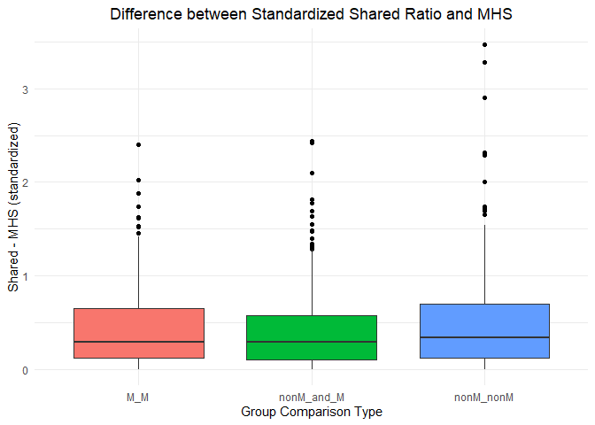<!-- -->

``` r
# Delete an outlier from the nonM_nonM group
diff_df <- diff_df[!(diff_df$group == "nonM_nonM" & diff_df$value > 3), ]
```

## Test

``` r
# 그룹별 정규성 검정 -> p-value < 0.05 이면 정규성 없음
shapiro.test(diff_df$value[diff_df$group == "M_M"])
```

    ## 
    ##  Shapiro-Wilk normality test
    ## 
    ## data:  diff_df$value[diff_df$group == "M_M"]
    ## W = 0.82663, p-value = 0.0000000000006192

``` r
shapiro.test(diff_df$value[diff_df$group == "nonM_and_M"])
```

    ## 
    ##  Shapiro-Wilk normality test
    ## 
    ## data:  diff_df$value[diff_df$group == "nonM_and_M"]
    ## W = 0.81646, p-value < 0.00000000000000022

``` r
shapiro.test(diff_df$value[diff_df$group == "nonM_nonM"])
```

    ## 
    ##  Shapiro-Wilk normality test
    ## 
    ## data:  diff_df$value[diff_df$group == "nonM_nonM"]
    ## W = 0.85914, p-value < 0.00000000000000022

``` r
# 그룹별 분산 동질성 검정 -> p-value < 0.05 이면 분산 동질성 없음
# install.packages("car")  # 한 번만 설치
library(car)
```

    ## Loading required package: carData

    ## 
    ## Attaching package: 'car'

    ## The following object is masked from 'package:purrr':
    ## 
    ##     some

    ## The following object is masked from 'package:dplyr':
    ## 
    ##     recode

``` r
leveneTest(value ~ group, data = diff_df)
```

    ## Warning in leveneTest.default(y = y, group = group, ...): group coerced to
    ## factor.

    ## Levene's Test for Homogeneity of Variance (center = median)
    ##         Df F value Pr(>F)
    ## group    2  1.9967 0.1363
    ##       1001

``` r
# M_M vs nonM_and_M vs nonM_nonM
kruskal.test(value ~ group, data = diff_df)
```

    ## 
    ##  Kruskal-Wallis rank sum test
    ## 
    ## data:  value by group
    ## Kruskal-Wallis chi-squared = 5.7092, df = 2, p-value = 0.05758

``` r
# 필요 패키지
# install.packages("FSA")  # 한 번만 설치
library(FSA)
```

    ## Registered S3 methods overwritten by 'FSA':
    ##   method       from
    ##   confint.boot car 
    ##   hist.boot    car

    ## ## FSA v0.10.0. See citation('FSA') if used in publication.
    ## ## Run fishR() for related website and fishR('IFAR') for related book.

    ## 
    ## Attaching package: 'FSA'

    ## The following object is masked from 'package:car':
    ## 
    ##     bootCase

``` r
dunnTest(value ~ group, data = diff_df, method = "bonferroni")
```

    ## Warning: group was coerced to a factor.

    ## Dunn (1964) Kruskal-Wallis multiple comparison

    ##   p-values adjusted with the Bonferroni method.

    ##               Comparison          Z    P.unadj     P.adj
    ## 1       M_M - nonM_and_M  0.8083559 0.41888575 1.0000000
    ## 2        M_M - nonM_nonM -1.0093896 0.31278782 0.9383635
    ## 3 nonM_and_M - nonM_nonM -2.3848727 0.01708503 0.0512551

``` r
wilcox.test(unlist(nonM_M), unlist(nonM_nonM))
```

    ## 
    ##  Wilcoxon rank sum test with continuity correction
    ## 
    ## data:  unlist(nonM_M) and unlist(nonM_nonM)
    ## W = 45999, p-value = 0.2614
    ## alternative hypothesis: true location shift is not equal to 0

``` r
# nonM & M vs nonM_nonM
wilcox.test(
  diff_df$value[diff_df$group == "nonM_and_M"],
  diff_df$value[diff_df$group == "nonM_nonM"],
  paired = FALSE,
  # alternative = "two.sided",
  alternative = "less"
)
```

    ## 
    ##  Wilcoxon rank sum test with continuity correction
    ## 
    ## data:  diff_df$value[diff_df$group == "nonM_and_M"] and diff_df$value[diff_df$group == "nonM_nonM"]
    ## W = 78386, p-value = 0.007956
    ## alternative hypothesis: true location shift is less than 0

``` r
library(effsize)

# Calculate Cliff's delta effect size

# 필요한 두 그룹만 추출
df_sub <- subset(diff_df, group %in% c("nonM_and_M", "nonM_nonM"))

# group이 factor인지 확인하고, 레벨 정리
df_sub$group <- droplevels(factor(df_sub$group))

cliff.delta(value ~ group, data = df_sub)
```

    ## 
    ## Cliff's Delta
    ## 
    ## delta estimate: -0.09656079 (negligible)
    ## 95 percent confidence interval:
    ##       lower       upper 
    ## -0.17375135 -0.01819095

``` r
# 시각화 대상 데이터프레임: df_sub
ggplot(df_sub, aes(x = group, y = value, fill = group)) +
  geom_violin(trim = FALSE, alpha = 0.5) +                   # 분포(violin)
  geom_boxplot(width = 0.2, outlier.shape = NA, alpha = 0.8) + # 중앙값 box
  geom_jitter(width = 0.1, size = 1.5, alpha = 0.3) +        # 실제 점
  stat_compare_means(
    method = "wilcox.test",
    label.y = max(df_sub$value) * 1.05,
    label = "p.format"
  ) +
  labs(
    title = "Group Comparison: nonM_and_M vs nonM_nonM",
    y = "Absolute(Standardized Shared - MHS)",
    x = "Group"
  ) +
  theme_minimal() +
  theme(legend.position = "none") +
  annotate("text",
           x = 1.5,
           y = max(df_sub$value) * 1.1,
           label = "Cliff's δ = -0.105 (negligible)",
           size = 4.5,
           fontface = "italic")
```

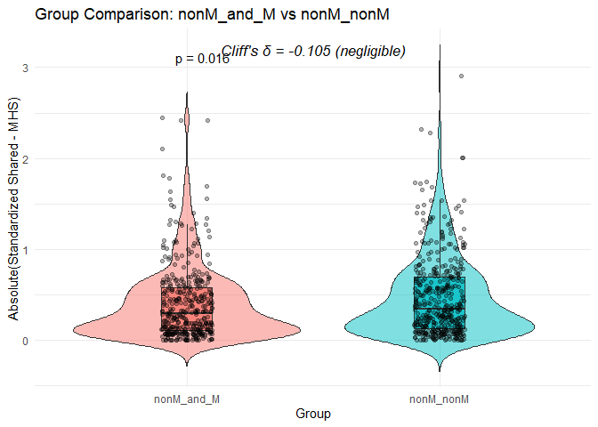<!-- -->
