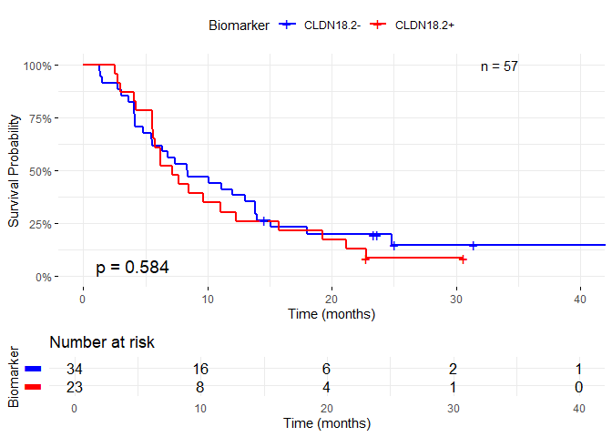
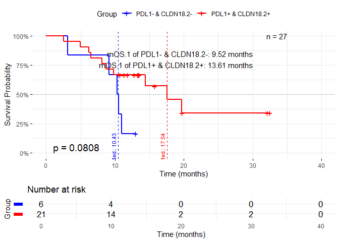
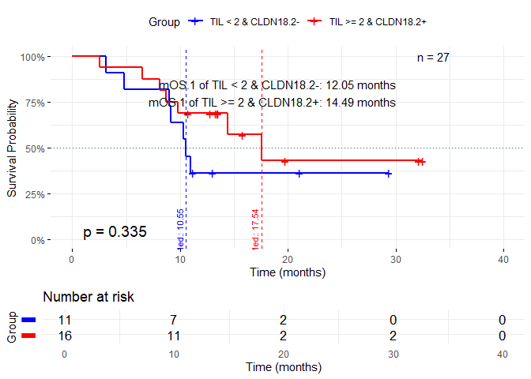

Drawing KM curves for Claudin18.2
================
Jongwu Kim
2025-07-19

This notebook draws KM curves for 4 different conditions based on
Claudin18.2. The 4 conditions are: (1) CLDN18.2 only (2) PDL1 and
CLDN18.2 (3) TIL=0 and CLDN18.2 (4) TIL=1 and CLDN18.2

The script lastly run on R 4.5.1

``` r
# Mute warnings
options(warn = -1)
# Load the required libraries
library(ggplot2)
library(readxl)
library(skimr)
library(randomForest)
```

    ## randomForest 4.7-1.2

    ## Type rfNews() to see new features/changes/bug fixes.

    ## 
    ## Attaching package: 'randomForest'

    ## The following object is masked from 'package:ggplot2':
    ## 
    ##     margin

``` r
library(dplyr)
```

    ## 
    ## Attaching package: 'dplyr'

    ## The following object is masked from 'package:randomForest':
    ## 
    ##     combine

    ## The following objects are masked from 'package:stats':
    ## 
    ##     filter, lag

    ## The following objects are masked from 'package:base':
    ## 
    ##     intersect, setdiff, setequal, union

``` r
library(survival)
library(openxlsx)
# Load the survminer library for advanced survival plots
library(survminer)
```

    ## Loading required package: ggpubr

    ## 
    ## Attaching package: 'survminer'

    ## The following object is masked from 'package:survival':
    ## 
    ##     myeloma

``` r
library(glmnet)
```

    ## Loading required package: Matrix

    ## Loaded glmnet 4.1-9

``` r
# Enable warnings
options(warn = 1)
# Set seed for reproducibility
set.seed(42)
```

``` r
# Load the xlsx data
data <- read_excel('data/Updated2.xlsx', sheet = 'Sheet2')
# Delete the first column
data <- data[,-1]
```

``` r
# Data overlook & preprocessing
# Check the structure of the data
skim(data)
```

|                                                  |      |
|:-------------------------------------------------|:-----|
| Name                                             | data |
| Number of rows                                   | 57   |
| Number of columns                                | 18   |
| \_\_\_\_\_\_\_\_\_\_\_\_\_\_\_\_\_\_\_\_\_\_\_   |      |
| Column type frequency:                           |      |
| character                                        | 7    |
| numeric                                          | 11   |
| \_\_\_\_\_\_\_\_\_\_\_\_\_\_\_\_\_\_\_\_\_\_\_\_ |      |
| Group variables                                  | None |

Data summary

**Variable type: character**

| skim_variable | n_missing | complete_rate | min | max | empty | n_unique | whitespace |
|:--------------|----------:|--------------:|----:|----:|------:|---------:|-----------:|
| sex           |         0 |             1 |   1 |   1 |     0 |        2 |          0 |
| Pathology1    |         0 |             1 |   3 |  25 |     0 |        5 |          0 |
| PDL1          |         0 |             1 |   8 |   8 |     0 |        2 |          0 |
| BR            |         0 |             1 |   2 |   2 |     0 |        4 |          0 |
| HER2          |         0 |             1 |   8 |   8 |     0 |        2 |          0 |
| TCGA          |         0 |             1 |   3 |  11 |     0 |        4 |          0 |
| Claudin18.2   |         0 |             1 |   8 |   8 |     0 |        2 |          0 |

**Variable type: numeric**

| skim_variable    | n_missing | complete_rate |   mean |     sd |  p0 | p25 | p50 | p75 | p100 | hist  |
|:-----------------|----------:|--------------:|-------:|-------:|----:|----:|----:|----:|-----:|:------|
| age              |         0 |             1 |  55.07 |  12.83 |  21 |  45 |  56 |  66 |   75 | ▁▃▅▇▇ |
| TIL              |         0 |             1 |   3.75 |   4.11 |   0 |   1 |   2 |   5 |   20 | ▇▂▁▁▁ |
| TPS              |         0 |             1 |   8.18 |  21.83 |   0 |   0 |   0 |   2 |   90 | ▇▁▁▁▁ |
| CPS              |         0 |             1 |  11.93 |  23.38 |   0 |   1 |   2 |   6 |   95 | ▇▁▁▁▁ |
| PD               |         0 |             1 |   0.86 |   0.35 |   0 |   1 |   1 |   1 |    1 | ▁▁▁▁▇ |
| PFS              |         0 |             1 | 339.19 | 280.94 |  40 | 129 | 233 | 444 | 1462 | ▇▃▂▁▁ |
| Death            |         0 |             1 |   0.70 |   0.46 |   0 |   0 |   1 |   1 |    1 | ▃▁▁▁▇ |
| OS               |         0 |             1 | 594.30 | 380.88 |  78 | 279 | 534 | 829 | 1572 | ▇▆▅▂▂ |
| Claudin18.2score |         0 |             1 |  44.02 |  42.25 |   0 |   0 |  30 |  90 |  100 | ▇▂▁▂▅ |
| Death.1          |         0 |             1 |   0.54 |   0.50 |   0 |   0 |   1 |   1 |    1 | ▇▁▁▁▇ |
| OS.1             |         0 |             1 | 460.58 | 260.96 |  77 | 279 | 397 | 601 | 1195 | ▆▇▃▂▂ |

``` r
# CR    Complete Response   완전관해. 모든 병변이 사라짐. 최소 4주 이상 지속되어야 함.
# PR    Partial Response    부분관해. 종양 크기가 기준선 대비 최소 30% 이상 감소. 최소 4주 이상 지속되어야 함.
# SD    Stable Disease  안정병변. 종양 크기가 의미 있게 줄지도, 커지지도 않음. PR도 아니고 PD도 아님.
# PD    Progressive Disease 진행병변. 기준선 대비 종양 크기가 최소 20% 이상 증가하거나 새로운 병변이 나타남.
# Sort by the severence from the least to the worst,
# CR, PR, SD, PD
data <- data |>
  mutate(BR = case_when(
    BR == "CR" ~ 1,
    BR == "PR" ~ 2,
    BR == "SD" ~ 3,
    BR == "PD" ~ 4
  ))
# Check the unique values in the 'BR' column again
unique(data$BR)
```

    ## [1] 4 3 2 1

## (Sheet 1) Change the TCGA column to a numeric

``` r
# # Change the TCGA column to a numeric
# # Sort by the severence from the least to the worst,
# # MSI, EBV, CIN, GS
# data <- data |>
#   mutate(TCGA = case_when(
#     TCGA == "MSI" ~ 1,
#     TCGA == "EBV" ~ 2,
#     TCGA == "CIN" ~ 3,
#     TCGA == "GS" ~ 4
#   ))
# unique(data$TCGA)
```

## (Sheet2) Convert the column’s name ‘Pathology1’ to ‘Pathology’

``` r
colnames(data)[colnames(data) == "Pathology1"] <- "Pathology"

# Check the unique values in the 'Pathlogy' column
unique(data$Pathology)
```

    ## [1] "SRC"                       "ADC"                      
    ## [3] "Carcinoma"                 "Metastaic ADC"            
    ## [5] "Poorly cohesive carcinoma"

``` r
# Change time from days to months
data$PFS <- data$PFS / 30.44  # 30.44일 = 1개월
data$OS <- data$OS / 30.44  # 30.44일 = 1개월
data$OS.1 <- data$OS.1 / 30.44  # 30.44일 = 1개월

# Check the number NA values in the data
na_count <- sapply(data, function(x) sum(is.na(x)))
na_count
```

    ##              sex              age        Pathology             PDL1 
    ##                0                0                0                0 
    ##              TIL              TPS              CPS               BR 
    ##                0                0                0                0 
    ##               PD              PFS            Death               OS 
    ##                0                0                0                0 
    ##             HER2             TCGA Claudin18.2score      Claudin18.2 
    ##                0                0                0                0 
    ##          Death.1             OS.1 
    ##                0                0

# 1 Survival object using OS & Death with Claudin18.2

``` r
# drop the 'TCGA' column
data <- data[, -which(names(data) == "TCGA")]

# Factorize Claudin18.2
data$Claudin18.2 <- factor(data$Claudin18.2, levels = c("Negative", "Positive"))

# Kaplan-Meier
km_fit_group <- survfit(Surv(PFS, PD) ~ Claudin18.2, data = data)

# Calculate the log-rank test and p-value
logrank_test <- survdiff(Surv(PFS, PD) ~ Claudin18.2, data = data)
pval <- 1 - pchisq(logrank_test$chisq, df = length(logrank_test$n) - 1)
pval_text <- paste0("p = ", format.pval(pval, digits = 3, eps = .001))

# Total number of samples
total_n <- nrow(data)
n_text <- paste0("n = ", total_n)
```

``` r
# Plotting the Kaplan-Meier curve
plot_obj <- ggsurvplot(
  km_fit_group,
  data = data,
  xlab = "Time (months)",
  ylab = "Survival Probability",
  title = NULL,
  palette = c("blue", "red"),
  conf.int = FALSE,
  pval = pval_text,
  pval.coord = c(1, 0.05),  # 좌측 하단에 p-value
  legend.title = "Biomarker",
  legend.labs = c("CLDN18.2-", "CLDN18.2+"),
  risk.table = TRUE,
  risk.table.title = NULL,
  risk.table.y.text = FALSE,
  break.time.by = 10,
  xlim = c(0, 40),
  surv.scale = "percent",
  ggtheme = theme_minimal()
)
```

``` r
# Add the total number of samples to the plot
plot_obj$plot <- plot_obj$plot +
  annotate("text", x = 35, y = 1.0, label = n_text, hjust = 1, size = 4) +
  scale_x_continuous(breaks = seq(0, 40, by = 10)) +
  scale_y_continuous(breaks = seq(0, 1, by = 0.25), labels = scales::percent_format(accuracy = 1))
```

    ## Scale for x is already present.
    ## Adding another scale for x, which will replace the existing scale.
    ## Scale for y is already present.
    ## Adding another scale for y, which will replace the existing scale.

``` r
print(plot_obj)
```

<!-- -->
\# 2. Survival analysis for the two groups based on PDL1 and Claudin18.2

``` r
# Define two groups based on PDL1 and Claudin18.2
data_filtered <- data |>
  mutate(group_CLDN_PDL1 = ifelse(PDL1 == "Negative" & Claudin18.2 == "Negative", "PDL1- & CLDN18.2-",
                                  ifelse(PDL1 == "Positive" & Claudin18.2 == "Positive", "PDL1+ & CLDN18.2+",
                                   NA)))
# Check the number of rows and unique values in the group_CLDN_PDL1 column
nrow(data_filtered)
```

    ## [1] 57

``` r
unique(data_filtered$group_CLDN_PDL1)
```

    ## [1] "PDL1- & CLDN18.2-" NA                  "PDL1+ & CLDN18.2+"

``` r
# Check the unique values in the group_CLDN_PDL1 column
table(data_filtered$group_CLDN_PDL1)
```

    ## 
    ## PDL1- & CLDN18.2- PDL1+ & CLDN18.2+ 
    ##                 6                21

``` r
# Remove rows with NA in the group_CLDN_PDL1 column
data_filtered <- data_filtered[!is.na(data_filtered$group_CLDN_PDL1), ]
# Check the number of rows after filtering
nrow(data_filtered)
```

    ## [1] 27

``` r
# Check the unique values in the group_CLDN_PDL1 column again
unique(data_filtered$group_CLDN_PDL1)
```

    ## [1] "PDL1- & CLDN18.2-" "PDL1+ & CLDN18.2+"

``` r
# Check the number of rows in each group
table(data_filtered$group_CLDN_PDL1)
```

    ## 
    ## PDL1- & CLDN18.2- PDL1+ & CLDN18.2+ 
    ##                 6                21

``` r
# Factorize the group_CLDN_PDL1 variable
data_filtered$group_CLDN_PDL1 <- factor(data_filtered$group_CLDN_PDL1,
                              levels = c("PDL1- & CLDN18.2-", "PDL1+ & CLDN18.2+"))

# Check
head(data_filtered$group_CLDN_PDL1, 10)
```

    ##  [1] PDL1- & CLDN18.2- PDL1- & CLDN18.2- PDL1- & CLDN18.2- PDL1- & CLDN18.2-
    ##  [5] PDL1- & CLDN18.2- PDL1- & CLDN18.2- PDL1+ & CLDN18.2+ PDL1+ & CLDN18.2+
    ##  [9] PDL1+ & CLDN18.2+ PDL1+ & CLDN18.2+
    ## Levels: PDL1- & CLDN18.2- PDL1+ & CLDN18.2+

``` r
group <- data_filtered$group_CLDN_PDL1

# Kaplan-Meier survival analysis
km_fit_group <- survfit(Surv(OS.1, Death.1) ~ group_CLDN_PDL1, data = data_filtered)

# Calculate the log-rank test and p-value
logrank_test <- survdiff(Surv(OS.1, Death.1) ~ group_CLDN_PDL1, data = data_filtered)
pval <- 1 - pchisq(logrank_test$chisq, df = length(logrank_test$n) - 1)
pval_text <- paste0("p = ", format.pval(pval, digits = 3, eps = .001))

# Total number of samples
total_n <- nrow(data_filtered)
n_text <- paste0("n = ", total_n)
```

``` r
# Solve the difference between the mean time and number of samples
# Calculate the mean time for each group
mean_time <- mean(data_filtered$OS.1[data_filtered$group_CLDN_PDL1 == "PDL1- & CLDN18.2-"], na.rm = TRUE)
mean_time2 <- mean(data_filtered$OS.1[data_filtered$group_CLDN_PDL1 == "PDL1+ & CLDN18.2+"], na.rm = TRUE)
# Calculate the number of samples for each group
n_group1 <- nrow(data_filtered[data_filtered$group_CLDN_PDL1 == "PDL1- & CLDN18.2-", ])
n_group2 <- nrow(data_filtered[data_filtered$group_CLDN_PDL1 == "PDL1+ & CLDN18.2+", ])
n_group_text <- paste0("PDL1- & CLDN18.2-: ", n_group1, "\nPDL1+ & CLDN18.2+: ", n_group2)

mean_time <- round(mean_time, 2); mean_time2 <- round(mean_time2, 2)
diff_time <- mean_time - mean_time2
# Create a text label for the mean time
mean_time_text <- paste0("mOS.1 of PDL1- & CLDN18.2-: ", mean_time, " months\n",
                          "mOS.1 of PDL1+ & CLDN18.2+: ", mean_time2, " months")
# Create a text label for the difference in mean time
diff_time_text <- paste0("Difference in mean time: ", diff_time, " months")
# Create a text label for the number of samples

# n_group_text <- paste0("PDL1- & CLDN18.2-: ", n_group1, "\nPDL1+ & CLDN18.2+: ", n_group2)
medians <- summary(km_fit_group)$table[, "median"]
```

``` r
# Print the mean time and number of samples
cat("Mean time for PDL1- & CLDN18.2- group: ", mean_time, " months\n")
```

    ## Mean time for PDL1- & CLDN18.2- group:  9.52  months

``` r
cat("Mean time for PDL1+ & CLDN18.2+ group: ", mean_time2, " months\n")
```

    ## Mean time for PDL1+ & CLDN18.2+ group:  13.61  months

``` r
cat("Difference in mean time: ", diff_time, " months\n")
```

    ## Difference in mean time:  -4.09  months

``` r
cat("Number of samples for PDL1- & CLDN18.2- group: ", n_group1, "\n")
```

    ## Number of samples for PDL1- & CLDN18.2- group:  6

``` r
cat("Number of samples for PDL1+ & CLDN18.2+ group: ", n_group2, "\n")
```

    ## Number of samples for PDL1+ & CLDN18.2+ group:  21

``` r
# Plotting the Kaplan-Meier curve for the two groups
plot_obj <- ggsurvplot(
  km_fit_group,
  data = data_filtered,
  xlab = "Time (months)",
  ylab = "Survival Probability",
  title = NULL,
  palette = c("blue", "red"),
  conf.int = FALSE,
  pval = pval_text,
  pval.coord = c(1, 0.05),
  legend.title = "Group",
  legend.labs = c("PDL1- & CLDN18.2-", "PDL1+ & CLDN18.2+"),
  risk.table = TRUE,
  risk.table.title = NULL,
  risk.table.y.text = FALSE,
  break.time.by = 10,
  xlim = c(0, 40),
  surv.scale = "percent",
  mean_time_text = mean_time_text,
  ggtheme = theme_minimal()
)

# Add the total number of samples to the plot
plot_obj$plot <- plot_obj$plot +
  annotate("text", x = 35, y = 1.0, label = n_text, hjust = 1, size = 4) +
  scale_x_continuous(breaks = seq(0, 40, by = 10)) +
  scale_y_continuous(breaks = seq(0, 1, by = 0.25), labels = scales::percent_format(accuracy = 1)) +
  annotate("text", x = 30, y = 0.8, label = mean_time_text, hjust = 1, size = 4) +
  # Dotted Line for 50% survival
  geom_hline(yintercept = 0.5, linetype = "dotted", colour = "#306c81", linewidth = 0.5) +
  geom_vline(xintercept = medians[1], linetype = "dashed", color = "blue", size = 0.5) +
  geom_vline(xintercept = medians[2], linetype = "dashed", color = "red", size = 0.5) +
  annotate("text", x = medians[1], y = 0.05, label = paste0("Med.: ", round(medians[1], 2)), color = "blue", angle = 90, vjust = -0.5, size = 3) +
  annotate("text", x = medians[2], y = 0.05, label = paste0("Med.: ", round(medians[2], 2)), color = "red", angle = 90, vjust = -0.5, size = 3)
```

    ## Scale for x is already present.
    ## Adding another scale for x, which will replace the existing scale.
    ## Scale for y is already present.
    ## Adding another scale for y, which will replace the existing scale.

    ## Warning: Using `size` aesthetic for lines was deprecated in ggplot2 3.4.0.
    ## ℹ Please use `linewidth` instead.
    ## This warning is displayed once every 8 hours.
    ## Call `lifecycle::last_lifecycle_warnings()` to see where this warning was
    ## generated.

``` r
# Print
print(plot_obj)
```

<!-- -->

# 3. Survival analysis for the two groups based on TIL=0 and Claudin18.2

``` r
# Define two groups based on TIL and Claudin18.2
data_filtered <- data |>
  mutate(group_CLDN_TIL = ifelse(TIL == 0 & Claudin18.2 == "Negative", "TIL == 0 & CLDN18.2-",
                                  ifelse(TIL > 0 & Claudin18.2 == "Positive", "TIL > 0 & CLDN18.2+",
                                   NA)))
# Check the number of rows and unique values in the group_CLDN_TIL column
nrow(data_filtered)
```

    ## [1] 57

``` r
unique(data_filtered$group_CLDN_TIL)
```

    ## [1] "TIL == 0 & CLDN18.2-" NA                     "TIL > 0 & CLDN18.2+"

``` r
# Check the unique values in the group_CLDN_TIL column
table(data_filtered$group_CLDN_TIL)
```

    ## 
    ## TIL == 0 & CLDN18.2-  TIL > 0 & CLDN18.2+ 
    ##                    6                   21

``` r
# Check the number of NA values in the group_CLDN_TIL column
na_count <- sum(is.na(data_filtered$group_CLDN_TIL))
na_count
```

    ## [1] 30

``` r
# Remove rows with NA in the group_CLDN_TIL column
data_filtered <- data_filtered[!is.na(data_filtered$group_CLDN_TIL), ]
# Check the number of rows after filtering
nrow(data_filtered)
```

    ## [1] 27

``` r
# Check the unique values in the group_CLDN_TIL column again
unique(data_filtered$group_CLDN_TIL)
```

    ## [1] "TIL == 0 & CLDN18.2-" "TIL > 0 & CLDN18.2+"

``` r
# Check the number of rows in each group
table(data_filtered$group_CLDN_TIL)
```

    ## 
    ## TIL == 0 & CLDN18.2-  TIL > 0 & CLDN18.2+ 
    ##                    6                   21

``` r
# Factorize the group_CLDN_TIL variable
data_filtered$group_CLDN_TIL <- factor(data_filtered$group_CLDN_TIL,
                              levels = c("TIL == 0 & CLDN18.2-", "TIL > 0 & CLDN18.2+"))

# Check
head(data_filtered$group_CLDN_TIL, 10)
```

    ##  [1] TIL == 0 & CLDN18.2- TIL == 0 & CLDN18.2- TIL == 0 & CLDN18.2-
    ##  [4] TIL == 0 & CLDN18.2- TIL == 0 & CLDN18.2- TIL == 0 & CLDN18.2-
    ##  [7] TIL > 0 & CLDN18.2+  TIL > 0 & CLDN18.2+  TIL > 0 & CLDN18.2+ 
    ## [10] TIL > 0 & CLDN18.2+ 
    ## Levels: TIL == 0 & CLDN18.2- TIL > 0 & CLDN18.2+

``` r
group <- data_filtered$group_CLDN_TIL

# Kaplan-Meier survival analysis
km_fit_group <- survfit(Surv(OS.1, Death.1) ~ group_CLDN_TIL, data = data_filtered)

# Calculate the log-rank test and p-value
logrank_test <- survdiff(Surv(OS.1, Death.1) ~ group_CLDN_TIL, data = data_filtered)
pval <- 1 - pchisq(logrank_test$chisq, df = length(logrank_test$n) - 1)
pval_text <- paste0("p = ", format.pval(pval, digits = 3, eps = .001))

# Total number of samples
total_n <- nrow(data_filtered)
n_text <- paste0("n = ", total_n)
```

``` r
# Solve the difference between the mean time and number of samples
# Calculate the mean time for each group
mean_time <- mean(data_filtered$OS.1[data_filtered$group_CLDN_TIL == "TIL == 0 & CLDN18.2-"], na.rm = TRUE)
mean_time2 <- mean(data_filtered$OS.1[data_filtered$group_CLDN_TIL == "TIL > 0 & CLDN18.2+"], na.rm = TRUE)
# Calculate the number of samples for each group
n_group1 <- nrow(data_filtered[data_filtered$group_CLDN_TIL == "TIL == 0 & CLDN18.2-", ])
n_group2 <- nrow(data_filtered[data_filtered$group_CLDN_TIL == "TIL > 0 & CLDN18.2+", ])
n_group_text <- paste0("TIL == 0 & CLDN18.2-: ", n_group1, "\nTIL > 0 & CLDN18.2+: ", n_group2)

mean_time <- round(mean_time, 2); mean_time2 <- round(mean_time2, 2)
diff_time <- mean_time - mean_time2
# Create a text label for the mean time
mean_time_text <- paste0("mOS.1 of TIL == 0 & CLDN18.2-: ", mean_time, " months\n",
                          "mOS.1 of TIL > 0 & CLDN18.2+: ", mean_time2, " months")
# Create a text label for the difference in mean time
diff_time_text <- paste0("Difference in mean time: ", diff_time, " months")
# Create a text label for the number of samples
# n_group_text <- paste0("TIL == 0 & CLDN18.2-: ", n_group1, "\nTIL > 0 & CLDN18.2+: ", n_group2)

medians <- summary(km_fit_group)$table[, "median"]
```

``` r
# Print the mean time and number of samples
cat("Mean time for TIL == 0 & CLDN18.2- group: ", mean_time, " months\n")
```

    ## Mean time for TIL == 0 & CLDN18.2- group:  9.52  months

``` r
cat("Mean time for TIL > 0 & CLDN18.2+ group: ", mean_time2, " months\n")
```

    ## Mean time for TIL > 0 & CLDN18.2+ group:  13.61  months

``` r
cat("Difference in mean time: ", diff_time, " months\n")
```

    ## Difference in mean time:  -4.09  months

``` r
cat("Number of samples for TIL == 0 & CLDN18.2- group: ", n_group1, "\n")
```

    ## Number of samples for TIL == 0 & CLDN18.2- group:  6

``` r
cat("Number of samples for TIL > 0 & CLDN18.2+ group: ", n_group2, "\n")
```

    ## Number of samples for TIL > 0 & CLDN18.2+ group:  21

``` r
# Plotting the Kaplan-Meier curve for the two groups
plot_obj <- ggsurvplot(
  km_fit_group,
  data = data_filtered,
  xlab = "Time (months)",
  ylab = "Survival Probability",
  title = NULL,
  palette = c("blue", "red"),
  conf.int = FALSE,
  pval = pval_text,
  pval.coord = c(1, 0.05),
  legend.title = "Group",
  legend.labs = c("TIL == 0 & CLDN18.2-", "TIL > 0 & CLDN18.2+"),
  risk.table = TRUE,
  risk.table.title = NULL,
  risk.table.y.text = FALSE,
  break.time.by = 10,
  xlim = c(0, 40),
  surv.scale = "percent",
  mean_time_text = mean_time_text,
  ggtheme = theme_minimal()
)
# Add the total number of samples to the plot
plot_obj$plot <- plot_obj$plot +
  annotate("text", x = 35, y = 1.0, label = n_text, hjust = 1, size = 4) +
  scale_x_continuous(breaks = seq(0, 40, by = 10)) +
  scale_y_continuous(breaks = seq(0, 1, by = 0.25), labels = scales::percent_format(accuracy = 1)) +
  annotate("text", x = 30, y = 0.8, label = mean_time_text, hjust = 1, size = 4) +
  # Dotted Line for 50% survival
  geom_hline(yintercept = 0.5, linetype = "dotted", colour = "#306c81", linewidth = 0.5) +
  geom_vline(xintercept = medians[1], linetype = "dashed", color = "blue", size = 0.5) +
  geom_vline(xintercept = medians[2], linetype = "dashed", color = "red", size = 0.5) +
  annotate("text", x = medians[1], y = 0.05, label = paste0("Med.: ", round(medians[1], 2)), color = "blue", angle = 90, vjust = -0.5, size = 3) +
  annotate("text", x = medians[2], y = 0.05, label = paste0("Med.: ", round(medians[2], 2)), color = "red", angle = 90, vjust = -0.5, size = 3)
```

    ## Scale for x is already present.
    ## Adding another scale for x, which will replace the existing scale.
    ## Scale for y is already present.
    ## Adding another scale for y, which will replace the existing scale.

``` r
# Print
print(plot_obj)
```

<!-- -->
\# 4. Survival analysis for the two groups based on TIL=1 and
Claudin18.2

``` r
# Define two groups based on TIL and Claudin18.2
data_filtered <- data |>
  mutate(group_CLDN_TIL = ifelse(TIL < 2 & Claudin18.2 == "Negative", "TIL < 2 & CLDN18.2-",
                                  ifelse(TIL >= 2 & Claudin18.2 == "Positive", "TIL >= 2 & CLDN18.2+",
                                   NA)))
# Check the number of rows and unique values in the group_CLDN_TIL column
nrow(data_filtered)
```

    ## [1] 57

``` r
unique(data_filtered$group_CLDN_TIL)
```

    ## [1] "TIL < 2 & CLDN18.2-"  NA                     "TIL >= 2 & CLDN18.2+"

``` r
# Check the unique values in the group_CLDN_TIL column
table(data_filtered$group_CLDN_TIL)
```

    ## 
    ##  TIL < 2 & CLDN18.2- TIL >= 2 & CLDN18.2+ 
    ##                   11                   16

``` r
# Check the number of NA values in the group_CLDN_TIL column
na_count <- sum(is.na(data_filtered$group_CLDN_TIL))
na_count
```

    ## [1] 30

``` r
# Remove rows with NA in the group_CLDN_TIL column
data_filtered <- data_filtered[!is.na(data_filtered$group_CLDN_TIL), ]
# Check the number of rows after filtering
nrow(data_filtered)
```

    ## [1] 27

``` r
# Check the unique values in the group_CLDN_TIL column again
unique(data_filtered$group_CLDN_TIL)
```

    ## [1] "TIL < 2 & CLDN18.2-"  "TIL >= 2 & CLDN18.2+"

``` r
# Check the number of rows in each group
table(data_filtered$group_CLDN_TIL)
```

    ## 
    ##  TIL < 2 & CLDN18.2- TIL >= 2 & CLDN18.2+ 
    ##                   11                   16

``` r
# Factorize the group_CLDN_TIL variable
data_filtered$group_CLDN_TIL <- factor(data_filtered$group_CLDN_TIL,
                              levels = c("TIL < 2 & CLDN18.2-", "TIL >= 2 & CLDN18.2+"))

# Check
head(data_filtered$group_CLDN_TIL, 10)
```

    ##  [1] TIL < 2 & CLDN18.2- TIL < 2 & CLDN18.2- TIL < 2 & CLDN18.2-
    ##  [4] TIL < 2 & CLDN18.2- TIL < 2 & CLDN18.2- TIL < 2 & CLDN18.2-
    ##  [7] TIL < 2 & CLDN18.2- TIL < 2 & CLDN18.2- TIL < 2 & CLDN18.2-
    ## [10] TIL < 2 & CLDN18.2-
    ## Levels: TIL < 2 & CLDN18.2- TIL >= 2 & CLDN18.2+

``` r
group <- data_filtered$group_CLDN_TIL

# Kaplan-Meier survival analysis
km_fit_group <- survfit(Surv(OS.1, Death.1) ~ group_CLDN_TIL, data = data_filtered)

# Calculate the log-rank test and p-value
logrank_test <- survdiff(Surv(OS.1, Death.1) ~ group_CLDN_TIL, data = data_filtered)
pval <- 1 - pchisq(logrank_test$chisq, df = length(logrank_test$n) - 1)
pval_text <- paste0("p = ", format.pval(pval, digits = 3, eps = .001))

# Total number of samples
total_n <- nrow(data_filtered)
n_text <- paste0("n = ", total_n)
```

``` r
# Solve the difference between the mean time and number of samples
# Calculate the mean time for each group
mean_time <- mean(data_filtered$OS.1[data_filtered$group_CLDN_TIL == "TIL < 2 & CLDN18.2-"], na.rm = TRUE)
mean_time2 <- mean(data_filtered$OS.1[data_filtered$group_CLDN_TIL == "TIL >= 2 & CLDN18.2+"], na.rm = TRUE)
# Calculate the number of samples for each group
n_group1 <- nrow(data_filtered[data_filtered$group_CLDN_TIL == "TIL < 2 & CLDN18.2-", ])
n_group2 <- nrow(data_filtered[data_filtered$group_CLDN_TIL == "TIL >= 2 & CLDN18.2+", ])
n_group_text <- paste0("TIL < 2 & CLDN18.2-: ", n_group1, "\nTIL >= 2 & CLDN18.2+: ", n_group2)

mean_time <- round(mean_time, 2); mean_time2 <- round(mean_time2, 2)
diff_time <- mean_time - mean_time2
# Create a text label for the mean time
mean_time_text <- paste0("mOS.1 of TIL < 2 & CLDN18.2-: ", mean_time, " months\n",
                          "mOS.1 of TIL >= 2 & CLDN18.2+: ", mean_time2, " months")
# Create a text label for the difference in mean time
diff_time_text <- paste0("Difference in mean time: ", diff_time, " months")
# Create a text label for the number of samples
# n_group_text <- paste0("TIL < 2 & CLDN18.2-: ", n_group1, "\nTIL >= 2 & CLDN18.2+: ", n_group2)

medians <- summary(km_fit_group)$table[, "median"]
```

``` r
# Print the mean time and number of samples
cat("Mean time for TIL < 2 & CLDN18.2- group: ", mean_time, " months\n")
```

    ## Mean time for TIL < 2 & CLDN18.2- group:  12.05  months

``` r
cat("Mean time for TIL >= 2 & CLDN18.2+ group: ", mean_time2, " months\n")
```

    ## Mean time for TIL >= 2 & CLDN18.2+ group:  14.49  months

``` r
cat("Difference in mean time: ", diff_time, " months\n")
```

    ## Difference in mean time:  -2.44  months

``` r
cat("Number of samples for TIL < 2 & CLDN18.2- group: ", n_group1, "\n")
```

    ## Number of samples for TIL < 2 & CLDN18.2- group:  11

``` r
cat("Number of samples for TIL >= 2 & CLDN18.2+ group: ", n_group2, "\n")
```

    ## Number of samples for TIL >= 2 & CLDN18.2+ group:  16

``` r
# Plotting the Kaplan-Meier curve for the two groups
plot_obj <- ggsurvplot(
  km_fit_group,
  data = data_filtered,
  xlab = "Time (months)",
  ylab = "Survival Probability",
  title = NULL,
  palette = c("blue", "red"),
  conf.int = FALSE,
  pval = pval_text,
  pval.coord = c(1, 0.05),
  legend.title = "Group",
  legend.labs = c("TIL < 2 & CLDN18.2-", "TIL >= 2 & CLDN18.2+"),
  risk.table = TRUE,
  risk.table.title = NULL,
  risk.table.y.text = FALSE,
  break.time.by = 10,
  xlim = c(0, 40),
  surv.scale = "percent",
  mean_time_text = mean_time_text,
  ggtheme = theme_minimal()
)
# Add the total number of samples to the plot
plot_obj$plot <- plot_obj$plot +
  annotate("text", x = 35, y = 1.0, label = n_text, hjust = 1, size = 4) +
  scale_x_continuous(breaks = seq(0, 40, by = 10)) +
  scale_y_continuous(breaks = seq(0, 1, by = 0.25), labels = scales::percent_format(accuracy = 1)) +
  annotate("text", x = 30, y = 0.8, label = mean_time_text, hjust = 1, size = 4) +
  # Dotted Line for 50% survival
  geom_hline(yintercept = 0.5, linetype = "dotted", colour = "#306c81", linewidth = 0.5) +
  geom_vline(xintercept = medians[1], linetype = "dashed", color = "blue", size = 0.5) +
  geom_vline(xintercept = medians[2], linetype = "dashed", color = "red", size = 0.5) +
  annotate("text", x = medians[1], y = 0.05, label = paste0("Med.: ", round(medians[1], 2)), color = "blue", angle = 90, vjust = -0.5, size = 3) +
  annotate("text", x = medians[2], y = 0.05, label = paste0("Med.: ", round(medians[2], 2)), color = "red", angle = 90, vjust = -0.5, size = 3)
```

    ## Scale for x is already present.
    ## Adding another scale for x, which will replace the existing scale.
    ## Scale for y is already present.
    ## Adding another scale for y, which will replace the existing scale.

``` r
# Print
print(plot_obj)
```

<!-- -->
