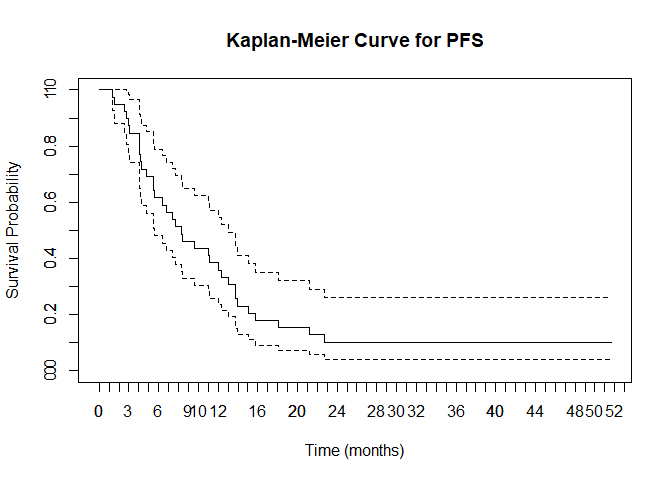
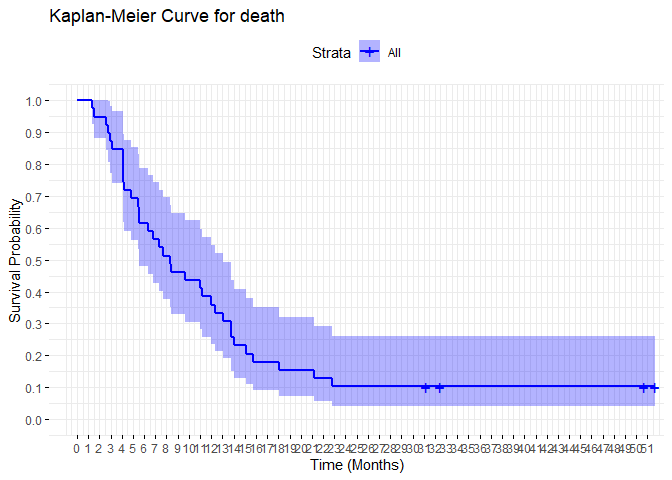
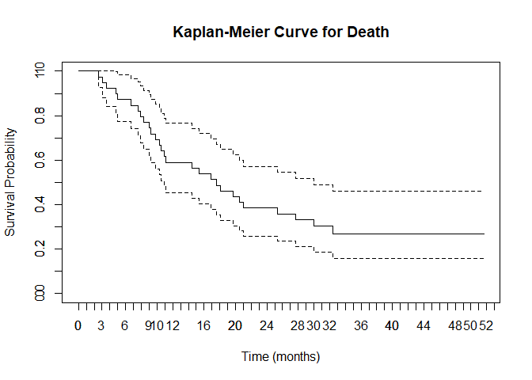
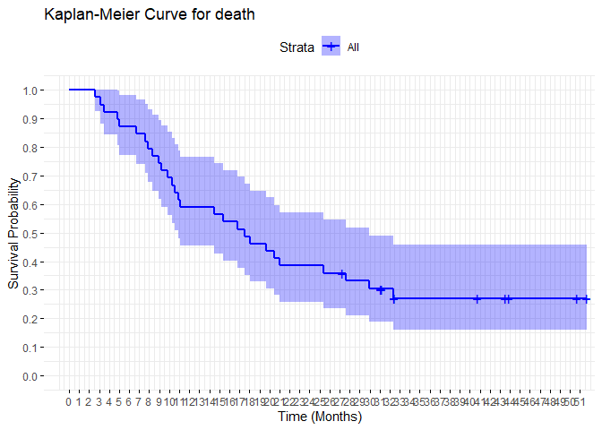
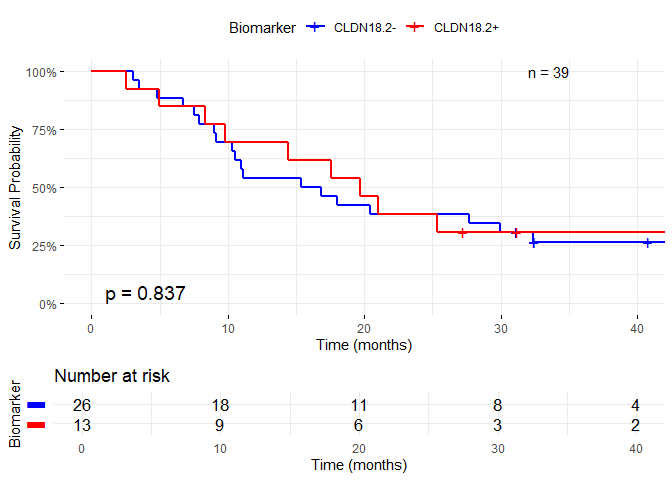
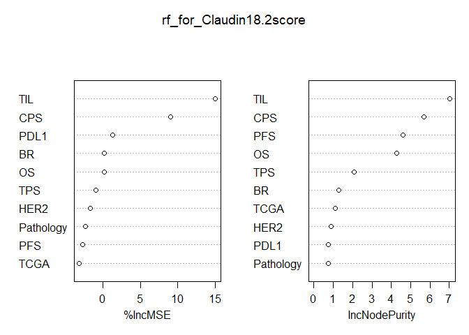
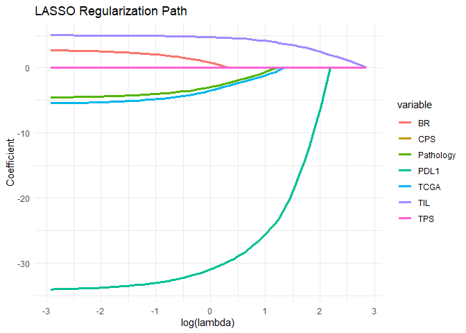
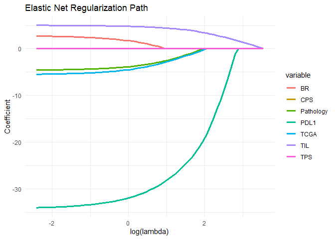
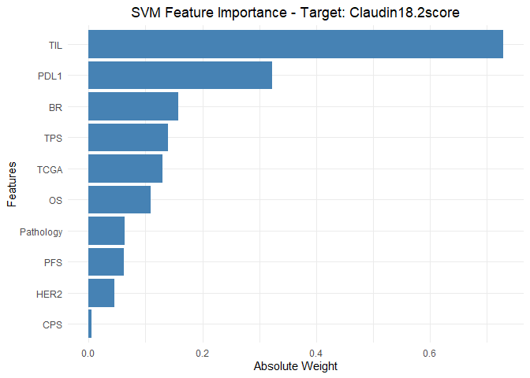

Plot KM curve & Feature Importance for CLDN18.2
================
Jongwu Kim
2025-07-19

This notebook firtly performs drawing KM curves for two groups:
CLDN18.2+ vs CLDN18.2- but it shows no difference of survival time
between them.

Nevertheless, plotting important features that affecting the CLDN18.2
score by 3 different ML models - RF, LASSO(+Elastic Net), SVM - is
followed after.

Based on the plots, it seems `TIL` and `PDL1` are the most important
features that affect the CLDN18.2 score.

The script lastly run on R 4.5.1

# 0. Initial Settings

``` r
# Mute warnings
options(warn = -1)
# Load the required libraries
library(ggplot2)
library(readxl)
library(skimr)
library(randomForest)
```

    ## randomForest 4.7-1.2

    ## Type rfNews() to see new features/changes/bug fixes.

    ## 
    ## Attaching package: 'randomForest'

    ## The following object is masked from 'package:ggplot2':
    ## 
    ##     margin

``` r
library(dplyr)
```

    ## 
    ## Attaching package: 'dplyr'

    ## The following object is masked from 'package:randomForest':
    ## 
    ##     combine

    ## The following objects are masked from 'package:stats':
    ## 
    ##     filter, lag

    ## The following objects are masked from 'package:base':
    ## 
    ##     intersect, setdiff, setequal, union

``` r
library(survival)
library(openxlsx)
# Load the survminer library for advanced survival plots
library(survminer)
```

    ## Loading required package: ggpubr

    ## 
    ## Attaching package: 'survminer'

    ## The following object is masked from 'package:survival':
    ## 
    ##     myeloma

``` r
library(glmnet)
```

    ## Loading required package: Matrix

    ## Loaded glmnet 4.1-9

``` r
# Enable warnings
options(warn = 1)
# Set seed for reproducibility
set.seed(42)
```

``` r
# Load the xlsx data
data <- read_excel('data/Updated0.xlsx', sheet = 'Sheet1')
```

    ## New names:
    ## • `` -> `...1`

``` r
# Delete the first column
data <- data[,-1]
# Replace the '-' in 'TCGA' column with missivg values
data$TCGA[data$TCGA == "-"] <- NA
# Remove the NA rows
data <- na.omit(data)
# Check the number of NA rows
nrow(data[is.na(data$TCGA), ])
```

    ## [1] 0

``` r
# Data overlook & preprocessing
# Check the structure of the data
str(data)
```

    ## tibble [39 × 14] (S3: tbl_df/tbl/data.frame)
    ##  $ Pathology       : chr [1:39] "SRC" "SRC" "Neuroendocrine differentiation" "SRC" ...
    ##  $ Claudin18.2score: num [1:39] 40 100 70 40 1 95 2 90 100 30 ...
    ##  $ Claudin18.2     : chr [1:39] "Negative" "Positive" "Negative" "Negative" ...
    ##  $ TIL             : num [1:39] 0 0 0 0 0 0 0 1 1 1 ...
    ##  $ TPS             : num [1:39] 0 0 0 0 0 0 0 0 0 0 ...
    ##  $ CPS             : num [1:39] 0 0 0 0 0 0 0 1 1 1 ...
    ##  $ PDL1            : chr [1:39] "Negative" "Negative" "Negative" "Negative" ...
    ##  $ HER2            : chr [1:39] "Negative" "Negative" "Negative" "Negative" ...
    ##  $ TCGA            : chr [1:39] "GS" "GS" "CIN" "GS" ...
    ##  $ BR              : chr [1:39] "PR" "SD" "SD" "SD" ...
    ##  $ PD              : num [1:39] 1 1 1 1 1 1 1 1 1 1 ...
    ##  $ PFS             : num [1:39] 206 645 255 167 84 168 125 129 336 169 ...
    ##  $ Death           : num [1:39] 1 1 1 1 1 1 1 1 1 1 ...
    ##  $ OS              : num [1:39] 321 772 314 333 94 639 279 152 599 273 ...
    ##  - attr(*, "na.action")= 'omit' Named int [1:2] 29 35
    ##   ..- attr(*, "names")= chr [1:2] "29" "35"

``` r
# Unique values in the 'BR' column
unique(data$BR)
```

    ## [1] "PR" "SD" "PD" "CR"

``` r
# CR    Complete Response   완전관해. 모든 병변이 사라짐. 최소 4주 이상 지속되어야 함.
# PR    Partial Response    부분관해. 종양 크기가 기준선 대비 최소 30% 이상 감소. 최소 4주 이상 지속되어야 함.
# SD    Stable Disease  안정병변. 종양 크기가 의미 있게 줄지도, 커지지도 않음. PR도 아니고 PD도 아님.
# PD    Progressive Disease 진행병변. 기준선 대비 종양 크기가 최소 20% 이상 증가하거나 새로운 병변이 나타남.
# Sort by the severence from the least to the worst,
# CR, PR, SD, PD
data <- data |>
  mutate(BR = case_when(
    BR == "CR" ~ 4,
    BR == "PR" ~ 3,
    BR == "SD" ~ 2,
    BR == "PD" ~ 1
  ))
# Check the unique values in the 'BR' column again
unique(data$BR)
```

    ## [1] 3 2 1 4

``` r
# Change the TCGA column to a numeric
# Sort by the severence from the least to the worst,
# MSI, EBV, CIN, GS
data <- data |>
  mutate(TCGA = case_when(
    TCGA == "MSI" ~ 4,
    TCGA == "EBV" ~ 3,
    TCGA == "CIN" ~ 2,
    TCGA == "GS" ~ 1
  ))
table(data$TCGA)
```

    ## 
    ##  1  2  3  4 
    ## 12 23  3  1

``` r
# Summarize the data
skim(data)
```

|                                                  |      |
|:-------------------------------------------------|:-----|
| Name                                             | data |
| Number of rows                                   | 39   |
| Number of columns                                | 14   |
| \_\_\_\_\_\_\_\_\_\_\_\_\_\_\_\_\_\_\_\_\_\_\_   |      |
| Column type frequency:                           |      |
| character                                        | 4    |
| numeric                                          | 10   |
| \_\_\_\_\_\_\_\_\_\_\_\_\_\_\_\_\_\_\_\_\_\_\_\_ |      |
| Group variables                                  | None |

Data summary

**Variable type: character**

| skim_variable | n_missing | complete_rate | min | max | empty | n_unique | whitespace |
|:--------------|----------:|--------------:|----:|----:|------:|---------:|-----------:|
| Pathology     |         0 |             1 |   3 |  30 |     0 |        4 |          0 |
| Claudin18.2   |         0 |             1 |   8 |   8 |     0 |        2 |          0 |
| PDL1          |         0 |             1 |   8 |   8 |     0 |        2 |          0 |
| HER2          |         0 |             1 |   8 |   8 |     0 |        2 |          0 |

**Variable type: numeric**

| skim_variable | n_missing | complete_rate | mean | sd | p0 | p25 | p50 | p75 | p100 | hist |
|:---|---:|---:|---:|---:|---:|---:|---:|---:|---:|:---|
| Claudin18.2score | 0 | 1 | 39.97 | 41.96 | 0 | 0.0 | 30 | 85.0 | 100 | ▇▂▁▂▅ |
| TIL | 0 | 1 | 3.33 | 4.23 | 0 | 1.0 | 2 | 4.5 | 20 | ▇▂▁▁▁ |
| TPS | 0 | 1 | 8.51 | 22.72 | 0 | 0.0 | 0 | 2.0 | 90 | ▇▁▁▁▁ |
| CPS | 0 | 1 | 11.85 | 24.43 | 0 | 1.0 | 2 | 6.5 | 95 | ▇▁▁▁▁ |
| TCGA | 0 | 1 | 1.82 | 0.68 | 1 | 1.0 | 2 | 2.0 | 4 | ▅▇▁▁▁ |
| BR | 0 | 1 | 2.51 | 0.76 | 1 | 2.0 | 3 | 3.0 | 4 | ▂▃▁▇▁ |
| PD | 0 | 1 | 0.90 | 0.31 | 0 | 1.0 | 1 | 1.0 | 1 | ▁▁▁▁▇ |
| PFS | 0 | 1 | 367.28 | 359.67 | 40 | 127.5 | 253 | 423.0 | 1572 | ▇▃▁▁▁ |
| Death | 0 | 1 | 0.72 | 0.46 | 0 | 0.0 | 1 | 1.0 | 1 | ▃▁▁▁▇ |
| OS | 0 | 1 | 630.74 | 433.28 | 78 | 276.0 | 534 | 948.5 | 1572 | ▇▃▃▂▂ |

``` r
# Check the table of Claudin18.2
table(data$Claudin18.2)
```

    ## 
    ## Negative Positive 
    ##       26       13

# 1. Survival Analysis

## 1.1 Survival object using PD & PFS

``` r
# Remove unnecessary columns - 'Claudin18.2', 'Death', 'OS'
data_pd <- data[, -which(names(data) == "Claudin18.2")]
data_pd <- data_pd[, -which(names(data_pd) == "Death")]
data_pd <- data_pd[, -which(names(data_pd) == "OS")]

# Change time from days to months
data_pd$PFS <- data_pd$PFS / 30.44 # Following the customary of 30.44 days in a month

# Create the Survival Object and fit the Kaplan-Meier model
km_fit_pd <- survfit(Surv(PFS, PD) ~ 1, data = data_pd)

# Print the summary of the Kaplan-Meier model
summary(km_fit_pd)
```

    ## Call: survfit(formula = Surv(PFS, PD) ~ 1, data = data_pd)
    ## 
    ##   time n.risk n.event survival std.err lower 95% CI upper 95% CI
    ##   1.31     39       1    0.974  0.0253       0.9260        1.000
    ##   1.51     38       1    0.949  0.0353       0.8820        1.000
    ##   2.56     37       1    0.923  0.0427       0.8431        1.000
    ##   2.76     36       1    0.897  0.0486       0.8071        0.998
    ##   2.96     35       1    0.872  0.0535       0.7729        0.983
    ##   3.09     34       1    0.846  0.0578       0.7402        0.967
    ##   4.07     33       2    0.795  0.0647       0.6777        0.932
    ##   4.11     31       1    0.769  0.0675       0.6477        0.914
    ##   4.14     30       1    0.744  0.0699       0.6184        0.894
    ##   4.24     29       1    0.718  0.0721       0.5897        0.874
    ##   4.80     28       1    0.692  0.0739       0.5616        0.853
    ##   5.49     27       1    0.667  0.0755       0.5340        0.832
    ##   5.52     26       1    0.641  0.0768       0.5068        0.811
    ##   5.55     25       1    0.615  0.0779       0.4802        0.789
    ##   6.37     24       1    0.590  0.0788       0.4539        0.766
    ##   6.77     23       1    0.564  0.0794       0.4281        0.743
    ##   7.36     22       1    0.538  0.0798       0.4027        0.720
    ##   7.65     21       1    0.513  0.0800       0.3777        0.696
    ##   8.31     20       1    0.487  0.0800       0.3531        0.672
    ##   8.38     19       1    0.462  0.0798       0.3288        0.648
    ##   9.63     18       1    0.436  0.0794       0.3050        0.623
    ##  11.04     17       1    0.410  0.0788       0.2816        0.598
    ##  11.14     16       1    0.385  0.0779       0.2586        0.572
    ##  12.02     15       1    0.359  0.0768       0.2360        0.546
    ##  12.32     14       1    0.333  0.0755       0.2139        0.520
    ##  13.04     13       1    0.308  0.0739       0.1922        0.493
    ##  13.80     12       2    0.256  0.0699       0.1503        0.438
    ##  13.99     10       1    0.231  0.0675       0.1301        0.409
    ##  15.08      9       1    0.205  0.0647       0.1106        0.380
    ##  15.77      8       1    0.179  0.0615       0.0918        0.351
    ##  18.04      7       1    0.154  0.0578       0.0737        0.321
    ##  21.19      6       1    0.128  0.0535       0.0566        0.291
    ##  22.77      5       1    0.103  0.0486       0.0405        0.260

``` r
# Transpose the summary for better readability
km_df <- data.frame(
  month = km_fit_pd$time,
  n.risk = km_fit_pd$n.risk,
  n.event = km_fit_pd$n.event,
  survival = km_fit_pd$surv,
  std.err = km_fit_pd$std.err,
  lower95 = km_fit_pd$lower,
  upper95 = km_fit_pd$upper
)
head(km_df)
```

    ##      month n.risk n.event  survival    std.err   lower95   upper95
    ## 1 1.314060     39       1 0.9743590 0.02597622 0.9259936 1.0000000
    ## 2 1.511170     38       1 0.9487179 0.03722904 0.8819576 1.0000000
    ## 3 2.562418     37       1 0.9230769 0.04622502 0.8431233 1.0000000
    ## 4 2.759527     36       1 0.8974359 0.05413320 0.8070960 0.9978878
    ## 5 2.956636     35       1 0.8717949 0.06140634 0.7729388 0.9832942
    ## 6 3.088042     34       1 0.8461538 0.06827887 0.7401679 0.9673161

``` r
# Plot the Kaplan-Meier curve
plot(km_fit_pd, xlab = "Time (months)", ylab = "Survival Probability", main = "Kaplan-Meier Curve for PFS")
axis(side = 1, at = seq(0, 60, by = 1), labels = seq(0, 60, by = 1))
axis(side = 2, at = seq(0, 1, by = 0.1), labels = seq(0, 1, by = 0.1))
```

<!-- -->

``` r
# Plot the Kaplan-Meier curve using ggsurvplot
# ggsurvplot의 결과를 객체로 저장
plot_obj <- ggsurvplot(km_fit_pd,
                       data = data_pd,
                       title = "Kaplan-Meier Curve for death",
                       xlab = "Time (Months)",
                       ylab = "Survival Probability",
                       palette = "blue",
                       ggtheme = theme_minimal())

# x축과 y축 눈금 조정은 $plot에 추가
plot_obj$plot +
  scale_x_continuous(breaks = seq(0, max(data_pd$PFS, na.rm = TRUE), by = 1)) +
  scale_y_continuous(breaks = seq(0, 1, by = 0.1))
```

    ## Scale for x is already present.
    ## Adding another scale for x, which will replace the existing scale.
    ## Scale for y is already present.
    ## Adding another scale for y, which will replace the existing scale.

<!-- -->
\## 1.2 Survival object using OS & Death

``` r
# Seperation of Claudin18.2 is required
# Remove unnecessary columns - 'PD', 'PFS'
data_death <- data[, -which(names(data) == "Claudin18.2")]
data_death <- data_death[, -which(names(data_death) == "PD")]
data_death <- data_death[, -which(names(data_death) == "PFS")]

# Change time from days to months
data_death$OS <- data_death$OS / 30.44 # Following the customary of 30.44 days in a month

# Create the Survival Object and fit the Kaplan-Meier model
km_fit_death <- survfit(Surv(OS, Death) ~ 1, data = data_death)

# Print the summary of the Kaplan-Meier model
summary(km_fit_death)
```

    ## Call: survfit(formula = Surv(OS, Death) ~ 1, data = data_death)
    ## 
    ##   time n.risk n.event survival std.err lower 95% CI upper 95% CI
    ##   2.56     39       1    0.974  0.0253        0.926        1.000
    ##   3.09     38       1    0.949  0.0353        0.882        1.000
    ##   3.52     37       1    0.923  0.0427        0.843        1.000
    ##   4.80     36       1    0.897  0.0486        0.807        0.998
    ##   4.99     35       1    0.872  0.0535        0.773        0.983
    ##   6.73     34       1    0.846  0.0578        0.740        0.967
    ##   7.56     33       1    0.821  0.0615        0.708        0.950
    ##   7.88     32       1    0.795  0.0647        0.678        0.932
    ##   8.34     31       1    0.769  0.0675        0.648        0.914
    ##   8.97     30       1    0.744  0.0699        0.618        0.894
    ##   9.17     29       1    0.718  0.0721        0.590        0.874
    ##   9.82     28       1    0.692  0.0739        0.562        0.853
    ##  10.32     27       1    0.667  0.0755        0.534        0.832
    ##  10.55     26       1    0.641  0.0768        0.507        0.811
    ##  10.94     25       1    0.615  0.0779        0.480        0.789
    ##  11.10     24       1    0.590  0.0788        0.454        0.766
    ##  14.45     23       1    0.564  0.0794        0.428        0.743
    ##  15.34     22       1    0.538  0.0798        0.403        0.720
    ##  16.85     21       1    0.513  0.0800        0.378        0.696
    ##  17.54     20       1    0.487  0.0800        0.353        0.672
    ##  18.04     19       1    0.462  0.0798        0.329        0.648
    ##  19.68     18       1    0.436  0.0794        0.305        0.623
    ##  20.47     17       1    0.410  0.0788        0.282        0.598
    ##  20.99     16       1    0.385  0.0779        0.259        0.572
    ##  25.36     15       1    0.359  0.0768        0.236        0.546
    ##  27.66     13       1    0.331  0.0757        0.212        0.519
    ##  29.99     12       1    0.304  0.0743        0.188        0.490
    ##  32.39      9       1    0.270  0.0733        0.159        0.460

``` r
# Transpose the summary for better readability
km_df_death <- data.frame(
  month = km_fit_death$time,
  n.risk = km_fit_death$n.risk,
  n.event = km_fit_death$n.event,
  survival = km_fit_death$surv,
  std.err = km_fit_death$std.err,
  lower95 = km_fit_death$lower,
  upper95 = km_fit_death$upper
)
head(km_df_death)
```

    ##      month n.risk n.event  survival    std.err   lower95   upper95
    ## 1 2.562418     39       1 0.9743590 0.02597622 0.9259936 1.0000000
    ## 2 3.088042     38       1 0.9487179 0.03722904 0.8819576 1.0000000
    ## 3 3.515112     37       1 0.9230769 0.04622502 0.8431233 1.0000000
    ## 4 4.796321     36       1 0.8974359 0.05413320 0.8070960 0.9978878
    ## 5 4.993430     35       1 0.8717949 0.06140634 0.7729388 0.9832942
    ## 6 6.734560     34       1 0.8461538 0.06827887 0.7401679 0.9673161

``` r
# Plot the Kaplan-Meier curve
plot(km_fit_death, xlab = "Time (months)", ylab = "Survival Probability", main = "Kaplan-Meier Curve for Death")
axis(side = 1, at = seq(0, 60, by = 1), labels = seq(0, 60, by = 1))
axis(side = 2, at = seq(0, 1, by = 0.1), labels = seq(0, 1, by = 0.1))
```

<!-- -->

``` r
# Plot the Kaplan-Meier curve using ggsurvplot
# ggsurvplot의 결과를 객체로 저장
plot_obj <- ggsurvplot(km_fit_death,
                       data = data_death,
                       title = "Kaplan-Meier Curve for death",
                       xlab = "Time (Months)",
                       ylab = "Survival Probability",
                       palette = "blue",
                       ggtheme = theme_minimal())

# x축과 y축 눈금 조정은 $plot에 추가
plot_obj$plot +
  scale_x_continuous(breaks = seq(0, max(data_death$OS, na.rm = TRUE), by = 1)) +
  scale_y_continuous(breaks = seq(0, 1, by = 0.1))
```

    ## Scale for x is already present.
    ## Adding another scale for x, which will replace the existing scale.
    ## Scale for y is already present.
    ## Adding another scale for y, which will replace the existing scale.

<!-- -->
\## 1.3 Survival object using OS & Death with Claudin18.2

``` r
# drop the 'TCGA' column
# data <- data[, -which(names(data) == "TCGA")]

# Change time from days to months
data$OS <- data$OS / 30.44  # 30.44일 = 1개월

# Factorize Claudin18.2
data$Claudin18.2 <- factor(data$Claudin18.2, levels = c("Negative", "Positive"))

# Kaplan-Meier
km_fit_group <- survfit(Surv(OS, Death) ~ Claudin18.2, data = data)

# Calculate the log-rank test and p-value
logrank_test <- survdiff(Surv(OS, Death) ~ Claudin18.2, data = data)
pval <- 1 - pchisq(logrank_test$chisq, df = length(logrank_test$n) - 1)
pval_text <- paste0("p = ", format.pval(pval, digits = 3, eps = .001))

# Total number of samples
total_n <- nrow(data)
n_text <- paste0("n = ", total_n)
```

``` r
# Plotting the Kaplan-Meier curve
plot_obj <- ggsurvplot(
  km_fit_group,
  data = data,
  xlab = "Time (months)",
  ylab = "Survival Probability",
  title = NULL,
  palette = c("blue", "red"),
  conf.int = FALSE,
  pval = pval_text,
  pval.coord = c(1, 0.05),  # 좌측 하단에 p-value
  legend.title = "Biomarker",
  legend.labs = c("CLDN18.2-", "CLDN18.2+"),
  risk.table = TRUE,
  risk.table.title = NULL,
  risk.table.y.text = FALSE,
  break.time.by = 10,
  xlim = c(0, 40),
  surv.scale = "percent",
  ggtheme = theme_minimal()
)

# Add the total number of samples to the plot
plot_obj$plot <- plot_obj$plot +
  annotate("text", x = 35, y = 1.0, label = n_text, hjust = 1, size = 4) +
  scale_x_continuous(breaks = seq(0, 40, by = 10)) +
  scale_y_continuous(breaks = seq(0, 1, by = 0.25), labels = scales::percent_format(accuracy = 1))
```

    ## Scale for x is already present.
    ## Adding another scale for x, which will replace the existing scale.
    ## Scale for y is already present.
    ## Adding another scale for y, which will replace the existing scale.

``` r
plot_obj
```

<!-- -->
\# 2. Random Forest

``` r
# Remove the 'Death' and 'PD' column
# Those columns are for survival analysis
# and are not needed for the classification task
# Remove the 'Death' and 'PD' column
# Those columns are for survival analysis
# and are not needed for the classification task

# Drop the binary categorical variables 'PD' and 'death'
data_rf <- data[, -which(names(data) == "Death")]
data_rf <- data_rf[, -which(names(data_rf) == "PD")]
# Drop the survival-time-related columns
# data_rf <- data_rf[, -which(names(data_rf) == "OS")]
# data_rf <- data_rf[, -which(names(data_rf) == "PFS")]

data_rf <- data_rf |> mutate(Pathology = ifelse(Pathology == "ADC", 1,
ifelse(Pathology == "SRC" | Pathology == "Poorly cohesive carcinoma", 0, NA)))
# Remove the NA rows from data_logit
data_rf <- na.omit(data_rf)

# Remove the 'Claudin18.2' column
# since it's derived from the 'Claudin18.2score'
data_rf <- data_rf[, -which(names(data) == "Claudin18.2")]
# Standardize the numeric variables
data_rf <- data_rf |>
  mutate(across(where(is.numeric), scale))

skim(data_rf)
```

|                                                  |         |
|:-------------------------------------------------|:--------|
| Name                                             | data_rf |
| Number of rows                                   | 37      |
| Number of columns                                | 11      |
| \_\_\_\_\_\_\_\_\_\_\_\_\_\_\_\_\_\_\_\_\_\_\_   |         |
| Column type frequency:                           |         |
| character                                        | 2       |
| numeric                                          | 9       |
| \_\_\_\_\_\_\_\_\_\_\_\_\_\_\_\_\_\_\_\_\_\_\_\_ |         |
| Group variables                                  | None    |

Data summary

**Variable type: character**

| skim_variable | n_missing | complete_rate | min | max | empty | n_unique | whitespace |
|:--------------|----------:|--------------:|----:|----:|------:|---------:|-----------:|
| PDL1          |         0 |             1 |   8 |   8 |     0 |        2 |          0 |
| HER2          |         0 |             1 |   8 |   8 |     0 |        2 |          0 |

**Variable type: numeric**

| skim_variable | n_missing | complete_rate | mean | sd | p0 | p25 | p50 | p75 | p100 | hist |
|:---|---:|---:|---:|---:|---:|---:|---:|---:|---:|:---|
| Pathology | 0 | 1 | 0 | 1 | -1.26 | -1.26 | 0.77 | 0.77 | 0.77 | ▅▁▁▁▇ |
| Claudin18.2score | 0 | 1 | 0 | 1 | -0.93 | -0.93 | -0.23 | 1.18 | 1.41 | ▇▂▁▂▅ |
| TIL | 0 | 1 | 0 | 1 | -0.80 | -0.57 | -0.34 | 0.36 | 3.85 | ▇▂▁▁▁ |
| TPS | 0 | 1 | 0 | 1 | -0.39 | -0.39 | -0.39 | -0.26 | 3.49 | ▇▁▁▁▁ |
| CPS | 0 | 1 | 0 | 1 | -0.50 | -0.46 | -0.42 | -0.18 | 3.31 | ▇▁▁▁▁ |
| TCGA | 0 | 1 | 0 | 1 | -1.16 | -1.16 | 0.27 | 0.27 | 3.12 | ▅▇▁▁▁ |
| BR | 0 | 1 | 0 | 1 | -1.97 | -0.67 | 0.63 | 0.63 | 1.94 | ▂▃▁▇▁ |
| PFS | 0 | 1 | 0 | 1 | -0.88 | -0.65 | -0.36 | 0.15 | 3.28 | ▇▃▁▁▁ |
| OS | 0 | 1 | 0 | 1 | -1.28 | -0.83 | -0.24 | 0.70 | 2.11 | ▇▃▃▂▂ |

``` r
# Ensure the target column is a factor
# data_rf$Claudin18.2 <- as.factor(data_rf$Claudin18.2)
# Fit a Random Forest model
rf_for_Claudin18.2score <- randomForest(Claudin18.2score ~ ., data = data_rf, importance = TRUE)
```

``` r
# Display variable importance
importance(rf_for_Claudin18.2score)
```

    ##              %IncMSE IncNodePurity
    ## Pathology -2.3339039     0.7289734
    ## TIL       15.0727231     7.0472501
    ## TPS       -0.9166840     2.0753302
    ## CPS        9.0595829     5.7039297
    ## PDL1       1.2758597     0.7500449
    ## HER2      -1.6782719     0.8983461
    ## TCGA      -3.1464162     1.1055437
    ## BR         0.1556153     1.2681490
    ## PFS       -2.7677573     4.5986337
    ## OS         0.1428147     4.2740674

``` r
varImpPlot(rf_for_Claudin18.2score)
```

<!-- -->

``` r
# Sort the importance by %IncMSE
importance_sorted_incmse <- randomForest::importance(rf_for_Claudin18.2score)[order(-importance(rf_for_Claudin18.2score)[, "%IncMSE"]), ]

# Sort the importance by IncNodePurity
importance_sorted_mdg_incnodepurity <- importance(rf_for_Claudin18.2score)[order(-importance(rf_for_Claudin18.2score)[, "IncNodePurity"]), ]

# Display the sorted importance with both MDA and MDG
print(importance_sorted_incmse)
```

    ##              %IncMSE IncNodePurity
    ## TIL       15.0727231     7.0472501
    ## CPS        9.0595829     5.7039297
    ## PDL1       1.2758597     0.7500449
    ## BR         0.1556153     1.2681490
    ## OS         0.1428147     4.2740674
    ## TPS       -0.9166840     2.0753302
    ## HER2      -1.6782719     0.8983461
    ## Pathology -2.3339039     0.7289734
    ## PFS       -2.7677573     4.5986337
    ## TCGA      -3.1464162     1.1055437

``` r
print(importance_sorted_mdg_incnodepurity)
```

    ##              %IncMSE IncNodePurity
    ## TIL       15.0727231     7.0472501
    ## CPS        9.0595829     5.7039297
    ## PFS       -2.7677573     4.5986337
    ## OS         0.1428147     4.2740674
    ## TPS       -0.9166840     2.0753302
    ## BR         0.1556153     1.2681490
    ## TCGA      -3.1464162     1.1055437
    ## HER2      -1.6782719     0.8983461
    ## PDL1       1.2758597     0.7500449
    ## Pathology -2.3339039     0.7289734

# 3. LASSO Panalized Logistic Regression

``` r
# 4. LASSO Panalized Logistic Regression
# Remove the columns for survival analysis

# Drop the binary categorical variables 'PD' and 'death'
data_logit <- data[, -which(names(data) == "Death")]
data_logit <- data_logit[, -which(names(data_logit) == "PD")]
# Drop the survival-time-related columns
data_logit <- data_logit[, -which(names(data_logit) == "OS")]
data_logit <- data_logit[, -which(names(data_logit) == "PFS")]

# Convert Pathology to ADC = 1, SRC = 0
data_logit <- data_logit |>
  mutate(Pathology = ifelse(Pathology == "ADC", 1,
                            ifelse(Pathology == "SRC" | Pathology == "Poorly cohesive carcinoma", 0, NA)))

# Remove the NA rows from data_logit
sum(is.na(data_logit$Pathology)) # Check the number of NA rows
```

    ## [1] 2

``` r
data_logit <- na.omit(data_logit)

# Drop the 'Claudin18.2' column
# since it's derived from the 'Claudin18.2score'
data_logit <- data_logit[, -which(names(data) == "Claudin18.2")]

# Apply one-hot encoding to the rest binary categorical columns
# 'HER2', 'PDL1', 'Claudin18.2'
data_logit <- data_logit |>
  mutate(HER2 = ifelse(HER2 == "Positive", 1, 0),
         PDL1 = ifelse(PDL1 == "Positive", 1, 0))

# Remove the NA rows from data_logit
data_logit <- na.omit(data_logit)

# Skim the data again
skim(data_logit)
```

|                                                  |            |
|:-------------------------------------------------|:-----------|
| Name                                             | data_logit |
| Number of rows                                   | 37         |
| Number of columns                                | 9          |
| \_\_\_\_\_\_\_\_\_\_\_\_\_\_\_\_\_\_\_\_\_\_\_   |            |
| Column type frequency:                           |            |
| numeric                                          | 9          |
| \_\_\_\_\_\_\_\_\_\_\_\_\_\_\_\_\_\_\_\_\_\_\_\_ |            |
| Group variables                                  | None       |

Data summary

**Variable type: numeric**

| skim_variable    | n_missing | complete_rate |  mean |    sd |  p0 | p25 | p50 | p75 | p100 | hist  |
|:-----------------|----------:|--------------:|------:|------:|----:|----:|----:|----:|-----:|:------|
| Pathology        |         0 |             1 |  0.62 |  0.49 |   0 |   0 |   1 |   1 |    1 | ▅▁▁▁▇ |
| Claudin18.2score |         0 |             1 | 39.70 | 42.69 |   0 |   0 |  30 |  90 |  100 | ▇▂▁▂▅ |
| TIL              |         0 |             1 |  3.46 |  4.30 |   0 |   1 |   2 |   5 |   20 | ▇▂▁▁▁ |
| TPS              |         0 |             1 |  8.97 | 23.25 |   0 |   0 |   0 |   3 |   90 | ▇▁▁▁▁ |
| CPS              |         0 |             1 | 12.43 | 24.96 |   0 |   1 |   2 |   8 |   95 | ▇▁▁▁▁ |
| PDL1             |         0 |             1 |  0.86 |  0.35 |   0 |   1 |   1 |   1 |    1 | ▁▁▁▁▇ |
| HER2             |         0 |             1 |  0.19 |  0.40 |   0 |   0 |   0 |   0 |    1 | ▇▁▁▁▂ |
| TCGA             |         0 |             1 |  1.81 |  0.70 |   1 |   1 |   2 |   2 |    4 | ▅▇▁▁▁ |
| BR               |         0 |             1 |  2.51 |  0.77 |   1 |   2 |   3 |   3 |    4 | ▂▃▁▇▁ |

``` r
# Check binary features in data_logit
binary_features <- sapply(data_logit, function(x) {
  if(is.numeric(x)) {
    # Check if column contains only 0s and 1s
    all(x %in% c(0, 1))
  } else {
    FALSE
  }
})

# Get names of binary features
binary_feature_names <- names(data_logit)[binary_features]
cat("Binary features in data_logit:\n")
```

    ## Binary features in data_logit:

``` r
print(binary_feature_names)
```

    ## [1] "Pathology" "PDL1"      "HER2"

``` r
# Show distribution of each binary feature
for(feature in binary_feature_names) {
  cat("\nDistribution of", feature, ":\n")
  print(table(data_logit[[feature]]))
  cat("Proportion:", round(prop.table(table(data_logit[[feature]])) * 100, 2), "%\n")
}
```

    ## 
    ## Distribution of Pathology :
    ## 
    ##  0  1 
    ## 14 23 
    ## Proportion: 37.84 62.16 %
    ## 
    ## Distribution of PDL1 :
    ## 
    ##  0  1 
    ##  5 32 
    ## Proportion: 13.51 86.49 %
    ## 
    ## Distribution of HER2 :
    ## 
    ##  0  1 
    ## 30  7 
    ## Proportion: 81.08 18.92 %

``` r
# Find binary features with less than ~ occurrences of 1s
low_frequency_features <- sapply(binary_feature_names, function(feature) {
  sum(data_logit[[feature]] == 1) < 10  # Adjust the threshold as needed
})
low_frequency_features
```

    ## Pathology      PDL1      HER2 
    ##     FALSE     FALSE      TRUE

``` r
# Get names of features to remove
features_to_remove <- binary_feature_names[low_frequency_features]

# Check the occurance of 1s in each feature of features_to_remove
for(feature in features_to_remove) {
  cat(feature, ":\n")
  print(table(data_logit[[feature]]))
}
```

    ## HER2 :
    ## 
    ##  0  1 
    ## 30  7

``` r
# Remove these features from data_logit
if (length(features_to_remove) > 0) {
  data_logit <- data_logit[, !(names(data_logit) %in% features_to_remove)]
  cat("\nRemoved", length(features_to_remove), "features with low frequency.\n")
}
```

    ## 
    ## Removed 1 features with low frequency.

``` r
# Check updated dimensions
cat("\nUpdated data dimensions:", dim(data_logit)[1], "rows,", dim(data_logit)[2], "columns\n")
```

    ## 
    ## Updated data dimensions: 37 rows, 8 columns

## LASSO

``` r
colnames(data_logit)
```

    ## [1] "Pathology"        "Claudin18.2score" "TIL"              "TPS"             
    ## [5] "CPS"              "PDL1"             "TCGA"             "BR"

``` r
# Apply logistic regression with LASSO for Claudin18.2 prediction
# with glmnet
# Prepare predictor matrix and response vector
x <- as.matrix(data_logit[, !names(data_logit) %in% "Claudin18.2score"])
y <- as.numeric(data_logit$Claudin18.2score)
```

``` r
# alpha = 1은 LASSO, 0.5는 Elastic Net
fit <- glmnet(x, y, family = "gaussian", # gaussian means logistic regression on regression problem
              type.measure = "mse",
              standardize = TRUE, # standardize the data -> Can differ the coefficient's axis
              # standardize = FALSE,
              alpha = 1)  # alpha=1 means LASSO, 0.5 means Elastic Net

# 계수 추출 (glmnet predict를 이용)
beta_pred <- predict(fit, type = "coefficients")
lambda_seq <- fit$lambda

# 계수 tidy하게 변환
coef_list <- lapply(1:length(lambda_seq), function(i) {
  beta <- as.matrix(beta_pred[, i])  # i번째 lambda에 대한 계수
  df <- data.frame(variable = rownames(beta),
                   coefficient = as.numeric(beta),
                   lambda = lambda_seq[i])
  df
})

coef_long <- bind_rows(coef_list) |>
  filter(variable != "(Intercept)")  # 절편 제외

ggplot(coef_long, aes(x = log(lambda), y = coefficient, color = variable)) +
  geom_line(linewidth = 1.2) +  # Increased line thickness
  theme_minimal() +
  labs(
      # title = "Elastic Net Regularization Path",
      title = "LASSO Regularization Path",
       x = "log(lambda)",
       y = "Coefficient") +
  theme(legend.position = "right")
```

<!-- -->
\## Elastic Net

``` r
# alpha = 1은 LASSO, 0.5는 Elastic Net
fit <- glmnet(x, y, family = "gaussian", # gaussian means logistic regression on regression problem
              type.measure = "mse",
              standardize = TRUE, # standardize the data -> Can differ the coefficient's axis
              # standardize = FALSE,
              alpha = 0.5)  # alpha=1 means LASSO, 0.5 means Elastic Net

# 계수 추출 (glmnet predict를 이용)
beta_pred <- predict(fit, type = "coefficients")
lambda_seq <- fit$lambda

# 계수 tidy하게 변환
coef_list <- lapply(1:length(lambda_seq), function(i) {
  beta <- as.matrix(beta_pred[, i])  # i번째 lambda에 대한 계수
  df <- data.frame(variable = rownames(beta),
                   coefficient = as.numeric(beta),
                   lambda = lambda_seq[i])
  df
})

coef_long <- bind_rows(coef_list) |>
  filter(variable != "(Intercept)")  # 절편 제외

ggplot(coef_long, aes(x = log(lambda), y = coefficient, color = variable)) +
  geom_line(linewidth = 1.2) +  # Increased line thickness
  theme_minimal() +
  labs(
      title = "Elastic Net Regularization Path",
      # title = "LASSO Regularization Path",
       x = "log(lambda)",
       y = "Coefficient") +
  theme(legend.position = "right")
```

<!-- -->

# 4. SVM with Linear Kernel

``` r
# 5. SVM with Linear Kernel
# Drop the binary categorical variables 'PD' and 'death'
# Drop the binary categorical variables 'PD' and 'death'
data_svm <- data[, -which(names(data) == "Death")]
data_svm <- data_svm[, -which(names(data_svm) == "PD")]
# Drop the survival-time-related columns
# data_svm <- data_svm[, -which(names(data_svm) == "OS")]
# data_svm <- data_svm[, -which(names(data_svm) == "PFS")]

# Drop the 'Claudin18.2' column
# since it's derived from the 'Claudin18.2score'
data_svm <- data_svm[, -which(names(data) == "Claudin18.2")]

# Apply one-hot encoding to the rest binary categorical columns
# 'HER2', 'PDL1', 'Claudin18.2'
data_svm <- data_svm |>
  mutate(HER2 = ifelse(HER2 == "Positive", 1, 0),
         PDL1 = ifelse(PDL1 == "Positive", 1, 0),
         Pathology = ifelse(Pathology == "ADC", 1,
         ifelse(Pathology == 'SRC' | Pathology == "Poorly cohesive carcinoma", 0, NA))) # ADC = 1, SRC = 0

# Check the number of NA rows
cat("Number of NA rows in data_svm:", sum(is.na(data_svm)), "\n")
```

    ## Number of NA rows in data_svm: 2

``` r
# Remove the NA rows from data_svm
data_svm <- na.omit(data_svm)

# Apply one-hot encoding to the 'Pathology' column
# data_svm <- data_svm |>
#   mutate(across(Pathology, ~ as.factor(.))) |>
#   tidyr::pivot_wider(names_from = Pathology, values_from = Pathology, values_fill = 0, values_fn = ~ 1)
# Drop the original 'Pathology' column
# data_svm <- data_svm[, -which(names(data_svm) == "Pathology")]

# Skim the data again
skim(data_svm)
```

|                                                  |          |
|:-------------------------------------------------|:---------|
| Name                                             | data_svm |
| Number of rows                                   | 37       |
| Number of columns                                | 11       |
| \_\_\_\_\_\_\_\_\_\_\_\_\_\_\_\_\_\_\_\_\_\_\_   |          |
| Column type frequency:                           |          |
| numeric                                          | 11       |
| \_\_\_\_\_\_\_\_\_\_\_\_\_\_\_\_\_\_\_\_\_\_\_\_ |          |
| Group variables                                  | None     |

Data summary

**Variable type: numeric**

| skim_variable | n_missing | complete_rate | mean | sd | p0 | p25 | p50 | p75 | p100 | hist |
|:---|---:|---:|---:|---:|---:|---:|---:|---:|---:|:---|
| Pathology | 0 | 1 | 0.62 | 0.49 | 0.00 | 0.00 | 1.00 | 1.00 | 1.00 | ▅▁▁▁▇ |
| Claudin18.2score | 0 | 1 | 39.70 | 42.69 | 0.00 | 0.00 | 30.00 | 90.00 | 100.00 | ▇▂▁▂▅ |
| TIL | 0 | 1 | 3.46 | 4.30 | 0.00 | 1.00 | 2.00 | 5.00 | 20.00 | ▇▂▁▁▁ |
| TPS | 0 | 1 | 8.97 | 23.25 | 0.00 | 0.00 | 0.00 | 3.00 | 90.00 | ▇▁▁▁▁ |
| CPS | 0 | 1 | 12.43 | 24.96 | 0.00 | 1.00 | 2.00 | 8.00 | 95.00 | ▇▁▁▁▁ |
| PDL1 | 0 | 1 | 0.86 | 0.35 | 0.00 | 1.00 | 1.00 | 1.00 | 1.00 | ▁▁▁▁▇ |
| HER2 | 0 | 1 | 0.19 | 0.40 | 0.00 | 0.00 | 0.00 | 0.00 | 1.00 | ▇▁▁▁▂ |
| TCGA | 0 | 1 | 1.81 | 0.70 | 1.00 | 1.00 | 2.00 | 2.00 | 4.00 | ▅▇▁▁▁ |
| BR | 0 | 1 | 2.51 | 0.77 | 1.00 | 2.00 | 3.00 | 3.00 | 4.00 | ▂▃▁▇▁ |
| PFS | 0 | 1 | 365.41 | 367.81 | 40.00 | 126.00 | 233.00 | 420.00 | 1572.00 | ▇▃▁▁▁ |
| OS | 0 | 1 | 21.07 | 14.51 | 2.56 | 8.97 | 17.54 | 31.18 | 51.64 | ▇▃▃▂▂ |

``` r
# Load the e1071 package for SVM
library(e1071)

# Scale(Standardization) the numeric features for better SVM performance -> already Built-in in SVM
data_svm_scaled <- data_svm
numeric_cols <- sapply(data_svm, is.numeric)
data_svm_scaled[, numeric_cols] <- scale(data_svm[, numeric_cols])

# Train SVM with linear kernel
svm_model <- svm(Claudin18.2score ~ ., 
         data = data_svm,
         kernel = "linear",
         cost = 1,
         scale = TRUE) # Standardization

# Print SVM model summary
summary(svm_model)
```

    ## 
    ## Call:
    ## svm(formula = Claudin18.2score ~ ., data = data_svm, kernel = "linear", 
    ##     cost = 1, scale = TRUE)
    ## 
    ## 
    ## Parameters:
    ##    SVM-Type:  eps-regression 
    ##  SVM-Kernel:  linear 
    ##        cost:  1 
    ##       gamma:  0.1 
    ##     epsilon:  0.1 
    ## 
    ## 
    ## Number of Support Vectors:  33

``` r
# Extract feature weights for linear kernel
w <- t(svm_model$coefs) %*% svm_model$SV
feature_importance <- abs(w)
feature_importance <- data.frame(
  Feature = colnames(data_svm_scaled)[colnames(data_svm_scaled) != "Claudin18.2score"],
  Importance = as.vector(feature_importance)
)

# Sort feature importance
feature_importance <- feature_importance[order(-feature_importance$Importance),]
```

``` r
# Plot feature importance
ggplot(feature_importance, aes(x = reorder(Feature, Importance), y = Importance)) +
  geom_bar(stat = "identity", fill = "steelblue") +
  coord_flip() +
  labs(title = "SVM Feature Importance - Target: Claudin18.2score",
     x = "Features",
     y = "Absolute Weight") +
  theme_minimal() +
  theme(plot.title = element_text(hjust = 0.5))
```

<!-- -->
