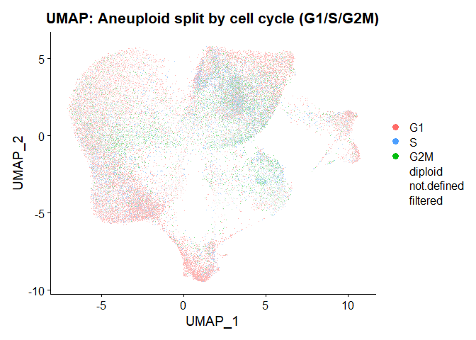
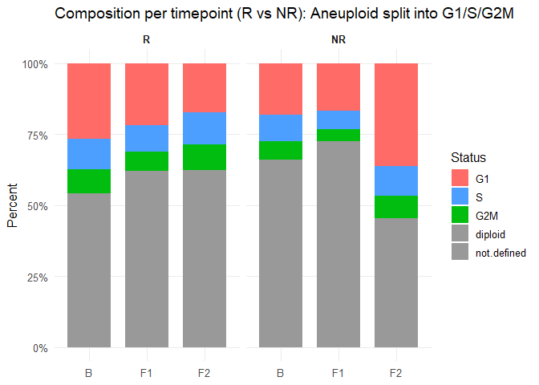

\[VT\]copyKAT
================
Jongwu Kim
2025-09-15

Simplified Stage:

1)  Use CopyKAT to predict aneuploid/diploid cells only from tumor cells

2)  Cell-cycle scoring only on aneuploid cells

# Prepare Data

``` r
library(Seurat)
```

    ## Loading required package: SeuratObject

    ## Loading required package: sp

    ## 
    ## Attaching package: 'SeuratObject'

    ## The following objects are masked from 'package:base':
    ## 
    ##     intersect, t

``` r
library(copykat)

# Use data for inferCNV
umi_count_matrix <- readRDS(file.path(INFERCNV_INPUT_DIR, "all_samples(tumor_only)_umi_count.rds"))
annotation <- read.table(file.path(INFERCNV_INPUT_DIR, "all_samples(tumor_only)_annotation.txt"), 
                         header = FALSE, sep = "\t", stringsAsFactors = FALSE)
```

``` r
table(sub('_.*', '', colnames(umi_count_matrix)))
```

    ## 
    ##  A09B A09F1  A10B A10F1 A10F2  A11B A11F1 A11F2  A12B A12F1 A12F2  A14B A14F1 
    ##   454   544  2856   417  1884  2614   369   431  7648  1141  1299  2344  1004 
    ##  A17B A17F1  A18B A18F1 A18F2  A19B A19F1 A19F2  A20B A20F2  A21B A21F1 A21F2 
    ##  1267   369   741   993  1064  1439   820  1089  2343  1004  3649  4535  4116 
    ##  A22B A22F1 A22F2  A23B A23F1 A23F2  A24B A24F1 A24F2  A25B  A26B A26F1 A26F2 
    ##  5015  2503  3577  3147  2200  1870  1111  3216  1136  1126  4316   577  1353 
    ##  A27B A27F1 A27F2  A28B A28F2  A29B A29F1 A29F2  A30B A30F1 A30F2  A32B A32F1 
    ##  1786  1449  2435  4820   421  2580  3803  3602  4910  3617  2960   534   148 
    ## A32F2  A33B A33F1 A33F2  A34B A34F1 A34F2 
    ##   396  2889  1400  1297  3608 12680  9006

``` r
umi_count_matrix[1:4, 1:4]  # Display the first 4 column names of the umi_count_matrices
```

    ## 4 x 4 sparse Matrix of class "dgCMatrix"
    ##                 A09B_AAACCTGTCTGTTTGT-1 A09B_AAAGATGAGCCGCCTA-1
    ## DDX11L2                               .                       .
    ## MIR1302-2HG                           .                       .
    ## FAM138A                               .                       .
    ## ENSG00000290826                       .                       .
    ##                 A09B_AAAGATGCATGTAAGA-1 A09B_AAAGATGGTAAGAGGA-1
    ## DDX11L2                               .                       .
    ## MIR1302-2HG                           .                       .
    ## FAM138A                               .                       .
    ## ENSG00000290826                       .                       .

``` r
annotation[1:5, ]  # Display the first 5 rows of the annotation data
```

    ##                        V1             V2
    ## 1 A09B_AAACCTGTCTGTTTGT-1 malignant_A09B
    ## 2 A09B_AAAGATGAGCCGCCTA-1 malignant_A09B
    ## 3 A09B_AAAGATGCATGTAAGA-1 malignant_A09B
    ## 4 A09B_AAAGATGGTAAGAGGA-1 malignant_A09B
    ## 5 A09B_AAAGCAAAGGACAGCT-1 malignant_A09B

``` r
table(sub('_.*', '', annotation$V1), sub('_.*', '', annotation$V2))
```

    ##        
    ##         malignant
    ##   A09B        454
    ##   A09F1       544
    ##   A10B       2856
    ##   A10F1       417
    ##   A10F2      1884
    ##   A11B       2614
    ##   A11F1       369
    ##   A11F2       431
    ##   A12B       7648
    ##   A12F1      1141
    ##   A12F2      1299
    ##   A14B       2344
    ##   A14F1      1004
    ##   A17B       1267
    ##   A17F1       369
    ##   A18B        741
    ##   A18F1       993
    ##   A18F2      1064
    ##   A19B       1439
    ##   A19F1       820
    ##   A19F2      1089
    ##   A20B       2343
    ##   A20F2      1004
    ##   A21B       3649
    ##   A21F1      4535
    ##   A21F2      4116
    ##   A22B       5015
    ##   A22F1      2503
    ##   A22F2      3577
    ##   A23B       3147
    ##   A23F1      2200
    ##   A23F2      1870
    ##   A24B       1111
    ##   A24F1      3216
    ##   A24F2      1136
    ##   A25B       1126
    ##   A26B       4316
    ##   A26F1       577
    ##   A26F2      1353
    ##   A27B       1786
    ##   A27F1      1449
    ##   A27F2      2435
    ##   A28B       4820
    ##   A28F2       421
    ##   A29B       2580
    ##   A29F1      3803
    ##   A29F2      3602
    ##   A30B       4910
    ##   A30F1      3617
    ##   A30F2      2960
    ##   A32B        534
    ##   A32F1       148
    ##   A32F2       396
    ##   A33B       2889
    ##   A33F1      1400
    ##   A33F2      1297
    ##   A34B       3608
    ##   A34F1     12680
    ##   A34F2      9006

``` r
table(grepl("^ENSG\\d", rownames(umi_count_matrix))) # TRUE=Ensembl IDs, FALSE=Symbols
```

    ## 
    ## FALSE  TRUE 
    ## 25644 12962

# Convert data to copykat format

ID type: “S” for gene symbols, “E” for Ensembl IDs ID type should be
consistent across all samples. If data contains a mix of gene symbols
and Ensembl IDs, regard all of them as ‘E’.

``` r
# --- Inputs expected ---
# umi_count_matrix : dgCMatrix (genes x cells), colnames like "A09B_AAACCT...-1"
# annotation       : data.frame with columns V1=cell_id, V2=label (e.g., "malignant_A09B", "macrophage")
suppressPackageStartupMessages({
  library(Matrix)
  library(AnnotationDbi)
  library(org.Hs.eg.db)  # For human; use org.Mm.eg.db for mouse
})

# Helper to extract sample ID prefix before the first underscore
get_sample_id <- function(x) sub("_.*", "", x)

# Split column indices by sample
split_by_sample <- function(counts) {
  sp <- get_sample_id(colnames(counts))
  split(seq_along(sp), sp)  # named list of integer indices per sample
}

# Build copyKAT inputs per sample:
#  - rawmat: counts (genes x cells) for that sample
#  - norm.cell.names: character vector of known/assumed normal cells (or NULL)
make_copykat_inputs <- function(counts, anno,
                                malignant_regex = "^malignant",
                                normal_label_regex = NULL) {
  stopifnot(all(c("V1", "V2") %in% colnames(anno)))
  idx_list <- split_by_sample(counts)

  res <- lapply(names(idx_list), function(sid) {
    cols   <- idx_list[[sid]]
    rawmat <- counts[, cols, drop = FALSE]
    cells  <- colnames(rawmat)

    # Align annotation to the cells present in this sample matrix
    a <- anno[anno$V1 %in% cells, , drop = FALSE]

    # Define malignant/normal based on labels
    is_malignant <- grepl(malignant_regex, a$V2, ignore.case = TRUE)

    if (!is.null(normal_label_regex)) {
      # Use an explicit regex for normal labels (e.g., "^macrophage$")
      is_normal <- grepl(normal_label_regex, a$V2, ignore.case = TRUE)
    } else {
      # Default: everything not matching malignant_regex is treated as "normal candidate"
      is_normal <- !is_malignant
    }

    norm.cells <- unique(a$V1[is_normal])
    if (length(norm.cells) == 0) norm.cells <- NULL  # optional hint only

    list(rawmat = rawmat, norm.cell.names = norm.cells)
  })

  names(res) <- names(idx_list)
  res
}

# Example: build inputs (default: non-malignant labels -> normal candidates)
copykat_inputs <- make_copykat_inputs(
  counts = umi_count_matrix,
  anno   = annotation,
  malignant_regex    = "^malignant",    # labels starting with "malignant"
  normal_label_regex = "^macrophage$"   # only "macrophage" as normal cells
)

# Quick sanity check per sample: number of cells and normals
sample_qc <- t(vapply(
  copykat_inputs,
  function(x) c(n_cells = ncol(x$rawmat),
                n_normals = if (is.null(x$norm.cell.names)) 0 else length(x$norm.cell.names)),
  FUN.VALUE = numeric(2)
))
print(sample_qc)
```

    ##       n_cells n_normals
    ## A09B      454         0
    ## A09F1     544         0
    ## A10B     2856         0
    ## A10F1     417         0
    ## A10F2    1884         0
    ## A11B     2614         0
    ## A11F1     369         0
    ## A11F2     431         0
    ## A12B     7648         0
    ## A12F1    1141         0
    ## A12F2    1299         0
    ## A14B     2344         0
    ## A14F1    1004         0
    ## A17B     1267         0
    ## A17F1     369         0
    ## A18B      741         0
    ## A18F1     993         0
    ## A18F2    1064         0
    ## A19B     1439         0
    ## A19F1     820         0
    ## A19F2    1089         0
    ## A20B     2343         0
    ## A20F2    1004         0
    ## A21B     3649         0
    ## A21F1    4535         0
    ## A21F2    4116         0
    ## A22B     5015         0
    ## A22F1    2503         0
    ## A22F2    3577         0
    ## A23B     3147         0
    ## A23F1    2200         0
    ## A23F2    1870         0
    ## A24B     1111         0
    ## A24F1    3216         0
    ## A24F2    1136         0
    ## A25B     1126         0
    ## A26B     4316         0
    ## A26F1     577         0
    ## A26F2    1353         0
    ## A27B     1786         0
    ## A27F1    1449         0
    ## A27F2    2435         0
    ## A28B     4820         0
    ## A28F2     421         0
    ## A29B     2580         0
    ## A29F1    3803         0
    ## A29F2    3602         0
    ## A30B     4910         0
    ## A30F1    3617         0
    ## A30F2    2960         0
    ## A32B      534         0
    ## A32F1     148         0
    ## A32F2     396         0
    ## A33B     2889         0
    ## A33F1    1400         0
    ## A33F2    1297         0
    ## A34B     3608         0
    ## A34F1   12680         0
    ## A34F2    9006         0

``` r
# Print rownames(sample_qc) without "" and seperate values by comma
cat(rownames(sample_qc), sep = ",")
```

    ## A09B,A09F1,A10B,A10F1,A10F2,A11B,A11F1,A11F2,A12B,A12F1,A12F2,A14B,A14F1,A17B,A17F1,A18B,A18F1,A18F2,A19B,A19F1,A19F2,A20B,A20F2,A21B,A21F1,A21F2,A22B,A22F1,A22F2,A23B,A23F1,A23F2,A24B,A24F1,A24F2,A25B,A26B,A26F1,A26F2,A27B,A27F1,A27F2,A28B,A28F2,A29B,A29F1,A29F2,A30B,A30F1,A30F2,A32B,A32F1,A32F2,A33B,A33F1,A33F2,A34B,A34F1,A34F2

# Decide ID type for copyKAT

If mixture of SYMBOL/ENSEMBL, convert all to ENSEMBL and set id.type=“E”

``` r
# Expect: umi_count_matrix (genes x cells, dgCMatrix or matrix)
suppressPackageStartupMessages({
  library(Matrix)
  library(AnnotationDbi)
  library(org.Hs.eg.db)  # For human; use org.Mm.eg.db for mouse
})

# 1) Detect ID type mixture
is_ensg <- grepl("^ENSG\\d", rownames(umi_count_matrix))
frac_ensg <- mean(is_ensg, na.rm = TRUE)
message(sprintf("Fraction of Ensembl-like rownames: %.3f", frac_ensg))
```

    ## Fraction of Ensembl-like rownames: 0.336

``` r
has_mix <- frac_ensg > 0 & frac_ensg < 1
if (!has_mix) {
  message("No mixture detected. Proceed with a single ID type.")
}
```

``` r
# 2) Normalize Ensembl IDs by removing version suffix (e.g., ENSG00000141510.16)
trim_ensembl_version <- function(x) sub("\\.\\d+$", "", x)

# 3) Convert everything to a single type (choose "ENSEMBL" here)
to_ensembl <- function(genes) {
  # genes: character vector of rownames (mixed SYMBOL/ENSEMBL)
  ensg <- ifelse(grepl("^ENSG\\d", genes), trim_ensembl_version(genes), NA_character_)
  
  # Map SYMBOL -> ENSEMBL
  need_map <- which(is.na(ensg))
  if (length(need_map) > 0) {
    m <- AnnotationDbi::select(org.Hs.eg.db,
                               keys = genes[need_map],
                               keytype = "SYMBOL",
                               columns = "ENSEMBL")
    # Keep one-to-one best guess: first non-NA mapping per SYMBOL
    m <- m[!is.na(m$ENSEMBL), ]
    m <- m[!duplicated(m$SYMBOL), ]
    ensg[need_map] <- m$ENSEMBL[match(genes[need_map], m$SYMBOL)]
  }
  ensg
}

# 4) Apply conversion
if (has_mix) {
  new_ids <- to_ensembl(rownames(umi_count_matrix))
  
  # Drop rows that failed to map
  keep <- !is.na(new_ids) & new_ids != ""
  dropped <- sum(!keep)
  if (dropped > 0) {
    message(sprintf("Dropping %d genes due to unmapped IDs.", dropped))
  }
  
  mat <- umi_count_matrix[keep, , drop = FALSE]
  new_ids <- new_ids[keep]
  
  # Resolve duplicate Ensembl IDs by keeping the row with highest total counts
  if (any(duplicated(new_ids))) {
    message("Resolving duplicated Ensembl IDs by keeping row with highest counts.")
    # Compute row sums (sparse-aware)
    rs <- Matrix::rowSums(mat)
    ord <- order(rs, decreasing = TRUE)
    mat <- mat[ord, , drop = FALSE]
    new_ids <- new_ids[ord]
    dedup_keep <- !duplicated(new_ids)
    mat <- mat[dedup_keep, , drop = FALSE]
    new_ids <- new_ids[dedup_keep]
  }
  
  rownames(mat) <- new_ids
  umi_count_matrix_dropped <- mat
}
```

    ## 'select()' returned 1:many mapping between keys and columns

    ## Dropping 2013 genes due to unmapped IDs.

    ## Resolving duplicated Ensembl IDs by keeping row with highest counts.

``` r
nrow(umi_count_matrix)
```

    ## [1] 38606

``` r
nrow(umi_count_matrix_dropped)
```

    ## [1] 36521

``` r
table(sub('_.*', '', colnames(umi_count_matrix_dropped)))
```

    ## 
    ##  A09B A09F1  A10B A10F1 A10F2  A11B A11F1 A11F2  A12B A12F1 A12F2  A14B A14F1 
    ##   454   544  2856   417  1884  2614   369   431  7648  1141  1299  2344  1004 
    ##  A17B A17F1  A18B A18F1 A18F2  A19B A19F1 A19F2  A20B A20F2  A21B A21F1 A21F2 
    ##  1267   369   741   993  1064  1439   820  1089  2343  1004  3649  4535  4116 
    ##  A22B A22F1 A22F2  A23B A23F1 A23F2  A24B A24F1 A24F2  A25B  A26B A26F1 A26F2 
    ##  5015  2503  3577  3147  2200  1870  1111  3216  1136  1126  4316   577  1353 
    ##  A27B A27F1 A27F2  A28B A28F2  A29B A29F1 A29F2  A30B A30F1 A30F2  A32B A32F1 
    ##  1786  1449  2435  4820   421  2580  3803  3602  4910  3617  2960   534   148 
    ## A32F2  A33B A33F1 A33F2  A34B A34F1 A34F2 
    ##   396  2889  1400  1297  3608 12680  9006

``` r
# 5) Decide id.type for copyKAT
id.type <- if (mean(grepl("^ENSG\\d", rownames(umi_count_matrix_dropped))) > 0.9) "E" else "S"
message(sprintf("copyKAT id.type will be set to '%s'.", id.type))
```

    ## copyKAT id.type will be set to 'E'.

``` r
umi_count_matrix_dropped[1:4, 1:4]  # Display the first 4 column names of the umi_count_matrices
```

    ## 4 x 4 sparse Matrix of class "dgCMatrix"
    ##                 A09B_AAACCTGTCTGTTTGT-1 A09B_AAAGATGAGCCGCCTA-1
    ## ENSG00000198804                       .                     237
    ## ENSG00000229859                       .                       .
    ## ENSG00000096088                       .                       .
    ## ENSG00000198712                       .                     166
    ##                 A09B_AAAGATGCATGTAAGA-1 A09B_AAAGATGGTAAGAGGA-1
    ## ENSG00000198804                     240                     164
    ## ENSG00000229859                       .                       .
    ## ENSG00000096088                       8                       .
    ## ENSG00000198712                      89                      44

# Make input again with consistent IDs

``` r
# build inputs (default: non-malignant labels -> normal candidates)
copykat_inputs <- make_copykat_inputs(
  counts = umi_count_matrix_dropped,
  anno   = annotation,
  malignant_regex    = "^malignant",    # labels starting with "malignant"
  normal_label_regex = "^macrophage$"   # only "macrophage" as normal cells
)

# Quick sanity check per sample: number of cells and normals
sample_qc <- t(vapply(
  copykat_inputs,
  function(x) c(n_cells = ncol(x$rawmat),
                n_normals = if (is.null(x$norm.cell.names)) 0 else length(x$norm.cell.names)),
  FUN.VALUE = numeric(2)
))
print(sample_qc)
```

    ##       n_cells n_normals
    ## A09B      454         0
    ## A09F1     544         0
    ## A10B     2856         0
    ## A10F1     417         0
    ## A10F2    1884         0
    ## A11B     2614         0
    ## A11F1     369         0
    ## A11F2     431         0
    ## A12B     7648         0
    ## A12F1    1141         0
    ## A12F2    1299         0
    ## A14B     2344         0
    ## A14F1    1004         0
    ## A17B     1267         0
    ## A17F1     369         0
    ## A18B      741         0
    ## A18F1     993         0
    ## A18F2    1064         0
    ## A19B     1439         0
    ## A19F1     820         0
    ## A19F2    1089         0
    ## A20B     2343         0
    ## A20F2    1004         0
    ## A21B     3649         0
    ## A21F1    4535         0
    ## A21F2    4116         0
    ## A22B     5015         0
    ## A22F1    2503         0
    ## A22F2    3577         0
    ## A23B     3147         0
    ## A23F1    2200         0
    ## A23F2    1870         0
    ## A24B     1111         0
    ## A24F1    3216         0
    ## A24F2    1136         0
    ## A25B     1126         0
    ## A26B     4316         0
    ## A26F1     577         0
    ## A26F2    1353         0
    ## A27B     1786         0
    ## A27F1    1449         0
    ## A27F2    2435         0
    ## A28B     4820         0
    ## A28F2     421         0
    ## A29B     2580         0
    ## A29F1    3803         0
    ## A29F2    3602         0
    ## A30B     4910         0
    ## A30F1    3617         0
    ## A30F2    2960         0
    ## A32B      534         0
    ## A32F1     148         0
    ## A32F2     396         0
    ## A33B     2889         0
    ## A33F1    1400         0
    ## A33F2    1297         0
    ## A34B     3608         0
    ## A34F1   12680         0
    ## A34F2    9006         0

`copykat_inputs` will be used for CopyKAT prediction in Docker session,
due to CopyKAT’s n.core restriction on Windows.

# UMAP coloring

This section requires three types of inputs: 1) Seurat object with UMAP
(Tumor_0710.rda from SEURAT_DIR) 2) Best response information per
patient (BR_info.xlsx from BR_INFO_DIR) 3) CopyKAT result per patient
(multiple rds files from COPYKAT_OUTPUT_DIR)

## Load seurat obj

Load a seurat object given by Dr. An.

``` r
# Load the seurat obj
load(file.path(SEURAT_DIR, "Tumor_0710.rda"))

library(ggplot2)
# plot original UMAP
DimPlot(Tumor, reduction='umap', pt.size = 0.5)
```

    ## Rasterizing points since number of points exceeds 100,000.
    ## To disable this behavior set `raster=FALSE`

    ## Warning: `aes_string()` was deprecated in ggplot2 3.0.0.
    ## ℹ Please use tidy evaluation idioms with `aes()`.
    ## ℹ See also `vignette("ggplot2-in-packages")` for more information.
    ## ℹ The deprecated feature was likely used in the Seurat package.
    ##   Please report the issue at <https://github.com/satijalab/seurat/issues>.
    ## This warning is displayed once every 8 hours.
    ## Call `lifecycle::last_lifecycle_warnings()` to see where this warning was
    ## generated.

<!-- -->

## Load BR_info

BR_info: Patients’ Response information to the treatment

R: Responder, NR: Non-responder

``` r
# Read BR_info.xlsx from BR_INFO_DIR
library(readxl)
br_info <- read_excel(file.path(BR_INFO_DIR, "BR_info.xlsx"))
head(br_info)
```

    ## # A tibble: 6 × 3
    ##   patient_ids BR    resp_or_not
    ##   <chr>       <chr> <chr>      
    ## 1 A09         PR    R          
    ## 2 A10         SD    NR         
    ## 3 A11         PR    R          
    ## 4 A12         SD    NR         
    ## 5 A13         PD    NR         
    ## 6 A14         PD    NR

``` r
# Add 'B' at the last of values in 'patient_ids' columns of br_info
br_info$Bsample_ids <- paste0(br_info$patient_ids, "B")
head(br_info$Bsample_ids)
```

    ## [1] "A09B" "A10B" "A11B" "A12B" "A13B" "A14B"

``` r
library(dplyr)
```

    ## 
    ## Attaching package: 'dplyr'

    ## The following object is masked from 'package:AnnotationDbi':
    ## 
    ##     select

    ## The following objects are masked from 'package:IRanges':
    ## 
    ##     collapse, desc, intersect, setdiff, slice, union

    ## The following objects are masked from 'package:S4Vectors':
    ## 
    ##     first, intersect, rename, setdiff, setequal, union

    ## The following object is masked from 'package:Biobase':
    ## 
    ##     combine

    ## The following objects are masked from 'package:BiocGenerics':
    ## 
    ##     combine, intersect, setdiff, setequal, union

    ## The following object is masked from 'package:generics':
    ## 
    ##     explain

    ## The following objects are masked from 'package:stats':
    ## 
    ##     filter, lag

    ## The following objects are masked from 'package:base':
    ## 
    ##     intersect, setdiff, setequal, union

``` r
br_info <- br_info |> mutate(
  responder = ifelse(resp_or_not == "R", 1, 0)
)
tail(br_info)
```

    ## # A tibble: 6 × 5
    ##   patient_ids BR    resp_or_not Bsample_ids responder
    ##   <chr>       <chr> <chr>       <chr>           <dbl>
    ## 1 A29         PR    R           A29B                1
    ## 2 A30         PR    R           A30B                1
    ## 3 A31         PD    NR          A31B                0
    ## 4 A32         PR    R           A32B                1
    ## 5 A33         PR    R           A33B                1
    ## 6 A34         SD    ATMmut.     A34B                0

## Load CopyKAT results

Load CopyKAT prediction results generated from the Docker session.

``` r
# List all copykat result files ends with 'rds'
rds_files <- list.files(COPYKAT_OUTPUT_DIR, pattern = "^copykat_.*\\.rds$", full.names = TRUE)
# List rds files in rds_files without COPYKAT_OUTPUT_DIR prefix
basename(rds_files)
```

    ##  [1] "copykat_A09B.rds"  "copykat_A09F1.rds" "copykat_A10B.rds" 
    ##  [4] "copykat_A10F1.rds" "copykat_A10F2.rds" "copykat_A11B.rds" 
    ##  [7] "copykat_A11F1.rds" "copykat_A11F2.rds" "copykat_A12B.rds" 
    ## [10] "copykat_A12F1.rds" "copykat_A12F2.rds" "copykat_A14B.rds" 
    ## [13] "copykat_A14F1.rds" "copykat_A17B.rds"  "copykat_A17F1.rds"
    ## [16] "copykat_A18B.rds"  "copykat_A18F1.rds" "copykat_A18F2.rds"
    ## [19] "copykat_A19B.rds"  "copykat_A19F1.rds" "copykat_A19F2.rds"
    ## [22] "copykat_A20B.rds"  "copykat_A20F2.rds" "copykat_A21B.rds" 
    ## [25] "copykat_A21F1.rds" "copykat_A21F2.rds" "copykat_A22B.rds" 
    ## [28] "copykat_A22F1.rds" "copykat_A22F2.rds" "copykat_A23B.rds" 
    ## [31] "copykat_A23F1.rds" "copykat_A23F2.rds" "copykat_A24B.rds" 
    ## [34] "copykat_A24F1.rds" "copykat_A24F2.rds" "copykat_A25B.rds" 
    ## [37] "copykat_A26B.rds"  "copykat_A26F1.rds" "copykat_A26F2.rds"
    ## [40] "copykat_A27B.rds"  "copykat_A27F1.rds" "copykat_A27F2.rds"
    ## [43] "copykat_A28B.rds"  "copykat_A28F2.rds" "copykat_A29B.rds" 
    ## [46] "copykat_A29F1.rds" "copykat_A29F2.rds" "copykat_A30B.rds" 
    ## [49] "copykat_A30F1.rds" "copykat_A30F2.rds" "copykat_A32B.rds" 
    ## [52] "copykat_A32F1.rds" "copykat_A32F2.rds" "copykat_A33B.rds" 
    ## [55] "copykat_A33F1.rds" "copykat_A33F2.rds" "copykat_A34B.rds" 
    ## [58] "copykat_A34F1.rds" "copykat_A34F2.rds"

``` r
length(rds_files)
```

    ## [1] 59

``` r
# --- Read & build lists correctly (use 'cell.names' column) ---
aneuploid_cells <- character()
diploid_cells <- character()
not_defined_cells <- character()

sample_pred_table <- do.call(rbind, lapply(rds_files, function(f) {
  bn  <- basename(f)
  sid <- sub("^copykat_", "", sub("\\.rds$", "", bn))
  ck  <- readRDS(f)

  # Ensure we have a data.frame with 'cell.names' and 'copykat.pred'
  pred <- as.data.frame(ck$prediction, stringsAsFactors = FALSE)

  # If 'cell.names' is missing, try to recover from rownames of 'ck$prediction'
  if (!"cell.names" %in% colnames(pred)) {
    pred$cell.names <- rownames(ck$prediction)
  }

  # Drop rows with invalid cell names (NA/empty)
  pred <- subset(pred, !is.na(cell.names) & nzchar(cell.names))

  # Append using the 'cell.names' column (NOT rownames!)
  aneuploid_cells     <<- c(aneuploid_cells,     pred$cell.names[pred$copykat.pred == "aneuploid"])
  diploid_cells       <<- c(diploid_cells,       pred$cell.names[pred$copykat.pred == "diploid"])
  not_defined_cells   <<- c(not_defined_cells,   pred$cell.names[pred$copykat.pred == "not.defined"])

  # Count table (only valid rows)
  tab <- table(pred$copykat.pred, useNA = "ifany")
  data.frame(
    sample_id   = sid,
    aneuploid   = ifelse("aneuploid"   %in% names(tab), tab["aneuploid"],   0),
    diploid     = ifelse("diploid"     %in% names(tab), tab["diploid"],     0),
    not.defined = ifelse("not.defined" %in% names(tab), tab["not.defined"], 0),
    stringsAsFactors = FALSE
  )
}))

sample_pred_table$total <- with(sample_pred_table, aneuploid + diploid + not.defined)

# Unify name style to match Tumor colnames if needed
std <- function(x) {
  x <- gsub("\\.", "-", x)  # adjust if your Tumor uses '_' instead of '-'
  x
}
aneuploid_cells   <- unique(std(aneuploid_cells))
diploid_cells     <- unique(std(diploid_cells))
not_defined_cells <- unique(std(not_defined_cells))

all_cells <- colnames(Tumor)

A_in <- intersect(aneuploid_cells,   all_cells)
D_in <- intersect(diploid_cells,     all_cells)
N_in <- intersect(not_defined_cells, all_cells)

# Lists must be disjoint
stopifnot(length(intersect(A_in, D_in)) == 0,
          length(intersect(A_in, N_in)) == 0,
          length(intersect(D_in, N_in)) == 0)

U_in <- union(A_in, union(D_in, N_in))
filtered_beforeCopyKAT_cells <- setdiff(all_cells, U_in)

cat("Counts | A:", length(A_in), " D:", length(D_in), " N:", length(N_in),
    " F(before):", length(filtered_beforeCopyKAT_cells), "\n")
```

    ## Counts | A: 55301  D: 86178  N: 443  F(before): 2145

``` r
cat("Sanity | A+D+N+F == Tumor colnames ? ",
    length(A_in) + length(D_in) + length(N_in) + length(filtered_beforeCopyKAT_cells),
    " vs ", length(all_cells), "\n")
```

    ## Sanity | A+D+N+F == Tumor colnames ?  144067  vs  144067

``` r
print(length(aneuploid_cells))
```

    ## [1] 55301

``` r
length(intersect(colnames(Tumor@assays$RNA@counts), aneuploid_cells))
```

    ## [1] 55301

``` r
table(Tumor@meta.data$orig.ident)
```

    ## 
    ##  A09B A09F1  A10B A10F1 A10F2  A11B A11F1 A11F2  A12B A12F1 A12F2  A14B A14F1 
    ##   454   544  2856   417  1884  2614   369   431  7648  1141  1299  2344  1004 
    ##  A16B  A17B A17F1  A18B A18F1 A18F2  A19B A19F1 A19F2  A20B A20F2  A21B A21F1 
    ##  2145  1267   369   741   993  1064  1439   820  1089  2343  1004  3649  4535 
    ## A21F2  A22B A22F1 A22F2  A23B A23F1 A23F2  A24B A24F1 A24F2  A25B  A26B A26F1 
    ##  4116  5015  2503  3577  3147  2200  1870  1111  3216  1136  1126  4316   577 
    ## A26F2  A27B A27F1 A27F2  A28B A28F2  A29B A29F1 A29F2  A30B A30F1 A30F2  A32B 
    ##  1353  1786  1449  2435  4820   421  2580  3803  3602  4910  3617  2960   534 
    ## A32F1 A32F2  A33B A33F1 A33F2  A34B A34F1 A34F2 
    ##   148   396  2889  1400  1297  3608 12680  9006

``` r
length(intersect(Tumor@meta.data$orig.ident, sub('_.*', '', aneuploid_cells)))
```

    ## [1] 59

``` r
Tumor@assays$RNA@counts[1:4, 1:4]  # Display the first 4 column names of the umi_count in Seurat obj
```

    ## 4 x 4 sparse Matrix of class "dgCMatrix"
    ##                 A09B_AAACCTGTCTGTTTGT-1 A09B_AAAGATGAGCCGCCTA-1
    ## DDX11L2                               .                       .
    ## MIR1302-2HG                           .                       .
    ## FAM138A                               .                       .
    ## ENSG00000290826                       .                       .
    ##                 A09B_AAAGATGCATGTAAGA-1 A09B_AAAGATGGTAAGAGGA-1
    ## DDX11L2                               .                       .
    ## MIR1302-2HG                           .                       .
    ## FAM138A                               .                       .
    ## ENSG00000290826                       .                       .

``` r
length(colnames(Tumor@assays$RNA@counts))
```

    ## [1] 144067

``` r
# Number of cells with aneuploid prediction in the seurat obj
length(intersect(colnames(Tumor@assays$RNA@counts), aneuploid_cells))
```

    ## [1] 55301

## Color UMAP

``` r
# Make sure no intersection between A_in, D_in, N_in
stopifnot(length(intersect(A_in, D_in)) == 0)
stopifnot(length(intersect(A_in, N_in)) == 0)
stopifnot(length(intersect(D_in, N_in)) == 0)

# Create 4-level status
status <- setNames(rep("filtered", length(all_cells)), all_cells)
status[A_in] <- "aneuploid"
status[D_in] <- "diploid"
status[N_in] <- "not.defined"

Tumor$copykat_status <- factor(status,
  levels = c("aneuploid","diploid","not.defined","filtered"))

# Color the umap
cols <- c(
  aneuploid   = "#ff6b67",  # orange/red
  diploid     = "#0072B2",  # blue
  not.defined = "#fac015",  # yellow
  filtered = "#999999" # grey
)

library(ggplot2)
DimPlot(Tumor, reduction = "umap", group.by = "copykat_status", 
        cols = cols, pt.size = 0.5) + ggtitle("CopyKAT prediction on UMAP")
```

    ## Rasterizing points since number of points exceeds 100,000.
    ## To disable this behavior set `raster=FALSE`

<!-- -->
\## Barplot

``` r
suppressPackageStartupMessages({
  library(dplyr); library(tidyr); library(stringr); library(ggplot2)
})

# ---------- 0) Inputs ----------
all_cells <- colnames(Tumor)

# ---------- 1) Status for every cell (default = filtered) ----------
status <- setNames(rep("filtered", length(all_cells)), all_cells)
status[intersect(all_cells, aneuploid_cells)]   <- "aneuploid"
status[intersect(all_cells, diploid_cells)]     <- "diploid"
status[intersect(all_cells, not_defined_cells)] <- "not.defined"
status <- factor(status, levels = c("aneuploid","diploid","not.defined","filtered"))

# ---------- 2) Parse patient & tp from barcode ----------
# Expected like "A09B_..." or "A34F2_..."
parse_df <- tibble(cell = all_cells, status = status[all_cells]) %>%
  mutate(
    prefix  = ifelse(str_detect(cell, "^[A]\\d{2}(B|F1|F2)_"),
                     str_extract(cell, "^[A]\\d{2}(?:B|F1|F2)"),
                     NA_character_),
    patient = ifelse(!is.na(prefix), str_extract(prefix, "^[A]\\d{2}"), NA_character_),
    tp      = ifelse(!is.na(prefix), str_remove(prefix, "^[A]\\d{2}"), NA_character_)
  )

# ---------- 3) Diagnostics: losses by stage ----------
n_total <- nrow(parse_df)
n_parse_ok <- sum(!is.na(parse_df$patient) & !is.na(parse_df$tp))
message("Total cells: ", n_total)
```

    ## Total cells: 144067

``` r
message("Parse OK (has patient & tp): ", n_parse_ok, " [lost: ", n_total - n_parse_ok, "]")
```

    ## Parse OK (has patient & tp): 144067 [lost: 0]

``` r
head(parse_df)
```

    ## # A tibble: 6 × 5
    ##   cell                    status    prefix patient tp   
    ##   <chr>                   <fct>     <chr>  <chr>   <chr>
    ## 1 A09B_AAACCTGTCTGTTTGT-1 diploid   A09B   A09     B    
    ## 2 A09B_AAAGATGAGCCGCCTA-1 aneuploid A09B   A09     B    
    ## 3 A09B_AAAGATGCATGTAAGA-1 aneuploid A09B   A09     B    
    ## 4 A09B_AAAGATGGTAAGAGGA-1 diploid   A09B   A09     B    
    ## 5 A09B_AAAGCAAAGGACAGCT-1 aneuploid A09B   A09     B    
    ## 6 A09B_AAAGCAAGTTCCATGA-1 diploid   A09B   A09     B

``` r
table(parse_df$status, useNA = "ifany")
```

    ## 
    ##   aneuploid     diploid not.defined    filtered 
    ##       55301       86178         443        2145

``` r
length(aneuploid_cells); length(diploid_cells); length(not_defined_cells); length(filtered_beforeCopyKAT_cells)
```

    ## [1] 55301

    ## [1] 86178

    ## [1] 443

    ## [1] 2145

``` r
# ---------- 4) Attach responder with LEFT JOIN (avoid silent drops) ----------
br_map <- br_info %>%
  transmute(patient = patient_ids,
            responder = as.integer(responder),
            responder_label = ifelse(responder == 1, "R", "NR"))

df_join <- parse_df %>%
  left_join(br_map, by = "patient")

n_in_br <- sum(!is.na(df_join$responder))
message("Number of cells in df_join : ", n_in_br, " [lost by patients doesn't exist in br_info: ", nrow(df_join) - n_in_br, "]")
```

    ## Number of cells in df_join : 140796 [lost by patients doesn't exist in br_info: 3271]

``` r
head(df_join)
```

    ## # A tibble: 6 × 7
    ##   cell                    status  prefix patient tp    responder responder_label
    ##   <chr>                   <fct>   <chr>  <chr>   <chr>     <int> <chr>          
    ## 1 A09B_AAACCTGTCTGTTTGT-1 diploid A09B   A09     B             1 R              
    ## 2 A09B_AAAGATGAGCCGCCTA-1 aneupl… A09B   A09     B             1 R              
    ## 3 A09B_AAAGATGCATGTAAGA-1 aneupl… A09B   A09     B             1 R              
    ## 4 A09B_AAAGATGGTAAGAGGA-1 diploid A09B   A09     B             1 R              
    ## 5 A09B_AAAGCAAAGGACAGCT-1 aneupl… A09B   A09     B             1 R              
    ## 6 A09B_AAAGCAAGTTCCATGA-1 diploid A09B   A09     B             1 R

``` r
table(df_join$patient, df_join$status, useNA = "ifany")
```

    ##      
    ##       aneuploid diploid not.defined filtered
    ##   A09       493     504           1        0
    ##   A10      1614    3527          16        0
    ##   A11       860    2514          40        0
    ##   A12      3644    6426          18        0
    ##   A14      1855    1488           5        0
    ##   A16         0       0           0     2145
    ##   A17       406    1229           1        0
    ##   A18      1426    1370           2        0
    ##   A19       987    2360           1        0
    ##   A20       959    2373          15        0
    ##   A21      4896    7395           9        0
    ##   A22      6600    4483          12        0
    ##   A23      1645    5569           3        0
    ##   A24      2290    3165           8        0
    ##   A25       337     786           3        0
    ##   A26       421    5794          31        0
    ##   A27      1245    4412          13        0
    ##   A28       958    4133         150        0
    ##   A29      4711    5271           3        0
    ##   A30      6193    5281          13        0
    ##   A32       240     829           9        0
    ##   A33      2438    3120          28        0
    ##   A34     11083   14149          62        0

``` r
unique(Tumor@meta.data$orig.ident)
```

    ##  [1] "A09B"  "A09F1" "A10B"  "A10F1" "A10F2" "A11B"  "A11F1" "A11F2" "A12B" 
    ## [10] "A12F1" "A12F2" "A14B"  "A14F1" "A16B"  "A17B"  "A17F1" "A18B"  "A18F1"
    ## [19] "A18F2" "A19B"  "A19F1" "A19F2" "A20B"  "A20F2" "A21B"  "A21F1" "A21F2"
    ## [28] "A22B"  "A22F1" "A22F2" "A23B"  "A23F1" "A23F2" "A24B"  "A24F1" "A24F2"
    ## [37] "A25B"  "A26B"  "A26F1" "A26F2" "A27B"  "A27F1" "A27F2" "A28B"  "A28F2"
    ## [46] "A29B"  "A29F1" "A29F2" "A30B"  "A30F1" "A30F2" "A32B"  "A32F1" "A32F2"
    ## [55] "A33B"  "A33F1" "A33F2" "A34B"  "A34F1" "A34F2"

``` r
length(aneuploid_cells); length(diploid_cells); length(not_defined_cells); length(filtered_beforeCopyKAT_cells)
```

    ## [1] 55301

    ## [1] 86178

    ## [1] 443

    ## [1] 2145

``` r
# ---------- 5) Keep only cells we can evaluate (patient in br_info & tp ∈ {B,F1,F2}) ----------
df_ok <- df_join %>%
  filter(!is.na(responder), tp %in% c("B","F1","F2"))

message("Kept for plotting (after join + tp filter): ", nrow(df_ok))
```

    ## Kept for plotting (after join + tp filter): 140796

``` r
# Optional sanity: how many filtered remain?
message("filtered in df_ok: ", sum(df_ok$status == "filtered"))
```

    ## filtered in df_ok: 0

``` r
table(df_ok$status, useNA = "ifany")
```

    ## 
    ##   aneuploid     diploid not.defined    filtered 
    ##       54964       85392         440           0

``` r
# ---------- 6) Build % per (Group × Timepoint), including filtered ----------
plot_df <- df_ok %>%
  count(responder_label, tp, status, name = "n") %>%
  group_by(responder_label, tp) %>%
  mutate(percent = 100 * n / sum(n)) %>%
  ungroup() %>%
  mutate(
    responder_label = factor(responder_label, levels = c("R","NR")),
    tp = factor(tp, levels = c("B","F1","F2")),
    status = factor(status, levels = c("aneuploid","diploid","not.defined","filtered"))
  )

sum(plot_df$n)
```

    ## [1] 140796

``` r
# ---------- 7) Final diagnostics ----------
message("Sum(plot_df$n): ", sum(plot_df$n))
```

    ## Sum(plot_df$n): 140796

``` r
message("A+D+N: ", length(aneuploid_cells) + length(diploid_cells) + length(not_defined_cells))
```

    ## A+D+N: 141922

``` r
message("A+D+N+F: ", length(aneuploid_cells) + length(diploid_cells) + length(not_defined_cells) + length(filtered_beforeCopyKAT_cells))
```

    ## A+D+N+F: 144067

``` r
# Also show how many cells were excluded and why
excluded_summary <- list(
  parse_fail = sum(is.na(parse_df$patient) | is.na(parse_df$tp)),
  not_in_br_info = sum(is.na(df_join$responder)),
  kept_for_plot = nrow(df_ok)
)
print(excluded_summary)
```

    ## $parse_fail
    ## [1] 0
    ## 
    ## $not_in_br_info
    ## [1] 3271
    ## 
    ## $kept_for_plot
    ## [1] 140796

``` r
# 6) Plot: two panels (left: responder, right: non_resp), each with B/F1/F2 bars
barplot <- ggplot(plot_df, aes(x = tp, y = percent, fill = status)) +
  geom_col(width = 0.75) +
  facet_grid(. ~ responder_label) +
  scale_fill_manual(values = cols, name = "CopyKAT status") +
  scale_y_continuous(limits = c(0, 100),
                     breaks = c(0, 25, 50, 75, 100),
                     labels = function(x) paste0(x, "%")) +
  labs(x = NULL, y = "Percent",
       title = "CopyKAT prediction per timepoint (R vs NR)") +
  theme_minimal(base_size = 12) +
  theme(panel.grid.minor = element_blank(),
        legend.position = "right",
        strip.text = element_text(face = "bold"))
print(barplot)
```

<!-- -->
\# Aneuploid: Cell-cycle scoring Only color cells with predicted as
aneuploid by CopyKAT and split them into G1/S/G2M by CellCycleScoring
\## UMAP

``` r
library(stringr)

# Load cell cycle markers
exp.mat <- read.table(file = "D:/gc_local/example_data/nestorawa_forcellcycle_expressionMatrix.txt",
    header = TRUE, as.is = TRUE, row.names = 1)

# A list of cell cycle markers, from Tirosh et al, 2015, is loaded with Seurat.  We can
# segregate this list into markers of G2/M phase and markers of S phase
s.genes <- cc.genes.updated.2019$s.genes # Latest version of cell cycle genes
g2m.genes <- cc.genes.updated.2019$g2m.genes

# 1) Run CellCycleScoring only on aneuploid cells (A_in)
aneu_obj <- subset(Tumor, cells = intersect(A_in, colnames(Tumor)))
# CellCycleScoring stores S.Score, G2M.Score, Phase in meta.data
aneu_obj <- CellCycleScoring(
  aneu_obj,
  s.features = s.genes,
  g2m.features = g2m.genes,
  set.ident = FALSE
)
```

    ## Warning: The `slot` argument of `GetAssayData()` is deprecated as of SeuratObject 5.0.0.
    ## ℹ Please use the `layer` argument instead.
    ## ℹ The deprecated feature was likely used in the Seurat package.
    ##   Please report the issue at <https://github.com/satijalab/seurat/issues>.
    ## This warning is displayed once every 8 hours.
    ## Call `lifecycle::last_lifecycle_warnings()` to see where this warning was
    ## generated.

``` r
# 2) Bring scores & Phase back into Tumor meta.data for A_in cells
cc_meta <- aneu_obj@meta.data[, c("S.Score", "G2M.Score", "Phase")]
# Prefix to avoid name collisions
colnames(cc_meta) <- c("CC_S.Score", "CC_G2M.Score", "CC_Phase")
Tumor@meta.data[rownames(cc_meta), colnames(cc_meta)] <- cc_meta

# 3) Build a new status column:
#    - A_in cells: replace "aneuploid" with CC_Phase (G1/S/G2M)
#    - Others: keep original 3 categories + filtered
all_cells <- colnames(Tumor)

status_base <- setNames(rep("filtered", length(all_cells)), all_cells)
status_base[intersect(all_cells, D_in)] <- "diploid"
status_base[intersect(all_cells, N_in)] <- "not.defined"
status_base[intersect(all_cells, A_in)] <- "aneuploid"

# Replace aneuploid with CC_Phase where available
cc_phase <- Tumor$CC_Phase
names(cc_phase) <- rownames(Tumor@meta.data)

status_v2 <- status_base
idxA <- intersect(all_cells, A_in)
status_v2[idxA] <- ifelse(!is.na(cc_phase[idxA]), as.character(cc_phase[idxA]), "G1")  # default fallback
# Standardize to desired final levels
status_v2 <- factor(status_v2, levels = c("G1","S","G2M","diploid","not.defined","filtered"))

Tumor$copykat_cc_status <- status_v2  # new meta column for plotting
```

``` r
# 4) UMAP coloring
cols_umap <- c(
  "G1"   = "#ff6b67",
  "G2M"    = "#01bd10",
  "S"  = "#4c9fff",
  "diploid"     = "#ffffff",
  "not.defined" = "#ffffff",
  "filtered" = "#ffffff"
)
p_umap <- DimPlot(
  Tumor,
  reduction = "umap",
  group.by = "copykat_cc_status",
  cols = cols_umap,
  pt.size = 0.5
) + ggtitle("UMAP: Aneuploid split by cell cycle (G1/S/G2M)")
```

    ## Rasterizing points since number of points exceeds 100,000.
    ## To disable this behavior set `raster=FALSE`

``` r
print(p_umap)
```

<!-- -->

``` r
# 5) Barplot: split only Aneuploid into G1/S/G2M; others remain 3 categories
# Parse patient & timepoint
parse_df <- tibble(cell = all_cells) %>%
  mutate(
    prefix  = ifelse(str_detect(cell, "^[A]\\d{2}(B|F1|F2)_"),
                     str_extract(cell, "^[A]\\d{2}(?:B|F1|F2)"),
                     NA_character_),
    patient = ifelse(!is.na(prefix), str_extract(prefix, "^[A]\\d{2}"), NA_character_),
    tp      = ifelse(!is.na(prefix), str_remove(prefix, "^[A]\\d{2}"), NA_character_),
    status2 = Tumor$copykat_cc_status[cell]
  ) %>%
  filter(!is.na(patient), tp %in% c("B","F1","F2"))

# Attach responder map (expects br_info$patient_ids, br_info$responder in {0,1})
br_map <- br_info %>%
  transmute(patient = patient_ids,
            responder_label = ifelse(responder == 1, "R", "NR"))

df_join <- parse_df %>% inner_join(br_map, by = "patient")

# Count and pct within (responder × tp): bars = 6, stack by status2
plot_df <- df_join %>%
  count(responder_label, tp, status2, name = "n") %>%
  group_by(responder_label, tp) %>%
  mutate(percent = 100 * n / sum(n)) %>%
  ungroup() %>%
  mutate(
    responder_label = factor(responder_label, levels = c("R","NR")),
    tp = factor(tp, levels = c("B","F1","F2")),
    status2 = factor(status2, levels = c("G1","S","G2M","diploid","not.defined","filtered"))
  )

sum(plot_df$n[plot_df$status2 == "G1"])
```

    ## [1] 31716

``` r
sum(plot_df$n[plot_df$status2 == "S"])
```

    ## [1] 13243

``` r
sum(plot_df$n[plot_df$status2 == "G2M"])
```

    ## [1] 10005

``` r
sum(plot_df$n[plot_df$status2 == "diploid"])
```

    ## [1] 85392

## Overall Barplot

``` r
stacked_bar_cols <- c(
  "G1"   = "#ff6b67",
  "G2M"    = "#01bd10",
  "S"  = "#4c9fff",
  "diploid"     = "#999999",
  "not.defined" = "#999999",
  "filtered" = "#999999"
)

# Plot stacked 100% bars (6 bars total)
p_bar <- ggplot(plot_df, aes(x = tp, y = percent, fill = status2)) +
  geom_col(width = 0.75) +
  facet_grid(. ~ responder_label) +
  scale_fill_manual(values = stacked_bar_cols, name = "Status") +
  scale_y_continuous(limits = c(0,100),
                     breaks = c(0,25,50,75,100),
                     labels = function(x) paste0(x, "%")) +
  labs(x = NULL, y = "Percent",
       title = "Composition per timepoint (R vs NR): Aneuploid split into G1/S/G2M") +
  theme_minimal(base_size = 12) +
  theme(panel.grid.minor = element_blank(),
        legend.position = "right",
        strip.text = element_text(face = "bold"))
print(p_bar)
```

<!-- -->

``` r
# Use only G1/S/G2M rows from the original plot_df
cc_only <- plot_df %>%
  filter(status2 %in% c("G1","S","G2M"))

# 1) Derive robust factor orders from plot_df (preserve intended R/NR, B/F1/F2)
#    - If factors exist, use their levels; else use first-appearance order
lvl_resp <- if (is.factor(plot_df$responder_label)) levels(plot_df$responder_label) else unique(plot_df$responder_label)
lvl_tp   <- if (is.factor(plot_df$tp)) levels(plot_df$tp) else unique(plot_df$tp)

# Force preferred order while respecting availability
pref_resp <- c("R","NR")
pref_tp   <- c("B","F1","F2")
lvl_resp  <- intersect(pref_resp, lvl_resp)
lvl_tp    <- intersect(pref_tp, lvl_tp)

cc_only <- cc_only %>%
  mutate(
    responder_label = factor(responder_label, levels = lvl_resp),
    tp              = factor(tp, levels = lvl_tp),
    status2         = factor(status2, levels = c("G1","G2M","S"))
  )
cc_only
```

    ## # A tibble: 18 × 5
    ##    responder_label tp    status2     n percent
    ##    <fct>           <fct> <fct>   <int>   <dbl>
    ##  1 NR              B     G1       6775   18.3 
    ##  2 NR              B     S        3378    9.10
    ##  3 NR              B     G2M      2468    6.65
    ##  4 NR              F1    G1       3905   16.7 
    ##  5 NR              F1    S        1489    6.38
    ##  6 NR              F1    G2M      1002    4.29
    ##  7 NR              F2    G1       8014   36.2 
    ##  8 NR              F2    S        2308   10.4 
    ##  9 NR              F2    G2M      1736    7.85
    ## 10 R               B     G1       6135   26.7 
    ## 11 R               B     S        2421   10.5 
    ## 12 R               B     G2M      1992    8.68
    ## 13 R               F1    G1       3995   21.7 
    ## 14 R               F1    S        1727    9.37
    ## 15 R               F1    G2M      1277    6.93
    ## 16 R               F2    G1       2892   17.2 
    ## 17 R               F2    S        1920   11.4 
    ## 18 R               F2    G2M      1530    9.09

``` r
# 2) Complete missing bars with zero counts (avoid accidental drops)
cc_full <- cc_only %>%
  select(responder_label, tp, status2, n) %>%
  complete(responder_label, tp, status2, fill = list(n = 0))

# 3) Compute 100% within each (responder × tp) bar
cc_full <- cc_full %>%
  group_by(responder_label, tp) %>%
  mutate(percent = if (sum(n) > 0) 100 * n / sum(n) else 0) %>%
  ungroup()

# 4) Colors (G1/S/G2M) — choose hex freely
cc_cols <- c(
  "G1"   = "#ff6b67",
  "G2M"    = "#01bd10",
  "S"  = "#4c9fff"
)

# 5) Plot: 6 bars (R: B/F1/F2, NR: B/F1/F2)
p <- ggplot(cc_full, aes(x = tp, y = percent, fill = status2)) +
  geom_col(width = 0.75) +
  facet_grid(. ~ responder_label) +
  scale_fill_manual(values = cc_cols, name = "Cell cycle (Aneuploid)") +
  scale_y_continuous(limits = c(0, 100),
                     breaks = c(0, 25, 50, 75, 100),
                     labels = function(x) paste0(x, "%")) +
  labs(x = NULL, y = "Percent",
       title = "Aneuploid (G1/S/G2M) per timepoint: R vs NR") +
  theme_minimal(base_size = 12) +
  theme(panel.grid.minor = element_blank(),
        legend.position = "right",
        strip.text = element_text(face = "bold"))

print(p)
```

<!-- --> \##
Individual Barplot

``` r
# Create a new df for counting cell cycle for each patient at each timepoint
df_indiv <- df_join %>%
  filter(status2 %in% c("G1","G2M","S")) %>%
  rename(cell_cycle = status2) |> 
  count(patient, tp, responder_label, cell_cycle, name = "count") %>%
  group_by(patient, tp, responder_label) %>%
  mutate(percent = 100 * count / sum(count)) %>%
  ungroup() %>%
  mutate(
    responder_label = factor(responder_label, levels = c("R","NR")),
    tp = factor(tp, levels = c("B","F1","F2")),
    cell_cycle = factor(cell_cycle, levels = c("G1","G2M","S"))
  )
print(head(df_indiv))
```

    ## # A tibble: 6 × 6
    ##   patient tp    responder_label cell_cycle count percent
    ##   <chr>   <fct> <fct>           <fct>      <int>   <dbl>
    ## 1 A09     B     R               G1           115   47.9 
    ## 2 A09     B     R               S            101   42.1 
    ## 3 A09     B     R               G2M           24   10   
    ## 4 A09     F1    R               G1           118   46.6 
    ## 5 A09     F1    R               S            115   45.5 
    ## 6 A09     F1    R               G2M           20    7.91

``` r
# Check a patient's count
nrow(df_join %>% filter(patient == 'A09', tp == 'F1', responder_label == 'R', status2 == 'G1'))
```

    ## [1] 118

``` r
# Sanity check for df_indiv
table(df_indiv$patient, df_indiv$tp, useNA = "ifany")
```

    ##      
    ##       B F1 F2
    ##   A09 3  3  0
    ##   A10 3  3  3
    ##   A11 3  3  3
    ##   A12 3  3  3
    ##   A14 3  3  0
    ##   A17 3  3  0
    ##   A18 3  3  3
    ##   A19 3  3  3
    ##   A20 3  0  3
    ##   A21 3  3  3
    ##   A22 3  3  3
    ##   A23 3  3  3
    ##   A24 3  3  3
    ##   A26 3  3  3
    ##   A27 3  3  3
    ##   A28 3  0  3
    ##   A29 3  3  3
    ##   A30 3  3  3
    ##   A32 3  3  3
    ##   A33 3  3  3
    ##   A34 3  3  3

``` r
# Sanity check for percentage sums
sum_check <- df_indiv %>%
  group_by(patient, tp, responder_label) %>%
  summarize(total_percent = sum(percent)) %>%
  ungroup()
```

    ## `summarise()` has grouped output by 'patient', 'tp'. You can override using the
    ## `.groups` argument.

``` r
print(head(sum_check))
```

    ## # A tibble: 6 × 4
    ##   patient tp    responder_label total_percent
    ##   <chr>   <fct> <fct>                   <dbl>
    ## 1 A09     B     R                         100
    ## 2 A09     F1    R                         100
    ## 3 A10     B     NR                        100
    ## 4 A10     F1    NR                        100
    ## 5 A10     F2    NR                        100
    ## 6 A11     B     R                         100

``` r
# Cell cycle counts per patients
table(df_indiv$patient, df_indiv$cell_cycle, useNA = "ifany")
```

    ##      
    ##       G1 G2M S
    ##   A09  2   2 2
    ##   A10  3   3 3
    ##   A11  3   3 3
    ##   A12  3   3 3
    ##   A14  2   2 2
    ##   A17  2   2 2
    ##   A18  3   3 3
    ##   A19  3   3 3
    ##   A20  2   2 2
    ##   A21  3   3 3
    ##   A22  3   3 3
    ##   A23  3   3 3
    ##   A24  3   3 3
    ##   A26  3   3 3
    ##   A27  3   3 3
    ##   A28  2   2 2
    ##   A29  3   3 3
    ##   A30  3   3 3
    ##   A32  3   3 3
    ##   A33  3   3 3
    ##   A34  3   3 3

``` r
# Save table(df_join$patient, df_join$status2, useNA = "ifany") in a xlsx file
library(writexl)
cell_cycle_counts_per_patient <- as.data.frame(table(df_join$patient, df_join$status2, useNA = "ifany"))
cell_cycle_counts_per_patient$patient <- rownames(cell_cycle_counts_per_patient)
head(cell_cycle_counts_per_patient)
```

    ##   Var1 Var2 Freq patient
    ## 1  A09   G1  233       1
    ## 2  A10   G1 1046       2
    ## 3  A11   G1  550       3
    ## 4  A12   G1  940       4
    ## 5  A14   G1 1280       5
    ## 6  A17   G1  330       6

## Barplots in Grid

``` r
# libs
suppressPackageStartupMessages({
  library(dplyr)
  library(ggplot2)
  library(forcats)
})

cc_cols <- c(
  "G1"   = "#ff6b67",
  "G2M"    = "#01bd10",
  "S"  = "#4c9fff"
)

# Only for Responders
df_plot <- df_indiv %>%
  filter(responder_label == "R") %>%
  mutate(
    # enforce factor orders
    tp = factor(tp, levels = c("B","F1","F2")),
    cell_cycle = factor(cell_cycle, levels = c("G1","G2M","S")),
    patient = fct_inorder(patient)
  )


# --- 3) 100% stacked bar ---
p <- ggplot(df_plot, aes(x = tp, y = percent, fill = cell_cycle)) +
  geom_col(width = 0.75) +
  facet_wrap(~ patient, ncol = 3) +                 # 3열 그리드
  scale_fill_manual(values = cc_cols, name = "Cell cycle") +
  scale_y_continuous(limits = c(0, 100),
                     breaks = c(0, 25, 50, 75, 100),
                     labels = function(x) paste0(x, "%")) +
  labs(x = NULL, y = "Percent",
       title = "Aneuploid cell-cycle composition per Responder") +
  theme_minimal(base_size = 12) +
  theme(
    panel.grid.minor = element_blank(),
    legend.position = "right",
    strip.text = element_text(face = "bold")
  )

print(p)
```

<!-- -->

``` r
# Only for Non-responders
df_plot <- df_indiv %>%
  filter(responder_label == "NR") %>%
  mutate(
    # enforce factor orders
    tp = factor(tp, levels = c("B","F1","F2")),
    cell_cycle = factor(cell_cycle, levels = c("G1","G2M","S")),
    patient = fct_inorder(patient)
  )


# 100% stacked bar of percentage
p <- ggplot(df_plot, aes(x = tp, y = percent, fill = cell_cycle)) +
  geom_col(width = 0.75) +
  facet_wrap(~ patient, ncol = 3) +   # Grid with 3 columns
  scale_fill_manual(values = cc_cols, name = "Cell cycle") +
  scale_y_continuous(limits = c(0, 100),
                     breaks = c(0, 25, 50, 75, 100),
                     labels = function(x) paste0(x, "%")) +
  labs(x = NULL, y = "Percent",
       title = "Aneuploid cell-cycle composition per Non-responder") +
  theme_minimal(base_size = 12) +
  theme(
    panel.grid.minor = element_blank(),
    legend.position = "right",
    strip.text = element_text(face = "bold")
  )

print(p)
```

<!-- -->
\## Barplots in wide (PDF)

``` r
suppressPackageStartupMessages({
  library(dplyr)
  library(ggplot2)
  library(forcats)
  library(patchwork)  # for side-by-side layout
})

cc_cols <- c(
  "G1"   = "#ff6b67",
  "G2M"    = "#01bd10",
  "S"  = "#4c9fff"
)

# ---- 1) Group-wise plotting (Responder/Non-responder)----
make_group_plot <- function(dat, group_label) {
  dat_g <- dat %>%
    filter(responder_label == group_label)

  # ncol = number of patients
  n_pat <- length(unique(dat_g$patient))
  if (n_pat == 0) {
    stop(sprintf("No patients found for group '%s'", group_label))
  }

  # percentage label (omit 0%)
  dat_g <- dat_g %>%
    mutate(lbl = ifelse(percent > 0, sprintf("%.2f", percent), NA_character_))

  p <- ggplot(dat_g, aes(x = tp, y = percent, fill = cell_cycle)) +
    geom_col(width = 0.75) +
    # Print labels at the center of each segment
    geom_text(aes(label = lbl),
              position = position_stack(vjust = 0.5),
              size = 2.8, color = "black", na.rm = TRUE) +
    facet_wrap(~ patient, ncol = n_pat, scales = "fixed") +
    scale_fill_manual(values = cc_cols, name = "Cell cycle") +
    scale_y_continuous(limits = c(0, 100),
                       breaks = c(0, 25, 50, 75, 100),
                       labels = function(x) paste0(x, "%")) +
    labs(x = NULL, y = "Percent",
         title = if (group_label == "R") "Responder" else "Non-responder") +
    theme_minimal(base_size = 11) +
    theme(
      panel.grid.minor = element_blank(),
      legend.position = "none",        # Show legend only on left plot
      strip.text = element_text(face = "bold"),
      plot.title = element_text(face = "bold", hjust = 0)
    )

  # To calculate width later, save number of patients
  list(plot = p, n_pat = n_pat)
}

# ---- 2) make plots located side-by-side ----
res_R  <- make_group_plot(df_indiv, "R")
res_NR <- make_group_plot(df_indiv, "NR")

p_R  <- res_R$plot + theme(legend.position = "right")  # Keep legend on left plot
p_NR <- res_NR$plot

# ---- 3) Save as PDF ----
# witch: auto-adjust with number of patients 
# inch_per_panel: recommended to between 1.2~1.5
inch_per_panel <- 1.4
left_w  <- res_R$n_pat  * inch_per_panel
right_w <- res_NR$n_pat * inch_per_panel
total_w <- left_w + right_w + 2.0   # margins for both sides

# left(R) + right(NR)
g <- p_R + p_NR + plot_layout(widths = c(left_w, right_w))
```

### Save the PDF

``` r
# pdf_file <- "aneuploid_cellcycle_by_patient_wide.pdf"
# 
# ggsave(
#   filename = pdf_file,
#   plot     = g,
#   width    = total_w,
#   height   = 5.2,   # Adjust height as needed
#   units    = "in",
#   path = PJT_DIR
# )
# 
# message("Saved: ", pdf_file)
```
