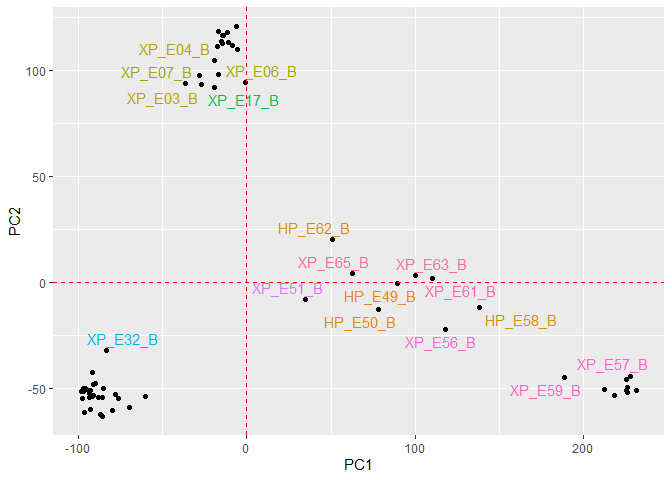
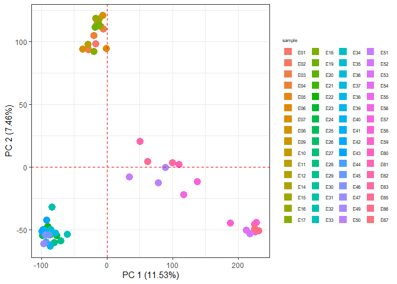
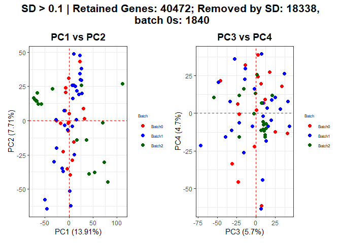
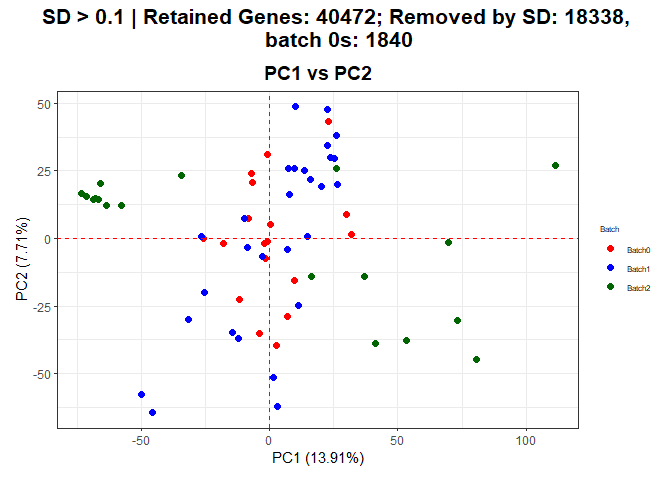
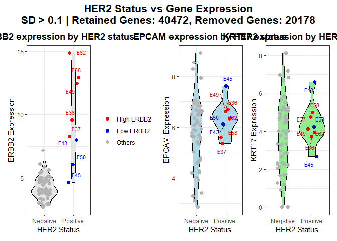
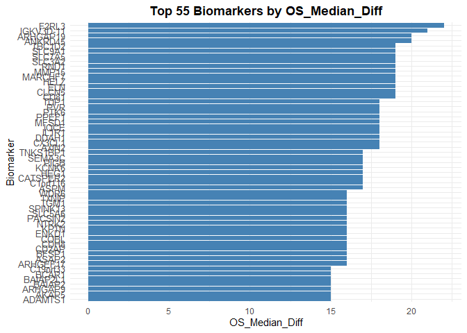
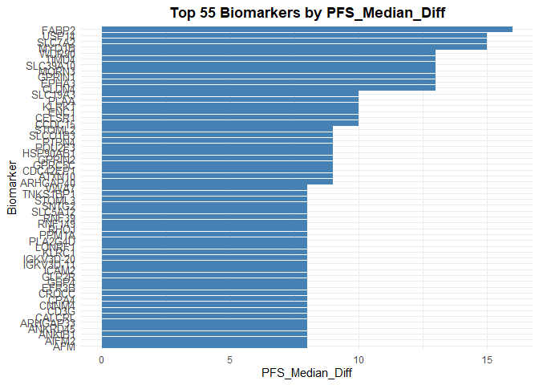
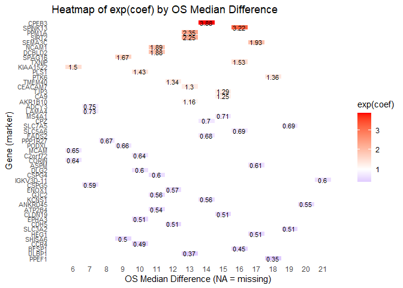
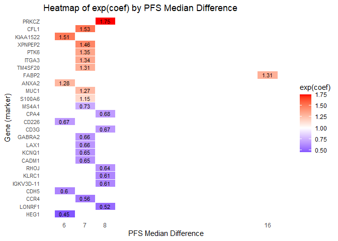

Survival Analysis for XP project
================

This executes the following steps: 1. Batch Correction 2. Filter gene by
Human Protain Atlas(HPA) data Leave genes that are `Plasma membrane`
under `Subcellular location` column of `proteinatlas.tsv`. 3. Survival
analysis for 6-months-difference in Median For genes that have
6-months-difference in Median, apply Cox proportional hazard model and
filter genes that have p-value \< 0.05. 4. Utilize Prognostic
information in the HPA data For genes alive after the previous step,
match the genes with four prognostic information in the HPA data.

This markdown was run on R version: 4.5.1

``` r
# Load required libraries
if (!requireNamespace("BiocManager", quietly = TRUE))
    install.packages("BiocManager")
# BiocManager::install("limma"); BiocManager::install("preprocessCore"); BiocManager::install("sva")
library(limma); library(preprocessCore); library(sva) # From Bioconductor
library(ggplot2); library(FactoMineR); library(ggrepel); library(patchwork); library(reshape2)
library(gridExtra); library(MASS); library(skimr); library(dplyr); library(tidyr); library(openxlsx); library(readr) # For loading data
library(survival); library(survminer); library(maxstat); library(knitr) # For survivial analysis

# Set seed for reproducibility
set.seed(42)
# Use the normal numerical representation
options(scipen = 999)
```

# Data preprocessing

``` r
# Load total_WTS.txt from the data directory
# Read the data
data <- read.table("data/total_WTS.txt", header = TRUE, sep = "\t", stringsAsFactors = FALSE)
# Check the size of the data
dim(data)
```

    ## [1] 60650   287

``` r
head(data)
```

    ##   GeneSymbol Dur.23531874_B Dur.23531874_F Dur.28570261_B Dur.31801143_B
    ## 1       A1BG           1.37           3.99           1.60         204.19
    ## 2   A1BG-AS1           0.11           0.25           0.24           1.86
    ## 3       A1CF           0.19           0.04           1.20          34.01
    ## 4        A2M         350.62         249.21          72.65         341.69
    ## 5    A2M-AS1           0.45           0.68           0.18           0.53
    ## 6      A2ML1           0.00           0.00           0.00           0.00
    ##   Dur.33359264_B Dur.35078868_B Dur.35078868_F Dur.36344083_B Dur.38595049_B
    ## 1           1.00          12.12           0.98           0.00         260.26
    ## 2           0.18           0.09           0.00           0.00           1.74
    ## 3          10.39           4.29           0.00           9.53          36.71
    ## 4         127.75         311.88          34.53          15.42         475.52
    ## 5           0.44           0.00           0.00           0.00           0.53
    ## 6           0.00           0.03           0.00           0.01           0.00
    ##   Dur.39161535_B Dur.39744572_B Dur.40050000_B Dur.40050000_F Dur.40374265_B
    ## 1           1.71           5.75           0.00           2.90           1.29
    ## 2           0.19           0.30           0.27           2.42           0.31
    ## 3           2.80           8.63           8.86           6.33           0.75
    ## 4          17.99         118.04          50.50          58.19          42.76
    ## 5           0.22           0.35           0.96           0.67           0.13
    ## 6           0.00           0.00           0.00           0.00           1.31
    ##   Dur.40374265_F Dur.40403428_B Dur.40403428_F Dur.40683387_B Dur.40885752_B
    ## 1           1.33           2.62           1.49           4.92           0.82
    ## 2           0.28           0.26           0.18           0.89           0.66
    ## 3           3.72           9.78           2.09           1.63           2.61
    ## 4          36.17         267.68         261.92         266.13         211.78
    ## 5           0.00           0.39           0.32           0.66           0.55
    ## 6           0.34           0.08           0.00           0.00         197.04
    ##   Dur.40885752_F Dur.40947070_B Dur.40958768_B Dur.41165714_B Dur.41165714_F
    ## 1           2.66           0.11           2.11           2.67           1.90
    ## 2           0.44           0.00           0.11           0.60           0.16
    ## 3           0.32           0.00           0.00           8.77           1.34
    ## 4          80.21          42.08          65.34         270.60          43.33
    ## 5           0.44           0.00           0.88           0.89           0.22
    ## 6           0.04           0.00           0.39           0.32           0.02
    ##   Dur.41198347_B Dur.41198347_F Dur.41350604_B Dur.41350604_F Dur.41350640_B
    ## 1           3.50           0.00           0.89           0.94           1.15
    ## 2           0.27           0.00           0.55           0.18           0.39
    ## 3           0.15           0.09           0.12           1.82           1.13
    ## 4         232.25          65.04         174.18         102.96         276.14
    ## 5           0.11           0.07           0.18           0.15           0.38
    ## 6           0.00           0.00           0.00           0.05           0.00
    ##   Dur.41350640_F Dur.41705594_B Dur.41705594_F Dur.41789905_B Dur.41789905_F
    ## 1           2.51           5.84           1.29           2.51           1.38
    ## 2           0.50           0.39           0.23           0.59           0.08
    ## 3           0.74          36.18          37.04           7.29           2.75
    ## 4         105.16          99.43         113.47         148.56         131.46
    ## 5           0.37           0.07           0.20           0.67           0.48
    ## 6           0.00           0.03           0.10           0.07           0.00
    ##   Dur.41805074_B Dur.42003176_B Dur.42206799_B Dur.43007041_B Dur.43019165_B
    ## 1           0.78           0.90           6.39           3.84           1.81
    ## 2           0.11           0.15           0.65           0.20           0.18
    ## 3           9.68           0.46           2.78           0.39           2.55
    ## 4         374.98         106.20         148.39          38.25          38.82
    ## 5           0.24           0.28           0.17           0.05           0.29
    ## 6           0.00           0.00           0.02           0.66           0.01
    ##   Dur.43706830_B Dur.43881090_B HP_E36_B HP_E36_F1 HP_E36_F2 HP_E36_F3 HP_E37_B
    ## 1           0.63           2.52     0.54      0.58      1.47     20.62     4.10
    ## 2           0.23           0.25     0.27      0.31      0.14     25.80     1.57
    ## 3           5.39           1.23     0.18      0.00      0.00      4.59     0.14
    ## 4          77.06          34.23    35.21      4.81     10.53     41.58   169.16
    ## 5           0.10           0.35     0.35      0.00      0.04     19.17     0.98
    ## 6           0.09           0.00     0.00      0.00      0.00      6.39     0.00
    ##   HP_E37_F1 HP_E37_F2 HP_E43_B HP_E43_F1 HP_E45_B HP_E45_F1 HP_E45_F2 HP_E49_B
    ## 1      0.00      6.54     0.73      0.00     2.07      5.41      0.00     2.60
    ## 2      0.24      0.98     0.00      0.00     0.43      1.22      0.30     8.03
    ## 3      0.00      0.68     0.00      0.19     5.77      0.08      0.14    14.08
    ## 4     11.77    316.48     6.35      5.57    21.93     20.42     14.51    23.74
    ## 5      0.00      0.59     0.10      0.06     0.03      0.00      0.00     7.33
    ## 6      0.00      0.00     0.00      0.00     0.00      5.80      0.07     2.36
    ##   HP_E49_F1 HP_E49_F2 HP_E49_F3 HP_E50_B HP_E50_F1 HP_E58_B HP_E58_F1 HP_E58_F2
    ## 1      9.55      0.00     17.82    17.84     29.47    11.15     13.58      3.21
    ## 2      8.83      0.00      7.62     6.70     19.47    19.52     23.85      0.21
    ## 3      4.24      0.00     11.58    12.45      3.53    11.45      9.24     26.84
    ## 4     51.56     30.49     27.40    38.54     42.41    40.86     47.89     37.30
    ## 5      8.59      0.00      1.97     4.33     21.85     8.80      6.97      1.47
    ## 6      0.57      0.00      4.26     4.90     18.02     7.42      5.03      0.82
    ##   HP_E62_B HP_E62_F2 MSI.P.EP63 MSI.P.EP64 MSI.P.EP65 MSI.P.EP66 MSI.P.EP67
    ## 1     9.30      0.00       0.77       0.22       1.86       0.45       1.05
    ## 2     4.98      0.00       0.08       0.07       0.05       0.00       0.18
    ## 3     1.67     13.11       4.71       4.20       2.64       0.09       0.28
    ## 4    45.53    129.40     103.25      45.41      38.86      39.47      39.72
    ## 5     2.67      4.85       0.03       0.04       0.12       0.03       0.09
    ## 6     2.64      0.00       0.26       0.15       0.00       0.03       0.14
    ##   MSI.P.EP68 MSI.P.EP69 MSI.P.EP71 MSI.P.EP72 MSI.P.EP75 MSI.P.EP76 MSI.P.EP77
    ## 1       2.62       1.37       0.93       1.09       2.17       2.55       5.91
    ## 2       0.23       0.05       0.14       0.29       0.29       0.42       0.39
    ## 3       0.04       0.01       0.24       0.00       0.00       2.60       6.52
    ## 4     143.52      61.84     162.29     107.05     120.07     194.28     111.43
    ## 5       0.16       0.20       0.02       0.12       0.27       0.14       0.00
    ## 6       0.11       0.02       0.03       0.00      15.36       0.02       0.15
    ##   MSI.P.EP78 MSI.P.EP79 MSI.P.EP80 MSI.P.EP81 RAM.E01 RAM.E02 RAM.E04 RAM.E05
    ## 1       0.22       0.47       1.04       0.82    2.37    4.10    1.84    1.88
    ## 2       0.02       0.08       0.13       0.23    0.16    0.29    0.06    0.05
    ## 3       1.68       0.06       0.01       0.32    0.88    1.93    4.05   12.67
    ## 4      55.34     106.21      69.34      39.86  384.50  476.27  268.43  429.62
    ## 5       0.18       0.00       0.16       0.30    0.09    0.24    0.16    0.09
    ## 6       2.33       0.00       0.00       0.15   60.47    1.40    0.00    0.00
    ##   RAM.E06 RAM.E07 RAM.E08 RAM.E10 RAM.E11 RAM.E12 RAM.E13 RAM.E14 RAM.E18
    ## 1    1.21  550.42   61.34    1.46    3.20    1.82    1.02    3.51    1.44
    ## 2    0.09    1.68    0.13    0.01    0.09    0.11    0.09    0.10    0.44
    ## 3    2.10   69.56    8.36    2.05    0.83    1.60    0.27    0.04    1.82
    ## 4   99.59  894.13  292.69  146.54  416.87  146.91  157.80  526.79  139.46
    ## 5    0.02    0.23    0.17    0.14    0.15    0.16    0.12    0.38    0.00
    ## 6    0.03    0.07    0.23    0.02    0.18    0.00   16.96    0.45    0.03
    ##   RAM.E20 RAM.E21 RAM.E23 RAM.E25 RAM.E26 RAM.E27 RAM.E30 RAM.E32 RAM.E33
    ## 1    1.21    1.44    3.83    0.98    2.14    1.89    0.89    5.27    2.11
    ## 2    0.27    0.11    0.10    0.00    0.07    0.09    0.13    0.26    0.17
    ## 3    0.80    4.38    0.66    4.91   11.24   11.20    4.30    4.84    3.28
    ## 4   73.24  202.41  161.02  131.32  291.56  128.79  231.49  496.59  165.26
    ## 5    0.09    0.18    0.09    0.00    0.15    0.15    0.07    0.43    0.15
    ## 6    0.41    0.00    0.04    0.03    0.00    0.00    0.00    0.37    0.08
    ##   RAM.E34 RAM.E37 RAM.E38 RAM.E40 RAM.E44 RAM.E45 RAM.E46 RAM.E48 RAM.E50
    ## 1    3.18  204.23    0.33    2.43    2.11    0.84    4.13    2.12    1.43
    ## 2    0.16    1.10    0.03    0.49    0.26    0.04    0.03    0.32    0.07
    ## 3    1.16   35.76   14.04    2.92    0.02    6.08    0.94    0.86    8.44
    ## 4   51.51  349.64   33.75  290.71  323.25  129.45  392.02  307.01   78.38
    ## 5    0.26    0.28    0.18    0.41    0.33    0.08    0.19    0.04    0.04
    ## 6    0.01    0.00    0.12    0.01    5.78    0.00    0.13    0.05    0.01
    ##   RAM.E54 RAM.E55 RAM.E57 RAM.E58 RAM.E59 RAM.E62 RAM.E65 RAM.E66 RAM.E68
    ## 1    3.14    1.71    0.67   63.89    1.66    1.59    0.38    1.03    0.32
    ## 2    0.08    0.29    0.00    0.28    0.11    0.15    0.00    0.05    0.03
    ## 3    1.35    2.79    8.97    7.55    0.30   18.13    0.50   26.68    5.03
    ## 4   78.30  197.21  216.07  195.21  257.99  219.61  107.12  147.04   95.83
    ## 5    0.12    0.50    0.00    0.24    0.17    0.05    0.00    0.00    0.08
    ## 6    0.00    0.04    0.03    0.01    0.86    0.00    0.00    0.00    0.01
    ##   RP_S003_B RP_S004_F RP_S005_B RP_S006_B RP_S008_B RP_S008_F RP_S009_B
    ## 1      2.86      5.03      1.11      3.03      1.38    562.33      2.90
    ## 2      0.20      0.19      0.05      0.00      0.12      1.95      0.27
    ## 3      2.65     14.57      5.87      1.97      0.00     76.54      6.38
    ## 4    174.02     61.25     65.83     16.86    221.68    332.15    280.28
    ## 5      0.06      0.36      0.10      0.00      0.08      0.03      0.16
    ## 6      0.03      0.00      0.01      0.66     76.08      0.00      0.27
    ##   RP_S009_F RP_S012_B RP_S012_F RP_S015_B RP_S015_F RP_S016_B XP_E01_B
    ## 1      0.14      0.69     23.25     19.56      0.58      3.89     3.46
    ## 2      0.05      0.10      0.81      0.48      0.02      0.00     0.03
    ## 3     11.39      1.18      1.16      3.60      0.97     23.33     2.14
    ## 4     13.18     64.82     57.54    123.89     74.85      9.09    26.05
    ## 5      0.06      0.15      0.00      0.35      0.02      0.00     0.01
    ## 6      0.00      0.93      0.00      0.00      0.00      0.00     0.00
    ##   XP_E01_B2 XP_E01_F1 XP_E02_B XP_E02_F1 XP_E02_F2 XP_E03_B XP_E03_F1 XP_E03_F2
    ## 1      1.51      1.55     2.81      1.88      0.00     2.67      1.37      0.31
    ## 2      0.38      0.09     0.43      0.15      0.13     0.22      0.88      0.43
    ## 3      0.71     15.46     2.57      1.12      0.40    17.89      2.13      0.10
    ## 4     40.35    106.49    61.13    123.76      5.96    59.63     64.63      2.14
    ## 5      0.00      0.03     0.12      0.23      0.00     0.04      0.58      0.00
    ## 6      0.00      0.02     0.16      0.45      0.00     0.20      0.00      0.00
    ##   XP_E04_B XP_E04_F1 XP_E04_F12 XP_E05_B XP_E05_F1 XP_E05_F2 XP_E06_B XP_E06_F1
    ## 1     1.10      0.84       1.23     2.61      0.05      0.00     0.94      1.10
    ## 2     0.43      0.27       0.13     0.06      0.27      0.25     0.28      0.31
    ## 3     4.66      2.24       6.29     8.08      4.07      0.59     0.39      1.63
    ## 4    54.61     59.87      12.81    58.02     58.41      0.96    16.84     82.72
    ## 5     0.07      0.01       0.05     0.00      0.11      0.00     0.03      0.15
    ## 6     0.00      0.08       0.00     0.10      0.00      0.00     0.06      0.00
    ##   XP_E06_F2 XP_E07_B XP_E07_F1 XP_E07_F2 XP_E08_B XP_E08_F1 XP_E08_F2 XP_E09_B
    ## 1      1.18     0.89      2.05      0.00     0.63      1.81      1.67     0.55
    ## 2      0.21     0.01      0.00      0.00     0.33      0.65      0.60     0.06
    ## 3      0.15     0.58      0.00      0.00     3.60      1.96      0.00     7.29
    ## 4      5.66    10.42     28.06      9.56    75.61     68.85     29.73    58.26
    ## 5      0.00     0.00      0.00      0.00     0.16      0.09      0.21     0.17
    ## 6      0.00     0.00      0.58      0.00     0.12      0.00      0.00     0.00
    ##   XP_E09_F1 XP_E09_F2 XP_E10_B XP_E10_F1 XP_E10_F2 XP_E11_B XP_E11_F1 XP_E12_B
    ## 1      2.86      0.00     2.51      0.58      0.00     0.51      1.32     1.13
    ## 2      0.29      0.00     0.17      0.62      0.93     0.54      0.18     0.25
    ## 3      0.78      0.00     0.52      0.23      0.00     0.70      0.09     1.08
    ## 4    101.05      5.53    60.84    147.87     12.69   100.08     73.31    74.60
    ## 5      0.43      0.00     0.16      0.74      0.00     0.54      0.00     0.05
    ## 6      0.03      0.00     0.00      0.04      0.00     0.00      0.00     0.52
    ##   XP_E12_F1 XP_E12_F2 XP_E14_B XP_E14_F1 XP_E15_B XP_E15_F1 XP_E15_F2 XP_E16_B
    ## 1      1.51      0.00     2.60      1.38     0.89      1.63      0.00     0.49
    ## 2      0.04      0.00     0.29      0.31     0.09      0.00      0.09     0.21
    ## 3      0.10      0.00     2.27      0.04     3.82      1.17      0.03    13.46
    ## 4     46.48      4.87   121.69     43.75    89.19    107.11      2.17    22.03
    ## 5      0.00      0.00     0.22      0.04     0.20      0.13      0.00     0.03
    ## 6      0.00      0.00     0.11     13.22     0.00      0.00      0.00     0.00
    ##   XP_E16_F1 XP_E16_F2 XP_E17_B XP_E17_F1 XP_E17_F2 XP_E18_B XP_E18_F1 XP_E18_F2
    ## 1      1.85      0.00     1.13      0.00      1.03     0.00      0.00      0.69
    ## 2      0.99      0.07     0.25      0.00      0.18     0.58      0.00      0.00
    ## 3      0.00      0.00     0.00      0.00      0.00     0.41      0.00      0.00
    ## 4      7.89      3.64    93.15      9.71     24.11   135.76      7.45      5.46
    ## 5      0.00      0.00     0.19      0.00      0.00     0.52      0.00      0.00
    ## 6      0.00      0.00     0.00      0.00      0.00     0.07      0.00      0.00
    ##   XP_E19_B XP_E19_F1 XP_E20_B XP_E20_F1 XP_E20_F2 XP_E21_B XP_E21_F1 XP_E21_F2
    ## 1     0.37      1.54     0.25      0.45      0.41     0.43      2.03      0.23
    ## 2     0.19      0.20     0.22      0.45      0.32     0.00      0.00      0.11
    ## 3     2.36      0.30     0.11      0.16      0.25     0.00      0.00      0.01
    ## 4    35.30      5.64    15.82      6.29      6.05     7.22      8.48      6.59
    ## 5     0.08      0.00     0.00      0.18      0.00     0.00      0.05      0.00
    ## 6     0.06      0.00     0.00      0.00      0.00     0.00      0.00      0.00
    ##   XP_E22_B XP_E22_F1 XP_E22_F2 XP_E23_B XP_E23_F1 XP_E23_F2 XP_E24_B XP_E24_F1
    ## 1     0.56      2.94      1.70     2.00      4.52      1.48     3.59      2.15
    ## 2     0.25      0.16      0.07     0.39      0.43      0.45     0.36      0.00
    ## 3     0.00      0.04      0.16     0.00      0.00      0.06     0.00      0.01
    ## 4    14.89     19.06      7.25     8.27     27.09      4.87    11.32      8.10
    ## 5     0.08      0.00      0.00     0.21      0.34      0.00     0.09      0.00
    ## 6     0.00      0.00      0.00     0.00      0.04      0.02     0.00      0.00
    ##   XP_E24_F2 XP_E25_B XP_E25_F1 XP_E25_F2 XP_E26_B XP_E26_F1 XP_E26_F2 XP_E27_B
    ## 1      0.26     1.62      1.61      1.82     3.93      0.25      1.99     2.03
    ## 2      0.00     0.60      0.41      0.10     0.00      0.09      0.00     0.00
    ## 3      0.11     0.21      0.31      0.46     0.01      0.83      0.78     0.10
    ## 4      2.34     8.18     15.81     12.00    11.40      4.84     12.09     9.53
    ## 5      0.00     0.12      0.04      0.00     0.13      0.07      0.09     0.00
    ## 6      0.00     0.00      0.00      0.00     0.00      0.00      0.00     0.00
    ##   XP_E27_F1 XP_E27_F2 XP_E28_B XP_E28_F1 XP_E28_F2 XP_E29_B XP_E29_F1 XP_E29_F2
    ## 1      0.49      0.71     3.43      3.10      1.22    13.92      6.10      2.81
    ## 2      0.38      0.00     1.19      0.27      0.35     3.52      0.51      0.72
    ## 3      0.00      0.00     0.03      0.00      0.97     1.08      0.07      0.12
    ## 4     13.29      3.95    50.60     18.23     19.72    35.00     22.02      6.80
    ## 5      0.00      0.03     0.00      0.00      0.03     0.54      0.07      0.08
    ## 6      0.00      0.00     0.00      0.00      0.00     0.00      0.00      0.00
    ##   XP_E30_B XP_E30_F1 XP_E30_F2 XP_E31_B XP_E31_F1 XP_E31_F2 XP_E32_B XP_E32_F1
    ## 1     0.58      2.39      1.40     0.60      0.27      3.27     0.00      0.87
    ## 2     0.13      0.31      0.37     0.00      0.42      0.45     0.05      0.16
    ## 3     0.00      0.08      0.23     0.05      0.20      0.67     0.32      0.12
    ## 4    16.93     14.15     12.91     2.48     10.05     33.01     1.48      7.62
    ## 5     0.04      0.27      0.10     0.00      0.18      0.08     0.04      0.04
    ## 6     0.00      0.00      0.00     0.00      0.00      0.00     0.00      0.00
    ##   XP_E32_F2 XP_E33_B XP_E33_F1 XP_E34_B XP_E34_F1 XP_E35_B XP_E35_F1 XP_E35_F2
    ## 1      0.53    16.38      0.63     1.68      0.90     0.48      2.47      1.02
    ## 2      0.37     2.77      0.67     0.17      0.10     0.31      0.10      0.00
    ## 3      0.07     1.55      0.10     0.00      0.07     0.13      0.00      0.10
    ## 4      7.18    21.35     11.18     3.14      2.50     7.40      7.45      9.72
    ## 5      0.09     0.06      0.05     0.00      0.00     0.00      0.00      0.00
    ## 6      0.00    36.20    137.27     0.32      0.00     0.00      0.00      0.00
    ##   XP_E38_B XP_E38_F1 XP_E38_F2 XP_E39_B XP_E39_F1 XP_E39_F2 XP_E40_B XP_E40_F1
    ## 1     2.51      1.40      0.66    19.60      1.97     30.35     0.65      1.22
    ## 2     0.21      0.11      0.18     1.16      0.10      1.55     0.04      0.13
    ## 3     0.14      0.08      0.13     1.07      0.00      0.37     0.07      0.00
    ## 4     5.07      4.27      7.08    99.17     47.61    360.33     6.97      4.54
    ## 5     0.18      0.05      0.00     0.55      0.25      0.48     0.03      0.00
    ## 6     0.00      0.00      0.00     0.00      0.00      0.00     0.00      0.00
    ##   XP_E40_F2 XP_E41_B XP_E41_F1 XP_E41_F2 XP_E42_B XP_E42_F1 XP_E42_F2 XP_E44_B
    ## 1      0.52     0.96      1.25      1.23     3.04      1.37      6.07     6.55
    ## 2      0.00     0.20      0.00      0.11     0.43      0.24      0.36     0.92
    ## 3      0.39     0.07      0.20      0.13     0.07      0.31      0.17     0.15
    ## 4      1.88    10.28      5.81      4.33    15.57     13.69     40.01    48.51
    ## 5      0.02     0.06      0.07      0.00     0.19      0.02      0.09     0.11
    ## 6      0.00     0.00      0.00      0.00     0.00      0.00      0.00     0.00
    ##   XP_E44_F1 XP_E44_F2 XP_E46_B XP_E46_F1 XP_E46_F2 XP_E47_B XP_E47_F1 XP_E51_B
    ## 1      5.69      7.43     4.45      3.02     21.08     4.62      2.39     6.18
    ## 2      0.18      0.64     0.17      0.67     21.74     0.22      0.21     2.34
    ## 3      0.21      0.00     0.77      0.01      1.51     0.23      0.10     0.42
    ## 4     10.32    115.16    67.75     57.03     13.19    37.60      7.19    76.14
    ## 5      0.00      0.23     0.29      0.00     12.17     0.08      0.00     9.54
    ## 6      0.00      0.00     0.05      0.00      5.72     0.00      0.00     3.50
    ##   XP_E51_F1 XP_E52_B XP_E52_F1 XP_E53_B XP_E53_F1 XP_E54_B XP_E54_F1 XP_E54_F2
    ## 1     24.87    26.91      5.31    45.76     54.89    26.14     37.49     32.43
    ## 2     29.76    36.98      0.14    32.09      4.51    32.74     30.63     24.32
    ## 3      4.38     4.21     16.67     5.65     11.34     6.52      3.29      4.19
    ## 4     31.69    21.37    183.82    21.92     65.02    28.01     21.87     34.43
    ## 5     16.09    15.37      1.20    14.34      7.97    13.45     17.36     20.95
    ## 6     15.55    18.79      0.64    13.88      0.00    19.44     17.42      7.96
    ##   XP_E55_B XP_E55_F1 XP_E55_F2 XP_E56_B XP_E56_F1 XP_E57_B XP_E57_F1 XP_E57_F2
    ## 1    21.48     27.20     34.57     9.97     23.51    15.63     53.64     32.87
    ## 2    34.93     41.26     25.52    17.34     29.82    33.04     24.03     20.31
    ## 3    11.44      5.39      5.93     3.01      3.46     5.34      6.49      3.31
    ## 4    25.52     24.90     33.07    51.61     33.08    23.79     44.33     28.93
    ## 5    14.79     16.85     17.34    10.17     19.11    20.47     20.82     17.90
    ## 6    13.06     13.34     19.62     1.03     18.87    18.88     18.85     11.79
    ##   XP_E59_B XP_E59_F11 XP_E59_F12 XP_E59_F2 XP_E60_B XP_E61_B XP_E61_F1 XP_E63_B
    ## 1    24.64      48.81      20.75     13.08    23.94     9.00     18.02    12.32
    ## 2    22.75      15.29      25.34     20.79    30.56    14.65     17.54    12.71
    ## 3     5.43      18.99       5.98     13.49     4.89    12.88      4.66    16.62
    ## 4    40.69      56.43      44.27     21.48    31.14   122.64    102.45    65.91
    ## 5    18.79      19.57      21.04      7.61    23.49    10.04      9.89     8.92
    ## 6    14.26      11.97      15.63      6.01    22.80     5.49     11.31     6.10
    ##   XP_E65_B XP_E65_F1 XP_E66_B XP_E66_F1 XP_E67_B XP_E67_F1 XP_E68_B XP_E68_F1
    ## 1    30.17     25.07    26.82     19.02    23.61     28.92    15.07     26.45
    ## 2     7.17     22.86    29.36     25.72    29.11     33.56    19.24     16.87
    ## 3    11.62      7.36     4.24      4.55     9.68      3.95     4.61      5.95
    ## 4    59.71     46.58    19.70     25.52    23.28     26.75    20.69     34.61
    ## 5     3.53     23.23    19.06     16.01    16.35     18.49    14.66     15.04
    ## 6     1.95     32.64    21.50     11.31    13.59     19.01     7.28      6.72

``` r
# Check the number of columns which contains 'XP_E' and 'HP_E'
ncol(data[grep("XP_E", colnames(data))]); ncol(data[grep("HP_E", colnames(data))])
```

    ## [1] 153

    ## [1] 23

XP_E, HP_E 포함한 데이터들을 보면, 중간에 들어간 ‘E~’의 환자번호는
중복되지 않음. 여기에서 ’XP\_’, ‘HP\_’와 관계없이’\_B’로 끝나는 것들만
뽑아낼 것이다

``` r
# List the column names which contains 'XP_E' and 'HP_E'
colnames(data)[grep("XP_E", colnames(data))]
```

    ##   [1] "XP_E01_B"   "XP_E01_B2"  "XP_E01_F1"  "XP_E02_B"   "XP_E02_F1" 
    ##   [6] "XP_E02_F2"  "XP_E03_B"   "XP_E03_F1"  "XP_E03_F2"  "XP_E04_B"  
    ##  [11] "XP_E04_F1"  "XP_E04_F12" "XP_E05_B"   "XP_E05_F1"  "XP_E05_F2" 
    ##  [16] "XP_E06_B"   "XP_E06_F1"  "XP_E06_F2"  "XP_E07_B"   "XP_E07_F1" 
    ##  [21] "XP_E07_F2"  "XP_E08_B"   "XP_E08_F1"  "XP_E08_F2"  "XP_E09_B"  
    ##  [26] "XP_E09_F1"  "XP_E09_F2"  "XP_E10_B"   "XP_E10_F1"  "XP_E10_F2" 
    ##  [31] "XP_E11_B"   "XP_E11_F1"  "XP_E12_B"   "XP_E12_F1"  "XP_E12_F2" 
    ##  [36] "XP_E14_B"   "XP_E14_F1"  "XP_E15_B"   "XP_E15_F1"  "XP_E15_F2" 
    ##  [41] "XP_E16_B"   "XP_E16_F1"  "XP_E16_F2"  "XP_E17_B"   "XP_E17_F1" 
    ##  [46] "XP_E17_F2"  "XP_E18_B"   "XP_E18_F1"  "XP_E18_F2"  "XP_E19_B"  
    ##  [51] "XP_E19_F1"  "XP_E20_B"   "XP_E20_F1"  "XP_E20_F2"  "XP_E21_B"  
    ##  [56] "XP_E21_F1"  "XP_E21_F2"  "XP_E22_B"   "XP_E22_F1"  "XP_E22_F2" 
    ##  [61] "XP_E23_B"   "XP_E23_F1"  "XP_E23_F2"  "XP_E24_B"   "XP_E24_F1" 
    ##  [66] "XP_E24_F2"  "XP_E25_B"   "XP_E25_F1"  "XP_E25_F2"  "XP_E26_B"  
    ##  [71] "XP_E26_F1"  "XP_E26_F2"  "XP_E27_B"   "XP_E27_F1"  "XP_E27_F2" 
    ##  [76] "XP_E28_B"   "XP_E28_F1"  "XP_E28_F2"  "XP_E29_B"   "XP_E29_F1" 
    ##  [81] "XP_E29_F2"  "XP_E30_B"   "XP_E30_F1"  "XP_E30_F2"  "XP_E31_B"  
    ##  [86] "XP_E31_F1"  "XP_E31_F2"  "XP_E32_B"   "XP_E32_F1"  "XP_E32_F2" 
    ##  [91] "XP_E33_B"   "XP_E33_F1"  "XP_E34_B"   "XP_E34_F1"  "XP_E35_B"  
    ##  [96] "XP_E35_F1"  "XP_E35_F2"  "XP_E38_B"   "XP_E38_F1"  "XP_E38_F2" 
    ## [101] "XP_E39_B"   "XP_E39_F1"  "XP_E39_F2"  "XP_E40_B"   "XP_E40_F1" 
    ## [106] "XP_E40_F2"  "XP_E41_B"   "XP_E41_F1"  "XP_E41_F2"  "XP_E42_B"  
    ## [111] "XP_E42_F1"  "XP_E42_F2"  "XP_E44_B"   "XP_E44_F1"  "XP_E44_F2" 
    ## [116] "XP_E46_B"   "XP_E46_F1"  "XP_E46_F2"  "XP_E47_B"   "XP_E47_F1" 
    ## [121] "XP_E51_B"   "XP_E51_F1"  "XP_E52_B"   "XP_E52_F1"  "XP_E53_B"  
    ## [126] "XP_E53_F1"  "XP_E54_B"   "XP_E54_F1"  "XP_E54_F2"  "XP_E55_B"  
    ## [131] "XP_E55_F1"  "XP_E55_F2"  "XP_E56_B"   "XP_E56_F1"  "XP_E57_B"  
    ## [136] "XP_E57_F1"  "XP_E57_F2"  "XP_E59_B"   "XP_E59_F11" "XP_E59_F12"
    ## [141] "XP_E59_F2"  "XP_E60_B"   "XP_E61_B"   "XP_E61_F1"  "XP_E63_B"  
    ## [146] "XP_E65_B"   "XP_E65_F1"  "XP_E66_B"   "XP_E66_F1"  "XP_E67_B"  
    ## [151] "XP_E67_F1"  "XP_E68_B"   "XP_E68_F1"

``` r
colnames(data)[grep("HP_E", colnames(data))]
```

    ##  [1] "HP_E36_B"  "HP_E36_F1" "HP_E36_F2" "HP_E36_F3" "HP_E37_B"  "HP_E37_F1"
    ##  [7] "HP_E37_F2" "HP_E43_B"  "HP_E43_F1" "HP_E45_B"  "HP_E45_F1" "HP_E45_F2"
    ## [13] "HP_E49_B"  "HP_E49_F1" "HP_E49_F2" "HP_E49_F3" "HP_E50_B"  "HP_E50_F1"
    ## [19] "HP_E58_B"  "HP_E58_F1" "HP_E58_F2" "HP_E62_B"  "HP_E62_F2"

``` r
# XP_E-related subsets
data_XP_E <- data[, c("GeneSymbol", grep("XP_E", colnames(data), value = TRUE))]
data_XP_E_B <- data_XP_E[, c("GeneSymbol", grep("_B$", colnames(data_XP_E), value = TRUE))]
data_XP_E_F1 <- data_XP_E[, c("GeneSymbol", grep("F1$", colnames(data_XP_E), value = TRUE))]
data_XP_E_F2 <- data_XP_E[, c("GeneSymbol", grep("F2$", colnames(data_XP_E), value = TRUE))]
ncol(data_XP_E_B); ncol(data_XP_E_F1); ncol(data_XP_E_F2)
```

    ## [1] 58

    ## [1] 55

    ## [1] 39

``` r
# Check the rest of 'B', 'F1' and 'F2' columns of data_XP_E
total_cols <- ncol(data_XP_E)
b_f1_f2_cols <- ncol(data_XP_E_B) + ncol(data_XP_E_F1) + ncol(data_XP_E_F2)
rest_cols <- total_cols - b_f1_f2_cols
cat("Total XP_E columns:", total_cols, "\n")
```

    ## Total XP_E columns: 154

``` r
cat("Columns ending with _B, F1, or F2:", b_f1_f2_cols, "\n")
```

    ## Columns ending with _B, F1, or F2: 152

``` r
cat("Remaining columns:", rest_cols, "\n")
```

    ## Remaining columns: 2

``` r
# Check XP_E columns that are not B/F1/F2
total_cols <- ncol(data_XP_E) - 1  # exclude GeneSymbol
b_f1_f2_cols <- (ncol(data_XP_E_B) - 1) + (ncol(data_XP_E_F1) - 1) + (ncol(data_XP_E_F2) - 1)
rest_cols <- total_cols - b_f1_f2_cols
cat("Total XP_E data columns (excluding GeneSymbol):", total_cols, "\n")
```

    ## Total XP_E data columns (excluding GeneSymbol): 153

``` r
cat("XP_E columns ending with _B, F1, or F2:", b_f1_f2_cols, "\n")
```

    ## XP_E columns ending with _B, F1, or F2: 149

``` r
cat("XP_E remaining columns:", rest_cols, "\n")
```

    ## XP_E remaining columns: 4

``` r
# Get remaining XP_E columns not ending with B, F1, F2
rest_xp_cols <- setdiff(
  grep("XP_E", colnames(data_XP_E), value = TRUE),
  c(grep("_B$", colnames(data_XP_E), value = TRUE),
    grep("F1$", colnames(data_XP_E), value = TRUE),
    grep("F2$", colnames(data_XP_E), value = TRUE))
)
data_XP_E_rest <- data[, c("GeneSymbol", rest_xp_cols)]
colnames(data_XP_E_rest)
```

    ## [1] "GeneSymbol" "XP_E01_B2"  "XP_E04_F12" "XP_E59_F11" "XP_E59_F12"

``` r
# HP_E-related subsets
data_HP_E <- data[, c("GeneSymbol", grep("HP_E", colnames(data), value = TRUE))]
data_HP_E_B <- data_HP_E[, c("GeneSymbol", grep("_B$", colnames(data_HP_E), value = TRUE))]
data_HP_E_F1 <- data_HP_E[, c("GeneSymbol", grep("F1$", colnames(data_HP_E), value = TRUE))]
data_HP_E_F2 <- data_HP_E[, c("GeneSymbol", grep("F2$", colnames(data_HP_E), value = TRUE))]
ncol(data_HP_E_B); ncol(data_HP_E_F1); ncol(data_HP_E_F2)
```

    ## [1] 9

    ## [1] 8

    ## [1] 7

``` r
# Check HP_E columns that are not B/F1/F2
total_cols <- ncol(data_HP_E) - 1  # exclude GeneSymbol
b_f1_f2_cols <- (ncol(data_HP_E_B) - 1) + (ncol(data_HP_E_F1) - 1) + (ncol(data_HP_E_F2) - 1)
rest_cols <- total_cols - b_f1_f2_cols
cat("Total HP_E data columns (excluding GeneSymbol):", total_cols, "\n")
```

    ## Total HP_E data columns (excluding GeneSymbol): 23

``` r
cat("HP_E columns ending with _B, F1, or F2:", b_f1_f2_cols, "\n")
```

    ## HP_E columns ending with _B, F1, or F2: 21

``` r
cat("HP_E remaining columns:", rest_cols, "\n")
```

    ## HP_E remaining columns: 2

``` r
# Get remaining HP_E columns not ending with B, F1, F2
rest_hp_cols <- setdiff(
  grep("HP_E", colnames(data_HP_E), value = TRUE),
  c(grep("_B$", colnames(data_HP_E), value = TRUE),
    grep("F1$", colnames(data_HP_E), value = TRUE),
    grep("F2$", colnames(data_HP_E), value = TRUE))
)
data_HP_E_rest <- data[, c("GeneSymbol", rest_hp_cols)]
colnames(data_HP_E_rest)
```

    ## [1] "GeneSymbol" "HP_E36_F3"  "HP_E49_F3"

``` r
# Final filtered XP_E + HP_E set (with GeneSymbol)
df <- data[, c("GeneSymbol", grep("XP_E", colnames(data), value = TRUE), grep("HP_E", colnames(data), value = TRUE))]

# Subsets by timepoint (with GeneSymbol)
df_B <- df[, c("GeneSymbol", grep("_B$", colnames(df), value = TRUE))]
df_F1 <- df[, c("GeneSymbol", grep("F1$", colnames(df), value = TRUE))]
df_F2 <- df[, c("GeneSymbol", grep("F2$", colnames(df), value = TRUE))]
ncol(df_B); ncol(df_F1); ncol(df_F2)
```

    ## [1] 66

    ## [1] 62

    ## [1] 45

E68번 환자는 도중 치료를 중단해 survival.txt에 데이터가 없으므로, 해당
열은 제거한다.

``` r
# Remove 'XP_E68_B' column from df_B
df_B <- df_B[, -which(colnames(df_B) == "XP_E68_B")]
sort(colnames(df_B))
```

    ##  [1] "GeneSymbol" "HP_E36_B"   "HP_E37_B"   "HP_E43_B"   "HP_E45_B"  
    ##  [6] "HP_E49_B"   "HP_E50_B"   "HP_E58_B"   "HP_E62_B"   "XP_E01_B"  
    ## [11] "XP_E02_B"   "XP_E03_B"   "XP_E04_B"   "XP_E05_B"   "XP_E06_B"  
    ## [16] "XP_E07_B"   "XP_E08_B"   "XP_E09_B"   "XP_E10_B"   "XP_E11_B"  
    ## [21] "XP_E12_B"   "XP_E14_B"   "XP_E15_B"   "XP_E16_B"   "XP_E17_B"  
    ## [26] "XP_E18_B"   "XP_E19_B"   "XP_E20_B"   "XP_E21_B"   "XP_E22_B"  
    ## [31] "XP_E23_B"   "XP_E24_B"   "XP_E25_B"   "XP_E26_B"   "XP_E27_B"  
    ## [36] "XP_E28_B"   "XP_E29_B"   "XP_E30_B"   "XP_E31_B"   "XP_E32_B"  
    ## [41] "XP_E33_B"   "XP_E34_B"   "XP_E35_B"   "XP_E38_B"   "XP_E39_B"  
    ## [46] "XP_E40_B"   "XP_E41_B"   "XP_E42_B"   "XP_E44_B"   "XP_E46_B"  
    ## [51] "XP_E47_B"   "XP_E51_B"   "XP_E52_B"   "XP_E53_B"   "XP_E54_B"  
    ## [56] "XP_E55_B"   "XP_E56_B"   "XP_E57_B"   "XP_E59_B"   "XP_E60_B"  
    ## [61] "XP_E61_B"   "XP_E63_B"   "XP_E65_B"   "XP_E66_B"   "XP_E67_B"

Genes AC\|AL\|RP\|CT\|AP\|CH\|LOC\|BX\|BC\|DB\|DA\|DP\|DQ\|AKR are
unknown for their function. So we

``` r
# Check the number of unknown genes in df_B
# !!!MIND THE PARENTHESIS IN THE REGULAR EXPRESSION!!!
unknown_genes <- df_B$GeneSymbol[grep("^(AC|AL|RP|CT|AP|CH|LOC|BX|BC|DB|DA|DP|DQ|AKR)", df_B$GeneSymbol, ignore.case = FALSE, perl = FALSE)]
length(unknown_genes) # Count the number of unknown genes
```

    ## [1] 23953

``` r
# Remove unknown genes from df_B
# df_B <- df_B[!df_B$GeneSymbol %in% unknown_genes, ]
# nrow(df_B) # Check the number of remaining genes
```

# Batch Correction

먼저 Batch Correction 전의 PC플롯을 그려보자.

``` r
rownames(df_B) <- df_B$GeneSymbol # 1. 첫 번째 칼럼(GeneSymbol)을 rowname으로 지정
df_B$GeneSymbol <- NULL # 2. rowname으로 옮겼으니 GeneSymbol 칼럼 제거
df_B_matrix <- as.matrix(df_B) # 3. matrix로 변환

data_norm = normalize.quantiles(log2(df_B_matrix + 1))
dimnames(data_norm) = dimnames(df_B_matrix)
#data_norm=data
PCA1 = prcomp(t(data_norm))
PCA1_matrix = data.frame(PCA1$x, sample = strsplit2(colnames(df_B_matrix), '.')[,2])
PCA1_matrix$X =rownames(PCA1_matrix)
p <- ggplot(PCA1_matrix, aes(PC1, PC2, label = X, color = X)) +  geom_point(color = "black")

p1 <- p + geom_text() + labs(title = "geom_text()")

p2 <- p + geom_text_repel()+geom_hline(yintercept = 0, color = 'red', lty = 2) + geom_vline(xintercept = 0, color = 'red', lty = 2)+ theme(legend.position = "none")

# Draw the plot
p2
```

    ## Warning: ggrepel: 47 unlabeled data points (too many overlaps). Consider
    ## increasing max.overlaps

<!-- -->

``` r
TPM_norm1 = normalize.quantiles(log2(df_B_matrix + 1))
dimnames(TPM_norm1) = dimnames(df_B_matrix)
#write.table(TPM_norm1, file="./TPM_norm.txt", sep = "\t", row.names = FALSE, col.names = TRUE)

PCA1 = prcomp(t(TPM_norm1))
PCA1_matrix = data.frame(PCA1$x, sample = strsplit2(colnames(df_B_matrix), '_')[,2])

P1 = ggplot(PCA1_matrix, aes(x = PC1, y = PC2, color = sample)) + theme_bw() + geom_point(size = 4)  +
  #scale_color_manual(values = c('red', 'green', 'blue')) +
  xlab(paste('PC 1 (', round(100*PCA1$sdev[1]/sum(PCA1$sdev), 2), '%)', sep = '')) +
  ylab(paste('PC 2 (', round(100*PCA1$sdev[2]/sum(PCA1$sdev), 2), '%)', sep = '')) + 
  geom_hline(yintercept = 0, color = 'red', lty = 2) + geom_vline(xintercept = 0, color = 'red', lty = 2)  +
  guides(colour = guide_legend(override.aes = list(shape = 15))) +
  theme(legend.text=element_text(size=6), legend.key.size = unit(.5, 'cm'),
        legend.title=element_text(size = 6), plot.title = element_text(vjust = .5, hjust = .5, size = 20, face = 'bold')) + 
  guides(fill = guide_legend(keywidth = .1, keyheight = .1))

# Draw the plot
P1
```

<!-- -->
플롯에서는 세 가지의 클러스터가 보임. 49번 환자부터는 2번째 배치임을
안다. 나머지 0번째와 1번째 배치를를 나누는 기준을 찾아보자.

``` r
# 1. E49부터 제외
pc1_left <- PCA1_matrix[as.numeric(sub("E", "", PCA1_matrix$sample)) < 49, ]
pc1_right <- PCA1_matrix[as.numeric(sub("E", "", PCA1_matrix$sample)) >= 49, ]

# 2. Batch 분류 (PC2 기준)
batch0_samples <- pc1_left$sample[pc1_left$PC2 > 50]
batch1_samples <- pc1_left$sample[pc1_left$PC2 < 50]
batch2_samples <- pc1_right$sample[pc1_right$PC2 < 50]

# 3. 정렬
batch0_samples <- sort(batch0_samples)
batch1_samples <- sort(batch1_samples)
batch2_samples <- sort(batch2_samples)

# 4. 출력
cat("Batch0 샘플 목록:\n", paste(batch0_samples, collapse = ", "), "\n\n")
```

    ## Batch0 샘플 목록:
    ##  E01, E02, E03, E04, E05, E06, E07, E08, E09, E10, E11, E12, E14, E15, E16, E17, E18, E19

``` r
cat("Batch1 샘플 목록:\n", paste(batch1_samples, collapse = ", "), "\n\n")
```

    ## Batch1 샘플 목록:
    ##  E20, E21, E22, E23, E24, E25, E26, E27, E28, E29, E30, E31, E32, E33, E34, E35, E36, E37, E38, E39, E40, E41, E42, E43, E44, E45, E46, E47

``` r
cat("Batch2 샘플 목록:\n", paste(batch2_samples, collapse = ", "), "\n")
```

    ## Batch2 샘플 목록:
    ##  E49, E50, E51, E52, E53, E54, E55, E56, E57, E58, E59, E60, E61, E62, E63, E65, E66, E67

알아낸 세 가지 배치로, Batch Correction에 필요한 메타데이터를 준비하자.

``` r
# Create an empty dataframe 'metadf'
metadf <- data.frame()
# Set the ID column of the matadf as colnames(df_B)
metadf <- data.frame(ID = colnames(df_B))
# Add a column 'Seq' to the metadf
metadf$Seq <- NA
# Extract the sample ID (Exx) from the ID column
metadf$SampleID <- gsub(".*?(E\\d+).*", "\\1", metadf$ID)

# Assign batch based on which list contains the SampleID
metadf$Seq <- ifelse(metadf$SampleID %in% batch0_samples, "Batch0",
          ifelse(metadf$SampleID %in% batch1_samples, "Batch1",
               ifelse(metadf$SampleID %in% batch2_samples, "Batch2", NA)))

# Remove the temporary SampleID column if not needed anymore
metadf$SampleID <- NULL

# Check the meta
tail(metadf, 10)
```

    ##          ID    Seq
    ## 55 XP_E66_B Batch2
    ## 56 XP_E67_B Batch2
    ## 57 HP_E36_B Batch1
    ## 58 HP_E37_B Batch1
    ## 59 HP_E43_B Batch1
    ## 60 HP_E45_B Batch1
    ## 61 HP_E49_B Batch2
    ## 62 HP_E50_B Batch2
    ## 63 HP_E58_B Batch2
    ## 64 HP_E62_B Batch2

준비한 메타데이터로 Batch Correction 수행. CUTOFF를 조정해가며 플롯에서
보이는 클러스터를 확인해보자.

``` r
# 데이터 준비
exprdata <- TPM_norm1
batch <- metadf$Seq
rownames(metadf) <- metadf$ID

# 유전자 표준편차 기준으로 필터링
m <- as.matrix(exprdata)
gene.sd <- apply(m, 1, sd)

CUTOFF <- 0.1 # 표준편차(SD)가 CUTOFF 이하인 유전자 제거
rows.for_removal_sd <- names(which(gene.sd <= CUTOFF))
genes_removed_sd <- length(rows.for_removal_sd)
exprdata <- m[!(rownames(m) %in% rows.for_removal_sd), ]

# 배치 내 0인 유전자 제거
rows_before_batch_filter <- nrow(exprdata)
for (b in levels(as.factor(metadf$Seq))) {
  bset <- subset(metadf, Seq == b)
  submatrix <- exprdata[, colnames(exprdata) %in% rownames(bset)]
  exprdata <- exprdata[rowSums(submatrix) != 0, ]
}
genes_removed_batch <- rows_before_batch_filter - nrow(exprdata)
genes_retained <- nrow(exprdata)

# ComBat 보정
ebat <- ComBat(dat = exprdata, batch = batch, mod = NULL,
               par.prior = TRUE, prior.plots = FALSE, mean.only = FALSE)
```

    ## Found3batches

    ## Adjusting for0covariate(s) or covariate level(s)

    ## Standardizing Data across genes

    ## Fitting L/S model and finding priors

    ## Finding parametric adjustments

    ## Adjusting the Data

``` r
# PCA 수행
PCA1 <- prcomp(t(ebat))
var_explained <- round(100 * PCA1$sdev^2 / sum(PCA1$sdev^2), 2)
PCA1_matrix <- data.frame(PCA1$x, Batch = as.factor(batch))

# 색상 지정
batch_colors <- c("Batch0" = "red", "Batch1" = "blue", "Batch2" = "darkgreen")

# PC1 vs PC2 플롯
P1 <- ggplot(PCA1_matrix, aes(x = PC1, y = PC2, color = Batch)) +
  geom_point(size = 2) +
  scale_color_manual(values = batch_colors) +
  geom_hline(yintercept = 0, color = 'red', lty = 2) +
  geom_vline(xintercept = 0, color = 'red', lty = 2) +
  xlab(paste0("PC1 (", var_explained[1], "%)")) +
  ylab(paste0("PC2 (", var_explained[2], "%)")) +
  ggtitle(paste0("PC1 vs PC2")) +
  theme_bw() +
  theme(legend.text = element_text(size = 6),
        legend.key.size = unit(.5, 'cm'),
        legend.title = element_text(size = 6),
        plot.title = element_text(hjust = 0.5, size = 14, face = "bold"))

# PC3 vs PC4 플롯
P2 <- ggplot(PCA1_matrix, aes(x = PC3, y = PC4, color = Batch)) +
  geom_point(size = 2) +
  scale_color_manual(values = batch_colors) +
  geom_hline(yintercept = 0, color = 'red', lty = 2) +
  geom_vline(xintercept = 0, color = 'red', lty = 2) +
  xlab(paste0("PC3 (", var_explained[3], "%)")) +
  ylab(paste0("PC4 (", var_explained[4], "%)")) +
  ggtitle("PC3 vs PC4") +
  theme_bw() +
  theme(legend.text = element_text(size = 6),
        legend.key.size = unit(.5, 'cm'),
        legend.title = element_text(size = 6),
        plot.title = element_text(hjust = 0.5, size = 14, face = "bold"))

# Draw the plots side by side
(P1 + P2) + 
  plot_layout(ncol = 2) +
  plot_annotation(
    title = paste0(
      "SD > ", CUTOFF, 
      " | Retained Genes: ", genes_retained, 
      "; Removed by SD: ", genes_removed_sd,
      ",\n batch 0s: ", genes_removed_batch
    ),
    theme = theme(plot.title = element_text(hjust = 0.5, size = 16, face = "bold"))
  )
```

<!-- -->

PC1 vs PC2 플롯만 그리기.

``` r
# Draw only PC1 vs PC2 plot
P1 + 
  plot_annotation(
    title = paste0(
      "SD > ", CUTOFF, 
      " | Retained Genes: ", genes_retained, 
      "; Removed by SD: ", genes_removed_sd,
      ",\n batch 0s: ", genes_removed_batch
    ),
    theme = theme(plot.title = element_text(hjust = 0.5, size = 16, face = "bold"))
  )
```

<!-- -->

3가지 배치가 중앙에 잘 모이긴 했다.

컷오프를 높일수록, 주성분(PC)들의 설명력이 높아지는 경향 보이나 그럴수록
데이터가 너무 많이 깎여나간다. 그리고 CUTOFF를 높인다고 배치끼리 뭉친
부분(배치1, 2)이 풀리는 모습이 관찰되진 않았다.

이러한 부분에 대한 완화를 조금이나마 기대할 수 있으면서도, 40000개에
근접한 유전자를 유지할 수 있도록, 컷오프를 0.15로 설정하여 21003개
유전자를 버리고 39647개를 남겼다. 이후 배치 내 0인 유전자를 제거하여
1537개 유전자를 버려, 최종적으로 38110개를 남겼다.

# Preprocess after Batch Correction

## Preprocess ID

아래는 배치 보정 후 데이터를, survival.txt와 합치기 위한 준비과정이다.

``` r
# 샘플 이름 전처리용 함수
simplify_sample_name <- function(x) {
  sub(".*(E[0-9]+).*", "\\1", x)
}

# 열 이름 간단하게 변환
exprdata_test <- exprdata
colnames(exprdata_test) <- simplify_sample_name(colnames(exprdata_test))

gene_data_from_exprdata <- as.data.frame(t(exprdata_test))
gene_data_from_exprdata$ID <- rownames(gene_data_from_exprdata)
head(colnames(gene_data_from_exprdata), 10) # Check the first 10 column names
```

    ##  [1] "A1BG"     "A1BG-AS1" "A1CF"     "A2M"      "A2M-AS1"  "A2ML1"   
    ##  [7] "A3GALT2"  "A4GALT"   "A4GNT"    "AAAS"

## Drop genes below SD threshold

``` r
# In column names of gene_data_from_exprdata, extract the names except for the ID column
biomarkers <- colnames(gene_data_from_exprdata)[colnames(gene_data_from_exprdata) != "ID"]

# sd 계산
gene_sd <- apply(gene_data_from_exprdata[, biomarkers], 2, sd, na.rm = TRUE)
# 특정값 이상의 표준편차를 가진 유전자만 필터링
## 앞서 CUTOFF로 깎아낸 것은, Combat 보정 전에 SD가 낮은 유전자들
## 여기서는 Combat 보정 후 SD가 낮은 유전자들
GENE_SD_THRESHOLD <- 0.1
filtered_biomarkers <- names(gene_sd[gene_sd > GENE_SD_THRESHOLD & !is.na(gene_sd)])
length(biomarkers) - length(filtered_biomarkers) # 0이면 하나도 안 깎인 것.
```

    ## [1] 0

``` r
# Check if any biomarkers were filtered out based on SD threshold
# setdiff(biomarkers, filtered_biomarkers)
```

``` r
'STING1' %in% filtered_biomarkers
```

    ## [1] TRUE

## Filter gene by HPA data

``` r
# protein_atlas <- read.table("data/proteinatlas.tsv", header = TRUE, sep = "\t", stringsAsFactors = FALSE)
protein_atlas <- read_tsv("data/proteinatlas.tsv", col_names = TRUE)
```

    ## Rows: 20162 Columns: 107
    ## ── Column specification ────────────────────────────────────────────────────────
    ## Delimiter: "\t"
    ## chr (94): Gene, Gene synonym, Ensembl, Gene description, Uniprot, Chromosome...
    ## dbl (13): RNA tissue specificity score, RNA single cell type specificity sco...
    ## 
    ## ℹ Use `spec()` to retrieve the full column specification for this data.
    ## ℹ Specify the column types or set `show_col_types = FALSE` to quiet this message.

``` r
# Check if there is 'STING1' in the Gene column of protein_atlas
# Check if 'STING1' exists in the Gene column of protein_atlas
"STING1" %in% protein_atlas$Gene
```

    ## [1] TRUE

``` r
dim(protein_atlas)
```

    ## [1] 20162   107

read.table로 읽었을 때는 STING1이 잘리는데, read_tsv로 읽었을 때는
잘리지 않는다. 지시대로 AMPD3은 제거한다.

``` r
nrow(protein_atlas) # Check the number of rows in protein_atlas
```

    ## [1] 20162

``` r
'STING1' %in% protein_atlas$Gene
```

    ## [1] TRUE

``` r
protein_atlas_target <- protein_atlas |>
  filter(!grepl("AMPD3", Gene))
nrow(protein_atlas_target) # Check the number of rows in protein_atlas_target
```

    ## [1] 20161

``` r
# Count the number of 'Plasma membrane' values under `Subcellular location` column in protein_atlas_target
sum(grepl("Plasma membrane", protein_atlas_target$`Subcellular location`))
```

    ## [1] 2196

``` r
# Filter anything that contains 'Plasma membrane' in the Subcellular.location column
protein_atlas_target <- protein_atlas_target |>
  filter(grepl("Plasma membrane", `Subcellular location`))
nrow(protein_atlas_target) # Check the number of rows after filtering
```

    ## [1] 2196

``` r
'STING1' %in% protein_atlas_target$Gene
```

    ## [1] FALSE

STING1 dissapears because it is not in the Plasma membrane.

``` r
# In gene_data_from_exprdata, leave columns that are in the protein_atlas_target$Gene column
# Keep only columns that represent genes in the protein_atlas_target
gene_cols <- intersect(filtered_biomarkers, protein_atlas_target$Gene)

length(filtered_biomarkers)
```

    ## [1] 40472

``` r
length(gene_cols) # Check how many genes were retained
```

    ## [1] 2147

``` r
'GPC3' %in% gene_cols
```

    ## [1] TRUE

``` r
'STING1' %in% gene_cols
```

    ## [1] FALSE

``` r
# Create a filtered data frame with ID column and the matching gene columns
gene_data_from_exprdata <- gene_data_from_exprdata[, c("ID", gene_cols)]
ncol(gene_data_from_exprdata) - length(gene_cols) # Should be 1 
```

    ## [1] 1

추후 gene_cols에 있는 것들로만 survival median이 6개월 차이나는 것을
구할 것이다.

# Survival analysis for 6-months-difference in Median

maxstat 패키지로 각 유전자에 대해 +/-를 나누는 최적의 컷오프를 기준으로
그룹을 나누어, OS와 PFS 각 기준으로 Survival median이 6개월 이상
차이나는 것들만 남기자.

``` r
# Read the data
survival <- read.table("data/survival.txt", header = TRUE, sep = "\t", stringsAsFactors = FALSE)

# Extract the ID in target_samples from the survival data
df_for_surv <- survival |> 
  dplyr::select(ID, HER2, PFS, OS, status1, status2) |>
  rename(
    PD = status1, Death = status2
  )

df_for_surv <- merge(gene_data_from_exprdata, df_for_surv, by = "ID")

# Check the number of columns in df_for_surv
length(colnames(df_for_surv)) - ncol(gene_data_from_exprdata) # Should be 5
```

    ## [1] 5

# (Sideway) ERBB2 High/Low labelling

ComBat으로 배치 보정된 데이터로, ERBB2 유전자에 대한 분석 진행. HER2
양성인 환자들 - ‘E36’, ‘E37’,‘E43’, ‘E45’, ‘E49’, ‘E50’, ‘E58’, ‘E62’ -
을 Vln플롯을 통해 ERBB2 고발현/저발현으로 라벨링하는 것이 목적. 이
환자들의 EPCAM, KRT17의 플롯도 함께 관찰한다.

환자 중 HER2 양성으로 잘못 라벨링 된 E46은 음성으로 재라벨링.

``` r
# 기본 정보
target_gene_list <- c("ERBB2", "EPCAM", "KRT17")

# Change the HER2 value in the ID == 'E46' row to 'Negative'
survival$HER2[survival$ID == "E46"] <- "Negative"
survival |> filter(HER2 == "Positive") |> dplyr::select(ID, HER2) |> nrow() # Sholud be 8
```

    ## [1] 8

``` r
# Extract rows of exprdata that contains the gene names in target_gene_list
# Extract rows containing genes from target_gene_list
gene_pattern <- paste0("^(", paste(target_gene_list, collapse = "|"), ")($|\\..*)")
gene_rows <- grep(gene_pattern, rownames(exprdata_test), value = TRUE)
gene_data_from_expr_containing_only_target <- exprdata_test[gene_rows, ]

# Check what was found
cat("Found", length(gene_rows), "genes matching the pattern:\n")
```

    ## Found 3 genes matching the pattern:

``` r
print(gene_rows)
```

    ## [1] "EPCAM" "ERBB2" "KRT17"

플롯을 보고, HER2 양성 환자 중, (‘E36’, ‘E37’, ‘E49’, ‘E58’, ‘E62’)는
ERBB2 고발현, (‘E43’, ‘E45’, ‘E50’)는 저발현으로 라벨링

``` r
survival |> filter(HER2 == "Positive") |> dplyr::select(ID, HER2) |> print()
```

    ##    ID     HER2
    ## 1 E49 Positive
    ## 2 E58 Positive
    ## 3 E50 Positive
    ## 4 E62 Positive
    ## 5 E36 Positive
    ## 6 E37 Positive
    ## 7 E43 Positive
    ## 8 E45 Positive

``` r
# Extract the ID in target_samples from the survival data
df_for_her2 <- survival |>
  dplyr::select(ID, HER2, PFS, OS)

# Aggregate the df_for_her2 with by ID
gene_data_from_expr_containing_only_target <- as.data.frame(t(exprdata_test[target_gene_list, ]))
gene_data_from_expr_containing_only_target$ID <- rownames(gene_data_from_expr_containing_only_target)
df_for_her2 <- merge(gene_data_from_expr_containing_only_target, df_for_her2, by = "ID")

# 강조할 환자 리스트
patients_for_high_ERBB2 <- c('E36', 'E37', 'E49', 'E58', 'E62')
patients_for_low_ERBB2 <- c('E43', 'E45', 'E50')

# ERBB2 강조를 위한 새로운 컬럼 추가
df_for_her2 <- df_for_her2 |>
  mutate(Highlight = case_when(
    ID %in% patients_for_high_ERBB2 ~ "High ERBB2",
    ID %in% patients_for_low_ERBB2 ~ "Low ERBB2",
    TRUE ~ "Others"
  ))

# 색상 지정
highlight_colors <- c("High ERBB2" = "red", "Low ERBB2" = "blue", "Others" = "gray70")

# ERBB2 플롯
p1 <- ggplot(df_for_her2, aes(x = HER2, y = ERBB2)) +
  geom_violin(fill = "gray90", color = "black") +
  geom_jitter(aes(color = Highlight), width = 0.2, size = 2) +
  geom_text_repel(data = df_for_her2 |> filter(Highlight != "Others"),
                  aes(label = ID, color = Highlight),
                  size = 3,
                  box.padding = 0.5,
                  max.overlaps = Inf) +
  scale_color_manual(values = highlight_colors) +
  theme_bw() +
  ggtitle("ERBB2 expression by HER2 status") +
  xlab("HER2 Status") + ylab("ERBB2 Expression") +
  theme(legend.title = element_blank(),
        plot.title = element_text(hjust = 0.5, face = "bold"))

# EPCAM 플롯
p2 <- ggplot(df_for_her2, aes(x = HER2, y = EPCAM)) +
  geom_violin(fill = "lightblue", color = "black") +
  geom_jitter(aes(color = Highlight), width = 0.2, size = 2) +
  geom_text_repel(data = df_for_her2 |> filter(Highlight != "Others"),
                  aes(label = ID, color = Highlight),
                  size = 3,
                  box.padding = 0.5,
                  max.overlaps = Inf) +
  scale_color_manual(values = highlight_colors) +
  guides(color = "none") +   # 범례 제거
  theme_bw() +
  ggtitle("EPCAM expression by HER2 status") +
  xlab("HER2 Status") + ylab("EPCAM Expression") +
  theme(plot.title = element_text(hjust = 0.5, face = "bold"))

# KRT17 플롯
p3 <- ggplot(df_for_her2, aes(x = HER2, y = KRT17)) +
  geom_violin(fill = "lightgreen", color = "black") +
  geom_jitter(aes(color = Highlight), width = 0.2, size = 2) +
  geom_text_repel(data = df_for_her2 |> filter(Highlight != "Others"),
                  aes(label = ID, color = Highlight),
                  size = 3,
                  box.padding = 0.5,
                  max.overlaps = Inf) +
  scale_color_manual(values = highlight_colors) +
  guides(color = "none") +   # 범례 제거
  theme_bw() +
  ggtitle("KRT17 expression by HER2 status") +
  xlab("HER2 Status") + ylab("KRT17 Expression") +
  theme(plot.title = element_text(hjust = 0.5, face = "bold"))

genes_removed <- genes_removed_sd + genes_removed_batch

# 플롯 결합
(p1 + p2 + p3) +
  plot_layout(ncol = 3) +
  plot_annotation(
    title = paste0(
      "HER2 Status vs Gene Expression\n", "SD > ", CUTOFF, 
      " | Retained Genes: ", genes_retained, ", Removed Genes: ", genes_removed
    ),
    theme = theme(plot.title = element_text(hjust = 0.5, size = 16, face = "bold"))
  )
```

<!-- -->
\# Cox proportional hazard model

OS와 PFS가 유의미하게 차이나는 유전자들을 먼저 찾고, 그 유전자들에 대해
Cox proportional hazard model을 적용하여, 고발현일 때 환자가 안전하거나
위험하다고 볼 수 있는 바이오마커를 찾는 것이 목표.

모든 유전자의 OS 또는 PFS기준으로 maxstat으로 컷오프 설정하고 두
집단으로 분리 후, Mann-Whitney U test(=Wilcox test)로 두 집단 차이가
유의한지에 대해 p값이 0.05 미만인 것만 저장. 반복문이 모든 유전자의 OS와
PFS에 대해 각각 수행되므로, 시간이 오래 걸린다. 고로 미리 돌려놓은 후,
저장된 결과를 불러와서 사용하겠다.

``` r
# 결과 변환
wide_result <- result_table |>
  pivot_wider(
    id_cols = Biomarker,
    names_from = Setting,
    values_from = c(Median_Negative, Median_Positive, Median_Difference, MW_p_value, Maxstat_p_value),
    names_glue = "{Setting}_{.value}"
  ) |>
  rename(
    OS_Median_Negative = OS_Median_Negative,
    OS_Median_Positive = OS_Median_Positive,
    OS_Median_Diff     = OS_Median_Difference,
    OS_MW_pval          = OS_MW_p_value,
    OS_Maxstat_pval     = OS_Maxstat_p_value,

    PFS_Median_Negative = PFS_Median_Negative,
    PFS_Median_Positive = PFS_Median_Positive,
    PFS_Median_Diff     = PFS_Median_Difference,
    PFS_MW_pval          = PFS_MW_p_value,
    PFS_Maxstat_pval     = PFS_Maxstat_p_value
  )
```

``` r
# Write the results to a CSV file to OUTPUT_DIR
write.csv(wide_result, paste0(OUTPUT_DIR, "/biomarker_analysis_results_", CUTOFF,
  "_gene_thres_", GENE_SD_THRESHOLD, "_HPA.csv"), 
  row.names = FALSE)
```

아래 코드에서 저장된 결과를 불러온다. 그 후 두 집단 간 차이가 통계적으로
크게 유의한 것들(p \< PVAL_THRESHOLD)만 남긴다.

``` r
# Load the previous data
wide_result <- read.csv(paste0(OUTPUT_DIR, "/biomarker_analysis_results_", CUTOFF, "_gene_thres_", GENE_SD_THRESHOLD, "_HPA.csv"))
nrow(wide_result)
```

    ## [1] 1642

``` r
summary(wide_result$OS_Median_Diff); summary(wide_result$PFS_Median_Diff)
```

    ##    Min. 1st Qu.  Median    Mean 3rd Qu.    Max.    NA's 
    ##     6.0     8.0    10.0    10.4    12.0    22.0     360

    ##    Min. 1st Qu.  Median    Mean 3rd Qu.    Max.    NA's 
    ##    6.00    6.00    6.00    6.54    7.00   16.00     757

``` r
'GPC3' %in% wide_result$Biomarker
```

    ## [1] TRUE

``` r
'SDC2' %in% wide_result$Biomarker
```

    ## [1] TRUE

``` r
# P values of GPC3 in OS and PFS
wide_result$OS_Maxstat_pval[wide_result$Biomarker == 'GPC3']
```

    ## [1] 0.7184322

``` r
wide_result$PFS_Maxstat_pval[wide_result$Biomarker == 'GPC3']
```

    ## [1] NA

``` r
wide_result$OS_Maxstat_pval[wide_result$Biomarker == 'SDC2']
```

    ## [1] NA

``` r
wide_result$PFS_Maxstat_pval[wide_result$Biomarker == 'SDC2']
```

    ## [1] 0.5310681

``` r
# Number of NA rows in OS_Maxstat_pval
sum(is.na(wide_result$OS_Maxstat_pval)) # Check the number of NA rows in OS_Maxstat_pval
```

    ## [1] 360

``` r
sum(is.na(wide_result$PFS_Maxstat_pval)) # Check the number of NA rows in PFS_Maxstat_pval
```

    ## [1] 757

Remove rows where one of OS and PFS p-values below a certain threshold.

``` r
PVAL_THRESHOLD <- 1

wide_result_under_thres <- wide_result |>
  filter(
    (!is.na(OS_Maxstat_pval) & OS_Maxstat_pval < PVAL_THRESHOLD) |
    (!is.na(PFS_Maxstat_pval) & PFS_Maxstat_pval < PVAL_THRESHOLD)
  )

nrow(wide_result_under_thres)
```

    ## [1] 1642

``` r
# Check if there is any NA left in wide_result_under_thres
sum(is.na(wide_result_under_thres$OS_Maxstat_pval)) # Check the number of NA rows in OS_Maxstat_pval
```

    ## [1] 360

``` r
'GPC3' %in% wide_result_under_thres$Biomarker
```

    ## [1] TRUE

남은 것들에 대해 OS, PFS의 차이가 큰 50개 순서대로의 플롯을 그린다. OS,
PFS의 차이가 유효한 순(=p값이 작은 순)대로 50개 뽑은 플롯은 그리지
않는다. p값이 0.001 미만인 것들 중에서는, p값 차이가 유의성 차이를
나타낸다고 보기 어렵기 때문이다.

기능 알려지지 않은 유전자들은 잘라내 보자.

``` r
wide_result_under_thres <- wide_result_under_thres |>
  filter(!grepl("^(AC|AL|RP|CT|AP|CH|LOC)", Biomarker))
nrow(wide_result_under_thres) # Check the number of rows after filtering
```

    ## [1] 1605

``` r
TOP <- 55 # Set the number of top biomarkers to display

# Sort by OS_Median_Diff
wide_result_under_thres <- wide_result_under_thres[order(wide_result_under_thres$OS_Median_Diff, decreasing = TRUE), ]
# Drow the plot shows the Decreasing order of OS_Median_Diff of top TOP biomarkers
# Select the top TOP biomarkers based on OS_Median_Diff
os_median_top <- wide_result_under_thres |>
  filter(!is.na(OS_Median_Diff)) |>
  head(TOP)
nrow(wide_result_under_thres)
```

    ## [1] 1605

``` r
nrow(os_median_top)
```

    ## [1] 55

``` r
# View(os_median_top)
print(os_median_top$Biomarker)
```

    ##  [1] "F2RL3"     "IGKV3D-11" "ANKRD45"   "ARHGAP19"  "CD81"      "CLCN5"    
    ##  [7] "ELN"       "HELZ"      "MARCHF7"   "MMP15"     "RND1"      "SLC3A2"   
    ## [13] "SLC7A5"    "SLC9A1"    "TBC1D2"    "AXIN2"     "CX3CL1"    "DDAH1"    
    ## [19] "IL1R1"     "IQCE"      "MFSD1"     "PPEF1"     "PTK6"      "PVR"      
    ## [25] "TDP1"      "ASPM"      "C1orf116"  "CATSPER2"  "HEG1"      "KCNK6"    
    ## [31] "PIGB"      "SEMA3C"    "TNKS1BP1"  "ARHGEF17"  "ASAP2"     "BFSP1"    
    ## [37] "CD2AP"     "CDH8"      "COBL"      "ENKD1"     "KPTN"      "NTRK2"    
    ## [43] "PACSIN2"   "SLC5A6"    "SPINK13"   "TGM1"      "TXNIP"     "WDR6"     
    ## [49] "ADAMTS1"   "AKAP5"     "ARHGAP9"   "BAIAP2"    "BAIAP2L1"  "BCAR1"    
    ## [55] "C19orf33"

``` r
# Sort by PFS_Median_Diff
wide_result_under_thres <- wide_result_under_thres[order(wide_result_under_thres$PFS_Median_Diff, decreasing = TRUE), ]

# Drow the plot shows the Decreasing order of PFS_Median_Diff of top TOP biomarkers
# Select the top TOP biomarkers based on PFS_Median_Diff
pfs_median_top <- wide_result_under_thres |>
  filter(!is.na(PFS_Median_Diff)) |>
  head(TOP)
nrow(wide_result_under_thres)
```

    ## [1] 1605

``` r
nrow(pfs_median_top)
```

    ## [1] 55

``` r
# View(pfs_median_top)
print(pfs_median_top$Biomarker)
```

    ##  [1] "FABP2"     "MYO1B"     "SLC7A2"    "USP14"     "GPRIN1"    "WDR90"    
    ##  [7] "EPHA3"     "CLDN4"     "MORN3"     "SLC39A10"  "TIMD4"     "ENC1"     
    ## [13] "KLRK1"     "PLAA"      "CELSR1"    "CCDC15"    "SLC19A3"   "GPRC5C"   
    ## [19] "CDC42EP1"  "PTPN4"     "ARHGAP40"  "ATXN10"    "GPRIN2"    "HSP90AB1" 
    ## [25] "POU2F3"    "SLCO1B3"   "STOML2"    "IGKV3D-11" "ANKRD45"   "TNKS1BP1" 
    ## [31] "CNNM4"     "GLP2R"     "ICAM2"     "IGKV3D-20" "LONRF1"    "RNF39"    
    ## [37] "ARHGAP33"  "EFR3B"     "PPM1A"     "RNF149"    "SNTG2"     "AIFM2"    
    ## [43] "RHOJ"      "STOML3"    "VWA7"      "CALCRL"    "CROCC"     "PLA2G4D"  
    ## [49] "KLRC1"     "SLC5A12"   "AFM"       "ANKIB1"    "CD3G"      "CPA4"     
    ## [55] "GBP4"

``` r
os_pfs_median <- wide_result_under_thres |>
  filter(!is.na(OS_Median_Diff) & !is.na(PFS_Median_Diff))

nrow(wide_result_under_thres) # Check the number of rows in os_pfs_median
```

    ## [1] 1605

``` r
nrow(os_pfs_median)
```

    ## [1] 510

``` r
# View(os_pfs_median)
print(os_pfs_median$Biomarker)
```

    ##   [1] "GPRIN1"    "WDR90"     "EPHA3"     "ENC1"      "KLRK1"     "PLAA"     
    ##   [7] "CELSR1"    "CCDC15"    "GPRC5C"    "CDC42EP1"  "PTPN4"     "IGKV3D-11"
    ##  [13] "ANKRD45"   "TNKS1BP1"  "CNNM4"     "GLP2R"     "ICAM2"     "IGKV3D-20"
    ##  [19] "LONRF1"    "RNF39"     "ARHGAP33"  "EFR3B"     "PPM1A"     "RNF149"   
    ##  [25] "SNTG2"     "AIFM2"     "RHOJ"      "STOML3"    "VWA7"      "CALCRL"   
    ##  [31] "CROCC"     "PLA2G4D"   "KLRC1"     "SLC5A12"   "SLC7A5"    "TBC1D2"   
    ##  [37] "AXIN2"     "PTK6"      "C1orf116"  "CATSPER2"  "BFSP1"     "COBL"     
    ##  [43] "ENKD1"     "TGM1"      "AKAP5"     "ARHGAP9"   "BCAR1"     "CA9"      
    ##  [49] "EVA1B"     "FRMD7"     "KMT2D"     "MLF1"      "MS4A1"     "NTSR1"    
    ##  [55] "PCDHGB6"   "RASAL3"    "TGFBR1"    "TJP3"      "TMEM229A"  "TRPV2"    
    ##  [61] "ABCC6"     "ASPSCR1"   "ATG7"      "CAST"      "CCDC93"    "CPZ"      
    ##  [67] "DHDDS"     "DIRAS1"    "FAM171A1"  "GIPC1"     "GUK1"      "IL11RA"   
    ##  [73] "KCNA6"     "LGALS4"    "LSR"       "PCDHB11"   "PHACTR2"   "PTPRH"    
    ##  [79] "PTPRR"     "PYGO2"     "RIC8B"     "SCIN"      "SLC8A1"    "TM4SF20"  
    ##  [85] "ANKFN1"    "ANKRA2"    "BTN2A1"    "CDK5"      "FBXL2"     "GABRA2"   
    ##  [91] "GALNT10"   "ITGA3"     "KIF17"     "PHF20L1"   "PLPP1"     "SDHB"     
    ##  [97] "SLC4A2"    "STK17A"    "STYK1"     "TM4SF18"   "WDR1"      "XRN1"     
    ## [103] "ZNF510"    "ZNF688"    "ZSCAN22"   "AGER"      "ANXA3"     "BORCS5"   
    ## [109] "BTK"       "C3orf38"   "FCGR1A"    "GPR142"    "IL16"      "KANK3"    
    ## [115] "KARS1"     "NMUR2"     "PLXNA3"    "PTPN13"    "SCEL"      "SGCE"     
    ## [121] "SLC2A12"   "SLC45A4"   "TMEM40"    "TRMT10B"   "YES1"      "AADAT"    
    ## [127] "ABCB11"    "AMER1"     "ARL4C"     "CADM1"     "CDH26"     "CLIP2"    
    ## [133] "DDX4"      "DOK2"      "ICAM1"     "KCNN4"     "KLHDC7B"   "KMT5B"    
    ## [139] "LAX1"      "LILRA6"    "LPAR3"     "NUMB"      "PTX3"      "RIPK1"    
    ## [145] "SPN"       "STEAP4"    "STXBP4"    "TMTC2"     "TRPV3"     "TSG101"   
    ## [151] "UBE2D3"    "WDR12"     "ABCC9"     "ADK"       "AFAP1L2"   "AHNAK"    
    ## [157] "BBOF1"     "BLVRB"     "CADM4"     "CCR4"      "COQ7"      "CYBC1"    
    ## [163] "DMWD"      "DNAJB4"    "IKZF5"     "ITSN1"     "IYD"       "KCNJ15"   
    ## [169] "LRP11"     "LYST"      "NFE2L2"    "RHCE"      "SIGLEC10"  "SLC14A1"  
    ## [175] "SMOC1"     "STAB1"     "STAMBP"    "TACR2"     "TRIP6"     "TXNDC11"  
    ## [181] "XPNPEP2"   "ARHGEF18"  "GRAMD1C"   "IFRD1"     "ITGA9"     "LASP1"    
    ## [187] "LRRFIP2"   "LY9"       "N4BP2"     "NFX1"      "PODXL"     "RAPH1"    
    ## [193] "SLC16A7"   "SLK"       "SPHK1"     "SSH3"      "SUSD6"     "TMEM266"  
    ## [199] "TXK"       "WDR11"     "AHNAK2"    "ATP6V0A2"  "ATP8B2"    "CCDC66"   
    ## [205] "CYP2C9"    "ITM2A"     "KIF14"     "PKD2"      "RASD1"     "SLC38A5"  
    ## [211] "TACC2"     "ZDHHC2"    "ADAM28"    "ARVCF"     "NUP35"     "SLC43A3"  
    ## [217] "MCAM"      "NAIF1"     "F2RL3"     "ARHGAP19"  "CD81"      "MMP15"    
    ## [223] "RND1"      "SLC3A2"    "SLC9A1"    "DDAH1"     "IQCE"      "TDP1"     
    ## [229] "HEG1"      "ASAP2"     "CD2AP"     "PACSIN2"   "TXNIP"     "BAIAP2"   
    ## [235] "C19orf33"  "CIP2A"     "CLDN19"    "CLTB"      "FER1L6"    "FLOT1"    
    ## [241] "ITPKA"     "MYLK"      "NOTCH2"    "PCDHGA8"   "SUMF2"     "SUN3"     
    ## [247] "ZNF227"    "ARAF"      "CCDC24"    "DDR2"      "ECSCR"     "EXOC3L1"  
    ## [253] "FBLN7"     "IQGAP2"    "LRRC15"    "MKRN3"     "MPHOSPH9"  "OR6B3"    
    ## [259] "PTK2B"     "TTYH1"     "ABCC3"     "AKR1B10"   "ATG3"      "C11orf42" 
    ## [265] "C22orf15"  "CD3E"      "CEACAM7"   "CYP2C18"   "DBNL"      "EPCAM"    
    ## [271] "EQTN"      "GAD1"      "GRPR"      "IGKV3-20"  "KLK7"      "MET"      
    ## [277] "OBSCN"     "OPHN1"     "PALM3"     "PCDHA5"    "PPP4R1"    "RAB27B"   
    ## [283] "RSBN1L"    "RSPH3"     "SLC20A1"   "TBC1D30"   "TMEM237"   "ULBP1"    
    ## [289] "AGRN"      "ATP1A1"    "CCDC168"   "CCKBR"     "CD84"      "CDH5"     
    ## [295] "DAGLB"     "DVL1"      "ECM2"      "EIF4B"     "ELMO3"     "FCMR"     
    ## [301] "ICOS"      "KCNK9"     "KNSTRN"    "LHCGR"     "PCDHGB1"   "RALBP1"   
    ## [307] "ROBO3"     "SRPRB"     "TMPRSS15"  "ZNF397"    "ADH1C"     "ANO10"    
    ## [313] "AQP1"      "ARHGAP45"  "ATP2B1"    "BLNK"      "CD226"     "CRYL1"    
    ## [319] "CSF1"      "CSPG4"     "DIS3L"     "EDIL3"     "EPS8"      "EVI2A"    
    ## [325] "FAM209A"   "GNAI2"     "HPS4"      "IFITM5"    "IGKV3-11"  "ITGB8"    
    ## [331] "JPT2"      "KANK1"     "LAIR1"     "LGALS3"    "LRRC69"    "MAPK9"    
    ## [337] "MARK2"     "NCAM1"     "NID2"      "NPR1"      "NRSN1"     "NTNG2"    
    ## [343] "PHGDH"     "PIK3CG"    "PKD2L1"    "RFPL2"     "RIMBP3B"   "S100A16"  
    ## [349] "SLC6A14"   "SLCO1B1"   "TCAF2C"    "TDO2"      "TMEM61"    "TTLL12"   
    ## [355] "UBAC1"     "ADD3"      "ADH1A"     "AMACR"     "ANKLE2"    "ANKRD42"  
    ## [361] "ANXA1"     "ARHGAP23"  "ARL9"      "ATP6V1H"   "ATP8A2"    "AVPI1"    
    ## [367] "B2M"       "BMP2"      "BZW2"      "CAVIN4"    "CCBE1"     "CD2"      
    ## [373] "CD300LB"   "CD48"      "CMYA5"     "CRYBG3"    "DCT"       "ENOX2"    
    ## [379] "EZR"       "FAIM"      "FCAR"      "FHIT"      "FZD4"      "GHR"      
    ## [385] "HAUS7"     "HLA-E"     "HS6ST2"    "IGFLR1"    "IL1RL1"    "IL4R"     
    ## [391] "IL6ST"     "ITGAX"     "ITPRID2"   "KCNH8"     "KIF26A"    "LAT"      
    ## [397] "LPAR6"     "LSMEM2"    "MCEMP1"    "MYO10"     "NCKAP5"    "NEXN"     
    ## [403] "NPAP1"     "OLR1"      "PCDHA1"    "PDAP1"     "PDE4A"     "PDZD2"    
    ## [409] "PLCD3"     "PLPP2"     "PLS1"      "RAB13"     "RIOK3"     "RNF114"   
    ## [415] "SCN7A"     "SIGLEC7"   "SLC27A1"   "SLC2A14"   "SLC36A4"   "STIP1"    
    ## [421] "TAS2R10"   "TM4SF4"    "TNFRSF21"  "TRIM36"    "TRIM54"    "TRIM71"   
    ## [427] "UQCC1"     "WASF2"     "ANK2"      "ANO1"      "AQP3"      "CAVIN1"   
    ## [433] "CD44"      "CLEC4F"    "CSDE1"     "CX3CR1"    "DCUN1D2"   "DDX60L"   
    ## [439] "DNAJC9"    "FAM72B"    "FBRSL1"    "FLRT3"     "GCLM"      "HMGCS1"   
    ## [445] "LILRB3"    "LYN"       "MAP3K21"   "MMP25"     "NCK1"      "NGFR"     
    ## [451] "PAK1"      "PCDHB16"   "PKP4"      "PLA2G6"    "RRP12"     "SC5D"     
    ## [457] "SLC5A3"    "SNAP23"    "STK10"     "SUPT6H"    "TMEM268"   "ZNF2"     
    ## [463] "ADD1"      "ARHGEF12"  "ARRB2"     "BRPF1"     "C1QBP"     "CD8B"     
    ## [469] "DNAAF4"    "EEF2"      "GDI2"      "GLUL"      "HERPUD1"   "PLCD4"    
    ## [475] "PPP1CA"    "PRRT2"     "RILPL1"    "SLC40A1"   "TMED8"     "UBE2A"    
    ## [481] "ATP2C2"    "CACNA2D2"  "CAMK2D"    "CD9"       "CDAN1"     "CSPG5"    
    ## [487] "EFCAB2"    "FLNB"      "MADD"      "MYO5B"     "NMT1"      "OTULIN"   
    ## [493] "PAIP1"     "PRRG1"     "PSTPIP1"   "PSTPIP2"   "TM2D2"     "TRIM38"   
    ## [499] "ZNF839"    "ADCY4"     "ADSS2"     "CAMK2A"    "CFAP157"   "DCHS1"    
    ## [505] "DISP1"     "HLA-A"     "ITGA7"     "KIAA1522"  "UBAP1"     "UBE2S"

``` r
# Create a bar plot
OS_diff_plot <- ggplot(os_median_top, aes(x = reorder(Biomarker, OS_Median_Diff), y = OS_Median_Diff)) +
  geom_bar(stat = "identity", fill = "steelblue") +
  coord_flip() +
  labs(
    title = paste0("Top ", TOP, " Biomarkers by OS_Median_Diff"),
    x = "Biomarker",
    y = "OS_Median_Diff"
  ) +
  theme_minimal() +
  theme(
    plot.title = element_text(hjust = 0.5, face = "bold"),
    axis.text.y = element_text(size = 10)
  )

# Create a bar plot
PFS_diff_plot <- ggplot(pfs_median_top, aes(x = reorder(Biomarker, PFS_Median_Diff), y = PFS_Median_Diff)) +
  geom_bar(stat = "identity", fill = "steelblue") +
  coord_flip() +
  labs(
    title = paste0("Top ", TOP, " Biomarkers by PFS_Median_Diff"),
    x = "Biomarker",
    y = "PFS_Median_Diff"
  ) +
  theme_minimal() +
  theme(
    plot.title = element_text(hjust = 0.5, face = "bold"),
    axis.text.y = element_text(size = 10)
  )

OS_diff_plot
```

<!-- -->

``` r
PFS_diff_plot
```

<!-- -->
새로운 데이터 subcellular_location.tsv내에서, 남은 121개 유전자 중
Extracellular location이 membrane인 것을 찾아보자. Gene.names의 AMPD3
포함 행은 제거한다.

``` r
subcell_loc <- read.table("data/subcellular_location.tsv", header = TRUE, sep = "\t", stringsAsFactors = FALSE)
subcell_loc <- subcell_loc |>
  filter(!grepl("AMPD3", Gene.name))
subcell_loc_target <- subcell_loc[subcell_loc$Gene.name %in% wide_result_under_thres$Biomarker, ]
nrow(subcell_loc_target)
```

    ## [1] 1560

``` r
# Filter 'Gene.names' which has 'membrane' under the 'Main.location' column
subcell_loc_mainloc <- subcell_loc_target |>
  filter(grepl("membrane", Main.location, ignore.case = TRUE)) |>
  dplyr::select(Gene.name, Main.location) |>
  arrange(Gene.name)
# Print the Gene names and their locations
head(subcell_loc_mainloc)
```

    ##   Gene.name                       Main.location
    ## 1     AADAT                     Plasma membrane
    ## 2    ABCA12            Plasma membrane;Vesicles
    ## 3     ABCB1                     Plasma membrane
    ## 4    ABCB11 Cytosol;Nucleoplasm;Plasma membrane
    ## 5     ABCB4         Nucleoplasm;Plasma membrane
    ## 6     ABCC3                     Plasma membrane

``` r
# Filter 'Gene.names' which has 'membrane' under the 'Additional.location' column
subcell_loc_addloc <- subcell_loc_target |>
  filter(grepl("membrane", Additional.location, ignore.case = TRUE)) |>
  dplyr::select(Gene.name, Additional.location) |>
  arrange(Gene.name)
# Print the Gene names and their locations
head(subcell_loc_addloc)
```

    ##   Gene.name                              Additional.location
    ## 1     ABCB6 Cytosol;Mitochondria;Nucleoplasm;Plasma membrane
    ## 2      ADD2                                  Plasma membrane
    ## 3       ADK                                  Plasma membrane
    ## 4     ADSS2                                  Plasma membrane
    ## 5   AFAP1L2                                  Plasma membrane
    ## 6      AGRN                                  Plasma membrane

subcell_loc_target을 xlsx로 저장한다.

``` r
write.xlsx(subcell_loc_target, "outputs/subcell_loc_target.xlsx", rowNames = FALSE)
```

위와 유사한 과정을, proteinatlas.tsv를 가지로 진행하고자 한다. 이
데이터는 Human Protein Atlas 2.4버전을 기준으로, 25년 5월 7일에
다운로드하였다.

``` r
protein_atlas <- read.table("data/proteinatlas.tsv", header = TRUE, sep = "\t", stringsAsFactors = FALSE)
```

    ## Warning in scan(file = file, what = what, sep = sep, quote = quote, dec = dec,
    ## : EOF within quoted string

    ## Warning in scan(file = file, what = what, sep = sep, quote = quote, dec = dec,
    ## : number of items read is not a multiple of the number of columns

``` r
colnames(protein_atlas)[grep("location", colnames(protein_atlas), ignore.case = TRUE)]
```

    ## [1] "Subcellular.location"            "Secretome.location"             
    ## [3] "Subcellular.main.location"       "Subcellular.additional.location"

``` r
# Check if there is 'STING1' in the Gene column of protein_atlas
# Check if 'STING1' exists in the Gene column of protein_atlas
"STING1" %in% protein_atlas$Gene
```

    ## [1] FALSE

``` r
"AMPD3" %in% protein_atlas$Gene
```

    ## [1] TRUE

location이 들어간 column들을 남기는 것으로, subcellular_location.tsv와
같은 과정을 진행한다. AMDP3은 아까와 마찬가지로 제거한다.

``` r
protein_atlas_target <- protein_atlas |>
  filter(!grepl("AMPD3", Gene))
protein_atlas_target <- protein_atlas[protein_atlas$Gene %in% wide_result_under_thres$Biomarker, ]
nrow(protein_atlas_target)
```

    ## [1] 1216

수가 많지 않으므로 먼저 xlsx로 저장한다.

``` r
# Select Gene column and all columns containing 'location'
protein_atlas_target <- protein_atlas_target |>
  dplyr::select(Gene, grep("location", colnames(protein_atlas_target), ignore.case = TRUE, value = TRUE))
write.xlsx(protein_atlas_target, "outputs/protein_atlas_target.xlsx", rowNames = FALSE)
```

이제 OS와 PFS의 차이가 6개월 이상 나는 유전자들에 대해, OS와 PFS 각각에
대해 Cox proportional hazard model을 돌려서, p값이 0.05보다 작은 것들만
남긴다.

이렇게 Cox에서 유효한 유전자들은, 고발현일 때 OS와 PFS에 대해 각각
Protective인지 Risk인지 결정될 수 있다.

앞서 저장한, OS나 PFS에서 6개월 이상 차이나는 유전자들에 대해 Cox 분석을
반복문으로 돌린다. OS와 PFS에 대해 각각 수행해서, p값이 0.05보다 작은
것들만 남긴 결과에 고발현일 때의 라벨을 붙여서 두 파일에 저장한다.

``` r
# Create a data frame with Biomarker, OS_Median_Diff, and PFS_Median_Diff columns
biomarkers_over6months <- wide_result_under_thres |>
  dplyr::select(Biomarker, OS_Median_Diff, PFS_Median_Diff)

# Extract just the biomarker names for df_for_surv_over6months
biomarker_names <- biomarkers_over6months$Biomarker

cat(length(biomarker_names), length(setdiff(biomarker_names, colnames(df_for_surv))))
```

    ## 1605 0

``` r
df_for_surv_over6months <- df_for_surv |>
  dplyr::select(OS, PFS, Death, PD, all_of(biomarker_names))

# 결과 저장용 데이터프레임
os_significant <- data.frame()
pfs_significant <- data.frame()

for (marker in biomarker_names) {
  marker_expr <- df_for_surv_over6months[[marker]]

  ## --- OS 분석 --- ##
  surv_os <- Surv(df_for_surv_over6months$OS, df_for_surv_over6months$Death)
  model_os <- coxph(surv_os ~ marker_expr)
  summary_os <- summary(model_os)
  pval_os <- summary_os$coefficients[,"Pr(>|z|)"]

  if (pval_os < 0.05) {
    # maxstat로 내부 cutoff 탐색 (출력에는 사용하지 않음)
    tryCatch({
      maxstat.test(surv_os ~ marker_expr, data = df_for_surv_over6months)
    }, error = function(e) NULL)

    # 방향성 라벨
    when_high <- ifelse(summary_os$coefficients[,"exp(coef)"] < 1, "Protective", "Risk")

    coef_data <- as.data.frame(summary_os$coefficients)
    coef_data$marker <- marker
    coef_data$when_high <- when_high
    os_significant <- rbind(os_significant, coef_data)
  }

  ## --- PFS 분석 --- ##
  surv_pfs <- Surv(df_for_surv_over6months$PFS, df_for_surv_over6months$PD)
  model_pfs <- coxph(surv_pfs ~ marker_expr)
  summary_pfs <- summary(model_pfs)
  pval_pfs <- summary_pfs$coefficients[,"Pr(>|z|)"]

  if (pval_pfs < 0.05) {
    tryCatch({
      maxstat.test(surv_pfs ~ marker_expr, data = df_for_surv_over6months)
    }, error = function(e) NULL)

    when_high <- ifelse(summary_pfs$coefficients[,"exp(coef)"] < 1, "Protective", "Risk")

    coef_data <- as.data.frame(summary_pfs$coefficients)
    coef_data$marker <- marker
    coef_data$when_high <- when_high
    pfs_significant <- rbind(pfs_significant, coef_data)
  }
}

# 정렬: marker, when_high을 맨 앞으로
os_significant <- os_significant[, c("marker", "when_high", setdiff(colnames(os_significant), c("marker", "when_high")))]
pfs_significant <- pfs_significant[, c("marker", "when_high", setdiff(colnames(pfs_significant), c("marker", "when_high")))]

nrow(os_significant)
```

    ## [1] 63

``` r
nrow(pfs_significant)
```

    ## [1] 35

``` r
length(intersect(os_significant$marker, pfs_significant$marker))
```

    ## [1] 16

OS, PFS 기준으로 Heatmap 그려보자

``` r
# Add OS_Median_Diff to os_significant
os_significant <- merge(
  os_significant,
  biomarkers_over6months[, c("Biomarker", "OS_Median_Diff")],
  by.x = "marker",
  by.y = "Biomarker",
  all.x = TRUE
)

# Add PFS_Median_Diff to pfs_significant
pfs_significant <- merge(
  pfs_significant,
  biomarkers_over6months[, c("Biomarker", "PFS_Median_Diff")],
  by.x = "marker",
  by.y = "Biomarker",
  all.x = TRUE
)

# Median이 결측치인 것들의 개수
nrow(os_significant[is.na(os_significant$OS_Median_Diff), ])
```

    ## [1] 14

``` r
nrow(pfs_significant[is.na(pfs_significant$PFS_Median_Diff), ])
```

    ## [1] 9

``` r
os_significant <- os_significant |> filter(!is.na(OS_Median_Diff))
pfs_significant <- pfs_significant |> filter(!is.na(PFS_Median_Diff))

nrow(os_significant)
```

    ## [1] 49

``` r
nrow(pfs_significant)
```

    ## [1] 26

``` r
length(intersect(os_significant$marker, pfs_significant$marker))
```

    ## [1] 7

``` r
'SDC2' %in% os_significant$marker
```

    ## [1] FALSE

``` r
'SDC2' %in% pfs_significant$marker
```

    ## [1] FALSE

``` r
# Draw Heatmap of exp(coef) by Median_Diff
# OS 기준으로 Heatmap 그리기
# 필요한 열만 선택하고 NA 제외
heatmap_data <- os_significant |>
  dplyr::select(marker, `exp(coef)`, OS_Median_Diff) |>
  filter(!is.na(`exp(coef)`))

# OS_Median_Diff가 NA인 항목 표시를 위한 별도 열
heatmap_data <- heatmap_data |>
  mutate(
    median_diff_na = ifelse(is.na(OS_Median_Diff), "Missing", "Present"),
    OS_Median_Diff = ifelse(is.na(OS_Median_Diff), 0, OS_Median_Diff)  # NA는 0으로 대체하여 시각화만
  )

# marker 순서 지정 (exp(coef) 기준 정렬)
heatmap_data$marker <- factor(heatmap_data$marker, levels = heatmap_data$marker[order(heatmap_data$`exp(coef)`)])

# x축 고유한 값 가져오기
x_breaks <- sort(unique(heatmap_data$OS_Median_Diff))

# 0을 "NA"로 바꾸는 눈금 라벨 벡터 생성
x_labels <- ifelse(x_breaks == 0, "NA", x_breaks)


# 히트맵 그리기
os_heatmap <- ggplot(heatmap_data, aes(x = OS_Median_Diff, y = marker, fill = `exp(coef)`)) +
  geom_tile(color = "white") +
  scale_fill_gradient2(
    low = "blue", mid = "white", high = "red", midpoint = 1, na.value = "grey80",
    name = "exp(coef)"
  ) +
  geom_text(aes(label = round(`exp(coef)`, 2)), size = 3) +
  scale_x_continuous(
    breaks = x_breaks,
    labels = x_labels
  ) +
  theme_minimal() +
  theme(
    axis.text.y = element_text(size = 8),
    panel.grid = element_blank()
  ) +
  labs(
    x = "OS Median Difference (NA = missing)",
    y = "Gene (marker)",
    title = "Heatmap of exp(coef) by OS Median Difference"
  )


# 필요한 열만 선택하고 NA 제외
heatmap_data <- pfs_significant |>
  dplyr::select(marker, `exp(coef)`, PFS_Median_Diff) |>
  filter(!is.na(`exp(coef)`))

# PFS_Median_Diff가 NA인 항목 표시를 위한 별도 열
heatmap_data <- heatmap_data |>
  mutate(
    median_diff_na = ifelse(is.na(PFS_Median_Diff), "Missing", "Present"),
    PFS_Median_Diff = ifelse(is.na(PFS_Median_Diff), 0, PFS_Median_Diff)  # NA는 0으로 대체하여 시각화만
  )

# marker 순서 지정 (exp(coef) 기준 정렬)
heatmap_data$marker <- factor(heatmap_data$marker, levels = heatmap_data$marker[order(heatmap_data$`exp(coef)`)])

# x축 고유한 값 가져오기
x_breaks <- sort(unique(heatmap_data$PFS_Median_Diff))
# 0을 "NA"로 바꾸는 눈금 라벨 벡터 생성
x_labels <- ifelse(x_breaks == 0, "NA", x_breaks)

# 히트맵 그리기
pfs_heatmap <- ggplot(heatmap_data, aes(x = PFS_Median_Diff, y = marker, fill = `exp(coef)`)) +
  geom_tile(color = "white") +
  scale_fill_gradient2(
    low = "blue", mid = "white", high = "red", midpoint = 1, na.value = "grey80",
    name = "exp(coef)"
  ) +
  geom_text(aes(label = round(`exp(coef)`, 2)), size = 3) +
  scale_x_continuous(
    breaks = x_breaks,
    labels = x_labels
  ) +
  theme_minimal() +
  theme(
    axis.text.y = element_text(size = 8),
    panel.grid = element_blank()
  ) +
  labs(
    x = "PFS Median Difference",
    y = "Gene (marker)",
    title = "Heatmap of exp(coef) by PFS Median Difference"
  )

os_heatmap
```

<!-- -->

``` r
pfs_heatmap
```

<!-- -->
\# Utilizing Prognostic Information from HPA data By the Cox analysis,
we have identified biomarkers that show significant differences in
overall survival (OS) and progression-free survival (PFS).

From those markers, we will leave only those that are `prognostic` in
the Human Protein Atlas (HPA) data.

In the `prognostic` markers, there are four subtypes: - “potential
prognostic favorable” - “validated prognostic favorable” - “potential
prognostic unfavorable” - “validated prognostic unfavorable”

For each gene in the filtered list of gene, we will compare the 4
subtypes to the Cox results from above.

``` r
# protein_atlas에서, HPA의 예후정보를 가져온다.
prognostic_cols <- colnames(protein_atlas)[grep("prognostic", colnames(protein_atlas), ignore.case = TRUE)]

# Put protein_atlas' columns that have name in progostic_cols to os_significant and pfs_significant
os_significant <- merge(
  os_significant,
  protein_atlas[, c("Gene", prognostic_cols)],
  by.x = "marker",
  by.y = "Gene",
  all.x = TRUE
)

pfs_significant <- merge(
  pfs_significant,
  protein_atlas[, c("Gene", prognostic_cols)],
  by.x = "marker",
  by.y = "Gene",
  all.x = TRUE
)

# Make the clean version without NA values in Median Diff of corresponding name
os_significant_cleaned <- os_significant |>
  filter(!is.na(OS_Median_Diff)) |>
  dplyr::select(marker, OS_Median_Diff, everything())

pfs_significant_cleaned <- pfs_significant |>
  filter(!is.na(PFS_Median_Diff)) |>
  dplyr::select(marker, PFS_Median_Diff, everything())

# Check one of the prognostic columns
os_significant_cleaned$Cancer.prognostics...Bladder.Urothelial.Carcinoma..TCGA.
```

    ##  [1] "unprognostic (8.72e-3)"                  
    ##  [2] NA                                        
    ##  [3] NA                                        
    ##  [4] "unprognostic (3.99e-2)"                  
    ##  [5] "unprognostic (3.94e-2)"                  
    ##  [6] "unprognostic (9.03e-3)"                  
    ##  [7] NA                                        
    ##  [8] "unprognostic (2.26e-2)"                  
    ##  [9] NA                                        
    ## [10] NA                                        
    ## [11] "unprognostic (1.56e-1)"                  
    ## [12] ""                                        
    ## [13] ""                                        
    ## [14] "potential prognostic favorable (6.76e-4)"
    ## [15] "potential prognostic favorable (3.01e-4)"
    ## [16] NA                                        
    ## [17] "unprognostic (3.91e-2)"                  
    ## [18] "unprognostic (1.31e-1)"                  
    ## [19] ""                                        
    ## [20] "unprognostic (7.66e-2)"                  
    ## [21] "unprognostic (3.91e-3)"                  
    ## [22] "unprognostic (2.02e-2)"                  
    ## [23] NA                                        
    ## [24] NA                                        
    ## [25] NA                                        
    ## [26] "unprognostic (5.30e-2)"                  
    ## [27] "unprognostic (2.85e-2)"                  
    ## [28] "unprognostic (2.64e-2)"                  
    ## [29] "unprognostic (5.46e-2)"                  
    ## [30] "unprognostic (1.71e-1)"                  
    ## [31] "unprognostic (9.56e-2)"                  
    ## [32] "potential prognostic favorable (1.27e-4)"
    ## [33] "unprognostic (6.59e-3)"                  
    ## [34] "unprognostic (8.78e-2)"                  
    ## [35] "unprognostic (3.30e-2)"                  
    ## [36] NA                                        
    ## [37] "potential prognostic favorable (3.07e-4)"
    ## [38] "unprognostic (1.81e-2)"                  
    ## [39] NA                                        
    ## [40] "unprognostic (7.74e-2)"                  
    ## [41] "unprognostic (2.19e-2)"                  
    ## [42] "unprognostic (1.53e-2)"                  
    ## [43] "unprognostic (1.29e-1)"                  
    ## [44] "unprognostic (1.91e-1)"                  
    ## [45] NA                                        
    ## [46] "unprognostic (5.50e-3)"                  
    ## [47] "unprognostic (2.37e-1)"                  
    ## [48] NA                                        
    ## [49] ""

``` r
# Count rows that are empty string or contain "unprognostic"
os_significant_cleaned |>
  filter(apply(os_significant_cleaned[, prognostic_cols], 1, function(x) all(x == "" | grepl("unprognostic", x, ignore.case = TRUE)))) |>
  nrow()
```

    ## [1] 4

``` r
pfs_significant_cleaned |>
  filter(apply(pfs_significant_cleaned[, prognostic_cols], 1, function(x) all(x == "" | grepl("unprognostic", x, ignore.case = TRUE)))) |>
  nrow()
```

    ## [1] 5

``` r
# Delete rows if all columns of prognostic_cols are empty string or contain "unprognostic"
os_significant_cleaned <- os_significant_cleaned |>
  filter(!apply(os_significant_cleaned[, prognostic_cols], 1, function(x) all(x == "" | grepl("unprognostic", x, ignore.case = TRUE))))
pfs_significant_cleaned <- pfs_significant_cleaned |>
  filter(!apply(pfs_significant_cleaned[, prognostic_cols], 1, function(x) all(x == "" | grepl("unprognostic", x, ignore.case = TRUE))))

# Keep necessary columns
os_significant_cleaned <- os_significant_cleaned |>
  dplyr::select(marker, OS_Median_Diff, when_high, `exp(coef)`, all_of(prognostic_cols))
pfs_significant_cleaned <- pfs_significant_cleaned |>
  dplyr::select(marker, PFS_Median_Diff, when_high, `exp(coef)`, all_of(prognostic_cols))

# Check the number of rows after filtering
nrow(os_significant_cleaned)
```

    ## [1] 32

``` r
nrow(pfs_significant_cleaned)
```

    ## [1] 13

``` r
# Include the number of 'potential progonostic', 'validated prognostic' for 2 types
# The 2 types are 'favorable' and 'unfavorable'
# Create processing function to count prognostic occurrences
count_prognostic_types <- function(df, prog_cols) {
  # Initialize new columns with zeros
  df$poten.fav. <- 0
  df$valid.fav. <- 0
  df$poten.unfav. <- 0
  df$valid.unfav. <- 0
  
  # Process each row
  for (i in 1:nrow(df)) {
    for (col in prog_cols) {
      value <- df[i, col]
      if (!is.na(value) && value != "") {
        if (grepl("potential prognostic favorable", value, ignore.case = TRUE)) {
          df$poten.fav.[i] <- df$poten.fav.[i] + 1
        } else if (grepl("validated prognostic favorable", value, ignore.case = TRUE)) {
          df$valid.fav.[i] <- df$valid.fav.[i] + 1
        } else if (grepl("potential prognostic unfavorable", value, ignore.case = TRUE)) {
          df$poten.unfav.[i] <- df$poten.unfav.[i] + 1
        } else if (grepl("validated prognostic unfavorable", value, ignore.case = TRUE)) {
          df$valid.unfav.[i] <- df$valid.unfav.[i] + 1
        }
      }
    }
  }
  
  # Reorder columns to place new ones after when_high
  col_order <- c("marker", "OS_Median_Diff", "when_high", "poten.fav.", "valid.fav.", 
                 "poten.unfav.", "valid.unfav.")
  if ("PFS_Median_Diff" %in% colnames(df)) {
    col_order <- c("marker", "PFS_Median_Diff", "when_high", "poten.fav.", "valid.fav.", 
                  "poten.unfav.", "valid.unfav.")
  }
  
  # Add the remaining columns
  remaining_cols <- setdiff(colnames(df), 
                           c(col_order, "OS_Median_Diff", "PFS_Median_Diff"))
  col_order <- c(col_order, remaining_cols)
  
  # Return the dataframe with reordered columns
  df[, intersect(col_order, colnames(df))]
}

# Process OS dataset
os_significant_cleaned <- count_prognostic_types(os_significant_cleaned, prognostic_cols)

# Process PFS dataset
pfs_significant_cleaned <- count_prognostic_types(pfs_significant_cleaned, prognostic_cols)

# Display summary
cat("OS dataset summary of prognostic markers:\n")
```

    ## OS dataset summary of prognostic markers:

``` r
print(colSums(os_significant_cleaned[, c("poten.fav.", "valid.fav.", "poten.unfav.", "valid.unfav.")]))
```

    ##   poten.fav.   valid.fav. poten.unfav. valid.unfav. 
    ##           23           10           40           10

``` r
cat("\nPFS dataset summary of prognostic markers:\n")
```

    ## 
    ## PFS dataset summary of prognostic markers:

``` r
print(colSums(pfs_significant_cleaned[, c("poten.fav.", "valid.fav.", "poten.unfav.", "valid.unfav.")]))
```

    ##   poten.fav.   valid.fav. poten.unfav. valid.unfav. 
    ##           17            4           12            8

``` r
# Create filtered datasets based on when_high status and HPA prognostic values
os_significant_report <- os_significant_cleaned |> 
  filter(!(when_high == "Protective" & poten.fav. == 0 & valid.fav. == 0) & 
         !(when_high == "Risk" & poten.unfav. == 0 & valid.unfav. == 0))

pfs_significant_report <- pfs_significant_cleaned |> 
  filter(!(when_high == "Protective" & poten.fav. == 0 & valid.fav. == 0) & 
         !(when_high == "Risk" & poten.unfav. == 0 & valid.unfav. == 0))

# Show the number of rows before and after filtering
cat("OS dataset: reduced from", nrow(os_significant_cleaned), "to", nrow(os_significant_report), "rows\n")
```

    ## OS dataset: reduced from 32 to 19 rows

``` r
cat("PFS dataset: reduced from", nrow(pfs_significant_cleaned), "to", nrow(pfs_significant_report), "rows\n")
```

    ## PFS dataset: reduced from 13 to 11 rows

``` r
# Check if there are any common markers between the two datasets
common_markers <- intersect(os_significant_report$marker, pfs_significant_report$marker)
length(common_markers)
```

    ## [1] 3

``` r
common_markers
```

    ## [1] "KIAA1522" "MS4A1"    "PTK6"

``` r
# Print out column names corresponding to poten.fav., valid.fav., poten.unfav., valid.unfav. for both datasets
# Function to find columns containing prognostic information
find_prognostic_columns <- function(df, marker_name, prognostic_type) {
  # Get all prognostic columns
  prog_cols <- colnames(df)[grep("prognostic", colnames(df), ignore.case = TRUE)]
  
  # Find row for the specific marker
  marker_row <- df[df$marker == marker_name, ]
  if(nrow(marker_row) == 0) return(character(0))
  
  # Search for columns matching the prognostic type
  matching_cols <- character(0)
  for(col in prog_cols) {
    value <- marker_row[[col]]
    if(!is.na(value) && value != "" && grepl(prognostic_type, value, ignore.case = TRUE)) {
      matching_cols <- c(matching_cols, col)
    }
  }
  
  return(matching_cols)
}

# Print matching columns for a sample marker from os_significant_report
if(nrow(os_significant_report) > 0) {
  # Add new columns to store cancer types for each prognostic category
  os_significant_report$validated_favorable_cancers <- ""
  os_significant_report$potential_favorable_cancers <- ""
  os_significant_report$validated_unfavorable_cancers <- ""
  os_significant_report$potential_unfavorable_cancers <- ""
  
  # Process each marker to populate the new columns
  for(i in 1:nrow(os_significant_report)) {
    marker <- os_significant_report$marker[i]
    
    # Get columns and remove "Cancer.prognostics..." prefix
    validated_fav <- find_prognostic_columns(os_significant_report, marker, "validated prognostic favorable")
    validated_fav <- gsub("Cancer\\.prognostics\\.\\.\\.", "", validated_fav)
    
    potential_fav <- find_prognostic_columns(os_significant_report, marker, "potential prognostic favorable")
    potential_fav <- gsub("Cancer\\.prognostics\\.\\.\\.", "", potential_fav)
    
    validated_unfav <- find_prognostic_columns(os_significant_report, marker, "validated prognostic unfavorable")
    validated_unfav <- gsub("Cancer\\.prognostics\\.\\.\\.", "", validated_unfav)
    
    potential_unfav <- find_prognostic_columns(os_significant_report, marker, "potential prognostic unfavorable")
    potential_unfav <- gsub("Cancer\\.prognostics\\.\\.\\.", "", potential_unfav)
    
    # Store the cancer types in the respective columns with line breaks
    os_significant_report$validated_favorable_cancers[i] <- paste(validated_fav, collapse = "\n")
    os_significant_report$potential_favorable_cancers[i] <- paste(potential_fav, collapse = "\n")
    os_significant_report$validated_unfavorable_cancers[i] <- paste(validated_unfav, collapse = "\n")
    os_significant_report$potential_unfavorable_cancers[i] <- paste(potential_unfav, collapse = "\n")
  }
  
  # Print example for the first marker
  sample_marker <- os_significant_report$marker[1]
  cat("Example for marker", sample_marker, "in OS dataset:\n")
  cat("Validated favorable:\n", gsub("\n", "\n  ", os_significant_report$validated_favorable_cancers[1]), "\n")
  cat("Potential favorable:\n", gsub("\n", "\n  ", os_significant_report$potential_favorable_cancers[1]), "\n")
  cat("Validated unfavorable:\n", gsub("\n", "\n  ", os_significant_report$validated_unfavorable_cancers[1]), "\n")
  cat("Potential unfavorable:\n", gsub("\n", "\n  ", os_significant_report$potential_unfavorable_cancers[1]), "\n\n")
}
```

    ## Example for marker ADCY3 in OS dataset:
    ## Validated favorable:
    ##   
    ## Potential favorable:
    ##  Rectum.Adenocarcinoma..validation. 
    ## Validated unfavorable:
    ##   
    ## Potential unfavorable:
    ## 

``` r
# Print matching columns for a sample marker from pfs_significant_report
if(nrow(pfs_significant_report) > 0) {
  # Add new columns to store cancer types for each prognostic category
  pfs_significant_report$validated_favorable_cancers <- ""
  pfs_significant_report$potential_favorable_cancers <- ""
  pfs_significant_report$validated_unfavorable_cancers <- ""
  pfs_significant_report$potential_unfavorable_cancers <- ""
  
  # Process each marker to populate the new columns
  for(i in 1:nrow(pfs_significant_report)) {
    marker <- pfs_significant_report$marker[i]
    
    # Get columns and remove "Cancer.prognostics..." prefix
    validated_fav <- find_prognostic_columns(pfs_significant_report, marker, "validated prognostic favorable")
    validated_fav <- gsub("Cancer\\.prognostics\\.\\.\\.", "", validated_fav)
    
    potential_fav <- find_prognostic_columns(pfs_significant_report, marker, "potential prognostic favorable")
    potential_fav <- gsub("Cancer\\.prognostics\\.\\.\\.", "", potential_fav)
    
    validated_unfav <- find_prognostic_columns(pfs_significant_report, marker, "validated prognostic unfavorable")
    validated_unfav <- gsub("Cancer\\.prognostics\\.\\.\\.", "", validated_unfav)
    
    potential_unfav <- find_prognostic_columns(pfs_significant_report, marker, "potential prognostic unfavorable")
    potential_unfav <- gsub("Cancer\\.prognostics\\.\\.\\.", "", potential_unfav)
    
    # Store the cancer types in the respective columns with line breaks
    pfs_significant_report$validated_favorable_cancers[i] <- paste(validated_fav, collapse = "\n")
    pfs_significant_report$potential_favorable_cancers[i] <- paste(potential_fav, collapse = "\n")
    pfs_significant_report$validated_unfavorable_cancers[i] <- paste(validated_unfav, collapse = "\n")
    pfs_significant_report$potential_unfavorable_cancers[i] <- paste(potential_unfav, collapse = "\n")
  }
  
  # Print example for the first marker
  sample_marker <- pfs_significant_report$marker[1]
  cat("Example for marker", sample_marker, "in PFS dataset:\n")
  cat("Validated favorable:\n", gsub("\n", "\n  ", pfs_significant_report$validated_favorable_cancers[1]), "\n")
  cat("Potential favorable:\n", gsub("\n", "\n  ", pfs_significant_report$potential_favorable_cancers[1]), "\n")
  cat("Validated unfavorable:\n", gsub("\n", "\n  ", pfs_significant_report$validated_unfavorable_cancers[1]), "\n")
  cat("Potential unfavorable:\n", gsub("\n", "\n  ", pfs_significant_report$potential_unfavorable_cancers[1]), "\n\n")
}
```

    ## Example for marker CD226 in PFS dataset:
    ## Validated favorable:
    ##   
    ## Potential favorable:
    ##  Kidney.Renal.Clear.Cell.Carcinoma..TCGA. 
    ## Validated unfavorable:
    ##   
    ## Potential unfavorable:
    ## 

``` r
# Move the 4 new columns to appear right after the valid.unfav. column
os_significant_report <- os_significant_report[, c("marker", "OS_Median_Diff", "when_high", 
  "poten.fav.", "valid.fav.", "poten.unfav.", "valid.unfav.",
"potential_favorable_cancers",   "validated_favorable_cancers", 
 "potential_unfavorable_cancers",  "validated_unfavorable_cancers", 
  setdiff(colnames(os_significant_report), c("marker", "OS_Median_Diff", "when_high",
    "poten.fav.", "valid.fav.", "poten.unfav.", "valid.unfav.",
    "potential_favorable_cancers",   "validated_favorable_cancers", 
 "potential_unfavorable_cancers",  "validated_unfavorable_cancers")))]

pfs_significant_report <- pfs_significant_report[, c("marker", "PFS_Median_Diff", "when_high",
  "poten.fav.", "valid.fav.", "poten.unfav.", "valid.unfav.",
"potential_favorable_cancers",   "validated_favorable_cancers", 
 "potential_unfavorable_cancers",  "validated_unfavorable_cancers",
  setdiff(colnames(pfs_significant_report), c("marker", "PFS_Median_Diff", "when_high",
    "poten.fav.", "valid.fav.", "poten.unfav.", "valid.unfav.",
    "potential_favorable_cancers",   "validated_favorable_cancers", 
 "potential_unfavorable_cancers",  "validated_unfavorable_cancers")))]
```

## Reporting the results

``` r
os_significant_report
```

    ##      marker OS_Median_Diff  when_high poten.fav. valid.fav. poten.unfav.
    ## 1     ADCY3              7 Protective          1          0            0
    ## 2    ATP2B4             11 Protective          1          0            0
    ## 3       CA9             15       Risk          1          0            2
    ## 4     CPEB3             14       Risk          3          4            1
    ## 5       CPZ             14 Protective          1          0            3
    ## 6     CSPG5              7 Protective          1          0            0
    ## 7    DCBLD2             11       Risk          0          0            4
    ## 8      DLG2             10 Protective          1          0            0
    ## 9     ENOX1             12 Protective          1          0            0
    ## 10 KIAA1522              6       Risk          1          0            1
    ## 11     MCAM              6 Protective          1          0            1
    ## 12    MS4A1             15 Protective          3          2            0
    ## 13     PLS1             10       Risk          2          0            1
    ## 14    PODXL              9 Protective          0          2            2
    ## 15    PPM1A             13       Risk          0          2            1
    ## 16     PTK6             18       Risk          1          0            2
    ## 17   SEMA3C             17       Risk          0          0            4
    ## 18   SPAG16              9       Risk          1          0            1
    ## 19   TMEM40             12       Risk          0          0            2
    ##    valid.unfav.
    ## 1             0
    ## 2             0
    ## 3             2
    ## 4             0
    ## 5             0
    ## 6             0
    ## 7             4
    ## 8             0
    ## 9             0
    ## 10            2
    ## 11            0
    ## 12            0
    ## 13            0
    ## 14            0
    ## 15            0
    ## 16            0
    ## 17            0
    ## 18            0
    ## 19            0
    ##                                                                                                                          potential_favorable_cancers
    ## 1                                                                                                                 Rectum.Adenocarcinoma..validation.
    ## 2                                                                                                           Kidney.Renal.Clear.Cell.Carcinoma..TCGA.
    ## 3                                                                                                           Kidney.Renal.Clear.Cell.Carcinoma..TCGA.
    ## 4                            Bladder.Urothelial.Carcinoma..TCGA.\nGlioblastoma.Multiforme..validation.\nHead.and.Neck.Squamous.Cell.Carcinoma..TCGA.
    ## 5                                                                                                                Bladder.Urothelial.Carcinoma..TCGA.
    ## 6                                                                                                             Ovary.Serous.Cystadenocarcinoma..TCGA.
    ## 7                                                                                                                                                   
    ## 8                                                                                                     Kidney.Renal.Clear.Cell.Carcinoma..validation.
    ## 9                                                                                                               Glioblastoma.Multiforme..validation.
    ## 10                                                                                                          Kidney.Renal.Clear.Cell.Carcinoma..TCGA.
    ## 11                                                                                                    Kidney.Renal.Clear.Cell.Carcinoma..validation.
    ## 12 Cervical.Squamous.Cell.Carcinoma.and.Endocervical.Adenocarcinoma..TCGA.\nHead.and.Neck.Squamous.Cell.Carcinoma..TCGA.\nLung.Adenocarcinoma..TCGA.
    ## 13                                                                     Bladder.Urothelial.Carcinoma..TCGA.\nKidney.Renal.Clear.Cell.Carcinoma..TCGA.
    ## 14                                                                                                                                                  
    ## 15                                                                                                                                                  
    ## 16                                                                                                               Bladder.Urothelial.Carcinoma..TCGA.
    ## 17                                                                                                                                                  
    ## 18                                                                                                          Kidney.Renal.Clear.Cell.Carcinoma..TCGA.
    ## 19                                                                                                                                                  
    ##                                                                                                                                                     validated_favorable_cancers
    ## 1                                                                                                                                                                              
    ## 2                                                                                                                                                                              
    ## 3                                                                                                                                                                              
    ## 4  Kidney.Renal.Clear.Cell.Carcinoma..TCGA.\nKidney.Renal.Clear.Cell.Carcinoma..validation.\nLiver.Hepatocellular.Carcinoma..TCGA.\nLiver.Hepatocellular.Carcinoma..validation.
    ## 5                                                                                                                                                                              
    ## 6                                                                                                                                                                              
    ## 7                                                                                                                                                                              
    ## 8                                                                                                                                                                              
    ## 9                                                                                                                                                                              
    ## 10                                                                                                                                                                             
    ## 11                                                                                                                                                                             
    ## 12                                                                                                     Breast.Invasive.Carcinoma..TCGA.\nBreast.Invasive.Carcinoma..validation.
    ## 13                                                                                                                                                                             
    ## 14                                                                                     Kidney.Renal.Clear.Cell.Carcinoma..TCGA.\nKidney.Renal.Clear.Cell.Carcinoma..validation.
    ## 15                                                                                     Kidney.Renal.Clear.Cell.Carcinoma..TCGA.\nKidney.Renal.Clear.Cell.Carcinoma..validation.
    ## 16                                                                                                                                                                             
    ## 17                                                                                                                                                                             
    ## 18                                                                                                                                                                             
    ## 19                                                                                                                                                                             
    ##                                                                                                                                 potential_unfavorable_cancers
    ## 1                                                                                                                                                            
    ## 2                                                                                                                                                            
    ## 3                                                   Cervical.Squamous.Cell.Carcinoma.and.Endocervical.Adenocarcinoma..TCGA.\nLung.Adenocarcinoma..validation.
    ## 4                                                                                                                           Colon.Adenocarcinoma..validation.
    ## 5                                            Kidney.Renal.Clear.Cell.Carcinoma..TCGA.\nKidney.Renal.Papillary.Cell.Carcinoma..TCGA.\nThyroid.Carcinoma..TCGA.
    ## 6                                                                                                                                                            
    ## 7                           Kidney.Chromophobe..TCGA.\nLiver.Hepatocellular.Carcinoma..validation.\nLung.Adenocarcinoma..TCGA.\nStomach.Adenocarcinoma..TCGA.
    ## 8                                                                                                                                                            
    ## 9                                                                                                                                                            
    ## 10                                                                                                                           Pancreatic.Adenocarcinoma..TCGA.
    ## 11                                                                                                                           Lung.Adenocarcinoma..validation.
    ## 12                                                                                                                                                           
    ## 13                                                                                                                           Pancreatic.Adenocarcinoma..TCGA.
    ## 14                                                                                           Pancreatic.Adenocarcinoma..TCGA.\nSkin.Cuteneous.Melanoma..TCGA.
    ## 15                                                                                                                                  Kidney.Chromophobe..TCGA.
    ## 16                                                                                 Kidney.Renal.Clear.Cell.Carcinoma..TCGA.\nPancreatic.Adenocarcinoma..TCGA.
    ## 17 Head.and.Neck.Squamous.Cell.Carcinoma..TCGA.\nKidney.Renal.Clear.Cell.Carcinoma..validation.\nLung.Adenocarcinoma..TCGA.\nPancreatic.Adenocarcinoma..TCGA.
    ## 18                                                                                                                             Prostate.Adenocarcinoma..TCGA.
    ## 19                                                                       Kidney.Renal.Papillary.Cell.Carcinoma..TCGA.\nPancreatic.Adenocarcinoma..validation.
    ##                                                                                                                                         validated_unfavorable_cancers
    ## 1                                                                                                                                                                    
    ## 2                                                                                                                                                                    
    ## 3                                                                                  Liver.Hepatocellular.Carcinoma..TCGA.\nLiver.Hepatocellular.Carcinoma..validation.
    ## 4                                                                                                                                                                    
    ## 5                                                                                                                                                                    
    ## 6                                                                                                                                                                    
    ## 7  Kidney.Renal.Clear.Cell.Carcinoma..TCGA.\nKidney.Renal.Clear.Cell.Carcinoma..validation.\nPancreatic.Adenocarcinoma..TCGA.\nPancreatic.Adenocarcinoma..validation.
    ## 8                                                                                                                                                                    
    ## 9                                                                                                                                                                    
    ## 10                                                                                 Liver.Hepatocellular.Carcinoma..TCGA.\nLiver.Hepatocellular.Carcinoma..validation.
    ## 11                                                                                                                                                                   
    ## 12                                                                                                                                                                   
    ## 13                                                                                                                                                                   
    ## 14                                                                                                                                                                   
    ## 15                                                                                                                                                                   
    ## 16                                                                                                                                                                   
    ## 17                                                                                                                                                                   
    ## 18                                                                                                                                                                   
    ## 19                                                                                                                                                                   
    ##    exp(coef) Cancer.prognostics...Bladder.Urothelial.Carcinoma..TCGA.
    ## 1  0.7469443                                   unprognostic (8.72e-3)
    ## 2  0.5358063                                   unprognostic (3.94e-2)
    ## 3  1.2509133                                   unprognostic (2.26e-2)
    ## 4  3.8765466                 potential prognostic favorable (6.76e-4)
    ## 5  0.6964504                 potential prognostic favorable (3.01e-4)
    ## 6  0.5860533                                   unprognostic (3.91e-2)
    ## 7  1.8766513                                   unprognostic (1.31e-1)
    ## 8  0.5995065                                                         
    ## 9  0.5735338                                   unprognostic (7.66e-2)
    ## 10 1.4963981                                   unprognostic (2.85e-2)
    ## 11 0.6544777                                   unprognostic (5.46e-2)
    ## 12 0.7130830                                   unprognostic (1.71e-1)
    ## 13 1.4323127                 potential prognostic favorable (1.27e-4)
    ## 14 0.6570783                                   unprognostic (6.59e-3)
    ## 15 2.3484757                                   unprognostic (3.30e-2)
    ## 16 1.3565459                 potential prognostic favorable (3.07e-4)
    ## 17 1.9340368                                   unprognostic (1.81e-2)
    ## 18 1.6657353                                   unprognostic (1.91e-1)
    ## 19 1.3354440                                   unprognostic (2.37e-1)
    ##    Cancer.prognostics...Breast.Invasive.Carcinoma..TCGA.
    ## 1                                 unprognostic (1.13e-1)
    ## 2                                 unprognostic (2.47e-1)
    ## 3                                 unprognostic (3.73e-2)
    ## 4                                 unprognostic (1.80e-1)
    ## 5                                 unprognostic (2.08e-1)
    ## 6                                 unprognostic (2.85e-1)
    ## 7                                 unprognostic (1.11e-1)
    ## 8                                 unprognostic (1.08e-3)
    ## 9                                 unprognostic (8.65e-2)
    ## 10                                unprognostic (1.35e-1)
    ## 11                                unprognostic (3.20e-2)
    ## 12              validated prognostic favorable (3.10e-4)
    ## 13                                unprognostic (6.99e-2)
    ## 14                                unprognostic (1.12e-1)
    ## 15                                unprognostic (1.59e-1)
    ## 16                                unprognostic (7.89e-3)
    ## 17                                unprognostic (7.38e-2)
    ## 18                                unprognostic (5.21e-3)
    ## 19                                unprognostic (8.59e-3)
    ##    Cancer.prognostics...Breast.Invasive.Carcinoma..validation.
    ## 1                                       unprognostic (1.99e-1)
    ## 2                                       unprognostic (1.57e-1)
    ## 3                                       unprognostic (4.90e-1)
    ## 4                                       unprognostic (2.72e-1)
    ## 5                                       unprognostic (1.15e-1)
    ## 6                                       unprognostic (1.45e-1)
    ## 7                                       unprognostic (1.32e-1)
    ## 8                                       unprognostic (1.07e-1)
    ## 9                                       unprognostic (1.22e-1)
    ## 10                                      unprognostic (4.87e-1)
    ## 11                                      unprognostic (3.13e-1)
    ## 12                    validated prognostic favorable (2.75e-5)
    ## 13                                      unprognostic (3.39e-1)
    ## 14                                      unprognostic (9.25e-3)
    ## 15                                      unprognostic (3.10e-2)
    ## 16                                      unprognostic (1.21e-1)
    ## 17                                      unprognostic (3.12e-1)
    ## 18                                      unprognostic (5.51e-2)
    ## 19                                      unprognostic (3.80e-1)
    ##    Cancer.prognostics...Cervical.Squamous.Cell.Carcinoma.and.Endocervical.Adenocarcinoma..TCGA.
    ## 1                                                                        unprognostic (4.97e-2)
    ## 2                                                                        unprognostic (2.30e-2)
    ## 3                                                    potential prognostic unfavorable (9.05e-4)
    ## 4                                                                        unprognostic (5.22e-2)
    ## 5                                                                        unprognostic (6.17e-2)
    ## 6                                                                        unprognostic (2.16e-1)
    ## 7                                                                        unprognostic (3.15e-1)
    ## 8                                                                                              
    ## 9                                                                                              
    ## 10                                                                       unprognostic (3.46e-2)
    ## 11                                                                       unprognostic (3.08e-3)
    ## 12                                                     potential prognostic favorable (4.40e-5)
    ## 13                                                                       unprognostic (1.30e-1)
    ## 14                                                                       unprognostic (1.25e-1)
    ## 15                                                                       unprognostic (7.69e-2)
    ## 16                                                                       unprognostic (1.82e-2)
    ## 17                                                                       unprognostic (1.13e-3)
    ## 18                                                                       unprognostic (4.79e-2)
    ## 19                                                                       unprognostic (1.67e-2)
    ##    Cancer.prognostics...Colon.Adenocarcinoma..TCGA.
    ## 1                            unprognostic (1.49e-1)
    ## 2                            unprognostic (3.38e-1)
    ## 3                            unprognostic (1.70e-1)
    ## 4                            unprognostic (1.99e-1)
    ## 5                            unprognostic (2.49e-1)
    ## 6                                                  
    ## 7                            unprognostic (8.91e-3)
    ## 8                                                  
    ## 9                                                  
    ## 10                           unprognostic (6.35e-2)
    ## 11                           unprognostic (4.26e-2)
    ## 12                           unprognostic (1.25e-1)
    ## 13                           unprognostic (2.75e-2)
    ## 14                           unprognostic (1.59e-1)
    ## 15                           unprognostic (9.87e-2)
    ## 16                           unprognostic (1.34e-1)
    ## 17                           unprognostic (7.66e-2)
    ## 18                           unprognostic (1.40e-2)
    ## 19                                                 
    ##    Cancer.prognostics...Colon.Adenocarcinoma..validation.
    ## 1                                  unprognostic (2.50e-2)
    ## 2                                  unprognostic (1.10e-1)
    ## 3                                  unprognostic (1.22e-2)
    ## 4              potential prognostic unfavorable (8.27e-4)
    ## 5                                  unprognostic (8.73e-2)
    ## 6                                                        
    ## 7                                  unprognostic (1.63e-1)
    ## 8                                  unprognostic (2.14e-1)
    ## 9                                  unprognostic (7.76e-3)
    ## 10                                 unprognostic (1.48e-2)
    ## 11                                 unprognostic (1.25e-1)
    ## 12                                 unprognostic (9.81e-2)
    ## 13                                 unprognostic (1.90e-1)
    ## 14                                 unprognostic (3.06e-2)
    ## 15                                 unprognostic (1.83e-3)
    ## 16                                 unprognostic (2.94e-2)
    ## 17                                 unprognostic (7.09e-2)
    ## 18                                 unprognostic (5.63e-2)
    ## 19                                 unprognostic (1.04e-1)
    ##    Cancer.prognostics...Glioblastoma.Multiforme..TCGA.
    ## 1                               unprognostic (7.79e-3)
    ## 2                               unprognostic (1.31e-1)
    ## 3                               unprognostic (2.80e-3)
    ## 4                               unprognostic (1.27e-1)
    ## 5                               unprognostic (8.32e-2)
    ## 6                               unprognostic (1.98e-1)
    ## 7                               unprognostic (1.70e-2)
    ## 8                               unprognostic (1.31e-1)
    ## 9                               unprognostic (7.10e-2)
    ## 10                              unprognostic (1.85e-1)
    ## 11                              unprognostic (1.22e-1)
    ## 12                                                    
    ## 13                              unprognostic (1.27e-1)
    ## 14                              unprognostic (4.54e-2)
    ## 15                              unprognostic (1.88e-1)
    ## 16                                                    
    ## 17                              unprognostic (3.12e-2)
    ## 18                              unprognostic (1.72e-1)
    ## 19                                                    
    ##    Cancer.prognostics...Glioblastoma.Multiforme..validation.
    ## 1                                     unprognostic (1.17e-1)
    ## 2                                     unprognostic (2.92e-1)
    ## 3                                     unprognostic (2.67e-1)
    ## 4                   potential prognostic favorable (9.86e-4)
    ## 5                                                           
    ## 6                                     unprognostic (1.48e-2)
    ## 7                                     unprognostic (1.30e-1)
    ## 8                                     unprognostic (1.66e-2)
    ## 9                   potential prognostic favorable (7.21e-4)
    ## 10                                    unprognostic (4.77e-2)
    ## 11                                    unprognostic (2.05e-1)
    ## 12                                                          
    ## 13                                    unprognostic (1.84e-3)
    ## 14                                    unprognostic (7.88e-3)
    ## 15                                    unprognostic (1.73e-1)
    ## 16                                                          
    ## 17                                    unprognostic (8.15e-3)
    ## 18                                    unprognostic (5.98e-2)
    ## 19                                                          
    ##    Cancer.prognostics...Head.and.Neck.Squamous.Cell.Carcinoma..TCGA.
    ## 1                                             unprognostic (1.20e-1)
    ## 2                                             unprognostic (1.35e-2)
    ## 3                                             unprognostic (3.99e-2)
    ## 4                           potential prognostic favorable (1.94e-4)
    ## 5                                             unprognostic (1.80e-1)
    ## 6                                                                   
    ## 7                                             unprognostic (5.53e-2)
    ## 8                                                                   
    ## 9                                                                   
    ## 10                                            unprognostic (2.53e-2)
    ## 11                                            unprognostic (1.52e-1)
    ## 12                          potential prognostic favorable (9.96e-7)
    ## 13                                            unprognostic (2.54e-2)
    ## 14                                            unprognostic (6.86e-2)
    ## 15                                            unprognostic (1.23e-1)
    ## 16                                            unprognostic (1.46e-1)
    ## 17                        potential prognostic unfavorable (5.43e-4)
    ## 18                                            unprognostic (1.51e-1)
    ## 19                                            unprognostic (1.99e-1)
    ##    Cancer.prognostics...Kidney.Chromophobe..TCGA.
    ## 1                          unprognostic (3.37e-2)
    ## 2                          unprognostic (1.92e-1)
    ## 3                                                
    ## 4                          unprognostic (5.92e-2)
    ## 5                                                
    ## 6                          unprognostic (2.66e-2)
    ## 7      potential prognostic unfavorable (7.24e-4)
    ## 8                          unprognostic (5.06e-2)
    ## 9                                                
    ## 10                         unprognostic (6.75e-2)
    ## 11                         unprognostic (2.98e-2)
    ## 12                                               
    ## 13                         unprognostic (8.22e-2)
    ## 14                         unprognostic (4.48e-1)
    ## 15     potential prognostic unfavorable (6.39e-4)
    ## 16                                               
    ## 17                         unprognostic (2.03e-3)
    ## 18                         unprognostic (2.07e-1)
    ## 19                                               
    ##    Cancer.prognostics...Kidney.Renal.Clear.Cell.Carcinoma..TCGA.
    ## 1                                         unprognostic (3.38e-2)
    ## 2                       potential prognostic favorable (2.76e-5)
    ## 3                       potential prognostic favorable (5.22e-8)
    ## 4                       validated prognostic favorable (3.41e-5)
    ## 5                     potential prognostic unfavorable (1.49e-4)
    ## 6                                                               
    ## 7                     validated prognostic unfavorable (5.13e-4)
    ## 8                                         unprognostic (5.61e-3)
    ## 9                                                               
    ## 10                      potential prognostic favorable (9.29e-4)
    ## 11                                        unprognostic (1.81e-3)
    ## 12                                        unprognostic (6.54e-3)
    ## 13                     potential prognostic favorable (8.51e-12)
    ## 14                     validated prognostic favorable (2.81e-13)
    ## 15                      validated prognostic favorable (1.12e-9)
    ## 16                    potential prognostic unfavorable (7.01e-8)
    ## 17                                        unprognostic (1.95e-3)
    ## 18                      potential prognostic favorable (1.06e-5)
    ## 19                                                              
    ##    Cancer.prognostics...Kidney.Renal.Clear.Cell.Carcinoma..validation.
    ## 1                                               unprognostic (4.86e-2)
    ## 2                                               unprognostic (3.87e-2)
    ## 3                                               unprognostic (3.45e-2)
    ## 4                             validated prognostic favorable (3.44e-4)
    ## 5                                               unprognostic (9.47e-3)
    ## 6                                                                     
    ## 7                           validated prognostic unfavorable (3.26e-4)
    ## 8                             potential prognostic favorable (1.57e-4)
    ## 9                                                                     
    ## 10                                              unprognostic (1.20e-2)
    ## 11                            potential prognostic favorable (7.26e-4)
    ## 12                                              unprognostic (9.61e-2)
    ## 13                                              unprognostic (2.13e-3)
    ## 14                            validated prognostic favorable (1.16e-4)
    ## 15                            validated prognostic favorable (1.66e-4)
    ## 16                                              unprognostic (2.01e-2)
    ## 17                          potential prognostic unfavorable (1.12e-4)
    ## 18                                              unprognostic (3.22e-2)
    ## 19                                                                    
    ##    Cancer.prognostics...Kidney.Renal.Papillary.Cell.Carcinoma..TCGA.
    ## 1                                             unprognostic (1.91e-3)
    ## 2                                             unprognostic (4.62e-2)
    ## 3                                             unprognostic (1.28e-2)
    ## 4                                             unprognostic (3.74e-3)
    ## 5                         potential prognostic unfavorable (6.29e-4)
    ## 6                                                                   
    ## 7                                             unprognostic (4.20e-2)
    ## 8                                             unprognostic (3.24e-1)
    ## 9                                             unprognostic (1.83e-1)
    ## 10                                            unprognostic (2.92e-2)
    ## 11                                            unprognostic (2.45e-1)
    ## 12                                                                  
    ## 13                                            unprognostic (1.44e-2)
    ## 14                                            unprognostic (1.43e-3)
    ## 15                                            unprognostic (5.22e-2)
    ## 16                                            unprognostic (1.92e-1)
    ## 17                                            unprognostic (3.84e-2)
    ## 18                                            unprognostic (2.07e-1)
    ## 19                        potential prognostic unfavorable (3.61e-4)
    ##    Cancer.prognostics...Liver.Hepatocellular.Carcinoma..TCGA.
    ## 1                                      unprognostic (1.50e-1)
    ## 2                                      unprognostic (5.16e-2)
    ## 3                  validated prognostic unfavorable (5.71e-6)
    ## 4                    validated prognostic favorable (3.16e-4)
    ## 5                                      unprognostic (1.01e-1)
    ## 6                                                            
    ## 7                                      unprognostic (4.02e-3)
    ## 8                                                            
    ## 9                                                            
    ## 10                 validated prognostic unfavorable (4.78e-6)
    ## 11                                     unprognostic (6.80e-3)
    ## 12                                                           
    ## 13                                     unprognostic (1.38e-1)
    ## 14                                     unprognostic (1.34e-2)
    ## 15                                     unprognostic (7.80e-2)
    ## 16                                     unprognostic (1.26e-1)
    ## 17                                                           
    ## 18                                     unprognostic (2.10e-2)
    ## 19                                                           
    ##    Cancer.prognostics...Liver.Hepatocellular.Carcinoma..validation.
    ## 1                                            unprognostic (2.53e-1)
    ## 2                                            unprognostic (1.95e-1)
    ## 3                        validated prognostic unfavorable (7.41e-4)
    ## 4                          validated prognostic favorable (2.64e-6)
    ## 5                                            unprognostic (7.61e-2)
    ## 6                                            unprognostic (2.73e-3)
    ## 7                        potential prognostic unfavorable (1.02e-4)
    ## 8                                                                  
    ## 9                                                                  
    ## 10                       validated prognostic unfavorable (1.17e-4)
    ## 11                                           unprognostic (9.00e-2)
    ## 12                                           unprognostic (1.54e-2)
    ## 13                                           unprognostic (6.11e-2)
    ## 14                                           unprognostic (3.38e-2)
    ## 15                                           unprognostic (3.93e-2)
    ## 16                                           unprognostic (8.62e-2)
    ## 17                                           unprognostic (7.18e-2)
    ## 18                                           unprognostic (1.45e-2)
    ## 19                                                                 
    ##    Cancer.prognostics...Lung.Adenocarcinoma..TCGA.
    ## 1                           unprognostic (7.56e-2)
    ## 2                           unprognostic (2.91e-1)
    ## 3                           unprognostic (2.38e-3)
    ## 4                           unprognostic (3.47e-3)
    ## 5                           unprognostic (7.05e-2)
    ## 6                           unprognostic (4.17e-1)
    ## 7       potential prognostic unfavorable (3.93e-4)
    ## 8                           unprognostic (4.06e-2)
    ## 9                                                 
    ## 10                          unprognostic (1.79e-2)
    ## 11                          unprognostic (7.24e-2)
    ## 12        potential prognostic favorable (1.29e-4)
    ## 13                          unprognostic (1.10e-3)
    ## 14                          unprognostic (3.27e-1)
    ## 15                          unprognostic (2.46e-1)
    ## 16                          unprognostic (2.96e-1)
    ## 17      potential prognostic unfavorable (2.83e-4)
    ## 18                          unprognostic (3.17e-1)
    ## 19                          unprognostic (1.24e-1)
    ##    Cancer.prognostics...Lung.Adenocarcinoma..validation.
    ## 1                                 unprognostic (2.49e-2)
    ## 2                                 unprognostic (6.45e-2)
    ## 3             potential prognostic unfavorable (4.33e-5)
    ## 4                                 unprognostic (1.75e-2)
    ## 5                                 unprognostic (3.22e-1)
    ## 6                                 unprognostic (1.42e-1)
    ## 7                                 unprognostic (1.11e-2)
    ## 8                                 unprognostic (3.90e-2)
    ## 9                                 unprognostic (2.93e-3)
    ## 10                                unprognostic (2.78e-2)
    ## 11            potential prognostic unfavorable (4.77e-5)
    ## 12                                unprognostic (3.75e-2)
    ## 13                                unprognostic (1.87e-2)
    ## 14                                unprognostic (1.52e-2)
    ## 15                                unprognostic (1.12e-1)
    ## 16                                unprognostic (5.11e-2)
    ## 17                                unprognostic (1.92e-2)
    ## 18                                unprognostic (5.20e-2)
    ## 19                                unprognostic (3.64e-1)
    ##    Cancer.prognostics...Lung.Squamous.Cell.Carcinoma..TCGA.
    ## 1                                    unprognostic (2.64e-3)
    ## 2                                    unprognostic (2.55e-2)
    ## 3                                    unprognostic (3.49e-1)
    ## 4                                                          
    ## 5                                    unprognostic (1.20e-2)
    ## 6                                    unprognostic (5.18e-2)
    ## 7                                    unprognostic (6.35e-2)
    ## 8                                    unprognostic (1.78e-3)
    ## 9                                    unprognostic (4.25e-1)
    ## 10                                   unprognostic (1.58e-1)
    ## 11                                   unprognostic (3.52e-1)
    ## 12                                   unprognostic (1.21e-1)
    ## 13                                   unprognostic (1.62e-1)
    ## 14                                   unprognostic (2.86e-2)
    ## 15                                   unprognostic (1.49e-1)
    ## 16                                   unprognostic (1.43e-2)
    ## 17                                   unprognostic (6.21e-2)
    ## 18                                   unprognostic (2.79e-1)
    ## 19                                   unprognostic (1.65e-2)
    ##    Cancer.prognostics...Lung.Squamous.Cell.Carcinoma..validation.
    ## 1                                          unprognostic (3.36e-2)
    ## 2                                          unprognostic (3.33e-1)
    ## 3                                          unprognostic (1.64e-1)
    ## 4                                          unprognostic (4.80e-2)
    ## 5                                          unprognostic (1.82e-1)
    ## 6                                          unprognostic (3.88e-2)
    ## 7                                          unprognostic (2.13e-1)
    ## 8                                          unprognostic (5.56e-2)
    ## 9                                          unprognostic (2.36e-1)
    ## 10                                         unprognostic (3.13e-1)
    ## 11                                         unprognostic (1.91e-2)
    ## 12                                         unprognostic (1.31e-1)
    ## 13                                         unprognostic (2.50e-1)
    ## 14                                         unprognostic (8.87e-2)
    ## 15                                         unprognostic (6.61e-2)
    ## 16                                         unprognostic (1.59e-2)
    ## 17                                         unprognostic (3.27e-3)
    ## 18                                         unprognostic (5.03e-1)
    ## 19                                         unprognostic (5.69e-2)
    ##    Cancer.prognostics...Ovary.Serous.Cystadenocarcinoma..TCGA.
    ## 1                                       unprognostic (1.78e-1)
    ## 2                                       unprognostic (4.89e-2)
    ## 3                                       unprognostic (3.82e-1)
    ## 4                                       unprognostic (8.68e-2)
    ## 5                                       unprognostic (2.10e-2)
    ## 6                     potential prognostic favorable (3.58e-5)
    ## 7                                       unprognostic (1.84e-1)
    ## 8                                                             
    ## 9                                       unprognostic (5.76e-3)
    ## 10                                      unprognostic (8.60e-2)
    ## 11                                      unprognostic (2.55e-1)
    ## 12                                                            
    ## 13                                      unprognostic (3.36e-1)
    ## 14                                      unprognostic (9.12e-2)
    ## 15                                      unprognostic (2.27e-2)
    ## 16                                      unprognostic (4.69e-2)
    ## 17                                      unprognostic (1.42e-1)
    ## 18                                      unprognostic (2.73e-1)
    ## 19                                                            
    ##    Cancer.prognostics...Ovary.Serous.Cystadenocarcinoma..validation.
    ## 1                                             unprognostic (6.48e-3)
    ## 2                                             unprognostic (3.97e-2)
    ## 3                                             unprognostic (2.79e-1)
    ## 4                                             unprognostic (3.97e-2)
    ## 5                                             unprognostic (9.86e-3)
    ## 6                                             unprognostic (6.28e-2)
    ## 7                                             unprognostic (1.15e-2)
    ## 8                                                                   
    ## 9                                             unprognostic (3.92e-2)
    ## 10                                            unprognostic (6.14e-2)
    ## 11                                            unprognostic (1.74e-1)
    ## 12                                            unprognostic (6.53e-2)
    ## 13                                            unprognostic (6.94e-2)
    ## 14                                            unprognostic (1.73e-1)
    ## 15                                            unprognostic (5.12e-3)
    ## 16                                            unprognostic (2.97e-1)
    ## 17                                            unprognostic (1.67e-3)
    ## 18                                            unprognostic (2.04e-1)
    ## 19                                                                  
    ##    Cancer.prognostics...Pancreatic.Adenocarcinoma..TCGA.
    ## 1                                 unprognostic (1.42e-2)
    ## 2                                 unprognostic (3.61e-2)
    ## 3                                 unprognostic (1.89e-3)
    ## 4                                 unprognostic (8.85e-2)
    ## 5                                 unprognostic (4.43e-3)
    ## 6                                                       
    ## 7             validated prognostic unfavorable (4.98e-4)
    ## 8                                 unprognostic (3.38e-2)
    ## 9                                 unprognostic (1.58e-1)
    ## 10            potential prognostic unfavorable (3.67e-4)
    ## 11                                unprognostic (1.73e-1)
    ## 12                                unprognostic (8.62e-2)
    ## 13            potential prognostic unfavorable (6.69e-4)
    ## 14            potential prognostic unfavorable (2.77e-4)
    ## 15                                unprognostic (5.80e-2)
    ## 16            potential prognostic unfavorable (2.73e-4)
    ## 17            potential prognostic unfavorable (1.11e-4)
    ## 18                                unprognostic (1.03e-1)
    ## 19                                unprognostic (1.31e-3)
    ##    Cancer.prognostics...Pancreatic.Adenocarcinoma..validation.
    ## 1                                       unprognostic (4.03e-1)
    ## 2                                       unprognostic (1.38e-1)
    ## 3                                       unprognostic (5.25e-3)
    ## 4                                       unprognostic (3.39e-2)
    ## 5                                       unprognostic (5.93e-2)
    ## 6                                                             
    ## 7                   validated prognostic unfavorable (1.81e-5)
    ## 8                                       unprognostic (2.37e-1)
    ## 9                                       unprognostic (1.58e-1)
    ## 10                                      unprognostic (7.60e-2)
    ## 11                                      unprognostic (2.66e-1)
    ## 12                                      unprognostic (3.32e-1)
    ## 13                                      unprognostic (1.82e-3)
    ## 14                                      unprognostic (9.45e-3)
    ## 15                                      unprognostic (2.95e-1)
    ## 16                                      unprognostic (2.86e-2)
    ## 17                                      unprognostic (1.11e-2)
    ## 18                                      unprognostic (1.20e-1)
    ## 19                  potential prognostic unfavorable (6.31e-5)
    ##    Cancer.prognostics...Prostate.Adenocarcinoma..TCGA.
    ## 1                               unprognostic (2.09e-1)
    ## 2                               unprognostic (1.01e-1)
    ## 3                                                     
    ## 4                               unprognostic (5.66e-2)
    ## 5                               unprognostic (2.00e-1)
    ## 6                               unprognostic (6.57e-2)
    ## 7                               unprognostic (2.30e-1)
    ## 8                               unprognostic (1.34e-1)
    ## 9                               unprognostic (1.41e-1)
    ## 10                              unprognostic (8.56e-2)
    ## 11                              unprognostic (2.70e-2)
    ## 12                              unprognostic (3.46e-2)
    ## 13                              unprognostic (4.05e-2)
    ## 14                              unprognostic (1.61e-1)
    ## 15                              unprognostic (9.87e-2)
    ## 16                              unprognostic (7.93e-2)
    ## 17                              unprognostic (5.40e-2)
    ## 18          potential prognostic unfavorable (3.51e-4)
    ## 19                              unprognostic (3.38e-1)
    ##    Cancer.prognostics...Rectum.Adenocarcinoma..TCGA.
    ## 1                             unprognostic (3.85e-2)
    ## 2                             unprognostic (7.18e-2)
    ## 3                             unprognostic (8.55e-2)
    ## 4                             unprognostic (2.50e-1)
    ## 5                             unprognostic (2.83e-1)
    ## 6                                                   
    ## 7                             unprognostic (3.51e-1)
    ## 8                                                   
    ## 9                                                   
    ## 10                            unprognostic (2.82e-2)
    ## 11                            unprognostic (1.95e-2)
    ## 12                            unprognostic (4.36e-2)
    ## 13                            unprognostic (1.75e-2)
    ## 14                            unprognostic (3.08e-1)
    ## 15                            unprognostic (5.67e-2)
    ## 16                            unprognostic (3.28e-1)
    ## 17                            unprognostic (1.91e-1)
    ## 18                            unprognostic (3.35e-2)
    ## 19                                                  
    ##    Cancer.prognostics...Rectum.Adenocarcinoma..validation.
    ## 1                 potential prognostic favorable (6.24e-4)
    ## 2                                   unprognostic (1.78e-2)
    ## 3                                   unprognostic (1.34e-3)
    ## 4                                   unprognostic (1.48e-1)
    ## 5                                   unprognostic (6.66e-3)
    ## 6                                                         
    ## 7                                   unprognostic (9.91e-2)
    ## 8                                   unprognostic (5.86e-2)
    ## 9                                   unprognostic (5.19e-3)
    ## 10                                  unprognostic (3.98e-2)
    ## 11                                  unprognostic (1.78e-2)
    ## 12                                  unprognostic (3.36e-3)
    ## 13                                  unprognostic (1.23e-1)
    ## 14                                  unprognostic (1.02e-1)
    ## 15                                  unprognostic (1.65e-2)
    ## 16                                  unprognostic (1.56e-1)
    ## 17                                  unprognostic (1.38e-2)
    ## 18                                  unprognostic (1.01e-1)
    ## 19                                  unprognostic (3.31e-2)
    ##    Cancer.prognostics...Skin.Cuteneous.Melanoma..TCGA.
    ## 1                               unprognostic (4.23e-1)
    ## 2                               unprognostic (2.33e-1)
    ## 3                               unprognostic (1.00e-1)
    ## 4                                                     
    ## 5                               unprognostic (2.20e-1)
    ## 6                               unprognostic (2.91e-1)
    ## 7                               unprognostic (1.17e-1)
    ## 8                                                     
    ## 9                               unprognostic (2.25e-1)
    ## 10                              unprognostic (4.12e-2)
    ## 11                              unprognostic (3.32e-2)
    ## 12                              unprognostic (2.04e-1)
    ## 13                              unprognostic (2.38e-1)
    ## 14          potential prognostic unfavorable (5.09e-4)
    ## 15                              unprognostic (7.83e-2)
    ## 16                              unprognostic (3.75e-2)
    ## 17                              unprognostic (3.06e-2)
    ## 18                              unprognostic (1.61e-1)
    ## 19                              unprognostic (1.84e-1)
    ##    Cancer.prognostics...Stomach.Adenocarcinoma..TCGA.
    ## 1                              unprognostic (1.63e-1)
    ## 2                              unprognostic (1.47e-2)
    ## 3                              unprognostic (6.38e-2)
    ## 4                              unprognostic (1.20e-1)
    ## 5                              unprognostic (2.03e-3)
    ## 6                                                    
    ## 7          potential prognostic unfavorable (5.29e-4)
    ## 8                              unprognostic (3.78e-3)
    ## 9                              unprognostic (1.49e-3)
    ## 10                             unprognostic (3.35e-2)
    ## 11                             unprognostic (1.07e-2)
    ## 12                             unprognostic (1.93e-1)
    ## 13                             unprognostic (3.28e-2)
    ## 14                             unprognostic (1.42e-1)
    ## 15                             unprognostic (4.56e-2)
    ## 16                             unprognostic (1.83e-2)
    ## 17                             unprognostic (5.72e-3)
    ## 18                             unprognostic (7.21e-3)
    ## 19                             unprognostic (2.45e-1)
    ##    Cancer.prognostics...Testicular.Germ.Cell.Tumor..TCGA.
    ## 1                                  unprognostic (1.23e-1)
    ## 2                                  unprognostic (2.94e-1)
    ## 3                                  unprognostic (1.21e-1)
    ## 4                                  unprognostic (4.66e-2)
    ## 5                                  unprognostic (2.25e-2)
    ## 6                                  unprognostic (2.69e-1)
    ## 7                                  unprognostic (2.35e-1)
    ## 8                                  unprognostic (1.81e-2)
    ## 9                                  unprognostic (8.81e-2)
    ## 10                                 unprognostic (2.64e-1)
    ## 11                                 unprognostic (1.06e-1)
    ## 12                                 unprognostic (6.81e-2)
    ## 13                                 unprognostic (1.40e-1)
    ## 14                                 unprognostic (4.73e-2)
    ## 15                                 unprognostic (2.63e-1)
    ## 16                                                       
    ## 17                                 unprognostic (1.65e-1)
    ## 18                                 unprognostic (8.25e-2)
    ## 19                                 unprognostic (1.77e-1)
    ##    Cancer.prognostics...Thyroid.Carcinoma..TCGA.
    ## 1                         unprognostic (3.45e-2)
    ## 2                         unprognostic (4.82e-2)
    ## 3                                               
    ## 4                         unprognostic (6.69e-3)
    ## 5     potential prognostic unfavorable (5.03e-4)
    ## 6                         unprognostic (1.03e-1)
    ## 7                         unprognostic (2.51e-1)
    ## 8                         unprognostic (9.30e-2)
    ## 9                                               
    ## 10                        unprognostic (2.08e-1)
    ## 11                        unprognostic (1.47e-1)
    ## 12                        unprognostic (6.82e-2)
    ## 13                        unprognostic (3.47e-2)
    ## 14                        unprognostic (2.02e-2)
    ## 15                        unprognostic (1.73e-3)
    ## 16                                              
    ## 17                        unprognostic (1.15e-2)
    ## 18                        unprognostic (1.32e-1)
    ## 19                                              
    ##    Cancer.prognostics...Uterine.Corpus.Endometrial.Carcinoma..TCGA.
    ## 1                                            unprognostic (1.13e-2)
    ## 2                                            unprognostic (1.37e-1)
    ## 3                                            unprognostic (1.29e-1)
    ## 4                                            unprognostic (2.25e-1)
    ## 5                                            unprognostic (1.00e-1)
    ## 6                                            unprognostic (1.48e-2)
    ## 7                                            unprognostic (5.28e-2)
    ## 8                                                                  
    ## 9                                                                  
    ## 10                                           unprognostic (2.79e-1)
    ## 11                                           unprognostic (1.11e-1)
    ## 12                                                                 
    ## 13                                           unprognostic (1.67e-1)
    ## 14                                           unprognostic (7.02e-2)
    ## 15                                           unprognostic (2.33e-1)
    ## 16                                           unprognostic (1.61e-1)
    ## 17                                           unprognostic (2.02e-1)
    ## 18                                           unprognostic (6.03e-2)
    ## 19                                           unprognostic (3.93e-2)

``` r
pfs_significant_report
```

    ##      marker PFS_Median_Diff  when_high poten.fav. valid.fav. poten.unfav.
    ## 1     CD226               6 Protective          1          0            0
    ## 2      CFL1               7       Risk          1          0            2
    ## 3     ITGA3               7       Risk          2          0            2
    ## 4     KCNQ1               7 Protective          1          0            0
    ## 5  KIAA1522               6       Risk          1          0            1
    ## 6      LAX1               7 Protective          1          0            0
    ## 7    LONRF1               8 Protective          2          0            1
    ## 8     MS4A1               7 Protective          3          2            0
    ## 9     PRKCZ               8       Risk          2          0            1
    ## 10     PTK6               7       Risk          1          0            2
    ## 11     RHOJ               8 Protective          1          2            1
    ##    valid.unfav.
    ## 1             0
    ## 2             2
    ## 3             2
    ## 4             0
    ## 5             2
    ## 6             0
    ## 7             0
    ## 8             0
    ## 9             0
    ## 10            0
    ## 11            0
    ##                                                                                                                          potential_favorable_cancers
    ## 1                                                                                                           Kidney.Renal.Clear.Cell.Carcinoma..TCGA.
    ## 2                                                                                                           Kidney.Renal.Clear.Cell.Carcinoma..TCGA.
    ## 3                                                                           Kidney.Renal.Clear.Cell.Carcinoma..TCGA.\nSkin.Cuteneous.Melanoma..TCGA.
    ## 4                                                                                                           Kidney.Renal.Clear.Cell.Carcinoma..TCGA.
    ## 5                                                                                                           Kidney.Renal.Clear.Cell.Carcinoma..TCGA.
    ## 6                                                                                                       Head.and.Neck.Squamous.Cell.Carcinoma..TCGA.
    ## 7                                                                   Breast.Invasive.Carcinoma..validation.\nKidney.Renal.Clear.Cell.Carcinoma..TCGA.
    ## 8  Cervical.Squamous.Cell.Carcinoma.and.Endocervical.Adenocarcinoma..TCGA.\nHead.and.Neck.Squamous.Cell.Carcinoma..TCGA.\nLung.Adenocarcinoma..TCGA.
    ## 9                                                                     Glioblastoma.Multiforme..validation.\nKidney.Renal.Clear.Cell.Carcinoma..TCGA.
    ## 10                                                                                                               Bladder.Urothelial.Carcinoma..TCGA.
    ## 11                                                                                                               Bladder.Urothelial.Carcinoma..TCGA.
    ##                                                                 validated_favorable_cancers
    ## 1                                                                                          
    ## 2                                                                                          
    ## 3                                                                                          
    ## 4                                                                                          
    ## 5                                                                                          
    ## 6                                                                                          
    ## 7                                                                                          
    ## 8                  Breast.Invasive.Carcinoma..TCGA.\nBreast.Invasive.Carcinoma..validation.
    ## 9                                                                                          
    ## 10                                                                                         
    ## 11 Kidney.Renal.Clear.Cell.Carcinoma..TCGA.\nKidney.Renal.Clear.Cell.Carcinoma..validation.
    ##                                                                                     potential_unfavorable_cancers
    ## 1                                                                                                                
    ## 2  Cervical.Squamous.Cell.Carcinoma.and.Endocervical.Adenocarcinoma..TCGA.\nLiver.Hepatocellular.Carcinoma..TCGA.
    ## 3                               Head.and.Neck.Squamous.Cell.Carcinoma..TCGA.\nLung.Squamous.Cell.Carcinoma..TCGA.
    ## 4                                                                                                                
    ## 5                                                                                Pancreatic.Adenocarcinoma..TCGA.
    ## 6                                                                                                                
    ## 7                                                                                        Thyroid.Carcinoma..TCGA.
    ## 8                                                                                                                
    ## 9                                                                     Liver.Hepatocellular.Carcinoma..validation.
    ## 10                                     Kidney.Renal.Clear.Cell.Carcinoma..TCGA.\nPancreatic.Adenocarcinoma..TCGA.
    ## 11                                                                   Kidney.Renal.Papillary.Cell.Carcinoma..TCGA.
    ##                                                         validated_unfavorable_cancers
    ## 1                                                                                    
    ## 2                        Lung.Adenocarcinoma..TCGA.\nLung.Adenocarcinoma..validation.
    ## 3            Pancreatic.Adenocarcinoma..TCGA.\nPancreatic.Adenocarcinoma..validation.
    ## 4                                                                                    
    ## 5  Liver.Hepatocellular.Carcinoma..TCGA.\nLiver.Hepatocellular.Carcinoma..validation.
    ## 6                                                                                    
    ## 7                                                                                    
    ## 8                                                                                    
    ## 9                                                                                    
    ## 10                                                                                   
    ## 11                                                                                   
    ##    exp(coef) Cancer.prognostics...Bladder.Urothelial.Carcinoma..TCGA.
    ## 1  0.6714204                                                         
    ## 2  1.5252371                                   unprognostic (1.22e-2)
    ## 3  1.3370872                                   unprognostic (7.22e-2)
    ## 4  0.6481075                                   unprognostic (1.69e-3)
    ## 5  1.5051394                                   unprognostic (2.85e-2)
    ## 6  0.6569299                                                         
    ## 7  0.5180857                                   unprognostic (1.09e-1)
    ## 8  0.7252320                                   unprognostic (1.71e-1)
    ## 9  1.7506895                                   unprognostic (9.52e-2)
    ## 10 1.3467069                 potential prognostic favorable (3.07e-4)
    ## 11 0.6443943                 potential prognostic favorable (3.50e-4)
    ##    Cancer.prognostics...Breast.Invasive.Carcinoma..TCGA.
    ## 1                                 unprognostic (1.93e-3)
    ## 2                                 unprognostic (1.38e-1)
    ## 3                                 unprognostic (1.21e-1)
    ## 4                                 unprognostic (3.84e-1)
    ## 5                                 unprognostic (1.35e-1)
    ## 6                                 unprognostic (3.54e-2)
    ## 7                                 unprognostic (1.09e-1)
    ## 8               validated prognostic favorable (3.10e-4)
    ## 9                                 unprognostic (1.90e-1)
    ## 10                                unprognostic (7.89e-3)
    ## 11                                unprognostic (2.99e-1)
    ##    Cancer.prognostics...Breast.Invasive.Carcinoma..validation.
    ## 1                                       unprognostic (2.18e-1)
    ## 2                                       unprognostic (1.39e-1)
    ## 3                                       unprognostic (2.78e-1)
    ## 4                                       unprognostic (2.52e-1)
    ## 5                                       unprognostic (4.87e-1)
    ## 6                                       unprognostic (9.46e-2)
    ## 7                     potential prognostic favorable (4.76e-6)
    ## 8                     validated prognostic favorable (2.75e-5)
    ## 9                                       unprognostic (2.91e-1)
    ## 10                                      unprognostic (1.21e-1)
    ## 11                                      unprognostic (1.17e-1)
    ##    Cancer.prognostics...Cervical.Squamous.Cell.Carcinoma.and.Endocervical.Adenocarcinoma..TCGA.
    ## 1                                                                        unprognostic (5.26e-2)
    ## 2                                                    potential prognostic unfavorable (9.34e-5)
    ## 3                                                                        unprognostic (1.78e-2)
    ## 4                                                                        unprognostic (1.35e-1)
    ## 5                                                                        unprognostic (3.46e-2)
    ## 6                                                                                              
    ## 7                                                                        unprognostic (4.07e-2)
    ## 8                                                      potential prognostic favorable (4.40e-5)
    ## 9                                                                        unprognostic (6.19e-2)
    ## 10                                                                       unprognostic (1.82e-2)
    ## 11                                                                       unprognostic (2.19e-3)
    ##    Cancer.prognostics...Colon.Adenocarcinoma..TCGA.
    ## 1                                                  
    ## 2                            unprognostic (1.02e-1)
    ## 3                            unprognostic (5.74e-3)
    ## 4                            unprognostic (1.75e-1)
    ## 5                            unprognostic (6.35e-2)
    ## 6                            unprognostic (2.67e-1)
    ## 7                            unprognostic (4.95e-2)
    ## 8                            unprognostic (1.25e-1)
    ## 9                            unprognostic (1.79e-2)
    ## 10                           unprognostic (1.34e-1)
    ## 11                           unprognostic (5.07e-2)
    ##    Cancer.prognostics...Colon.Adenocarcinoma..validation.
    ## 1                                  unprognostic (1.02e-1)
    ## 2                                  unprognostic (3.63e-1)
    ## 3                                  unprognostic (1.35e-1)
    ## 4                                  unprognostic (4.83e-2)
    ## 5                                  unprognostic (1.48e-2)
    ## 6                                  unprognostic (5.91e-2)
    ## 7                                  unprognostic (2.67e-1)
    ## 8                                  unprognostic (9.81e-2)
    ## 9                                  unprognostic (9.42e-3)
    ## 10                                 unprognostic (2.94e-2)
    ## 11                                 unprognostic (6.92e-2)
    ##    Cancer.prognostics...Glioblastoma.Multiforme..TCGA.
    ## 1                               unprognostic (2.67e-1)
    ## 2                               unprognostic (7.82e-2)
    ## 3                               unprognostic (4.84e-3)
    ## 4                               unprognostic (2.19e-1)
    ## 5                               unprognostic (1.85e-1)
    ## 6                                                     
    ## 7                               unprognostic (3.60e-1)
    ## 8                                                     
    ## 9                               unprognostic (2.00e-1)
    ## 10                                                    
    ## 11                              unprognostic (2.83e-1)
    ##    Cancer.prognostics...Glioblastoma.Multiforme..validation.
    ## 1                                     unprognostic (1.15e-1)
    ## 2                                     unprognostic (4.24e-2)
    ## 3                                     unprognostic (2.05e-3)
    ## 4                                     unprognostic (1.57e-1)
    ## 5                                     unprognostic (4.77e-2)
    ## 6                                     unprognostic (6.64e-2)
    ## 7                                     unprognostic (2.73e-1)
    ## 8                                                           
    ## 9                   potential prognostic favorable (3.35e-4)
    ## 10                                                          
    ## 11                                    unprognostic (1.80e-3)
    ##    Cancer.prognostics...Head.and.Neck.Squamous.Cell.Carcinoma..TCGA.
    ## 1                                                                   
    ## 2                                             unprognostic (2.43e-3)
    ## 3                         potential prognostic unfavorable (1.60e-4)
    ## 4                                             unprognostic (1.59e-1)
    ## 5                                             unprognostic (2.53e-2)
    ## 6                           potential prognostic favorable (1.45e-4)
    ## 7                                             unprognostic (5.03e-2)
    ## 8                           potential prognostic favorable (9.96e-7)
    ## 9                                             unprognostic (3.07e-1)
    ## 10                                            unprognostic (1.46e-1)
    ## 11                                            unprognostic (3.79e-2)
    ##    Cancer.prognostics...Kidney.Chromophobe..TCGA.
    ## 1                                                
    ## 2                          unprognostic (5.65e-3)
    ## 3                          unprognostic (2.19e-1)
    ## 4                          unprognostic (9.76e-2)
    ## 5                          unprognostic (6.75e-2)
    ## 6                                                
    ## 7                          unprognostic (6.37e-2)
    ## 8                                                
    ## 9                          unprognostic (8.30e-3)
    ## 10                                               
    ## 11                         unprognostic (8.38e-2)
    ##    Cancer.prognostics...Kidney.Renal.Clear.Cell.Carcinoma..TCGA.
    ## 1                       potential prognostic favorable (1.08e-4)
    ## 2                       potential prognostic favorable (9.65e-4)
    ## 3                       potential prognostic favorable (6.07e-4)
    ## 4                       potential prognostic favorable (9.37e-5)
    ## 5                       potential prognostic favorable (9.29e-4)
    ## 6                                         unprognostic (1.70e-1)
    ## 7                       potential prognostic favorable (6.26e-5)
    ## 8                                         unprognostic (6.54e-3)
    ## 9                      potential prognostic favorable (2.71e-10)
    ## 10                    potential prognostic unfavorable (7.01e-8)
    ## 11                      validated prognostic favorable (3.59e-4)
    ##    Cancer.prognostics...Kidney.Renal.Clear.Cell.Carcinoma..validation.
    ## 1                                               unprognostic (1.85e-1)
    ## 2                                               unprognostic (1.96e-1)
    ## 3                                               unprognostic (5.51e-2)
    ## 4                                               unprognostic (1.16e-3)
    ## 5                                               unprognostic (1.20e-2)
    ## 6                                               unprognostic (3.83e-2)
    ## 7                                               unprognostic (4.52e-3)
    ## 8                                               unprognostic (9.61e-2)
    ## 9                                               unprognostic (6.89e-3)
    ## 10                                              unprognostic (2.01e-2)
    ## 11                            validated prognostic favorable (2.24e-4)
    ##    Cancer.prognostics...Kidney.Renal.Papillary.Cell.Carcinoma..TCGA.
    ## 1                                                                   
    ## 2                                             unprognostic (1.46e-1)
    ## 3                                             unprognostic (7.36e-2)
    ## 4                                             unprognostic (9.03e-2)
    ## 5                                             unprognostic (2.92e-2)
    ## 6                                                                   
    ## 7                                             unprognostic (3.90e-1)
    ## 8                                                                   
    ## 9                                             unprognostic (1.19e-2)
    ## 10                                            unprognostic (1.92e-1)
    ## 11                        potential prognostic unfavorable (8.37e-5)
    ##    Cancer.prognostics...Liver.Hepatocellular.Carcinoma..TCGA.
    ## 1                                                            
    ## 2                  potential prognostic unfavorable (4.83e-7)
    ## 3                                      unprognostic (3.01e-2)
    ## 4                                      unprognostic (1.29e-1)
    ## 5                  validated prognostic unfavorable (4.78e-6)
    ## 6                                                            
    ## 7                                                            
    ## 8                                                            
    ## 9                                      unprognostic (2.72e-2)
    ## 10                                     unprognostic (1.26e-1)
    ## 11                                     unprognostic (8.07e-2)
    ##    Cancer.prognostics...Liver.Hepatocellular.Carcinoma..validation.
    ## 1                                                                  
    ## 2                                            unprognostic (1.37e-3)
    ## 3                                            unprognostic (3.32e-3)
    ## 4                                            unprognostic (1.49e-1)
    ## 5                        validated prognostic unfavorable (1.17e-4)
    ## 6                                                                  
    ## 7                                            unprognostic (6.66e-3)
    ## 8                                            unprognostic (1.54e-2)
    ## 9                        potential prognostic unfavorable (6.15e-4)
    ## 10                                           unprognostic (8.62e-2)
    ## 11                                           unprognostic (3.24e-2)
    ##    Cancer.prognostics...Lung.Adenocarcinoma..TCGA.
    ## 1                           unprognostic (2.08e-3)
    ## 2       validated prognostic unfavorable (3.55e-4)
    ## 3                           unprognostic (4.09e-2)
    ## 4                           unprognostic (3.50e-3)
    ## 5                           unprognostic (1.79e-2)
    ## 6                           unprognostic (7.12e-3)
    ## 7                           unprognostic (6.32e-2)
    ## 8         potential prognostic favorable (1.29e-4)
    ## 9                           unprognostic (7.94e-3)
    ## 10                          unprognostic (2.96e-1)
    ## 11                          unprognostic (6.99e-2)
    ##    Cancer.prognostics...Lung.Adenocarcinoma..validation.
    ## 1                                 unprognostic (2.37e-1)
    ## 2             validated prognostic unfavorable (9.50e-8)
    ## 3                                 unprognostic (8.18e-3)
    ## 4                                 unprognostic (3.22e-2)
    ## 5                                 unprognostic (2.78e-2)
    ## 6                                 unprognostic (1.31e-3)
    ## 7                                 unprognostic (3.77e-2)
    ## 8                                 unprognostic (3.75e-2)
    ## 9                                 unprognostic (1.31e-1)
    ## 10                                unprognostic (5.11e-2)
    ## 11                                unprognostic (3.10e-2)
    ##    Cancer.prognostics...Lung.Squamous.Cell.Carcinoma..TCGA.
    ## 1                                    unprognostic (1.83e-2)
    ## 2                                    unprognostic (1.95e-2)
    ## 3                potential prognostic unfavorable (9.31e-5)
    ## 4                                    unprognostic (2.05e-3)
    ## 5                                    unprognostic (1.58e-1)
    ## 6                                    unprognostic (1.38e-2)
    ## 7                                    unprognostic (2.55e-1)
    ## 8                                    unprognostic (1.21e-1)
    ## 9                                    unprognostic (1.30e-2)
    ## 10                                   unprognostic (1.43e-2)
    ## 11                                   unprognostic (2.93e-2)
    ##    Cancer.prognostics...Lung.Squamous.Cell.Carcinoma..validation.
    ## 1                                          unprognostic (1.06e-1)
    ## 2                                          unprognostic (4.60e-2)
    ## 3                                          unprognostic (3.58e-2)
    ## 4                                          unprognostic (4.64e-1)
    ## 5                                          unprognostic (3.13e-1)
    ## 6                                          unprognostic (2.17e-1)
    ## 7                                          unprognostic (1.24e-2)
    ## 8                                          unprognostic (1.31e-1)
    ## 9                                          unprognostic (1.42e-1)
    ## 10                                         unprognostic (1.59e-2)
    ## 11                                         unprognostic (8.55e-2)
    ##    Cancer.prognostics...Ovary.Serous.Cystadenocarcinoma..TCGA.
    ## 1                                                             
    ## 2                                       unprognostic (1.68e-1)
    ## 3                                       unprognostic (3.57e-2)
    ## 4                                       unprognostic (6.94e-2)
    ## 5                                       unprognostic (8.60e-2)
    ## 6                                                             
    ## 7                                       unprognostic (2.32e-1)
    ## 8                                                             
    ## 9                                       unprognostic (4.49e-2)
    ## 10                                      unprognostic (4.69e-2)
    ## 11                                      unprognostic (8.23e-2)
    ##    Cancer.prognostics...Ovary.Serous.Cystadenocarcinoma..validation.
    ## 1                                                                   
    ## 2                                             unprognostic (1.02e-1)
    ## 3                                             unprognostic (2.72e-1)
    ## 4                                             unprognostic (1.78e-1)
    ## 5                                             unprognostic (6.14e-2)
    ## 6                                                                   
    ## 7                                             unprognostic (1.23e-1)
    ## 8                                             unprognostic (6.53e-2)
    ## 9                                             unprognostic (1.11e-1)
    ## 10                                            unprognostic (2.97e-1)
    ## 11                                            unprognostic (1.20e-1)
    ##    Cancer.prognostics...Pancreatic.Adenocarcinoma..TCGA.
    ## 1                                                       
    ## 2                                 unprognostic (1.53e-3)
    ## 3             validated prognostic unfavorable (1.33e-4)
    ## 4                                 unprognostic (6.88e-2)
    ## 5             potential prognostic unfavorable (3.67e-4)
    ## 6                                 unprognostic (9.72e-2)
    ## 7                                 unprognostic (2.57e-2)
    ## 8                                 unprognostic (8.62e-2)
    ## 9                                 unprognostic (5.04e-2)
    ## 10            potential prognostic unfavorable (2.73e-4)
    ## 11                                unprognostic (2.58e-2)
    ##    Cancer.prognostics...Pancreatic.Adenocarcinoma..validation.
    ## 1                                       unprognostic (3.96e-2)
    ## 2                                       unprognostic (2.25e-1)
    ## 3                   validated prognostic unfavorable (2.27e-5)
    ## 4                                       unprognostic (9.32e-2)
    ## 5                                       unprognostic (7.60e-2)
    ## 6                                       unprognostic (2.64e-1)
    ## 7                                       unprognostic (1.78e-1)
    ## 8                                       unprognostic (3.32e-1)
    ## 9                                       unprognostic (6.53e-2)
    ## 10                                      unprognostic (2.86e-2)
    ## 11                                      unprognostic (1.94e-2)
    ##    Cancer.prognostics...Prostate.Adenocarcinoma..TCGA.
    ## 1                                                     
    ## 2                               unprognostic (1.56e-1)
    ## 3                               unprognostic (1.48e-2)
    ## 4                               unprognostic (1.53e-1)
    ## 5                               unprognostic (8.56e-2)
    ## 6                                                     
    ## 7                               unprognostic (1.66e-1)
    ## 8                               unprognostic (3.46e-2)
    ## 9                               unprognostic (1.86e-1)
    ## 10                              unprognostic (7.93e-2)
    ## 11                              unprognostic (9.77e-2)
    ##    Cancer.prognostics...Rectum.Adenocarcinoma..TCGA.
    ## 1                                                   
    ## 2                             unprognostic (2.94e-1)
    ## 3                             unprognostic (2.27e-1)
    ## 4                             unprognostic (1.22e-1)
    ## 5                             unprognostic (2.82e-2)
    ## 6                                                   
    ## 7                             unprognostic (1.89e-2)
    ## 8                             unprognostic (4.36e-2)
    ## 9                             unprognostic (8.70e-2)
    ## 10                            unprognostic (3.28e-1)
    ## 11                            unprognostic (2.12e-2)
    ##    Cancer.prognostics...Rectum.Adenocarcinoma..validation.
    ## 1                                   unprognostic (8.63e-2)
    ## 2                                   unprognostic (2.16e-1)
    ## 3                                   unprognostic (6.81e-2)
    ## 4                                   unprognostic (7.87e-3)
    ## 5                                   unprognostic (3.98e-2)
    ## 6                                   unprognostic (3.15e-2)
    ## 7                                   unprognostic (7.20e-2)
    ## 8                                   unprognostic (3.36e-3)
    ## 9                                   unprognostic (5.65e-2)
    ## 10                                  unprognostic (1.56e-1)
    ## 11                                  unprognostic (1.76e-1)
    ##    Cancer.prognostics...Skin.Cuteneous.Melanoma..TCGA.
    ## 1                                                     
    ## 2                               unprognostic (1.63e-1)
    ## 3             potential prognostic favorable (8.80e-4)
    ## 4                               unprognostic (8.78e-3)
    ## 5                               unprognostic (4.12e-2)
    ## 6                                                     
    ## 7                               unprognostic (1.40e-1)
    ## 8                               unprognostic (2.04e-1)
    ## 9                               unprognostic (1.82e-2)
    ## 10                              unprognostic (3.75e-2)
    ## 11                              unprognostic (8.96e-2)
    ##    Cancer.prognostics...Stomach.Adenocarcinoma..TCGA.
    ## 1                              unprognostic (2.82e-1)
    ## 2                              unprognostic (8.43e-2)
    ## 3                              unprognostic (1.84e-1)
    ## 4                              unprognostic (4.42e-3)
    ## 5                              unprognostic (3.35e-2)
    ## 6                              unprognostic (1.11e-1)
    ## 7                              unprognostic (4.22e-1)
    ## 8                              unprognostic (1.93e-1)
    ## 9                              unprognostic (1.01e-2)
    ## 10                             unprognostic (1.83e-2)
    ## 11                             unprognostic (2.92e-3)
    ##    Cancer.prognostics...Testicular.Germ.Cell.Tumor..TCGA.
    ## 1                                  unprognostic (4.43e-2)
    ## 2                                  unprognostic (5.95e-2)
    ## 3                                  unprognostic (2.48e-1)
    ## 4                                  unprognostic (1.75e-2)
    ## 5                                  unprognostic (2.64e-1)
    ## 6                                  unprognostic (1.02e-1)
    ## 7                                  unprognostic (1.24e-1)
    ## 8                                  unprognostic (6.81e-2)
    ## 9                                  unprognostic (1.77e-1)
    ## 10                                                       
    ## 11                                 unprognostic (6.23e-2)
    ##    Cancer.prognostics...Thyroid.Carcinoma..TCGA.
    ## 1                                               
    ## 2                         unprognostic (3.98e-2)
    ## 3                         unprognostic (1.45e-1)
    ## 4                         unprognostic (1.29e-1)
    ## 5                         unprognostic (2.08e-1)
    ## 6                                               
    ## 7     potential prognostic unfavorable (7.13e-4)
    ## 8                         unprognostic (6.82e-2)
    ## 9                         unprognostic (3.25e-1)
    ## 10                                              
    ## 11                        unprognostic (8.14e-3)
    ##    Cancer.prognostics...Uterine.Corpus.Endometrial.Carcinoma..TCGA.
    ## 1                                                                  
    ## 2                                            unprognostic (6.35e-2)
    ## 3                                            unprognostic (2.40e-2)
    ## 4                                            unprognostic (4.41e-2)
    ## 5                                            unprognostic (2.79e-1)
    ## 6                                                                  
    ## 7                                            unprognostic (4.09e-2)
    ## 8                                                                  
    ## 9                                            unprognostic (8.46e-2)
    ## 10                                           unprognostic (1.61e-1)
    ## 11                                           unprognostic (1.04e-2)

``` r
# Write the two reported datasets to a xlsx file with separate sheets
library(openxlsx)
write.xlsx(list(
  OS_Significant_Report = os_significant_report,
  PFS_Significant_Report = pfs_significant_report
), file = "outputs/biomarker_analysis_report.xlsx", rowNames = FALSE)
```
