Batch Correction and Statistical Analysis of Gene Expression Data
================

By this analysis, found the followings:

1)  GABRP is more highly expressed in NR than in R at both B and F1.
    Within F1, GABRP is also more highly expressed in NR with Tumor
    compared to R with Tumor.

2)  In both F1 and F2, among CLDN18-negative samples, CLDN18 is more
    highly expressed in NR than in R.

<!-- -->

    ## Loading required package: mgcv

    ## Loading required package: nlme

    ## This is mgcv 1.9-3. For overview type 'help("mgcv-package")'.

    ## Loading required package: genefilter

    ## Loading required package: BiocParallel

    ## 
    ## Attaching package: 'patchwork'

    ## The following object is masked from 'package:genefilter':
    ## 
    ##     area

    ## 
    ## Attaching package: 'MASS'

    ## The following object is masked from 'package:patchwork':
    ## 
    ##     area

    ## The following object is masked from 'package:genefilter':
    ## 
    ##     area

    ## 
    ## Attaching package: 'dplyr'

    ## The following object is masked from 'package:MASS':
    ## 
    ##     select

    ## The following object is masked from 'package:gridExtra':
    ## 
    ##     combine

    ## The following object is masked from 'package:nlme':
    ## 
    ##     collapse

    ## The following objects are masked from 'package:stats':
    ## 
    ##     filter, lag

    ## The following objects are masked from 'package:base':
    ## 
    ##     intersect, setdiff, setequal, union

    ## 
    ## Attaching package: 'tidyr'

    ## The following object is masked from 'package:reshape2':
    ## 
    ##     smiths

# Data preprocessing

## TPM data

    ## [1] 60728   321

    ## [1] "A1BG"     "A1BG-AS1" "A1CF"     "A2M"      "A2M-AS1"  "A2ML1"

    ## [1] "E36_F3_N" "E36_F3_T" "E48_F3_N" "E48_F3_T" "E49_F3_N" "E49_F3_T"

    ## [1] 315

    ## [1] 314

    ## [1] "E01_B_T"  "E01_F1_T" "E02_B_T"  "E02_F1_T" "E02_F2_N" "E02_F2_T"

    ## [1] 314

    ## [1] 50

    ## [1] 65

    ## [1] 48

    ## [1] 62

    ## [1] 44

    ## [1] 45

    ## [1] 314

    ## [1] "GeneSymbol"

    ## [1] 314

    ## [1] 314

    ## [1] "1" "2" "3" "4" "5" "6"

    ## [1] "A1BG"     "A1BG-AS1" "A1CF"     "A2M"      "A2M-AS1"  "A2ML1"

    ##              Var1 Freq
    ## 1           ABCF2    2
    ## 2            AHRR    2
    ## 3      AJ271736.1    2
    ## 4         AKAP17A    2
    ## 5      AL672277.1    2
    ## 6      AL683807.1    2
    ## 7      AL683807.2    2
    ## 8      AL732314.1    2
    ## 9      AL732314.6    2
    ## 10     AL732314.8    2
    ## 11     AL954722.1    2
    ## 12         AMD1P2    2
    ## 13      ARHGAP11B    2
    ## 14 ARMCX5-GPRASP2    2
    ## 15           ASMT    2
    ## 16          ASMTL    2
    ## 17      ASMTL-AS1    2
    ## 18       C2orf27A    2
    ## 19         CCDC39    2
    ## 20           CD99    2
    ## 21         CD99P1    2
    ## 22          CRLF2    2
    ## 23         CSF2RA    2
    ## 24       DDX11L16    2
    ## 25          DHRSX    2
    ## 26      DHRSX-IT1    2
    ## 27         DPH3P2    2
    ## 28   DUS4L-BCAP29    2
    ## 29         DUXAP8    2
    ## 30        ELOCP24    2
    ## 31       FABP5P13    2
    ## 32           GGT1    2
    ## 33        GOLGA8M    2
    ## 34         GTPBP6    2
    ## 35         GUCA1A    2
    ## 36         HSPA14    2
    ## 37          IL3RA    2
    ## 38           IL9R    2
    ## 39      ITFG2-AS1    2
    ## 40       KRT18P53    2
    ## 41      LINC00102    2
    ## 42      LINC00106    2
    ## 43      LINC00685    2
    ## 44      LINC01238    2
    ## 45      LINC01505    2
    ## 46      LINC02203    2
    ## 47          MATR3    2
    ## 48        MIR3690    2
    ## 49        MIR6089    2
    ## 50          P2RY8    2
    ## 51         PDE11A    2
    ## 52          PINX1    2
    ## 53         PLCXD1    2
    ## 54        POLR2J3    2
    ## 55        POLR2J4    2
    ## 56        PPP2R3B    2
    ## 57           RMRP    2
    ## 58      RNA5SP498    2
    ## 59        RPL14P5    2
    ## 60        SCARNA4    2
    ## 61           SHOX    2
    ## 62        SLC25A6    2
    ## 63         SMIM40    2
    ## 64       SNORA16A    2
    ## 65       SNORA17B    2
    ## 66       SNORA50A    2
    ## 67       SNORD38B    2
    ## 68        SNORD3D    2
    ## 69           SOD2    2
    ## 70          SPRY3    2
    ## 71           TBCE    2
    ## 72        TMSB15B    2
    ## 73         TRPC6P    2
    ## 74          VAMP7    2
    ## 75         WASH6P    2
    ## 76         WASIR1    2
    ## 77          ZBED1    2
    ## 78         ZNF883    2

    ## [1] 78

    ## [1] "All GeneSymbols have exactly 2 duplicates."

GeneSymbol 중복된 건 78쌍 있는데, 다 2개씩 중복돼 있음. 중복된 값들이
서로 다 같다면, 하나씩만 남기고 다 없어버리자.

    ## [1] 78

    ## [1] 60650

    ## [1] 60728

    ## [1] 78

# Batch Correction

## Check clusters

PC플롯 확인 건너뛰고 도메인 지식 사용. 시퀀싱한 순서를 알고 있다.

    ##  [1] "GeneSymbol" "E01_B_T"    "E01_F1_T"   "E02_B_T"    "E02_F1_T"  
    ##  [6] "E02_F2_N"   "E02_F2_T"   "E03_B_T"    "E03_F1_T"   "E03_F2_N"  
    ## [11] "E03_F2_T"   "E04_B_T"    "E04_F1_T"   "E05_B_T"    "E05_F1_T"  
    ## [16] "E05_F2_N"   "E05_F2_T"   "E06_B_T"    "E06_F1_T"   "E06_F2_N"  
    ## [21] "E06_F2_T"   "E07_B_T"    "E07_F1_T"   "E07_F2_N"   "E07_F2_T"  
    ## [26] "E08_B_T"    "E08_F1_T"   "E08_F2_N"   "E08_F2_T"   "E09_B_T"

    ## GeneSymbol    E01_B_T   E01_F1_T    E02_B_T   E02_F1_T   E02_F2_N 
    ##         NA          1          1          2          2          2

    ## Batch0 샘플 목록:
    ##  E01_B_T, E01_F1_T, E02_B_T, E02_F1_T, E02_F2_N, E02_F2_T, E03_B_T, E03_F1_T, E03_F2_N, E03_F2_T, E04_B_T, E04_F1_T, E05_B_T, E05_F1_T, E05_F2_N, E05_F2_T, E06_B_T, E06_F1_T, E06_F2_N, E06_F2_T, E07_B_T, E07_F1_T, E07_F2_N, E07_F2_T, E08_B_T, E08_F1_T, E08_F2_N, E08_F2_T, E09_B_T, E09_F1_T, E09_F2_N, E09_F2_T, E10_B_T, E10_F1_T, E10_F2_N, E10_F2_T, E11_B_T, E11_F1_T, E12_B_T, E12_F1_T, E12_F2_N, E12_F2_T, E14_B_N, E14_B_T, E14_F1_N, E14_F1_T, E15_B_N, E15_B_T, E15_F1_N, E15_F1_T, E15_F2_N, E15_F2_T, E16_B_T, E16_F1_N, E16_F1_T, E16_F2_N, E16_F2_T, E17_B_N, E17_B_T, E17_F1_N, E17_F1_T, E17_F2_N, E17_F2_T, E18_B_N, E18_B_T, E18_F1_N, E18_F1_T, E18_F2_N, E18_F2_T, E19_B_T, E19_F1_N, E19_F1_T

    ## Batch1 샘플 목록:
    ##  E20_B_N, E20_B_T, E20_F1_N, E20_F1_T, E20_F2_N, E20_F2_T, E21_B_N, E21_B_T, E21_F1_N, E21_F1_T, E21_F2_N, E21_F2_T, E22_B_N, E22_B_T, E22_F1_N, E22_F1_T, E22_F2_N, E22_F2_T, E23_B_N, E23_B_T, E23_F1_N, E23_F1_T, E23_F2_N, E23_F2_T, E24_B_N, E24_B_T, E24_F1_N, E24_F1_T, E24_F2_N, E24_F2_T, E25_B_N, E25_B_T, E25_F1_N, E25_F1_T, E25_F2_N, E25_F2_T, E26_B_N, E26_B_T, E26_F1_N, E26_F1_T, E26_F2_N, E26_F2_T, E27_B_N, E27_B_T, E27_F1_N, E27_F1_T, E27_F2_N, E27_F2_T, E28_B_N, E28_B_T, E28_F1_N, E28_F1_T, E28_F2_N, E28_F2_T, E29_B_N, E29_B_T, E29_F1_N, E29_F1_T, E29_F2_N, E29_F2_T, E30_B_N, E30_B_T, E30_F1_N, E30_F1_T, E30_F2_N, E30_F2_T, E31_B_N, E31_B_T, E31_F1_N, E31_F1_T, E31_F2_N, E31_F2_T, E32_B_N, E32_B_T, E32_F1_N, E32_F1_T, E32_F2_N, E32_F2_T, E33_B_N, E33_B_T, E33_F1_N, E33_F1_T, E34_B_N, E34_B_T, E34_F1_N, E34_F1_T, E35_B_N, E35_B_T, E35_F1_N, E35_F1_T, E35_F2_N, E35_F2_T, E36_B_N, E36_B_T, E36_F1_N, E36_F1_T, E36_F2_N, E36_F2_T, E37_B_N, E37_B_T, E37_F1_N, E37_F1_T, E37_F2_N, E37_F2_T, E38_B_N, E38_B_T, E38_F1_N, E38_F1_T, E38_F2_N, E38_F2_T, E39_B_N, E39_B_T, E39_F1_N, E39_F1_T, E39_F2_N, E39_F2_T, E40_B_N, E40_B_T, E40_F1_N, E40_F1_T, E40_F2_N, E40_F2_T, E41_B_N, E41_B_T, E41_F1_N, E41_F1_T, E41_F2_N, E41_F2_T, E42_B_N, E42_B_T, E42_F1_N, E42_F1_T, E42_F2_N, E42_F2_T, E43_B_N, E43_B_T, E43_F1_N, E43_F1_T, E44_B_N, E44_B_T, E44_F1_N, E44_F1_T, E44_F2_N, E44_F2_T, E45_B_N, E45_B_T, E45_F1_N, E45_F1_T, E45_F2_N, E45_F2_T, E46_B_N, E46_B_T, E46_F1_N, E46_F1_T, E46_F2_N, E46_F2_T, E47_B_N, E47_B_T, E47_F1_N, E47_F1_T

    ## Batch2 샘플 목록:
    ##  E49_B_N, E49_B_T, E49_F1_N, E49_F1_T, E49_F2_N, E49_F2_T, E50_B_N, E50_B_T, E50_F1_N, E50_F1_T, E51_B_T, E51_F1_N, E51_F1_T, E52_B_N, E52_B_T, E52_F1_N, E52_F1_T, E53_B_N, E53_B_T, E53_F1_T, E54_B_N, E54_B_T, E54_F1_N, E54_F1_T, E54_F2_N, E54_F2_T, E55_B_N, E55_B_T, E55_F1_N, E55_F1_T, E55_F2_N, E55_F2_T, E56_B_N, E56_B_T, E56_F1_N, E56_F1_T, E57_B_N, E57_B_T, E57_F1_N, E57_F1_T, E57_F2_N, E57_F2_T, E58_B_N, E58_B_T, E58_F1_N, E58_F1_T, E58_F2_N, E58_F2_T, E59_B_N, E59_B_T, E59_F1_T, E59_F2_N, E59_F2_T, E60_B_N, E60_B_T, E61_B_N, E61_B_T, E61_F1_N, E61_F1_T, E62_B_N, E62_B_T, E62_F2_T, E63_B_N, E63_B_T, E65_B_N, E65_B_T, E65_F1_N, E65_F1_T, E66_B_N, E66_B_T, E66_F1_N, E66_F1_T, E67_B_N, E67_B_T, E67_F1_N, E67_F1_T

    ## [1] "E48_F2_N" "E48_F2_T" "E68_B_N"  "E68_B_T"  "E68_F1_N" "E68_F1_T"

48번 환자를 잘 뺐으니, 이를 df에서도 제거하자. \## Batch Correction with
ComBat

    ## [1] "Batch0" "Batch0" "Batch0" "Batch0" "Batch0" "Batch0"

    ## [1] "Batch2" "Batch2" "Batch2" "Batch2" "Batch2" "Batch2"

    ## [1] 39047

    ## [1] 60650

    ## Found3batches

    ## Adjusting for0covariate(s) or covariate level(s)

    ## Standardizing Data across genes

    ## Fitting L/S model and finding priors

    ## Finding parametric adjustments

    ## Adjusting the Data

    ## Warning: ggrepel: 286 unlabeled data points (too many overlaps). Consider
    ## increasing max.overlaps

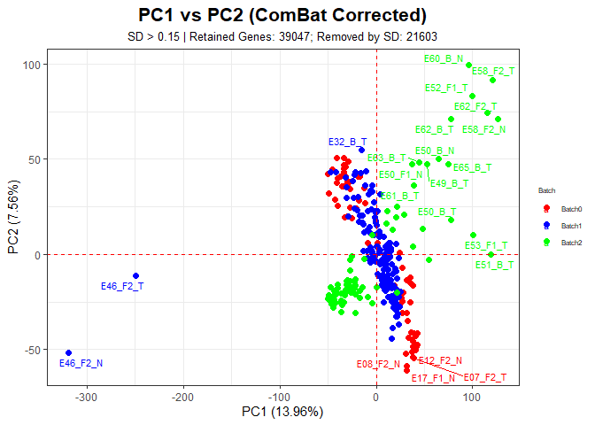<!-- -->
\# Combine exprdata with mini omnidata

    ##              E01_B_T  E01_F1_T   E02_B_T E02_F1_T   E02_F2_N
    ## A1BG     1.809891470 1.3829631 1.5241707 1.537369 3.52363084
    ## A1BG-AS1 0.887561267 0.8061787 1.0203132 1.046157 2.30597559
    ## A1CF     1.587415042 2.4651354 1.4901443 1.376748 2.38335710
    ## A2M      3.195587860 4.0961743 3.9051674 4.543657 4.39001852
    ## A2M-AS1  0.854299489 0.6856861 0.8420087 1.087017 0.06141289
    ## A2ML1    0.003697298 0.6589219 0.8743494 1.180699 0.06141289

    ##                 A1BG  A1BG-AS1     A1CF      A2M     A2M-AS1
    ## E01_B_T  1.809891470 0.8875613 1.587415 3.195588 0.854299489
    ## E01_F1_T 1.382963068 0.8061787 2.465135 4.096174 0.685686122
    ## E02_B_T  1.524170680 1.0203132 1.490144 3.905167 0.842008688
    ## E02_F1_T 1.537368520 1.0461572 1.376748 4.543657 1.087016594
    ## E02_F2_N 3.523630837 2.3059756 2.383357 4.390019 0.061412892
    ## E02_F2_T 0.009893545 1.3054013 1.864075 4.466877 0.009893545

    ##     Sample  ID Timepoint TissueType resp_or_not
    ## 1  E01_B_T E01         B          T        <NA>
    ## 2 E01_F1_T E01        F1          T        <NA>
    ## 3  E02_B_T E02         B          T        <NA>
    ## 4 E02_F1_T E02        F1          T        <NA>
    ## 5 E02_F2_N E02        F2          N        <NA>
    ## 6 E02_F2_T E02        F2          T        <NA>

    ## [1] "E36_F3_N" "E36_F3_T" "E48_F2_N" "E48_F2_T" "E48_F3_N" "E48_F3_T" "E49_F3_N"
    ## [8] "E49_F3_T"

    ## [1]   308 60655

    ##     Sample  ID Timepoint TissueType resp_or_not        A1BG  A1BG-AS1     A1CF
    ## 1  E01_B_T E01         B          T        <NA> 1.809891470 0.8875613 1.587415
    ## 2 E01_F1_T E01        F1          T        <NA> 1.382963068 0.8061787 2.465135
    ## 3  E02_B_T E02         B          T        <NA> 1.524170680 1.0203132 1.490144
    ## 4 E02_F1_T E02        F1          T        <NA> 1.537368520 1.0461572 1.376748
    ## 5 E02_F2_N E02        F2          N        <NA> 3.523630837 2.3059756 2.383357
    ## 6 E02_F2_T E02        F2          T        <NA> 0.009893545 1.3054013 1.864075
    ##        A2M     A2M-AS1
    ## 1 3.195588 0.854299489
    ## 2 4.096174 0.685686122
    ## 3 3.905167 0.842008688
    ## 4 4.543657 1.087016594
    ## 5 4.390019 0.061412892
    ## 6 4.466877 0.009893545

# Visualization

## Check Data Structure

    ## <environment: R_GlobalEnv>

    ## [1] 314

### Count patients

#### B

    ## [1] 49

    ## [1] 64

    ##  [1] "E14" "E15" "E17" "E18" "E20" "E21" "E22" "E23" "E24" "E25" "E26" "E27"
    ## [13] "E28" "E29" "E30" "E31" "E32" "E33" "E34" "E35" "E36" "E37" "E38" "E39"
    ## [25] "E40" "E41" "E42" "E43" "E44" "E45" "E46" "E47" "E49" "E50" "E52" "E53"
    ## [37] "E54" "E55" "E56" "E57" "E58" "E59" "E60" "E61" "E62" "E63" "E65" "E66"
    ## [49] "E67"

    ##  [1] "E01" "E02" "E03" "E04" "E05" "E06" "E07" "E08" "E09" "E10" "E11" "E12"
    ## [13] "E14" "E15" "E16" "E17" "E18" "E19" "E20" "E21" "E22" "E23" "E24" "E25"
    ## [25] "E26" "E27" "E28" "E29" "E30" "E31" "E32" "E33" "E34" "E35" "E36" "E37"
    ## [37] "E38" "E39" "E40" "E41" "E42" "E43" "E44" "E45" "E46" "E47" "E49" "E50"
    ## [49] "E51" "E52" "E53" "E54" "E55" "E56" "E57" "E58" "E59" "E60" "E61" "E62"
    ## [61] "E63" "E65" "E66" "E67"

    ## character(0)

-\> Baseline 65명

#### F1

    ## [1] 47

    ## [1] 61

    ##  [1] "E14" "E15" "E16" "E17" "E18" "E19" "E20" "E21" "E22" "E23" "E24" "E25"
    ## [13] "E26" "E27" "E28" "E29" "E30" "E31" "E32" "E33" "E34" "E35" "E36" "E37"
    ## [25] "E38" "E39" "E40" "E41" "E42" "E43" "E44" "E45" "E46" "E47" "E49" "E50"
    ## [37] "E51" "E52" "E54" "E55" "E56" "E57" "E58" "E61" "E65" "E66" "E67"

    ##  [1] "E01" "E02" "E03" "E04" "E05" "E06" "E07" "E08" "E09" "E10" "E11" "E12"
    ## [13] "E14" "E15" "E16" "E17" "E18" "E19" "E20" "E21" "E22" "E23" "E24" "E25"
    ## [25] "E26" "E27" "E28" "E29" "E30" "E31" "E32" "E33" "E34" "E35" "E36" "E37"
    ## [37] "E38" "E39" "E40" "E41" "E42" "E43" "E44" "E45" "E46" "E47" "E49" "E50"
    ## [49] "E51" "E52" "E53" "E54" "E55" "E56" "E57" "E58" "E59" "E61" "E65" "E66"
    ## [61] "E67"

    ## character(0)

-\> F1 62명

#### F2

    ## [1] 43

    ## [1] 44

    ##  [1] "E02" "E03" "E05" "E06" "E07" "E08" "E09" "E10" "E12" "E15" "E16" "E17"
    ## [13] "E18" "E20" "E21" "E22" "E23" "E24" "E25" "E26" "E27" "E28" "E29" "E30"
    ## [25] "E31" "E32" "E35" "E36" "E37" "E38" "E39" "E40" "E41" "E42" "E44" "E45"
    ## [37] "E46" "E49" "E54" "E55" "E57" "E58" "E59"

    ##  [1] "E02" "E03" "E05" "E06" "E07" "E08" "E09" "E10" "E12" "E15" "E16" "E17"
    ## [13] "E18" "E20" "E21" "E22" "E23" "E24" "E25" "E26" "E27" "E28" "E29" "E30"
    ## [25] "E31" "E32" "E35" "E36" "E37" "E38" "E39" "E40" "E41" "E42" "E44" "E45"
    ## [37] "E46" "E49" "E54" "E55" "E57" "E58" "E59" "E62"

    ## character(0)

-\> F2 44명 확인 위해 클립보드에 복사.

## Statistical Analysis

    ## [1] "Sample"      "ID"          "Timepoint"   "TissueType"  "resp_or_not"
    ## [6] "A1BG"

    ## [1] "A1BG"     "A1BG-AS1" "A1CF"     "A2M"      "A2M-AS1"  "A2ML1"

    ## [1] 0

## Division of dataframes

Note that resp_or_not has many NA values. So we will start from
resp_or_not.

    ## [1] 40

    ## [1] 23

    ## [1] 17

For 3 groups: R_B vs NR_B, R_F1 vs NR_F1, R_F2 vs NR_F2

    ## [1] 40

    ## [1] 38

    ## [1] 27

For 6 groups: R_B_N vs NR_B_N, R_B_T vs NR_B_T, R_F1_N vs NR_F1_N,
R_F1_T vs NR_F1_T, R_F2_N vs NR_F2_N, R_F2_T vs NR_F2_T

    ## [1] 40

    ## [1] 38

    ## [1] 27

    ## [1] 40

    ## [1] 38

    ## [1] 27

    ##       Sample  ID Timepoint TissueType resp_or_not       A1BG   A1BG-AS1
    ## 102 E24_F2_T E24        F2          T          NR 1.95618107 0.02044803
    ## 120 E27_F2_T E27        F2          T          NR 2.90272227 0.02102843
    ## 138 E30_F2_T E30        F2          T          NR 2.75475721 1.78744472
    ## 202 E41_F2_T E41        F2          T          NR 2.84921036 1.36728113
    ## 218 E44_F2_T E44        F2          T          NR 3.40401208 1.57586454
    ## 224 E45_F2_T E45        F2          T          NR 0.01469098 1.65336147
    ##            A1CF      A2M    A2M-AS1
    ## 102 1.547321297 3.787638 0.02044803
    ## 120 0.021028433 4.653497 1.28713965
    ## 138 1.542622820 5.064697 1.24137023
    ## 202 1.433272520 4.000252 0.01114792
    ## 218 0.008584371 6.468578 1.20911426
    ## 224 1.365610576 5.066226 0.01469098

## N vs NR

### R_B vs NR_B

    ##    GeneSymbol Normal_R_B Normal_NR_B Equal_Variance P_Rormal_R_B P_Rormal_NR_B
    ## 1        TMC7      FALSE        TRUE           TRUE       0.0080        0.2825
    ## 2        CD24      FALSE       FALSE           TRUE       0.0021        0.0237
    ## 3        MSLN      FALSE       FALSE           TRUE       0.0219        0.0064
    ## 4       GABRP      FALSE       FALSE           TRUE       0.0001        0.0010
    ## 5     SLCO1B3      FALSE       FALSE           TRUE       0.0000        0.0000
    ## 6     NECTIN4      FALSE       FALSE           TRUE       0.0005        0.0414
    ## 7       FGFR2      FALSE        TRUE          FALSE       0.0362        0.0747
    ## 8     SLC6A14      FALSE       FALSE           TRUE       0.0001        0.0016
    ## 9        ARSL       TRUE        TRUE           TRUE       0.2248        0.5231
    ## 10       ERN2       TRUE        TRUE           TRUE       0.4484        0.7968
    ##    P_Equal_Var
    ## 1       0.3316
    ## 2       0.0982
    ## 3       0.8411
    ## 4       0.2334
    ## 5       0.7228
    ## 6       0.7259
    ## 7       0.0015
    ## 8       0.3091
    ## 9       0.1853
    ## 10      0.4791

    ## Warning in wilcox.test.default(expr_R, expr_NR, alternative = "less"): cannot
    ## compute exact p-value with ties
    ## Warning in wilcox.test.default(expr_R, expr_NR, alternative = "less"): cannot
    ## compute exact p-value with ties

    ##    GeneSymbol    TestUsed Significant P_Value
    ## 1        TMC7 wilcox-test       FALSE  0.6630
    ## 2        CD24 wilcox-test       FALSE  0.2162
    ## 3        MSLN wilcox-test       FALSE  0.9196
    ## 4       GABRP wilcox-test        TRUE  0.0383
    ## 5     SLCO1B3 wilcox-test       FALSE  0.7431
    ## 6     NECTIN4 wilcox-test       FALSE  0.1955
    ## 7       FGFR2 wilcox-test       FALSE  0.5271
    ## 8     SLC6A14 wilcox-test       FALSE  0.4484
    ## 9        ARSL      t-test       FALSE  0.8470
    ## 10       ERN2      t-test       FALSE  0.6287

### R_F1 vs NR_F1

    ##    GeneSymbol Normal_R_F1 Normal_NR_F1 Equal_Variance P_Rormal_R_F1
    ## 1        TMC7       FALSE        FALSE           TRUE        0.0048
    ## 2        CD24        TRUE        FALSE           TRUE        0.0836
    ## 3        MSLN       FALSE        FALSE           TRUE        0.0008
    ## 4       GABRP       FALSE         TRUE           TRUE        0.0037
    ## 5     SLCO1B3       FALSE        FALSE           TRUE        0.0000
    ## 6     NECTIN4       FALSE        FALSE           TRUE        0.0018
    ## 7       FGFR2       FALSE         TRUE          FALSE        0.0001
    ## 8     SLC6A14       FALSE        FALSE           TRUE        0.0000
    ## 9        ARSL       FALSE         TRUE           TRUE        0.0039
    ## 10       ERN2        TRUE         TRUE           TRUE        0.4640
    ##    P_Rormal_NR_F1 P_Equal_Var
    ## 1          0.0268      0.5948
    ## 2          0.0037      0.7965
    ## 3          0.0083      0.6921
    ## 4          0.4497      0.6569
    ## 5          0.0000      0.9926
    ## 6          0.0132      0.8960
    ## 7          0.0863      0.0402
    ## 8          0.0000      0.8006
    ## 9          0.1619      0.3582
    ## 10         0.0621      0.4709

    ## Warning in wilcox.test.default(expr_R, expr_NR, alternative = "less"): cannot
    ## compute exact p-value with ties
    ## Warning in wilcox.test.default(expr_R, expr_NR, alternative = "less"): cannot
    ## compute exact p-value with ties
    ## Warning in wilcox.test.default(expr_R, expr_NR, alternative = "less"): cannot
    ## compute exact p-value with ties
    ## Warning in wilcox.test.default(expr_R, expr_NR, alternative = "less"): cannot
    ## compute exact p-value with ties

    ##    GeneSymbol    TestUsed Significant P_Value
    ## 1        TMC7 wilcox-test       FALSE  0.4700
    ## 2        CD24 wilcox-test       FALSE  0.0543
    ## 3        MSLN wilcox-test       FALSE  0.9945
    ## 4       GABRP wilcox-test        TRUE  0.0304
    ## 5     SLCO1B3 wilcox-test       FALSE  0.5530
    ## 6     NECTIN4 wilcox-test       FALSE  0.2500
    ## 7       FGFR2 wilcox-test       FALSE  0.2356
    ## 8     SLC6A14 wilcox-test       FALSE  0.5894
    ## 9        ARSL wilcox-test       FALSE  0.3705
    ## 10       ERN2      t-test       FALSE  0.3744

### R_F2 vs NR_F2

    ##    GeneSymbol Normal_R_F2 Normal_NR_F2 Equal_Variance P_Rormal_R_F2
    ## 1        TMC7       FALSE        FALSE           TRUE        0.0055
    ## 2        CD24       FALSE        FALSE           TRUE        0.0027
    ## 3        MSLN       FALSE         TRUE           TRUE        0.0210
    ## 4       GABRP       FALSE         TRUE           TRUE        0.0490
    ## 5     SLCO1B3       FALSE        FALSE          FALSE        0.0000
    ## 6     NECTIN4       FALSE        FALSE           TRUE        0.0028
    ## 7       FGFR2        TRUE         TRUE           TRUE        0.0624
    ## 8     SLC6A14       FALSE        FALSE           TRUE        0.0004
    ## 9        ARSL       FALSE         TRUE           TRUE        0.0314
    ## 10       ERN2        TRUE         TRUE           TRUE        0.7411
    ##    P_Rormal_NR_F2 P_Equal_Var
    ## 1          0.0089      0.9301
    ## 2          0.0120      0.6206
    ## 3          0.0857      0.2989
    ## 4          0.1878      0.6127
    ## 5          0.0000      0.0000
    ## 6          0.0204      0.9669
    ## 7          0.2410      0.7118
    ## 8          0.0034      0.3387
    ## 9          0.1797      0.7593
    ## 10         0.9105      0.4373

    ## Warning in wilcox.test.default(expr_R, expr_NR, alternative = "less"): cannot
    ## compute exact p-value with ties
    ## Warning in wilcox.test.default(expr_R, expr_NR, alternative = "less"): cannot
    ## compute exact p-value with ties

    ##    GeneSymbol    TestUsed Significant P_Value
    ## 1        TMC7 wilcox-test       FALSE  0.7153
    ## 2        CD24 wilcox-test       FALSE  0.4319
    ## 3        MSLN wilcox-test       FALSE  0.9630
    ## 4       GABRP wilcox-test       FALSE  0.5357
    ## 5     SLCO1B3 wilcox-test       FALSE  0.8336
    ## 6     NECTIN4 wilcox-test       FALSE  0.8835
    ## 7       FGFR2      t-test       FALSE  0.8329
    ## 8     SLC6A14 wilcox-test       FALSE  0.8022
    ## 9        ARSL wilcox-test       FALSE  0.2847
    ## 10       ERN2      t-test       FALSE  0.7861

### Box + Violin plots

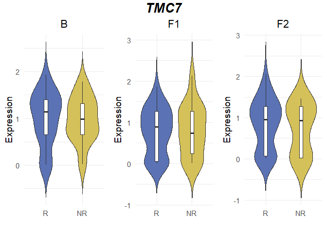<!-- -->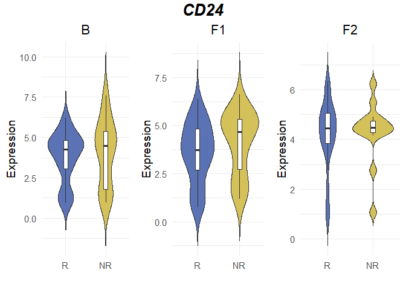<!-- -->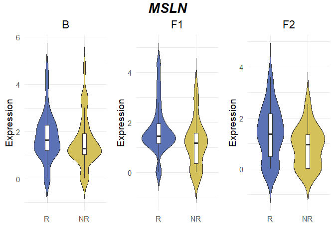<!-- -->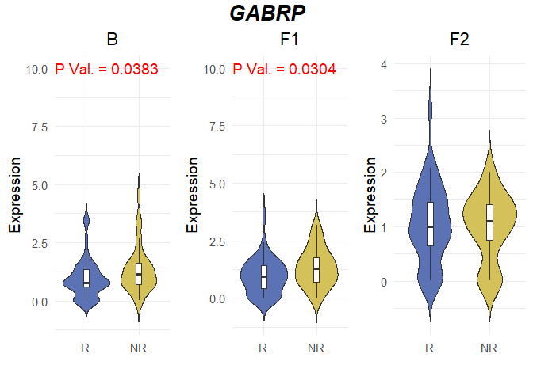<!-- -->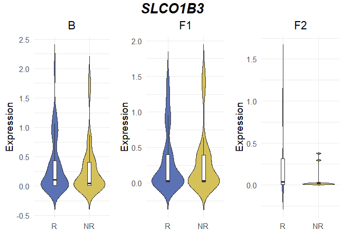<!-- -->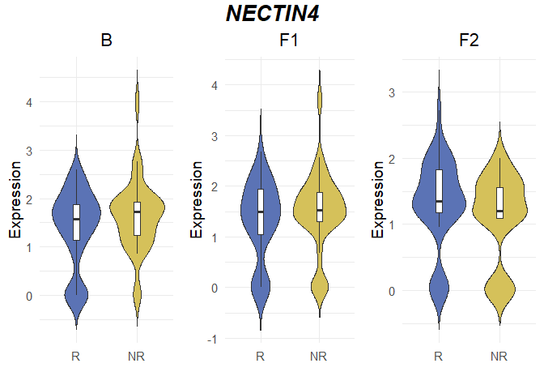<!-- -->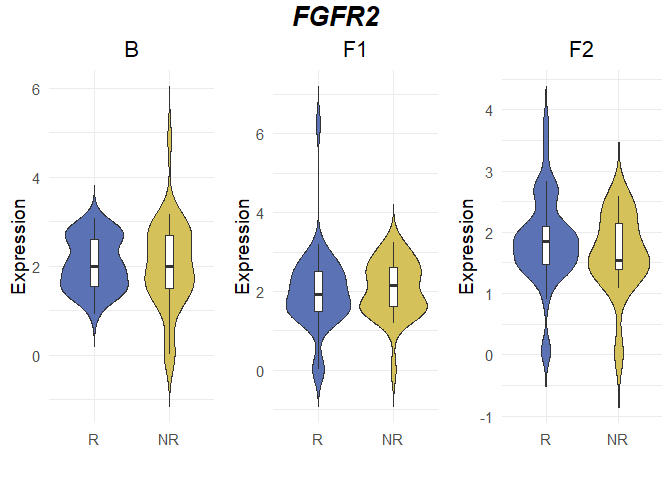<!-- -->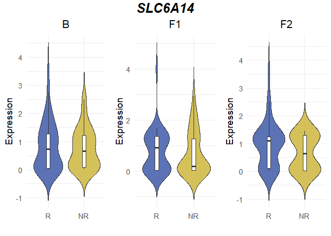<!-- -->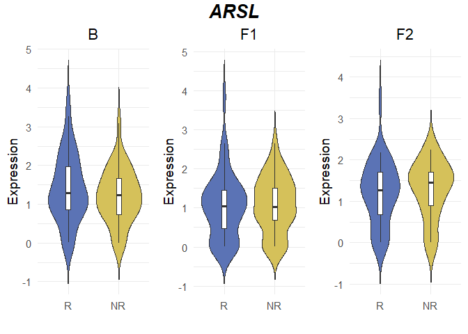<!-- -->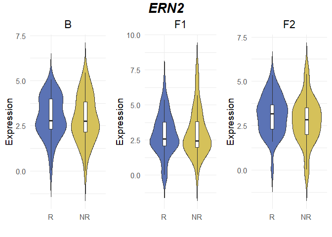<!-- -->
\### PDF

    ## png 
    ##   2

## N vs NR in Normal and Tumor

### B

#### R_N vs NR_N

    ##    GeneSymbol Normal_R_B_N Normal_NR_B_N Equal_Variance P_Rormal_R_B_N
    ## 1        TMC7        FALSE          TRUE           TRUE         0.0111
    ## 2        CD24        FALSE          TRUE           TRUE         0.0211
    ## 3        MSLN         TRUE          TRUE           TRUE         0.2411
    ## 4       GABRP        FALSE         FALSE           TRUE         0.0252
    ## 5     SLCO1B3        FALSE         FALSE           TRUE         0.0000
    ## 6     NECTIN4        FALSE          TRUE           TRUE         0.0071
    ## 7       FGFR2         TRUE         FALSE          FALSE         0.0504
    ## 8     SLC6A14        FALSE         FALSE           TRUE         0.0000
    ## 9        ARSL         TRUE          TRUE           TRUE         0.2387
    ## 10       ERN2         TRUE          TRUE           TRUE         0.4873
    ##    P_Rormal_NR_B_N P_Equal_Var
    ## 1           0.2219      0.8260
    ## 2           0.0752      0.4597
    ## 3           0.3244      0.3733
    ## 4           0.0401      0.1836
    ## 5           0.0007      0.0766
    ## 6           0.0505      0.9193
    ## 7           0.0073      0.0362
    ## 8           0.0053      0.3261
    ## 9           0.1972      0.9997
    ## 10          0.5500      0.1969

    ##    GeneSymbol    TestUsed Significant P_Value
    ## 1        TMC7 wilcox-test        TRUE  0.0499
    ## 2        CD24 wilcox-test       FALSE  0.2165
    ## 3        MSLN      t-test       FALSE  0.7234
    ## 4       GABRP wilcox-test       FALSE  0.1222
    ## 5     SLCO1B3 wilcox-test       FALSE  0.5249
    ## 6     NECTIN4 wilcox-test       FALSE  0.0647
    ## 7       FGFR2 wilcox-test       FALSE  0.5000
    ## 8     SLC6A14 wilcox-test       FALSE  0.0689
    ## 9        ARSL      t-test       FALSE  0.6124
    ## 10       ERN2      t-test       FALSE  0.7207

#### R_T vs NR_T

    ##    GeneSymbol Normal_R_B_T Normal_NR_B_T Equal_Variance P_Rormal_R_B_T
    ## 1        TMC7         TRUE          TRUE           TRUE         0.3485
    ## 2        CD24         TRUE          TRUE           TRUE         0.0801
    ## 3        MSLN        FALSE          TRUE           TRUE         0.0064
    ## 4       GABRP        FALSE         FALSE           TRUE         0.0012
    ## 5     SLCO1B3        FALSE         FALSE           TRUE         0.0005
    ## 6     NECTIN4         TRUE          TRUE           TRUE         0.1241
    ## 7       FGFR2         TRUE         FALSE          FALSE         0.3589
    ## 8     SLC6A14         TRUE          TRUE           TRUE         0.2946
    ## 9        ARSL         TRUE          TRUE           TRUE         0.9612
    ## 10       ERN2         TRUE          TRUE           TRUE         0.5880
    ##    P_Rormal_NR_B_T P_Equal_Var
    ## 1           0.5390      0.6902
    ## 2           0.2919      0.0963
    ## 3           0.0565      0.4201
    ## 4           0.0074      0.4938
    ## 5           0.0003      0.7699
    ## 6           0.2154      0.8483
    ## 7           0.0401      0.0239
    ## 8           0.0987      0.5327
    ## 9           0.2454      0.1606
    ## 10          0.3523      0.9195

    ## Warning in wilcox.test.default(expr_R, expr_NR, alternative = "less"): cannot
    ## compute exact p-value with ties

    ##    GeneSymbol    TestUsed Significant P_Value
    ## 1        TMC7      t-test       FALSE  0.9796
    ## 2        CD24      t-test       FALSE  0.3383
    ## 3        MSLN wilcox-test       FALSE  0.8614
    ## 4       GABRP wilcox-test       FALSE  0.0704
    ## 5     SLCO1B3 wilcox-test       FALSE  0.7355
    ## 6     NECTIN4      t-test       FALSE  0.4154
    ## 7       FGFR2 wilcox-test       FALSE  0.5751
    ## 8     SLC6A14      t-test       FALSE  0.8448
    ## 9        ARSL      t-test       FALSE  0.8326
    ## 10       ERN2      t-test       FALSE  0.4808

### F1

#### R_N vs NR_N

    ##    GeneSymbol Normal_R_F1_N Normal_NR_F1_N Equal_Variance P_Rormal_R_F1_N
    ## 1        TMC7         FALSE          FALSE           TRUE          0.0031
    ## 2        CD24         FALSE          FALSE           TRUE          0.0317
    ## 3        MSLN          TRUE          FALSE           TRUE          0.0777
    ## 4       GABRP         FALSE           TRUE           TRUE          0.0133
    ## 5     SLCO1B3         FALSE          FALSE          FALSE          0.0001
    ## 6     NECTIN4         FALSE          FALSE           TRUE          0.0289
    ## 7       FGFR2          TRUE           TRUE           TRUE          0.1197
    ## 8     SLC6A14         FALSE          FALSE           TRUE          0.0004
    ## 9        ARSL         FALSE           TRUE           TRUE          0.0404
    ## 10       ERN2         FALSE          FALSE           TRUE          0.0185
    ##    P_Rormal_NR_F1_N P_Equal_Var
    ## 1            0.0144      0.9900
    ## 2            0.0055      0.9496
    ## 3            0.0264      0.6673
    ## 4            0.5353      0.5941
    ## 5            0.0005      0.0015
    ## 6            0.0014      0.6962
    ## 7            0.1424      0.2125
    ## 8            0.0002      0.7259
    ## 9            0.2560      0.2478
    ## 10           0.0096      0.3278

    ## Warning in wilcox.test.default(expr_R, expr_NR, alternative = "less"): cannot
    ## compute exact p-value with ties
    ## Warning in wilcox.test.default(expr_R, expr_NR, alternative = "less"): cannot
    ## compute exact p-value with ties
    ## Warning in wilcox.test.default(expr_R, expr_NR, alternative = "less"): cannot
    ## compute exact p-value with ties
    ## Warning in wilcox.test.default(expr_R, expr_NR, alternative = "less"): cannot
    ## compute exact p-value with ties

    ##    GeneSymbol    TestUsed Significant P_Value
    ## 1        TMC7 wilcox-test       FALSE  0.2079
    ## 2        CD24 wilcox-test       FALSE  0.3150
    ## 3        MSLN wilcox-test       FALSE  0.9947
    ## 4       GABRP wilcox-test       FALSE  0.2544
    ## 5     SLCO1B3 wilcox-test       FALSE  0.7482
    ## 6     NECTIN4 wilcox-test       FALSE  0.5071
    ## 7       FGFR2      t-test       FALSE  0.3186
    ## 8     SLC6A14 wilcox-test       FALSE  0.5360
    ## 9        ARSL wilcox-test       FALSE  0.2876
    ## 10       ERN2 wilcox-test       FALSE  0.6722

#### R_T vs NR_T

    ##    GeneSymbol Normal_R_F1_T Normal_NR_F1_T Equal_Variance P_Rormal_R_F1_T
    ## 1        TMC7          TRUE           TRUE           TRUE          0.0879
    ## 2        CD24          TRUE           TRUE           TRUE          0.5949
    ## 3        MSLN         FALSE           TRUE           TRUE          0.0031
    ## 4       GABRP          TRUE           TRUE           TRUE          0.1573
    ## 5     SLCO1B3         FALSE          FALSE           TRUE          0.0002
    ## 6     NECTIN4         FALSE           TRUE           TRUE          0.0379
    ## 7       FGFR2         FALSE          FALSE          FALSE          0.0032
    ## 8     SLC6A14         FALSE          FALSE           TRUE          0.0007
    ## 9        ARSL          TRUE           TRUE           TRUE          0.1329
    ## 10       ERN2          TRUE           TRUE           TRUE          0.4069
    ##    P_Rormal_NR_F1_T P_Equal_Var
    ## 1            0.6623      0.1606
    ## 2            0.2226      0.5982
    ## 3            0.2655      0.4812
    ## 4            0.1444      0.3648
    ## 5            0.0015      0.6376
    ## 6            0.1004      0.9918
    ## 7            0.0494      0.0002
    ## 8            0.0151      0.7899
    ## 9            0.5207      0.0763
    ## 10           0.5400      0.7074

    ## Warning in wilcox.test.default(expr_R, expr_NR, alternative = "less"): cannot
    ## compute exact p-value with ties

    ##    GeneSymbol    TestUsed Significant P_Value
    ## 1        TMC7      t-test       FALSE  0.5376
    ## 2        CD24      t-test       FALSE  0.0617
    ## 3        MSLN wilcox-test       FALSE  0.8829
    ## 4       GABRP      t-test        TRUE  0.0109
    ## 5     SLCO1B3 wilcox-test       FALSE  0.3669
    ## 6     NECTIN4 wilcox-test       FALSE  0.1421
    ## 7       FGFR2 wilcox-test       FALSE  0.2459
    ## 8     SLC6A14 wilcox-test       FALSE  0.5523
    ## 9        ARSL      t-test       FALSE  0.6819
    ## 10       ERN2      t-test       FALSE  0.3682

### F2

#### R_N vs NR_N

    ##    GeneSymbol Normal_R_F2_N Normal_NR_F2_N Equal_Variance P_Rormal_R_F2_N
    ## 1        TMC7         FALSE           TRUE           TRUE          0.0293
    ## 2        CD24         FALSE           TRUE           TRUE          0.0116
    ## 3        MSLN         FALSE           TRUE           TRUE          0.0480
    ## 4       GABRP          TRUE           TRUE           TRUE          0.2716
    ## 5     SLCO1B3         FALSE          FALSE          FALSE          0.0000
    ## 6     NECTIN4         FALSE           TRUE           TRUE          0.0381
    ## 7       FGFR2          TRUE           TRUE           TRUE          0.1122
    ## 8     SLC6A14         FALSE          FALSE           TRUE          0.0053
    ## 9        ARSL         FALSE           TRUE           TRUE          0.0445
    ## 10       ERN2          TRUE           TRUE           TRUE          0.4226
    ##    P_Rormal_NR_F2_N P_Equal_Var
    ## 1            0.0823      0.6501
    ## 2            0.3545      0.2799
    ## 3            0.0962      0.6075
    ## 4            0.2440      0.8910
    ## 5            0.0000      0.0147
    ## 6            0.0611      0.4870
    ## 7            0.4248      0.8148
    ## 8            0.0029      0.9518
    ## 9            0.6052      0.3693
    ## 10           0.8938      0.1094

    ##    GeneSymbol    TestUsed Significant P_Value
    ## 1        TMC7 wilcox-test       FALSE  0.5672
    ## 2        CD24 wilcox-test       FALSE  0.4551
    ## 3        MSLN wilcox-test       FALSE  0.8182
    ## 4       GABRP      t-test       FALSE  0.6207
    ## 5     SLCO1B3 wilcox-test       FALSE  0.8471
    ## 6     NECTIN4 wilcox-test       FALSE  0.9059
    ## 7       FGFR2      t-test       FALSE  0.7059
    ## 8     SLC6A14 wilcox-test       FALSE  0.8471
    ## 9        ARSL wilcox-test       FALSE  0.6111
    ## 10       ERN2      t-test       FALSE  0.5583

#### R_T vs NR_T

    ##    GeneSymbol Normal_R_F2_T Normal_NR_F2_T Equal_Variance P_Rormal_R_F2_T
    ## 1        TMC7          TRUE           TRUE           TRUE          0.1597
    ## 2        CD24          TRUE          FALSE           TRUE          0.1898
    ## 3        MSLN          TRUE           TRUE           TRUE          0.2254
    ## 4       GABRP          TRUE           TRUE           TRUE          0.2167
    ## 5     SLCO1B3         FALSE          FALSE          FALSE          0.0001
    ## 6     NECTIN4         FALSE           TRUE           TRUE          0.0416
    ## 7       FGFR2          TRUE           TRUE           TRUE          0.0500
    ## 8     SLC6A14         FALSE           TRUE           TRUE          0.0249
    ## 9        ARSL          TRUE           TRUE           TRUE          0.2702
    ## 10       ERN2          TRUE           TRUE           TRUE          0.6061
    ##    P_Rormal_NR_F2_T P_Equal_Var
    ## 1            0.1447      0.8883
    ## 2            0.0057      0.4639
    ## 3            0.4646      0.6227
    ## 4            0.8785      0.5887
    ## 5            0.0000      0.0058
    ## 6            0.5807      0.0799
    ## 7            0.0822      0.3383
    ## 8            0.0935      0.2482
    ## 9            0.1494      0.1407
    ## 10           0.5656      0.4061

    ## Warning in wilcox.test.default(expr_R, expr_NR, alternative = "less"): cannot
    ## compute exact p-value with ties

    ##    GeneSymbol    TestUsed Significant P_Value
    ## 1        TMC7      t-test       FALSE  0.7401
    ## 2        CD24 wilcox-test       FALSE  0.4892
    ## 3        MSLN      t-test       FALSE  0.9299
    ## 4       GABRP      t-test       FALSE  0.4710
    ## 5     SLCO1B3 wilcox-test       FALSE  0.6090
    ## 6     NECTIN4 wilcox-test       FALSE  0.6772
    ## 7       FGFR2      t-test       FALSE  0.8161
    ## 8     SLC6A14 wilcox-test       FALSE  0.5961
    ## 9        ARSL      t-test       FALSE  0.2325
    ## 10       ERN2      t-test       FALSE  0.8874

### Box + Violin plots

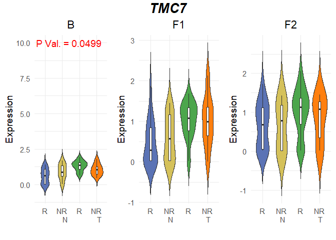<!-- -->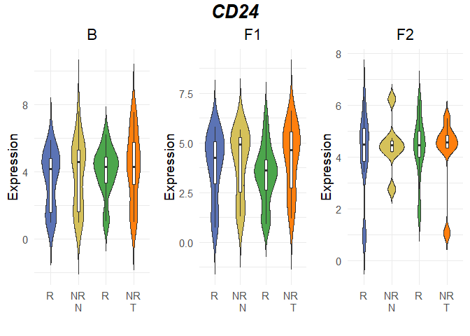<!-- -->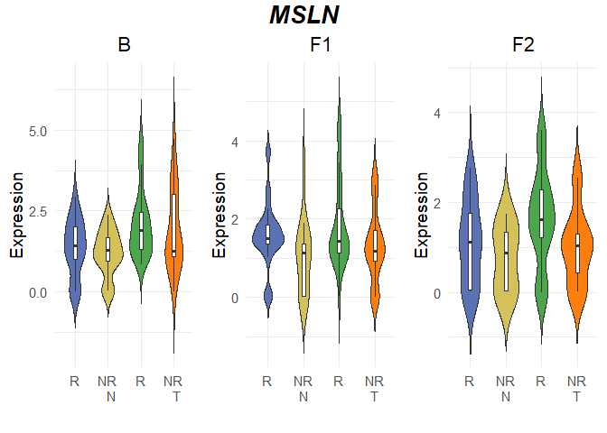<!-- -->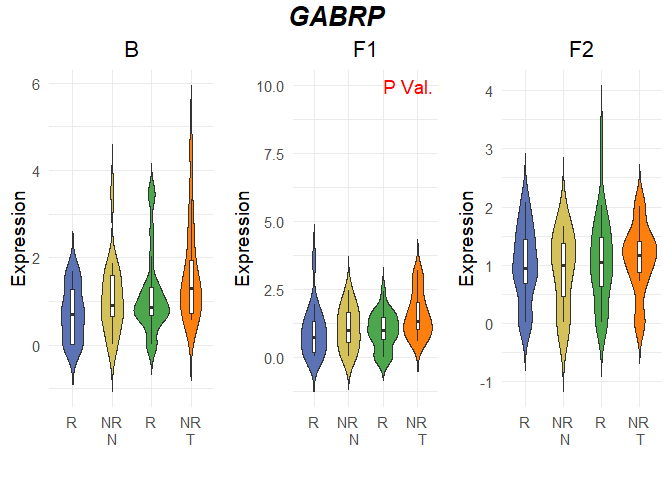<!-- -->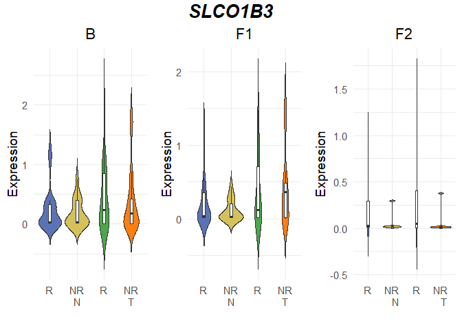<!-- -->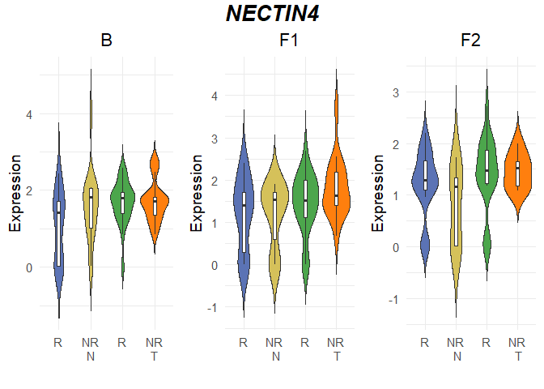<!-- -->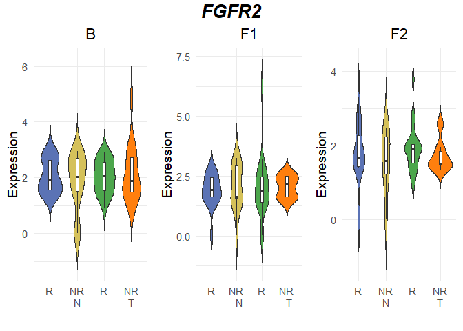<!-- -->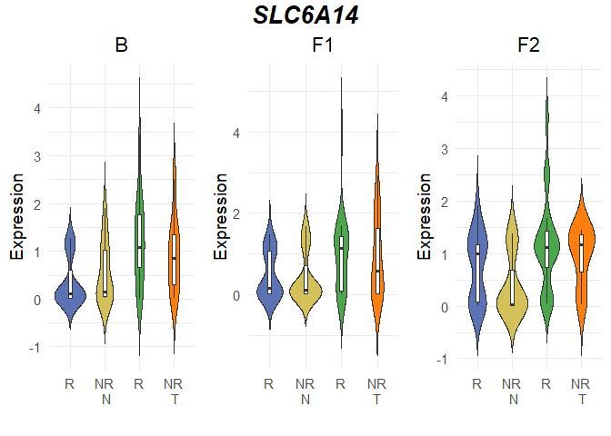<!-- -->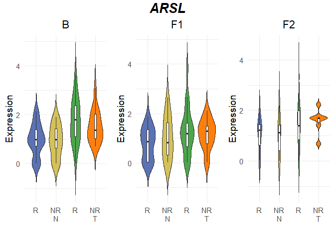<!-- -->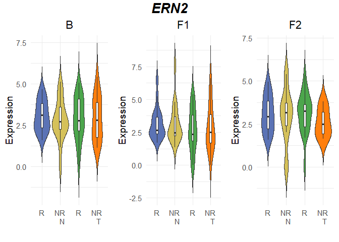<!-- -->
\### PDF

    ## png 
    ##   2

# IHC data for CLDN 18

IHC데이터 내 환자들을, 분리한 df들에서 추려내서 cldn18 분석 진행.

    ##   Patients Baseline FU1 FU2
    ## 1      E04        0  NA  NA
    ## 2      E09        0   0  NA
    ## 3      E10        0   0  NA
    ## 4      E12       40  NA  10
    ## 5      E14       95  NA  NA
    ## 6      E20        0   0   0

    ##     Sample  ID Timepoint TissueType resp_or_not
    ## 11 E04_B_T E04         B          T           R
    ## 29 E09_B_T E09         B          T           R
    ## 33 E10_B_T E10         B          T           R
    ## 39 E12_B_T E12         B          T           R
    ## 73 E20_B_N E20         B          N           R
    ## 74 E20_B_T E20         B          T           R

## Matching Patients

    ## [1] "R_B: 23"

    ## [1] "R_B and CLDN18+: 7"

    ## [1] "R_B and CLDN18-: 16"

    ## [1] "NR_B: 17"

    ## [1] "NR_B and CLDN18+: 6"

    ## [1] "NR_B and CLDN18-: 11"

    ## [1] "R_F1: 22"

    ## [1] "R_F1 and CLDN18+: 6"

    ## [1] "R_F1 and CLDN18-: 16"

    ## [1] "NR_F1: 16"

    ## [1] "NR_F1 and CLDN18+: 6"

    ## [1] "NR_F1 and CLDN18-: 10"

    ## [1] "R_F2: 20"

    ## [1] "R_F2 and CLDN18+: 6"

    ## [1] "R_F2 and CLDN18-: 14"

    ## [1] "NR_F2: 7"

    ## [1] "NR_F2 and CLDN18+: 3"

    ## [1] "NR_F2 and CLDN18-: 4"

    ## B part

    ## [1] 7

    ## [1] 16

    ## [1] 6

    ## [1] 11

    ## F1 part

    ## [1] 6

    ## [1] 16

    ## [1] 6

    ## [1] 10

    ## F2 part

    ## [1] 6

    ## [1] 14

    ## [1] 3

    ## [1] 4

## Statistical Analysis

### B

#### CLDN+ R vs NR

    ##   GeneSymbol Normal_R_B_N Normal_NR_B_N Equal_Variance P_Rormal_R_B_N
    ## 1     CLDN18         TRUE          TRUE           TRUE         0.5618
    ##   P_Rormal_NR_B_N P_Equal_Var
    ## 1          0.1012      0.7104

    ##   GeneSymbol TestUsed Significant P_Value
    ## 1     CLDN18   t-test       FALSE  0.9294

#### CLDN- R vs NR

    ##   GeneSymbol Normal_R_B_N Normal_NR_B_N Equal_Variance P_Rormal_R_B_N
    ## 1     CLDN18        FALSE         FALSE           TRUE          0.004
    ##   P_Rormal_NR_B_N P_Equal_Var
    ## 1          0.0367      0.9658

    ##   GeneSymbol    TestUsed Significant P_Value
    ## 1     CLDN18 wilcox-test       FALSE  0.3894

### F1

#### CLDN+ R vs NR

    ##   GeneSymbol Normal_R_F1_N Normal_NR_F1_N Equal_Variance P_Rormal_R_F1_N
    ## 1     CLDN18          TRUE          FALSE           TRUE          0.7793
    ##   P_Rormal_NR_F1_N P_Equal_Var
    ## 1           0.0032      0.2686

    ##   GeneSymbol    TestUsed Significant P_Value
    ## 1     CLDN18 wilcox-test       FALSE  0.8407

#### CLDN- R vs NR

    ##   GeneSymbol Normal_R_F1_N Normal_NR_F1_N Equal_Variance P_Rormal_R_F1_N
    ## 1     CLDN18         FALSE           TRUE           TRUE          0.0283
    ##   P_Rormal_NR_F1_N P_Equal_Var
    ## 1           0.0593      0.9013

    ##   GeneSymbol    TestUsed Significant P_Value
    ## 1     CLDN18 wilcox-test        TRUE  0.0405

### F2

#### CLDN+ R vs NR

    ##   GeneSymbol Normal_R_F2_N Normal_NR_F2_N Equal_Variance P_Rormal_R_F2_N
    ## 1     CLDN18          TRUE           TRUE           TRUE           0.519
    ##   P_Rormal_NR_F2_N P_Equal_Var
    ## 1           0.2268      0.0924

    ##   GeneSymbol TestUsed Significant P_Value
    ## 1     CLDN18   t-test       FALSE  0.5534

#### CLDN- R vs NR

    ##   GeneSymbol Normal_R_F2_N Normal_NR_F2_N Equal_Variance P_Rormal_R_F2_N
    ## 1     CLDN18         FALSE           TRUE          FALSE          0.0392
    ##   P_Rormal_NR_F2_N P_Equal_Var
    ## 1           0.3706      0.0017

    ##   GeneSymbol    TestUsed Significant P_Value
    ## 1     CLDN18 wilcox-test        TRUE  0.0085

### Box + Violin plots

### PDF

    ## png 
    ##   2
