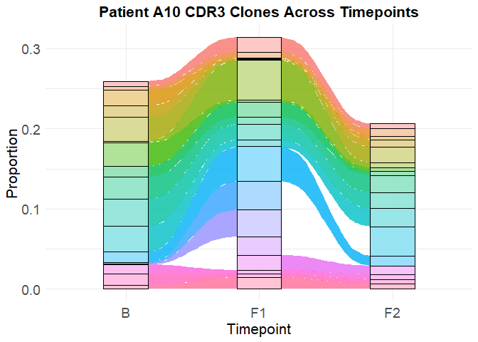
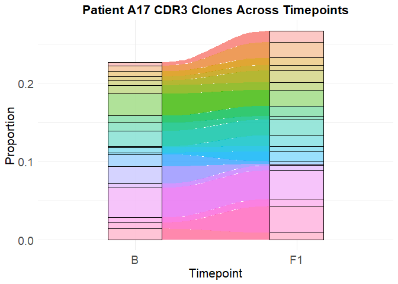
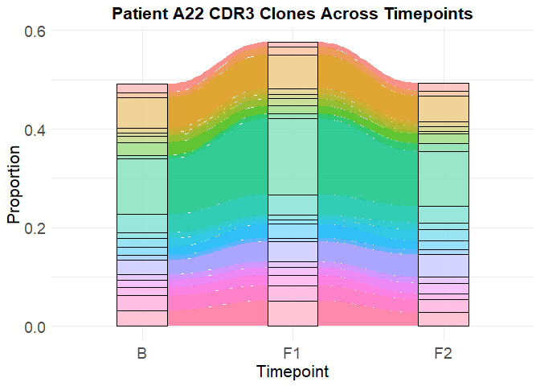
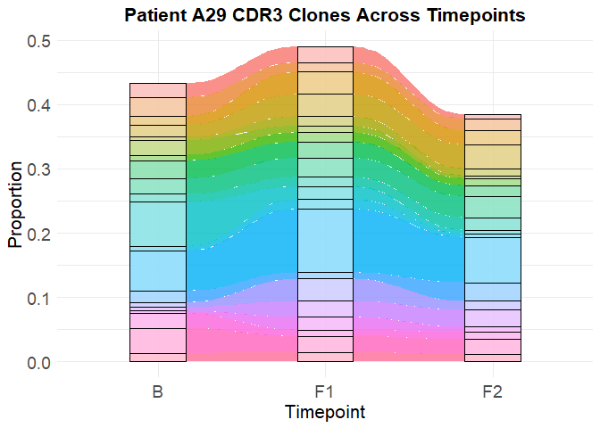
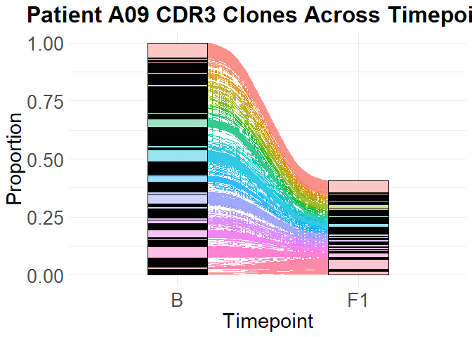
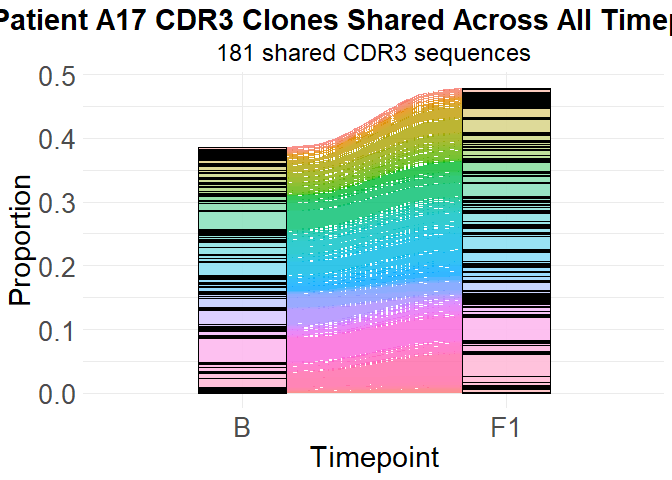
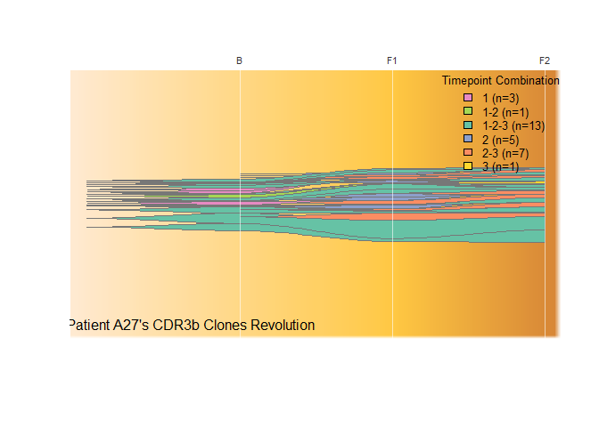
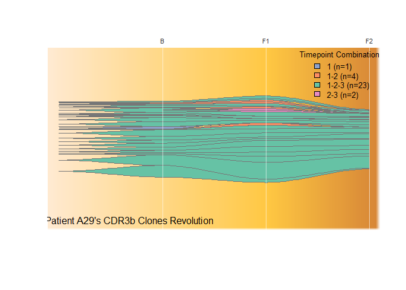

CDR3b Alluvial, box, fishplots of VT projects
================

This executes the following steps: 1. Load and preprocess TCR data
created from Cell Ranger. 2. Create alluvial plots for patients with
shared CDR3bs across all timepoints. 3. Create boxplots comparing the
ratio of shared CDR3bs between baseline and F1 for responders (R) vs
non-responders (NR) and ATMmut patients. `ATMmut` represents sample from
patients with ATM mutations, which are known to be associated with
responder. However, under the VT project, ATMmut-patients are actaully
non-responders. 4. Create Fish plots for the same data. Via the
fishplots, see how many unique CDR3bs show up in each timepoint: B, F1,
F2.

This markdown was run on R version: 4.5.1

``` r
# Load the required libraries
library(ggplot2)
library(readr)
library(readxl)
library(skimr)
library(dplyr)
```

    ## 
    ## Attaching package: 'dplyr'

    ## The following objects are masked from 'package:stats':
    ## 
    ##     filter, lag

    ## The following objects are masked from 'package:base':
    ## 
    ##     intersect, setdiff, setequal, union

``` r
library(ggalluvial)
library(fishplot)
```

    ## Using fishPlot version 0.5.2

``` r
library(RColorBrewer)
library(stringdist)
library(grid)
library(gridExtra)
```

    ## 
    ## Attaching package: 'gridExtra'

    ## The following object is masked from 'package:dplyr':
    ## 
    ##     combine

``` r
# Set seed for reproducibility
set.seed(42)
# Use the normal numerical representation
options(scipen = 999)

output_dir <- "outputs"
TCR_data_dir <- "TCR_data/original_files_backup"
```

250512기준 B,F1,F2가 온전하게 없는 환자: Found 8 patients with missing
timepoints: A09 is missing: F2 A14 is missing: F2 A16 is missing: F1, F2
A17 is missing: F2 A25 is missing: F1, F2 A28 is missing: F1 A31 is
missing: F1, F2

Summary of missing timepoints: BL: 0 patients missing this timepoint F1:
5 patients missing this timepoint F2: 6 patients missing this timepoint

# Load and preprocess data

## TCR data

``` r
csv_files <- list.files(path = TCR_data_dir, pattern = "_filtered_contig_annotations*\\.csv$", full.names = TRUE)
head(csv_files); tail(csv_files)
```

    ## [1] "TCR_data/original_files_backup/A10_F1_filtered_contig_annotations.csv"     
    ## [2] "TCR_data/original_files_backup/B11-A-1-09B_filtered_contig_annotations.csv"
    ## [3] "TCR_data/original_files_backup/B11-A-1-09F_filtered_contig_annotations.csv"
    ## [4] "TCR_data/original_files_backup/B11-A-1-10B_filtered_contig_annotations.csv"
    ## [5] "TCR_data/original_files_backup/B11-A-1-11B_filtered_contig_annotations.csv"
    ## [6] "TCR_data/original_files_backup/B11-A-1-11F_filtered_contig_annotations.csv"

    ## [1] "TCR_data/original_files_backup/B11-A33_BL_filtered_contig_annotations.csv" 
    ## [2] "TCR_data/original_files_backup/B11-A33_FU1_filtered_contig_annotations.csv"
    ## [3] "TCR_data/original_files_backup/B11-A33_FU2_filtered_contig_annotations.csv"
    ## [4] "TCR_data/original_files_backup/B11-A34_BL_filtered_contig_annotations.csv" 
    ## [5] "TCR_data/original_files_backup/B11-A34_FU1_filtered_contig_annotations.csv"
    ## [6] "TCR_data/original_files_backup/B11-A34_FU2_filtered_contig_annotations.csv"

``` r
# Process each subdirectory
for(subdir in subdirs) {
    # Get the name of the subdirectory (e.g., "A11F2")
    subdir_name <- basename(subdir)
    
    # Construct the path to the TCR directory and CSV file
    tcr_csv_path <- file.path(subdir, "TCR", "filtered_contig_annotations.csv")
    
    # Check if the file exists
    if(file.exists(tcr_csv_path)) {
        # Read the CSV file and add to the list with the subdirectory name
      suppressMessages({
        suppressWarnings({
          tcr_data_list[[subdir_name]] <- read_csv(tcr_csv_path)
        })
      })
      cat("Loaded:", subdir_name, "\n")
    } 
    else {
      cat("File not found:", tcr_csv_path, "\n")
    }
}
```

    ## Loaded: A09B 
    ## Loaded: A09F1 
    ## Loaded: A10B 
    ## Loaded: A10F1 
    ## Loaded: A10F2 
    ## Loaded: A11B 
    ## Loaded: A11F1 
    ## Loaded: A11F2 
    ## Loaded: A12B 
    ## Loaded: A12F1 
    ## Loaded: A12F2 
    ## Loaded: A14B 
    ## Loaded: A14F1 
    ## Loaded: A16B 
    ## Loaded: A17B 
    ## Loaded: A17F1 
    ## Loaded: A18B 
    ## Loaded: A18F1 
    ## Loaded: A18F2 
    ## Loaded: A19B 
    ## Loaded: A19F1 
    ## Loaded: A19F2 
    ## Loaded: A20B 
    ## Loaded: A20F1 
    ## Loaded: A20F2 
    ## Loaded: A21B 
    ## Loaded: A21F1 
    ## Loaded: A21F2 
    ## Loaded: A22B 
    ## Loaded: A22F1 
    ## Loaded: A22F2 
    ## Loaded: A23B 
    ## Loaded: A23F1 
    ## Loaded: A23F2 
    ## Loaded: A24B 
    ## Loaded: A24F1 
    ## Loaded: A24F2 
    ## Loaded: A25B 
    ## Loaded: A26B 
    ## Loaded: A26F1 
    ## Loaded: A26F2 
    ## Loaded: A27B 
    ## Loaded: A27F1 
    ## Loaded: A27F2 
    ## Loaded: A28B 
    ## Loaded: A28F2 
    ## Loaded: A29B 
    ## Loaded: A29F1 
    ## Loaded: A29F2 
    ## Loaded: A30B 
    ## Loaded: A30F1 
    ## Loaded: A30F2 
    ## Loaded: A31B 
    ## Loaded: A32B 
    ## Loaded: A32F1 
    ## Loaded: A32F2 
    ## Loaded: A33B 
    ## Loaded: A33F1 
    ## Loaded: A33F2 
    ## Loaded: A34B 
    ## Loaded: A34F1 
    ## Loaded: A34F2

``` r
head(tcr_data_list$A34F2)
```

    ## # A tibble: 6 × 31
    ##   barcode    is_cell contig_id high_confidence length chain v_gene d_gene j_gene
    ##   <chr>      <lgl>   <chr>     <lgl>            <dbl> <chr> <chr>  <chr>  <chr> 
    ## 1 AAACCTGAG… TRUE    AAACCTGA… TRUE               544 TRA   TRAV39 <NA>   TRAJ31
    ## 2 AAACCTGAG… TRUE    AAACCTGA… TRUE               636 TRB   TRBV19 <NA>   TRBJ2…
    ## 3 AAACCTGAG… TRUE    AAACCTGA… TRUE               574 TRA   TRAV8… <NA>   TRAJ26
    ## 4 AAACCTGAG… TRUE    AAACCTGA… TRUE               504 TRB   TRBV1… <NA>   TRBJ2…
    ## 5 AAACCTGAG… TRUE    AAACCTGA… TRUE               486 TRB   TRBV2… <NA>   TRBJ1…
    ## 6 AAACCTGAG… TRUE    AAACCTGA… TRUE               535 TRA   TRAV1… <NA>   TRAJ34
    ## # ℹ 22 more variables: c_gene <chr>, full_length <lgl>, productive <lgl>,
    ## #   fwr1 <chr>, fwr1_nt <chr>, cdr1 <chr>, cdr1_nt <chr>, fwr2 <chr>,
    ## #   fwr2_nt <chr>, cdr2 <chr>, cdr2_nt <chr>, fwr3 <chr>, fwr3_nt <chr>,
    ## #   cdr3 <chr>, cdr3_nt <chr>, fwr4 <chr>, fwr4_nt <chr>, reads <dbl>,
    ## #   umis <dbl>, raw_clonotype_id <chr>, raw_consensus_id <chr>,
    ## #   exact_subclonotype_id <dbl>

``` r
colnames(tcr_data_list$A34F2)
```

    ##  [1] "barcode"               "is_cell"               "contig_id"            
    ##  [4] "high_confidence"       "length"                "chain"                
    ##  [7] "v_gene"                "d_gene"                "j_gene"               
    ## [10] "c_gene"                "full_length"           "productive"           
    ## [13] "fwr1"                  "fwr1_nt"               "cdr1"                 
    ## [16] "cdr1_nt"               "fwr2"                  "fwr2_nt"              
    ## [19] "cdr2"                  "cdr2_nt"               "fwr3"                 
    ## [22] "fwr3_nt"               "cdr3"                  "cdr3_nt"              
    ## [25] "fwr4"                  "fwr4_nt"               "reads"                
    ## [28] "umis"                  "raw_clonotype_id"      "raw_consensus_id"     
    ## [31] "exact_subclonotype_id"

``` r
sort(names(tcr_data_list))
```

    ##  [1] "A09B"  "A09F1" "A10B"  "A10F1" "A10F2" "A11B"  "A11F1" "A11F2" "A12B" 
    ## [10] "A12F1" "A12F2" "A14B"  "A14F1" "A16B"  "A17B"  "A17F1" "A18B"  "A18F1"
    ## [19] "A18F2" "A19B"  "A19F1" "A19F2" "A20B"  "A20F1" "A20F2" "A21B"  "A21F1"
    ## [28] "A21F2" "A22B"  "A22F1" "A22F2" "A23B"  "A23F1" "A23F2" "A24B"  "A24F1"
    ## [37] "A24F2" "A25B"  "A26B"  "A26F1" "A26F2" "A27B"  "A27F1" "A27F2" "A28B" 
    ## [46] "A28F2" "A29B"  "A29F1" "A29F2" "A30B"  "A30F1" "A30F2" "A31B"  "A32B" 
    ## [55] "A32F1" "A32F2" "A33B"  "A33F1" "A33F2" "A34B"  "A34F1" "A34F2"

A31B는 0kb, A20F1는 1kb짜리 맹탕이니 없애버리자.

``` r
# Remove the "31B" data frame from the list
tcr_data_list[["A31B"]] <- NULL
tcr_data_list[["A20F1"]] <- NULL
sort(names(tcr_data_list))
```

    ##  [1] "A09B"  "A09F1" "A10B"  "A10F1" "A10F2" "A11B"  "A11F1" "A11F2" "A12B" 
    ## [10] "A12F1" "A12F2" "A14B"  "A14F1" "A16B"  "A17B"  "A17F1" "A18B"  "A18F1"
    ## [19] "A18F2" "A19B"  "A19F1" "A19F2" "A20B"  "A20F2" "A21B"  "A21F1" "A21F2"
    ## [28] "A22B"  "A22F1" "A22F2" "A23B"  "A23F1" "A23F2" "A24B"  "A24F1" "A24F2"
    ## [37] "A25B"  "A26B"  "A26F1" "A26F2" "A27B"  "A27F1" "A27F2" "A28B"  "A28F2"
    ## [46] "A29B"  "A29F1" "A29F2" "A30B"  "A30F1" "A30F2" "A32B"  "A32F1" "A32F2"
    ## [55] "A33B"  "A33F1" "A33F2" "A34B"  "A34F1" "A34F2"

이번에도 TRA, TRB중 TRB만 사용.

``` r
# Filter 'TRB' in the 'Chain' column
for (i in 1:length(tcr_data_list)) {
    tcr_data_list[[i]] <- tcr_data_list[[i]][tcr_data_list[[i]]$chain == "TRB", ]
}
```

``` r
# Drop the 'Chain' column
for (i in 1:length(tcr_data_list)) {
    if ("chain" %in% colnames(tcr_data_list[[i]])) {
        tcr_data_list[[i]] <- tcr_data_list[[i]][, -which(colnames(tcr_data_list[[i]]) == "chain")]
    }
}
```

``` r
typeof(tcr_data_list[["A11F2"]])
```

    ## [1] "list"

## BR_info

``` r
# Load the BR_info.xlsx from the working dir.
br_info <- read_excel(file.path(working_dir, "BR_info.xlsx"))
head(br_info)
```

    ## # A tibble: 6 × 3
    ##   patient_ids BR    resp_or_not
    ##   <chr>       <chr> <chr>      
    ## 1 A09         PR    R          
    ## 2 A10         SD    NR         
    ## 3 A11         PR    R          
    ## 4 A12         SD    NR         
    ## 5 A13         PD    NR         
    ## 6 A14         PD    NR

``` r
table(br_info$resp_or_not)
```

    ## 
    ## ATMmut.      NR       R 
    ##       3      11       9

## Put BR info data into the TCR data list

``` r
# Extract patient IDs from the dataset names
patient_ids <- unique(substr(names(tcr_data_list), 1, 3))
```

``` r
patient_ids
```

    ##  [1] "A09" "A10" "A11" "A12" "A14" "A16" "A17" "A18" "A19" "A20" "A21" "A22"
    ## [13] "A23" "A24" "A25" "A26" "A27" "A28" "A29" "A30" "A32" "A33" "A34"

``` r
one_patient_id <- patient_ids[1]
one_patient_id
```

    ## [1] "A09"

``` r
br_info$resp_or_not[br_info$patient_ids == one_patient_id]
```

    ## [1] "R"

``` r
table(br_info$resp_or_not)
```

    ## 
    ## ATMmut.      NR       R 
    ##       3      11       9

``` r
timepoints_with_one_patient_id <- grep(one_patient_id, names(tcr_data_list), value = TRUE)
timepoints_with_one_patient_id
```

    ## [1] "A09B"  "A09F1"

``` r
length(timepoints_with_one_patient_id) # 1이면 플롯 그리지 않음.
```

    ## [1] 2

위처럼 tcr_data_list에서 length(timepoints_with_one_patient_id) == 2인
환자 번호들만 다 골라내자.

``` r
head(tcr_data_list$A09B$cdr3)
```

    ## [1] "CSARSQGVETQYF"    "CASRSGLPYEQYF"    "CASSSRTSGVANEQFF" "CASSLVDNEQFF"    
    ## [5] "CASSPRQGADYGYTF"  "CSANRLAGGDEQFF"

``` r
length(c(unique(tcr_data_list$A09B$cdr3)))
```

    ## [1] 1958

``` r
length(unique(intersect(tcr_data_list$A09B$cdr3, tcr_data_list$A09F1$cdr3)))
```

    ## [1] 348

타임포인트 중 “’B와 F1(혹은 F2)이 공유하는 CDR3 종류 수 / ’B’에서 나오는
CDR3 종류 수”의 수식을 세워서, 이 수치를 세 가지 분류에 대해 모으자. 이
분류에 대한 설명은 다음과 같다. 환자는 table(br_info\$resp_or_not)의
결과에 따라 세 분류로 나뉘는데, 다음처럼 접근 가능.

``` r
br_info$patient_ids[br_info$resp_or_not == 'R'] # R
```

    ## [1] "A09" "A11" "A18" "A19" "A21" "A23" "A29" "A30" "A32"

``` r
br_info$patient_ids[br_info$resp_or_not == 'ATMmut.'] # ATMmut
```

    ## [1] "A26" "A28" "A34"

``` r
br_info$patient_ids[br_info$resp_or_not == 'NR'] # NR
```

    ##  [1] "A10" "A12" "A13" "A14" "A17" "A20" "A22" "A24" "A27" "A31" "A33"

위 세 가지 분류에 따라 수치를 저장하고, 각 수치들의 그룹에 대해 정규성과
등분산 테스트를 하자. 그리고 그 결과에 따라 MW테스트 혹은 t-test를
수행하자. 그룹이 세 개니까, 두 그룹 씩 3번의 테스트를 하면 된다.

# Alluvial Plots

## Basic

``` r
# Extract patient IDs from the dataset names
patient_ids <- unique(substr(names(tcr_data_list), 1, 3))

# Find the patients with insufficient timepoints
insufficient_timepoints <- list()

# Create alluvial plots for patients with at least 2 timepoints
for (patient_id in patient_ids) {
    # Find all datasets for this patient
    patient_datasets <- names(tcr_data_list)[grepl(paste0("^", patient_id), names(tcr_data_list))]
    
    # Skip if the patient doesn't have at least 2 timepoints
    if (length(patient_datasets) < 2) {
        insufficient_timepoints[[patient_id]] <- paste("Only has", patient_datasets, "timepoint")
        next
    }
    
    # Check which timepoints are available
    timepoints <- gsub(patient_id, "", patient_datasets)
    
    # Create a data frame to store CDR3 data across timepoints
    cdr3_counts <- data.frame()
    
    # Process each timepoint dataset
    for (ds_name in patient_datasets) {
        # Extract timepoint name
        timepoint <- gsub(patient_id, "", ds_name)
        
        # Get the CDR3 sequences and their counts
        cdr3_data <- tcr_data_list[[ds_name]] |>
            group_by(cdr3) |>
            summarize(count = n()) |>
            mutate(proportion = count / sum(count),
                         timepoint = timepoint) |>
            select(cdr3, count, proportion, timepoint)
        
        # Add to the combined data frame
        cdr3_counts <- rbind(cdr3_counts, cdr3_data)
    }
    
    # Focus on top CDR3s for clarity (otherwise the plot might be too cluttered)
    # Get the top 20 most frequent CDR3s across all timepoints
    top_cdr3s <- cdr3_counts |>
        group_by(cdr3) |>
        summarize(total_freq = sum(proportion)) |>
        arrange(desc(total_freq)) |>
        slice_head(n = 20) |>
        pull(cdr3)
    
    # Filter for only the top CDR3s
    cdr3_filtered <- cdr3_counts |>
        filter(cdr3 %in% top_cdr3s)
    
    # Create alluvial plot
    plot <- ggplot(cdr3_filtered, 
                                aes(x = timepoint, y = proportion, alluvium = cdr3, stratum = cdr3)) +
        geom_alluvium(aes(fill = cdr3), alpha = 0.8) +
        geom_stratum(alpha = 0.5) +
        theme_minimal() +
        labs(title = paste("Patient", patient_id, "CDR3 Clones Across Timepoints"),
                 x = "Timepoint", y = "Proportion", fill = "CDR3 Sequence") +
        theme(legend.position = "none",
              plot.title = element_text(hjust = 0.5, size = 16, face = "bold"),
              axis.title = element_text(size = 16),
              axis.text = element_text(size = 14)) +
        scale_x_discrete(limits = c("B", "F1", "F2")[c("B", "F1", "F2") %in% timepoints])
    
    # Display the plot
    print(plot)
    
    # Save the plot as jpeg with 800x600 resolution
    # ggsave(filename = file.path(output_dir, paste0("alluvial_", patient_id, ".jpeg")), 
    #              plot = plot, width = 8, height = 6, units = "in", dpi = 100)
}
```

<!-- --><!-- --><!-- --><!-- --><!-- --><!-- --><!-- --><!-- --><!-- --><!-- --><!-- --><!-- --><!-- --><!-- --><!-- --><!-- --><!-- --><!-- --><!-- --><!-- --><!-- -->

``` r
# Print patients with insufficient timepoints
cat("Patients with only one timepoint (unable to create alluvial plots):\n")
```

    ## Patients with only one timepoint (unable to create alluvial plots):

``` r
for (patient_id in names(insufficient_timepoints)) {
    cat(paste0(patient_id, ": ", insufficient_timepoints[[patient_id]], "\n"))
}
```

    ## A16: Only has A16B timepoint
    ## A25: Only has A25B timepoint

Top20 뿐만 아니라 모든 cdr3를 대상으로, B와 F1이 공유되지 않는 CDR3 없이
플롯을 그려보자.

전체를 다 그리는 건 오래 걸리니, 샘플 버전부터 시작.

``` r
# Get just the first patient ID
patient_id <- patient_ids[1]
cat("Drawing plot for first patient:", patient_id, "\n")
```

    ## Drawing plot for first patient: A09

``` r
# Find all datasets for this patient
patient_datasets <- names(tcr_data_list)[grepl(paste0("^", patient_id), names(tcr_data_list))]

# Skip if the patient doesn't have at least 2 timepoints
if (length(patient_datasets) < 2) {
    insufficient_timepoints[[patient_id]] <- paste("Only has", patient_datasets, "timepoint")
    cat("Skipping patient", patient_id, "- insufficient timepoints\n")
} else {
    # Check which timepoints are available
    timepoints <- gsub(patient_id, "", patient_datasets)
    
    # Create a data frame to store CDR3 data across timepoints
    cdr3_counts <- data.frame()
    
    # Process each timepoint dataset
    for (ds_name in patient_datasets) {
        # Extract timepoint name
        timepoint <- gsub(patient_id, "", ds_name)
        
        # Get the CDR3 sequences and their counts
        cdr3_data <- tcr_data_list[[ds_name]] |>
            group_by(cdr3) |>
            summarize(count = n()) |>
            mutate(proportion = count / sum(count),
                   timepoint = timepoint) |>
            select(cdr3, count, proportion, timepoint)
        
        # Add to the combined data frame
        cdr3_counts <- rbind(cdr3_counts, cdr3_data)
    }
    
    # Check if we have baseline timepoint
    if ("B" %in% timepoints) {
        # Get CDR3s that appear in baseline
        baseline_cdr3s <- cdr3_counts |>
            filter(timepoint == "B") |>
            pull(cdr3)
        
        # Filter to only include CDR3s that appear in baseline
        cdr3_filtered <- cdr3_counts |>
            filter(cdr3 %in% baseline_cdr3s)
        
        # Create alluvial plot
        plot <- ggplot(cdr3_filtered, 
                       aes(x = timepoint, y = proportion, alluvium = cdr3, stratum = cdr3)) +
            geom_alluvium(aes(fill = cdr3), alpha = 0.8) +
            geom_stratum(alpha = 0.5) +
            theme_minimal() +
            labs(title = paste("Patient", patient_id, "CDR3 Clones Across Timepoints"),
                 x = "Timepoint", y = "Proportion", fill = "CDR3 Sequence") +
            theme(legend.position = "none",
                  plot.title = element_text(hjust = 0.5, size = 24, face = "bold"),
                  plot.subtitle = element_text(hjust = 0.5, size = 18),
                  axis.title.x = element_text(size = 22),
                  axis.title.y = element_text(size = 22),
                  axis.text = element_text(size = 20)) +
            scale_x_discrete(limits = c("B", "F1", "F2")[c("B", "F1", "F2") %in% timepoints])
        
        # Display the plot
        print(plot)
        cat("Patient", patient_id, "has baseline timepoint, plot created.\n")
    } else {
        cat("Patient", patient_id, "doesn't have baseline timepoint, skipping\n")
    }
}
```

<!-- -->

    ## Patient A09 has baseline timepoint, plot created.

## Only with cdr3s in B

``` r
# Extract patient IDs from the dataset names
patient_ids <- unique(substr(names(tcr_data_list), 1, 3))

# Find the patients with insufficient timepoints
insufficient_timepoints <- list()

# Create alluvial plots for patients with at least 2 timepoints
for (patient_id in patient_ids) {
    # Find all datasets for this patient
    patient_datasets <- names(tcr_data_list)[grepl(paste0("^", patient_id), names(tcr_data_list))]
    
    # Skip if the patient doesn't have at least 2 timepoints
    if (length(patient_datasets) < 2) {
        insufficient_timepoints[[patient_id]] <- paste("Only has", patient_datasets, "timepoint")
        next
    }
    
    # Check which timepoints are available
    timepoints <- gsub(patient_id, "", patient_datasets)
    
    # Create a data frame to store CDR3 data across timepoints
    cdr3_counts <- data.frame()
    
    # Process each timepoint dataset
    for (ds_name in patient_datasets) {
        # Extract timepoint name
        timepoint <- gsub(patient_id, "", ds_name)
        
        # Get the CDR3 sequences and their counts
        cdr3_data <- tcr_data_list[[ds_name]] |>
            group_by(cdr3) |>
            summarize(count = n()) |>
            mutate(proportion = count / sum(count),
                   timepoint = timepoint) |>
            select(cdr3, count, proportion, timepoint)
        
        # Add to the combined data frame
        cdr3_counts <- rbind(cdr3_counts, cdr3_data)
    }
    
    # Check if we have baseline timepoint
    if ("B" %in% timepoints) {
        # Get CDR3s that appear in baseline
        baseline_cdr3s <- cdr3_counts |>
            filter(timepoint == "B") |>
            pull(cdr3)
        
        # Filter to only include CDR3s that appear in baseline
        cdr3_filtered <- cdr3_counts |>
            filter(cdr3 %in% baseline_cdr3s)
        
        # Create alluvial plot
        plot <- ggplot(cdr3_filtered, 
                       aes(x = timepoint, y = proportion, alluvium = cdr3, stratum = cdr3)) +
            geom_alluvium(aes(fill = cdr3), alpha = 0.8) +
            geom_stratum(alpha = 0.5) +
            theme_minimal() +
            labs(title = paste("Patient", patient_id, "CDR3 Clones Across Timepoints"),
                 x = "Timepoint", y = "Proportion", fill = "CDR3 Sequence") +
            theme(legend.position = "none",
                  plot.title = element_text(hjust = 0.5, size = 24, face = "bold"),
                  plot.subtitle = element_text(hjust = 0.5, size = 18),
                  axis.title.x = element_text(size = 22),
                  axis.title.y = element_text(size = 22),
                  axis.text = element_text(size = 20)) +
            scale_x_discrete(limits = c("B", "F1", "F2")[c("B", "F1", "F2") %in% timepoints])
        
        # Print plot to the PDF
        print(plot)
        cat("Patient", patient_id, "has baseline timepoint, plot created.\n")
    } else {
        cat("Patient", patient_id, "doesn't have baseline timepoint, skipping\n")
    }
}
```

<!-- -->

    ## Patient A09 has baseline timepoint, plot created.

<!-- -->

    ## Patient A10 has baseline timepoint, plot created.

<!-- -->

    ## Patient A11 has baseline timepoint, plot created.

<!-- -->

    ## Patient A12 has baseline timepoint, plot created.

<!-- -->

    ## Patient A14 has baseline timepoint, plot created.

<!-- -->

    ## Patient A17 has baseline timepoint, plot created.

<!-- -->

    ## Patient A18 has baseline timepoint, plot created.

<!-- -->

    ## Patient A19 has baseline timepoint, plot created.

<!-- -->

    ## Patient A20 has baseline timepoint, plot created.

<!-- -->

    ## Patient A21 has baseline timepoint, plot created.

<!-- -->

    ## Patient A22 has baseline timepoint, plot created.

<!-- -->

    ## Patient A23 has baseline timepoint, plot created.

<!-- -->

    ## Patient A24 has baseline timepoint, plot created.

<!-- -->

    ## Patient A26 has baseline timepoint, plot created.

<!-- -->

    ## Patient A27 has baseline timepoint, plot created.

<!-- -->

    ## Patient A28 has baseline timepoint, plot created.

<!-- -->

    ## Patient A29 has baseline timepoint, plot created.

<!-- -->

    ## Patient A30 has baseline timepoint, plot created.

<!-- -->

    ## Patient A32 has baseline timepoint, plot created.

<!-- -->

    ## Patient A33 has baseline timepoint, plot created.

<!-- -->

    ## Patient A34 has baseline timepoint, plot created.

``` r
# Print patients with insufficient timepoints
cat("Patients with only one timepoint (unable to create alluvial plots):\n")
```

    ## Patients with only one timepoint (unable to create alluvial plots):

``` r
for (patient_id in names(insufficient_timepoints)) {
    cat(paste0(patient_id, ": ", insufficient_timepoints[[patient_id]], "\n"))
}
```

    ## A16: Only has A16B timepoint
    ## A25: Only has A25B timepoint

## Draw just 1 alluvial plot for patients with shared CDR3s across all timepoints

``` r
# Choose one patient to visualize (using the first patient in the list)
patient_id <- patient_ids[1] # You could change this to any specific patient ID you want

# Find all datasets for this patient by regular expression '^patient_id'
patient_datasets <- names(tcr_data_list)[grepl(paste0("^", patient_id), names(tcr_data_list))]

# Check if the patient has at least 2 timepoints
if (length(patient_datasets) < 2) {
    cat("Patient", patient_id, "doesn't have at least 2 timepoints, cannot create alluvial plot\n")
} else {
    # Check which timepoints are available
    timepoints <- gsub(patient_id, "", patient_datasets)
    
    # Create a data frame to store CDR3 data across timepoints
    cdr3_counts <- data.frame()
    
    # Process each timepoint dataset
    for (ds_name in patient_datasets) {
        # Extract timepoint name
        timepoint <- gsub(patient_id, "", ds_name)
        
        # Get the CDR3 sequences and their counts
        cdr3_data <- tcr_data_list[[ds_name]] |>
            group_by(cdr3) |>
            summarize(count = n()) |>
            mutate(proportion = count / sum(count),
                   timepoint = timepoint) |>
            select(cdr3, count, proportion, timepoint)
        
        # Add to the combined data frame
        cdr3_counts <- rbind(cdr3_counts, cdr3_data)
    }
    
    # Find CDR3s that appear in all available timepoints
    shared_cdr3s <- cdr3_counts |>
        group_by(cdr3) |>
        summarize(timepoint_count = n_distinct(timepoint)) |>
        filter(timepoint_count == length(timepoints)) |>
        pull(cdr3)
    
    # Check if there are any shared CDR3s
    if (length(shared_cdr3s) == 0) {
        cat("Patient", patient_id, "has no CDR3s shared across all timepoints\n")
    } else {
        # Filter to only include shared CDR3s
        cdr3_filtered <- cdr3_counts |>
            filter(cdr3 %in% shared_cdr3s)
        
        # Create alluvial plot
        plot <- ggplot(cdr3_filtered, 
                      aes(x = timepoint, y = proportion, alluvium = cdr3, stratum = cdr3)) +
            geom_alluvium(aes(fill = cdr3), alpha = 0.8) +
            geom_stratum(alpha = 0.5) +
            theme_minimal() +
            labs(title = paste("Patient", patient_id, "CDR3 Clones Shared Across All TPs"),
                 subtitle = paste(length(shared_cdr3s), "shared CDR3 sequences"),
                 x = "Timepoint", y = "Proportion", fill = "CDR3 Sequence") +
            theme(legend.position = "none",
                  plot.title = element_text(hjust = 0.5, size = 22, face = "bold"),
                  plot.subtitle = element_text(hjust = 0.5, size = 18),
                  axis.title.x = element_text(size = 22),
                  axis.title.y = element_text(size = 22),
                  axis.text = element_text(size = 20)) +
            scale_x_discrete(limits = c("B", "F1", "F2")[c("B", "F1", "F2") %in% timepoints])
        
        # Display the plot
        print(plot)
            
        
        cat("Patient", patient_id, "has", length(shared_cdr3s), "shared CDR3s, plot displayed and saved.\n")
    }
}
```

<!-- -->

    ## Patient A09 has 348 shared CDR3s, plot displayed and saved.

## shared CDR3s across all T.P.s

### Two pages ver.

``` r
# ---------------------------
# 1. 그룹별 patient ID 정렬
# ---------------------------
R_ids <- sort(br_info$patient_ids[br_info$resp_or_not == 'R'])
ATMmut_ids <- sort(br_info$patient_ids[br_info$resp_or_not == 'ATMmut.'])
NR_ids <- sort(br_info$patient_ids[br_info$resp_or_not == 'NR'])

# ---------------------------
# 2. 부적절 환자 저장 리스트
# ---------------------------
insufficient_timepoints <- list()

# ---------------------------
# 3. 플롯 생성 함수 정의
# ---------------------------
generate_alluvial_plot <- function(patient_id) {
    patient_datasets <- names(tcr_data_list)[grepl(paste0("^", patient_id), names(tcr_data_list))]

    # 타임포인트 부족 처리
    if (length(patient_datasets) < 2) {
        insufficient_timepoints[[patient_id]] <<- paste(": has", length(patient_datasets), "timepoint")
        return(NULL)
    }

    timepoints <- gsub(patient_id, "", patient_datasets)
    cdr3_counts <- data.frame()

    for (ds_name in patient_datasets) {
        # 데이터 존재 및 컬럼 확인
        if (is.null(tcr_data_list[[ds_name]]) || !"cdr3" %in% colnames(tcr_data_list[[ds_name]])) {
            insufficient_timepoints[[patient_id]] <<- paste("Missing or malformed dataset:", ds_name)
            return(NULL)
        }

        timepoint <- gsub(patient_id, "", ds_name)
        cdr3_data <- tcr_data_list[[ds_name]] |>
            group_by(cdr3) |>
            summarize(count = n(), .groups = 'drop') |>
            mutate(proportion = count / sum(count),
                   timepoint = timepoint) |>
            select(cdr3, count, proportion, timepoint)
        cdr3_counts <- rbind(cdr3_counts, cdr3_data)
    }

    shared_cdr3s <- cdr3_counts |>
        group_by(cdr3) |>
        summarize(timepoint_count = n_distinct(timepoint), .groups = 'drop') |>
        filter(timepoint_count == length(timepoints)) |>
        pull(cdr3)

    if (length(shared_cdr3s) == 0) {
        insufficient_timepoints[[patient_id]] <<- "No shared CDR3s"
        return(NULL)
    }

    cdr3_filtered <- cdr3_counts |> filter(cdr3 %in% shared_cdr3s)

    plot <- ggplot(cdr3_filtered, 
                   aes(x = timepoint, y = proportion, alluvium = cdr3, stratum = cdr3)) +
        geom_alluvium(aes(fill = cdr3), alpha = 0.7, na.rm = TRUE) +
        geom_stratum(alpha = 0.5, na.rm = TRUE) +
        theme_minimal() +
        labs(title = paste(patient_id, "_", br_info$resp_or_not[br_info$patient_ids == patient_id]),
             x = NULL, y = NULL, fill = "CDR3") +
        theme(legend.position = "none",
              plot.title = element_text(hjust = 0.5, size = 10, face = "bold"),
              axis.text = element_text(size = 8),
              axis.title = element_blank()) +
        scale_x_discrete(limits = c("B", "F1", "F2")[c("B", "F1", "F2") %in% timepoints]) +
        scale_y_continuous(expand = expansion(mult = c(0, 0.05)))

    return(plot)
}

# ---------------------------
# 4. 플롯 생성 (이름 유지)
# ---------------------------
R_plots <- setNames(lapply(R_ids, generate_alluvial_plot), R_ids)
ATMmut_plots <- setNames(lapply(ATMmut_ids, generate_alluvial_plot), ATMmut_ids)
NR_plots <- setNames(lapply(NR_ids, generate_alluvial_plot), NR_ids)

# ---------------------------
# 5. NULL 제거 (플롯은 유지)
# ---------------------------
R_plots <- R_plots[!sapply(R_plots, is.null)]
ATMmut_plots <- ATMmut_plots[!sapply(ATMmut_plots, is.null)]
NR_plots <- NR_plots[!sapply(NR_plots, is.null)]

# ---------------------------
# 6. PDF로 저장
# ---------------------------

pdf(file = file.path(output_dir, "alluvial_plots_by_response.pdf"), width = 14, height = 12)

# 1. R 그룹 (3x3)
if (length(R_plots) > 0) {
    grid.arrange(
        grobs = R_plots,
        nrow = 3, ncol = 3,
        top = textGrob("Group: R", gp = gpar(fontsize = 18, fontface = "bold"))
    )
}

# 2. ATMmut. + NR 그룹 (4x4)
combined_NR_plots <- c(ATMmut_plots, NR_plots)
if (length(combined_NR_plots) > 0) {
    # grid.newpage()
    grid.arrange(
        grobs = combined_NR_plots,
        nrow = 4, ncol = 3,
        top = textGrob("Group: NR", gp = gpar(fontsize = 18, fontface = "bold"))
    )
}

dev.off()
```

    ## png 
    ##   2

``` r
# ---------------------------
# 7. 로그 출력
# ---------------------------
if (length(insufficient_timepoints) > 0) {
    cat("=== Skipped Patients ===\n")
    print(insufficient_timepoints)
}
```

    ## === Skipped Patients ===
    ## $A13
    ## [1] ": has 0 timepoint"
    ## 
    ## $A31
    ## [1] ": has 0 timepoint"

``` r
# ---------------------------
# 6. 타임포인트 부족한 환자 출력
# ---------------------------
if (length(insufficient_timepoints) > 0) {
    cat("=== Skipped Patients ===\n")
    print(insufficient_timepoints)
}
```

    ## === Skipped Patients ===
    ## $A13
    ## [1] ": has 0 timepoint"
    ## 
    ## $A31
    ## [1] ": has 0 timepoint"

### PDF ver.

``` r
# Extract patient IDs from the dataset names
patient_ids <- unique(substr(names(tcr_data_list), 1, 3))

# Find the patients with insufficient timepoints
insufficient_timepoints <- list()
# Create a multi-page PDF for all alluvial plots
# pdf(file = file.path(output_dir, "alluvial_plots_shared_by_all_TPs.pdf"), width = 10, height = 8)

# Create alluvial plots for patients with at least 2 timepoints
for (patient_id in patient_ids) {
    # Find all datasets for this patient
    patient_datasets <- names(tcr_data_list)[grepl(paste0("^", patient_id), names(tcr_data_list))]
    
    # Skip if the patient doesn't have at least 2 timepoints
    if (length(patient_datasets) < 2) {
        insufficient_timepoints[[patient_id]] <- paste("Only has", patient_datasets, "timepoint")
        next
    }
    
    # Check which timepoints are available
    timepoints <- gsub(patient_id, "", patient_datasets)
    
    # Create a data frame to store CDR3 data across timepoints
    cdr3_counts <- data.frame()
    
    # Process each timepoint dataset
    for (ds_name in patient_datasets) {
        # Extract timepoint name
        timepoint <- gsub(patient_id, "", ds_name)
        
        # Get the CDR3 sequences and their counts
        cdr3_data <- tcr_data_list[[ds_name]] |>
            group_by(cdr3) |>
            summarize(count = n()) |>
            mutate(proportion = count / sum(count),
                   timepoint = timepoint) |>
            select(cdr3, count, proportion, timepoint)
        
        # Add to the combined data frame
        cdr3_counts <- rbind(cdr3_counts, cdr3_data)
    }
    
    # Find CDR3s that appear in all available timepoints
    shared_cdr3s <- cdr3_counts |>
        group_by(cdr3) |>
        summarize(timepoint_count = n_distinct(timepoint)) |>
        filter(timepoint_count == length(timepoints)) |>
        pull(cdr3)
    
    # Skip if no shared CDR3s found
    if (length(shared_cdr3s) == 0) {
        cat("Patient", patient_id, "has no CDR3s shared across all TPs, skipping\n")
        next
    }
    
    # Filter to only include shared CDR3s
    cdr3_filtered <- cdr3_counts |>
        filter(cdr3 %in% shared_cdr3s)
    
    # Create alluvial plot
    plot <- ggplot(cdr3_filtered, 
                   aes(x = timepoint, y = proportion, alluvium = cdr3, stratum = cdr3)) +
        geom_alluvium(aes(fill = cdr3), alpha = 0.8) +
        geom_stratum(alpha = 0.5) +
        theme_minimal() +
        labs(title = paste("Patient", patient_id, "CDR3 Clones Shared Across All Timepoints"),
             subtitle = paste(length(shared_cdr3s), "shared CDR3 sequences"),
             x = "Timepoint", y = "Proportion", fill = "CDR3 Sequence") +
        theme(legend.position = "none",
              plot.title = element_text(hjust = 0.5, size = 22, face = "bold"),
              plot.subtitle = element_text(hjust = 0.5, size = 18),
              axis.title.x = element_text(size = 22),
              axis.title.y = element_text(size = 22),
              axis.text = element_text(size = 20)) +
        scale_x_discrete(limits = c("B", "F1", "F2")[c("B", "F1", "F2") %in% timepoints])
    
    # Print plot to the PDF
    print(plot)
    cat("Patient", patient_id, "has", length(shared_cdr3s), "shared CDR3s, plot created.\n")
}
```

<!-- -->

    ## Patient A09 has 348 shared CDR3s, plot created.

<!-- -->

    ## Patient A10 has 58 shared CDR3s, plot created.

<!-- -->

    ## Patient A11 has 63 shared CDR3s, plot created.

<!-- -->

    ## Patient A12 has 75 shared CDR3s, plot created.

<!-- -->

    ## Patient A14 has 233 shared CDR3s, plot created.

<!-- -->

    ## Patient A17 has 181 shared CDR3s, plot created.

<!-- -->

    ## Patient A18 has 171 shared CDR3s, plot created.

<!-- -->

    ## Patient A19 has 163 shared CDR3s, plot created.

<!-- -->

    ## Patient A20 has 134 shared CDR3s, plot created.

<!-- -->

    ## Patient A21 has 81 shared CDR3s, plot created.

<!-- -->

    ## Patient A22 has 62 shared CDR3s, plot created.

<!-- -->

    ## Patient A23 has 38 shared CDR3s, plot created.

<!-- -->

    ## Patient A24 has 37 shared CDR3s, plot created.

<!-- -->

    ## Patient A26 has 20 shared CDR3s, plot created.

<!-- -->

    ## Patient A27 has 41 shared CDR3s, plot created.

<!-- -->

    ## Patient A28 has 104 shared CDR3s, plot created.

<!-- -->

    ## Patient A29 has 46 shared CDR3s, plot created.

<!-- -->

    ## Patient A30 has 40 shared CDR3s, plot created.

<!-- -->

    ## Patient A32 has 43 shared CDR3s, plot created.

<!-- -->

    ## Patient A33 has 113 shared CDR3s, plot created.

<!-- -->

    ## Patient A34 has 25 shared CDR3s, plot created.

``` r
# Close the PDF device
# dev.off()
```

``` r
# Print patients with insufficient timepoints
cat("Patients with only one timepoint (unable to create alluvial plots):\n")
```

    ## Patients with only one timepoint (unable to create alluvial plots):

``` r
for (patient_id in names(insufficient_timepoints)) {
    cat(paste0(patient_id, ": ", insufficient_timepoints[[patient_id]], "\n"))
}
```

    ## A16: Only has A16B timepoint
    ## A25: Only has A25B timepoint

# Boxplots: REP vs NRP

## B-F1

``` r
# 환자별로 몇 개의 타임포인트가 있는지 계산
patient_ids_with_2_timepoints <- patient_ids[
  sapply(patient_ids, function(pid) {
    length(grep(pid, names(tcr_data_list))) >= 2
  })
]
patient_ids_with_2_timepoints 
```

    ##  [1] "A09" "A10" "A11" "A12" "A14" "A17" "A18" "A19" "A20" "A21" "A22" "A23"
    ## [13] "A24" "A26" "A27" "A28" "A29" "A30" "A32" "A33" "A34"

``` r
# 공유 CDR3b 계산 함수수
get_shared_ratio_in_first_two_timepoints <- function(pid) {
  # 해당 환자의 2개 타임포인트 이름
  tp_names <- grep(pid, names(tcr_data_list), value = TRUE)
  
  # 진단 전 시점은 항상 "B" 포함, 이후 시점은 F1
  tp_B <- tp_names[grepl("B", tp_names)]
  tp_F1 <- tp_names[grepl("F1", tp_names)]
  
  if (length(tp_F1) != 1) return(NA) # F1이 없으면 NA 반환
  
  cdr3_B <- unique(tcr_data_list[[tp_B]]$cdr3)
  cdr3_F1 <- unique(tcr_data_list[[tp_F1]]$cdr3)
  
  ratio <- length(intersect(cdr3_B, cdr3_F1)) / length(cdr3_B)
  return(ratio)
}
# 각 그룹별 환자 ID 추출 및 공유 비율 계산
group_R <- br_info$patient_ids[br_info$resp_or_not == 'R']
group_ATM <- br_info$patient_ids[br_info$resp_or_not == 'ATMmut.']
group_NR <- br_info$patient_ids[br_info$resp_or_not == 'NR']
cat("Group R:", group_R, "\n")
```

    ## Group R: A09 A11 A18 A19 A21 A23 A29 A30 A32

``` r
cat("Group ATMmut:", group_ATM, "\n")
```

    ## Group ATMmut: A26 A28 A34

``` r
cat("Group NR:", group_NR, "\n")
```

    ## Group NR: A10 A12 A13 A14 A17 A20 A22 A24 A27 A31 A33

``` r
# 각 그룹에서 2개 타임포인트 이상 있는 환자만 선택
group_R_2tp <- intersect(group_R, patient_ids_with_2_timepoints)
group_ATM_2tp <- intersect(group_ATM, patient_ids_with_2_timepoints)
group_NR_2tp <- intersect(group_NR, patient_ids_with_2_timepoints)
cat("Group R with 2 TPs:", group_R_2tp, "\n")
```

    ## Group R with 2 TPs: A09 A11 A18 A19 A21 A23 A29 A30 A32

``` r
cat("Group ATMmut with 2 TPs:", group_ATM_2tp, "\n")
```

    ## Group ATMmut with 2 TPs: A26 A28 A34

``` r
cat("Group NR with 2 TPs:", group_NR_2tp, "\n")
```

    ## Group NR with 2 TPs: A10 A12 A14 A17 A20 A22 A24 A27 A33

``` r
# 공유 비율 계산
ratios_R <- sapply(group_R_2tp, get_shared_ratio_in_first_two_timepoints)
ratios_ATM <- sapply(group_ATM_2tp, get_shared_ratio_in_first_two_timepoints)
ratios_NR <- sapply(group_NR_2tp, get_shared_ratio_in_first_two_timepoints)
# Show ratios
cat("Ratios for Group R:\n")
```

    ## Ratios for Group R:

``` r
ratios_R
```

    ##       A09       A11       A18       A19       A21       A23       A29       A30 
    ## 0.1777324 0.1562500 0.1710631 0.2534130 0.2482599 0.2500000 0.1868852 0.2014388 
    ##       A32 
    ## 0.1424731

``` r
cat("\nRatios for Group ATMmut:\n")
```

    ## 
    ## Ratios for Group ATMmut:

``` r
ratios_ATM
```

    ##        A26        A28        A34 
    ## 0.11583012         NA 0.06153846

``` r
cat("\nRatios for Group NR:\n")
```

    ## 
    ## Ratios for Group NR:

``` r
ratios_NR
```

    ##        A10        A12        A14        A17        A20        A22        A24 
    ## 0.25090909 0.18084154 0.28729963 0.11097486         NA 0.28342246 0.08415147 
    ##        A27        A33 
    ## 0.21450151 0.34163209

``` r
# Plainly plot points for each group(no boxplot, just plot): order should be R, ATMmut, NR
library(ggplot2)
# Create a data frame for plotting
ratios_df <- data.frame(
  Group = factor(rep(c("R", "ATMmut", "NR"), 
                     times = c(length(ratios_R), length(ratios_ATM), length(ratios_NR))),
                 levels = c("R", "ATMmut", "NR")),
  Ratio = c(ratios_R, ratios_ATM, ratios_NR)
)
ggplot(ratios_df, aes(x = Group, y = Ratio)) +
  geom_point(position = position_jitter(width = 0.2), size = 3, alpha = 0.7) +
  labs(title = "Shared CDR3b Ratios by Response Group",
       x = "Response Group", y = "Shared CDR3b Ratio") +
  theme_minimal() +
  theme(text = element_text(size = 16))
```

    ## Warning: Removed 2 rows containing missing values or values outside the scale range
    ## (`geom_point()`).

<!-- -->

ATMmut은 너무 적어서 검정 불가. R 과 NR만 검정하자.

``` r
# 정규성 테스트
shapiro.test(ratios_R)
```

    ## 
    ##  Shapiro-Wilk normality test
    ## 
    ## data:  ratios_R
    ## W = 0.89111, p-value = 0.2048

``` r
shapiro.test(ratios_NR)
```

    ## 
    ##  Shapiro-Wilk normality test
    ## 
    ## data:  ratios_NR
    ## W = 0.95426, p-value = 0.754

``` r
# 등분산 검정 (예: R vs ATM)
var.test(ratios_R, ratios_NR)
```

    ## 
    ##  F test to compare two variances
    ## 
    ## data:  ratios_R and ratios_NR
    ## F = 0.22412, num df = 8, denom df = 7, p-value = 0.05213
    ## alternative hypothesis: true ratio of variances is not equal to 1
    ## 95 percent confidence interval:
    ##  0.04574505 1.01494390
    ## sample estimates:
    ## ratio of variances 
    ##          0.2241206

``` r
# R vs NR
if (shapiro.test(ratios_R)$p.value > 0.05 &&
    shapiro.test(ratios_NR)$p.value > 0.05 &&
    var.test(ratios_R, ratios_NR)$p.value > 0.05) {
  t.test(ratios_R, ratios_NR, alternative = "greater")
} else {
  wilcox.test(ratios_R, ratios_NR, alternative = "greater")
}
```

    ## 
    ##  Welch Two Sample t-test
    ## 
    ## data:  ratios_R and ratios_NR
    ## t = -0.59391, df = 9.729, p-value = 0.7169
    ## alternative hypothesis: true difference in means is greater than 0
    ## 95 percent confidence interval:
    ##  -0.08365973         Inf
    ## sample estimates:
    ## mean of x mean of y 
    ## 0.1986128 0.2192166

만약 NR을 ATMmut.과 합친다면?

``` r
# Combine ATMmut and NR groups
NR_ratios_whole <- c(ratios_ATM, ratios_NR)
# 정규성 테스트
shapiro.test(NR_ratios_whole)
```

    ## 
    ##  Shapiro-Wilk normality test
    ## 
    ## data:  NR_ratios_whole
    ## W = 0.93908, p-value = 0.5428

``` r
# 등분산 검정 (R vs NR)
var.test(ratios_R, NR_ratios_whole)
```

    ## 
    ##  F test to compare two variances
    ## 
    ## data:  ratios_R and NR_ratios_whole
    ## F = 0.19067, num df = 8, denom df = 9, p-value = 0.0289
    ## alternative hypothesis: true ratio of variances is not equal to 1
    ## 95 percent confidence interval:
    ##  0.04648202 0.83078141
    ## sample estimates:
    ## ratio of variances 
    ##          0.1906672

``` r
# R vs NR (combined ATMmut and NR)
if (shapiro.test(ratios_R)$p.value > 0.05 &&
    shapiro.test(NR_ratios_whole)$p.value > 0.05 &&
    var.test(ratios_R, NR_ratios_whole)$p.value > 0.05) {
  t.test(ratios_R, NR_ratios_whole, alternative = "greater")
} else {
  wilcox.test(ratios_R, NR_ratios_whole, alternative = "greater")
}
```

    ## 
    ##  Wilcoxon rank sum exact test
    ## 
    ## data:  ratios_R and NR_ratios_whole
    ## W = 45, p-value = 0.5159
    ## alternative hypothesis: true location shift is greater than 0

``` r
# Boxplot: R vs NR (combined ATMmut and NR)
library(ggplot2)
# Create a data frame for plotting
ratios_df <- data.frame(
  Group = factor(rep(c("R", "NR"), 
                     times = c(length(ratios_R), length(NR_ratios_whole))),
                 levels = c("R", "NR")),
  Ratio = c(ratios_R, NR_ratios_whole)
)
ggplot(ratios_df, aes(x = Group, y = Ratio)) +
  geom_boxplot(outlier.shape = NA, fill = c("lightblue", "lightgreen"), alpha = 0.5) +
  geom_jitter(width = 0.2, size = 3, alpha = 0.7) +
  labs(title = "Shared CDR3b Ratios by Response Group",
       x = "(B-F1) / B", y = "Shared CDR3b Ratio") +
  theme_minimal() +
  theme(text = element_text(size = 16))
```

    ## Warning: Removed 2 rows containing non-finite outside the scale range
    ## (`stat_boxplot()`).

    ## Warning: Removed 2 rows containing missing values or values outside the scale range
    ## (`geom_point()`).

<!-- -->

## B-F1-F2

``` r
# 환자별로 몇 개의 타임포인트가 있는지 계산
patient_ids_with_3_timepoints <- patient_ids[
  sapply(patient_ids, function(pid) {
    length(grep(pid, names(tcr_data_list))) == 3
  })
]
patient_ids_with_3_timepoints 
```

    ##  [1] "A10" "A11" "A12" "A18" "A19" "A21" "A22" "A23" "A24" "A26" "A27" "A29"
    ## [13] "A30" "A32" "A33" "A34"

``` r
# 공유 CDR3b 계산 함수
get_shared_ratio_in_all_timepoints <- function(pid) {
  # 해당 환자의 3개 타임포인트 이름
  tp_names <- grep(pid, names(tcr_data_list), value = TRUE)
  
  tp_B <- tp_names[grepl("B", tp_names)]
  tp_F1 <- tp_names[grepl("F1", tp_names)]
  tp_F2 <- tp_names[grepl("F2", tp_names)]
  
  if (length(tp_B) != 1 || length(tp_F1) != 1 || length(tp_F2) != 1) return(NA)
  
  cdr3_B <- unique(tcr_data_list[[tp_B]]$cdr3)
  cdr3_F1 <- unique(tcr_data_list[[tp_F1]]$cdr3)
  cdr3_F2 <- unique(tcr_data_list[[tp_F2]]$cdr3)
  
  ratio <- length(intersect(cdr3_B, intersect(cdr3_F1, cdr3_F2))) / length(cdr3_B)
  return(ratio)
}
# 각 그룹별 환자 ID 추출 및 공유 비율 계산
group_R <- br_info$patient_ids[br_info$resp_or_not == 'R']
group_ATM <- br_info$patient_ids[br_info$resp_or_not == 'ATMmut.']
group_NR <- br_info$patient_ids[br_info$resp_or_not == 'NR']
cat("Group R:", group_R, "\n")
```

    ## Group R: A09 A11 A18 A19 A21 A23 A29 A30 A32

``` r
cat("Group ATMmut:", group_ATM, "\n")
```

    ## Group ATMmut: A26 A28 A34

``` r
cat("Group NR:", group_NR, "\n")
```

    ## Group NR: A10 A12 A13 A14 A17 A20 A22 A24 A27 A31 A33

``` r
# 각 그룹에서 3개 타임포인트가 있는 환자만 선택
group_R_3tp <- intersect(group_R, patient_ids_with_3_timepoints)
group_ATM_3tp <- intersect(group_ATM, patient_ids_with_3_timepoints)
group_NR_3tp <- intersect(group_NR, patient_ids_with_3_timepoints)
cat("Group R with 3 TPs:", group_R_3tp, "\n")
```

    ## Group R with 3 TPs: A11 A18 A19 A21 A23 A29 A30 A32

``` r
cat("Group ATMmut with 3 TPs:", group_ATM_3tp, "\n")
```

    ## Group ATMmut with 3 TPs: A26 A34

``` r
cat("Group NR with 3 TPs:", group_NR_3tp, "\n")
```

    ## Group NR with 3 TPs: A10 A12 A22 A24 A27 A33

``` r
# 공유 비율 계산
ratios_R <- sapply(group_R_3tp, get_shared_ratio_in_all_timepoints)
ratios_ATM <- sapply(group_ATM_3tp, get_shared_ratio_in_all_timepoints)
ratios_NR <- sapply(group_NR_3tp, get_shared_ratio_in_all_timepoints)
# Show ratios
cat("Ratios for Group R:\n")
```

    ## Ratios for Group R:

``` r
ratios_R
```

    ##        A11        A18        A19        A21        A23        A29        A30 
    ## 0.07291667 0.13669065 0.13907850 0.18793503 0.09595960 0.15081967 0.09592326 
    ##        A32 
    ## 0.05779570

``` r
cat("\nRatios for Group ATMmut:\n")
```

    ## 
    ## Ratios for Group ATMmut:

``` r
ratios_ATM
```

    ##        A26        A34 
    ## 0.07722008 0.04807692

``` r
cat("\nRatios for Group NR:\n")
```

    ## 
    ## Ratios for Group NR:

``` r
ratios_NR
```

    ##        A10        A12        A22        A24        A27        A33 
    ## 0.10545455 0.03357207 0.16577540 0.05189341 0.12386707 0.15629322

``` r
# Plainly plot points for each group(no boxplot, just plot): order should be R, ATMmut, NR
library(ggplot2)
# Create a data frame for plotting
ratios_df <- data.frame(
  Group = factor(rep(c("R", "ATMmut", "NR"), 
                     times = c(length(ratios_R), length(ratios_ATM), length(ratios_NR))),
                 levels = c("R", "ATMmut", "NR")),
  Ratio = c(ratios_R, ratios_ATM, ratios_NR)
)
ggplot(ratios_df, aes(x = Group, y = Ratio)) +
  geom_point(position = position_jitter(width = 0.2), size = 3, alpha = 0.7) +
  labs(title = "Shared CDR3b Ratios by Response Group",
       x = "Response Group", y = "Shared CDR3b Ratio") +
  theme_minimal() +
  theme(text = element_text(size = 16))
```

<!-- -->
ATMmut은 너무 적어서 검정 불가. R 과 NR만 검정하자.

``` r
# 정규성 테스트
shapiro.test(ratios_R)
```

    ## 
    ##  Shapiro-Wilk normality test
    ## 
    ## data:  ratios_R
    ## W = 0.95798, p-value = 0.7906

``` r
shapiro.test(ratios_NR)
```

    ## 
    ##  Shapiro-Wilk normality test
    ## 
    ## data:  ratios_NR
    ## W = 0.9209, p-value = 0.5119

``` r
# 등분산 검정 (예: R vs ATM)
var.test(ratios_R, ratios_NR)
```

    ## 
    ##  F test to compare two variances
    ## 
    ## data:  ratios_R and ratios_NR
    ## F = 0.65511, num df = 7, denom df = 5, p-value = 0.5888
    ## alternative hypothesis: true ratio of variances is not equal to 1
    ## 95 percent confidence interval:
    ##  0.0955929 3.4623872
    ## sample estimates:
    ## ratio of variances 
    ##          0.6551054

``` r
# R vs NR
if (shapiro.test(ratios_R)$p.value > 0.05 &&
    shapiro.test(ratios_NR)$p.value > 0.05 &&
    var.test(ratios_R, ratios_NR)$p.value > 0.05) {
  t.test(ratios_R, ratios_NR, alternative = "greater")
} else {
  wilcox.test(ratios_R, ratios_NR, alternative = "greater")
}
```

    ## 
    ##  Welch Two Sample t-test
    ## 
    ## data:  ratios_R and ratios_NR
    ## t = 0.40828, df = 9.4848, p-value = 0.3461
    ## alternative hypothesis: true difference in means is greater than 0
    ## 95 percent confidence interval:
    ##  -0.0380935        Inf
    ## sample estimates:
    ## mean of x mean of y 
    ## 0.1171399 0.1061426

만약 NR을 ATMmut.과 합친다면?

``` r
# Combine ATMmut and NR groups
NR_ratios_whole <- c(ratios_ATM, ratios_NR)
# 정규성 테스트
shapiro.test(NR_ratios_whole)
```

    ## 
    ##  Shapiro-Wilk normality test
    ## 
    ## data:  NR_ratios_whole
    ## W = 0.92349, p-value = 0.4588

``` r
# 등분산 검정 (R vs NR)
var.test(ratios_R, NR_ratios_whole)
```

    ## 
    ##  F test to compare two variances
    ## 
    ## data:  ratios_R and NR_ratios_whole
    ## F = 0.7496, num df = 7, denom df = 7, p-value = 0.7134
    ## alternative hypothesis: true ratio of variances is not equal to 1
    ## 95 percent confidence interval:
    ##  0.1500728 3.7441840
    ## sample estimates:
    ## ratio of variances 
    ##             0.7496

``` r
# R vs NR (combined ATMmut and NR)
if (shapiro.test(ratios_R)$p.value > 0.05 &&
    shapiro.test(NR_ratios_whole)$p.value > 0.05 &&
    var.test(ratios_R, NR_ratios_whole)$p.value > 0.05) {
  t.test(ratios_R, NR_ratios_whole, alternative = "greater")
} else {
  wilcox.test(ratios_R, NR_ratios_whole, alternative = "greater")
}
```

    ## 
    ##  Welch Two Sample t-test
    ## 
    ## data:  ratios_R and NR_ratios_whole
    ## t = 0.92593, df = 13.719, p-value = 0.1852
    ## alternative hypothesis: true difference in means is greater than 0
    ## 95 percent confidence interval:
    ##  -0.01979222         Inf
    ## sample estimates:
    ##  mean of x  mean of y 
    ## 0.11713988 0.09526909

``` r
# Boxplot: R vs NR (combined ATMmut and NR)
library(ggplot2)
# Create a data frame for plotting
ratios_df <- data.frame(
  Group = factor(rep(c("R", "NR"), 
                     times = c(length(ratios_R), length(NR_ratios_whole))),
                 levels = c("R", "NR")),
  Ratio = c(ratios_R, NR_ratios_whole)
)
ggplot(ratios_df, aes(x = Group, y = Ratio)) +
  geom_boxplot(outlier.shape = NA, fill = c("lightblue", "lightgreen"), alpha = 0.5) +
  geom_jitter(width = 0.2, size = 3, alpha = 0.7) +
  labs(title = "Shared CDR3b Ratios by Response Group",
       x = "(B-F1-F2) / B", y = "Shared CDR3b Ratio") +
  theme_minimal() +
  theme(text = element_text(size = 16))
```

<!-- -->
\## (B-F1) - (B-F1-F2)

``` r
# 환자별로 몇 개의 타임포인트가 있는지 계산
patient_ids_with_3_timepoints <- patient_ids[
  sapply(patient_ids, function(pid) {
    length(grep(pid, names(tcr_data_list))) == 3
  })
]
patient_ids_with_3_timepoints 
```

    ##  [1] "A10" "A11" "A12" "A18" "A19" "A21" "A22" "A23" "A24" "A26" "A27" "A29"
    ## [13] "A30" "A32" "A33" "A34"

``` r
# 각 그룹별 환자 ID 추출 및 공유 비율 계산
group_R <- br_info$patient_ids[br_info$resp_or_not == 'R']
group_ATM <- br_info$patient_ids[br_info$resp_or_not == 'ATMmut.']
group_NR <- br_info$patient_ids[br_info$resp_or_not == 'NR']
cat("Group R:", group_R, "\n")
```

    ## Group R: A09 A11 A18 A19 A21 A23 A29 A30 A32

``` r
cat("Group ATMmut:", group_ATM, "\n")
```

    ## Group ATMmut: A26 A28 A34

``` r
cat("Group NR:", group_NR, "\n")
```

    ## Group NR: A10 A12 A13 A14 A17 A20 A22 A24 A27 A31 A33

``` r
# 각 그룹에서 3개 타임포인트가 있는 환자만 선택
group_R_3tp <- intersect(group_R, patient_ids_with_3_timepoints)
group_ATM_3tp <- intersect(group_ATM, patient_ids_with_3_timepoints)
group_NR_3tp <- intersect(group_NR, patient_ids_with_3_timepoints)
cat("Group R with 3 TPs:", group_R_3tp, "\n")
```

    ## Group R with 3 TPs: A11 A18 A19 A21 A23 A29 A30 A32

``` r
cat("Group ATMmut with 3 TPs:", group_ATM_3tp, "\n")
```

    ## Group ATMmut with 3 TPs: A26 A34

``` r
cat("Group NR with 3 TPs:", group_NR_3tp, "\n")
```

    ## Group NR with 3 TPs: A10 A12 A22 A24 A27 A33

``` r
# 공유 비율 계산
ratios_R_all_timepoints <- sapply(group_R_3tp, get_shared_ratio_in_all_timepoints)
ratios_ATM_all_timepoints <- sapply(group_ATM_3tp, get_shared_ratio_in_all_timepoints)
ratios_NR_all_timepoints <- sapply(group_NR_3tp, get_shared_ratio_in_all_timepoints)
ratios_R_first_two_timepoints <- sapply(group_R_3tp, get_shared_ratio_in_first_two_timepoints)
ratios_ATM_first_two_timepoints <- sapply(group_ATM_3tp, get_shared_ratio_in_first_two_timepoints)
ratios_NR_first_two_timepoints <- sapply(group_NR_3tp, get_shared_ratio_in_first_two_timepoints)
length(ratios_R_all_timepoints); length(ratios_ATM_all_timepoints); length(ratios_NR_all_timepoints)
```

    ## [1] 8

    ## [1] 2

    ## [1] 6

``` r
length(ratios_R_first_two_timepoints); length(ratios_ATM_first_two_timepoints); length(ratios_NR_first_two_timepoints)
```

    ## [1] 8

    ## [1] 2

    ## [1] 6

``` r
ratios_R <- ratios_R_first_two_timepoints - ratios_R_all_timepoints
ratios_ATM <- ratios_ATM_first_two_timepoints - ratios_ATM_all_timepoints
ratios_NR <- ratios_NR_first_two_timepoints - ratios_NR_all_timepoints

# Show ratios
cat("Ratios for Group R:\n")
```

    ## Ratios for Group R:

``` r
ratios_R
```

    ##        A11        A18        A19        A21        A23        A29        A30 
    ## 0.08333333 0.03437250 0.11433447 0.06032483 0.15404040 0.03606557 0.10551559 
    ##        A32 
    ## 0.08467742

``` r
cat("\nRatios for Group ATMmut:\n")
```

    ## 
    ## Ratios for Group ATMmut:

``` r
ratios_ATM
```

    ##        A26        A34 
    ## 0.03861004 0.01346154

``` r
cat("\nRatios for Group NR:\n")
```

    ## 
    ## Ratios for Group NR:

``` r
ratios_NR
```

    ##        A10        A12        A22        A24        A27        A33 
    ## 0.14545455 0.14726947 0.11764706 0.03225806 0.09063444 0.18533887

``` r
sort(c(ratios_ATM, ratios_NR), decreasing = FALSE)
```

    ##        A34        A24        A26        A27        A22        A10        A12 
    ## 0.01346154 0.03225806 0.03861004 0.09063444 0.11764706 0.14545455 0.14726947 
    ##        A33 
    ## 0.18533887

``` r
# Plainly plot points for each group(no boxplot, just plot): order should be R, ATMmut, NR
library(ggplot2)
# Create a data frame for plotting
ratios_df <- data.frame(
  Group = factor(rep(c("R", "ATMmut", "NR"), 
                     times = c(length(ratios_R), length(ratios_ATM), length(ratios_NR))),
                 levels = c("R", "ATMmut", "NR")),
  Ratio = c(ratios_R, ratios_ATM, ratios_NR)
)
ggplot(ratios_df, aes(x = Group, y = Ratio)) +
  geom_point(position = position_jitter(width = 0.2), size = 3, alpha = 0.7) +
  labs(title = "Shared CDR3b Ratios by Response Group",
       x = "Response Group", y = "Shared CDR3b Ratio") +
  theme_minimal() +
  theme(text = element_text(size = 16))
```

<!-- -->
ATMmut은 너무 적어서 검정 불가. R 과 NR만 검정하자.

``` r
# 정규성 테스트
shapiro.test(ratios_R)
```

    ## 
    ##  Shapiro-Wilk normality test
    ## 
    ## data:  ratios_R
    ## W = 0.95231, p-value = 0.7345

``` r
shapiro.test(ratios_NR)
```

    ## 
    ##  Shapiro-Wilk normality test
    ## 
    ## data:  ratios_NR
    ## W = 0.95856, p-value = 0.8085

``` r
# 등분산 검정 (예: R vs ATM)
var.test(ratios_R, ratios_NR)
```

    ## 
    ##  F test to compare two variances
    ## 
    ## data:  ratios_R and ratios_NR
    ## F = 0.58294, num df = 7, denom df = 5, p-value = 0.4981
    ## alternative hypothesis: true ratio of variances is not equal to 1
    ## 95 percent confidence interval:
    ##  0.08506182 3.08094999
    ## sample estimates:
    ## ratio of variances 
    ##          0.5829351

``` r
# R vs NR
if (shapiro.test(ratios_R)$p.value > 0.05 &&
    shapiro.test(ratios_NR)$p.value > 0.05 &&
    var.test(ratios_R, ratios_NR)$p.value > 0.05) {
  t.test(ratios_R, ratios_NR, alternative = "greater")
} else {
  wilcox.test(ratios_R, ratios_NR, alternative = "greater")
}
```

    ## 
    ##  Welch Two Sample t-test
    ## 
    ## data:  ratios_R and ratios_NR
    ## t = -1.3668, df = 9.0871, p-value = 0.8977
    ## alternative hypothesis: true difference in means is greater than 0
    ## 95 percent confidence interval:
    ##  -0.08348862         Inf
    ## sample estimates:
    ##  mean of x  mean of y 
    ## 0.08408301 0.11976707

만약 NR을 ATMmut.과 합친다면?

``` r
# Combine ATMmut and NR groups
NR_ratios_whole <- c(ratios_ATM, ratios_NR)
# 정규성 테스트
shapiro.test(NR_ratios_whole)
```

    ## 
    ##  Shapiro-Wilk normality test
    ## 
    ## data:  NR_ratios_whole
    ## W = 0.93053, p-value = 0.5209

``` r
# 등분산 검정 (R vs NR)
var.test(ratios_R, NR_ratios_whole)
```

    ## 
    ##  F test to compare two variances
    ## 
    ## data:  ratios_R and NR_ratios_whole
    ## F = 0.41883, num df = 7, denom df = 7, p-value = 0.2736
    ## alternative hypothesis: true ratio of variances is not equal to 1
    ## 95 percent confidence interval:
    ##  0.08385234 2.09204193
    ## sample estimates:
    ## ratio of variances 
    ##          0.4188348

``` r
# R vs NR (combined ATMmut and NR)
if (shapiro.test(ratios_R)$p.value > 0.05 &&
    shapiro.test(NR_ratios_whole)$p.value > 0.05 &&
    var.test(ratios_R, NR_ratios_whole)$p.value > 0.05) {
  t.test(ratios_R, NR_ratios_whole, alternative = "less")
} else {
  wilcox.test(ratios_R, NR_ratios_whole, alternative = "less")
}
```

    ## 
    ##  Welch Two Sample t-test
    ## 
    ## data:  ratios_R and NR_ratios_whole
    ## t = -0.46227, df = 11.989, p-value = 0.3261
    ## alternative hypothesis: true difference in means is less than 0
    ## 95 percent confidence interval:
    ##        -Inf 0.03498685
    ## sample estimates:
    ##  mean of x  mean of y 
    ## 0.08408301 0.09633425

``` r
# Boxplot: R vs NR (combined ATMmut and NR)
library(ggplot2)
# Create a data frame for plotting
ratios_df <- data.frame(
  Group = factor(rep(c("R", "NR"), 
                     times = c(length(ratios_R), length(NR_ratios_whole))),
                 levels = c("R", "NR")),
  Ratio = c(ratios_R, NR_ratios_whole)
)
ggplot(ratios_df, aes(x = Group, y = Ratio)) +
  geom_boxplot(outlier.shape = NA, fill = c("lightblue", "lightgreen"), alpha = 0.5) +
  geom_jitter(width = 0.2, size = 3, alpha = 0.7) +
  labs(title = "Shared CDR3b Ratios by Response Group",
       x = "{(B-F1) / B} - {(B-F1-F2) / B}", y = "Shared CDR3b Ratio") +
  theme_minimal() +
  theme(text = element_text(size = 16))
```

<!-- -->
\# Fishplots \## Github Demo

``` r
library(fishplot)
#provide a list of timepoints to plot
#You may need to add interpolated points to end up with the desired
#visualization. Example here was actually sampled at days 0 and 150
timepoints=c(0,30,75,150) # TP1, TP2, TP3, TP4   
#provide a matrix with the fraction of each population
#present at each timepoint
frac.table = matrix(
  # TP1, TP2, TP3, TP4
c(100, 45, 0, 0,
  2, 0, 0, 0,
  02, 0, 2, 1,
  98, 0, 95, 40), 
  ncol=4)
#provide a vector listing each clone's parent
#(0 indicates no parent)
parents = c(0, # Clone 1: Root
            1, # Clone 2: Child of Clone 1
            1, # Clone 3: Child of Clone 1
            3) # Clone 4: Child of Clone 3
# parents = c(0, 1, 1, 3)
# parents = rep(0, nrow(frac.table)) # parents 구조 반영 없이 다 root로 처리
#create a fish object
fish = createFishObject(frac.table = frac.table,
                        parents = parents,
                        timepoints=timepoints)
#calculate the layout of the drawing
fish = layoutClones(fish)
#draw the plot, using the splining method (recommended)
#and providing both timepoints to label and a plot title
fishPlot(fish,
         shape="spline", # polygon, bezier, spline
         title.btm="Sample1",
         cex.title=0.5, vlines=c(0,150), 
         vlab=c("day 0","day 150"))
```

<!-- -->
\## All CDR3b across T.P.s F1에서 0으로 사라져버리고, F2에서 재등장하는
것에 대해, F1에 등장하는 것을 0이 아닌 것으로 간주해야 플롯이 정상적으로
나옴.

#### Colored by Timepoints

This can’t create a single-rooted fishplots given that there is no
`parents` information for createFishObject().

``` r
patient_ids
```

    ##  [1] "A09" "A10" "A11" "A12" "A14" "A16" "A17" "A18" "A19" "A20" "A21" "A22"
    ## [13] "A23" "A24" "A25" "A26" "A27" "A28" "A29" "A30" "A32" "A33" "A34"

``` r
# 환자 ID 추출
patient_ids <- unique(substr(names(tcr_data_list), 1, 3))
VAR_TOP_NUM <- 30  # Variation 기준 상위 N개 클론 선택

# Open a multi-page PDF for all fish plots
# pdf(file = file.path(output_dir, paste0("Fishplots_shared_by_all_TPs_var_top" , VAR_TOP_NUM, "_test.pdf")), width = 10, height = 8)

for (patient_id in patient_ids) {
  patient_datasets <- names(tcr_data_list)[grepl(paste0("^", patient_id), names(tcr_data_list))]
  if (length(patient_datasets) < 2) next
  
  timepoints <- sort(gsub(patient_id, "", patient_datasets))
  tp_labels <- timepoints
  tp_index <- seq_along(tp_labels)
  names(tp_index) <- tp_labels

  # 1. CDR3 비율 계산
  timepoint_props <- list()
  for (ds_name in patient_datasets) {
    timepoint <- gsub(patient_id, "", ds_name)
    cdr3_data <- tcr_data_list[[ds_name]] |>
      group_by(cdr3) |>
      summarize(count = n()) |>
      mutate(proportion = count / sum(count)) |>
      select(cdr3, proportion)
    timepoint_props[[timepoint]] <- cdr3_data
  }

  # 2. 전체 CDR3 목록 및 비율 행렬 생성
  all_cdr3s <- unique(unlist(lapply(timepoint_props, \(df) df$cdr3)))
  prop_matrix <- matrix(0, nrow = length(all_cdr3s), ncol = length(tp_labels),
                        dimnames = list(all_cdr3s, as.character(tp_index)))
  for (tp in tp_labels) {
    df <- timepoint_props[[tp]]
    prop_matrix[df$cdr3, as.character(tp_index[tp])] <- df$proportion
  }

  # 3. 변화량 기준 상위 클론 선택
  variation <- apply(prop_matrix, 1, function(x) sd(as.numeric(x)))
  top_idx <- order(variation, decreasing = TRUE)[1:min(VAR_TOP_NUM, length(variation))]
  prop_matrix <- prop_matrix[top_idx, , drop = FALSE]

  # 4. 비율 스케일 확대
  prop_matrix <- prop_matrix * 100

  # 5. 0 구간 보정
  epsilon <- 1e-5
  for (i in seq_len(nrow(prop_matrix))) {
    vec <- prop_matrix[i, ]
    present_idx <- which(vec > 0)
    if (length(present_idx) >= 2) {
      gap_idx <- (min(present_idx)+1):(max(present_idx)-1)
      if (any(vec[gap_idx] == 0)) {
        prop_matrix[i, gap_idx[vec[gap_idx] == 0]] <- epsilon
      }
    }
  }

  # 6. 트리 구조를 사용하지 않고 모두 root로 처리 (가장 간단한 방법)
  parents <- rep(0, nrow(prop_matrix))

  # 7. 색상 지정: 출현한 timepoint 조합 기준
  presence_matrix <- prop_matrix > 0
  combo_labels <- apply(presence_matrix, 1, function(x) paste0(colnames(prop_matrix)[x], collapse = "-"))
  unique_combos <- unique(combo_labels)
  combo_colors <- setNames(brewer.pal(min(length(unique_combos), 8), "Set2"), unique_combos)
  clone_colors <- combo_colors[combo_labels]
  
  combo_counts <- table(combo_labels)
  legend_labels <- paste0(names(combo_counts), " (n=", combo_counts, ")")
  legend_colors <- combo_colors[names(combo_counts)]  # 색상 순서 맞추기

  # 8. fishplot 생성 및 그리기
  timepoints_numeric <- as.numeric(colnames(prop_matrix))
  timepoint_labels <- c("B", "F1", "F2")[timepoints_numeric]

  fish <- createFishObject(frac.table = prop_matrix,
                           parents = parents,
                           timepoints = timepoints_numeric,
                           clone.labels = rownames(prop_matrix))
  fish <- setCol(fish, clone_colors)
  fish <- layoutClones(fish)

  fishPlot(fish,
           shape = "spline",
           title.btm = paste0("Patient ", patient_id, "'s CDR3b Clones Revolution"),
           vlines = timepoints_numeric,
           vlab = timepoint_labels,
           pad.left = 0.5)
  legend("topright",                                   # 범례 위치 (필요시 조정: e.g., "bottomleft")
         legend = legend_labels,                 # 조합 라벨
         fill = legend_colors,                          # 각 조합의 색상
         border = "black",
         title = "Timepoint Combination",
         cex = 0.8,                                     # 폰트 크기 조정
         bty = "n")                                     # 범례 테두리 제거
}
```

    ## [1] "WARNING: default color scheme only includes 10 colors, but 30 are needed to color each clone uniquely. Use the setCol() function to add a color scheme"

<!-- -->

    ## [1] "WARNING: default color scheme only includes 10 colors, but 30 are needed to color each clone uniquely. Use the setCol() function to add a color scheme"

<!-- -->

    ## [1] "WARNING: default color scheme only includes 10 colors, but 30 are needed to color each clone uniquely. Use the setCol() function to add a color scheme"

<!-- -->

    ## [1] "WARNING: default color scheme only includes 10 colors, but 30 are needed to color each clone uniquely. Use the setCol() function to add a color scheme"

<!-- -->

    ## [1] "WARNING: default color scheme only includes 10 colors, but 30 are needed to color each clone uniquely. Use the setCol() function to add a color scheme"

<!-- -->

    ## [1] "WARNING: default color scheme only includes 10 colors, but 30 are needed to color each clone uniquely. Use the setCol() function to add a color scheme"

<!-- -->

    ## [1] "WARNING: default color scheme only includes 10 colors, but 30 are needed to color each clone uniquely. Use the setCol() function to add a color scheme"

<!-- -->

    ## [1] "WARNING: default color scheme only includes 10 colors, but 30 are needed to color each clone uniquely. Use the setCol() function to add a color scheme"

<!-- -->

    ## [1] "WARNING: default color scheme only includes 10 colors, but 30 are needed to color each clone uniquely. Use the setCol() function to add a color scheme"

<!-- -->

    ## [1] "WARNING: default color scheme only includes 10 colors, but 30 are needed to color each clone uniquely. Use the setCol() function to add a color scheme"

<!-- -->

    ## [1] "WARNING: default color scheme only includes 10 colors, but 30 are needed to color each clone uniquely. Use the setCol() function to add a color scheme"

<!-- -->

    ## [1] "WARNING: default color scheme only includes 10 colors, but 30 are needed to color each clone uniquely. Use the setCol() function to add a color scheme"

<!-- -->

    ## [1] "WARNING: default color scheme only includes 10 colors, but 30 are needed to color each clone uniquely. Use the setCol() function to add a color scheme"

<!-- -->

    ## [1] "WARNING: default color scheme only includes 10 colors, but 30 are needed to color each clone uniquely. Use the setCol() function to add a color scheme"

<!-- -->

    ## [1] "WARNING: default color scheme only includes 10 colors, but 30 are needed to color each clone uniquely. Use the setCol() function to add a color scheme"

<!-- -->

    ## [1] "WARNING: default color scheme only includes 10 colors, but 30 are needed to color each clone uniquely. Use the setCol() function to add a color scheme"

<!-- -->

    ## [1] "WARNING: default color scheme only includes 10 colors, but 30 are needed to color each clone uniquely. Use the setCol() function to add a color scheme"

<!-- -->

    ## [1] "WARNING: default color scheme only includes 10 colors, but 30 are needed to color each clone uniquely. Use the setCol() function to add a color scheme"

<!-- -->

    ## [1] "WARNING: default color scheme only includes 10 colors, but 30 are needed to color each clone uniquely. Use the setCol() function to add a color scheme"

<!-- -->

    ## [1] "WARNING: default color scheme only includes 10 colors, but 30 are needed to color each clone uniquely. Use the setCol() function to add a color scheme"

<!-- -->

    ## [1] "WARNING: default color scheme only includes 10 colors, but 30 are needed to color each clone uniquely. Use the setCol() function to add a color scheme"

<!-- -->

``` r
# Close the PDF device
# dev.off()
```
