CDR3b Similarity Visualization by Timepoints
================

``` r
# Load the required libraries
library(ggplot2)
library(readr)
library(skimr)
library(dplyr)
```

    ## 
    ## Attaching package: 'dplyr'

    ## The following objects are masked from 'package:stats':
    ## 
    ##     filter, lag

    ## The following objects are masked from 'package:base':
    ## 
    ##     intersect, setdiff, setequal, union

``` r
library(ggalluvial)
library(fishplot)
```

    ## Using fishPlot version 0.5.2

``` r
library(RColorBrewer)
library(stringdist)

# Set seed for reproducibility
set.seed(42)
# Use the normal numerical representation
options(scipen = 999)

output_dir <- "outputs"
TCR_data_dir <- "TCR_data"
```

250512기준 B,F1,F2가 온전하게 없는 환자: Found 8 patients with missing
timepoints: A09 is missing: F2 A14 is missing: F2 A16 is missing: F1, F2
A17 is missing: F2 A25 is missing: F1, F2 A28 is missing: F1 A31 is
missing: F1, F2

Summary of missing timepoints: BL: 0 patients missing this timepoint F1:
5 patients missing this timepoint F2: 6 patients missing this timepoint

# Load and preprocess data

## TCR data

``` r
csv_files <- list.files(path = TCR_data_dir, pattern = "_filtered_contig_annotations*\\.csv$", full.names = TRUE)
head(csv_files)
```

    ## [1] "TCR_data/A10_F1_filtered_contig_annotations.csv"     
    ## [2] "TCR_data/B11-A-1-09B_filtered_contig_annotations.csv"
    ## [3] "TCR_data/B11-A-1-09F_filtered_contig_annotations.csv"
    ## [4] "TCR_data/B11-A-1-10B_filtered_contig_annotations.csv"
    ## [5] "TCR_data/B11-A-1-11B_filtered_contig_annotations.csv"
    ## [6] "TCR_data/B11-A-1-11F_filtered_contig_annotations.csv"

    ## Rows: 9993 Columns: 31
    ## ── Column specification ────────────────────────────────────────────────────────
    ## Delimiter: ","
    ## chr (23): barcode, contig_id, chain, v_gene, d_gene, j_gene, c_gene, fwr1, f...
    ## dbl  (4): length, reads, umis, exact_subclonotype_id
    ## lgl  (4): is_cell, high_confidence, full_length, productive
    ## 
    ## ℹ Use `spec()` to retrieve the full column specification for this data.
    ## ℹ Specify the column types or set `show_col_types = FALSE` to quiet this message.

    ## Loaded: A09B

    ## Rows: 9280 Columns: 31
    ## ── Column specification ────────────────────────────────────────────────────────
    ## Delimiter: ","
    ## chr (23): barcode, contig_id, chain, v_gene, d_gene, j_gene, c_gene, fwr1, f...
    ## dbl  (4): length, reads, umis, exact_subclonotype_id
    ## lgl  (4): is_cell, high_confidence, full_length, productive
    ## 
    ## ℹ Use `spec()` to retrieve the full column specification for this data.
    ## ℹ Specify the column types or set `show_col_types = FALSE` to quiet this message.

    ## Loaded: A09F1

    ## Rows: 2332 Columns: 31
    ## ── Column specification ────────────────────────────────────────────────────────
    ## Delimiter: ","
    ## chr (23): barcode, contig_id, chain, v_gene, d_gene, j_gene, c_gene, fwr1, f...
    ## dbl  (4): length, reads, umis, exact_subclonotype_id
    ## lgl  (4): is_cell, high_confidence, full_length, productive
    ## 
    ## ℹ Use `spec()` to retrieve the full column specification for this data.
    ## ℹ Specify the column types or set `show_col_types = FALSE` to quiet this message.

    ## Loaded: A10B

    ## Rows: 3814 Columns: 31
    ## ── Column specification ────────────────────────────────────────────────────────
    ## Delimiter: ","
    ## chr (23): barcode, contig_id, chain, v_gene, d_gene, j_gene, c_gene, fwr1, f...
    ## dbl  (4): length, reads, umis, exact_subclonotype_id
    ## lgl  (4): is_cell, high_confidence, full_length, productive
    ## 
    ## ℹ Use `spec()` to retrieve the full column specification for this data.
    ## ℹ Specify the column types or set `show_col_types = FALSE` to quiet this message.

    ## Loaded: A10F1

    ## Rows: 1279 Columns: 31
    ## ── Column specification ────────────────────────────────────────────────────────
    ## Delimiter: ","
    ## chr (23): barcode, contig_id, chain, v_gene, d_gene, j_gene, c_gene, fwr1, f...
    ## dbl  (4): length, reads, umis, exact_subclonotype_id
    ## lgl  (4): is_cell, high_confidence, full_length, productive
    ## 
    ## ℹ Use `spec()` to retrieve the full column specification for this data.
    ## ℹ Specify the column types or set `show_col_types = FALSE` to quiet this message.

    ## Loaded: A10F2

    ## Rows: 4398 Columns: 31
    ## ── Column specification ────────────────────────────────────────────────────────
    ## Delimiter: ","
    ## chr (23): barcode, contig_id, chain, v_gene, d_gene, j_gene, c_gene, fwr1, f...
    ## dbl  (4): length, reads, umis, exact_subclonotype_id
    ## lgl  (4): is_cell, high_confidence, full_length, productive
    ## 
    ## ℹ Use `spec()` to retrieve the full column specification for this data.
    ## ℹ Specify the column types or set `show_col_types = FALSE` to quiet this message.

    ## Loaded: A11B

    ## Rows: 2019 Columns: 31
    ## ── Column specification ────────────────────────────────────────────────────────
    ## Delimiter: ","
    ## chr (23): barcode, contig_id, chain, v_gene, d_gene, j_gene, c_gene, fwr1, f...
    ## dbl  (4): length, reads, umis, exact_subclonotype_id
    ## lgl  (4): is_cell, high_confidence, full_length, productive
    ## 
    ## ℹ Use `spec()` to retrieve the full column specification for this data.
    ## ℹ Specify the column types or set `show_col_types = FALSE` to quiet this message.

    ## Loaded: A11F1

    ## Rows: 1724 Columns: 31
    ## ── Column specification ────────────────────────────────────────────────────────
    ## Delimiter: ","
    ## chr (23): barcode, contig_id, chain, v_gene, d_gene, j_gene, c_gene, fwr1, f...
    ## dbl  (4): length, reads, umis, exact_subclonotype_id
    ## lgl  (4): is_cell, high_confidence, full_length, productive
    ## 
    ## ℹ Use `spec()` to retrieve the full column specification for this data.
    ## ℹ Specify the column types or set `show_col_types = FALSE` to quiet this message.

    ## Loaded: A11F2

    ## Rows: 7418 Columns: 31
    ## ── Column specification ────────────────────────────────────────────────────────
    ## Delimiter: ","
    ## chr (23): barcode, contig_id, chain, v_gene, d_gene, j_gene, c_gene, fwr1, f...
    ## dbl  (4): length, reads, umis, exact_subclonotype_id
    ## lgl  (4): is_cell, high_confidence, full_length, productive
    ## 
    ## ℹ Use `spec()` to retrieve the full column specification for this data.
    ## ℹ Specify the column types or set `show_col_types = FALSE` to quiet this message.

    ## Loaded: A12B

    ## Rows: 6467 Columns: 31
    ## ── Column specification ────────────────────────────────────────────────────────
    ## Delimiter: ","
    ## chr (23): barcode, contig_id, chain, v_gene, d_gene, j_gene, c_gene, fwr1, f...
    ## dbl  (4): length, reads, umis, exact_subclonotype_id
    ## lgl  (4): is_cell, high_confidence, full_length, productive
    ## 
    ## ℹ Use `spec()` to retrieve the full column specification for this data.
    ## ℹ Specify the column types or set `show_col_types = FALSE` to quiet this message.

    ## Loaded: A12F1

    ## Rows: 3557 Columns: 31
    ## ── Column specification ────────────────────────────────────────────────────────
    ## Delimiter: ","
    ## chr (23): barcode, contig_id, chain, v_gene, d_gene, j_gene, c_gene, fwr1, f...
    ## dbl  (4): length, reads, umis, exact_subclonotype_id
    ## lgl  (4): is_cell, high_confidence, full_length, productive
    ## 
    ## ℹ Use `spec()` to retrieve the full column specification for this data.
    ## ℹ Specify the column types or set `show_col_types = FALSE` to quiet this message.

    ## Loaded: A12F2

    ## Rows: 5125 Columns: 31
    ## ── Column specification ────────────────────────────────────────────────────────
    ## Delimiter: ","
    ## chr (23): barcode, contig_id, chain, v_gene, d_gene, j_gene, c_gene, fwr1, f...
    ## dbl  (4): length, reads, umis, exact_subclonotype_id
    ## lgl  (4): is_cell, high_confidence, full_length, productive
    ## 
    ## ℹ Use `spec()` to retrieve the full column specification for this data.
    ## ℹ Specify the column types or set `show_col_types = FALSE` to quiet this message.

    ## Loaded: A14B

    ## Rows: 4491 Columns: 31
    ## ── Column specification ────────────────────────────────────────────────────────
    ## Delimiter: ","
    ## chr (23): barcode, contig_id, chain, v_gene, d_gene, j_gene, c_gene, fwr1, f...
    ## dbl  (4): length, reads, umis, exact_subclonotype_id
    ## lgl  (4): is_cell, high_confidence, full_length, productive
    ## 
    ## ℹ Use `spec()` to retrieve the full column specification for this data.
    ## ℹ Specify the column types or set `show_col_types = FALSE` to quiet this message.

    ## Loaded: A14F1

    ## Rows: 3184 Columns: 31
    ## ── Column specification ────────────────────────────────────────────────────────
    ## Delimiter: ","
    ## chr (23): barcode, contig_id, chain, v_gene, d_gene, j_gene, c_gene, fwr1, f...
    ## dbl  (4): length, reads, umis, exact_subclonotype_id
    ## lgl  (4): is_cell, high_confidence, full_length, productive
    ## 
    ## ℹ Use `spec()` to retrieve the full column specification for this data.
    ## ℹ Specify the column types or set `show_col_types = FALSE` to quiet this message.

    ## Loaded: A16B

    ## Rows: 5052 Columns: 31
    ## ── Column specification ────────────────────────────────────────────────────────
    ## Delimiter: ","
    ## chr (23): barcode, contig_id, chain, v_gene, d_gene, j_gene, c_gene, fwr1, f...
    ## dbl  (4): length, reads, umis, exact_subclonotype_id
    ## lgl  (4): is_cell, high_confidence, full_length, productive
    ## 
    ## ℹ Use `spec()` to retrieve the full column specification for this data.
    ## ℹ Specify the column types or set `show_col_types = FALSE` to quiet this message.

    ## Loaded: A17B

    ## Rows: 2880 Columns: 31
    ## ── Column specification ────────────────────────────────────────────────────────
    ## Delimiter: ","
    ## chr (23): barcode, contig_id, chain, v_gene, d_gene, j_gene, c_gene, fwr1, f...
    ## dbl  (4): length, reads, umis, exact_subclonotype_id
    ## lgl  (4): is_cell, high_confidence, full_length, productive
    ## 
    ## ℹ Use `spec()` to retrieve the full column specification for this data.
    ## ℹ Specify the column types or set `show_col_types = FALSE` to quiet this message.

    ## Loaded: A17F1

    ## Rows: 3364 Columns: 31
    ## ── Column specification ────────────────────────────────────────────────────────
    ## Delimiter: ","
    ## chr (23): barcode, contig_id, chain, v_gene, d_gene, j_gene, c_gene, fwr1, f...
    ## dbl  (4): length, reads, umis, exact_subclonotype_id
    ## lgl  (4): is_cell, high_confidence, full_length, productive
    ## 
    ## ℹ Use `spec()` to retrieve the full column specification for this data.
    ## ℹ Specify the column types or set `show_col_types = FALSE` to quiet this message.

    ## Loaded: A18B

    ## Rows: 3700 Columns: 31
    ## ── Column specification ────────────────────────────────────────────────────────
    ## Delimiter: ","
    ## chr (23): barcode, contig_id, chain, v_gene, d_gene, j_gene, c_gene, fwr1, f...
    ## dbl  (4): length, reads, umis, exact_subclonotype_id
    ## lgl  (4): is_cell, high_confidence, full_length, productive
    ## 
    ## ℹ Use `spec()` to retrieve the full column specification for this data.
    ## ℹ Specify the column types or set `show_col_types = FALSE` to quiet this message.

    ## Loaded: A18F1

    ## Rows: 10004 Columns: 31
    ## ── Column specification ────────────────────────────────────────────────────────
    ## Delimiter: ","
    ## chr (23): barcode, contig_id, chain, v_gene, d_gene, j_gene, c_gene, fwr1, f...
    ## dbl  (4): length, reads, umis, exact_subclonotype_id
    ## lgl  (4): is_cell, high_confidence, full_length, productive
    ## 
    ## ℹ Use `spec()` to retrieve the full column specification for this data.
    ## ℹ Specify the column types or set `show_col_types = FALSE` to quiet this message.

    ## Loaded: A18F2

    ## Rows: 5591 Columns: 31
    ## ── Column specification ────────────────────────────────────────────────────────
    ## Delimiter: ","
    ## chr (23): barcode, contig_id, chain, v_gene, d_gene, j_gene, c_gene, fwr1, f...
    ## dbl  (4): length, reads, umis, exact_subclonotype_id
    ## lgl  (4): is_cell, high_confidence, full_length, productive
    ## 
    ## ℹ Use `spec()` to retrieve the full column specification for this data.
    ## ℹ Specify the column types or set `show_col_types = FALSE` to quiet this message.

    ## Loaded: A19B

    ## Rows: 2630 Columns: 31
    ## ── Column specification ────────────────────────────────────────────────────────
    ## Delimiter: ","
    ## chr (23): barcode, contig_id, chain, v_gene, d_gene, j_gene, c_gene, fwr1, f...
    ## dbl  (4): length, reads, umis, exact_subclonotype_id
    ## lgl  (4): is_cell, high_confidence, full_length, productive
    ## 
    ## ℹ Use `spec()` to retrieve the full column specification for this data.
    ## ℹ Specify the column types or set `show_col_types = FALSE` to quiet this message.

    ## Loaded: A19F1

    ## Rows: 2318 Columns: 31
    ## ── Column specification ────────────────────────────────────────────────────────
    ## Delimiter: ","
    ## chr (23): barcode, contig_id, chain, v_gene, d_gene, j_gene, c_gene, fwr1, f...
    ## dbl  (4): length, reads, umis, exact_subclonotype_id
    ## lgl  (4): is_cell, high_confidence, full_length, productive
    ## 
    ## ℹ Use `spec()` to retrieve the full column specification for this data.
    ## ℹ Specify the column types or set `show_col_types = FALSE` to quiet this message.

    ## Loaded: A19F2

    ## Rows: 3534 Columns: 31
    ## ── Column specification ────────────────────────────────────────────────────────
    ## Delimiter: ","
    ## chr (23): barcode, contig_id, chain, v_gene, d_gene, j_gene, c_gene, fwr1, f...
    ## dbl  (4): length, reads, umis, exact_subclonotype_id
    ## lgl  (4): is_cell, high_confidence, full_length, productive
    ## 
    ## ℹ Use `spec()` to retrieve the full column specification for this data.
    ## ℹ Specify the column types or set `show_col_types = FALSE` to quiet this message.

    ## Loaded: A20B

    ## Rows: 1 Columns: 31
    ## ── Column specification ────────────────────────────────────────────────────────
    ## Delimiter: ","
    ## chr (22): barcode, contig_id, chain, v_gene, j_gene, c_gene, fwr1, fwr1_nt, ...
    ## dbl  (4): length, reads, umis, exact_subclonotype_id
    ## lgl  (5): is_cell, high_confidence, d_gene, full_length, productive
    ## 
    ## ℹ Use `spec()` to retrieve the full column specification for this data.
    ## ℹ Specify the column types or set `show_col_types = FALSE` to quiet this message.

    ## Loaded: A20F1

    ## Rows: 2720 Columns: 31
    ## ── Column specification ────────────────────────────────────────────────────────
    ## Delimiter: ","
    ## chr (23): barcode, contig_id, chain, v_gene, d_gene, j_gene, c_gene, fwr1, f...
    ## dbl  (4): length, reads, umis, exact_subclonotype_id
    ## lgl  (4): is_cell, high_confidence, full_length, productive
    ## 
    ## ℹ Use `spec()` to retrieve the full column specification for this data.
    ## ℹ Specify the column types or set `show_col_types = FALSE` to quiet this message.

    ## Loaded: A20F2

    ## Rows: 2608 Columns: 31
    ## ── Column specification ────────────────────────────────────────────────────────
    ## Delimiter: ","
    ## chr (23): barcode, contig_id, chain, v_gene, d_gene, j_gene, c_gene, fwr1, f...
    ## dbl  (4): length, reads, umis, exact_subclonotype_id
    ## lgl  (4): is_cell, high_confidence, full_length, productive
    ## 
    ## ℹ Use `spec()` to retrieve the full column specification for this data.
    ## ℹ Specify the column types or set `show_col_types = FALSE` to quiet this message.

    ## Loaded: A21B

    ## Rows: 2239 Columns: 31
    ## ── Column specification ────────────────────────────────────────────────────────
    ## Delimiter: ","
    ## chr (23): barcode, contig_id, chain, v_gene, d_gene, j_gene, c_gene, fwr1, f...
    ## dbl  (4): length, reads, umis, exact_subclonotype_id
    ## lgl  (4): is_cell, high_confidence, full_length, productive
    ## 
    ## ℹ Use `spec()` to retrieve the full column specification for this data.
    ## ℹ Specify the column types or set `show_col_types = FALSE` to quiet this message.

    ## Loaded: A21F1

    ## Rows: 2369 Columns: 31
    ## ── Column specification ────────────────────────────────────────────────────────
    ## Delimiter: ","
    ## chr (23): barcode, contig_id, chain, v_gene, d_gene, j_gene, c_gene, fwr1, f...
    ## dbl  (4): length, reads, umis, exact_subclonotype_id
    ## lgl  (4): is_cell, high_confidence, full_length, productive
    ## 
    ## ℹ Use `spec()` to retrieve the full column specification for this data.
    ## ℹ Specify the column types or set `show_col_types = FALSE` to quiet this message.

    ## Loaded: A21F2

    ## Rows: 2408 Columns: 31
    ## ── Column specification ────────────────────────────────────────────────────────
    ## Delimiter: ","
    ## chr (23): barcode, contig_id, chain, v_gene, d_gene, j_gene, c_gene, fwr1, f...
    ## dbl  (4): length, reads, umis, exact_subclonotype_id
    ## lgl  (4): is_cell, high_confidence, full_length, productive
    ## 
    ## ℹ Use `spec()` to retrieve the full column specification for this data.
    ## ℹ Specify the column types or set `show_col_types = FALSE` to quiet this message.

    ## Loaded: A22B

    ## Rows: 1712 Columns: 31
    ## ── Column specification ────────────────────────────────────────────────────────
    ## Delimiter: ","
    ## chr (23): barcode, contig_id, chain, v_gene, d_gene, j_gene, c_gene, fwr1, f...
    ## dbl  (4): length, reads, umis, exact_subclonotype_id
    ## lgl  (4): is_cell, high_confidence, full_length, productive
    ## 
    ## ℹ Use `spec()` to retrieve the full column specification for this data.
    ## ℹ Specify the column types or set `show_col_types = FALSE` to quiet this message.

    ## Loaded: A22F1

    ## Rows: 1177 Columns: 31
    ## ── Column specification ────────────────────────────────────────────────────────
    ## Delimiter: ","
    ## chr (23): barcode, contig_id, chain, v_gene, d_gene, j_gene, c_gene, fwr1, f...
    ## dbl  (4): length, reads, umis, exact_subclonotype_id
    ## lgl  (4): is_cell, high_confidence, full_length, productive
    ## 
    ## ℹ Use `spec()` to retrieve the full column specification for this data.
    ## ℹ Specify the column types or set `show_col_types = FALSE` to quiet this message.

    ## Loaded: A22F2

    ## Rows: 1404 Columns: 31
    ## ── Column specification ────────────────────────────────────────────────────────
    ## Delimiter: ","
    ## chr (23): barcode, contig_id, chain, v_gene, d_gene, j_gene, c_gene, fwr1, f...
    ## dbl  (4): length, reads, umis, exact_subclonotype_id
    ## lgl  (4): is_cell, high_confidence, full_length, productive
    ## 
    ## ℹ Use `spec()` to retrieve the full column specification for this data.
    ## ℹ Specify the column types or set `show_col_types = FALSE` to quiet this message.

    ## Loaded: A23B

    ## Rows: 1174 Columns: 31
    ## ── Column specification ────────────────────────────────────────────────────────
    ## Delimiter: ","
    ## chr (23): barcode, contig_id, chain, v_gene, d_gene, j_gene, c_gene, fwr1, f...
    ## dbl  (4): length, reads, umis, exact_subclonotype_id
    ## lgl  (4): is_cell, high_confidence, full_length, productive
    ## 
    ## ℹ Use `spec()` to retrieve the full column specification for this data.
    ## ℹ Specify the column types or set `show_col_types = FALSE` to quiet this message.

    ## Loaded: A23F1

    ## Rows: 2649 Columns: 31
    ## ── Column specification ────────────────────────────────────────────────────────
    ## Delimiter: ","
    ## chr (23): barcode, contig_id, chain, v_gene, d_gene, j_gene, c_gene, fwr1, f...
    ## dbl  (4): length, reads, umis, exact_subclonotype_id
    ## lgl  (4): is_cell, high_confidence, full_length, productive
    ## 
    ## ℹ Use `spec()` to retrieve the full column specification for this data.
    ## ℹ Specify the column types or set `show_col_types = FALSE` to quiet this message.

    ## Loaded: A23F2

    ## Rows: 1622 Columns: 31
    ## ── Column specification ────────────────────────────────────────────────────────
    ## Delimiter: ","
    ## chr (23): barcode, contig_id, chain, v_gene, d_gene, j_gene, c_gene, fwr1, f...
    ## dbl  (4): length, reads, umis, exact_subclonotype_id
    ## lgl  (4): is_cell, high_confidence, full_length, productive
    ## 
    ## ℹ Use `spec()` to retrieve the full column specification for this data.
    ## ℹ Specify the column types or set `show_col_types = FALSE` to quiet this message.

    ## Loaded: A24B

    ## Rows: 1042 Columns: 31
    ## ── Column specification ────────────────────────────────────────────────────────
    ## Delimiter: ","
    ## chr (23): barcode, contig_id, chain, v_gene, d_gene, j_gene, c_gene, fwr1, f...
    ## dbl  (4): length, reads, umis, exact_subclonotype_id
    ## lgl  (4): is_cell, high_confidence, full_length, productive
    ## 
    ## ℹ Use `spec()` to retrieve the full column specification for this data.
    ## ℹ Specify the column types or set `show_col_types = FALSE` to quiet this message.

    ## Loaded: A24F1

    ## Rows: 3245 Columns: 31
    ## ── Column specification ────────────────────────────────────────────────────────
    ## Delimiter: ","
    ## chr (23): barcode, contig_id, chain, v_gene, d_gene, j_gene, c_gene, fwr1, f...
    ## dbl  (4): length, reads, umis, exact_subclonotype_id
    ## lgl  (4): is_cell, high_confidence, full_length, productive
    ## 
    ## ℹ Use `spec()` to retrieve the full column specification for this data.
    ## ℹ Specify the column types or set `show_col_types = FALSE` to quiet this message.

    ## Loaded: A24F2

    ## Rows: 2519 Columns: 31
    ## ── Column specification ────────────────────────────────────────────────────────
    ## Delimiter: ","
    ## chr (23): barcode, contig_id, chain, v_gene, d_gene, j_gene, c_gene, fwr1, f...
    ## dbl  (4): length, reads, umis, exact_subclonotype_id
    ## lgl  (4): is_cell, high_confidence, full_length, productive
    ## 
    ## ℹ Use `spec()` to retrieve the full column specification for this data.
    ## ℹ Specify the column types or set `show_col_types = FALSE` to quiet this message.

    ## Loaded: A25B

    ## Rows: 584 Columns: 31
    ## ── Column specification ────────────────────────────────────────────────────────
    ## Delimiter: ","
    ## chr (23): barcode, contig_id, chain, v_gene, d_gene, j_gene, c_gene, fwr1, f...
    ## dbl  (4): length, reads, umis, exact_subclonotype_id
    ## lgl  (4): is_cell, high_confidence, full_length, productive
    ## 
    ## ℹ Use `spec()` to retrieve the full column specification for this data.
    ## ℹ Specify the column types or set `show_col_types = FALSE` to quiet this message.

    ## Loaded: A26B

    ## Rows: 1082 Columns: 31
    ## ── Column specification ────────────────────────────────────────────────────────
    ## Delimiter: ","
    ## chr (23): barcode, contig_id, chain, v_gene, d_gene, j_gene, c_gene, fwr1, f...
    ## dbl  (4): length, reads, umis, exact_subclonotype_id
    ## lgl  (4): is_cell, high_confidence, full_length, productive
    ## 
    ## ℹ Use `spec()` to retrieve the full column specification for this data.
    ## ℹ Specify the column types or set `show_col_types = FALSE` to quiet this message.

    ## Loaded: A26F1

    ## Rows: 1540 Columns: 31
    ## ── Column specification ────────────────────────────────────────────────────────
    ## Delimiter: ","
    ## chr (23): barcode, contig_id, chain, v_gene, d_gene, j_gene, c_gene, fwr1, f...
    ## dbl  (4): length, reads, umis, exact_subclonotype_id
    ## lgl  (4): is_cell, high_confidence, full_length, productive
    ## 
    ## ℹ Use `spec()` to retrieve the full column specification for this data.
    ## ℹ Specify the column types or set `show_col_types = FALSE` to quiet this message.

    ## Loaded: A26F2

    ## Rows: 1114 Columns: 31
    ## ── Column specification ────────────────────────────────────────────────────────
    ## Delimiter: ","
    ## chr (23): barcode, contig_id, chain, v_gene, d_gene, j_gene, c_gene, fwr1, f...
    ## dbl  (4): length, reads, umis, exact_subclonotype_id
    ## lgl  (4): is_cell, high_confidence, full_length, productive
    ## 
    ## ℹ Use `spec()` to retrieve the full column specification for this data.
    ## ℹ Specify the column types or set `show_col_types = FALSE` to quiet this message.

    ## Loaded: A27B

    ## Rows: 1251 Columns: 31
    ## ── Column specification ────────────────────────────────────────────────────────
    ## Delimiter: ","
    ## chr (23): barcode, contig_id, chain, v_gene, d_gene, j_gene, c_gene, fwr1, f...
    ## dbl  (4): length, reads, umis, exact_subclonotype_id
    ## lgl  (4): is_cell, high_confidence, full_length, productive
    ## 
    ## ℹ Use `spec()` to retrieve the full column specification for this data.
    ## ℹ Specify the column types or set `show_col_types = FALSE` to quiet this message.

    ## Loaded: A27F1

    ## Rows: 933 Columns: 31
    ## ── Column specification ────────────────────────────────────────────────────────
    ## Delimiter: ","
    ## chr (23): barcode, contig_id, chain, v_gene, d_gene, j_gene, c_gene, fwr1, f...
    ## dbl  (4): length, reads, umis, exact_subclonotype_id
    ## lgl  (4): is_cell, high_confidence, full_length, productive
    ## 
    ## ℹ Use `spec()` to retrieve the full column specification for this data.
    ## ℹ Specify the column types or set `show_col_types = FALSE` to quiet this message.

    ## Loaded: A27F2

    ## Rows: 1295 Columns: 31
    ## ── Column specification ────────────────────────────────────────────────────────
    ## Delimiter: ","
    ## chr (23): barcode, contig_id, chain, v_gene, d_gene, j_gene, c_gene, fwr1, f...
    ## dbl  (4): length, reads, umis, exact_subclonotype_id
    ## lgl  (4): is_cell, high_confidence, full_length, productive
    ## 
    ## ℹ Use `spec()` to retrieve the full column specification for this data.
    ## ℹ Specify the column types or set `show_col_types = FALSE` to quiet this message.

    ## Loaded: A28B

    ## Rows: 3620 Columns: 31
    ## ── Column specification ────────────────────────────────────────────────────────
    ## Delimiter: ","
    ## chr (23): barcode, contig_id, chain, v_gene, d_gene, j_gene, c_gene, fwr1, f...
    ## dbl  (4): length, reads, umis, exact_subclonotype_id
    ## lgl  (4): is_cell, high_confidence, full_length, productive
    ## 
    ## ℹ Use `spec()` to retrieve the full column specification for this data.
    ## ℹ Specify the column types or set `show_col_types = FALSE` to quiet this message.

    ## Loaded: A28F2

    ## Rows: 1627 Columns: 31
    ## ── Column specification ────────────────────────────────────────────────────────
    ## Delimiter: ","
    ## chr (23): barcode, contig_id, chain, v_gene, d_gene, j_gene, c_gene, fwr1, f...
    ## dbl  (4): length, reads, umis, exact_subclonotype_id
    ## lgl  (4): is_cell, high_confidence, full_length, productive
    ## 
    ## ℹ Use `spec()` to retrieve the full column specification for this data.
    ## ℹ Specify the column types or set `show_col_types = FALSE` to quiet this message.

    ## Loaded: A29B

    ## Rows: 377 Columns: 31
    ## ── Column specification ────────────────────────────────────────────────────────
    ## Delimiter: ","
    ## chr (23): barcode, contig_id, chain, v_gene, d_gene, j_gene, c_gene, fwr1, f...
    ## dbl  (4): length, reads, umis, exact_subclonotype_id
    ## lgl  (4): is_cell, high_confidence, full_length, productive
    ## 
    ## ℹ Use `spec()` to retrieve the full column specification for this data.
    ## ℹ Specify the column types or set `show_col_types = FALSE` to quiet this message.

    ## Loaded: A29F1

    ## Rows: 1385 Columns: 31
    ## ── Column specification ────────────────────────────────────────────────────────
    ## Delimiter: ","
    ## chr (23): barcode, contig_id, chain, v_gene, d_gene, j_gene, c_gene, fwr1, f...
    ## dbl  (4): length, reads, umis, exact_subclonotype_id
    ## lgl  (4): is_cell, high_confidence, full_length, productive
    ## 
    ## ℹ Use `spec()` to retrieve the full column specification for this data.
    ## ℹ Specify the column types or set `show_col_types = FALSE` to quiet this message.

    ## Loaded: A29F2

    ## Rows: 1274 Columns: 31
    ## ── Column specification ────────────────────────────────────────────────────────
    ## Delimiter: ","
    ## chr (23): barcode, contig_id, chain, v_gene, d_gene, j_gene, c_gene, fwr1, f...
    ## dbl  (4): length, reads, umis, exact_subclonotype_id
    ## lgl  (4): is_cell, high_confidence, full_length, productive
    ## 
    ## ℹ Use `spec()` to retrieve the full column specification for this data.
    ## ℹ Specify the column types or set `show_col_types = FALSE` to quiet this message.

    ## Loaded: A30B

    ## Rows: 2148 Columns: 31
    ## ── Column specification ────────────────────────────────────────────────────────
    ## Delimiter: ","
    ## chr (23): barcode, contig_id, chain, v_gene, d_gene, j_gene, c_gene, fwr1, f...
    ## dbl  (4): length, reads, umis, exact_subclonotype_id
    ## lgl  (4): is_cell, high_confidence, full_length, productive
    ## 
    ## ℹ Use `spec()` to retrieve the full column specification for this data.
    ## ℹ Specify the column types or set `show_col_types = FALSE` to quiet this message.

    ## Loaded: A30F1

    ## Rows: 1007 Columns: 31
    ## ── Column specification ────────────────────────────────────────────────────────
    ## Delimiter: ","
    ## chr (23): barcode, contig_id, chain, v_gene, d_gene, j_gene, c_gene, fwr1, f...
    ## dbl  (4): length, reads, umis, exact_subclonotype_id
    ## lgl  (4): is_cell, high_confidence, full_length, productive
    ## 
    ## ℹ Use `spec()` to retrieve the full column specification for this data.
    ## ℹ Specify the column types or set `show_col_types = FALSE` to quiet this message.

    ## Loaded: A30F2

    ## Rows: 0 Columns: 0
    ## 
    ## ℹ Use `spec()` to retrieve the full column specification for this data.
    ## ℹ Specify the column types or set `show_col_types = FALSE` to quiet this message.

    ## Loaded: A31B

    ## Rows: 3505 Columns: 31
    ## ── Column specification ────────────────────────────────────────────────────────
    ## Delimiter: ","
    ## chr (23): barcode, contig_id, chain, v_gene, d_gene, j_gene, c_gene, fwr1, f...
    ## dbl  (4): length, reads, umis, exact_subclonotype_id
    ## lgl  (4): is_cell, high_confidence, full_length, productive
    ## 
    ## ℹ Use `spec()` to retrieve the full column specification for this data.
    ## ℹ Specify the column types or set `show_col_types = FALSE` to quiet this message.

    ## Loaded: A32B

    ## Rows: 1489 Columns: 31
    ## ── Column specification ────────────────────────────────────────────────────────
    ## Delimiter: ","
    ## chr (23): barcode, contig_id, chain, v_gene, d_gene, j_gene, c_gene, fwr1, f...
    ## dbl  (4): length, reads, umis, exact_subclonotype_id
    ## lgl  (4): is_cell, high_confidence, full_length, productive
    ## 
    ## ℹ Use `spec()` to retrieve the full column specification for this data.
    ## ℹ Specify the column types or set `show_col_types = FALSE` to quiet this message.

    ## Loaded: A32F1

    ## Rows: 1859 Columns: 31
    ## ── Column specification ────────────────────────────────────────────────────────
    ## Delimiter: ","
    ## chr (23): barcode, contig_id, chain, v_gene, d_gene, j_gene, c_gene, fwr1, f...
    ## dbl  (4): length, reads, umis, exact_subclonotype_id
    ## lgl  (4): is_cell, high_confidence, full_length, productive
    ## 
    ## ℹ Use `spec()` to retrieve the full column specification for this data.
    ## ℹ Specify the column types or set `show_col_types = FALSE` to quiet this message.

    ## Loaded: A32F2

    ## Rows: 2300 Columns: 31
    ## ── Column specification ────────────────────────────────────────────────────────
    ## Delimiter: ","
    ## chr (23): barcode, contig_id, chain, v_gene, d_gene, j_gene, c_gene, fwr1, f...
    ## dbl  (4): length, reads, umis, exact_subclonotype_id
    ## lgl  (4): is_cell, high_confidence, full_length, productive
    ## 
    ## ℹ Use `spec()` to retrieve the full column specification for this data.
    ## ℹ Specify the column types or set `show_col_types = FALSE` to quiet this message.

    ## Loaded: A33B

    ## Rows: 4952 Columns: 31
    ## ── Column specification ────────────────────────────────────────────────────────
    ## Delimiter: ","
    ## chr (23): barcode, contig_id, chain, v_gene, d_gene, j_gene, c_gene, fwr1, f...
    ## dbl  (4): length, reads, umis, exact_subclonotype_id
    ## lgl  (4): is_cell, high_confidence, full_length, productive
    ## 
    ## ℹ Use `spec()` to retrieve the full column specification for this data.
    ## ℹ Specify the column types or set `show_col_types = FALSE` to quiet this message.

    ## Loaded: A33F1

    ## Rows: 4929 Columns: 31
    ## ── Column specification ────────────────────────────────────────────────────────
    ## Delimiter: ","
    ## chr (23): barcode, contig_id, chain, v_gene, d_gene, j_gene, c_gene, fwr1, f...
    ## dbl  (4): length, reads, umis, exact_subclonotype_id
    ## lgl  (4): is_cell, high_confidence, full_length, productive
    ## 
    ## ℹ Use `spec()` to retrieve the full column specification for this data.
    ## ℹ Specify the column types or set `show_col_types = FALSE` to quiet this message.

    ## Loaded: A33F2

``` r
head(tcr_data_list$A19B)
```

    ## # A tibble: 6 × 31
    ##   barcode    is_cell contig_id high_confidence length chain v_gene d_gene j_gene
    ##   <chr>      <lgl>   <chr>     <lgl>            <dbl> <chr> <chr>  <chr>  <chr> 
    ## 1 AAACCTGAG… TRUE    AAACCTGA… TRUE               500 TRB   TRBV2  <NA>   TRBJ1…
    ## 2 AAACCTGAG… TRUE    AAACCTGA… TRUE               565 TRA   TRAV19 <NA>   TRAJ15
    ## 3 AAACCTGAG… TRUE    AAACCTGA… TRUE               529 TRB   TRBV2  <NA>   TRBJ2…
    ## 4 AAACCTGAG… TRUE    AAACCTGA… TRUE               627 TRA   TRAV2… <NA>   TRAJ15
    ## 5 AAACCTGAG… TRUE    AAACCTGA… TRUE               488 TRB   TRBV2… TRBD1  TRBJ2…
    ## 6 AAACCTGCA… TRUE    AAACCTGC… TRUE               484 TRB   TRBV5… TRBD2  TRBJ2…
    ## # ℹ 22 more variables: c_gene <chr>, full_length <lgl>, productive <lgl>,
    ## #   fwr1 <chr>, fwr1_nt <chr>, cdr1 <chr>, cdr1_nt <chr>, fwr2 <chr>,
    ## #   fwr2_nt <chr>, cdr2 <chr>, cdr2_nt <chr>, fwr3 <chr>, fwr3_nt <chr>,
    ## #   cdr3 <chr>, cdr3_nt <chr>, fwr4 <chr>, fwr4_nt <chr>, reads <dbl>,
    ## #   umis <dbl>, raw_clonotype_id <chr>, raw_consensus_id <chr>,
    ## #   exact_subclonotype_id <dbl>

``` r
colnames(tcr_data_list$A19B)
```

    ##  [1] "barcode"               "is_cell"               "contig_id"            
    ##  [4] "high_confidence"       "length"                "chain"                
    ##  [7] "v_gene"                "d_gene"                "j_gene"               
    ## [10] "c_gene"                "full_length"           "productive"           
    ## [13] "fwr1"                  "fwr1_nt"               "cdr1"                 
    ## [16] "cdr1_nt"               "fwr2"                  "fwr2_nt"              
    ## [19] "cdr2"                  "cdr2_nt"               "fwr3"                 
    ## [22] "fwr3_nt"               "cdr3"                  "cdr3_nt"              
    ## [25] "fwr4"                  "fwr4_nt"               "reads"                
    ## [28] "umis"                  "raw_clonotype_id"      "raw_consensus_id"     
    ## [31] "exact_subclonotype_id"

``` r
sort(names(tcr_data_list))
```

    ##  [1] "A09B"  "A09F1" "A10B"  "A10F1" "A10F2" "A11B"  "A11F1" "A11F2" "A12B" 
    ## [10] "A12F1" "A12F2" "A14B"  "A14F1" "A16B"  "A17B"  "A17F1" "A18B"  "A18F1"
    ## [19] "A18F2" "A19B"  "A19F1" "A19F2" "A20B"  "A20F1" "A20F2" "A21B"  "A21F1"
    ## [28] "A21F2" "A22B"  "A22F1" "A22F2" "A23B"  "A23F1" "A23F2" "A24B"  "A24F1"
    ## [37] "A24F2" "A25B"  "A26B"  "A26F1" "A26F2" "A27B"  "A27F1" "A27F2" "A28B" 
    ## [46] "A28F2" "A29B"  "A29F1" "A29F2" "A30B"  "A30F1" "A30F2" "A31B"  "A32B" 
    ## [55] "A32F1" "A32F2" "A33B"  "A33F1" "A33F2"

A31B는 0kb, A20F1는 1kb짜리 맹탕이니 없애버리자.

``` r
# Remove the "31B" data frame from the list
tcr_data_list[["A31B"]] <- NULL
tcr_data_list[["A20F1"]] <- NULL
sort(names(tcr_data_list))
```

    ##  [1] "A09B"  "A09F1" "A10B"  "A10F1" "A10F2" "A11B"  "A11F1" "A11F2" "A12B" 
    ## [10] "A12F1" "A12F2" "A14B"  "A14F1" "A16B"  "A17B"  "A17F1" "A18B"  "A18F1"
    ## [19] "A18F2" "A19B"  "A19F1" "A19F2" "A20B"  "A20F2" "A21B"  "A21F1" "A21F2"
    ## [28] "A22B"  "A22F1" "A22F2" "A23B"  "A23F1" "A23F2" "A24B"  "A24F1" "A24F2"
    ## [37] "A25B"  "A26B"  "A26F1" "A26F2" "A27B"  "A27F1" "A27F2" "A28B"  "A28F2"
    ## [46] "A29B"  "A29F1" "A29F2" "A30B"  "A30F1" "A30F2" "A32B"  "A32F1" "A32F2"
    ## [55] "A33B"  "A33F1" "A33F2"

이번에도 TRA, TRB중 TRB만 사용.

``` r
# Filter 'TRB' in the 'Chain' column
for (i in 1:length(tcr_data_list)) {
    tcr_data_list[[i]] <- tcr_data_list[[i]][tcr_data_list[[i]]$chain == "TRB", ]
}
```

``` r
# Drop the 'Chain' column
for (i in 1:length(tcr_data_list)) {
    if ("chain" %in% colnames(tcr_data_list[[i]])) {
        tcr_data_list[[i]] <- tcr_data_list[[i]][, -which(colnames(tcr_data_list[[i]]) == "chain")]
    }
}
```

``` r
typeof(tcr_data_list[["A11F2"]])
```

    ## [1] "list"

# Alluvial Plots

## Show Alluvial plots

``` r
# Extract patient IDs from the dataset names
patient_ids <- unique(substr(names(tcr_data_list), 1, 3))

# Find the patients with insufficient timepoints
insufficient_timepoints <- list()

# Create alluvial plots for patients with at least 2 timepoints
for (patient_id in patient_ids) {
    # Find all datasets for this patient
    patient_datasets <- names(tcr_data_list)[grepl(paste0("^", patient_id), names(tcr_data_list))]
    
    # Skip if the patient doesn't have at least 2 timepoints
    if (length(patient_datasets) < 2) {
        insufficient_timepoints[[patient_id]] <- paste("Only has", patient_datasets, "timepoint")
        next
    }
    
    # Check which timepoints are available
    timepoints <- gsub(patient_id, "", patient_datasets)
    
    # Create a data frame to store CDR3 data across timepoints
    cdr3_counts <- data.frame()
    
    # Process each timepoint dataset
    for (ds_name in patient_datasets) {
        # Extract timepoint name
        timepoint <- gsub(patient_id, "", ds_name)
        
        # Get the CDR3 sequences and their counts
        cdr3_data <- tcr_data_list[[ds_name]] |>
            group_by(cdr3) |>
            summarize(count = n()) |>
            mutate(proportion = count / sum(count),
                         timepoint = timepoint) |>
            select(cdr3, count, proportion, timepoint)
        
        # Add to the combined data frame
        cdr3_counts <- rbind(cdr3_counts, cdr3_data)
    }
    
    # Focus on top CDR3s for clarity (otherwise the plot might be too cluttered)
    # Get the top 20 most frequent CDR3s across all timepoints
    top_cdr3s <- cdr3_counts |>
        group_by(cdr3) |>
        summarize(total_freq = sum(proportion)) |>
        arrange(desc(total_freq)) |>
        slice_head(n = 20) |>
        pull(cdr3)
    
    # Filter for only the top CDR3s
    cdr3_filtered <- cdr3_counts |>
        filter(cdr3 %in% top_cdr3s)
    
    # Create alluvial plot
    plot <- ggplot(cdr3_filtered, 
                                aes(x = timepoint, y = proportion, alluvium = cdr3, stratum = cdr3)) +
        geom_alluvium(aes(fill = cdr3), alpha = 0.8) +
        geom_stratum(alpha = 0.5) +
        theme_minimal() +
        labs(title = paste("Patient", patient_id, "CDR3 Clones Across Timepoints"),
                 x = "Timepoint", y = "Proportion", fill = "CDR3 Sequence") +
        theme(legend.position = "none",
              plot.title = element_text(hjust = 0.5, size = 16, face = "bold"),
              axis.title = element_text(size = 16),
              axis.text = element_text(size = 14)) +
        scale_x_discrete(limits = c("B", "F1", "F2")[c("B", "F1", "F2") %in% timepoints])
    
    # Display the plot
    print(plot)
    
    # Save the plot as jpeg with 800x600 resolution
    # ggsave(filename = file.path(output_dir, paste0("alluvial_", patient_id, ".jpeg")), 
    #              plot = plot, width = 8, height = 6, units = "in", dpi = 100)
}
```

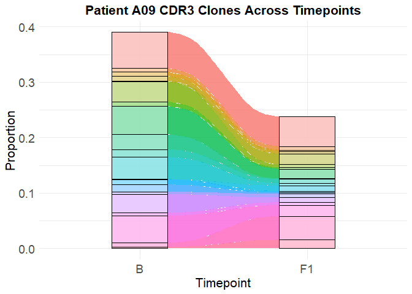<!-- --><!-- --><!-- -->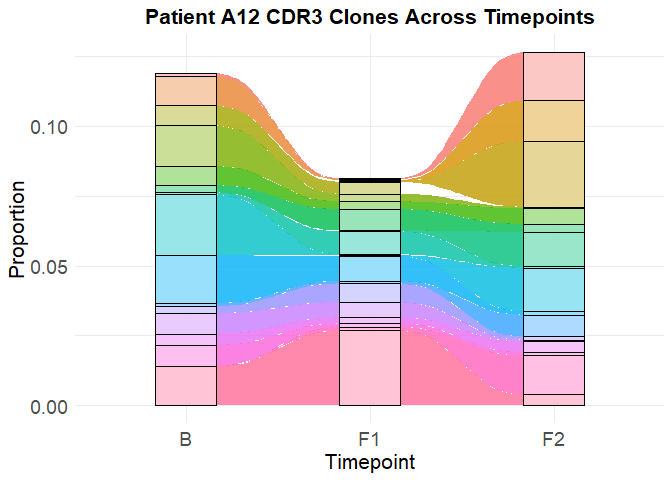<!-- -->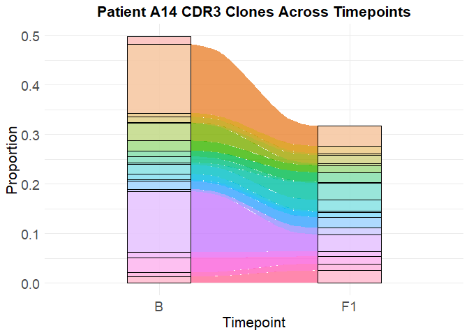<!-- --><!-- -->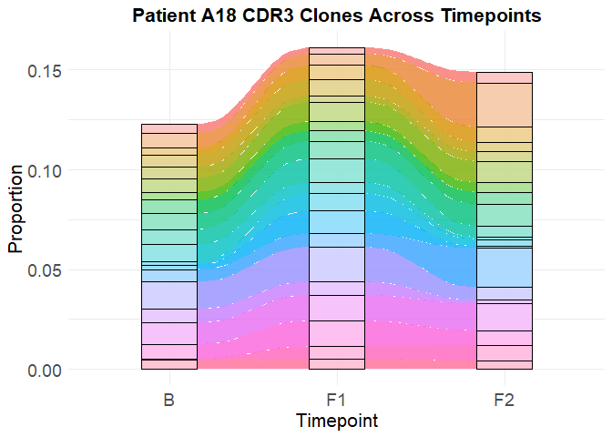<!-- -->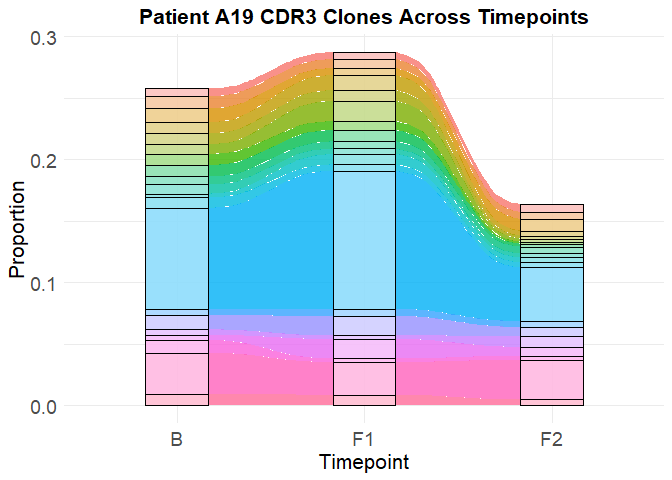<!-- --><!-- -->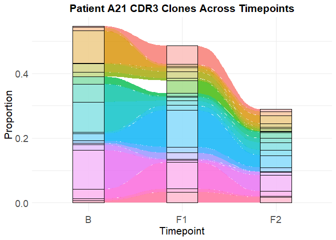<!-- --><!-- -->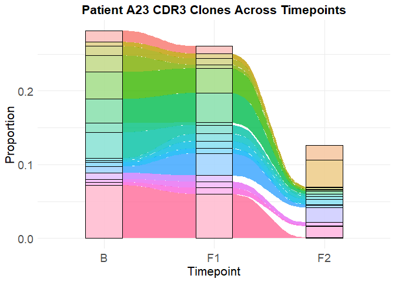<!-- --><!-- -->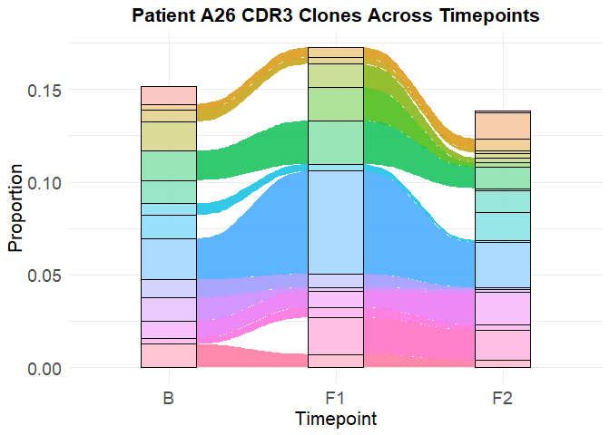<!-- --><!-- -->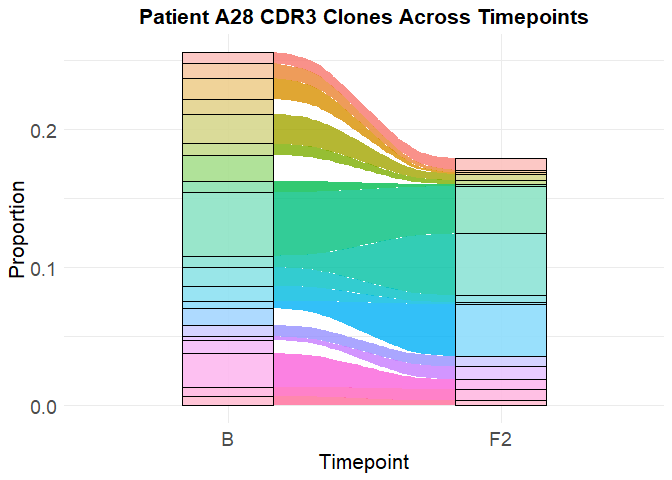<!-- --><!-- -->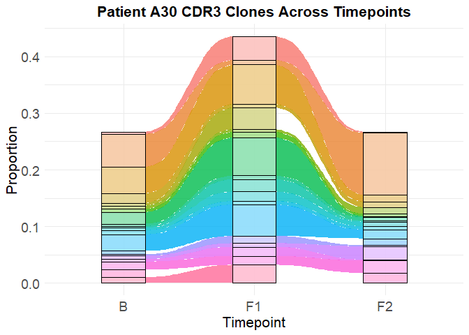<!-- --><!-- --><!-- -->

``` r
# Print patients with insufficient timepoints
cat("Patients with only one timepoint (unable to create alluvial plots):\n")
```

    ## Patients with only one timepoint (unable to create alluvial plots):

``` r
for (patient_id in names(insufficient_timepoints)) {
    cat(paste0(patient_id, ": ", insufficient_timepoints[[patient_id]], "\n"))
}
```

    ## A16: Only has A16B timepoint
    ## A25: Only has A25B timepoint

Top20 뿐만 아니라 모든 cdr3를 대상으로, B와 F1이 공유되지 않는 CDR3 없이
플롯을 그려보자.

전체를 다 그리는 건 오래 걸리니, 샘플 버전부터 시작.

``` r
# Get just the first patient ID
patient_id <- patient_ids[1]
cat("Drawing plot for first patient:", patient_id, "\n")
```

    ## Drawing plot for first patient: A09

``` r
# Find all datasets for this patient
patient_datasets <- names(tcr_data_list)[grepl(paste0("^", patient_id), names(tcr_data_list))]

# Skip if the patient doesn't have at least 2 timepoints
if (length(patient_datasets) < 2) {
    insufficient_timepoints[[patient_id]] <- paste("Only has", patient_datasets, "timepoint")
    cat("Skipping patient", patient_id, "- insufficient timepoints\n")
} else {
    # Check which timepoints are available
    timepoints <- gsub(patient_id, "", patient_datasets)
    
    # Create a data frame to store CDR3 data across timepoints
    cdr3_counts <- data.frame()
    
    # Process each timepoint dataset
    for (ds_name in patient_datasets) {
        # Extract timepoint name
        timepoint <- gsub(patient_id, "", ds_name)
        
        # Get the CDR3 sequences and their counts
        cdr3_data <- tcr_data_list[[ds_name]] |>
            group_by(cdr3) |>
            summarize(count = n()) |>
            mutate(proportion = count / sum(count),
                   timepoint = timepoint) |>
            select(cdr3, count, proportion, timepoint)
        
        # Add to the combined data frame
        cdr3_counts <- rbind(cdr3_counts, cdr3_data)
    }
    
    # Check if we have baseline timepoint
    if ("B" %in% timepoints) {
        # Get CDR3s that appear in baseline
        baseline_cdr3s <- cdr3_counts |>
            filter(timepoint == "B") |>
            pull(cdr3)
        
        # Filter to only include CDR3s that appear in baseline
        cdr3_filtered <- cdr3_counts |>
            filter(cdr3 %in% baseline_cdr3s)
        
        # Create alluvial plot
        plot <- ggplot(cdr3_filtered, 
                       aes(x = timepoint, y = proportion, alluvium = cdr3, stratum = cdr3)) +
            geom_alluvium(aes(fill = cdr3), alpha = 0.8) +
            geom_stratum(alpha = 0.5) +
            theme_minimal() +
            labs(title = paste("Patient", patient_id, "CDR3 Clones Across Timepoints"),
                 x = "Timepoint", y = "Proportion", fill = "CDR3 Sequence") +
            theme(legend.position = "none",
                  plot.title = element_text(hjust = 0.5, size = 24, face = "bold"),
                  plot.subtitle = element_text(hjust = 0.5, size = 18),
                  axis.title.x = element_text(size = 22),
                  axis.title.y = element_text(size = 22),
                  axis.text = element_text(size = 20)) +
            scale_x_discrete(limits = c("B", "F1", "F2")[c("B", "F1", "F2") %in% timepoints])
        
        # Display the plot
        print(plot)
        cat("Patient", patient_id, "has baseline timepoint, plot created.\n")
    } else {
        cat("Patient", patient_id, "doesn't have baseline timepoint, skipping\n")
    }
}
```

<!-- -->

    ## Patient A09 has baseline timepoint, plot created.

## Draw alluvial plots for patients with cdr3s in baseline

``` r
# Extract patient IDs from the dataset names
patient_ids <- unique(substr(names(tcr_data_list), 1, 3))

# Find the patients with insufficient timepoints
insufficient_timepoints <- list()

# Create alluvial plots for patients with at least 2 timepoints
for (patient_id in patient_ids) {
    # Find all datasets for this patient
    patient_datasets <- names(tcr_data_list)[grepl(paste0("^", patient_id), names(tcr_data_list))]
    
    # Skip if the patient doesn't have at least 2 timepoints
    if (length(patient_datasets) < 2) {
        insufficient_timepoints[[patient_id]] <- paste("Only has", patient_datasets, "timepoint")
        next
    }
    
    # Check which timepoints are available
    timepoints <- gsub(patient_id, "", patient_datasets)
    
    # Create a data frame to store CDR3 data across timepoints
    cdr3_counts <- data.frame()
    
    # Process each timepoint dataset
    for (ds_name in patient_datasets) {
        # Extract timepoint name
        timepoint <- gsub(patient_id, "", ds_name)
        
        # Get the CDR3 sequences and their counts
        cdr3_data <- tcr_data_list[[ds_name]] |>
            group_by(cdr3) |>
            summarize(count = n()) |>
            mutate(proportion = count / sum(count),
                   timepoint = timepoint) |>
            select(cdr3, count, proportion, timepoint)
        
        # Add to the combined data frame
        cdr3_counts <- rbind(cdr3_counts, cdr3_data)
    }
    
    # Check if we have baseline timepoint
    if ("B" %in% timepoints) {
        # Get CDR3s that appear in baseline
        baseline_cdr3s <- cdr3_counts |>
            filter(timepoint == "B") |>
            pull(cdr3)
        
        # Filter to only include CDR3s that appear in baseline
        cdr3_filtered <- cdr3_counts |>
            filter(cdr3 %in% baseline_cdr3s)
        
        # Create alluvial plot
        plot <- ggplot(cdr3_filtered, 
                       aes(x = timepoint, y = proportion, alluvium = cdr3, stratum = cdr3)) +
            geom_alluvium(aes(fill = cdr3), alpha = 0.8) +
            geom_stratum(alpha = 0.5) +
            theme_minimal() +
            labs(title = paste("Patient", patient_id, "CDR3 Clones Across Timepoints"),
                 x = "Timepoint", y = "Proportion", fill = "CDR3 Sequence") +
            theme(legend.position = "none",
                  plot.title = element_text(hjust = 0.5, size = 24, face = "bold"),
                  plot.subtitle = element_text(hjust = 0.5, size = 18),
                  axis.title.x = element_text(size = 22),
                  axis.title.y = element_text(size = 22),
                  axis.text = element_text(size = 20)) +
            scale_x_discrete(limits = c("B", "F1", "F2")[c("B", "F1", "F2") %in% timepoints])
        
        # Print plot to the PDF
        print(plot)
        cat("Patient", patient_id, "has baseline timepoint, plot created.\n")
    } else {
        cat("Patient", patient_id, "doesn't have baseline timepoint, skipping\n")
    }
}
```

<!-- -->

    ## Patient A09 has baseline timepoint, plot created.

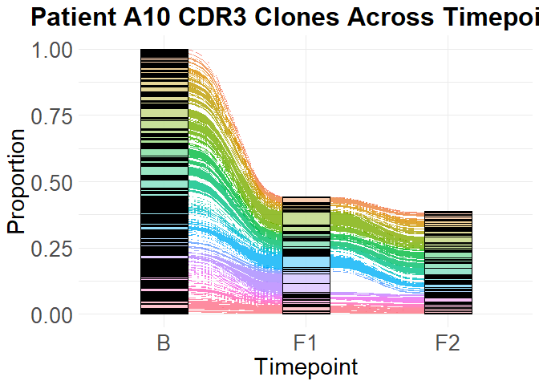<!-- -->

    ## Patient A10 has baseline timepoint, plot created.

<!-- -->

    ## Patient A11 has baseline timepoint, plot created.

<!-- -->

    ## Patient A12 has baseline timepoint, plot created.

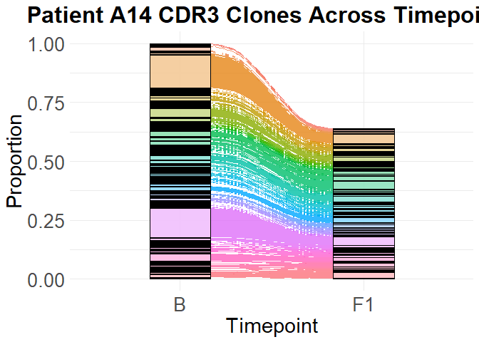<!-- -->

    ## Patient A14 has baseline timepoint, plot created.

<!-- -->

    ## Patient A17 has baseline timepoint, plot created.

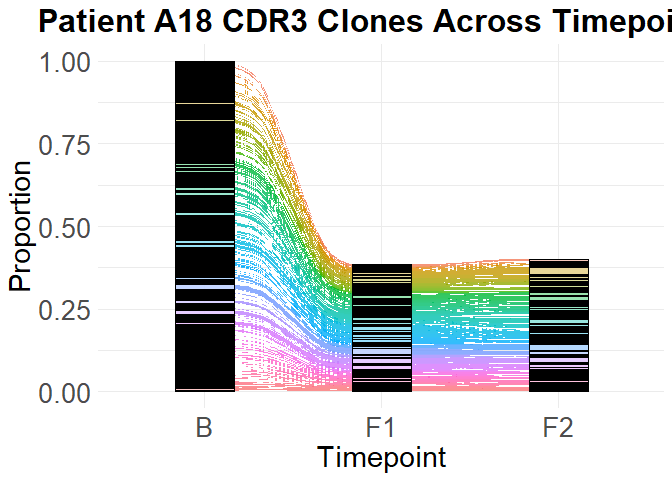<!-- -->

    ## Patient A18 has baseline timepoint, plot created.

<!-- -->

    ## Patient A19 has baseline timepoint, plot created.

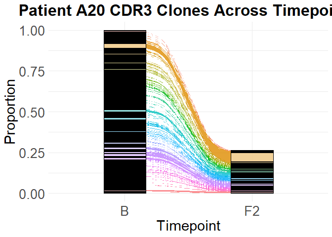<!-- -->

    ## Patient A20 has baseline timepoint, plot created.

<!-- -->

    ## Patient A21 has baseline timepoint, plot created.

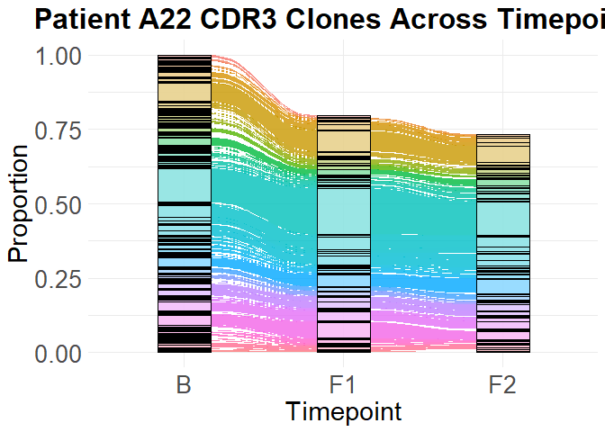<!-- -->

    ## Patient A22 has baseline timepoint, plot created.

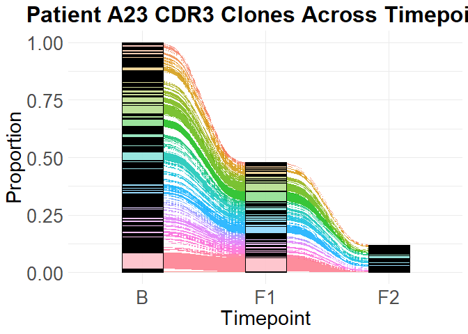<!-- -->

    ## Patient A23 has baseline timepoint, plot created.

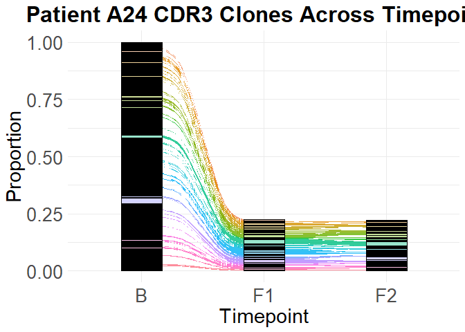<!-- -->

    ## Patient A24 has baseline timepoint, plot created.

<!-- -->

    ## Patient A26 has baseline timepoint, plot created.

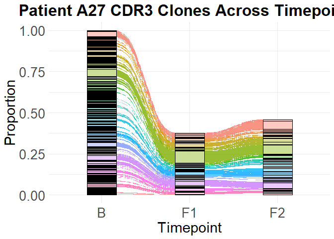<!-- -->

    ## Patient A27 has baseline timepoint, plot created.

<!-- -->

    ## Patient A28 has baseline timepoint, plot created.

<!-- -->

    ## Patient A29 has baseline timepoint, plot created.

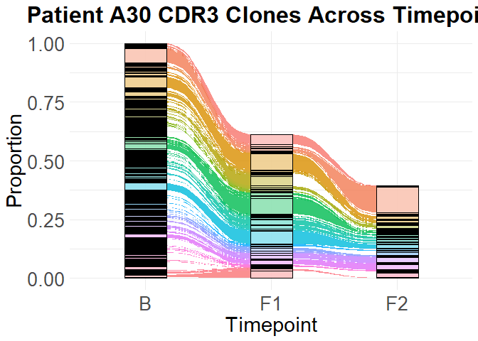<!-- -->

    ## Patient A30 has baseline timepoint, plot created.

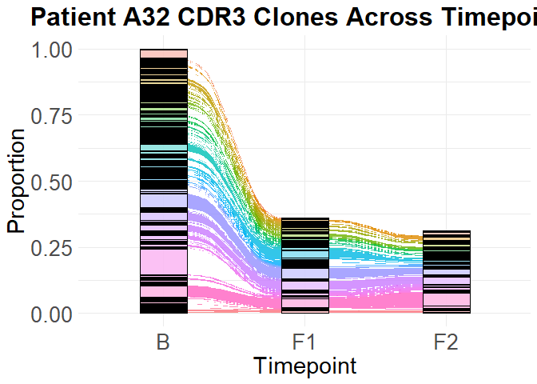<!-- -->

    ## Patient A32 has baseline timepoint, plot created.

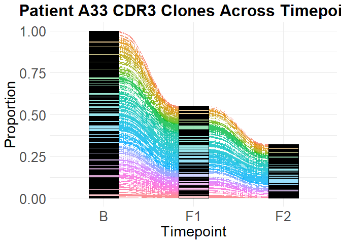<!-- -->

    ## Patient A33 has baseline timepoint, plot created.

``` r
# Print patients with insufficient timepoints
cat("Patients with only one timepoint (unable to create alluvial plots):\n")
```

    ## Patients with only one timepoint (unable to create alluvial plots):

``` r
for (patient_id in names(insufficient_timepoints)) {
    cat(paste0(patient_id, ": ", insufficient_timepoints[[patient_id]], "\n"))
}
```

    ## A16: Only has A16B timepoint
    ## A25: Only has A25B timepoint

## Draw just 1 alluvial plot for patients with shared CDR3s across all timepoints

``` r
# Choose one patient to visualize (using the first patient in the list)
patient_id <- patient_ids[1] # You could change this to any specific patient ID you want

# Find all datasets for this patient by regular expression '^patient_id'
patient_datasets <- names(tcr_data_list)[grepl(paste0("^", patient_id), names(tcr_data_list))]

# Check if the patient has at least 2 timepoints
if (length(patient_datasets) < 2) {
    cat("Patient", patient_id, "doesn't have at least 2 timepoints, cannot create alluvial plot\n")
} else {
    # Check which timepoints are available
    timepoints <- gsub(patient_id, "", patient_datasets)
    
    # Create a data frame to store CDR3 data across timepoints
    cdr3_counts <- data.frame()
    
    # Process each timepoint dataset
    for (ds_name in patient_datasets) {
        # Extract timepoint name
        timepoint <- gsub(patient_id, "", ds_name)
        
        # Get the CDR3 sequences and their counts
        cdr3_data <- tcr_data_list[[ds_name]] |>
            group_by(cdr3) |>
            summarize(count = n()) |>
            mutate(proportion = count / sum(count),
                   timepoint = timepoint) |>
            select(cdr3, count, proportion, timepoint)
        
        # Add to the combined data frame
        cdr3_counts <- rbind(cdr3_counts, cdr3_data)
    }
    
    # Find CDR3s that appear in all available timepoints
    shared_cdr3s <- cdr3_counts |>
        group_by(cdr3) |>
        summarize(timepoint_count = n_distinct(timepoint)) |>
        filter(timepoint_count == length(timepoints)) |>
        pull(cdr3)
    
    # Check if there are any shared CDR3s
    if (length(shared_cdr3s) == 0) {
        cat("Patient", patient_id, "has no CDR3s shared across all timepoints\n")
    } else {
        # Filter to only include shared CDR3s
        cdr3_filtered <- cdr3_counts |>
            filter(cdr3 %in% shared_cdr3s)
        
        # Create alluvial plot
        plot <- ggplot(cdr3_filtered, 
                      aes(x = timepoint, y = proportion, alluvium = cdr3, stratum = cdr3)) +
            geom_alluvium(aes(fill = cdr3), alpha = 0.8) +
            geom_stratum(alpha = 0.5) +
            theme_minimal() +
            labs(title = paste("Patient", patient_id, "CDR3 Clones Shared Across All TPs"),
                 subtitle = paste(length(shared_cdr3s), "shared CDR3 sequences"),
                 x = "Timepoint", y = "Proportion", fill = "CDR3 Sequence") +
            theme(legend.position = "none",
                  plot.title = element_text(hjust = 0.5, size = 22, face = "bold"),
                  plot.subtitle = element_text(hjust = 0.5, size = 18),
                  axis.title.x = element_text(size = 22),
                  axis.title.y = element_text(size = 22),
                  axis.text = element_text(size = 20)) +
            scale_x_discrete(limits = c("B", "F1", "F2")[c("B", "F1", "F2") %in% timepoints])
        
        # Display the plot
        print(plot)
            
        
        cat("Patient", patient_id, "has", length(shared_cdr3s), "shared CDR3s, plot displayed and saved.\n")
    }
}
```

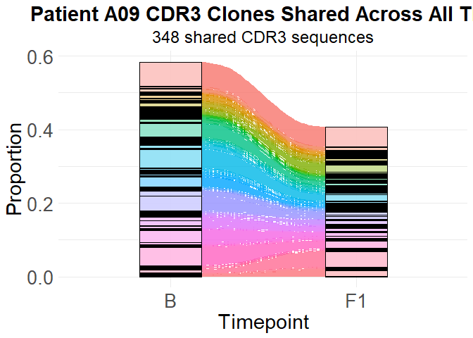<!-- -->

    ## Patient A09 has 348 shared CDR3s, plot displayed and saved.

## Draw alluvial plots for patients with shared CDR3s across all timepoints

``` r
# Extract patient IDs from the dataset names
patient_ids <- unique(substr(names(tcr_data_list), 1, 3))

# Find the patients with insufficient timepoints
insufficient_timepoints <- list()
# Create a multi-page PDF for all alluvial plots
# pdf(file = file.path(output_dir, "alluvial_plots_shared_by_all_TPs.pdf"), width = 10, height = 8)

# Create alluvial plots for patients with at least 2 timepoints
for (patient_id in patient_ids) {
    # Find all datasets for this patient
    patient_datasets <- names(tcr_data_list)[grepl(paste0("^", patient_id), names(tcr_data_list))]
    
    # Skip if the patient doesn't have at least 2 timepoints
    if (length(patient_datasets) < 2) {
        insufficient_timepoints[[patient_id]] <- paste("Only has", patient_datasets, "timepoint")
        next
    }
    
    # Check which timepoints are available
    timepoints <- gsub(patient_id, "", patient_datasets)
    
    # Create a data frame to store CDR3 data across timepoints
    cdr3_counts <- data.frame()
    
    # Process each timepoint dataset
    for (ds_name in patient_datasets) {
        # Extract timepoint name
        timepoint <- gsub(patient_id, "", ds_name)
        
        # Get the CDR3 sequences and their counts
        cdr3_data <- tcr_data_list[[ds_name]] |>
            group_by(cdr3) |>
            summarize(count = n()) |>
            mutate(proportion = count / sum(count),
                   timepoint = timepoint) |>
            select(cdr3, count, proportion, timepoint)
        
        # Add to the combined data frame
        cdr3_counts <- rbind(cdr3_counts, cdr3_data)
    }
    
    # Find CDR3s that appear in all available timepoints
    shared_cdr3s <- cdr3_counts |>
        group_by(cdr3) |>
        summarize(timepoint_count = n_distinct(timepoint)) |>
        filter(timepoint_count == length(timepoints)) |>
        pull(cdr3)
    
    # Skip if no shared CDR3s found
    if (length(shared_cdr3s) == 0) {
        cat("Patient", patient_id, "has no CDR3s shared across all TPs, skipping\n")
        next
    }
    
    # Filter to only include shared CDR3s
    cdr3_filtered <- cdr3_counts |>
        filter(cdr3 %in% shared_cdr3s)
    
    # Create alluvial plot
    plot <- ggplot(cdr3_filtered, 
                   aes(x = timepoint, y = proportion, alluvium = cdr3, stratum = cdr3)) +
        geom_alluvium(aes(fill = cdr3), alpha = 0.8) +
        geom_stratum(alpha = 0.5) +
        theme_minimal() +
        labs(title = paste("Patient", patient_id, "CDR3 Clones Shared Across All Timepoints"),
             subtitle = paste(length(shared_cdr3s), "shared CDR3 sequences"),
             x = "Timepoint", y = "Proportion", fill = "CDR3 Sequence") +
        theme(legend.position = "none",
              plot.title = element_text(hjust = 0.5, size = 22, face = "bold"),
              plot.subtitle = element_text(hjust = 0.5, size = 18),
              axis.title.x = element_text(size = 22),
              axis.title.y = element_text(size = 22),
              axis.text = element_text(size = 20)) +
        scale_x_discrete(limits = c("B", "F1", "F2")[c("B", "F1", "F2") %in% timepoints])
    
    # Print plot to the PDF
    print(plot)
    cat("Patient", patient_id, "has", length(shared_cdr3s), "shared CDR3s, plot created.\n")
}
```

<!-- -->

    ## Patient A09 has 348 shared CDR3s, plot created.

<!-- -->

    ## Patient A10 has 58 shared CDR3s, plot created.

<!-- -->

    ## Patient A11 has 63 shared CDR3s, plot created.

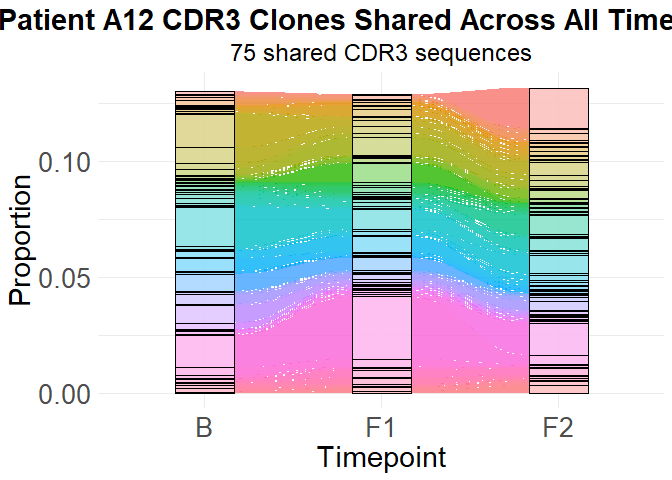<!-- -->

    ## Patient A12 has 75 shared CDR3s, plot created.

<!-- -->

    ## Patient A14 has 233 shared CDR3s, plot created.

<!-- -->

    ## Patient A17 has 181 shared CDR3s, plot created.

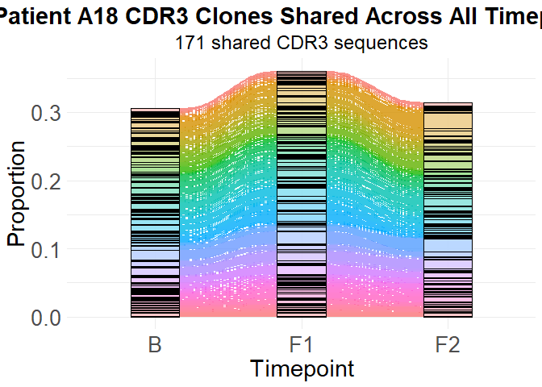<!-- -->

    ## Patient A18 has 171 shared CDR3s, plot created.

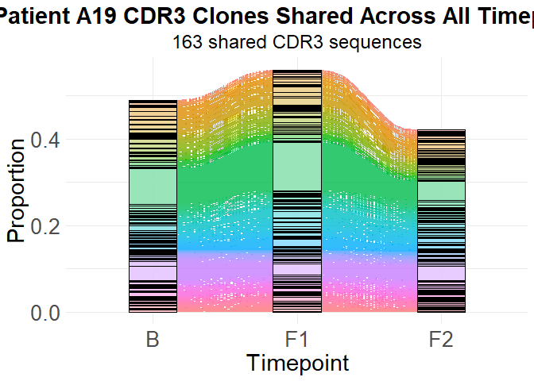<!-- -->

    ## Patient A19 has 163 shared CDR3s, plot created.

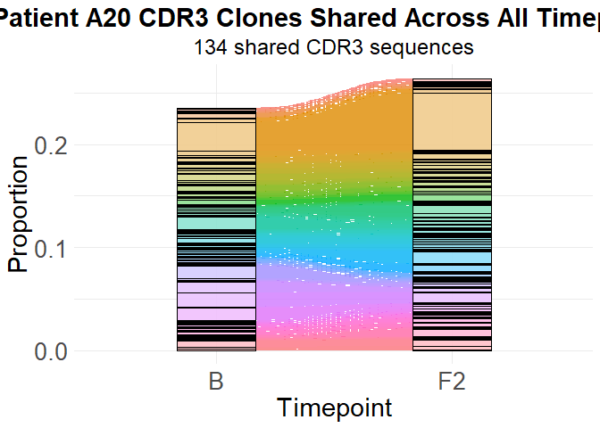<!-- -->

    ## Patient A20 has 134 shared CDR3s, plot created.

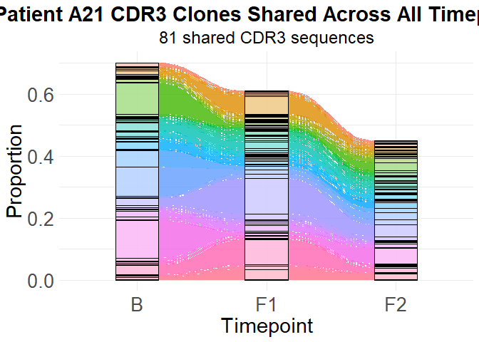<!-- -->

    ## Patient A21 has 81 shared CDR3s, plot created.

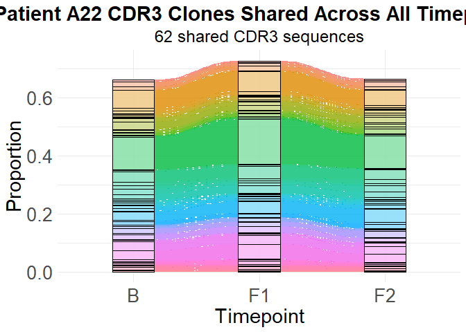<!-- -->

    ## Patient A22 has 62 shared CDR3s, plot created.

<!-- -->

    ## Patient A23 has 38 shared CDR3s, plot created.

<!-- -->

    ## Patient A24 has 37 shared CDR3s, plot created.

<!-- -->

    ## Patient A26 has 20 shared CDR3s, plot created.

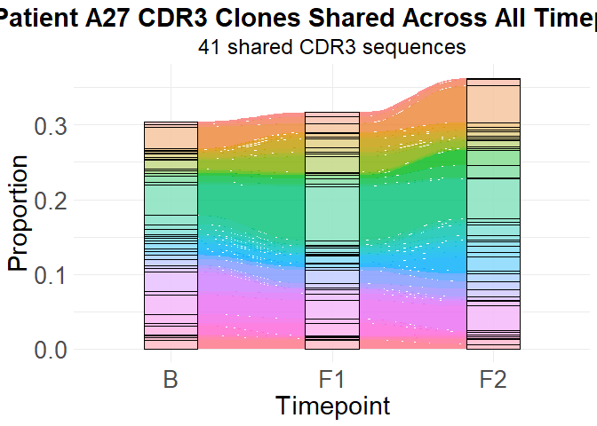<!-- -->

    ## Patient A27 has 41 shared CDR3s, plot created.

<!-- -->

    ## Patient A28 has 104 shared CDR3s, plot created.

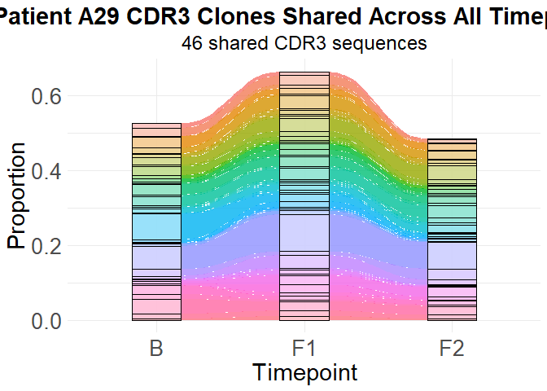<!-- -->

    ## Patient A29 has 46 shared CDR3s, plot created.

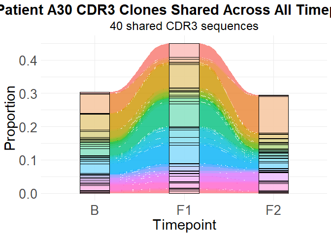<!-- -->

    ## Patient A30 has 40 shared CDR3s, plot created.

<!-- -->

    ## Patient A32 has 43 shared CDR3s, plot created.

<!-- -->

    ## Patient A33 has 113 shared CDR3s, plot created.

``` r
# Close the PDF device
# dev.off()
```

``` r
# Print patients with insufficient timepoints
cat("Patients with only one timepoint (unable to create alluvial plots):\n")
```

    ## Patients with only one timepoint (unable to create alluvial plots):

``` r
for (patient_id in names(insufficient_timepoints)) {
    cat(paste0(patient_id, ": ", insufficient_timepoints[[patient_id]], "\n"))
}
```

    ## A16: Only has A16B timepoint
    ## A25: Only has A25B timepoint

# Fishplots

``` r
head(patient_ids)
```

    ## [1] "A09" "A10" "A11" "A12" "A14" "A16"

## All CDR3b across T.P.s

F1에서 0으로 사라져버리고, F2에서 재등장하는 것에 대해, F1에 등장하는
것을 0이 아닌 것으로 간주해야 플롯이 정상적으로 나옴.

#### Colored by Timepoints

``` r
# 환자 ID 추출
patient_ids <- unique(substr(names(tcr_data_list), 1, 3))
VAR_TOP_NUM <- 30  # Variation 기준 상위 N개 클론 선택

# Open a multi-page PDF for all fish plots
# pdf(file = file.path(output_dir, paste0("Fishplots_shared_by_all_TPs_var_top" , VAR_TOP_NUM, "_test.pdf")), width = 10, height = 8)

for (patient_id in patient_ids) {
  patient_datasets <- names(tcr_data_list)[grepl(paste0("^", patient_id), names(tcr_data_list))]
  if (length(patient_datasets) < 2) next
  
  timepoints <- sort(gsub(patient_id, "", patient_datasets))
  tp_labels <- timepoints
  tp_index <- seq_along(tp_labels)
  names(tp_index) <- tp_labels

  # 1. CDR3 비율 계산
  timepoint_props <- list()
  for (ds_name in patient_datasets) {
    timepoint <- gsub(patient_id, "", ds_name)
    cdr3_data <- tcr_data_list[[ds_name]] |>
      group_by(cdr3) |>
      summarize(count = n()) |>
      mutate(proportion = count / sum(count)) |>
      select(cdr3, proportion)
    timepoint_props[[timepoint]] <- cdr3_data
  }

  # 2. 전체 CDR3 목록 및 비율 행렬 생성
  all_cdr3s <- unique(unlist(lapply(timepoint_props, \(df) df$cdr3)))
  prop_matrix <- matrix(0, nrow = length(all_cdr3s), ncol = length(tp_labels),
                        dimnames = list(all_cdr3s, as.character(tp_index)))
  for (tp in tp_labels) {
    df <- timepoint_props[[tp]]
    prop_matrix[df$cdr3, as.character(tp_index[tp])] <- df$proportion
  }

  # 3. 변화량 기준 상위 클론 선택
  variation <- apply(prop_matrix, 1, function(x) sd(as.numeric(x)))
  top_idx <- order(variation, decreasing = TRUE)[1:min(VAR_TOP_NUM, length(variation))]
  prop_matrix <- prop_matrix[top_idx, , drop = FALSE]

  # 4. 비율 스케일 확대
  prop_matrix <- prop_matrix * 100

  # 5. 0 구간 보정
  epsilon <- 1e-5
  for (i in seq_len(nrow(prop_matrix))) {
    vec <- prop_matrix[i, ]
    present_idx <- which(vec > 0)
    if (length(present_idx) >= 2) {
      gap_idx <- (min(present_idx)+1):(max(present_idx)-1)
      if (any(vec[gap_idx] == 0)) {
        prop_matrix[i, gap_idx[vec[gap_idx] == 0]] <- epsilon
      }
    }
  }

  # 6. 트리 구조를 사용하지 않고 모두 root로 처리 (가장 간단한 방법)
  parents <- rep(0, nrow(prop_matrix))

  # 7. 색상 지정: 출현한 timepoint 조합 기준
  presence_matrix <- prop_matrix > 0
  combo_labels <- apply(presence_matrix, 1, function(x) paste0(colnames(prop_matrix)[x], collapse = "-"))
  unique_combos <- unique(combo_labels)
  combo_colors <- setNames(brewer.pal(min(length(unique_combos), 8), "Set2"), unique_combos)
  clone_colors <- combo_colors[combo_labels]
  
  combo_counts <- table(combo_labels)
  legend_labels <- paste0(names(combo_counts), " (n=", combo_counts, ")")
  legend_colors <- combo_colors[names(combo_counts)]  # 색상 순서 맞추기

  # 8. fishplot 생성 및 그리기
  timepoints_numeric <- as.numeric(colnames(prop_matrix))
  timepoint_labels <- c("B", "F1", "F2")[timepoints_numeric]

  fish <- createFishObject(frac.table = prop_matrix,
                           parents = parents,
                           timepoints = timepoints_numeric,
                           clone.labels = rownames(prop_matrix))
  fish <- setCol(fish, clone_colors)
  fish <- layoutClones(fish)

  fishPlot(fish,
           shape = "spline",
           title.btm = paste0("Patient ", patient_id, "'s CDR3b Clones Revolution"),
           vlines = timepoints_numeric,
           vlab = timepoint_labels,
           pad.left = 0.5)
  legend("topright",                                   # 범례 위치 (필요시 조정: e.g., "bottomleft")
         legend = legend_labels,                 # 조합 라벨
         fill = legend_colors,                          # 각 조합의 색상
         border = "black",
         title = "Timepoint Combination",
         cex = 0.8,                                     # 폰트 크기 조정
         bty = "n")                                     # 범례 테두리 제거
}
```

    ## [1] "WARNING: default color scheme only includes 10 colors, but 30 are needed to color each clone uniquely. Use the setCol() function to add a color scheme"

    ## Warning in regularize.values(x, y, ties, missing(ties)): collapsing to unique
    ## 'x' values
    ## Warning in regularize.values(x, y, ties, missing(ties)): collapsing to unique
    ## 'x' values

<!-- -->

    ## [1] "WARNING: default color scheme only includes 10 colors, but 30 are needed to color each clone uniquely. Use the setCol() function to add a color scheme"

    ## Warning in regularize.values(x, y, ties, missing(ties)): collapsing to unique
    ## 'x' values
    ## Warning in regularize.values(x, y, ties, missing(ties)): collapsing to unique
    ## 'x' values
    ## Warning in regularize.values(x, y, ties, missing(ties)): collapsing to unique
    ## 'x' values
    ## Warning in regularize.values(x, y, ties, missing(ties)): collapsing to unique
    ## 'x' values
    ## Warning in regularize.values(x, y, ties, missing(ties)): collapsing to unique
    ## 'x' values
    ## Warning in regularize.values(x, y, ties, missing(ties)): collapsing to unique
    ## 'x' values
    ## Warning in regularize.values(x, y, ties, missing(ties)): collapsing to unique
    ## 'x' values
    ## Warning in regularize.values(x, y, ties, missing(ties)): collapsing to unique
    ## 'x' values

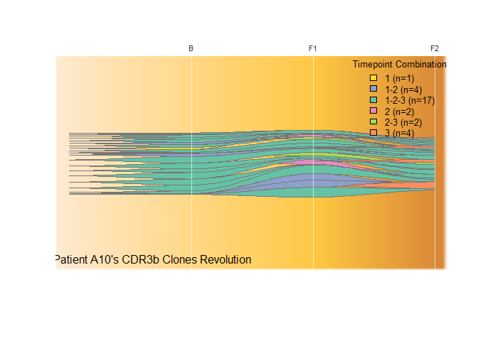<!-- -->

    ## [1] "WARNING: default color scheme only includes 10 colors, but 30 are needed to color each clone uniquely. Use the setCol() function to add a color scheme"

    ## Warning in regularize.values(x, y, ties, missing(ties)): collapsing to unique
    ## 'x' values
    ## Warning in regularize.values(x, y, ties, missing(ties)): collapsing to unique
    ## 'x' values

<!-- -->

    ## [1] "WARNING: default color scheme only includes 10 colors, but 30 are needed to color each clone uniquely. Use the setCol() function to add a color scheme"

    ## Warning in regularize.values(x, y, ties, missing(ties)): collapsing to unique
    ## 'x' values
    ## Warning in regularize.values(x, y, ties, missing(ties)): collapsing to unique
    ## 'x' values
    ## Warning in regularize.values(x, y, ties, missing(ties)): collapsing to unique
    ## 'x' values
    ## Warning in regularize.values(x, y, ties, missing(ties)): collapsing to unique
    ## 'x' values
    ## Warning in regularize.values(x, y, ties, missing(ties)): collapsing to unique
    ## 'x' values
    ## Warning in regularize.values(x, y, ties, missing(ties)): collapsing to unique
    ## 'x' values
    ## Warning in regularize.values(x, y, ties, missing(ties)): collapsing to unique
    ## 'x' values
    ## Warning in regularize.values(x, y, ties, missing(ties)): collapsing to unique
    ## 'x' values
    ## Warning in regularize.values(x, y, ties, missing(ties)): collapsing to unique
    ## 'x' values
    ## Warning in regularize.values(x, y, ties, missing(ties)): collapsing to unique
    ## 'x' values
    ## Warning in regularize.values(x, y, ties, missing(ties)): collapsing to unique
    ## 'x' values
    ## Warning in regularize.values(x, y, ties, missing(ties)): collapsing to unique
    ## 'x' values
    ## Warning in regularize.values(x, y, ties, missing(ties)): collapsing to unique
    ## 'x' values
    ## Warning in regularize.values(x, y, ties, missing(ties)): collapsing to unique
    ## 'x' values

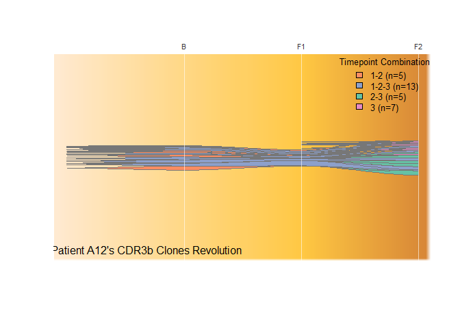<!-- -->

    ## [1] "WARNING: default color scheme only includes 10 colors, but 30 are needed to color each clone uniquely. Use the setCol() function to add a color scheme"

    ## Warning in regularize.values(x, y, ties, missing(ties)): collapsing to unique
    ## 'x' values
    ## Warning in regularize.values(x, y, ties, missing(ties)): collapsing to unique
    ## 'x' values
    ## Warning in regularize.values(x, y, ties, missing(ties)): collapsing to unique
    ## 'x' values
    ## Warning in regularize.values(x, y, ties, missing(ties)): collapsing to unique
    ## 'x' values
    ## Warning in regularize.values(x, y, ties, missing(ties)): collapsing to unique
    ## 'x' values
    ## Warning in regularize.values(x, y, ties, missing(ties)): collapsing to unique
    ## 'x' values

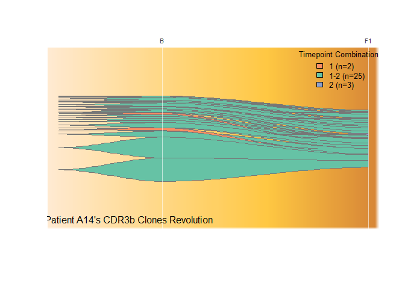<!-- -->

    ## [1] "WARNING: default color scheme only includes 10 colors, but 30 are needed to color each clone uniquely. Use the setCol() function to add a color scheme"

    ## Warning in regularize.values(x, y, ties, missing(ties)): collapsing to unique
    ## 'x' values
    ## Warning in regularize.values(x, y, ties, missing(ties)): collapsing to unique
    ## 'x' values
    ## Warning in regularize.values(x, y, ties, missing(ties)): collapsing to unique
    ## 'x' values
    ## Warning in regularize.values(x, y, ties, missing(ties)): collapsing to unique
    ## 'x' values
    ## Warning in regularize.values(x, y, ties, missing(ties)): collapsing to unique
    ## 'x' values
    ## Warning in regularize.values(x, y, ties, missing(ties)): collapsing to unique
    ## 'x' values
    ## Warning in regularize.values(x, y, ties, missing(ties)): collapsing to unique
    ## 'x' values
    ## Warning in regularize.values(x, y, ties, missing(ties)): collapsing to unique
    ## 'x' values
    ## Warning in regularize.values(x, y, ties, missing(ties)): collapsing to unique
    ## 'x' values
    ## Warning in regularize.values(x, y, ties, missing(ties)): collapsing to unique
    ## 'x' values
    ## Warning in regularize.values(x, y, ties, missing(ties)): collapsing to unique
    ## 'x' values
    ## Warning in regularize.values(x, y, ties, missing(ties)): collapsing to unique
    ## 'x' values

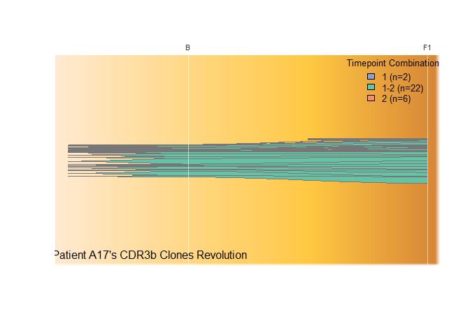<!-- -->

    ## [1] "WARNING: default color scheme only includes 10 colors, but 30 are needed to color each clone uniquely. Use the setCol() function to add a color scheme"

    ## Warning in regularize.values(x, y, ties, missing(ties)): collapsing to unique
    ## 'x' values
    ## Warning in regularize.values(x, y, ties, missing(ties)): collapsing to unique
    ## 'x' values
    ## Warning in regularize.values(x, y, ties, missing(ties)): collapsing to unique
    ## 'x' values
    ## Warning in regularize.values(x, y, ties, missing(ties)): collapsing to unique
    ## 'x' values
    ## Warning in regularize.values(x, y, ties, missing(ties)): collapsing to unique
    ## 'x' values
    ## Warning in regularize.values(x, y, ties, missing(ties)): collapsing to unique
    ## 'x' values
    ## Warning in regularize.values(x, y, ties, missing(ties)): collapsing to unique
    ## 'x' values
    ## Warning in regularize.values(x, y, ties, missing(ties)): collapsing to unique
    ## 'x' values

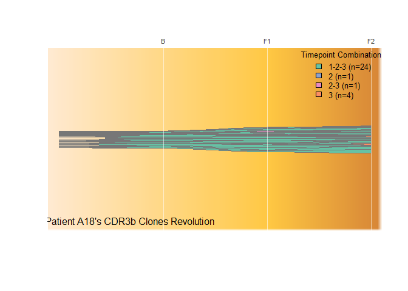<!-- -->

    ## Warning in brewer.pal(min(length(unique_combos), 8), "Set2"): minimal value for n is 3, returning requested palette with 3 different levels

    ## [1] "WARNING: default color scheme only includes 10 colors, but 30 are needed to color each clone uniquely. Use the setCol() function to add a color scheme"

<!-- -->

    ## [1] "WARNING: default color scheme only includes 10 colors, but 30 are needed to color each clone uniquely. Use the setCol() function to add a color scheme"

    ## Warning in regularize.values(x, y, ties, missing(ties)): collapsing to unique
    ## 'x' values
    ## Warning in regularize.values(x, y, ties, missing(ties)): collapsing to unique
    ## 'x' values
    ## Warning in regularize.values(x, y, ties, missing(ties)): collapsing to unique
    ## 'x' values
    ## Warning in regularize.values(x, y, ties, missing(ties)): collapsing to unique
    ## 'x' values
    ## Warning in regularize.values(x, y, ties, missing(ties)): collapsing to unique
    ## 'x' values
    ## Warning in regularize.values(x, y, ties, missing(ties)): collapsing to unique
    ## 'x' values
    ## Warning in regularize.values(x, y, ties, missing(ties)): collapsing to unique
    ## 'x' values
    ## Warning in regularize.values(x, y, ties, missing(ties)): collapsing to unique
    ## 'x' values
    ## Warning in regularize.values(x, y, ties, missing(ties)): collapsing to unique
    ## 'x' values
    ## Warning in regularize.values(x, y, ties, missing(ties)): collapsing to unique
    ## 'x' values
    ## Warning in regularize.values(x, y, ties, missing(ties)): collapsing to unique
    ## 'x' values
    ## Warning in regularize.values(x, y, ties, missing(ties)): collapsing to unique
    ## 'x' values
    ## Warning in regularize.values(x, y, ties, missing(ties)): collapsing to unique
    ## 'x' values
    ## Warning in regularize.values(x, y, ties, missing(ties)): collapsing to unique
    ## 'x' values
    ## Warning in regularize.values(x, y, ties, missing(ties)): collapsing to unique
    ## 'x' values
    ## Warning in regularize.values(x, y, ties, missing(ties)): collapsing to unique
    ## 'x' values
    ## Warning in regularize.values(x, y, ties, missing(ties)): collapsing to unique
    ## 'x' values
    ## Warning in regularize.values(x, y, ties, missing(ties)): collapsing to unique
    ## 'x' values

<!-- -->

    ## [1] "WARNING: default color scheme only includes 10 colors, but 30 are needed to color each clone uniquely. Use the setCol() function to add a color scheme"

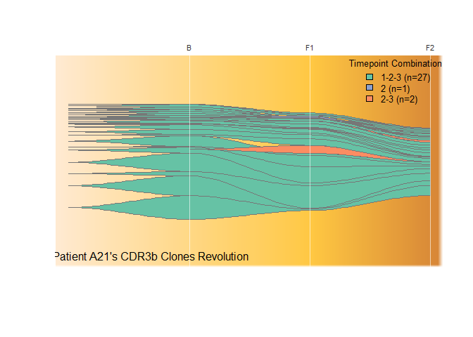<!-- -->

    ## [1] "WARNING: default color scheme only includes 10 colors, but 30 are needed to color each clone uniquely. Use the setCol() function to add a color scheme"

    ## Warning in regularize.values(x, y, ties, missing(ties)): collapsing to unique
    ## 'x' values
    ## Warning in regularize.values(x, y, ties, missing(ties)): collapsing to unique
    ## 'x' values

<!-- -->

    ## [1] "WARNING: default color scheme only includes 10 colors, but 30 are needed to color each clone uniquely. Use the setCol() function to add a color scheme"

    ## Warning in regularize.values(x, y, ties, missing(ties)): collapsing to unique
    ## 'x' values
    ## Warning in regularize.values(x, y, ties, missing(ties)): collapsing to unique
    ## 'x' values
    ## Warning in regularize.values(x, y, ties, missing(ties)): collapsing to unique
    ## 'x' values
    ## Warning in regularize.values(x, y, ties, missing(ties)): collapsing to unique
    ## 'x' values
    ## Warning in regularize.values(x, y, ties, missing(ties)): collapsing to unique
    ## 'x' values
    ## Warning in regularize.values(x, y, ties, missing(ties)): collapsing to unique
    ## 'x' values
    ## Warning in regularize.values(x, y, ties, missing(ties)): collapsing to unique
    ## 'x' values
    ## Warning in regularize.values(x, y, ties, missing(ties)): collapsing to unique
    ## 'x' values
    ## Warning in regularize.values(x, y, ties, missing(ties)): collapsing to unique
    ## 'x' values
    ## Warning in regularize.values(x, y, ties, missing(ties)): collapsing to unique
    ## 'x' values
    ## Warning in regularize.values(x, y, ties, missing(ties)): collapsing to unique
    ## 'x' values
    ## Warning in regularize.values(x, y, ties, missing(ties)): collapsing to unique
    ## 'x' values
    ## Warning in regularize.values(x, y, ties, missing(ties)): collapsing to unique
    ## 'x' values
    ## Warning in regularize.values(x, y, ties, missing(ties)): collapsing to unique
    ## 'x' values
    ## Warning in regularize.values(x, y, ties, missing(ties)): collapsing to unique
    ## 'x' values
    ## Warning in regularize.values(x, y, ties, missing(ties)): collapsing to unique
    ## 'x' values
    ## Warning in regularize.values(x, y, ties, missing(ties)): collapsing to unique
    ## 'x' values
    ## Warning in regularize.values(x, y, ties, missing(ties)): collapsing to unique
    ## 'x' values
    ## Warning in regularize.values(x, y, ties, missing(ties)): collapsing to unique
    ## 'x' values
    ## Warning in regularize.values(x, y, ties, missing(ties)): collapsing to unique
    ## 'x' values
    ## Warning in regularize.values(x, y, ties, missing(ties)): collapsing to unique
    ## 'x' values
    ## Warning in regularize.values(x, y, ties, missing(ties)): collapsing to unique
    ## 'x' values
    ## Warning in regularize.values(x, y, ties, missing(ties)): collapsing to unique
    ## 'x' values
    ## Warning in regularize.values(x, y, ties, missing(ties)): collapsing to unique
    ## 'x' values
    ## Warning in regularize.values(x, y, ties, missing(ties)): collapsing to unique
    ## 'x' values
    ## Warning in regularize.values(x, y, ties, missing(ties)): collapsing to unique
    ## 'x' values

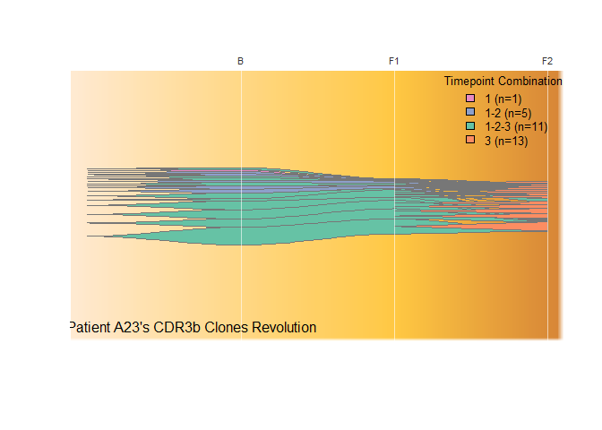<!-- -->

    ## [1] "WARNING: default color scheme only includes 10 colors, but 30 are needed to color each clone uniquely. Use the setCol() function to add a color scheme"

    ## Warning in regularize.values(x, y, ties, missing(ties)): collapsing to unique
    ## 'x' values
    ## Warning in regularize.values(x, y, ties, missing(ties)): collapsing to unique
    ## 'x' values

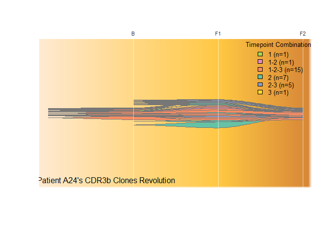<!-- -->

    ## [1] "WARNING: default color scheme only includes 10 colors, but 30 are needed to color each clone uniquely. Use the setCol() function to add a color scheme"

    ## Warning in regularize.values(x, y, ties, missing(ties)): collapsing to unique
    ## 'x' values
    ## Warning in regularize.values(x, y, ties, missing(ties)): collapsing to unique
    ## 'x' values
    ## Warning in regularize.values(x, y, ties, missing(ties)): collapsing to unique
    ## 'x' values
    ## Warning in regularize.values(x, y, ties, missing(ties)): collapsing to unique
    ## 'x' values
    ## Warning in regularize.values(x, y, ties, missing(ties)): collapsing to unique
    ## 'x' values
    ## Warning in regularize.values(x, y, ties, missing(ties)): collapsing to unique
    ## 'x' values
    ## Warning in regularize.values(x, y, ties, missing(ties)): collapsing to unique
    ## 'x' values
    ## Warning in regularize.values(x, y, ties, missing(ties)): collapsing to unique
    ## 'x' values
    ## Warning in regularize.values(x, y, ties, missing(ties)): collapsing to unique
    ## 'x' values
    ## Warning in regularize.values(x, y, ties, missing(ties)): collapsing to unique
    ## 'x' values
    ## Warning in regularize.values(x, y, ties, missing(ties)): collapsing to unique
    ## 'x' values
    ## Warning in regularize.values(x, y, ties, missing(ties)): collapsing to unique
    ## 'x' values
    ## Warning in regularize.values(x, y, ties, missing(ties)): collapsing to unique
    ## 'x' values
    ## Warning in regularize.values(x, y, ties, missing(ties)): collapsing to unique
    ## 'x' values

<!-- -->

    ## [1] "WARNING: default color scheme only includes 10 colors, but 30 are needed to color each clone uniquely. Use the setCol() function to add a color scheme"

    ## Warning in regularize.values(x, y, ties, missing(ties)): collapsing to unique
    ## 'x' values
    ## Warning in regularize.values(x, y, ties, missing(ties)): collapsing to unique
    ## 'x' values

<!-- -->

    ## Warning in brewer.pal(min(length(unique_combos), 8), "Set2"): minimal value for n is 3, returning requested palette with 3 different levels

    ## [1] "WARNING: default color scheme only includes 10 colors, but 30 are needed to color each clone uniquely. Use the setCol() function to add a color scheme"

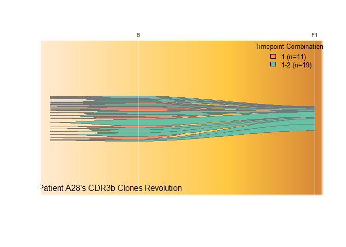<!-- -->

    ## [1] "WARNING: default color scheme only includes 10 colors, but 30 are needed to color each clone uniquely. Use the setCol() function to add a color scheme"

<!-- -->

    ## [1] "WARNING: default color scheme only includes 10 colors, but 30 are needed to color each clone uniquely. Use the setCol() function to add a color scheme"

    ## Warning in regularize.values(x, y, ties, missing(ties)): collapsing to unique
    ## 'x' values
    ## Warning in regularize.values(x, y, ties, missing(ties)): collapsing to unique
    ## 'x' values
    ## Warning in regularize.values(x, y, ties, missing(ties)): collapsing to unique
    ## 'x' values
    ## Warning in regularize.values(x, y, ties, missing(ties)): collapsing to unique
    ## 'x' values
    ## Warning in regularize.values(x, y, ties, missing(ties)): collapsing to unique
    ## 'x' values
    ## Warning in regularize.values(x, y, ties, missing(ties)): collapsing to unique
    ## 'x' values
    ## Warning in regularize.values(x, y, ties, missing(ties)): collapsing to unique
    ## 'x' values
    ## Warning in regularize.values(x, y, ties, missing(ties)): collapsing to unique
    ## 'x' values

<!-- -->

    ## [1] "WARNING: default color scheme only includes 10 colors, but 30 are needed to color each clone uniquely. Use the setCol() function to add a color scheme"

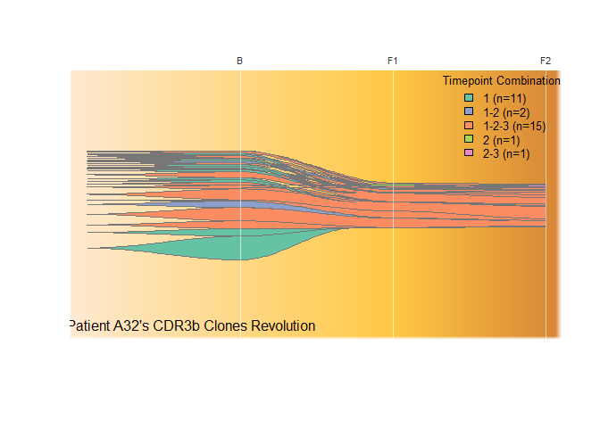<!-- -->

    ## [1] "WARNING: default color scheme only includes 10 colors, but 30 are needed to color each clone uniquely. Use the setCol() function to add a color scheme"

    ## Warning in regularize.values(x, y, ties, missing(ties)): collapsing to unique
    ## 'x' values
    ## Warning in regularize.values(x, y, ties, missing(ties)): collapsing to unique
    ## 'x' values
    ## Warning in regularize.values(x, y, ties, missing(ties)): collapsing to unique
    ## 'x' values
    ## Warning in regularize.values(x, y, ties, missing(ties)): collapsing to unique
    ## 'x' values
    ## Warning in regularize.values(x, y, ties, missing(ties)): collapsing to unique
    ## 'x' values
    ## Warning in regularize.values(x, y, ties, missing(ties)): collapsing to unique
    ## 'x' values

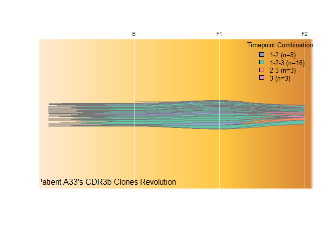<!-- -->

``` r
# Close the PDF device
# dev.off()
```
