Batch Correction and Statistical Analysis of Gene Expression Data
================

# Data preprocessing

``` r
# Load total_WTS.txt from the data directory
# Read the data
df <- read.table("WTS/XP_TPM.txt", header = TRUE, sep = "\t", 
                   stringsAsFactors = FALSE)
# Check the size of the df
dim(df)
```

    ## [1] 60728   321

``` r
head(df$GeneSymbol)
```

    ## [1] "A1BG"     "A1BG-AS1" "A1CF"     "A2M"      "A2M-AS1"  "A2ML1"

``` r
# Check the column names having "F3" in them
grep("F3", colnames(df), value = TRUE)
```

    ## [1] "E36_F3_N" "E36_F3_T" "E48_F3_N" "E48_F3_T" "E49_F3_N" "E49_F3_T"

``` r
# Remove columns with "F3" in their names
df <- df[, !grepl("F3", colnames(df))]
# Check the size of the df again
ncol(df)
```

    ## [1] 315

``` r
ncol(df[grep("E", colnames(df))])
```

    ## [1] 314

``` r
head(colnames(df)[grep("E", colnames(df))])
```

    ## [1] "E01_B_T"  "E01_F1_T" "E02_B_T"  "E02_F1_T" "E02_F2_N" "E02_F2_T"

``` r
length(colnames(df)[grep("E", colnames(df))])
```

    ## [1] 314

``` r
# subsets
df_B_N <- df[, c(grep("_B_N$", colnames(df), value = TRUE))]
df_B_T <- df[, c(grep("_B_T$", colnames(df), value = TRUE))]
df_F1_N <- df[, c(grep("_F1_N$", colnames(df), value = TRUE))]
df_F1_T <- df[, c(grep("_F1_T$", colnames(df), value = TRUE))]
df_F2_N <- df[, c(grep("_F2_N$", colnames(df), value = TRUE))]
df_F2_T <- df[, c(grep("_F2_T$", colnames(df), value = TRUE))]
ncol(df_B_N); ncol(df_B_T); ncol(df_F1_N); ncol(df_F1_T); ncol(df_F2_N); ncol(df_F2_T)
```

    ## [1] 50

    ## [1] 65

    ## [1] 48

    ## [1] 62

    ## [1] 44

    ## [1] 45

``` r
ncol(df_B_N) + ncol(df_B_T) + ncol(df_F1_N) + ncol(df_F1_T) + ncol(df_F2_N) + ncol(df_F2_T)
```

    ## [1] 314

``` r
# 1. 샘플 이름 추출 (df에서 유전자 칼럼이 없다면 그대로 colnames(df))
sample_cols <- colnames(df)

# 2. 정규표현식에 매칭되는 컬럼만 추출
valid_cols <- sample_cols[str_detect(sample_cols, "_[BF][12]?_[NT]$")]

# 3. 매칭되지 않는 컬럼 찾기
invalid_cols <- setdiff(sample_cols, valid_cols)

# 4. 결과 출력
invalid_cols
```

    ## [1] "GeneSymbol"

``` r
# Check the number of columns in each subset (note that Genesymbol is included 6 times)
ncol(df_B_N) + ncol(df_B_T) + ncol(df_F1_N) + ncol(df_F1_T) + ncol(df_F2_N) + ncol(df_F2_T)
```

    ## [1] 314

``` r
ncol(df[grep("E", colnames(df))])
```

    ## [1] 314

``` r
head(rownames(df)); head(df$GeneSymbol)
```

    ## [1] "1" "2" "3" "4" "5" "6"

    ## [1] "A1BG"     "A1BG-AS1" "A1CF"     "A2M"      "A2M-AS1"  "A2ML1"

``` r
# 테이블로 개수 세기
dup_counts <- table(df$GeneSymbol)
# 2개 이상 중복된 값만 추출
dup_over2 <- dup_counts[dup_counts >= 2]
dup_df <- as.data.frame(dup_over2)
# 결과 출력
dup_df
```

    ##              Var1 Freq
    ## 1           ABCF2    2
    ## 2            AHRR    2
    ## 3      AJ271736.1    2
    ## 4         AKAP17A    2
    ## 5      AL672277.1    2
    ## 6      AL683807.1    2
    ## 7      AL683807.2    2
    ## 8      AL732314.1    2
    ## 9      AL732314.6    2
    ## 10     AL732314.8    2
    ## 11     AL954722.1    2
    ## 12         AMD1P2    2
    ## 13      ARHGAP11B    2
    ## 14 ARMCX5-GPRASP2    2
    ## 15           ASMT    2
    ## 16          ASMTL    2
    ## 17      ASMTL-AS1    2
    ## 18       C2orf27A    2
    ## 19         CCDC39    2
    ## 20           CD99    2
    ## 21         CD99P1    2
    ## 22          CRLF2    2
    ## 23         CSF2RA    2
    ## 24       DDX11L16    2
    ## 25          DHRSX    2
    ## 26      DHRSX-IT1    2
    ## 27         DPH3P2    2
    ## 28   DUS4L-BCAP29    2
    ## 29         DUXAP8    2
    ## 30        ELOCP24    2
    ## 31       FABP5P13    2
    ## 32           GGT1    2
    ## 33        GOLGA8M    2
    ## 34         GTPBP6    2
    ## 35         GUCA1A    2
    ## 36         HSPA14    2
    ## 37          IL3RA    2
    ## 38           IL9R    2
    ## 39      ITFG2-AS1    2
    ## 40       KRT18P53    2
    ## 41      LINC00102    2
    ## 42      LINC00106    2
    ## 43      LINC00685    2
    ## 44      LINC01238    2
    ## 45      LINC01505    2
    ## 46      LINC02203    2
    ## 47          MATR3    2
    ## 48        MIR3690    2
    ## 49        MIR6089    2
    ## 50          P2RY8    2
    ## 51         PDE11A    2
    ## 52          PINX1    2
    ## 53         PLCXD1    2
    ## 54        POLR2J3    2
    ## 55        POLR2J4    2
    ## 56        PPP2R3B    2
    ## 57           RMRP    2
    ## 58      RNA5SP498    2
    ## 59        RPL14P5    2
    ## 60        SCARNA4    2
    ## 61           SHOX    2
    ## 62        SLC25A6    2
    ## 63         SMIM40    2
    ## 64       SNORA16A    2
    ## 65       SNORA17B    2
    ## 66       SNORA50A    2
    ## 67       SNORD38B    2
    ## 68        SNORD3D    2
    ## 69           SOD2    2
    ## 70          SPRY3    2
    ## 71           TBCE    2
    ## 72        TMSB15B    2
    ## 73         TRPC6P    2
    ## 74          VAMP7    2
    ## 75         WASH6P    2
    ## 76         WASIR1    2
    ## 77          ZBED1    2
    ## 78         ZNF883    2

``` r
nrow(dup_df) # 중복된 GeneSymbol의 개수
```

    ## [1] 78

``` r
# 1st row of the dup_over2 df
for (i in 1:nrow(dup_df)) {
  if (dup_df[i,]$Freq != 2) {
    print("There are GeneSymbols with more than 2 duplicates.")
    break
  }
  if (i == nrow(dup_df)) {
    print("All GeneSymbols have exactly 2 duplicates.")
  }
}
```

    ## [1] "All GeneSymbols have exactly 2 duplicates."

GeneSymbol 중복된 건 78쌍 있는데, 다 2개씩 중복돼 있음. 중복된 값들이
서로 다 같다면, 하나씩만 남기고 다 없어버리자.

``` r
# 1. 중복된 GeneSymbol 목록 (정확히 2개씩 있는 애들)
dup_symbols <- dup_df$Var1

# 2. 빈 리스트에 병합된 결과 저장
merged_list <- lapply(dup_symbols, function(sym) {
  rows <- df[df$GeneSymbol == sym, ]
  summed <- colSums(rows[ , sapply(rows, is.numeric)])  # 수치형만 합치기
  data.frame(GeneSymbol = sym, t(summed), check.names = FALSE)
})

length(merged_list) # 병합된 리스트의 길이 확인
```

    ## [1] 78

``` r
# 3. 리스트를 하나의 데이터프레임으로 변환
merged_df <- do.call(rbind, merged_list)

# 4. 중복된 두 행 제거 + 병합된 행 추가
df_unique <- df[!df$GeneSymbol %in% dup_symbols, ]  # 중복 아닌 애들만 남기기
df_final <- rbind(df_unique, merged_df)

# 5. rownames 재정리 (선택사항)
rownames(df_final) <- NULL

# GeneSymbol 칼럼을 기준으로 정렬
df_final <- df_final[order(df_final$GeneSymbol), ]
nrow(df_final); nrow(df)
```

    ## [1] 60650

    ## [1] 60728

``` r
nrow(df) - nrow(df_final)
```

    ## [1] 78

``` r
df <- df_final
```

# Batch Correction

## Check clusters

PC플롯 확인 건너뛰고 도메인 지식 사용. 시퀀싱한 순서를 알고 있다.

``` r
head(colnames(df), 30)
```

    ##  [1] "GeneSymbol" "E01_B_T"    "E01_F1_T"   "E02_B_T"    "E02_F1_T"  
    ##  [6] "E02_F2_N"   "E02_F2_T"   "E03_B_T"    "E03_F1_T"   "E03_F2_N"  
    ## [11] "E03_F2_T"   "E04_B_T"    "E04_F1_T"   "E05_B_T"    "E05_F1_T"  
    ## [16] "E05_F2_N"   "E05_F2_T"   "E06_B_T"    "E06_F1_T"   "E06_F2_N"  
    ## [21] "E06_F2_T"   "E07_B_T"    "E07_F1_T"   "E07_F2_N"   "E07_F2_T"  
    ## [26] "E08_B_T"    "E08_F1_T"   "E08_F2_N"   "E08_F2_T"   "E09_B_T"

``` r
# 칼럼 이름에서 샘플 번호 추출 함수
extract_sample_number <- function(colname) {
    if (colname == "GeneSymbol") {
        return(NA)
    }
    as.numeric(sub("E(\\d+)_.*", "\\1", colname))
}
# 숫자 추출
sample_numbers <- sapply(colnames(df), extract_sample_number)
# NA 발생한 컬럼명 확인
colnames(df)[is.na(sample_numbers)]
```

    ## [1] "GeneSymbol"

``` r
# 배치 구분
sample_numbers <- sapply(colnames(df), extract_sample_number)

batch0_samples <- colnames(df)[sample_numbers >= 1 & sample_numbers <= 19]
batch1_samples <- colnames(df)[sample_numbers >= 20 & sample_numbers <= 47]
batch2_samples <- colnames(df)[sample_numbers >= 49 & sample_numbers <= 68]

# 알파벳순 정렬
batch0_samples <- sort(batch0_samples)
batch1_samples <- sort(batch1_samples)
batch2_samples <- sort(batch2_samples)

# 출력
cat("Batch0 샘플 목록:\n", paste(batch0_samples, collapse = ", "), "\n\n")
```

    ## Batch0 샘플 목록:
    ##  E01_B_T, E01_F1_T, E02_B_T, E02_F1_T, E02_F2_N, E02_F2_T, E03_B_T, E03_F1_T, E03_F2_N, E03_F2_T, E04_B_T, E04_F1_T, E05_B_T, E05_F1_T, E05_F2_N, E05_F2_T, E06_B_T, E06_F1_T, E06_F2_N, E06_F2_T, E07_B_T, E07_F1_T, E07_F2_N, E07_F2_T, E08_B_T, E08_F1_T, E08_F2_N, E08_F2_T, E09_B_T, E09_F1_T, E09_F2_N, E09_F2_T, E10_B_T, E10_F1_T, E10_F2_N, E10_F2_T, E11_B_T, E11_F1_T, E12_B_T, E12_F1_T, E12_F2_N, E12_F2_T, E14_B_N, E14_B_T, E14_F1_N, E14_F1_T, E15_B_N, E15_B_T, E15_F1_N, E15_F1_T, E15_F2_N, E15_F2_T, E16_B_T, E16_F1_N, E16_F1_T, E16_F2_N, E16_F2_T, E17_B_N, E17_B_T, E17_F1_N, E17_F1_T, E17_F2_N, E17_F2_T, E18_B_N, E18_B_T, E18_F1_N, E18_F1_T, E18_F2_N, E18_F2_T, E19_B_T, E19_F1_N, E19_F1_T

``` r
cat("Batch1 샘플 목록:\n", paste(batch1_samples, collapse = ", "), "\n\n")
```

    ## Batch1 샘플 목록:
    ##  E20_B_N, E20_B_T, E20_F1_N, E20_F1_T, E20_F2_N, E20_F2_T, E21_B_N, E21_B_T, E21_F1_N, E21_F1_T, E21_F2_N, E21_F2_T, E22_B_N, E22_B_T, E22_F1_N, E22_F1_T, E22_F2_N, E22_F2_T, E23_B_N, E23_B_T, E23_F1_N, E23_F1_T, E23_F2_N, E23_F2_T, E24_B_N, E24_B_T, E24_F1_N, E24_F1_T, E24_F2_N, E24_F2_T, E25_B_N, E25_B_T, E25_F1_N, E25_F1_T, E25_F2_N, E25_F2_T, E26_B_N, E26_B_T, E26_F1_N, E26_F1_T, E26_F2_N, E26_F2_T, E27_B_N, E27_B_T, E27_F1_N, E27_F1_T, E27_F2_N, E27_F2_T, E28_B_N, E28_B_T, E28_F1_N, E28_F1_T, E28_F2_N, E28_F2_T, E29_B_N, E29_B_T, E29_F1_N, E29_F1_T, E29_F2_N, E29_F2_T, E30_B_N, E30_B_T, E30_F1_N, E30_F1_T, E30_F2_N, E30_F2_T, E31_B_N, E31_B_T, E31_F1_N, E31_F1_T, E31_F2_N, E31_F2_T, E32_B_N, E32_B_T, E32_F1_N, E32_F1_T, E32_F2_N, E32_F2_T, E33_B_N, E33_B_T, E33_F1_N, E33_F1_T, E34_B_N, E34_B_T, E34_F1_N, E34_F1_T, E35_B_N, E35_B_T, E35_F1_N, E35_F1_T, E35_F2_N, E35_F2_T, E36_B_N, E36_B_T, E36_F1_N, E36_F1_T, E36_F2_N, E36_F2_T, E37_B_N, E37_B_T, E37_F1_N, E37_F1_T, E37_F2_N, E37_F2_T, E38_B_N, E38_B_T, E38_F1_N, E38_F1_T, E38_F2_N, E38_F2_T, E39_B_N, E39_B_T, E39_F1_N, E39_F1_T, E39_F2_N, E39_F2_T, E40_B_N, E40_B_T, E40_F1_N, E40_F1_T, E40_F2_N, E40_F2_T, E41_B_N, E41_B_T, E41_F1_N, E41_F1_T, E41_F2_N, E41_F2_T, E42_B_N, E42_B_T, E42_F1_N, E42_F1_T, E42_F2_N, E42_F2_T, E43_B_N, E43_B_T, E43_F1_N, E43_F1_T, E44_B_N, E44_B_T, E44_F1_N, E44_F1_T, E44_F2_N, E44_F2_T, E45_B_N, E45_B_T, E45_F1_N, E45_F1_T, E45_F2_N, E45_F2_T, E46_B_N, E46_B_T, E46_F1_N, E46_F1_T, E46_F2_N, E46_F2_T, E47_B_N, E47_B_T, E47_F1_N, E47_F1_T

``` r
cat("Batch2 샘플 목록:\n", paste(batch2_samples, collapse = ", "), "\n\n")
```

    ## Batch2 샘플 목록:
    ##  E49_B_N, E49_B_T, E49_F1_N, E49_F1_T, E49_F2_N, E49_F2_T, E50_B_N, E50_B_T, E50_F1_N, E50_F1_T, E51_B_T, E51_F1_N, E51_F1_T, E52_B_N, E52_B_T, E52_F1_N, E52_F1_T, E53_B_N, E53_B_T, E53_F1_T, E54_B_N, E54_B_T, E54_F1_N, E54_F1_T, E54_F2_N, E54_F2_T, E55_B_N, E55_B_T, E55_F1_N, E55_F1_T, E55_F2_N, E55_F2_T, E56_B_N, E56_B_T, E56_F1_N, E56_F1_T, E57_B_N, E57_B_T, E57_F1_N, E57_F1_T, E57_F2_N, E57_F2_T, E58_B_N, E58_B_T, E58_F1_N, E58_F1_T, E58_F2_N, E58_F2_T, E59_B_N, E59_B_T, E59_F1_T, E59_F2_N, E59_F2_T, E60_B_N, E60_B_T, E61_B_N, E61_B_T, E61_F1_N, E61_F1_T, E62_B_N, E62_B_T, E62_F2_T, E63_B_N, E63_B_T, E65_B_N, E65_B_T, E65_F1_N, E65_F1_T, E66_B_N, E66_B_T, E66_F1_N, E66_F1_T, E67_B_N, E67_B_T, E67_F1_N, E67_F1_T, E68_B_N, E68_B_T, E68_F1_N, E68_F1_T

``` r
# GeneSymbol 제외한 전체 칼럼
all_expr_cols <- setdiff(colnames(df), "GeneSymbol")

# 배치 샘플 다 합치기
batch_samples_all <- c(batch0_samples, batch1_samples, batch2_samples)

# 누락된 컬럼 확인
setdiff(all_expr_cols, batch_samples_all)
```

    ## [1] "E48_F2_N" "E48_F2_T"

48번 환자를 잘 뺐으니, 이를 df에서도 제거하자. \## Batch Correction with
ComBat

``` r
df <- df[, c("GeneSymbol", batch_samples_all)] # GeneSymbol과 배치 샘플만 남기기
rownames(df) <- df$GeneSymbol # 1. 첫 번째 칼럼(GeneSymbol)을 rowname으로 지정
df$GeneSymbol <- NULL # 2. rowname으로 옮겼으니 GeneSymbol 칼럼 제거
df_matrix <- as.matrix(df) # 3. matrix로 변환
```

``` r
### 1. 메타데이터 생성
metadf <- data.frame(ID = colnames(df_matrix))

# 배치 정보 할당
metadf$Batch <- ifelse(metadf$ID %in% batch0_samples, "Batch0",
                ifelse(metadf$ID %in% batch1_samples, "Batch1",
                       ifelse(metadf$ID %in% batch2_samples, "Batch2", NA)))
head(metadf$Batch); tail(metadf$Batch)
```

    ## [1] "Batch0" "Batch0" "Batch0" "Batch0" "Batch0" "Batch0"

    ## [1] "Batch2" "Batch2" "Batch2" "Batch2" "Batch2" "Batch2"

``` r
# 그룹 정보 추출 (예: G29_F2_T → F2_T)
metadf$Group <- str_extract(metadf$ID, "[BF][12]?_[NT]$")

# rownames을 ID로 지정 (ComBat 요구사항)
rownames(metadf) <- metadf$ID

data_norm = normalize.quantiles(log2(df_matrix + 1))
dimnames(data_norm) = dimnames(df_matrix)

### 2. 표현행렬 전처리
exprdata <- data_norm  # 정규화된 log2 matrix 사용

# 표준편차 기준 필터링 준비
gene.sd <- apply(exprdata, 1, sd)
```

``` r
# 표준편차 기준 필터링
CUTOFF <- 0.15
exprdata_reduced <- exprdata[gene.sd > CUTOFF, ]
nrow(exprdata_reduced); nrow(exprdata)
```

    ## [1] 39410

    ## [1] 60650

``` r
genes_removed_sd <- nrow(exprdata) - nrow(exprdata_reduced)
genes_retained <- nrow(exprdata_reduced)

# 배치 내에서 0인 유전자 제거
for (b in unique(metadf$Batch)) {
  bset <- metadf[metadf$Batch == b, ]
  submatrix <- exprdata_reduced[, rownames(bset)]
  exprdata_reduced <- exprdata_reduced[rowSums(submatrix) != 0, ]
}

### 3. ComBat 보정
batch <- droplevels(as.factor(metadf$Batch))
combat_expr <- ComBat(dat = exprdata_reduced, batch = batch, mod = NULL,
                      par.prior = TRUE, prior.plots = FALSE)
```

    ## Found3batches

    ## Adjusting for0covariate(s) or covariate level(s)

    ## Standardizing Data across genes

    ## Fitting L/S model and finding priors

    ## Finding parametric adjustments

    ## Adjusting the Data

``` r
### 4. PCA
PCA1 <- prcomp(t(combat_expr))
var_explained <- round(100 * PCA1$sdev^2 / sum(PCA1$sdev^2), 2)

PCA1_matrix <- data.frame(PCA1$x)
PCA1_matrix$Batch <- batch
PCA1_matrix$Group <- metadf$Group
PCA1_matrix$ID <- rownames(PCA1_matrix)

### 5. 배치 컬러 지정
batch_colors <- c("Batch0" = "red", "Batch1" = "blue", "Batch2" = "green")

### 6. PCA 시각화: PC1 vs PC2
subtitle_text <- paste0(
  "SD > ", CUTOFF,
  " | Retained Genes: ", genes_retained,
  "; Removed by SD: ", genes_removed_sd
)

# PC1 vs PC2
p1 <- ggplot(PCA1_matrix, aes(x = PC1, y = PC2, color = Batch, label = ID)) +
  geom_point(size = 2) +
  geom_text_repel(size = 3, max.overlaps = 20) +
  scale_color_manual(values = batch_colors) +
  geom_hline(yintercept = 0, color = 'red', lty = 2) +
  geom_vline(xintercept = 0, color = 'red', lty = 2) +
  xlab(paste0("PC1 (", var_explained[1], "%)")) +
  ylab(paste0("PC2 (", var_explained[2], "%)")) +
  labs(
    title = "PC1 vs PC2 (ComBat Corrected)",
    subtitle = subtitle_text
  ) +
  theme_bw() +
  theme(
    plot.title = element_text(hjust = 0.5, size = 16, face = "bold"),
    plot.subtitle = element_text(hjust = 0.5, size = 10),
    legend.text = element_text(size = 6),
    legend.key.size = unit(.5, 'cm'),
    legend.title = element_text(size = 6)
  )
```

``` r
# 결과 확인
print(p1)
```

    ## Warning: ggrepel: 290 unlabeled data points (too many overlaps). Consider
    ## increasing max.overlaps

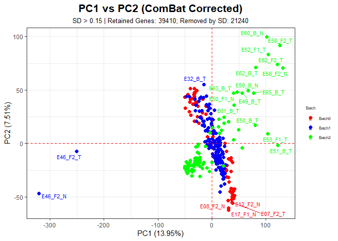<!-- --> \#
Boxplot

``` r
# 전제: rownames(combat_expr)는 유전자 이름, colnames는 샘플 이름
# metadf에는 ID (colnames와 동일)와 Group 정보가 있음

# 1. Group별 샘플 목록 생성
group_names <- unique(metadf$Group)
group_samples <- split(metadf$ID, metadf$Group) # 그룹명(Group) 기준으로 샘플 ID를 나눔

# 2. Group별 데이터프레임 생성 (GeneSymbol 포함)
group_dfs <- lapply(group_names, function(g) { # 각 그룹에 대해 유전자 × 샘플 서브셋을 생성
  df <- data.frame(GeneSymbol = rownames(combat_expr),
                   combat_expr[, group_samples[[g]], drop = FALSE],
                   check.names = FALSE)
  return(df)
})

# 3. 결과를 이름과 함께 리스트로 저장
names(group_dfs) <- paste0("df_", group_names)

# 4. 예: df_B_N, df_F2_T 등으로 개별 할당
list2env(group_dfs, envir = .GlobalEnv) # df_B_N, df_F1_T 등의 이름으로 환경에 직접 저장
```

    ## <environment: R_GlobalEnv>

``` r
ncol(df_B_N) + ncol(df_B_T) +
  ncol(df_F1_N) + ncol(df_F1_T) +
  ncol(df_F2_N) + ncol(df_F2_T)
```

    ## [1] 318

## Statistical Analysis

``` r
genes_to_analyze <- c('CLDN18', 'CLDN1', 'CLDN4', 'CLDN7', 
                      'EVA1A', 'LSR', 'PGAP3', 
                      'PKD2L1', 'GJB2', 'ALPP', 'ALPG', 'MELTF', 'BST2')
head(df_B_N$GeneSymbol)
```

    ## [1] "A1BG"     "A1BG-AS1" "A1CF"     "A2M"      "A2M-AS1"  "A2ML1"

``` r
# Check if all genes are present in df_B_N$GeneSymbol
missing_genes <- setdiff(genes_to_analyze, df_B_N$GeneSymbol)
length(missing_genes)
```

    ## [1] 0

### B_N vs B_T

``` r
# 결과 저장용 리스트
test_results <- lapply(genes_to_analyze, function(gene) {
  # 각 그룹의 발현량 벡터
  expr_N <- as.numeric(df_B_N[df_B_N$GeneSymbol == gene, -1])
  expr_T <- as.numeric(df_B_T[df_B_T$GeneSymbol == gene, -1])
  
  # 정규성 검정 (샘플 수 3 이상일 때만 의미 있음)
  p_normal_N <- if (length(expr_N) >= 3) shapiro.test(expr_N)$p.value else NA
  p_normal_T <- if (length(expr_T) >= 3) shapiro.test(expr_T)$p.value else NA
  
  # 등분산성 검정
  p_var <- var.test(expr_N, expr_T)$p.value
  
  # 결과 정리
  data.frame(
    GeneSymbol = gene,
    Normal_B_N = ifelse(!is.na(p_normal_N) & p_normal_N > 0.05, TRUE, FALSE),
    Normal_B_T = ifelse(!is.na(p_normal_T) & p_normal_T > 0.05, TRUE, FALSE),
    Equal_Variance = ifelse(p_var > 0.05, TRUE, FALSE),
    P_Normal_B_N = round(p_normal_N, 4),
    P_Normal_B_T = round(p_normal_T, 4),
    P_Equal_Var = round(p_var, 4)
  )
})

# 결과 데이터프레임으로 변환
result_df <- do.call(rbind, test_results)
result_df
```

    ##    GeneSymbol Normal_B_N Normal_B_T Equal_Variance P_Normal_B_N P_Normal_B_T
    ## 1      CLDN18      FALSE      FALSE          FALSE       0.0353       0.0047
    ## 2       CLDN1      FALSE       TRUE           TRUE       0.0009       0.5115
    ## 3       CLDN4      FALSE       TRUE           TRUE       0.0310       0.4298
    ## 4       CLDN7      FALSE       TRUE          FALSE       0.0185       0.1269
    ## 5       EVA1A      FALSE      FALSE           TRUE       0.0000       0.0318
    ## 6         LSR       TRUE      FALSE          FALSE       0.2100       0.0004
    ## 7       PGAP3      FALSE      FALSE          FALSE       0.0000       0.0000
    ## 8      PKD2L1      FALSE      FALSE          FALSE       0.0000       0.0000
    ## 9        GJB2      FALSE       TRUE          FALSE       0.0000       0.2869
    ## 10       ALPP      FALSE      FALSE          FALSE       0.0000       0.0000
    ## 11       ALPG      FALSE      FALSE          FALSE       0.0000       0.0000
    ## 12      MELTF      FALSE      FALSE          FALSE       0.0001       0.0017
    ## 13       BST2      FALSE       TRUE          FALSE       0.0331       0.1608
    ##    P_Equal_Var
    ## 1       0.0051
    ## 2       0.7961
    ## 3       0.4719
    ## 4       0.0215
    ## 5       0.4487
    ## 6       0.0003
    ## 7       0.0000
    ## 8       0.0000
    ## 9       0.0085
    ## 10      0.0000
    ## 11      0.0000
    ## 12      0.0054
    ## 13      0.0109

``` r
# 분석 결과 저장용 리스트
stat_results <- lapply(genes_to_analyze, function(gene) {
  # 발현 데이터 추출
  expr_N <- as.numeric(df_B_N[df_B_N$GeneSymbol == gene, -1])
  expr_T <- as.numeric(df_B_T[df_B_T$GeneSymbol == gene, -1])
  
  # 해당 유전자의 검정 조건 확인
  conds <- result_df[result_df$GeneSymbol == gene, ]
  use_ttest <- with(conds, Normal_B_N & Normal_B_T & Equal_Variance)
  
  # 검정 수행
  if (use_ttest) {
    test_result <- t.test(expr_N, expr_T, alternative = "less")
    test_used <- "t-test"
  } else {
    test_result <- wilcox.test(expr_N, expr_T, alternative = "less")
    test_used <- "wilcox-test"
  }
  
  pval <- round(test_result$p.value, 4)
  signif <- pval < 0.05
  
  data.frame(
    GeneSymbol = gene,
    TestUsed = test_used,
    Significant = signif,
    P_Value = pval
  )
})

# 결과 데이터프레임 생성
stat_result_B <- do.call(rbind, stat_results)
# 추후 플롯에서 factor 문제 방지 위해 문자형 변환
stat_result_B$GeneSymbol <- as.character(stat_result_B$GeneSymbol)
stat_result_B
```

    ##    GeneSymbol    TestUsed Significant P_Value
    ## 1      CLDN18 wilcox-test       FALSE  0.8549
    ## 2       CLDN1 wilcox-test        TRUE  0.0000
    ## 3       CLDN4 wilcox-test        TRUE  0.0000
    ## 4       CLDN7 wilcox-test        TRUE  0.0000
    ## 5       EVA1A wilcox-test        TRUE  0.0049
    ## 6         LSR wilcox-test        TRUE  0.0008
    ## 7       PGAP3 wilcox-test        TRUE  0.0371
    ## 8      PKD2L1 wilcox-test       FALSE  0.0693
    ## 9        GJB2 wilcox-test        TRUE  0.0000
    ## 10       ALPP wilcox-test       FALSE  0.3922
    ## 11       ALPG wilcox-test        TRUE  0.0077
    ## 12      MELTF wilcox-test        TRUE  0.0000
    ## 13       BST2 wilcox-test        TRUE  0.0235

### F1_N vs F1_T

``` r
# 결과 저장용 리스트
test_results <- lapply(genes_to_analyze, function(gene) {
  # 각 그룹의 발현량 벡터
  expr_N <- as.numeric(df_F1_N[df_F1_N$GeneSymbol == gene, -1])
  expr_T <- as.numeric(df_F1_T[df_F1_T$GeneSymbol == gene, -1])
  
  # 정규성 검정 (샘플 수 3 이상일 때만 의미 있음)
  p_normal_N <- if (length(expr_N) >= 3) shapiro.test(expr_N)$p.value else NA
  p_normal_T <- if (length(expr_T) >= 3) shapiro.test(expr_T)$p.value else NA
  
  # 등분산성 검정
  p_var <- var.test(expr_N, expr_T)$p.value
  
  # 결과 정리
  data.frame(
    GeneSymbol = gene,
    Normal_F1_N = ifelse(!is.na(p_normal_N) & p_normal_N > 0.05, TRUE, FALSE),
    Normal_F1_T = ifelse(!is.na(p_normal_T) & p_normal_T > 0.05, TRUE, FALSE),
    Equal_Variance = ifelse(p_var > 0.05, TRUE, FALSE),
    P_Normal_F1_N = round(p_normal_N, 4),
    P_Normal_F1_T = round(p_normal_T, 4),
    P_Equal_Var = round(p_var, 4)
  )
})

# 결과 데이터프레임으로 변환
result_df <- do.call(rbind, test_results)
result_df
```

    ##    GeneSymbol Normal_F1_N Normal_F1_T Equal_Variance P_Normal_F1_N
    ## 1      CLDN18       FALSE        TRUE          FALSE        0.0270
    ## 2       CLDN1       FALSE       FALSE           TRUE        0.0000
    ## 3       CLDN4       FALSE       FALSE           TRUE        0.0451
    ## 4       CLDN7        TRUE        TRUE           TRUE        0.1481
    ## 5       EVA1A       FALSE       FALSE           TRUE        0.0000
    ## 6         LSR        TRUE        TRUE          FALSE        0.1055
    ## 7       PGAP3       FALSE       FALSE          FALSE        0.0001
    ## 8      PKD2L1       FALSE       FALSE           TRUE        0.0000
    ## 9        GJB2       FALSE       FALSE          FALSE        0.0008
    ## 10       ALPP       FALSE       FALSE          FALSE        0.0000
    ## 11       ALPG       FALSE       FALSE          FALSE        0.0000
    ## 12      MELTF       FALSE       FALSE           TRUE        0.0000
    ## 13       BST2        TRUE        TRUE           TRUE        0.7227
    ##    P_Normal_F1_T P_Equal_Var
    ## 1         0.2011      0.0095
    ## 2         0.0057      0.2414
    ## 3         0.0478      0.8745
    ## 4         0.6267      0.4071
    ## 5         0.0086      0.2507
    ## 6         0.0754      0.0003
    ## 7         0.0000      0.0009
    ## 8         0.0000      0.3554
    ## 9         0.0000      0.0094
    ## 10        0.0000      0.0001
    ## 11        0.0000      0.0000
    ## 12        0.0070      0.6538
    ## 13        0.1581      0.7986

``` r
# 분석 결과 저장용 리스트
stat_results <- lapply(genes_to_analyze, function(gene) {
  # 발현 데이터 추출
  expr_N <- as.numeric(df_F1_N[df_F1_N$GeneSymbol == gene, -1])
  expr_T <- as.numeric(df_F1_T[df_F1_T$GeneSymbol == gene, -1])
  
  # 해당 유전자의 검정 조건 확인
  conds <- result_df[result_df$GeneSymbol == gene, ]
  use_ttest <- with(conds, Normal_F1_N & Normal_F1_T & Equal_Variance)
  
  # 검정 수행
  if (use_ttest) {
    test_result <- t.test(expr_N, expr_T, alternative = "less")
    test_used <- "t-test"
  } else {
    test_result <- wilcox.test(expr_N, expr_T, alternative = "less")
    test_used <- "wilcox-test"
  }
  
  pval <- round(test_result$p.value, 4)
  signif <- pval < 0.05
  
  data.frame(
    GeneSymbol = gene,
    TestUsed = test_used,
    Significant = signif,
    P_Value = pval
  )
})

# 결과 데이터프레임 생성
stat_result_F1 <- do.call(rbind, stat_results)
# 추후 플롯에서 factor 문제 방지 위해 문자형 변환
stat_result_F1$GeneSymbol <- as.character(stat_result_F1$GeneSymbol)
stat_result_F1
```

    ##    GeneSymbol    TestUsed Significant P_Value
    ## 1      CLDN18 wilcox-test       FALSE  0.9802
    ## 2       CLDN1 wilcox-test        TRUE  0.0001
    ## 3       CLDN4 wilcox-test        TRUE  0.0031
    ## 4       CLDN7      t-test       FALSE  0.0622
    ## 5       EVA1A wilcox-test       FALSE  0.0695
    ## 6         LSR wilcox-test       FALSE  0.6401
    ## 7       PGAP3 wilcox-test       FALSE  0.8494
    ## 8      PKD2L1 wilcox-test       FALSE  0.3816
    ## 9        GJB2 wilcox-test        TRUE  0.0058
    ## 10       ALPP wilcox-test       FALSE  0.8218
    ## 11       ALPG wilcox-test       FALSE  0.3804
    ## 12      MELTF wilcox-test        TRUE  0.0066
    ## 13       BST2      t-test       FALSE  0.1739

### F2_N vs F2_T

``` r
# 결과 저장용 리스트
test_results <- lapply(genes_to_analyze, function(gene) {
  # 각 그룹의 발현량 벡터
  expr_N <- as.numeric(df_F2_N[df_F2_N$GeneSymbol == gene, -1])
  expr_T <- as.numeric(df_F2_T[df_F2_T$GeneSymbol == gene, -1])
  
  # 정규성 검정 (샘플 수 3 이상일 때만 의미 있음)
  p_normal_N <- if (length(expr_N) >= 3) shapiro.test(expr_N)$p.value else NA
  p_normal_T <- if (length(expr_T) >= 3) shapiro.test(expr_T)$p.value else NA
  
  # 등분산성 검정
  p_var <- var.test(expr_N, expr_T)$p.value
  
  # 결과 정리
  data.frame(
    GeneSymbol = gene,
    Normal_F2_N = ifelse(!is.na(p_normal_N) & p_normal_N > 0.05, TRUE, FALSE),
    Normal_F2_T = ifelse(!is.na(p_normal_T) & p_normal_T > 0.05, TRUE, FALSE),
    Equal_Variance = ifelse(p_var > 0.05, TRUE, FALSE),
    P_Normal_F2_N = round(p_normal_N, 4),
    P_Normal_F2_T = round(p_normal_T, 4),
    P_Equal_Var = round(p_var, 4)
  )
})

# 결과 데이터프레임으로 변환
result_df <- do.call(rbind, test_results)
result_df
```

    ##    GeneSymbol Normal_F2_N Normal_F2_T Equal_Variance P_Normal_F2_N
    ## 1      CLDN18       FALSE        TRUE          FALSE        0.0131
    ## 2       CLDN1       FALSE       FALSE           TRUE        0.0000
    ## 3       CLDN4        TRUE       FALSE          FALSE        0.0619
    ## 4       CLDN7        TRUE        TRUE           TRUE        0.1956
    ## 5       EVA1A       FALSE       FALSE           TRUE        0.0000
    ## 6         LSR        TRUE       FALSE           TRUE        0.8971
    ## 7       PGAP3       FALSE       FALSE          FALSE        0.0019
    ## 8      PKD2L1       FALSE       FALSE          FALSE        0.0000
    ## 9        GJB2       FALSE       FALSE           TRUE        0.0003
    ## 10       ALPP       FALSE       FALSE          FALSE        0.0000
    ## 11       ALPG       FALSE       FALSE          FALSE        0.0000
    ## 12      MELTF       FALSE       FALSE           TRUE        0.0056
    ## 13       BST2       FALSE       FALSE           TRUE        0.0008
    ##    P_Normal_F2_T P_Equal_Var
    ## 1         0.0804      0.0488
    ## 2         0.0146      0.1420
    ## 3         0.0473      0.0093
    ## 4         0.4334      0.9787
    ## 5         0.0034      0.2961
    ## 6         0.0233      0.1358
    ## 7         0.0000      0.0005
    ## 8         0.0000      0.0000
    ## 9         0.0148      0.2505
    ## 10        0.0000      0.0036
    ## 11        0.0000      0.0337
    ## 12        0.0286      0.5781
    ## 13        0.0001      0.5153

``` r
# 분석 결과 저장용 리스트
stat_results <- lapply(genes_to_analyze, function(gene) {
  # 발현 데이터 추출
  expr_N <- as.numeric(df_F2_N[df_F2_N$GeneSymbol == gene, -1])
  expr_T <- as.numeric(df_F2_T[df_F2_T$GeneSymbol == gene, -1])
  
  # 해당 유전자의 검정 조건 확인
  conds <- result_df[result_df$GeneSymbol == gene, ]
  use_ttest <- with(conds, Normal_F2_N & Normal_F2_T & Equal_Variance)
  
  # 검정 수행
  if (use_ttest) {
    test_result <- t.test(expr_N, expr_T, alternative = "less")
    test_used <- "t-test"
  } else {
    test_result <- wilcox.test(expr_N, expr_T, alternative = "less")
    test_used <- "wilcox-test"
  }
  
  pval <- round(test_result$p.value, 4)
  signif <- pval < 0.05
  
  data.frame(
    GeneSymbol = gene,
    TestUsed = test_used,
    Significant = signif,
    P_Value = pval
  )
})
```

    ## Warning in wilcox.test.default(expr_N, expr_T, alternative = "less"): cannot
    ## compute exact p-value with ties
    ## Warning in wilcox.test.default(expr_N, expr_T, alternative = "less"): cannot
    ## compute exact p-value with ties
    ## Warning in wilcox.test.default(expr_N, expr_T, alternative = "less"): cannot
    ## compute exact p-value with ties
    ## Warning in wilcox.test.default(expr_N, expr_T, alternative = "less"): cannot
    ## compute exact p-value with ties

``` r
# 결과 데이터프레임 생성
stat_result_F2 <- do.call(rbind, stat_results)
# 추후 플롯에서 factor 문제 방지 위해 문자형 변환
stat_result_F2$GeneSymbol <- as.character(stat_result_F2$GeneSymbol)
stat_result_F2
```

    ##    GeneSymbol    TestUsed Significant P_Value
    ## 1      CLDN18 wilcox-test       FALSE  0.9316
    ## 2       CLDN1 wilcox-test        TRUE  0.0002
    ## 3       CLDN4 wilcox-test        TRUE  0.0001
    ## 4       CLDN7      t-test        TRUE  0.0171
    ## 5       EVA1A wilcox-test        TRUE  0.0349
    ## 6         LSR wilcox-test       FALSE  0.0730
    ## 7       PGAP3 wilcox-test       FALSE  0.4379
    ## 8      PKD2L1 wilcox-test       FALSE  0.4343
    ## 9        GJB2 wilcox-test        TRUE  0.0035
    ## 10       ALPP wilcox-test       FALSE  0.5591
    ## 11       ALPG wilcox-test       FALSE  0.3310
    ## 12      MELTF wilcox-test       FALSE  0.3984
    ## 13       BST2 wilcox-test       FALSE  0.5691

## Combine Results in Box + Violin plots

``` r
# 바이올린 + 박스 + P-value 표시 함수
make_pubr_vioplot <- function(expr_N, expr_T, label_N, label_T, stat_df, gene,
                              median_line_size = 0.6,
                              show_points = TRUE,
                              pval_y = 10) {
  df_plot <- data.frame(
    Expression = c(expr_N, expr_T),
    Group = rep(c(label_N, label_T), times = c(length(expr_N), length(expr_T)))
  )
  
  p <- ggviolin(
    df_plot,
    x = "Group", y = "Expression", fill = "Group",
    add = "boxplot",
    add.params = list(fill = "white", width = 0.1, size = median_line_size),
    palette = "jco",
    trim = FALSE
  ) +
    labs(title = paste(label_N, "vs", label_T), x = "", y = "Expression") +
    theme_minimal(base_size = 14) +
    theme(
      legend.position = "none",
      plot.title = element_text(hjust = 0.5)
    )
  
  stat_row <- stat_df[stat_df$GeneSymbol == gene, ]
  if (nrow(stat_row) == 1 && stat_row$Significant) {
    pval <- stat_row$P_Value
    p <- p + annotate("text", x = 0.4, y = pval_y,
                      label = paste0("P Val. = ", pval),
                      color = "red", size = 5, hjust = 0)
  }
  
  if (show_points) {
    p <- p + geom_jitter(width = 0.2, size = 1.5, alpha = 0.6)
  }
  
  return(p)
}

# 유전자별 하나씩 R에서 출력
for (gene in genes_to_analyze) {
  expr_B_N <- as.numeric(df_B_N[df_B_N$GeneSymbol == gene, -1])
  expr_B_T <- as.numeric(df_B_T[df_B_T$GeneSymbol == gene, -1])
  p_B <- make_pubr_vioplot(expr_B_N, expr_B_T, "B_N", "B_T", stat_result_B, gene, pval_y = 10)
  
  expr_F1_N <- as.numeric(df_F1_N[df_F1_N$GeneSymbol == gene, -1])
  expr_F1_T <- as.numeric(df_F1_T[df_F1_T$GeneSymbol == gene, -1])
  p_F1 <- make_pubr_vioplot(expr_F1_N, expr_F1_T, "F1_N", "F1_T", stat_result_F1, gene, pval_y = 10)
  
  expr_F2_N <- as.numeric(df_F2_N[df_F2_N$GeneSymbol == gene, -1])
  expr_F2_T <- as.numeric(df_F2_T[df_F2_T$GeneSymbol == gene, -1])
  p_F2 <- make_pubr_vioplot(expr_F2_N, expr_F2_T, "F2_N", "F2_T", stat_result_F2, gene, pval_y = 10)
  
  # R plot 창에 바로 출력
  grid.arrange(
    p_B, p_F1, p_F2,
    ncol = 3,
    top = textGrob(paste("Gene:", gene), gp = gpar(fontsize = 20, fontface = "bold"))
  )
}
```

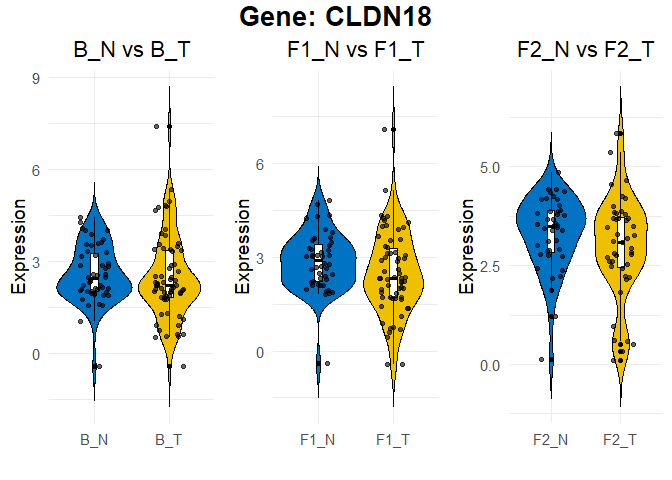<!-- -->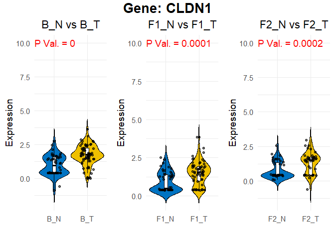<!-- -->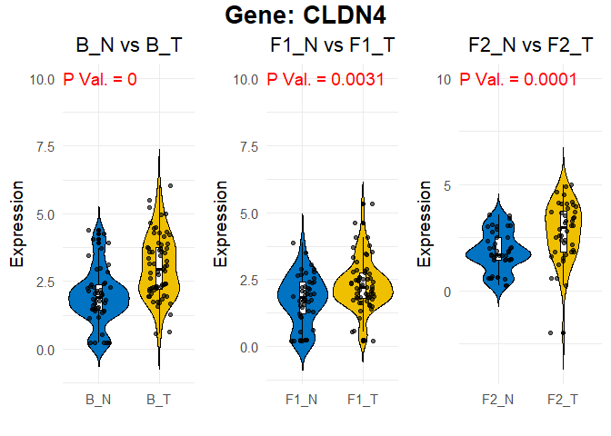<!-- -->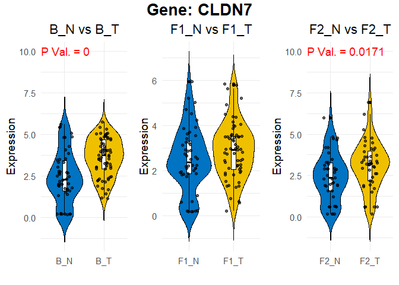<!-- -->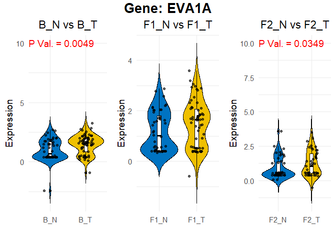<!-- --><!-- -->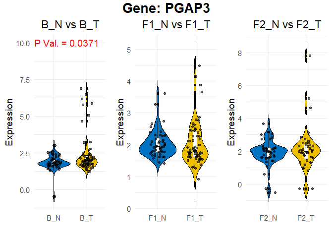<!-- -->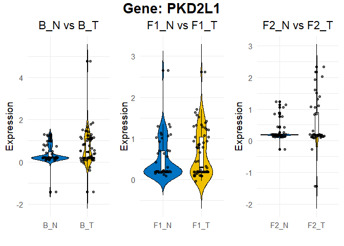<!-- -->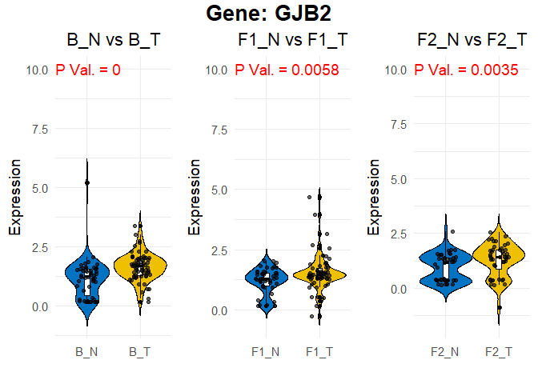<!-- -->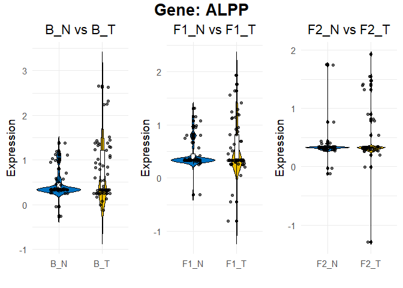<!-- -->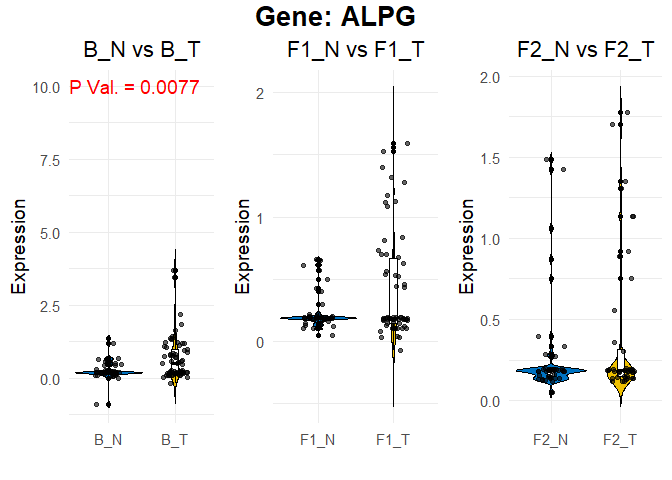<!-- -->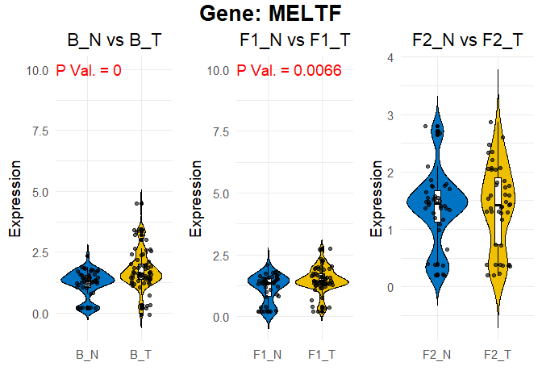<!-- -->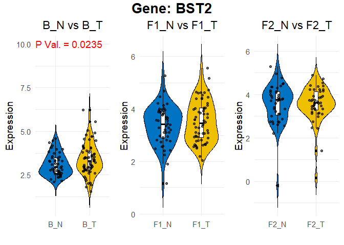<!-- -->
\### PDF

``` r
make_pubr_vioplot <- function(expr_N, expr_T, label_N, label_T, stat_df, gene,
                              median_line_size = 0.6,        # 중앙선 굵기
                              show_points = FALSE,
                              pval_y = 10) {  # P-value 텍스트 y위치 고정
  df_plot <- data.frame(
    Expression = c(expr_N, expr_T),
    Group = rep(c(label_N, label_T), times = c(length(expr_N), length(expr_T)))
  )
  
  # 기본 바이올린 + 박스 플롯
  p <- ggviolin(
    df_plot,
    x = "Group", y = "Expression", fill = "Group",
    add = "boxplot",
    add.params = list(fill = "white", width = 0.1, size = median_line_size),  # 중앙선 두께 조절
    palette = "jco",
    trim = FALSE
  ) +
    labs(title = paste(label_N, "vs", label_T), x = "", y = "Expression") +
    theme_minimal(base_size = 14) +
    theme(
      legend.position = "none",
      plot.title = element_text(hjust = 0.5)
    )
  
  # 유의성 표시
  stat_row <- stat_df[stat_df$GeneSymbol == gene, ]
  if (nrow(stat_row) == 1 && stat_row$Significant) {
    pval <- stat_row$P_Value
    p <- p + annotate("text", x = 0.4, y = pval_y,
                      label = paste0("P Val. = ", pval), # 유의성 텍스트 위치 고정
                      color = "red", size = 5, hjust = 0)
  }
  
  # jitter 추가 여부
  if (show_points) {
    p <- p + geom_jitter(width = 0.2, size = 1.5, alpha = 0.6)
  }
  
  return(p)
}

# PDF 저장
pdf("selected_gene_expression_violin_boxplots.pdf", width = 8.33, height = 6.25)

for (gene in genes_to_analyze) {
  expr_B_N <- as.numeric(df_B_N[df_B_N$GeneSymbol == gene, -1])
  expr_B_T <- as.numeric(df_B_T[df_B_T$GeneSymbol == gene, -1])
  p_B <- make_pubr_vioplot(expr_B_N, expr_B_T, "B_N", "B_T", stat_result_B, gene)
  
  expr_F1_N <- as.numeric(df_F1_N[df_F1_N$GeneSymbol == gene, -1])
  expr_F1_T <- as.numeric(df_F1_T[df_F1_T$GeneSymbol == gene, -1])
  p_F1 <- make_pubr_vioplot(expr_F1_N, expr_F1_T, "F1_N", "F1_T", stat_result_F1, gene)
  
  expr_F2_N <- as.numeric(df_F2_N[df_F2_N$GeneSymbol == gene, -1])
  expr_F2_T <- as.numeric(df_F2_T[df_F2_T$GeneSymbol == gene, -1])
  p_F2 <- make_pubr_vioplot(expr_F2_N, expr_F2_T, "F2_N", "F2_T", stat_result_F2, gene)
  
  # 가로 배치로 한 페이지 출력
  grid.arrange(
    p_B, p_F1, p_F2,
    ncol = 3,
    top = textGrob(paste("Gene:", gene), gp = gpar(fontsize = 20, fontface = "bold"))
  )
}

dev.off()
```

    ## png 
    ##   2
